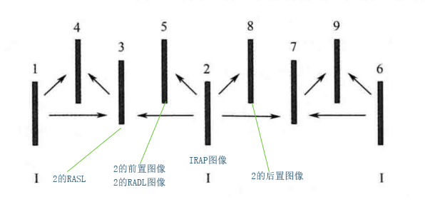
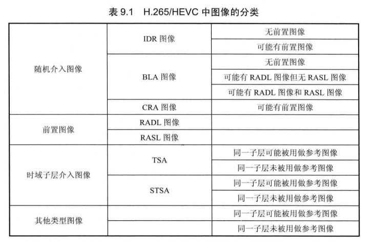
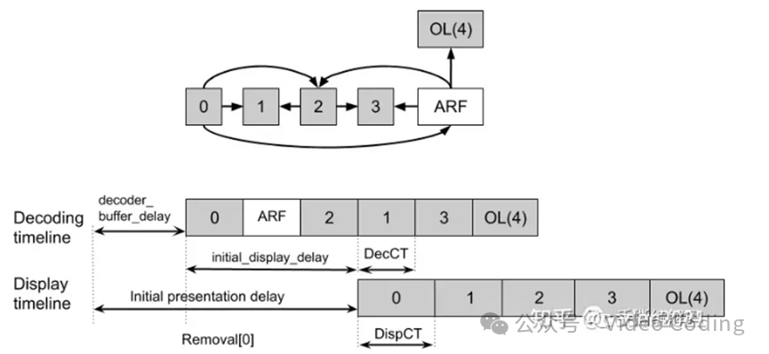

# 1.块划分方式

## h264:

 采用四叉树划分或者二分划分，宏块大小固定16x16

## h265:

 采用四叉树划分或者二分划分最大64X64

## av1: 

四叉树 + 二分 + NX4N +  一边二分一边不分（T字） 最大128x128（superblock）

--------------------------------------------------------
# 2.帧内预测模式：

## h264:

​    16X16块 有 DC + Planer + 水平 + 垂直 4 种
​    4X4块  有DC + 水平 + 垂直 + 6 种角度预测

## h265: 

​    DC + Planer + 33 种角度预测

## av1:

​    DC_PRED = 0,  
​	V_PRED,
​	H_PRED,
​	D45_PRED,
​	D135_PRED,
​	D113_PRED,
​	D157_PRED,
​	D203_PRED,
​	D67_PRED,
​	SMOOTH_PRED,
​	SMOOTH_V_PRED,
​	SMOOTH_H_PRED,
​	PAETH_PRED,
​	UV_CFL_PRED 

- 总结： dc + 3种 smoooth + PAETH_PRED + 
           角度预测(分别是 V + H +DXXX 一共八种分别前后补充三个间隔3度的模式，
           一共是 7 X8  = 56 种，这里把V ， H 本身也计入角度模式)
- ​    另外还有四种 interintra 模式
  ​        II_DC_PRED = 0,
  ​        II_V_PRED,
  ​        II_H_PRED,
  ​        II_SMOOTH_PRED,

    相关逻辑 看 predict_intra函数 
----------------------
# 3.熵编码

## h264 :

CAVLC/CABAC 自适应变长编码/自适应二进制算术编码
    RBSP = SODB + 对齐字节

## h265: 

CABAC 自适应二进制算术编码

## av1：

CDF 非二进制算术编码

# 4.语法元素的解析方式

## h264 :

0阶指数哥伦布编码用于语法元素

若使用cavlc，则其只用于残差

cabac可用于语法元素或者残差

## h265: 

cabac用于残差和部分语法元素

vps sps pps 内的大部分语法元素都使用0阶指数哥伦布编码

## av1：

tile内所有语法元素/系数 都适用cdf进行编码、解析，之上的都是直接读

# 5.并行技术

## h264 :

​    图像/slice级别并行，2d-wave

## h265: 

​    wpp：entropy_coding_sync_enabled为1会在行头进行熵概率更新。则行与行之间的熵编码可并行。
​    gop/图像/slice/tile/ctb级别的并行

## av1 :

伪WPP 熵编码解码过程无法并行，其余步骤可并行
帧间并行

av1通用 并行编码方案：

# 6.变换系数扫描方式

## h264：

zig-zag

逆场扫描，用于场模式

## h265：

（没有zig-zag，只有类似的对角扫描，除了对角，还有水平，垂直共三种）

1.块被分成4X4进行扫描

2.块内的4X4之间与4X4内按照同样的方式进行扫描，都是对角或者都是垂直水平

## av1：

垂直 + 水平 + zig-zag + 对角

# 7.量化

 量化矩阵：使用量化矩阵，则块内的不同位置的实际量化值有区别，有一个映射值

## h264

h264中没有直接提出量化矩阵的概念，但是有一个 dct变换中的 ⊗E ，点乘一个常数矩阵的操作，和量化矩阵有些类似

量化参数的是编码 差值进入码流，解码的时候用预测值和差值相加的到实际的量化参数qp

  

## h265

hevc 存在qg的概念（量化组）qg内使用同样的量化参数，qg小于等于最大cb的大小，大于等于最小cb的大小

## av1

using_qmatrix 语法元素决定是否使用 量化矩阵

# 8.变换

## H264:

dct变换，Hadamard变换用于 **色度块** 或者  **帧内16X16的亮度块**** 

Hadamard 取2X2个4X4块中的每个dc系数组成 2X2 矩阵进行变换

## H265:

dct  dst  walsh-hadamard（由于划分TU，不像那样固定宏块大小，一个tu就一个dc系数，无法保证dc能够形成矩阵，所以 并未使用）

## AV1:

DCT  ADST   IDENTITY 这三种自由组合 两次一维变换，还包括flip版本的

identity 是简单的乘法

还有一个walsh-hadamard 用于LOSSLESS无损模式 只有4X4版本

# 9.MV预测方式

​       指 mv 本身的的预测值，加上mv的残差值，组成真正的mv

## 1.H264:

   定义A,B,C三个mv预测值，分别为左边，上边，右上的mv值

   取A,左边不止一个以左边最上方为准

   取B,上边不止一个以上边最左边为准

1） 传输分割不包括 16×8 和 8×16 时，MVp 为 A、B、C 分割 MV 的中值；
2） 16×8 分割，上面部分 MVp 由 B 预测，下面部分 MVp 由 A 预测；
3） 8×16 分割，左面部分 MVp 由 A 预测，右面部分 MVp 由 C 预测；
4） 跳跃宏块（skipped MB），同 1）。

##  2.H265:

 merge ： mv 由相邻的块的mv 直接得来，没有 mv 残差

 amvp： 有mv残差

 

## 3.AV1:

mv也采用 预测 + 残差的方式

mv预测过程 ：find_mv_stack 比较复杂

# 10.图像类型

## h264

 I/P/B  还有SP/SI SP:参考不同的图像构建相同的图像,主要用于流的切换

SP 分为主SP/辅SP 主SP仍然属于当前流，辅SP不属于当前流

P 帧与 SI 帧均可用于流间切换。当视频流的内容相同，编码参数不同采用 SP 帧；
而当视频流的内容相差很大时，则采用 SI 帧将更加有效

## h265

IRAP:随机介入点，只是一个点，不代表某个帧，从IRAP开始，后续图像可以独立解码，不必参考IRAP前面的图像

IRAP图像：是指 IRAP之后的第一张图像，其肯定是只包含帧内编码片，但是只包含帧内编码片的图像不一定是IRAP图像

IRAP前置图像：是指解码顺序在IRAP之后，但是显示顺序在IRAP之前的图像

IRAP后置图像： 是指显示顺序在IRAP之后的图像(其解码顺序必然在IRAP之后)

(IRAP)前置图像可分为以下两种，

- RADL图像：不依赖IRAP的图像
- RASL图像：依赖IRAP前的图像

IRAP可分为以下三种

- IDR ：后续码流完全不依赖其前方的码流，其前置图像也就必须是RADL

- CRA：允许前置图像是RASL,如果直接从CRA介入，则其RASL 是无法解码的

- BLA: 当CRA明确指定 其RASL不解码的时候 ，就是BLA

  

## av1：

​	KEY_FRAME:也就是 IDR

​	INTER_FRAME: P/B

​	INTRA_ONLY_FRAME: 普通I帧，后续的帧有可能参考 INTRA_ONLY_FRAME前面的帧

​	SWITCH_FRAM: 码流切换分辨率的时候使用 类似于264中的SP/SI

  decode picture buffer 中最多放8个帧 ，其中七个可以作为参考帧，分为7种类型，如下：

LAST_FRAME：POC小于当前帧的图像中最近的帧

LAST2_FRAME：POC小于当前帧的图像中第二接近的帧

LAST3_FRAME：POC小于当前帧的图像中第三接近的帧

GOLDEN_FRAME：POC小于当前帧的I帧或者GPB帧，类似于长期参考帧

BWDREF_FRAME：POC大于当前帧的图像中最接近当前帧的

ALTREF2_FRAME：POC大于当前帧的图像中第二接近当前帧的

ALTREF_FRAME：POC大于当前帧的图像中离当前帧最远的图像

ARF（Alternate Reference Frame）帧：也就是 ALTREF2_FRAME/ALTREF_FRAME

帧是一类特殊参考帧，它会被编码并在DFB中存储用于其他帧的帧间预测参考，但是不会在解码端显示。它对应的**showable_frame**语法元素值为0

ARF帧往往是对原始帧们进行时域滤波处理，以降低原始帧里的噪声而得到的帧，用它作为参考帧可以提高视频编码的性能

# 11.插值

## h264:

亮度：半像素使用一个六抽头滤波器。四分之一处由半像素出直接线性平均得来，对角处也采用对角平均

## h265:

亮度：半像素处使用一个八抽头滤波器，四分之一和四分之三处使用一个七抽头滤波器

​		   色度:以八分之一为单位，每个增加八分之一，都更换一种滤波器，但都是四抽头滤波器

​		 hevc中插值之后的值会对像素放大，之后会在加权预测过程中缩回去

## av1：

插值滤波器有    EIGHTTAP ,EIGHTTAP_SMOOTH ， EIGHTTAP_SHARP = 2, 三种滤波器，其中前两种为六抽头

​       第三种为八抽头

​      先进行水平方向上的插值，再进行垂直方向上的插值

​       当块的size小于等于4的时候，通过映射使用两种四抽头滤波器

# 12.加权预测

加权预测是对**非参考帧**已经预测出来的像素进行修正

## h264:

​	implict: 加权系数 由 当前到list0 list1参考图像的距离推出

​	explict: 加权系数保存在 sliceheader中

## h265:

​	默认加权预测：

​      explict：加权系数需要读取，分布在pps和sliceheader中

​      H265加权预测过程中还需要对像素进行缩小以抵消之前插值放大的部分

## av1：

 av1中加权预测逻辑看 predict_inter 最后面那一部分

​      COMPOUND_DISTANCE 需要使用加权系数

​    COMPOUND_AVERAGE 没有加权系数

   或者

​    COMPOUND_WEDGE = 0,

​    COMPOUND_DIFFWTD,

​    COMPOUND_AVERAGE,

这三种是mask模式，会根据mask值来生成加权系数

# 13.参考帧管理

h264

h265

av1:av1中没有poc,

为了按正确顺序播放帧AV1采用show_frame / showable_frame / show_existing_frame机制来完成这一功能。这三个语法元素都写在frame_header中

show_frame：当前帧解码完后是否立刻输出。对于解码顺序在播放顺序前的帧该值为0。

showable_frame:这个标志只在show_frame=0时有意义，它是指当前帧是否可以显示。AV1有一个ARNR技术，它会对GPB帧进行一些时域滤波产生ARF帧，ARF帧只用作参考而不显示。

show_existing_frame：输出图像是否已经在DPB中。这个语法元素是为了显示那些延迟输出的图像。

frame_to_show_map_idx：当show_existing_frame=1时输出对应帧。

AV1通过语法元素refresh_frame_flags 来管理DFB状态。refresh_frame_flags 是一个8比特数据，每一位对应DFB中的一个位置，某位置1表示当前帧解码后替换DFB中的该帧

DFB具体更新过程为：

1、每帧图像编码前根据帧类型和其在GOP中的位置决定更新类型frame_update_type。

2、DPB中的帧根据和当前帧的位置关系等被分为三类：arf_stack、lst_stack、gld_stack。每类包含对应类型的参考帧。

1、当前帧编码完后检查DFB是否填满，若未填满则将当前帧加入DFB。若DFB已填满则根据每类帧的数量和类型选择最老的一帧替换掉。并根据该帧在DFB中的位置计算refresh_frame_flags 

参考列表构建：
	DFB构建完毕后当前帧需要使用DFB中的帧构建自己的参考列表，av1规定参考列表只能包含7帧。

- DPB中的帧被分为三类：arf_stack、lst_stack、gld_stack。

- 确定后向的参考帧,将arf_stack中的POC最大的帧作为ALTREF_FRAME（这一帧一般是当前GOP的GPB）；如果alt_stack中还有其他帧，则第0帧作为BWDREF_FRAME，第1帧作为ALTREF2_FRAME。若alf_stack中只有1帧则将其作为BWDREF_FRAME。

- 确定前向的参考帧,将lst_stack中的第0帧作为LAST_FRAME，第1帧作为LAST2_FRAME，如果lst_stack中还有帧则将第2帧作为LAST3_FRAME。

- 确定GOLDEN_FRAME,将golden_stack中的第0帧作为GOLDEN_FRAME，若golden_stack中还有帧且BWDREF_FRAME或者ALTREF_FRAME或者LAST3_FRAME未被指定，则用第1帧填充。

- 从后向前检查所有帧类型是否都已经被指定，如果还有一些帧还没有被指定，那么它分别在arf_ref、last_ref和golden_ref队列中寻找仍然没有被分配的帧，并将它指定为所需要的帧类型。

- 如果有些参考帧类型仍然没有被指定，那就将golden_ref中的第0帧指定为该类型的参考帧。

- 填充之后所有类型的参考帧都是可用的。编码器会记录下所有类型的参考帧在DPB中的位置，并把结果写入码流。这样解码器拿到DFB之后立刻就可以组合出参考帧队列。

- 这些参考帧类型有可能会有重复。在实际编码时需要进行去重，避免重复搜索
  

**参考列表如何在码流中传输**？构建完参考列表后需要在码流中写入每个参考帧对应在DFB中的位置，相关语法元素为ref_frame_idx

ref_frame_idx[i]

其中 i0-6，0表示LAST_FRAME,1表示LAST2_FRAME，2表示LAST3_FRAME，3表示GOLDEN_FRAME，4表示BWDREF_FRAME，5表示ALTREF2_FRAME，6表示ALTREF_FRAME。那ref_frame_idx[LAST_FRAME]=5 就表示DPB 下标为5的位置上存在的帧(ref_frame_map[5])就是当前帧的LAST_FRAME。

ref_frame_idx的值有2种传输方式，当frame_refs_short_signaling=0的时候，所有的参考值都是显示传递的，也就是直接通过码流读取到的，当frame_refs_short_signaling=1的时候，只有last_frame_idx和gold_fame_idx是显示传递的，其他参考值则是通过计算得到的。

ARF（Alternate Reference Frame）帧是一类特殊参考帧，它会被编码并在DFB中存储用于其他帧的帧间预测参考，但是不会在解码端显示。它对应的showable_frame语法元素值为0。

ARF帧往往是对原始帧们进行时域滤波处理，以降低原始帧里的噪声而得到的帧，用它作为参考帧可以提高视频编码的性能

上图是含有ARF的AV1编码结构，这里的GOP大小4，灰色框表示的是需要显示的帧，ARF不需要显示用白色表示。

从上图可以看出，每一帧在显示之前需要完成解码，且ARF帧的解码顺序很靠前。这是因为通常ARF帧是时域滤波处理得到的，而时域滤波处理一般只对低layer的帧进行，这也意味着，在一个GOP里面并不是谁都可以成为ARF帧。

因为ARF帧解码后不显示，这会导致编码器送入的帧会比播放端的帧多，这时就需要overlay帧和ARF帧配合使用，这个Overlay它会以（相同帧号的）ARF作为参考帧进行预测编码得到压缩码流，当在解码端解码以后，可以显示它的画面，而且它自身不会被用来作参考帧

