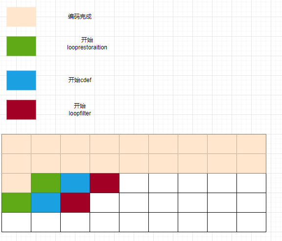
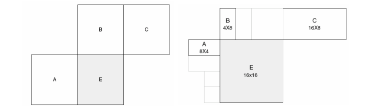

# 1.块划分方式

- h264: 采用四叉树划分或者二分划分，宏块大小固定16x16
- h265: 采用四叉树划分或者二分划分最大64X64
- av1: 四叉树 + 二分 + NX4N +  一边二分一边不分（T字） 最大128x128（superblock）

--------------------------------------------------------
# 2.帧内预测模式：

- h264:
      16X16块 有 DC + Planer + 水平 + 垂直 4 种
      4X4块  有DC + 水平 + 垂直 + 6 种角度预测

- h265: 
      DC + Planer + 33 种角度预测

- av1:
      DC_PRED = 0,  
  	V_PRED,
  	H_PRED,
  	D45_PRED,
  	D135_PRED,
  	D113_PRED,
  	D157_PRED,
  	D203_PRED,
  	D67_PRED,
  	SMOOTH_PRED,
  	SMOOTH_V_PRED,
  	SMOOTH_H_PRED,
  	PAETH_PRED,
  	UV_CFL_PRED 
-    总结： dc + 3种 smoooth + PAETH_PRED + 
              角度预测(分别是 V + H +DXXX 一共八种分别前后补充三个间隔3度的模式，
              一共是 7 X8  = 56 种，这里把V ， H 本身也计入角度模式)
- ​    另外还有四种 interintra 模式
  ​        II_DC_PRED = 0,
  ​        II_V_PRED,
  ​        II_H_PRED,
  ​        II_SMOOTH_PRED,

    相关逻辑 看 predict_intra函数 
----------------------
# 3.熵编码

- h264 :CAVLC/CABAC 自适应变长编码/自适应二进制算术编码
         RBSP = SODB + 对齐字节
- h265: CABAC 自适应二进制算术编码
- av1：CDF 非二进制算术编码

# 4.语法元素的解析方式

- h264 :

  0阶指数哥伦布编码用于语法元素

  若使用cavlc，则其只用于残差

  cabac可用于语法元素或者残差

- h265: 

  cabac用于残差和部分语法元素

  vps sps pps 内的大部分语法元素都使用0阶指数哥伦布编码

- av1：tile内所有语法元素/系数 都适用cdf进行编码、解析，之上的都是直接读

# 5.并行技术

- h264 :
      图像/slice级别并行，2d-wave

- h265: 
      wpp：entropy_coding_sync_enabled为1会在行头进行熵概率更新。则行与行之间的熵编码可并行。
      gop/图像/slice/tile/ctb级别的并行

- av1 :
     伪WPP 熵编码解码过程无法并行，其余步骤可并行
     帧间并行

     av1通用 并行编码方案：

# 6.变换系数扫描方式

- h264：

  zig-zag

  逆场扫描，用于场模式

- h265：（没有zig-zag，只有类似的对角扫描，除了对角，还有水平，垂直共三种）

   1.块被分成4X4进行扫描

   2.块内的4X4之间与4X4内按照同样的方式进行扫描，都是对角或者都是垂直水平

   

- av1：垂直 + 水平 + zig-zag + 对角

# 7.量化

 量化矩阵：使用量化矩阵，则块内的不同位置的实际量化值有区别，有一个映射值

- h264

   h264中没有直接提出量化矩阵的概念，但是有一个 dct变换中的 ⊗E ，点乘一个常数矩阵的操作，和量化矩阵有些类似

   量化参数的是编码 差值进入码流，解码的时候用预测值和差值相加的到实际的量化参数qp

  

- h265

  hevc 存在qg的概念（量化组）qg内使用同样的量化参数，qg小于等于最大cb的大小，大于等于最小cb的大小

  

- av1

  using_qmatrix 语法元素决定是否使用 量化矩阵

  

  

  

  

  

# 8.变换

- H264:

  dct变换，Hadamard变换用于 **色度块** 或者  **帧内16X16的亮度块**** 

  Hadamard 取2X2个4X4块中的每个dc系数组成 2X2 矩阵进行变换

- H265:

  dct  dst  walsh-hadamard（由于划分TU，不像那样固定宏块大小，一个tu就一个dc系数，无法保证dc能够形成矩阵，所以 并未使用）

- AV1:

  DCT  ADST   IDENTITY 这三种自由组合 两次一维变换，还包括flip版本的

  identity 是简单的乘法

  还有一个walsh-hadamard 用于LOSSLESS无损模式 只有4X4版本

# 9.MV预测方式

​       指 mv 本身的的预测值，加上mv的残差值，组成真正的mv

- H264:

  

     定义A,B,C三个mv预测值，分别为左边，上边，右上的mv值

     取A,左边不止一个以左边最上方为准

     取B,上边不止一个以上边最左边为准

  1） 传输分割不包括 16×8 和 8×16 时，MVp 为 A、B、C 分割 MV 的中值；
  2） 16×8 分割，上面部分 MVp 由 B 预测，下面部分 MVp 由 A 预测；
  3） 8×16 分割，左面部分 MVp 由 A 预测，右面部分 MVp 由 C 预测；
  4） 跳跃宏块（skipped MB），同 1）。

- H265:

  

   merge ： mv 由相邻的块的mv 直接得来，没有 mv 残差

   amvp： 有mv残差

   

- AV1:

  

  mv也采用 预测 + 残差的方式

  mv预测过程 ：find_mv_stack 比较复杂

# 10.图像类型

av1：

  参考帧类型

LAST_FRAME：POC小于当前帧的图像中最近的帧

LAST2_FRAME：POC小于当前帧的图像中第二接近的帧

LAST3_FRAME：POC小于当前帧的图像中第三接近的帧

GOLDEN_FRAME：POC小于当前帧的I帧或者GPB帧，类似于长期参考帧

BWDREF_FRAME：POC大于当前帧的图像中最接近当前帧的

ALTREF2_FRAME：POC大于当前帧的图像中第二接近当前帧的

ALTREF_FRAME：POC大于当前帧的图像中离当前帧最远的图像

# 11.插值

h264:亮度：半像素使用一个六抽头滤波器。四分之一处由半像素出直接线性平均得来，对角处也采用对角平均

h265:亮度：半像素处使用一个八抽头滤波器，四分之一和四分之三处使用一个七抽头滤波器

​		   色度:以八分之一为单位，每个增加八分之一，都更换一种滤波器，但都是四抽头滤波器

av1：插值滤波器有    EIGHTTAP ,EIGHTTAP_SMOOTH ， EIGHTTAP_SHARP = 2, 三种滤波器，其中前两种为六抽头

​       第三种为八抽头

​      先进行水平方向上的插值，再进行垂直方向上的插值

​       当块的size小于等于4的时候，通过映射使用两种四抽头滤波器

# 12.加权预测

加权预测是对非参考帧已经预测出来的像素进行修正

av1： av1中加权预测逻辑看 predict_inter 最后面那一部分

