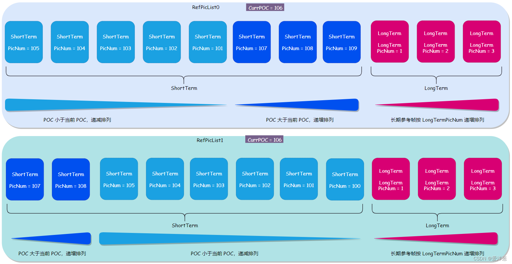

# 0.视频质量评价指标

## SAD

SAD（Sum of Absolute Difference）=SAE（Sum of Absolute Error)即绝对误差和

## SATD

SATD（Sum of Absolute Transformed Difference）即hadamard变换后再绝对值求和

## SSD

SSD（Sum of Squared Difference）=SSE（Sum of Squared Error)即差值的平方和

## MAD

MAD（Mean Absolute Difference）=MAE（Mean Absolute Error)即平均绝对差值

## MSD

MSD（Mean Squared Difference）=MSE（Mean Squared Error）即平均平方误差

## PSNR

PSNR Peak Signal-to-Noise Ratio”，直译为中文就是峰值信噪比

# 1.块划分方式

## h264:

 每个宏块大小固定16x16

子宏块采用四叉树划分或者二分划分

B_Skip 类型宏块：

- 无像素残差，无运动矢量残差（MVD）。 解码时，通过Direct预测模式（时间或空间）计算出前、后向MV后，直接利用前、后向MV得到像素预测值。像素重构值=像素预测值

P_Skip 类型宏块：

- 无像素残差，无运动矢量残差（MVD）。也就是COPY宏块。直接利用预测 MV 得到像素预测值。像素重构值=像素预测值。

B_Direct_16x16 类型宏块 ：

- 有像素残差，无运动矢量残差（MVD）。解码时，通过Direct预测模式（时间或空间）计算出前、 后MV后，利用前、后MV得到像素预测值。然后，像素重构值=像素预测值+像素残差解码值。

## h265:

 采用四叉树划分或者二分划分，最大64X64

## av1: 

四叉树 + 二分 + NX4N +  一边二分一边不分（T字） 最大128x128（superblock）

partition：相当于CTU的定位，固定大小（64x64，启用superblock的时候为128X 128）

block

# 2.参数集以及重要结构：

## h264:	

​	SPS + PPS 

### sps ：

**profile_idc**、 **level_idc** 指明所用 profile、level。
constraint_set0_flag 等于 1 时表示必须遵从附录 A.2.1 所指明的所有制约条件。等于 0 时表示不必遵从所有条件。
**constraint_set1_flag** 等于 1 时表示必须遵从附录 A.2.2 所指明的所有制约条件。等于 0 时表示不必遵从所有条件。
**constraint_set2_flag** 等于 1 时表示必须遵从附录 A.2.3 所指明的所有制约条件。等于 0 时表示不必遵从所有条件。
注意： 当 constraint_set0_flag,constraint_set1_flag,constraint_set2_flag 中的两个以上等于 1 时，A.2
中的所有制约条件都要被遵从。

**reserved_zero_5bits** 在目前的标准中本句法元素必须等于 0，其他的值保留做将来用，解码器应该忽略本句法元素的值。
**seq_parameter_set_id** 指明本序列参数集的 id 号，这个 id 号将被 picture 参数集引用，本句法元素的值应该在[0，31]。
注意：当编码器需要产生新的序列参数集时，应该使用新的 seq_parameter_set_id,即使用新的序列参
数集，而不是去改变原来的参数集中的内容

**log2_max_frame_num_minus4** 这个句法元素主要是为读取另一个句法元素 frame_num (在sliceheader中)服务的，frame_num 

是最重要的句法元素之一，它标识所属图像的解码顺序。可以在句法表看到，fram-num的解码函数是 ue（v），函数中的 v 在这里指定：
		
$$
v = log2_max_frame_num_minus4 + 4
$$
从另一个角度看，这个句法元素同时也指明了 frame_num 的所能达到的最大值：
		
$$
MaxFrameNum = 2( log2_max_frame_num_minus4 + 4 )
$$
变量 MaxFrameNum 表示 frame_num 的最大值，在后文中可以看到，在解码过程中它也是一个非常
重要的变量。
值得注意的是 frame_num 是循环计数的，即当它到达 MaxFrameNum 后又从 0 重新开始新一轮
的计数。解码器必须要有机制检测这种循环，不然会引起类似千年虫的问题，在图像的顺序上造成
混乱。在第八章会详细讲述 H.264 检测这种循环的机制。

**pic_order_cnt_type** 指明了 poc (picture order count) 的编码方法，poc 标识图像的播放顺序。由于
H.264 使用了 B 帧预测，使得图像的解码顺序并不一定等于播放顺序，但它们之间存在一定的映射
关系。poc 可以由 frame-num 通过映射关系计算得来，也可以索性由编码器显式地传送。H.264 中一
共定义了三种 poc 的编码方法，这个句法元素就是用来通知解码器该用哪种方法来计算 poc。而以下
的几个句法元素是分别在各种方法中用到的数据。
在如下的视频序列中本句法元素不应该等于 2:

- 一个非参考帧的接入单元后面紧跟着一个非参考图像(指参考帧或参考场)的接入单元
- 两个分别包含互补非参考场对的接入单元后面紧跟着一个非参考图像的接入单元.
- 一个非参考场的接入单元后面紧跟着另外一个非参考场,并且这两个场不能构成一个互补场对


**log2_max_pic_order_cnt_lsb_minus4** 指明了变量 MaxPicOrderCntLsb 的值:
$$
MaxPicOrderCntLsb = 2( log2_max_pic_order_cnt_lsb_minus4 + 4 )
$$
该变量在 pic_order_cnt_type = 0 时使用。

该变量在 pic_order_cnt_type = 0 时使用。

**delta_pic_order_always_zero_flag** 等于 1 时,句法元素 delta_pic_order_cnt[0]和 delta_pic_order_cnt[1]不在片头出现,并且它们的值默认为 0; 本句法元素等于 0 时,上述的两个句法元素将在片头出现。offset_for_non_ref_pic 被用来计算非参考帧或场的 picture order count (在 8.2.1),本句法元素的值应
该在[-231 , 231 – 1]。

**offset_for_top_to_bottom_field** 被用来计算帧的底场的 picture order count (在 8.2.1), 本句法元素的值应该在[-231 , 231 – 1]。

**num_ref_frames_in_pic_order_cnt_cycle** 被用来解码 picture order count (在 8.2.1),本句法元素的值应该在[0,255]。

**offset_for_ref__frame**[i] 在 picture order count type=1 时用，用于解码 POC，本句法元素对循环num_ref_frames_in_pic_order_cycle 中的每一个元素指定一个偏移。

**num_ref_frames** 指定参考帧队列可能达到的最大长度，解码器依照这个句法元素的值开辟存储区，这个存储区用于存放已解码的参考帧，H.264 规定最多可用 16 个参考帧，本句法元素的值最大为 16。值得注意的是这个长度以帧为单位，如果在场模式下，应该相应地扩展一倍。

**gaps_in_frame_num_value_allowed_flag** 这个句法元素等于 1 时，表示允许句法元素 frame_num 可以不连续。当传输信道堵塞严重时，编码器来不及将编码后的图像全部发出，这时允许丢弃若干帧图像。在正常情况下每一帧图像都有依次连续的 frame_num 值，解码器检查到如果 frame_num 不连续，便能确定有图像被编码器丢弃。这时，解码器必须启动错误掩藏的机制来近似地恢复这些图像，因为这些图像有可能被后续图像用作参考帧。当这个句法元素等于 0 时，表不允许 frame_num 不连续，即编码器在任何情况下都不能丢弃图像。这时，H.264 允许解码器可以不去检查 frame_num 的连续性以减少计算量。这种情况下如果依然发生 frame_num 不连续，表示在传输中发生丢包，解码器会通过其他机制检测到丢包的发生，然后启动错误掩藏的恢复图像。

**pic_width_in_mbs_minus1** 本句法元素加 1 后指明图像宽度，以宏块为单位：
		PicWidthInMbs = pic_width_in_mbs_minus1 + 1
通过这个句法元素解码器可以计算得到亮度分量以像素为单位的图像宽度：
		PicWidthInSamplesL = PicWidthInMbs * 16
从而也可以得到色度分量以像素为单位的图像宽度：
		PicWidthInSamplesC = PicWidthInMbs * 8
以上变量 PicWidthInSamplesL、PicWidthInSamplesC 分别表示图像的亮度、色度分量以像素为单位的宽。H.264 将图像的大小在序列参数集中定义，意味着可以在通信过程中随着序列参数集动态地改变图像的大小，在后文中可以看到，甚至可以将传送的图像剪裁后输出。

**pic_height_in_map_units_minus1** 本句法元素加 1 后指明图像高度：
PicHeightInMapUnits = pic_height_in_map_units_minus1 + 1
PicSizeInMapUnits = PicWidthInMbs * PicHeightInMapUnits
图像的高度的计算要比宽度的计算复杂，因为一个图像可以是帧也可以是场，从这个句法元素可以在帧模式和场模式下分别计算出出亮度、色度的高。值得注意的是，这里以 map_unit 为单位，map_unit的含义由后文叙述。

**frame_mbs_only_flag** 本句法元素等于 0 时表示本序列中所有图像的编码模式都是帧，没有其他编码模式存在；本句法元素等于 1 时 ，表示本序列中图像的编码模式可能是帧，也可能是场或帧场自适应，某个图像具体是哪一种要由其他句法元素决定。结合 map_unit 的含义，这里给出上一个句法元素 pic_height_in_map_units_minus1 的进一步解析步骤：当 frame_mbs_only_flag 等于１，pic_height_in_map_units_minus1 指的是一个 picture 中帧的高度；当frame_mbs_only_flag 等于０，pic_heght_in_map_units_minus1 指的是一个 picture 中场的高度，所以可以得到如下以宏块为单位的图像高度：
FrameHeightInMbs = ( 2 – frame_mbs_only_flag ) * PicHeightInMapUnits
PictureHeightInMbs= ( 2 – frame_mbs_only_flag ) * PicHeightInMapUnits

**mb_adaptive_frame_field_flag** 指明本序列是否属于帧场自适应模式。mb_adaptive_frame_field_flag等于１时表明在本序列中的图像如果不是场模式就是帧场自适应模式，等于０时表示本序列中的图像如果不是场模式就是帧模式,以下列举了一个序列中可能出现的编码模式：
	a. 全部是帧，对应于 frame_mbs_only_flag =1 的情况。
	b. 帧和场共存。frame_mbs_only_flag =0, mb_adaptive_frame_field_flag =0
	c. 帧场自适应和场共存。frame_mbs_only_flag =0, mb_adaptive_frame_field_flag =1
值得注意的是，**帧和帧场自适应不能共存在一个序列中**。

**direct_8x8_inference_flag** 用于指明 B 片的直接和 skip 模式下运动矢量的预测方法。
frame_cropping_flag 用于指明解码器是否要将图像裁剪后输出，如果是的话，后面紧跟着的
四个句法元素分别指出左右、上下裁剪的宽度。

**frame_crop_left_offset,  frame_crop_right_offset,  frame_crop_bottom_offset,  frame_crop_bottom_offset** 如上一句法元素所述。

vui_parameters_present_flag 指明 vui 子结构是否出现在码流中，vui 的码流结构在附录中指明，用以表征视频格式等额外信息。

### pps:

**pic_parameter_set_id** 用以指定本参数集的序号，该序号在各片的片头被引用。

**seq_parameter_set_id** 指明本图像参数集所引用的序列参数集的序号。

**entropy_coding_mode_flag** 指明熵编码的选择，本句法元素为０时，表示熵编码使用 CAVLC，本句法元素为１时表示熵编码使用 CABAC

**pic_order_present_flag** POC 的三种计算方法在片层还各需要用一些句法元素作为参数，本句法元素等于１时表示在片头会有句法元素指明这些参数；本句法元素等于０时，表示片头不会给出这些参数，这些参数使用默认值。

**num_slice_groups_minus1** 本句法元素加１后指明图像中片组的个数。Ｈ.264 中没有专门的句法元素用于指明是否使用片组模式，当本句法元素等于０（即只有一个片组），表示不使用片组模式，后面也不会跟有用于计算片组映射的句法元素。

**slice_group_map_type** 当 num_slice_group_minus1 大于０，既使用片组模式时，本句法元素出现在码流中，用以指明片组分割类型。
map_units 的定义：

- ​	 当 frame_mbs_only_flag 等于１时，map_units 指的就是宏块
- ​	 当 frame_mbs_only_falg 等于０时
  ​	 	帧场自适应模式时，map_units 指的是宏块对
   		场模式时，map_units 指的是宏块
  ​		 帧模式时，map_units 指的是与宏块对相类似的，上下两个连续宏块的组合体。

**run_length_minus1[i]** 用以指明当片组类型等于０时，每个片组连续的 map_units 个数。
**top_left[i],bottom_right[i]** 用以指明当片组类型等于２时，矩形区域的左上及右下位置。
**slice_group_change_direction_flag** 当片组类型等于３、４、５时，本句法元素与下一个句法元素
一起指明确切的片组分割方法。

**slice_group_change_rate_minus1** 用以指明变量 SliceGroupChangeRAte

**pic_size_in_map_units_minus1** 在片组类型等于６时，用以指明图像以 map_units 为单位的大小。

**slice_group_id[i]** 在片组类型等于６时，用以指明某个 map_units 属于哪个片组。

**num_ref_idx_l0_active_minus1** 加１后指明目前参考帧队列的长度，即有多少个参考帧（包括短期和长期）。值得注意的是，当目前解码图像是场模式下，参考帧队列的长度应该是本句法元素再乘以２，因为场模式下各帧必须被分解以场对形式存在。（这里所说的场模式包括图像的场及帧场自适应下的处于场模式的宏块对） 本句法元素的值有可能在片头被重载。读者可能还记得在序列参数集中有句法元素 num_ref_frames 也是跟参考帧队列有关，它们的区
别 是 num_ref_frames 指明参考帧队列的最大值，解码器用它的值来分配内存空间；

**num_ref_idx_l0_active_minus1** 指明在这个队列中当前实际的、已存在的参考帧数目，这从它的名字“active”中也可以看出来。这个句法元素是 H.264 中最重要的句法元素之一，在第章我们可以看到，编码器要通知解码器某个运动矢量所指向的是哪个参考图像时，并不是直接传送该图像的编号，而是传送该图像在参考帧队列中的序号。这个序号并不是在码流中传送的，而是编码器和解码器同步地、用相同的方法将参考图像放入队列，从而获得一个序号。这个队列在每解一个图像，甚至是每个片后都会动态地更新。维护参考帧队列是编解码器十分重要的工作，而本句法元素是维护参考帧队列的重要依据。参考帧队列的复杂的维护机制是 H.264 重要也是很有特色的组成部分

**num_ref_idx_l1_active_minus1** 与上一个句法元素的语义一致，只是本句法元素用于 list１，而上一句法元素用于 list0

**weighted_pred_flag** 用以指明是否允许Ｐ和ＳＰ片的加权预测，如果允许，在片头会出现用以计算加权预测的句法元素。

**weighted_bipred_flag** 用以指明是否允许 B 片的加权预测，本句法元素等于 0 时表示使用默认加权预测模式，等于 1 时表示使用显式加权预测模式，等于 2 时表示使用隐式加权预测模式。

**pic_init_qp_minus26** 加 26 后用以指明亮度分量的量化参数的初始值。在 H.264 中，量化参数分三个级别给出：图像参数集、片头、宏块。在图像参数集给出的是一个初始值。

**pic_init_qs_minus26** 与上一个句法元素语义一致，只是用于 SP 和 SI

**chroma_qp_index_offset** 色度分量的量化参数是根据亮度分量的量化参数计算出来的，本句法元素用以指明计算时用到的参数。

**deblocking_filter_control_present_flag** 编码器可以通过句法元素显式地控制去块滤波的强度，本句法元素指明是在片头是否会有句法元素传递这个控制信息。如果本句法元素等于 0，那些用于传递滤波强度的句法元素不会出现，解码器将独立地计算出滤波强度。

**constrained_intra_pred_flag** 在 P 和 B 片中，帧内编码的宏块的邻近宏块可能是采用的帧间编码。当本句法元素等于 1 时，表示帧内编码的宏块不能用帧间编码的宏块的像素作为自己的预测，即帧内编码的宏块只能用邻近帧内编码的宏块的像素作为自己的预测；而本句法元素等于 0 时，表示不存在这种限制。

**redundant_pic_cnt_present_flag**指明是否会出现 redundant_pic_cnt 句法元素。


### slice header：


### 宏块头


## h265:

一个cvs(gop)只能使用同一个一个vps和sps，一幅图像只能使用同一个pps


sps 引用 vps

pps 引用 sps

### VPS

**vps_video_parameter_set_id**: 当前VPS的标识号，以供其他语法元素引用

**vps_max_sub_layers_minus1**: 表示比特流中可支持时域子层的最大
数目减 1，取值    ，即最大可支持 7个子层。

**Vps_temporal_id_nesting_flag**: 当 vps_max_sub layers_minusl 为 0
时，这个参数值为 1，当 vps_max_sub_layers_minusl 大于 0 时，这个参
数指定是否对帧间预测进行额外限定。该参数用于指示时域子层升档，
即从低子层切入高子层。

**Vps_reserved_0xffff_16bits**:， 两字节的保留位，其值等于 0xFFFF。

**Vps_sub_layer_ordering_info_present_flag** : 其值为 1 时表示
vps_max_dec_pic_buffering_minus1[i]、vps_max_num_reorder_pics[ i]、vps_max_latency_inerease_plusl[i ] 存在并用于第 vps_max_sub_layers_
minus1 + 1 子     其值为 0 时表示这三个语法元素可以用于所有子层。

**vps_max_dec_pic_buffering_minusl[i]**: 规定了 HighestTid 等于
时，CVS 的图像存储单元中解码图像所需要的最大缓存。

**vps_max_num_reorder_pies[ i]:** 规定了 HighestTid 等于7时, 在 CVS
中解码顺序在某一幅图像之后，而显示顺序在该幅图像之前的图像的最
大数量。

**vps_max_latency_inerease_plusl[i]** : 当 HighestTid 等于时，该语
法元素用于计算 VpsMaxLatencyPictures[ i ]的值。

**vps_max_layer_ id** : 指定 CVS 中所有的 NAL 单元的 nuh_layer id
的最大值。

vps_num_layer_sets_minus1: 指定 VPS 中图层集的数量。在该版本
中, 该语法元素值被要求等于 0。但解码器应该允许其可取 0一1023 之间
的其他值。

**`layer_id_included_flag[ i ][j ]:`** 该语法元素取值为 1 时，表示图层标
识列表 layerSetLayerldList[ i ]中包含 nuh_layer id 等于7的情况，其值为
0 时，则表示图层标识列表 layerSetLayerldList[ i ]中不包含 nuh_layer_ id
等于7 的情况。

**vps_timming_info_present_flag**:该语法元素取值为1时，表示在VPS

中语法元素 vps_num_units_ in_tick、vps_time_scale、 vps_poc_proportional__
to_timing_flag、vps_num_hrd_parameters 存在; 其值为 0 时则表示在 VPS
中不存在这四个语法元素。

**vps_num_units_in_tick** ，该语法元素规定当时钟频率为
Vps_time scale Hz 时，所花的    单位的个数。以秒为单位时，一个时
钟周期等于 vps_num_units_in_tick 除以 vps_time_scale。例如，当一个视
频的帧率为 25SHz 时，vps_time_scale 等于 27 000 000Hz，vps_num_units_
in_tick 就等于 1 080 000，因此一个时钟周期就是 0.04s。

**vps_time_scale**: 一秒内时间单位的个数。

**vps_poc_proportional_to_timing_flag**: 该语法元素值为 1, 表示 CVS
中的每一幅图像〈不包括第一幅图像) 的 POC 与它的显示时间和第一幅
图像的显示时间的比值成正比，理则，不成比例。

**vps_num_ticks_poc_diff_one_minus1**:， 表示 POC 之间差值为1时，
时钟周期的数目。

**Vps_num_hrd_parameters** : 指定 VPS RBSP 中语法结构体
hrd_parameters( )的数目。

**hrd_layer_set_idx[i]**;， 规定第i 个语法结构体 hrd_parameters( )使用
的图层集的索引。

**cprms_present_flag**[ i ]， 表示第i 个 hrd_parameters( )中是否存在所有
子层公用的 HRD 参数。

**vps_extension_flag**: 该语法元素取值为 0, 表示在 VPS PBSP 中没有
语法元素 vps_extension_data_flag。在该版本中，vps_extension_flag 取值
等于 0，其值等于 1 用于保留为将来使用。

**vps_extension_data_flag**: 可以是任意值。在该版本中，其取值不影
响解码器，解码器可以忽略该语法元素。

### SPS

在H.265/HEVC 中，一个 CVS 由一个随机接入点开始，第一幅图像可以是 IDR 图像，也可以是 non-IDR 图像。non-IDR 图像可以是 BLA(Broken LinkAccess) 图像或 CRA (Clean Random Access) 图像。对于一段视频码流，其可能包含一个或者多个编码视频序列 CVS。序列参数集 SPS 的内容就是包含一个 CVS 中所有编码图像的共享编码参数，SPS通过被 PPS 引用而作用于编码图像, 一个 CVS 中所有被使用的 PPS 必须引用同一个 SPS。实际上，SPS 为所有的 SS 提供了公共参数，如图像的格式、档次、级等。当一个 SPS 被引用时，该 SPS 处于激活状态，直到整个 CVS 结束。

SPS 中所含的语法元素内容大致分为以下几个部分。

1.图像格式的信息。包括采样格式、图像分辩率、量化深度、解码图像是否需要裁剪输出以及相关的裁剪参数。

2.编码参数信息。包括编码块、变换块的最小尺寸和最大尺寸，帧内、帧间预测编码时变换块的最大划分深度，对 4:4:4 采样格式的三个通道分量是否单独编码，是否需要由内强滤波，帧问预测过程中的某些限制条件[如非对称模式《AMP) 的使用、时域 MV 预测的使用]是否使用量化矩阵，是否需要样点自适应补偿 (SAO)，是否采用 PCM 模式及在该模式下的相关编码参数。

3.与参考图像相关的信息。包括短期参考图像的设置，长期参考图像的使用和数目，长期参考图像的 POC 和其能否作为当前图像的参考图像。

4.档次、层和级相关参数。

5.时域分级信息。包括时域子层的最大数目，控制传输 POC 进位的参数，时域子层顺序标识开关，与子层相关的参数〈如解码图像缓冲区的最大需求)。

6.可视化可用性信息 （Video Usability Information，VUI)，用于表征视频格式等额外信息

7.其他信息：包括当前 SPS 引用的 VPS 编号、SPS 标识号和 SPS


**sps_video_parameter_set_ id**: 指定当前激活的 VPS 的ID号。
**sps_max_sub_layers_minus1**，用于指定时域子层的最大数目。

**sps_temporal_id_nesting_flag**: 当**sps_max_sub_ layers_minus1** 大于0时，其规定了是否额外地限制 CVS 的帧间预测，当 **vps_temporal id_nesting_flag**取值为 1 时，该语法元素取值为 1。当 **sps_max_sub_layers_minus1** 为 0 时，该语法元素取值为 1。

**sps_seq_parameter_set_id**: 表示 SPS 的标识号, 取值范围为[0，15]。

 表示色度采样格式，取值范围为[0，3]。例如取值为 1 时，表示采用 4:2:0 格式

**separate_colour_plane_flag**        法元素取值为 1，则表示对 4:4:4格式的三种通道分量采用单独     该语法元素取值为 0 则表示彩色分量不进行独立编码。当该语法元素没有给出时，可推测出其值为 0。

**pic_width_in_Iuma_samples**， 表明解码图像中亮度样点的宽度。

**pic_height_in_luma_samples**， 表明解码图像中亮度样点的高度       。
**ceonformance_window_flag**: 表示解码器是否要对解码后的图像裁前
输出。
**conf_win_left_offset** 、**conf_win_right_offset** 、**conf_win_top_offset**和 **conf_win_bottom_offset**，当 conformance_ window_flag 值为 1 时，解
码图片需要裁减输出，这四个参数用于指定左、右、上、下的裁前宽度。bit_depth_luma_minus8， 表示亮度像素的比特深度。bit_depth_chroma_minus8: 表示色度像素的比特深度。
**log2_max_pic_order_ent_lsb_minus4**: 该语法元素的取值范围为[0，12]，,其用于计算变量 MaxPicOrderCntLsb 的值。 MaxPicOrderCntLsb 用于进位，比特流中只传一个低位的 POC，不用传高位 POC。利用前参考图像的高、低位 POC 和 MaxPicOrderCntLsb 得到当前图像的高位 POC，再结合当前图像的低位 POC，可以得到当前图像实际的 POC 。

**sps_sub_layer_ordering_info_present_flag**: 时域子层顺序标识开关。
该值等于1，表示 **sps_max_dec_pic_buffering_minus1[i]、sps_max_num_reorder_pics[i]、sps_max_latency_increase_plus1[ i ]**适用于 sps_max_sub_layers_minusl + 1 子     区值等于 0，则表示这些参数适用于所有子层。

**sps_max_dec_pic_buffering_minusl[ i]:**当HighestTid 取值为时，该语法元素规定了解码图像缓冲区的最大需求。
**sps_max_num_reorder_pics[i]**: 当 HighestTid 取值为时，表示解码顺序在某一图像之后，而显示顺序在该图像之前的图像的最大数量。
其取值范围为[0，sps_max_dec_pic_buffering_minusl[i] ]。

**sps_max_latency_inerease_plusl[i]**: 该值不为 0 时，其用于计算SpsMaxLatencyPictures[i]的值。

l**og2_min_luma_coding_block_size_minus3**: 指定亮度编码块的最小尺寸。

**log2_diff_max_min_luma_coding_block_size**: 指定亮度编码块最大尺寸和最小尺寸的差值。

**log2_min_transform_block_size_minus2**: 指定亮度变换块的最小尺寸。

**log2_diff_max_min_transform_block_size**， 指定亮度变换块最大尺二和最小尺寸的差值。

**max_transform_hierarchy_depth_inter**:， 表示帧间预测时变换块的最大划分深度。取值范围为[0，CtbLog2SizeY - Log2MinTrafoSize] 。

**max_transform_hierarchy_depth_intra**: 表示帧内预测时变换块的最大划分深度。取值范围为[0，CtbLog2SizeY - Log2MinTrafoSize] 。

**scaling_list_enabled_fag**: 表示对变换系数在量化过程中是否使用量
化矩阵。

**sps_scaling_list_data_present_flag**: 表示是否存在量化矩阵数据。

**amp_enabled_flag**: 表示是否使用非对称划分模式，非对称模式即PartMode等于PART_2NxnU,PART_2NxnD,PART_nLX2N或PART_nRx2N。

**sample_adaptive_offset_enabled_flag**:， 表示去方块滤波过程后重构图像是否使用样点自适应补偿 (SAO)。

**pem_enabled_flag**: 表示是否使用 PCM 模式。

**pem_sample_bit_depth_luma_minus1:**， 表示亮度分量中 PCM 样点的比特深度。

**pem_sample_bit_depth_chroma_minus1**， 表示色度分量中 PCM 样点的比特深度。

**log2_min_pcm_luma_coding_block_size_minus3**， 表示在 PCM 模式下，编码块的最小尺寸。

**log2_diff_ max_min_pem_luma_coding_block_size**， 表示在 PCM 模式下，编码块尺寸最大值和最小值的差值。

**pem_loop_filter_disabled_fag**: 表示在 PCM 模式下，编码单元的重建像素是否使用环路滤波。

**num_short_term_ref_pic_set**: 指明在 SPS 中 short_term_ref_pic_set()的数目。其取值范围为[0，64] 。

**long_term_ref_pics_present_flag**: 表示帧间预测时是否使用长期参考图像。

**mum_long_term_ref_pics_sps**: 指定 SPS 中长期参考图像的数目，其取值范围是[0，32]。

**lt_ref_pic_poc_lsb_sps[ i]:** 表示 POC 与 SPS 中第 个长期参考图像的 MaxPicOrderCntLsb 取模之后的值。

**used_by_eurr_pic_lt_sps_flag[ i]:** 表示第1个长期参考图像能否作为当前图像的参考图像。

**sps_temporal_mvp_enabled_flag**: 指定非 IDR 图像的片头中是否存在句法元素 slice_temporal_mvp_enabled_flag (表示帧间预测过程中能否使用时域 MV 预测)。

**strong_intra_smoothing_enabled_flag**:， 表示滤波过程是否使用双向线性插值。

### PPS

在编码视频流中，一个 CVS 包含多幅图像，每幅图像可能包括一个或多个 SS, 每个 SS 头提供了其所引用的 PPS 标识号, 以此得到相应 PPS中的公用信息。对于同一幅图像，其内所有的 SS 都用同一个 PPS。需要注意的是，PPS 中存在一些与 SPS 中相同的参数，PPS 中的这些参数值将会覆盖 SPS 中它们的取值，也就是说，SS 使用 PPS 中的这些参数进行解码。在解码开始时，所有的 PPS 全部是非活动状态，而且在解码的任意时刻最多只能有一个 PPS 处于激活状态。当某一幅图像在其解码过程中引用了某个 PPS 时, 这个 PPS 便处于激活状态, 直到该图像解码结束。

图像参数集的内容大致分为以下几个部分：

1 编码工具的可用性标志。指明片头中一些工具是否可用。这些编码工具主要包括符号位隐藏、帧内预测受限、去方块滤波、P/B 图像的加权预测、环路滤波跨越片边界或者 Tile 边界、Transform skip 模式和Transquant bypass 模式。

2.量化过程相关句法元素。包括每个 Slice 中 QP 初始值的设定以及计算每个 CU 的 QP 时所需的参数。此外, 还有亮度量化参数的偏移量和由它导出的色度量化参数的偏移量等。有关量化过程中 QP 的具体计算及相关参数详见 6.2 节。

3.Tile 相关句法元素。包括 Tile 划分模式的可用性标志，以及在使用 Tile 划分模式时的一些参数，例如 Tile 的划分形式，总行数、总列数及第几行、第几列的标识等。

4.去方块滤波相关句法元素。包括去方块滤波的可用性标志以及使用去方块滤波时的一些控制信息和参数，如去方块滤波的默认补偿值 β和tC。

5.片头中的控制信息。包括当前片是否为依赖片、片头中是否有额外的 Slice 头比特、图像解码顺序与输出顺序的先后关系以及CABAC 中确定上下文变量初始化表格时使用的方法等。

6.其他编码一幅图像时可以共用的信息。包括 ID 标识符、参考图像的数目和并行产生 merge 候选列表的能力等。 其中 ID 标识符用于标识当前活动的参数集，主要是当前活动的 PPS 的自身 ID 和其引用的 SPS的 ID。 此外， PPS 中还包括变换矩阵信息是否存在的标志位，这一变换矩阵信息若存在，便会对 SPS 中的该信息进行覆盖。


**pps_pic_parameter_set_id**:， 表示当前激活的 PPS 的 ID 号，取值范围为[0， 63]。

**pps_seq_parameter_set_id**，表示当前激活的 SPS 的 ID 号，取值范围为[0，15]。

**dependent_ slice_segments_enabled_flag**: 表示 Slice 头中是否存在句法元素 dependent_slice_segment_flag，用于判断当前片段是否含有依

赖片。

**output_flag_present_flag** : 表示 Slice 头中是否存在句法元素pic_output_flag，pic_output_flag 影响解码图像的输出和移除过程。

**mum_extra_slice_header_bits**: 其值为 0,， 表示 Slice 头 RBSP 中没有额外 Slice 头比特。其他值保留供 ITU-T 及ISOWEC 将来使用。

**sign_data_hiding_enabled_flag**: 表示是否不允许使用符号位隐藏技术。

**cabac_init_present_flag**: 表示片头中是否存在句法元素 cabac_init_ flag，cabac_init_flag 用于判断在 CABAC 中使用何种方法来确定上下文变量的
初始值。

**mum_ref_idx_I0_default_active_minus1**: 该语法元素取值范围为[0, 14]，表示在 num_ref idx_active_override_flag 等于0时，P Slice 和B Silice 中
num_ref idx_10_active_minusl 的默认值，即引用的 list0 中参考图像数目的最大默认值。

**num_ref_idx_I1_default_active_minusl:** 该语法元素取值范围为[0, 14]，表示在 num_ref idx_active_override flag 为0时，mum_ref_idx_ l1_active_minus1 的默认值，即引用 listl 中参考图像数目的最大默认值。

**init_qp_minus26** : 规定了每个 Slice 中亮度分量的量化参数初始值。

**constrained_intra_pred_flag**: 表示帧内预测是否受限，即是否允许使用采用帧间预测模式的邻近块信息进行帧内预测。

**transform_skip_enabled_flag**: 指定在残差编码句法中是否存在transform_skip_flag ，transform_skip_flag 用于表示残差编码是否为tansform skip 模式。

**eu_qp_delta_enabled_** flag : 其值取 1， 表明当前 PPS 中存在diffr cu_qp_delta depth，并且在变换单元句法中可能存在 cu_qp_delta_abs;其值等于0，则表示两个句法元素都不存在。

**diff_cu_qp_delta depth** : 表示在传送 cuqpdeltaabs 和cu_qp_delta_sign_flag 的编码单元中, 亮度 CTB 尺寸与最小亮度 CB 尺二的差值，用于每个 CU 中 QP 值的计算。其详细计算过程见 6.2 节。该语法元素取值范围为[0，log2_diff max_min_luma_coding_block_size]。

**pps_cb_qp_offset** 和 **pps_cr_qp_offset**，表示色度分量 Cb 和 Cr 分别采用的量化参数 (Qp'co 和 Qp'cr) 相对于亮度分量的量化参数 (Qp'Y)的偏移量，其取值范围都是[-12，+12]。

**pps_slice_chroma_qp_offsets_present_flag**: 指明 Slice 头中是否存在slice_ cb qp_offset 和 slice_cr_qp_offset, 这两个值用来计算量化参数 Qp'cv和 Qp'cr。

**weighted_pred_flag**: 表示 P Slice 是否使用加权预测。

**weighted_bipred_flag**: 表示 B Slice 是否使用双向加权预测。

**transquant_bypass_enabled_flag**: 表示是否存在 cu_transquant_ bypass_flag。cu_transquant bypass_flag 用于判断是否为 transquant_bypass 模式，
即是否跳过伸缩变换和环路滤波过程。

**ties_enabled_flag**: 表示是否使用 Tile 模式。

**entropy_coding_sync_enabled_flag**: 表示是否使用熵编码同步机制。

**num_tile_columns_minus1**， 表示划分该图像的 Tile 的总列数。

**mum_tile_rows_minus1**: 表示划分该图像的 Tile 的总行数。

**uniform_spacing_flag**: 表示图像中 Tile 的列边界和行边界的分布是致。

**column_width_minus1**[ i]，表示纵向第i个 Tile 的宽度。

**row_height_minus1**[i] : 表示横向第i个 Tile 的高度。

**loop_filter_across_tiles_enabled_flag**: 表示是否人允许环路jTile 边界。

**pps_loop_filter_across_slices_enabled_flag**: 表示是否允许环路滤波跨越 Slice 的左边界和上边界。

**deblocking_filter_control_present_flag**: 表示 PPS 中是否存在去方块滤波的控制信息。

**deblocking_filter_override_enabled_fag**: 表示 Slice 头中是否存在语法元素 deblocking_ filter_ override flag。

**pps_deblocking_filter_disabled_fag** : 表示 Slice 中是否使用去方块滤波器。

**pps_beta_offset_div2** 和 **pps_tc_offset_div2**: 其用于给出 Slice 所使用的默认的去方块滤波参数补偿值 β 和 tC。该两个语法元素的取值范围都是[-6，6]。

**pps_scaling_list_data_present_flag**:，表示当前 PPS 中是否存在变换矩阵的信息，若存在，这一信息会对 SPS 中的该信

**lists_modification_present_flag**: 表示 Slice 头中是否存在句法结构ref_pic_lists_modification( )。

**log2_parallel_merge_level_minus2**: 用于给出变量 Log2ParMrgLevel的值。变量 Log2ParMrgLevel 被用在 merge 模式下亮度分量 MV 的产生过程中，表示并行产生 merge 候选列表的能力。

**slice_segment_header_extension_present_flag**: 表示 SS 头扩展句法元素是否存在。在该版本中，规定其取值为0。其取值为 1，用做保留，供ITU-T及ISONTEC 将来使用。

**pps_extension_flag**: 表示是否存在语法元素 pps_extension_data_flag。在该版本中,规定其取值为0。其取值为 1, 用做保留,供 TTU-T 及ISOEC将来使用。

**pps_extension_data_flag**: 可以是任意值。该语法元素的取值不影响解码器。解码过程忽略该语法元素

### slice header

**first_slice_segment_in_pic_flag**: 表示按照解码顺序，为第一个SS。

**mo_output_of_prior_pics_flag**: 在 IDR 和 BLA 图像解码之后该语法元素会影响解码图像缓冲器中已解码图像的输出。

**slice_pic_parameter_set** id 表示当前 Slice 所引用的 PPS 的ID 号。

**dependent_slice_segment_flag**: 表示当前 SS 是否依顿 SS。

**slice_segment_address**: 对一幅图像的 CTU 进行光栅扫描后，当前SS 中第一个 CTU 的地址

**slice_reserved_flag[ i ]:** 其值和语义保留, 供 ITU-T 及ISOEC 将来使用。解码器应该忽略该句法元素的值。

**slice_type**: 指明 Slice 的编码类型。其值为 0, 表示该 Slice 是 B Slice;其值为 1，表示该 Slice 是PSlice， 其值为2，表示该 Slice 是 ISlice。

**pic_output_flag**: 该句法元素影响解码图像的输出和移除过程。

**colour_plane_id**     separate_colour_plane_flag 为 1 时，该语法元素规定了彩色平面。其值为 0，1，2 时，分别对应着 Y，Cb，Cr。

**slice_pic_order_cnt_lsb**: 规定了当前图像的 POC 与 MaxPicOrderCntLsb取模后的值，用于计算当前图像的 POC 值。

**short_term_ref_pic_set_sps_flag**:其值为 1，表示当前图像的短期参考图像集可以通过 SPS 中的句法结构 st_ref_pic_set( )得出; 其值为 0，则
表示当前图像的短期参考图像集可通过 Slice 头中的句法结构st_ref pic_set( )得出 。当 num_short_ term_ref pic_sets 取值为 0 时，
short_term_ref_pic_set_sps_flag 应该等于 0。

**short_term_ref_pic_set_idx**: 表示当前图像使用哪一个短期参考图像集 (由当前激活的 SPS 中指定)。

**mum_long_term_sps**: 表示当前图像的长期参考图像 (在当前激活的SPS 中指定) 的数目。

**mum_long_term_piecs**: 表示当前图像的长期参考图像 (在 Slice 头中指定) 的数目。

**It_idx_sps[i]** 表示当前图像的第 i个长期参考图像在候选长期参考图像列表中的索引号

**poc_lsb_Mt[i]**， 表示当前图像的第i 个长期参考图像的 POC 值与MaxPicOrderCntLsb 取模之后的值。

**used_by_eurr_pic_lt_flag[ i]**， 表示个参考图像是否可以用做当前图像的参考。

**delta_poc_msb_present_flag[ i ]**; 表示 delta_poc_msb_cycle Ht[i ]是否存在。

**delta_poc_msb_eyele_H[i]**: 用于计算当前图像的第 个长期参考图像的 POC 值〈长期参考图像包括两部分一-SPS 和 Slice 头中分别指定的长期参考图像，该句法元素中的 delta 表示任一部分中相邻两个长期参考图像的 poc_msb_cycle lt 的差值)。

**slice_temporal_mvp_enabled_flag**: 表示帧间预测是否使用时域 MV

**slice_sao_luma_flag**: 表示当前 Slice 的亮度分量是否使用SAO。

**slice_sao_chroma_flag**         示当前 Slice 的色度分量是否使用 SAO。

**num_ref idx_active_ override_flag** : 表示当前 Slice 中语法元素的num_ref idx_JO_active_minusl 和 num_ref idx_11_active_minusl 是否存在。

**mum_ref_idx_I0_active_minus1:** 表示可能用于解码当前 Slice 的参考图像 iist0 中的最大参考索引值，其取值范围为[0, 14]。

**mum_ref_idx_I1L_active_minus1**: 表示可能用于解码当前 Siice 的参考图像 listl 中的最大参考索引值，其取值范围为[0, 14]。

**mvd_I1_zero_flag**: 其值为 1 表示 mvd_coding( x0, y0, 1 )未被解析，且对于 compIdx = 0.1，MvdLI[ x0 ][ y0 ][ compIdx ]被设为 0，其值为 0表示 mvd_coding( x0, y0, 1 )已被解析。

**eabac_init_** fag: 规定在上下文变量的初始化过程中，是否使用初始化表。

**eollocated_from_10_flag**: 规定用于时域 MV 预测的 collocated 图像来自参考图像列表 list0 还是 listl 。

**collocated_ref_idx**: 规定用于时域 MV 预测的 collocated 图像的参考

**five_minus_max_num_merge_cand**: 指定 MVP 候:大数目。

**slice_qp_delta**;， 规定当前 Slice 中 CB 可使用的的量化参数 Qpv。

**slice_cb_qp_offset**，该语法元素值加上变量 pps_cb_qp_offset 的值即为量化参数变量 Qp'ce 的值。

**slice_er_qp_offset**，该语法元素值加上变量 pps_cr_qp_offset 的值即为量化参数 Qp'cr的值。

**deblocking_filter_override_flag**: 表示 Slice 头是否存在去方块滤波参数。

**slice_deblocking_filter_disabled_fag**: 表示当前 Slice 是否使用去方块滤波。该语法元素不存在时，可推测出其值等于 pps_deblocking_filter_disabled_flag。

**slice_beta_offset_div2** 和 **slice_te_offset_div2**， 用于获取当前 Slice的去方块滤波补偿参数 B 和 tC。该两个语法元素不存在时，可推测出其值分别等于 pps_beta_offset_div2 和 pps_tc_offset_div2。

**slice_ loop_filter_across_slices_enabled_flag**: 表示环路滤波是否可以跨越当前 Slice 的上边界和左边界。该语法元素不存在时，可推测出其值等于 pps_loop_filter_across_slices_enabled_flag。

**mum_entry_point_offsets**: 表示 Slice 头中句法元素 entry_point_offset_minusl[i]的数目。

**offset_len_minus1**: 表示句法元素 entry_point_offset_ minusl[i]的比特长度。

**entry_point_offset_minusl**[ i ]: 规定第i 个 entry point 的以字节为单位的偏移量。

**slice_segment_header_extension_length**: 表示 SS 头扩充数据的长度。

**slice_segment_header_extension_data_byte**: 可以是任意值，解码器忽略该语法元素。在该版本中，其值不影响解码。

## av1:

### 	SPS(SequenceHeader)

​    uint8_t         seq_profile; 等级

​    uint8_t        still_picture;  是否为静态图片

​    uint8_t        reduced_still_picture_header;

​    uint8_t        timing_info_present_flag;

​    uint8_t        decoder_model_info_present_flag;

​    uint8_t        initial_display_delay_present_flag;

​    uint8_t        operating_points_cnt; //operating_points_cnt_minus_1 + 1;

​    struct  {

​        uint16_t        operating_point_idc;

​        uint8_t        seq_level_idx;

​        uint8_t        seq_tier;   

​        uint8_t        decoder_model_present_for_this_op;

​        uint8_t        initial_display_delay_present_for_this_op;

​        uint8_t        initial_display_delay; //initial_display_delay_minus_1 + 1

​    } seqOperatingPoint[MAX_OPERATING_POINTS];

​    struct {

​      uint32_t        num_units_in_display_tick;

​      uint32_t        time_scale;

​      uint8_t        equal_picture_interval;

​      uint32_t        num_ticks_per_picture; // num_ticks_per_picture_minus_1 + 1;

 

​    }timing_info;

​    struct { 

​        uint8_t        buffer_delay_length; //buffer_delay_length_minus_1 + 1

​        uint32_t        num_units_in_decoding_tick;

​        uint8_t        buffer_removal_time_length; //buffer_removal_time_length_minus_1 + 1

​        uint8_t        frame_presentation_time_length; //frame_presentation_time_length_minus_1 + 1

​    }decoder_model_info;

​    struct operating_parameters_info {

​        uint32_t           decoder_buffer_delay;

​        uint32_t           encoder_buffer_delay;

​        uint8_t        low_delay_mode_flag;

​    }operating_parameters_infos[MAX_OPERATING_POINTS];

​    uint16_t        frame_width_bits ;//frame_width_bits_minus_1 + 1

​    uint16_t        frame_height_bits ;//frame_height_bits_minus_1 + 1

​    uint16_t        max_frame_width ;//max_frame_width_minus_1 + 1

​    uint16_t        max_frame_height ;//max_frame_height_minus_1 + 1

​    uint8_t        frame_id_numbers_present_flag;

​    uint8_t        delta_frame_id_length; //delta_frame_id_length_minus_2 + 2

​    uint8_t        additional_frame_id_length; //additional_frame_id_length_minus_1 + 1

​    uint8_t        use_128x128_superblock;

​    uint8_t        enable_filter_intra;

​    uint8_t        enable_intra_edge_filter;

​    uint8_t        enable_interintra_compound;

​    uint8_t        enable_masked_compound;

​    uint8_t        enable_warped_motion;

​    uint8_t        enable_dual_filter;

​    uint8_t        enable_order_hint;

​    uint8_t        enable_jnt_comp;

​    uint8_t        enable_ref_frame_mvs;

​    uint8_t        seq_choose_screen_content_tools;

​    uint8_t        seq_force_screen_content_tools;

​    uint8_t        seq_choose_integer_mv;

​    uint8_t        seq_force_integer_mv;

​    uint8_t        OrderHintBits; //order_hint_bits_minus_1 + 1

​    

​    uint8_t        enable_superres;

​    uint8_t        enable_cdef;

​    struct {

​        uint8_t         high_bitdepth;

​        uint8_t        twelve_bit; //twelve_bit和high_bitdepth 还有seq_profile 一起决定了采样位深度

​        //if ( seq_profile == 2 && high_bitdepth ) {

​        //      twelve_bit f(1)

​        //          BitDepth = twelve_bit ? 12 : 10

​        //      } else if ( seq_profile <= 2 ) {

​        //          BitDepth = high_bitdepth ? 10 : 8

​        //      }

​        uint8_t        mono_chrome; //为1 表示没有色度(u,v) 只有亮度y，为0则y,u,v都有，按照spec seq_profile为1的时候没有这个语法元素

​        uint8_t        NumPlanes;

​        uint8_t        BitDepth;

​        uint8_t        color_description_present_flag; //指示接下来三语法元素是否存在，色彩相关参数 ，详情见spec 6.4.2

​        uint8_t        color_primaries;

​        uint8_t        transfer_characteristics;

​        uint8_t        matrix_coefficients; 

​        

​        uint8_t        color_range; // 色彩范围，为0表示，yuv的值在16-235 之间，为1才是完整的8位 0 - 255

​        uint8_t        subsampling_x, subsampling_y;//决定色度抽样方式 6.4.2

​        uint8_t        chroma_sample_position; //指的是色度（chroma）分量的采样位置。  6.4.2

​        uint8_t        separate_uv_delta_q; // u,v 是否采用不同的量化参数

​    

​    } color_config;

​    uint8_t        enable_restoration;

​    uint8_t        film_grain_params_present;


### frameheader

  

```
  uint8_t FrameIsIntra; //是否为帧内预测帧

​    uint8_t show_existing_frame; //输出图像是否已经在DPB中。这个语法元素是为了显示那些延迟输出的图像

​    uint8_t frame_to_show_map_idx;

​    uint32_t frame_presentation_time;//显示时间，是基于上一个自由访问点的

​    uint8_t display_frame_id;//输出编号，解码过程中没有用到

​	//The frame id numbers (represented in display_frame_id, current_frame_id, and RefFrameId[ i ]) are not
​	needed by the decoding process, but allow decoders to spot when frames have been missed and take an
​	appropriate action

​    uint8_t frame_type;//帧类型

​    uint8_t show_frame;

​    uint8_t showable_frame;

​    uint8_t error_resilient_mode;

​    uint8_t disable_cdf_update;//是否关闭了 cdf 熵解码最后的 update cdf数组过程

​    uint8_t allow_screen_content_tools;

​    uint8_t force_integer_mv;

​    uint8_t current_frame_id;

​    uint8_t frame_size_override_flag;

​    uint8_t OrderHint; //order_hint ,其实就是poc ？ specifies OrderHintBits least significant bits of the expected output order for this frame.

​		表示当前帧的期望输出顺序的最低有效位（实际上是当做完整的值）

​    uint8_t OrderHints[TOTAL_REFS_PER_FRAME]; //OrderHints specifies the expected output order for each reference frame.

​		表示参考帧的期望输出顺序

​    uint8_t primary_ref_frame;//主参考帧

​    uint8_t buffer_removal_time_present_flag;

​    struct frameHeaderOperatingPoint {

​        uint32_t buffer_removal_time;

​    } operating_points[MAX_OPERATING_POINTS];

​    uint8_t refresh_frame_flags;

​    uint8_t ref_order_hint[NUM_REF_FRAMES];

​    sizeInfo si;

​    uint8_t allow_intrabc;

​    uint8_t frame_refs_short_signaling;

​    uint8_t last_frame_idx;

​    uint8_t gold_frame_idx;

​    uint16_t ref_frame_idx[REFS_PER_FRAME];

​    uint32_t delta_frame_id[REFS_PER_FRAME];//delta_frame_id_minus_1 + 1;

​    uint32_t expectedFrameId[REFS_PER_FRAME];

​    //uint8_t found_ref[REFS_PER_FRAME]; 后面的码流中并不需要，所以不加在结构体中了

​    uint16_t MiCols,MiRows; //帧中 4*4的块的数目

​    uint8_t allow_high_precision_mv;

​    uint8_t is_filter_switchable;

​    uint8_t interpolation_filter;

​    uint8_t is_motion_mode_switchable;

​    uint8_t use_ref_frame_mvs;

​    uint8_t RefFrameSignBias[REFS_PER_FRAME]; //参考帧方向 前/后;

​    

​    uint8_t disable_frame_end_update_cdf;

​    struct {

​        uint8_t minLog2TileCols,maxLog2TileCols,TileColsLog2, TileCols/*即tile 横向数目*/;

​        uint8_t minLog2TileRows,maxLog2TileRows,TileRowsLog2,TileRows/*即tile 竖向数目   */;

​        uint8_t uniform_tile_spacing_flag; //为1表示帧内的 tile尺寸一样（除了边界的tile）

​        uint8_t increment_tile_cols_log2; //用于计算 TileColsLog2 ，即tile 横向数目（以2为底的对数）

​        uint8_t increment_tile_rows_log2; //用于计算 TileRowsLog2，即tile 竖向数目（以2为底的对数）

​        uint16_t MiColStarts[MAX_TILE_COLS];//每个tile的横向起始位置，以4*4亮度采样块为单位

​        uint16_t MiRowStarts[MAX_TILE_ROWS];//每个tile的纵向起始位置 以4*4亮度采样块为单位

​        

​        uint16_t width_in_sbs; // width_in_sbs_minus_1 + 1  tile宽度 以超级块为单位

​        uint16_t height_in_sbs;// height_in_sbs_minus_1 _1  tile高度 以超级块为单位

​        uint16_t context_update_tile_id; //哪个tile需要更新cdf 标记这里！！！！！ 一帧只能标记一个tile？

​        uint8_t TileSizeBytes;//tile_size_bytes_minus_1 + 1 tilesize

​    }tile_info;

​    struct {

​        uint8_t base_q_idx;//后面几个语法元素的基准，这个也是Y分量的交流系数的量化参数

​        int8_t DeltaQYDc;//y分量的直流量化参数，基于base_q_idx

​        int8_t DeltaQUDc, DeltaQUAc, DeltaQVDc, DeltaQVAc; //uv分量的直流 交流量化参数，基于base_q_idx

​        uint8_t using_qmatrix; // 是否使用自定义量化矩阵

​        uint8_t qm, qm_y, qm_u, qm_v;//量化参数矩阵等级

​        

​        uint8_t SegQMLevel[3][MAX_SEGMENTS];

​    }quantization_params;

​    struct {

​        uint8_t segmentation_enabled;//图像分割（segmentation）是否开启

​        uint8_t segmentation_update_map;//为1 segmentation map 将会在本帧更新，否则使用上一帧的

​        uint8_t segmentation_temporal_update;//用于指示是否在当前帧中使用上一帧的分割数据进行更新。

​        uint8_t segmentation_update_data;//为1表示分割参数将更新，否则表示使用上一帧的

​        

​        uint8_t FeatureEnabled[MAX_SEGMENTS][SEG_LVL_MAX];//从feature_enabled计算而来 ，为1表示每个段的feature_value将会编码

​        int16_t FeatureData[MAX_SEGMENTS][SEG_LVL_MAX];// feature_value计算而来 ，每个段的具体数据，不是直接读的，需要查表，具体2参见spec 5.9.14

​        uint8_t SegIdPreSkip;//它不是一个在码流中存在的语法元素，但是是解码必须的，为1表示在先读段id，再读skip相关语法，否则先读skip语法

​        int8_t LastActiveSegId;//LastActiveSegId用于指示具有启用特征的最高分割ID编号。在解码段ID时，

​        //这个值被用于只解码与使用的分割段相对应的选项.暂时没弄懂，标记！！！

​        uint8_t qindex[MAX_SEGMENTS];

​        uint8_t LosslessArray[MAX_SEGMENTS];

​    }segmentation_params;

​    struct  {

​        uint8_t delta_q_present;//delta_q_res是否存在

​        uint8_t delta_q_res;//qp值的 delata值 需要左移的位数

​    }delta_q_params;

​    struct  {

​        uint8_t delta_lf_present;//下面两个是否存在

​        uint8_t delta_lf_res; //loop filter delta 值需要左移的位数

​        uint8_t delta_lf_multi; //为1表示亮度的水平、垂直边沿，色度u、v的边沿有独立的loop filter delta，为0则表示都一样

​    }delta_lf_params;

​    uint8_t CodedLossless;

​    uint8_t AllLossless;

​    struct  {

​        uint8_t loop_filter_level[4] / * [y]  [y] [u] [v] 如果没有色度，则只有2个元素*/;//环路滤波等级

​        uint8_t loop_filter_sharpness;//sharpness level

​        uint8_t loop_filter_delta_enabled;//是否开启 loop filter delta;

​        uint8_t loop_filter_delta_update;//为1表示 delta_lf_params在本帧会更新

​        //uint8_t update_ref_delta[TOTAL_REFS_PER_FRAME];//为1表示接下来的loop_filter_ref_deltas存在

​        int8_t loop_filter_ref_deltas[TOTAL_REFS_PER_FRAME];//相对于某个参考帧的loop filter 调整值

​        //uint8_t update_mode_delta[2];//为1表示下面的loop_filter_mode_deltas存在

​        int8_t loop_filter_mode_deltas[2];//对两种环路路滤波模式的调整值

​    }loop_filter_params;

​    struct  {

​        uint8_t CdefDamping;//cdef阻尼值    CdefDamping = cdef_damping_minus_3 + 3,

​        uint8_t cdef_bits; //cdef参数比特数

​        uint8_t cdef_y_pri_strength[MAX_CDEF_STRENGTHS];//主亮度平滑参数

​        uint8_t cdef_y_sec_strength[MAX_CDEF_STRENGTHS];//次亮度平滑参数

​        uint8_t cdef_uv_pri_strength[MAX_CDEF_STRENGTHS];//主色度平滑参数

​        uint8_t cdef_uv_sec_strength[MAX_CDEF_STRENGTHS];//次色度平滑参数

​    }cdef_params;

​    struct  {

​        uint8_t lr_type[3]; //用于计算FrameRestorationType,也就是帧恢复模式，有一个对应关系，见 6.10.15；

​        uint8_t UsesLr; //指示某个平面 是否 使用  loop restoration

​        uint8_t lr_unit_shift; //亮度恢复 是否缩小一半

​        uint8_t lr_unit_extra_shift; //亮度恢复是否再缩小一半

​        uint8_t lr_uv_shift; //色度恢复是否缩小一半

​        uint16_t LoopRestorationSize[3]; //某个平面  loop restoration unit的大小，单位是sample(什么sample？ 标记！！)

​        uint8_t FrameRestorationType[3];

​    }lr_params;

​    struct  {

​        uint8_t GmType[NUM_REF_FRAMES];

​        uint8_t is_global;

​        uint8_t is_rot_zoom;

​        uint8_t is_translation;

​        int gm_params[NUM_REF_FRAMES][6 ];

​        int PrevGmParams[NUM_REF_FRAMES][6];

​        

​    }global_motion_params;

​    struct {

​        uint16_t grain_seed;

​        uint8_t update_grain;

​        uint8_t film_grain_params_ref_idx;

​        uint8_t num_y_points;

​        uint8_t point_y_value[14];

​        uint8_t point_y_scaling[14];

​        uint8_t point_cb_value[10];

​        uint8_t point_cb_scaling[10];

​        uint8_t point_cr_value[10];

​        uint8_t point_cr_scaling[10];

​        uint8_t chroma_scaling_from_luma;

​        uint8_t num_cb_points ;

​        uint8_t num_cr_points ;

​        uint8_t grain_scaling; //grain_scaling_minus_8 + 8

​        uint8_t ar_coeff_lag;

​        uint8_t ar_coeffs_y_plus_128[24];

​        uint8_t ar_coeffs_cb_plus_128[28];

​        uint8_t ar_coeffs_cr_plus_128[28];

​        uint8_t ar_coeff_shift; //ar_coeff_shift_minus_6  + 6

​        uint8_t grain_scale_shift; 

​        uint8_t cb_mult;

​        uint8_t cb_luma_mult;

​        uint16_t cb_offset; 

​        uint8_t cr_mult;

​        uint8_t cr_luma_mult;

​        uint16_t cr_offset;

​        uint8_t overlap_flag;

​        uint8_t clip_to_restricted_range;

​    }film_grain_params;

​    //uint8_t tx_mode_select;

​    uint8_t TxMode;

​    uint8_t reference_select;

​    uint8_t skipModeAllowed;

​    uint8_t skip_mode_present;

​    int8_t SkipModeFrame[2];

​    

​    uint8_t allow_warped_motion;//是否使用扭曲运动模式

​    uint8_t reduced_tx_set;
```


--------------------------------------------------------
# 3.帧内预测模式：

## h264:

​    16X16块亮度： 有 DC + Planer + 水平 + 垂直               共计4 种
​    4X4块亮度 ： 有DC + 水平 + 垂直 + 6 种角度预测	共计9种

​    8X8块色度：类似于16X16的四种模式    有 DC + Planer + 水平 + 垂直               共计4 种

## h265: 

​    DC + Planer + 33 种角度预测

## av1:

​    DC_PRED = 0,  
​	V_PRED,
​	H_PRED,
​	D45_PRED,
​	D135_PRED,
​	D113_PRED,
​	D157_PRED,
​	D203_PRED,
​	D67_PRED,
​	SMOOTH_PRED,
​	SMOOTH_V_PRED,
​	SMOOTH_H_PRED,
​	PAETH_PRED,
​	UV_CFL_PRED 

- 总结： dc + 3种 smoooth + PAETH_PRED + 
           角度预测(分别是 V + H +DXXX 一共八种分别前后补充三个间隔3度的模式，
           一共是 7 X8  = 56 种，这里把V ， H 本身也计入角度模式)
- ​    另外还有四种 interintra 模式
  ​        II_DC_PRED = 0,
  ​        II_V_PRED,
  ​        II_H_PRED,
  ​        II_SMOOTH_PRED,

    相关逻辑 看 predict_intra函数 
----------------------
# 4.熵编码

cabac解码代码查看 ffmpeg  :cabac_funtions.c


```c
static av_always_inline int get_cabac_inline(CABACContext *c, uint8_t * const state){

​    int s = *state;

​    int RangeLPS= ff_h264_lps_range[2*(c->range&0xC0) + s];

​    int bit, lps_mask;

​    c->range -= RangeLPS;

​    lps_mask= ((c->range<<(CABAC_BITS+1)) - c->low)>>31;

​    c->low -= (c->range<<(CABAC_BITS+1)) & lps_mask;

​    c->range += (RangeLPS - c->range) & lps_mask;

​    s^=lps_mask;//下一个概率的位置

​    *state= (ff_h264_mlps_state+128)[s];//更新当前语法元素的概率

​    bit= s&1;

​    lps_mask= ff_h264_norm_shift[c->range];

​    c->range<<= lps_mask;

​    c->low  <<= lps_mask;

​    if(!(c->low & CABAC_MASK))

​        refill2(c);

​    return bit;

}
```


## h264 :

CAVLC/CABAC 自适应变长编码/自适应二进制算术编码
    RBSP = SODB + 对齐字节

## h265: 

CABAC 自适应二进制算术编码

## av1：

CDF 累计分布函数，**非二进制**算术编码

对于每个语法元素，有自己的初始累计分布函数 cdf，根据当前的range/symbol 在cdf数组中从前往后逐个尝试

找到正确的值之后更新cdf数组(也可不更新)

有可能从参考帧的上下文拷贝cdf，这种情况需要重置cdf数组的最后一个值为0(表示当前cdf的计数，每次update该cdf数组都要加1，最多加到32)

# 5.语法元素的解析方式

## h264 :

0阶指数哥伦布编码用于语法元素

若使用cavlc，则其只用于残差

cabac可用于语法元素或者残差

## h265: 

cabac用于残差和部分语法元素

vps sps pps 内的大部分语法元素都使用0阶指数哥伦布编码

## av1：

tile内所有语法元素/系数 都适用cdf进行编码、解析，之上的都是直接读


# 6.并行技术

## h264 :

​    图像/slice级别并行，2d-wave

## h265: 

​    wpp：entropy_coding_sync_enabled为1会在行头进行熵概率更新。则行与行之间的熵编码可并行。
​    gop/图像/slice/tile/ctb级别的并行

## av1 :

伪WPP 熵编码解码过程无法并行，其余步骤可并行
帧间并行

av1通用 并行编码方案：


# 7.变换系数扫描方式

## h264：

zig-zag

逆场扫描，用于场模式

## h265：

（没有zig-zag，只有类似的对角扫描，除了对角，还有水平，垂直共三种）

1.块被分成4X4进行扫描

2.块内的4X4之间与4X4内按照同样的方式进行扫描，都是对角或者都是垂直水平


## av1：

垂直 + 水平 + zig-zag + 对角

# 8.量化

 量化矩阵：使用量化矩阵，则块内的不同位置的实际量化值有区别，有一个映射值

**先反量化，再反变换**

## h264

qp值 0-51

h264中没有直接提出量化矩阵的概念，但是有一个 dct变换中的 ⊗E ，点乘一个常数矩阵的操作，和量化矩阵有些类似

量化参数的是编码 差值进入码流，解码的时候用预测值和差值相加的到实际的量化参数qp

  量化参数分三个级别给出：图像参数集、片头、宏块。在图像参数集给出的是一个初始值。

## h265

qp值 同样 0-51


色度0-45 其中亮度 qp值小于30的时候，亮度和色度的量化参数相同

之后的对照表如下

​	


hevc 存在qg的概念（量化组）qg内使用同样的量化参数，qg小于等于最大cb的大小，大于等于最小cb的大小

RDOQ 率失真优化量化

## av1

using_qmatrix 语法元素决定是否使用 量化矩阵

qp值 0-255

frameheader中的量化参数 分了是三个通道和八个segment，反量化的时候需要注意根据block的

segment id 去查使用那个量化矩阵（或者不使用量化矩阵）


# 9.变换

## H264:

dct变换，Hadamard变换用于 **色度块** 或者  **帧内16X16的亮度块**** 

Hadamard 取2X2个4X4块中的每个dc系数组成 2X2 矩阵进行变换

## H265:

dct  dst  walsh-hadamard（由于划分TU，不像H264那样固定宏块大小，一个tu就一个dc系数，无法保证dc能够形成矩阵，所以 并未使用）

## AV1:

H264是一毛一样的的，都是一维蝶形块速变换

一维变换

DCT  ADST   IDENTITY 这三种自由组合 两次一维变换，还包括flip版本的

identity 是简单的乘法

还有一个walsh-hadamard 用于LOSSLESS无损模式 只有4X4版本

# 10.MV预测方式

​       指 mv 本身的的预测值，加上mv的残差值，组成真正的mv

## 1.H264:


   定义A,B,C三个mv预测值，分别为左边，上边，右上的mv值

   取A,左边不止一个以左边最上方为准

   取B,上边不止一个以上边最左边为准

1） 传输分割不包括 16×8 和 8×16 时，MVp 为 A、B、C 分割 MV 的中值；
2） 16×8 分割，上面部分 MVp 由 B 预测，下面部分 MVp 由 A 预测；
3） 8×16 分割，左面部分 MVp 由 A 预测，右面部分 MVp 由 C 预测；
4） 跳跃宏块（skipped MB），同 1）。

##  2.H265:


域候选列表的构建顺序 = { A1, B1, B0, A0, B2 }，列表从左到右进行顺序构建，空域候选列表至多包含4个候选MV

H265中使用的帧内预测模式达到了35种，为了提高实际编码速度，(X265?)引入了最可能模式（Most Probable Mode，MPM）概念，通过考虑空间域信息，即相邻已编码块的信息来提高编码速度。这样做的依据是，相邻块之间往往具有类似的纹理特征，其编码模式很有可能相同或者接近。具体来说，mpm包含了3个候选模式，这3个候选模式来自于相邻参考块，分别来自于左侧和上方参考块，如下所示，其中c为当前待编码块，a和b为已编码块

+-----+-----+
|       |  b  |
+-----+-----+
|  a   |  c  |
+-----+-----+

mpm的构建方式如下
（1）如果a和b具有相同模式
 （i）a和b都为Planar或DC模式，则mpm = { Planar, DC, 26 }
 （ii）a和b都为角度模式，则mpm = { ModeA, ModeA - 1, ModeA + 1}；这里需要注意模式2与模式3和模式33相邻，模式34与模式33和模式3相邻
（2）如果a和b模式不同，则mpm = { modeA, modeB, X }，其中X分几种情况决定
 （i）modeA和modeB都不是Planar模式，则X=Planar
 （ii）当（i）不满足时，如果modeA和modeB都不是DC模式，则X=DC
 （iii）当前两条都不满足时，X=26（垂直模式）

基于mpm进行编码的流程如下
（1）如果当前PU的最佳模式modeC位于mpm中，则只需要编码modeC在mpm中的位置
（2）如果modeC不在mpm中
 （i）将mpm中的候选模式从小到大重新排列
 （ii）遍历mpm中的候选模式，分别与modeC进行比较，如果modeC >= mpm[i]，则将modeC自减1，随后对modeC最终的值进行编码

 merge ： mv 由相邻的块的mv 直接得来，没有 mv 残差

 amvp： 有mv残差

 

## 3.AV1:


mv也采用 预测 + 残差的方式

mv预测过程 ：find_mv_stack 比较复杂

# 11.图像类型

## h264

 I/P/B  还有SP/SI SP:参考不同的图像构建相同的图像,主要用于流的切换

SP 分为主SP/辅SP 主SP仍然属于当前流，辅SP不属于当前流

P 帧与 SI 帧均可用于流间切换。当视频流的内容相同，编码参数不同采用 SP 帧；
而当视频流的内容相差很大时，则采用 SI 帧将更加有效

## h265

IRAP:随机介入点，只是一个点，不代表某个帧，从IRAP开始，后续图像可以独立解码，不必参考IRAP前面的图像

IRAP图像：是指 IRAP之后的第一张图像，其肯定是只包含帧内编码片，但是只包含帧内编码片的图像不一定是IRAP图像

IRAP前置图像：是指解码顺序在IRAP之后，但是显示顺序在IRAP之前的图像

IRAP后置图像： 是指显示顺序在IRAP之后的图像(其解码顺序必然在IRAP之后)

(IRAP)前置图像可分为以下两种，

- RADL图像：不依赖IRAP的图像
- RASL图像：依赖IRAP前的图像

IRAP可分为以下三种

- IDR ：后续码流完全不依赖其前方的码流，其前置图像也就必须是RADL

- CRA：允许前置图像是RASL,如果直接从CRA介入，则其RASL 是无法解码的

- BLA: 当CRA明确指定 其RASL不解码的时候 ，就是BLA

  


## av1：

​	KEY_FRAME:也就是 IDR

​	INTER_FRAME: P/B

​	INTRA_ONLY_FRAME: 普通I帧，后续的帧有可能参考 INTRA_ONLY_FRAME前面的帧

​	SWITCH_FRAM: 码流切换分辨率的时候使用 类似于264中的SP/SI


  decode picture buffer 中最多放8个帧 ，其中七个可以作为参考帧，分为7种类型，如下：

LAST_FRAME：POC小于当前帧的图像中最近的帧

LAST2_FRAME：POC小于当前帧的图像中第二接近的帧

LAST3_FRAME：POC小于当前帧的图像中第三接近的帧

GOLDEN_FRAME：POC小于当前帧的I帧或者GPB帧，类似于长期参考帧

BWDREF_FRAME：POC大于当前帧的图像中最接近当前帧的

ALTREF2_FRAME：POC大于当前帧的图像中第二接近当前帧的

ALTREF_FRAME：POC大于当前帧的图像中离当前帧最远的图像


ARF（Alternate Reference Frame）帧：也就是 ALTREF2_FRAME/ALTREF_FRAME

帧是一类特殊参考帧，它会被编码并在DFB中存储用于其他帧的帧间预测参考，但是不会在解码端显示。它对应的**showable_frame**语法元素值为0

ARF帧往往是对原始帧们进行时域滤波处理，以降低原始帧里的噪声而得到的帧，用它作为参考帧可以提高视频编码的性能


# 12.插值

## h264:

亮度：半像素使用一个六抽头滤波器。四分之一处由半像素出直接线性平均得来，对角处也采用对角平均

## h265:

亮度：半像素处使用一个八抽头滤波器，四分之一和四分之三处使用一个七抽头滤波器

​		   色度:以八分之一为单位，每个增加八分之一，都更换一种滤波器，但都是四抽头滤波器

​		 hevc中插值之后的值会对像素放大，之后会在加权预测过程中缩回去

## av1：

插值滤波器有    EIGHTTAP ,EIGHTTAP_SMOOTH ， EIGHTTAP_SHARP = 2, 三种滤波器，其中前两种为六抽头

​       第三种为八抽头

​      先进行水平方向上的插值，再进行垂直方向上的插值

​       当块的size小于等于4的时候，通过映射使用两种四抽头滤波器


# 13.加权预测

加权预测是对**非参考帧**已经预测出来的像素进行修正

## h264:

​	implict: 加权系数 由 当前到list0 list1参考图像的距离推出

​	explict: 加权系数保存在 sliceheader中

## h265:

​	默认加权预测：

​      explict：加权系数需要读取，分布在pps和sliceheader中

​      H265加权预测过程中还需要对像素进行缩小以抵消之前插值放大的部分

## av1：

 av1中加权预测逻辑看 predict_inter 最后面那一部分

​      COMPOUND_DISTANCE 需要使用加权系数

​    COMPOUND_AVERAGE 没有加权系数

   或者

​    COMPOUND_WEDGE = 0,

​    COMPOUND_DIFFWTD,

​    COMPOUND_AVERAGE,

这三种是mask模式，会根据mask值来生成加权系数

# 14.无损模式

## h264:

I_PCM

## h265:

PCM模式

## av1:

**CodedLossless** is a variable that is equal to 1 when all segments use lossless encoding. This indicates that the frame is
fully lossless at the coded resolution of FrameWidth by FrameHeight. In this case, the loop filter and CDEF filter are
disabled

**AllLossless** is a variable that is equal to 1 when CodedLossless is equal to 1 and FrameWidth is equal to
UpscaledWidth. This indicates that the frame is fully lossless at the upscaled resolution. In this case, the loop filter, CDEF
filter, and loop restoration are disabled.

# 15.参考帧管理

## h264

参考代码：h264_ref.c

### 滑动窗口

​	就是参考帧装在一个滑动窗口中，数量有限，需要一些机制来进行管理，下面mmco就是用来管理这个滑动窗口的

​	它直接指定当前帧和哪个帧有参考关系，写在slice header里面，这样可以灵活的决定要不要删除参考帧

### mmco

（**memory management control operatiopn**）用于管理参考帧

STR(短期参考帧)

LTR（长期参考帧）

1. MMCO_END : 解析mmco指令结束

2. MMCO_SHORTUNUSED : 把DPB中的一个STR标记为unused reference，此操作带有一个参数difference_of_pic_nums_minus1,由此参数可 以推算出需要设置为unused reference的pic_num.
3.  MMCO_LONGUNUSED : 把DPB中的一个LTR标记为unused reference,带有一个参数long_term_pic_num,此参数即为DPB中的LTR的索引编 号，long_term_pic_num的范围是0 - reference_num。
4. MMCO_SHORTTOLONG :把DPB中的一个STR标记为LTR并且给长期参考帧赋long_term_frame_idx，所以执行此命令需要找到需要标记为 LTR的STR，所以此命令有两个参数difference_of_pic_nums_minus1和long_term_frame_idx。通过第一个参数 找到参考帧列表中对应的STR，然后将其标记为LTR，并设置long_term_frame_idx。long_term_frame_idx和 long_term_pic_num不是一回事，两个值可以设置为一样。

5. MMCO_SET_MAX_LONG : 标记maximum long-term frame index,并且把大于此值的所有LTR标记为unused reference。其作用就是使当前部 分的长期参考帧置为“unused for reference”。如果max_long_term_frame_idx_plus1设置为0，则所有的长期 参考帧都无效。
6.  MMCO_RESET :  把DPB中所有的参考图像都设置为unused reference，并且把max_long_term_frame_idx设置为 "no long-term frame indices"（即相当于把max_long_term_frame_idx_plus1设置为0）。

7.  MMCO_LONG  : 把当前的picture设置为LTR，并且分配long-term frame index。


ff_h264_build_ref_list() ffmpeg h264解码器中构建参考列表的函数


### frame_num 

表示解码顺序

frame_num 在slice_header中

frame_num 参考帧才会增加，如果某个帧不是参考帧，其slice header中也有 frame_num 但其值与上一个参考帧一样，且值无意义

frame_num 是循环计数的，即当它到达MaxFrameNum 后又从0 重新开始新一轮的计数。解码器必须要有机制检测这种循环

非参考帧的frame_num在poc type为2或3时，用于poc值的计算

num_ref_idx_lx_active_minus1 (pps) 激活的参考队列长度

slice_header中（num_ref_idx_active_override_flag）确定是否覆盖pps中写的参考队列长度


### picture_order_count

表示显示顺序

在标识图像的播放顺序时，POC= `高位Msb`+ `低位Lsb`(按值相加，而非按位相加)

POC低位：pic_order_cnt_lsb = POC % MaxPicOrderCntLsb
　　　　		所占长度：log2_max_pic_order_cnt_lsb_minus4 + 4 个比特
　　　　		大小范围：[0 ， MaxPicOrderCntLsb – 1]
　　　　		注：MaxPicOrderCntLsb = 2^（log2_max_pic_order_cnt_lsb_minus4 + 4）
POC高位：pic_order_cnt_msb = POC - pic_order_cnt_lsb 【是MaxPicOrderCntLsb的整数倍】

poc 有三种类型：

pic_order_cnt_type = 0，把 POC 的低位（LSB）编进码流内
pic_order_cnt_type = 1，依赖 frame_num 求解 POC， 在 sps 和 slice_header 传递 bit ，POC 周期变化
pic_order_cnt_type = 2，显示顺序与解码顺序一致，不能出现 B 帧，限制最大 (直接从 frame_num 获取，POC 和 frmae_num 必须一致，不能有 B 帧，可以有非参考 P 帧)

**短期参考帧由上文中提到的 frame_num 标记，长期参考帧由另一个值 LongTermPicNum 标记**


在某一个时间点上，参考图像只能是这两种的其中一种（非短即长）。参考图像列表分为两个部分：短期参考部分，长期参考部分。**短期参考部分排在列表前头，长期排在后面**


-------------------------参考 https://blog.csdn.net/zhoutaopower/article/details/127342301

### 短期参考帧

对于一个短期参考帧，计算FrameNum和FrameNumWrap。当前帧的FrameNum和FrameNumWrap计算方法为：

首先设FrameNum的值为对应的短期参考帧的frame_num的值；
如果FrameNum的值大于当前帧slice_header中解析出的frame_num值，则FrameNumWrap的计算方式为：
FrameNumWrap = FrameNum - MaxFrameNum

否则，FrameNumWrap 的计算方式为：
FrameNumWrap = FrameNum

最后，对于每一个短期参考帧图像，计算 PicNum


### 长期参考帧

计算其LongTermFrameIdx的值


----------------------------

如果当前帧为帧编码，即field_pic_flag为0，则二者的值分别与FrameNumWrap和LongTermPicNum相等：

> **PicNum** = FrameNumWrap
>
> **LongTermPicNum** = LongTermFrameIdx
>
> 
>
> **PicNum**和 **LongTermPicNum**最终的在参考帧列表中的下标
>
> 

### p帧排序

一般来说，距离当前图像最近的参考图像会被当前图像用作最多的参考，距离越远则参考得越少，短期参考图像列表就是依据这种规律来进行排序的。

- 在P帧的参考帧列表 RefPicList0 中，短期参考帧排列在长期参考帧的前面，即短期参考帧的索引值均小于长期参考帧的索引。
- 排列短期参考帧：按照PicNum的顺序降序排列，即从PicNum最高的帧开始，一直到PicNum最低的帧为止。
- 排列长期参考帧：短期参考帧相反，是按照LongTermPicNum升序排列，即从LongTermPicNum最低的帧开始，一直到LongTermPicNum最高的帧为止。

举例如下，假设DPB最大容量为8，其中包含了5个短期参考帧和3个长期参考帧，那么P帧解码时的参考帧列表可用下图表示：


### b帧排序

初始化B帧参考帧列表的过程与P/SP稍有不同，主要体现在参考帧的排列顺序上

在两个参考帧列表RefPicList0和RefPicList1中，短期参考帧的顺序按照显示顺序，即POC进行排列。（P帧是按照编码顺序）

在排列短期参考帧时，会将当前帧的POC与DPB中参考帧的POC进行比较，然后根据结果进行以下操作：

- 对参考帧列表 refPicList0：
  如果DPB中短期参考帧的POC小于当前帧的POC，则短期参考帧按照POC的降序排列在参考帧列表refPicList0的前部，其余短期参考帧按照POC的升序紧随其后排列；
  DPB中的长期参考帧按照LongTermPicNum递增的顺序在短期参考帧之后排列；
- 对参考帧列表 refPicList1：
  如果DPB中短期参考帧的POC大于当前帧的POC，则短期参考帧按照POC的升序排列在参考帧列表refPicList1的前部，其余短期参考帧按照POC的降序紧随其后排列；
  DPB中的长期参考帧按照LongTermPicNum递增的顺序在短期参考帧之后排列；
  若refPicList1包含多于1个参考帧，且refPicList1与refPicList0等同时，refPicList1中前两个参考帧refPicList1[0]和refPicList1[1]将进行交换。




## h265

参考代码：hevc_ref.c

### 参考帧集技术（RPS）

参考帧集技术，通过直接在每一帧开始的片头码流中传输DPB中各个帧的状态变化，将当前帧以及后续帧可能用到的参考帧在DPB中都进行描述，描述以POC作为一帧的身份标识。因此，它不需要依赖于前面帧的DPB状态，从而增强了抗差错性能

slice header中有语法元素 直接指定这些信息

### poc计算

每一个编码的帧都有一个POC，可以用变量PicOrderCntVal表示，取值范围为-2^31~2^31-1，所以POC值需要31比特表示，为了节省比特，码流中只传输POC的**低有效位**（LSB），而**高有效位**（MSB）可以由前面帧计算得到

PicOrderCntVal = PicOrderCntMsb + prevPicOrderCntLsb

#### prevTid0Pic

是指 时域层为0（TemporalId=0）且按解码顺序离当前图像最近的非RASL、RADL或SLNR（sub-layer non-reference picture）图像

#### prevPicOrderCntLsb计算

prevPicOrderCntLsb等于prevTid0Pic的 slice_pic_order_cnt_lsb


#### PicOrderCntMsb 计算

- 如果当前图像是IRAP图像，且NoRaslOutputFlag=1，则PicOrderCntMsb=0

- 否则

  ```c
  if( ( slice_pic_order_cnt_lsb < prevPicOrderCntLsb ) &&( ( prevPicOrderCntLsb − slice_pic_order_cnt_lsb ) >= ( MaxPicOrderCntLsb / 2 ) ) )
  	PicOrderCntMsb = prevPicOrderCntMsb + MaxPicOrderCntLsb
  else if( (slice_pic_order_cnt_lsb > prevPicOrderCntLsb ) &&( ( slice_pic_order_cnt_lsb − prevPicOrderCntLsb ) > ( MaxPicOrderCntLsb / 2 ) ) )
  	PicOrderCntMsb = prevPicOrderCntMsb − MaxPicOrderCntLsb
  else
  	PicOrderCntMsb = prevPicOrderCntMsb
  	
  ```

  其中prevPicOrderCntMsb 为prevTid0Pic的PicOrderCntMsb


### DPB


一幅图像解码后首先被初始化为短期参考图像。短期参考图像可以保持为短期参考图像或变为长期参考图像、非参考图像。长期参考图像可以保持为长期参考图像或变为非参考图像，但是不能变成短期参考图像。非参考图像不能变为参考图像

在 sps 中 有两个语法元素管控dpb

sps_max_num_reorder_pics：表示解码顺序在某图像之前，而显示顺序在该图像之后的图像的最大数量。

sps_max_latency_increase_plus1： 减1表示SpsMaxLatencyPictures，表示显示顺序在某图像之前，而解码顺序在该图像之后的图像的最大数量

## av1:

理论上参考帧列表中 1-4位前置参考帧 5-7 为后置参考帧


av1中没有poc

为了按正确顺序播放帧AV1采用show_frame / showable_frame / show_existing_frame机制来完成这一功能。这三个语法元素都写在frame_header中

show_frame：当前帧解码完后是否立刻输出。对于解码顺序在播放顺序前的帧该值为0。

showable_frame:这个标志只在show_frame=0时有意义，它是指当前帧是否可以显示。AV1有一个ARNR技术，它会对GPB帧进行一些时域滤波产生ARF帧，ARF帧只用作参考而不显示。

show_existing_frame：输出图像是否已经在DPB中。这个语法元素是为了显示那些延迟输出的图像。

frame_to_show_map_idx：当show_existing_frame=1时输出对应帧。

AV1通过语法元素refresh_frame_flags 来管理DFB状态。refresh_frame_flags 是一个8比特数据，每一位对应DFB中的一个位置，某位置1表示当前帧解码后替换DFB中的该帧


DFB具体更新过程为：

1、每帧图像编码前根据帧类型和其在GOP中的位置决定更新类型frame_update_type。

2、DPB中的帧根据和当前帧的位置关系等被分为三类：arf_stack、lst_stack、gld_stack。每类包含对应类型的参考帧。

1、当前帧编码完后检查DPB是否填满，若未填满则将当前帧加入DPB。若DPB已填满则根据每类帧的数量和类型选择最老的一帧替换掉。并根据该帧在DPB中的位置计算refresh_frame_flags 

参考列表构建：
	DFB构建完毕后当前帧需要使用DFB中的帧构建自己的参考列表，av1规定参考列表只能包含7帧。

- DPB中的帧被分为三类：arf_stack、lst_stack、gld_stack。

- 确定后向的参考帧,将arf_stack中的POC最大的帧作为ALTREF_FRAME（这一帧一般是当前GOP的GPB）；如果alt_stack中还有其他帧，则第0帧作为BWDREF_FRAME，第1帧作为ALTREF2_FRAME。若alf_stack中只有1帧则将其作为BWDREF_FRAME。

- 确定前向的参考帧,将lst_stack中的第0帧作为LAST_FRAME，第1帧作为LAST2_FRAME，如果lst_stack中还有帧则将第2帧作为LAST3_FRAME。

- 确定GOLDEN_FRAME,将golden_stack中的第0帧作为GOLDEN_FRAME，若golden_stack中还有帧且BWDREF_FRAME或者ALTREF_FRAME或者LAST3_FRAME未被指定，则用第1帧填充。

- 从后向前检查所有帧类型是否都已经被指定，如果还有一些帧还没有被指定，那么它分别在arf_ref、last_ref和golden_ref队列中寻找仍然没有被分配的帧，并将它指定为所需要的帧类型。

- 如果有些参考帧类型仍然没有被指定，那就将golden_ref中的第0帧指定为该类型的参考帧。

- 填充之后所有类型的参考帧都是可用的。编码器会记录下所有类型的参考帧在DPB中的位置，并把结果写入码流。这样解码器拿到DFB之后立刻就可以组合出参考帧队列。

- 这些参考帧类型有可能会有重复。在实际编码时需要进行去重，避免重复搜索
  

**参考列表如何在码流中传输**？构建完参考列表后需要在码流中写入每个参考帧对应在DFB中的位置，相关语法元素为ref_frame_idx

ref_frame_idx[i]

其中 i：0-6，

0表示LAST_FRAME,

1表示LAST2_FRAME，

2表示LAST3_FRAME，

3表示GOLDEN_FRAME，

4表示BWDREF_FRAME，

5表示ALTREF2_FRAME，

6表示ALTREF_FRAME。

那ref_frame_idx[LAST_FRAME]=5 就表示DPB 下标为5的位置上存在的帧(ref_frame_map[5])就是当前帧的LAST_FRAME。

ref_frame_idx的值有2种传输方式，当frame_refs_short_signaling=0的时候，所有的参考值都是显示传递的，也就是直接通过码流读取到的，当frame_refs_short_signaling=1的时候，只有last_frame_idx和gold_fame_idx是显示传递的，其他参考值则是通过计算得到的。


ARF（Alternate Reference Frame）帧是一类特殊参考帧，它会被编码并在DFB中存储用于其他帧的帧间预测参考，但是不会在解码端显示。它对应的showable_frame语法元素值为0。

ARF帧往往是对原始帧们进行时域滤波处理，以降低原始帧里的噪声而得到的帧，用它作为参考帧可以提高视频编码的性能


上图是含有ARF的AV1编码结构，这里的GOP大小4，灰色框表示的是需要显示的帧，ARF不需要显示用白色表示。

从上图可以看出，每一帧在显示之前需要完成解码，且ARF帧的解码顺序很靠前。这是因为通常ARF帧是时域滤波处理得到的，而时域滤波处理一般只对低layer的帧进行，这也意味着，在一个GOP里面并不是谁都可以成为ARF帧。

因为ARF帧解码后不显示，这会导致编码器送入的帧会比播放端的帧多，这时就需要overlay帧和ARF帧配合使用，这个Overlay它会以（相同帧号的）ARF作为参考帧进行预测编码得到压缩码流，当在解码端解码以后，可以显示它的画面，而且它自身不会被用来作参考帧


# 16.各自特性

## h264:

### cavlc:

​	上下文自适应的变长编码

在更先进的编码标准中均已被放弃

## h265:

### sao

样点自适应补偿

在图像中像素值剧烈变化的边界区，经过编码-解码重建之后通常会出现波纹状的失真现象，这种失真称作振铃效应。振铃效应产生的根本原因在于边界区高频分量在编码过程中丢失。为了减少高频分量的损失，同时不降低编码的效率，HEVC引入了SAO技术，从像素域入手对振铃区域进行补偿


## av1:

### cdf：

累计分布函数，用于非二进制算术编码


环路后处理步骤

loopfilter --> cdef  -->  upscale  -->looprestoration  --> filmgrain

​	      ----------------->		

​		


### cdef

(Constrained Directional Enhanced Filter（约束方向增强滤波器)）:

类似于hevc的 sao ，消除振铃效应


### loopRestoration：

this process takes UpscaledCurrFrame andUpscaledCdefFrame and produces LrFrame

#### Wiener Filter

source 可能是 经过的cdef的，也可能没有经过cdef，但是都要upscale

分别使用一个垂直的 滤波器和一个水平的滤波器对每一个点进行滤波


#### selfGuided Filter

通过box filter生成两个映射块，然后通过两个权重参数和一系列算法算出输出值


### superres


### filmgrain:


 intermediate frames are the input frames of the film grain synthesis process

intermediate帧是filmgrain的输入

整个av1解码过程的最后一步

### segmentation

一帧可分为最多八个segment

每个block都持有一个 seg id

不同segment可以拥有不同的量化参数

# 17.环路滤波

## h264:


## h265:


## av1: