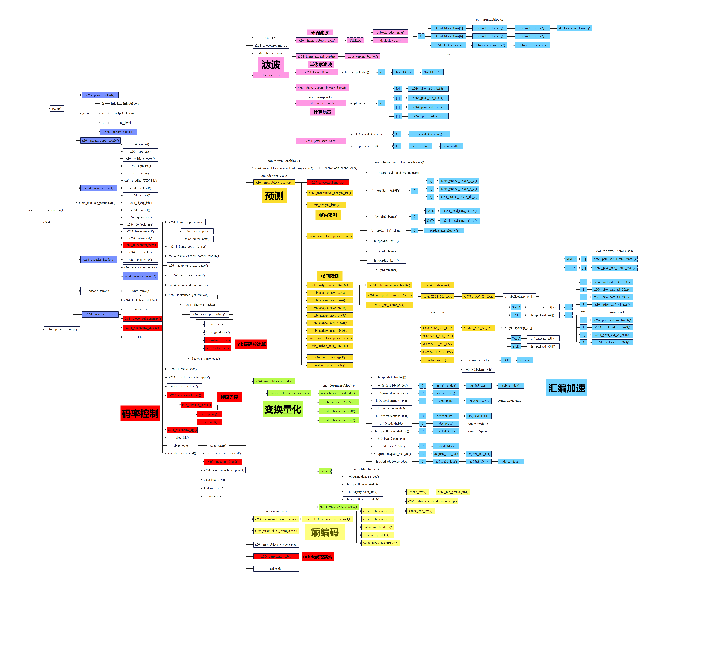

[原图]: ../videocodeciamges/X264.png

# （1）青灰色部分

以x264_为开头的函数，通常是x264对外的API接口，使用青灰色标注，例如x264_encoder_encode()

# （2）红色部分

码率控制分为mb级码控和帧级码控，宏块级码控包括AQ、mbtree，帧级码控包括CQP、CRF、ABR（ABR+VBV=CBR）

# （3）粉色部分

滤波分为几个子模块，环路滤波，半像素差值以及计算质量

# （4）橙色部分

预测分为帧内预测和帧间预测，对16x16以及更小尺寸的宏块进行分析，从而确定最佳的预测模式，如果是帧间预测还需要确定运动矢量

# （5）绿色部分

变换量化模块对预测之后获取的残差进行进一步数据量压缩，同时也会进行反变换反量化来进行帧的重建，重建帧会在后续作为参考分析的依据

# （6）黄色部分

熵编码分为CAVLC和CABAC两个工具，但是通常会使用CABAC，因为其压缩效率较高，也是实际应用中常会使用的熵编码工具
