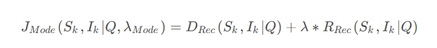
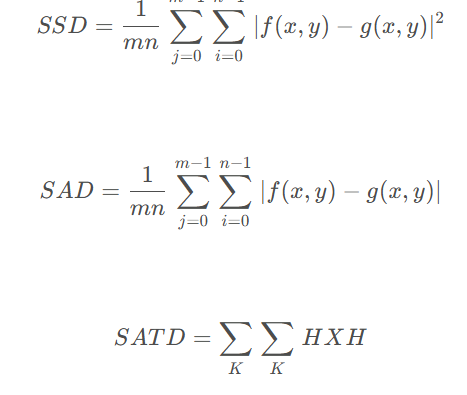
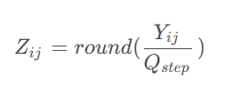

[原图]: ../videocodeciamges/X264.png

# （1）青灰色部分

以x264_为开头的函数，通常是x264对外的API接口，使用青灰色标注，例如x264_encoder_encode()

# （2）红色部分

码率控制分为mb级码控和帧级码控，宏块级码控包括AQ、mbtree，帧级码控包括CQP、CRF、ABR（ABR+VBV=CBR）

# （3）粉色部分

滤波分为几个子模块，环路滤波，半像素差值以及计算质量

# （4）橙色部分

预测分为帧内预测和帧间预测，对16x16以及更小尺寸的宏块进行分析，从而确定最佳的预测模式，如果是帧间预测还需要确定运动矢量

# （5）绿色部分

变换量化模块对预测之后获取的残差进行进一步数据量压缩，同时也会进行反变换反量化来进行帧的重建，重建帧会在后续作为参考分析的依据

# （6）黄色部分

熵编码分为CAVLC和CABAC两个工具，但是通常会使用CABAC，因为其压缩效率较高，也是实际应用中常会使用的熵编码工具

# 0.命令行使用举例：

X264 test.yuv --input-res 1280x720 设置分辨率

## 质量参数

–tune psnr展开为–aq-mode 0 --no-psy，即不开启aq，也不使用psy（心理视觉）情况下计算psnr。psy是心理视觉来调整码控的一种工具，以主观的感知来调整qp，从而获得主观上的质量提升，但是PSNR是客观质量，所以应该禁用psy。同时，aq也是用于调整主观质量的技术，在计算PSNR时需要禁用aq，所以不能够直接计算客观质量

x264  --profile high --psnr --tune psnr -o test.h264  out.y4m 


另外，如果想计算SSIM，可以使用参数–ssim --tune ssim，与计算PSNR不同的是，–tune ssim展开为–aq-mode 2 --no-psy。
=======

另外，如果想计算SSIM，可以使用参数–ssim --tune ssim，与计算PSNR[不同的](https://so.csdn.net/so/search?q=不同的&spm=1001.2101.3001.7020)是，–tune ssim展开为–aq-mode 2 --no-psy。


x264 --profile high –ssim --tune ssim  -o test.h264  out.y4m 

固定质量模式(crf)：

x264 --crf 24 -o 1.h264 out.y4m 

无损模式：

x264 --qp 0 -o  1.h264 out.y4m 

最大psnr

x264 --preset placebo --tune psnr -o 1.h264 out.y4m 

 Constant bitrate at 1000kbps with a 2 second-buffer

x264 --vbv-bufsize 2000 --bitrate 1000 -o 1.h264 out.y4m 


### --keyint

设定最大I帧间距为50帧

x264 --keyint 50 -o 1.h264 out.y4m 

设定最小的I帧间距(过小的I帧间距可能导致闪屏)

x264  --min-keyint 50 -o 1.h264 out.y4m 

### --scenecut

关闭场景切换检测模块

x264 --no-scenecut -o 1.h264 out.y4m 

设定场景切换阈值

x264 --scenecut 40 -o 1.h264 out.y4m 

### --bframes

设定最长连续B帧为3帧

x264  --bframes 3 -o 1.h264 out.y4m 

### b-adapt

默认：1

说明：设置B帧决策算法，这个选项会影响到x264使用P帧或者B帧。

0 —— 关闭。总是使用B帧。和以前的 no-b-adapt选项效果相同；

1 —— ‘快速’算法。快速，–b-frames越大速度越快。推荐配合使用–bframes 16；

2 —— ‘最佳’算法，慢速，–b-frames越大速度越慢；

注意：多趟编码时，只有第一趟编码的此选项起效，因为第一趟编码结束时，帧类型就已经被决定了。

### b-bias

默认：0

说明：调节使用B帧的力度。越大的值越偏向B帧，可以在-100和100之间选择。100或-100不能保证完全或是全是B帧（使用 –b-adapt 0）。

请只在你认为你能做出比x264更好的码率控制时才使用这个选项。

参见： –b-frames, –ipratio

### b-pyramid

默认：normal

说明：允许B帧作为参照帧。如果关闭，那么只有I帧和P帧才能作为参照帧。可以作为参照帧的B帧的量化参数会介于P帧和普通B帧之间。只在–b-frames设置大于等于2时此选项才生效。如果是在为蓝光光盘编码，请使用none或者strict。

none —— 不允许B帧作为参照帧；

strict —— 一个图像组内只允许一个B帧参照帧，这是蓝光编码强制要求的标准；

normal —— 任意使用B帧参照帧；

参见：–bframes, –refs, –no-mixed-refs

### open-gop

默认：none

说明：Open-GOP是一个提升压缩效率的编码技术。它有以下选项：

none —— 关闭

normal —— 开启

bluray —— 开启。一个稍低效的open-GOP版本，因为normal模式不能用于蓝光编码

有些解码器不能完全支持open-GOP流，因此这个选项默认关闭。如果要用，请测试你的解码器。

### no-cabac

默认：无

说明：关闭CABAC (Context Adaptive Binary Arithmetic Coder)压缩，使用较为低效的CAVLC (Context Adaptive Variable Length Coder)。这两者在压缩效率和解码效率上有10%-20%的差别。

### ref

默认：3

说明：控制DPB (Decoded Picture Buffer)的大小。可以在0-16之间选择。简单地说，就是设置P帧可以选择它之前的多少帧作为参照帧（B帧的值要小1-2，取决于那个B帧能不能作为参照）。最小可以选择值1，只参照自己前面的那帧。

注意H.264标准限制了每个level可以参照的帧的数量。如果选择level4.1，1080p最大选4，720p最大选9。

参照： –b-pyramid, –no-mixed-refs, –level

### no-deblock

默认：无

说明：完全关闭内置环路滤波。不推荐使用。

参见： –deblock

### deblock

默认：0:0

说明：调节H.264标准中的内置环路滤波。这是个性价比很高的选则。

See Also: –no-deblock

### slices

默认：0

说明：设置每帧的分片数，强制使用矩形分片。（会被–slice-max-size 或 –slice-max-mbs选项覆盖)

如果是在为蓝光光盘编码，设置为4。如果不是，不要使用这个选项，除非你确定你需要它。

参见：–slice-max-size, –slice-max-mbs

### slice-max-size

默认：0

说明：设置每个分块包括NAL头的最大大小（bytes）。 (目前与 –interlaced选项不兼容)

参见：–slices

### slice-max-mbs

默认：0

说明：设置每个分块包含的最大宏块数量。 (目前与 –interlaced选项不兼容)

参见：–slices

### tff

说明：开启隔行编码并设置上半场在前。x264的隔行编码使用MBAFF，因此效率不如逐行扫描。所以，仅在需要在隔行显示的设备上显示时才开启这个选项（或是送给x264之前无法进行反隔行扫描）。这个选项会触发 –pic-struct开启。

### bff

说明：开启隔行编码并设置下半场在前。更多信息同–tff。

### constrained-intra

默认：无

说明：开启SVC编码的底层要求的强制帧内预测。选择每个人都无视SVC了，你也可以忽略这个设置。

### pulldown

默认：none

说明：为你的输入流（逐行扫描的，固定帧率的）使用一组预设的“软性电视模式”。“软性电视模式”在HandBrake Wiki里面有很好的解释。可选的参数有：none、22、32、64、double、triple、euro。除了none之外的选项都会触发 –pic-struct开启。

### fake-interlaced

默认：无

说明：把流标志为隔行的但不按隔行编码。用于编码25p和30p的蓝光兼容视频。

### 码率控制

### qp

默认：无

说明：三种可选的码率控制方法之一。设置x264使用固定量化参数模式。给定的数量将被作为P帧的量化参数，I帧和B帧的量化参数由–ipratio and –pbratio参数进一步算出。QP模式适用固定的量化参数，这意味着最终的文件大小是不可知的（可以通过一些其他方法预测）。设置为0将产出无损的输出。相同视觉质量时，QP模式产出的文件比crf模式大。QP模式将关闭自适应量化器，因为它是固定QP的。

这个选项和 –bitrate和–crf是互斥的，三者只能选一个。

一般而言crf都能代替QP模式，不过QP因为完全不需要预测所以它会运行地更快些。

参见：–bitrate, –crf, –ipratio, –pbratio

### bitrate

默认：无

说明：三种可选的码率控制方法之二。设置x264使用固定目标比特率模式。固定目标比特率意味着最终文件的大小是可知的，但是目标的质量是不可知的。 x264会试图让最终文件的整体码率与给定的码率相等。参数的量纲为kilobits/sec（8bit = 1byte）。

通常这个选项和–pass选项配合进行2趟编码。

这个选项和 –qp和–crf是互斥的，三者只能选一个。

参见：–qp, –crf, –ratetol, –pass, –stats

### crf

默认：23.0

说明：三种可选的码率控制方法之二。固定ratefactor。QP是固定量化器，bitrate是固定文件大小，crf则是固定“质量”。crf可以提供跟QP一样的视觉的质量，但是文件更小。crf的单位是ratefactor。

crf是通过降低那些“不那么重要”的帧的质量做到这一切的。“不那么重要”意思是过于耗费码率又难以用肉眼察觉的帧，比如复杂或者超高速运行的场景。省下来的码率会用在其它更有效的帧里。

crf编码比2趟编码快，因为它相当于省略了第1趟编码。所以crf的最终码率也是不可预测的。你应该根据应用场景来选择码率控制方式。

这个选项和 –qp和–crf是互斥的，三者只能选一个。

参见：–qp, –bitrate

### rc-lookahead

默认：40

说明：为mb-tree ratecontrol（Macroblock Tree Ratecontrol）和vbv-lookahead设置可用的帧的数量。最大可设置为250。

对于mb-tree而言，调大这个值会得到更准确地结果，但也会更慢。mb-tree能使用的最大值是–rc-lookahead和–keyint中较小的那一个。

对于vbv-lookahead而言，调大这个值会得更稳定和精确的码率控制。vbv-lookahead能使用的最大值是如下公式算出来的：MIN(rc-lookahead, MAX(–keyint, MAX(–vbv-maxrate, –bitrate) / –vbv-bufsize * –fps))

参见：–no-mbtree, –vbv-bufsize, –vbv-maxrate

### vbv-maxrate

默认：0

说明：设置VBV（Video Buffering Verifier）可用的最大码率。使用VBV会降低视频质量，只在真正需要的才设定它。

参见：–vbv-bufsize, –vbv-init

### vbv-bufsize

默认：0

说明：设置VBV（Video Buffering Verifier）可用的最大缓冲区，单位是kilobits。使用VBV会降低视频质量，只在真正需要的才设定它。

参见：–vbv-maxsize, –vbv-init

### vbv-init

默认：0.9

说明：设置重放之前必须先载入多大的VBV缓冲。

如果值小于1，那么大小就为 vbv-init * vbv-bufsize。如果大于1，则是以kbits为单位的值。

参见：–vbv-maxsize, –vbv-bufsize

### crf-max

默认：无

说明：类似 –qp-max，但是设置的是最大的ratefactor值而不是量化参数。这个选项仅用于crf和vbv同时启用的时候。它阻止x264使用小于给定值的ratefactor（也就是“质量”），哪怕会违反vbv。一般用于流服务器。

参见：–crf, –vbv-maxrate, –vbv-bufsize

### qpmin

默认：10

说明：设置x264可以使用的最小量化器。量化参数越小，输出越接近输入。使用某些值时，x264的输出可以和输入看起来完全一样，虽然其实并不是精确相同的，通常就够了没有必要使用更多比特在宏块上了。

如果开启了自适应量化器（默认开启），则不鼓励提高qpmin的值，那样可能会降低帧的平坦部分的质量。

参见：–qpmax, –ipratio

### qpmax

默认：51

说明：qpmin的反面，设置x264可以使用的最大量化器。默认值51是H.264标准中的最大值，质量非常低。默认值51其实相当于没有设置 qpmax。如果你想控制x264输出的最低品质，也许你想要把这个值调低一点（调到30-40最低了），但一般而言不推荐调节这个值。参见：–qpmin, –pbratio, –crf-max

### qpstep

默认：4

说明：设置2帧间量化器最大的可变值。

### ratetol

默认：1.0

说明：这个参数有2个可能的含义：

1、在1趟bitrate编码时，这个参数控制x264可以偏离给定的平均目标比特率的百分比。可以设置为inf完全关闭码率溢出侦测。最低可以设置为 0.01。较高的值可以让x264更好地处理影片结束部分的复杂场景。对于这个目的而言单位是百分比（1.0意味着允许1%的bitrate偏差）。

很多影片（比如说动作打斗片）在最后的片段里十分复杂。1趟编码并不知道哪里是最复杂的片断，往往到最后比特都已经用完了。把rateol设置为inf就能解决这个问题，它允许编码器用类似 –crf的方式工作，当然，文件大小会溢出。

2、当开启了vbv时（只要使用了任何–vbv-开头的选项就会开启），这个选项意味着vbv的强度。更高的值意味着允许更高的在设定的vbv值上下波动。在这个含义时，可以使用任意的度量单位。

### ipratio

默认：1.40

说明：设置平均的I帧的量化器相比P帧量化器增值。更高的值意味着更高的I帧质量。

参见：–pbratio

### pbratio

默认：1.30

说明：设置平均的B帧的量化器相比P帧量化器减值。更高的值意味着更低的B帧质量。开启mbtree（默认开启）选项时不可用，mbtree会自适应地计算B帧量化器。

参见：–ipratio

### chroma-qp-offset

默认：0

说明：设置一个用于色度编码的量化器的偏移值。可以是负值。在开启 psy-rd或 psy-trellis时 x264会自动降低色度的量化参数用于补偿亮度的量化器，意味着色度质量会被降低。它们默认会在chroma-qp-offset的基础上减2。

注意：x264在量化器29时会为亮度和色度使用同样的量化器。往后，色度都会使用比亮度还好的量化器，最后，亮度达到q51时，色度的量化器是q39。这个是H.264标准中要求的做法。

### aq-mode

默认：1

说明：自适应量化器模式。不使用自适应量化的话，x264趋向于使用较少的bit在缺乏细节的场景里。自适应量化可以在整个视频的宏块里更好地分配比特。它有以下选项：

0 —— 完全关闭自适应量化器

1 —— 允许自适应量化器在所有视频帧内部分配比特。

2 —— 根据前一帧强度决策的自变量化器（实验性的）。

参见： –aq-strength

### aq-strength

默认：1.0

说明：自适应量化强度。设置自适应量化对于缺乏细节（平坦）的宏块的剥削程度。不允许负值。0.0 – 2.0之外的值不推荐。

参见：–aq-mode

### pass

默认：无

说明：这对2趟编码是一个重要的选项。这个选项控制了x264如何处理 –stats指定的文件。它有三个选项。

1 —— 建立一个新的stats文件，用于第一趟编码。

2 —— 读取stats文件，用于最后一趟编码。

3 —— 读取stats文件，而且更新它。

stats文件包含了每个输入帧的信息，x264可以读取这些信息来改进输出。大概意思就是先跑一趟编码生成stats文件，然后第二趟编码就可以使用这个文件优化编码结果。视频质量会得到很大的提升，大部分原因是因为可以更好地进行比特分配。

参见：–stats, –bitrate, –slow-firstpass X264_statsfile

### stats

默认：’x264_2pass.log’

说明：设置x264读取和写入的stats文件名

### no-mbtree

默认：无

说明：关闭基于宏块树的比特控制（macroblock tree ratecontrol）。基于宏块树的比特控制通过持续监控宏块在帧间的运动和相对权重来提升视频质量。它会单独生成一个很大的stats文件。

建议值：保持默认

参见：–rc-lookahead

### qcomp

默认：0.60

说明：量化器曲线压缩参数。0.0意味着恒定比特率，1.0意味着恒定量化器。如果开启了mbtree，这个选项会影响mbtree的强度（更高的值意味着更弱的mbtree）。

建议：保持默认

参见：–cplxblur, –qblur

### cplxblur

默认：20

说明：把给定值作为高斯模糊的半径应用到量化曲线上。这意味着分配给每个帧的量化器会被它附近的帧的量化器平均掉，这样会达到限制量化器波动的效果。

参见：–qcomp, –qblur

### qblur

默认：0.5

说明：在量化曲线压缩后，把给定值作为高斯模糊的半径应用到量化曲线上。这不是一个很重要的选项。

参见：–qcomp, –cplxblur

### zones

默认：无

说明：调节视频的特殊片断。可以用它修改大多数x264选项。

一个单独的zone使用<start frame>,<end frame>,<options>的形式表达。多个zone用’/'分隔。

选项：

以下2个选项，每个zone只能设置其中一个，此选项必须是zone列出来的第一个选项：

b=<float> 使zone内的bitraye乘上给定的系数。在调整快速和慢速场景时很有用。

q=<int> 使用zone内使用给定的量化器。在优化一个帧序列是很有用。

### partitions

默认：’p8x8,b8x8,i8x8,i4x4′

说明：H.264在压缩前会被切分为16×16大小的宏块。这些块可被进一步切分成更小的块，利用此参数，可以控制不同的帧类型（I、P、B）开启更细的帧切分（8×8、4×4），具体参数如下：

I帧：i8x8、i4x4；

P帧：p8x8（会同时开启p16x8和p8x16）、p4x4（会同时开启p8x4和p4x8）；

B帧：b8x8（会同时开启b18x8和b8x16）；

另外，也可以设置为’none’和’all’。一般而言，开启p4x4不会带来多少的质量提升，而且它极其耗时，是个性价比比较低的选项。

参见：–no-8x8dct

### direct

默认：’spatial’

说明：为’direct’类型的运动矢量设定预测模式。有两种可选的模式：spatial（空间预测）和temporal（时间预测）。可以设置为’none’关闭预测，也可以设置为’auto’让x264去选择它认为更好的模式，x264会在编码结束时告诉你它的选择。’auto’最好在2趟编码中使用，但也可以在1趟编码时使用。如果用于2趟编码，x264会在第1趟编吗时同时尝试2种预测模式，然后在第2趟编码时使用它认为较好的那一个。注意，如果第1趟编码时选择了’auto’，那么第2趟编码时也必须设置为’auto’。不然，第2趟编码会使用’temporal’。本选项从不会浪费比特，强烈推荐使用。

建议：’auto’

### no-weightb

默认：无

说明：H.264允许给可参考B帧加上影响预测图像的权重，此选项会关闭此特性。

建议：保持默认

### weightp

默认：2

说明：开启明确的权重预测以增进P帧压缩。越高级的模式越耗时，有以下模式：

0 —— 关闭

1 —— 静态补偿（永远为-1）

2 —— 智能统计静态帧，特别为增进淡入淡出效果的压缩率而设计。

注意：为Adobe Flash（版本低于10.1）编码时请把此值设为0，会导致解码时出现错误。Flash 10.1时此BUG得到修正。

### me

默认：’hex’

说明：设置全局的运动预测方法，有以下5种选择：

dia（四边形搜索） —— 最简单的搜索，从最乐观的情况开始预测，在运动矢量的上下左右分别偏移一个像素对比，选择其中最好的，循环直至找不到更匹配的运动矢量。

hex（六边形搜索） —— 和菱形差不多的策略，不同的是，它在6边形的6个顶点上进行rang-2的搜索，它实现了比dia有效率地多的搜索而几乎不会使用更多的耗时，它是普通编码任务一个很好的选择。

umh（不均匀的多六边形搜索） —— 显著地比hex要慢，但它尝试进行复杂多六边形的搜索，以避免错过那些难以找到的运动矢量。与hex和dia不同的是，merange参数直接任意大小控制umh的搜索半径。

esa（全局搜索） —— 高度优化的全局智能搜索，在最佳预测器的merange范围内进行运动搜索。在全局面进行运动向量的算术对比，虽然计算过程并不慢，但好事仍比umh有显著提升，而且并不会带来太多质量方面的提升。所以，对于日常的编码任务来说，它不是特别有用。

tesa（变换全局搜索） —— 使用一种算法，效果近于对全局的每个运动矢量进行Hadamard 变换比对。搜索方式上和esa很像，但是效果比esa好一点点，耗时也多一点点。

参见：–merange

### merange

默认：16

说明：merange控制运动搜索的最大像素范围。对于hex和dia，范围被控制在4-16像素，默认就是16。对于umh和esa，可以超过默认的 16像素进行大范围的运行搜索，这对高分辨率视频和快速运动视频而言很有用。注意，对于umh、esa、tesa，增大merange会显著地增加编码耗时。

参见：–me

### mvrange

默认：-1（自动）

说明：设置垂直的运动矢量最大像素值。默认值如下：

level 1/1b —— 64

level 1.1-2.0 —— 128

level 2.1-3.0 —— 256

level 3.1+ —— 512

注意：如果打算手动设置此值，要在上面给出的值的基础上减去0.25（如：–mvrange 127.75），

建议：保持默认

### mvrange-thread

默认：-1（自动）

说明：设置线程间运动矢量的缓冲区大小的最小值。不要碰这个选项。

建议：保持默认

### subme

默认：7

说明：设置亚像素估计的复杂度。值越高越好。级别1-5简单控制亚像素的细化力度。级别6给模式决策开启RDO（码率失真优化模式），级别8给运动矢量和帧内预测模式开启RDO。开启RDO会显著增加耗时。

使用小于2的值会开启一个快速的、低质量的预测模式，效果如同设置了一个很小的 –scenecut值。不推荐这样设置。

可使用的值如下：

0 —— fullpel only

1 —— QPel SAD 1 iteration

2 —— QPel SATD 2 iterations

3 —— HPel on MB then QPel

4 —— Always QPel

5 —— Multi QPel + bi-directional motion estimation

6 —— RD on I/P frames

7 —— RD on all frames

8 —— RD refinement on I/P frames

9 —— RD refinement on all frames

10 —— QP-RD (requires –trellis=2, –aq-mode > 0)

建议：保持默认，或设置为更高，除非对速度十分敏感。

### subq

–subme的别名

### psy-rd

默认：1.0:0.0

说明：第1个数字是psy-RDO的强度（subme大于等于6时激活）。第2个数字是Psy-Trellis的强度（subme大于等于1时激活）。注意Trellis的特性仍是’实验性’的，至少对于动画视频来说，它总是会坏事的。

### no-psy

默认：无

说明：关闭全部为了心理视觉而降低psnr或ssim的优化。此选项同时也会关闭一些不能通过x264命令行设置的内部的心理视觉优化方法。

建议：保持默认

### no-mixed-refs

默认：无

说明：Mixed refs（混合参照）会以8×8的切块为参照取代以整个宏块为参照。会增进多帧参照的帧的质量，会有一些时间耗用。此选项将禁用这个特性。

建议：保持默认

参见：–ref

### no-chroma-me

默认：无

说明：通常运动估计都会同时考虑亮度和色度因素。开启此选项将会忽略色度因素换取一些速度的提升。

建议：保持默认

### no-8x8dct

默认：无

说明：自适应的8×8 DCT会在I帧中开启更智能的自适应8×8的时域变换。开启此选项可以禁用这个特性。（译者按：此选项是将H.264的Profile从High降为Main的重要参数）

建议：保持默认

### trellis

默认：1

说明：使用网格编码量化以增进编码效率：

0 —— 关闭

1 —— 仅在宏块最终编码时启用

2 —— 所有模式下均启用

选项1提供了速度和效率间较好的均衡，选项2大幅降低速度。

建议：保持默认

注意：需要开启 –cabac选项生效

### no-fast-pskip

默认：无

说明：关闭P帧的早期跳过决策。大量的时耗换回非常小的质量提升。

建议：保持默认

### no-dct-decimate

默认：无

说明：DCT抽样会丢弃看上去“多余”的DCT块。会增加编码效率，通常质量损失可以忽略。此选项关闭此特性。

建议：保持默认

### nr

默认：无

说明：执行快速去噪。以此值为阈值确定噪音，通过在量化前丢失小细节的方式尝试去除噪音。效果可能不如优秀的外部去造滤镜，但它执行地非常快。

建议：保持默认或者设置为100-1000用以去噪。

### deadzone-inter/intra

默认：无

说明：设置帧间/帧内的亮度量化器输出为0的区域大小。输出为0的区域可以设置为0-32，这个值设置的是x264毫不尝试保护直接丢弃的精密细节。十分精细的细节既难以发觉，编码代价又昂贵，直接丢弃它们可以避免在这些低回报的部分浪费比特。此选项和Trellis选项是互不相容的。

建议：保持默认

### cqm

默认：Flat（没设置）

说明：设置自定义的量化矩阵取代内建的内建值。内建值有flast或JVT。

建议：保持默认

参见：–cqmfile

### cqmfile

默认：无

说明：使用一个JM格式矩阵文件设置自定义的量化矩阵。会覆盖其他的 –cqm*选项们。

建议：保持默认

参见：–cqm

### cqm4* / cqm 8*

默认：无

–cqm4: 设置所有4×4块的量化矩阵，以由16个逗号分隔值域为1-255的值组成的列表的形式给出。

–cqm8: 设置所有8×8块的量化矩阵，以由64个逗号分隔值域为1-255的值组成的列表的形式给出。

–cqm4i, –cqm4p, –cqm8i, –cqm8p: 同时设置色度和亮度（i为帧内、p为帧间）矩阵

–cqm4iy, –cqm4ic, –cqm4py, –cqm4pc: 设置色度或亮度矩阵（y为亮度、c为色度）。这样的参数cqm8也有同样的4个。

建议：保持默认

### 视频可用性信息

这些参数为解码的程序设置一个可用标记。由于经常被解码软件所忽略，在大多数场景中这些参数都没什么意义，

### overscan

默认：undef

说明：如何处理过扫描。过扫描在这里用于只显示图像的一部分。（译者按：过扫描技术本用在阴极射线管显示器中为保持画面完整。）

可选：

undef – 不定义

show – 显示全部图像。理论上此值应该被解码器重视。

crop – 视频已经为过扫描显示器做过处理。可以不重视。

建议：如果你的设备支持此选项，建议在编码之前对视频进行裁剪然后设置为show。如果不支持就别管此选项了。

### videoformat

默认：undef

说明：表明此视频在 编码/数字化 之前是什么格式的。

可选：

component

pal

ntsc

secam

mac

undef

建议：设为原视频的格式，或者设为undef。

### fullrange

默认：off

说明：表明亮度和色度级别是否是全范围的（译者按：0-255）。如果设为off，则不会使用全范围（译者按：16-235）。

建议：如果视频源是从模拟视频数字化而来的，设为off。否则则设置为on。

### colorprim

默认：undef

说明：设置转换到RGB的原色。

可选：

undef

bt709

bt470m

bt470bg

smpte170m

smpte240m

film

建议：保持默认，除非你知道你的源用的是哪个值。

### transfer

默认：undef

说明：设置光电转换器使用的特性。（设置用于修正的gamma曲线。）

可选：

undef

bt709

bt470m

bt470bg

linear

log100

log316

smpte170m

smpte240m

建议：保持默认，除非你知道你的源用的是哪个值。

### colormatrix

默认：undef

说明：设置用于从RGB原色中提取亮度和色度的矩阵系数。

可选：

undef

bt709

fcc

bt470bg

smpte170m

smpte240m

GBR

YCgCo

建议：源使用的值，或者保持默认。

### chromaloc

默认：0

说明：设置色度取样位置。（H.264标准的附件E中定义）。取值范围为0-5。

建议：

如果你以MPEG1源为输入做4:2:0采样的转码，而且没作任何色彩空间转换，应该设置为1；

如果你以MPEG2源为输入做4:2:0采样的转码，而且没作任何色彩空间转换，应该设置为0；

如果你以MPEG4源为输入做4:2:0采样的转码，而且没作任何色彩空间转换，应该设置为0；

其他情况保持默认。

### nal-hrd

默认：none

说明：设置HRD信息。用于蓝光流、电视广播和其他一些特殊场合。可用选项如下：

none —— 不设置HRD信息

vbr —— 设置HRD信息

cbr —— 设置HRD信息，而且把流限制在bitrate参数定义的码率内。需要bitrate码率控制方式。

建议：none，除非你需要设置HRD。

参见：–vbv-bufsize， –vbv-maxrate和 –aud

### pic-struct

默认：无

说明：强制按照图像时序SEI传送pic_struct。使用–pulldown或 –tff或–bff参数时会隐式启用。

建议：保持默认

=======

> > > > > > > Stashed changes

## 块划分

通过外部参数可以控制intra的划分尺寸，例如可以通过配置ultrafast模式，禁用intra分析，可以配置–preset ultrafast来启用这个模式

```
static int param_apply_preset( x264_param_t *param, const char *preset )
{
    char *end;
    int i = strtol( preset, &end, 10 );
    if( *end == 0 && i >= 0 && i < ARRAY_ELEMS(x264_preset_names)-1 )
        preset = x264_preset_names[i];

    if( !strcasecmp( preset, "ultrafast" ) )
    {
        // ...
        param->analyse.intra = 0;
        param->analyse.inter = 0;
        param->analyse.b_transform_8x8 = 0;
        // ...
    }
```

如果使用其他模式，可以通过analyse.b_fransform_8x8这个参数来控制intra不对8x8的块进行分析

if( !h->param.analyse.b_transform_8x8 )
{
    h->param.analyse.inter &= ~X264_ANALYSE_I8x8;
    h->param.analyse.intra &= ~X264_ANALYSE_I8x8;
}
但是，上述的两种做法也会影响到inter划分。如果想只考虑intra划分，可以通过hardcode的方式来跳过针对于I4x4或者I8x8的分析。举例来说，可以在mb_analyse_intra()中配置跳过I4x4分析，这样的修改方式不会影响其他的地方

```
if( flags & X264_ANALYSE_I4x4 ) // 将括号中判断条件置零，来跳过I4x4分析
{
    // printf("impl. test, should not analyse 4x4");
    int i_cost = lambda * (24+16); /* 24from JVT (SATD0), 16 from base predmode costs */
    int i_satd_thresh = a->b_early_terminate ? X264_MIN3( i_satd_inter, a->i_satd_i16x16, a->i_satd_i8x8 ) : COST_MAX;
    h->mb.i_cbp_luma = 0;

    if( a->b_early_terminate && a->i_mbrd )
        i_satd_thresh = i_satd_thresh * (10-a->b_fast_intra)/8;
    // ...

}
```

修改帧间块

//默认 全部

x264  --profile high --psnr --tune psnr -A p8x8,b8x8,i8x8,i4x4 -o test.h264 out.y4m 

//  禁用 *inter 4x4*

x264  --profile high --psnr --tune psnr -A p8x8,b8x8,i8x8 -o test.h264 out.y4m 

//*禁用inter p8x8，表示不会对小于16x16的块进行分析*

x264  --profile high --psnr --tune psnr -A p8x8,b8x8,i8x8 -o test.h264 out.y4m 

## 预测工具

（1）参考帧数量，配置项为 --ref，设置参数内容为 {1, 2, 4, 8, 16}
（2）I帧和P帧之间B帧数量，配置项为 --bframes，设置参数范围为 [0, 3]
（3）运动搜索范围，配置项为 --merange，配置内容为 {20, 24}
（4）运动搜索方法，配置项为–me，配置内容为 {dia, umh, esa, tesa}
（5）亚像素搜索精度，配置项为–subme，配置范围为 [1, 9]

## 变换

在变换模块，主要考察两个可配置参数，分别是
（1）自适应空域变换尺寸8x8，配置参数为–no-8x8dct
（2）P帧系数阈值控制，配置参数为–no-dct-decimate

## 滤波

–no-deblock 关闭滤波

熵编码

–no-cabac 禁用cabac

# 1.主干

x264编码主流程当中，主要涉及的内容包括多线程处理，读取配置文件，处理帧的头部信息，处理帧级别的配置信息，进行帧编码之后，释放掉配置文件。应当思考的内容包括：

多线程在工程之上应用很多，尤其是多流的发送和接收，与网络TCP协议结合起来，此外还需要熟悉socket的使用和运用方式
读取配置文件是与外部的接口，里面的配置项，具体涉及到编码器当中的哪个模块，是在哪些地方有影响，影响不同的工具之后，编码的性能有多大的差异，在何种情况下使用何种配置项
帧的头部信息存储的结构是怎样的，每个比特代表的含义是什么，每个变量代表的含义是什么
帧编码的流程是怎样的，使用工具的顺序是怎样的，是如何实现底层的编码的

编码器主函数位于x264.c中，其主要的流程为：

1. 初始化多线程（x264_threading_init），不过在这里函数直接配置为0
2. 初始化默认参数（x264_param_default）
3. 执行编码过程（encode）
4. 清理参数（x264_param_cleanup

```c++
REALIGN_STACK int main( int argc, char **argv )
{
    if( argc == 4 && !strcmp( argv[1], "--autocomplete" ) )
        return x264_cli_autocomplete( argv[2], argv[3] );

    x264_param_t param;
    cli_opt_t opt = {0};
    int ret = 0;
    // ----- 1.初始化多线程 ----- //
    FAIL_IF_ERROR( x264_threading_init(), "unable to initialize threading\n" );

#ifdef _WIN32
    FAIL_IF_ERROR( !get_argv_utf8( &argc, &argv ), "unable to convert command line to UTF-8\n" );

    GetConsoleTitleW( org_console_title, CONSOLE_TITLE_SIZE );
    _setmode( _fileno( stdin ),  _O_BINARY );
    _setmode( _fileno( stdout ), _O_BINARY );
    _setmode( _fileno( stderr ), _O_BINARY );

#endif
    // ----- 2.初始化默认参数 ----- //
    x264_param_default( &param );
    /* Parse command line */
    if( parse( argc, argv, &param, &opt ) < 0 )
        ret = -1;

#ifdef _WIN32
    /* Restore title; it can be changed by input modules */
    SetConsoleTitleW( org_console_title );
#endif

    /* Control-C handler */
    signal( SIGINT, sigint_handler );
    // ----- 3.执行编码过程 ----- //
    if( !ret )
        ret = encode( &param, &opt );
    // ----- 4.释放清理结构体信息 ----- //
    /* clean up handles */
    if( filter.free )
        filter.free( opt.hin );
    else if( opt.hin )
        cli_input.close_file( opt.hin );
    if( opt.hout )
        cli_output.close_file( opt.hout, 0, 0 );
    if( opt.tcfile_out )
        fclose( opt.tcfile_out );
    if( opt.qpfile )
        fclose( opt.qpfile );
    x264_param_cleanup( &param );

#ifdef _WIN32
    SetConsoleTitleW( org_console_title );
    free( argv );
#endif

    return ret;

}
```

### 1.1 初始化多线程（x264_threading_init）

初始化多线程，这里默认配置为0

```c++
#if HAVE_WIN32THREAD || PTW32_STATIC_LIB
X264_API int x264_threading_init( void );
#else
#define x264_threading_init() 0
#endif
```

### 1.2 初始化默认参数（x264_param_default）

### 1.3 编码主函数（encode）

#### 1.3.1 打开编码器（x264_encoder_open）

1. 初始化头部信息
2. 初始化mb信息
3. 初始化frame信息
4. 初始化rdo信息
5. 初始化调用的函数指针
6. 初始化cpu指令集
7. 初始化线程池
8. 检查profile

```c
x264_t *x264_encoder_open( x264_param_t *param, void *api )
{
    x264_t *h;
    char buf[1000], *p;
    int i_slicetype_length;

    CHECKED_MALLOCZERO( h, sizeof(x264_t) );

    /* Create a copy of param */
    memcpy( &h->param, param, sizeof(x264_param_t) );
    h->param.opaque = NULL;
    h->param.param_free = NULL;

    if( h->param.psz_cqm_file )
        CHECKED_PARAM_STRDUP( h->param.psz_cqm_file, &h->param, h->param.psz_cqm_file );
    if( h->param.psz_dump_yuv )
        CHECKED_PARAM_STRDUP( h->param.psz_dump_yuv, &h->param, h->param.psz_dump_yuv );
    if( h->param.rc.psz_stat_out )
        CHECKED_PARAM_STRDUP( h->param.rc.psz_stat_out, &h->param, h->param.rc.psz_stat_out );
    if( h->param.rc.psz_stat_in )
        CHECKED_PARAM_STRDUP( h->param.rc.psz_stat_in, &h->param, h->param.rc.psz_stat_in );
    if( h->param.rc.psz_zones )
        CHECKED_PARAM_STRDUP( h->param.rc.psz_zones, &h->param, h->param.rc.psz_zones );
    if( h->param.psz_clbin_file )
        CHECKED_PARAM_STRDUP( h->param.psz_clbin_file, &h->param, h->param.psz_clbin_file );

    if( param->param_free )
    {
        x264_param_cleanup( param );
        param->param_free( param );
    }

    /* Save pointer to bit depth independent interface */
    h->api = api;

#if HAVE_INTEL_DISPATCHER
    x264_intel_dispatcher_override();
#endif

    if( x264_threading_init() )
    {
        x264_log( h, X264_LOG_ERROR, "unable to initialize threading\n" );
        goto fail;
    }

    if( validate_parameters( h, 1 ) < 0 )
        goto fail;

    if( h->param.psz_cqm_file )
        if( x264_cqm_parse_file( h, h->param.psz_cqm_file ) < 0 )
            goto fail;

    x264_reduce_fraction( &h->param.i_fps_num, &h->param.i_fps_den );
    x264_reduce_fraction( &h->param.i_timebase_num, &h->param.i_timebase_den );

    /* Init x264_t */
    h->i_frame = -1;
    h->i_frame_num = 0;

    if( h->param.i_avcintra_class )
        h->i_idr_pic_id = h->param.i_avcintra_class > 200 ? 4 : 5;
    else
        h->i_idr_pic_id = 0;

    if( (uint64_t)h->param.i_timebase_den * 2 > UINT32_MAX )
    {
        x264_log( h, X264_LOG_ERROR, "Effective timebase denominator %u exceeds H.264 maximum\n", h->param.i_timebase_den );
        goto fail;
    }

    set_aspect_ratio( h, &h->param, 1 );
    // ----- 1.初始化头部信息 ----- //
    x264_sps_init( h->sps, h->param.i_sps_id, &h->param );
    x264_sps_init_scaling_list( h->sps, &h->param );
    x264_pps_init( h->pps, h->param.i_sps_id, &h->param, h->sps );

    x264_validate_levels( h, 1 );

    h->chroma_qp_table = i_chroma_qp_table + 12 + h->pps->i_chroma_qp_index_offset;

    if( x264_cqm_init( h ) < 0 )
        goto fail;
    // ----- 2.初始化mb信息 ----- //
    h->mb.i_mb_width = h->sps->i_mb_width;
    h->mb.i_mb_height = h->sps->i_mb_height;
    h->mb.i_mb_count = h->mb.i_mb_width * h->mb.i_mb_height;

    h->mb.chroma_h_shift = CHROMA_FORMAT == CHROMA_420 || CHROMA_FORMAT == CHROMA_422;
    h->mb.chroma_v_shift = CHROMA_FORMAT == CHROMA_420;

    /* Adaptive MBAFF and subme 0 are not supported as we require halving motion
     * vectors during prediction, resulting in hpel mvs.
     * The chosen solution is to make MBAFF non-adaptive in this case. */
    h->mb.b_adaptive_mbaff = PARAM_INTERLACED && h->param.analyse.i_subpel_refine;

    // ----- 3.初始化frame信息 ----- //
    /* Init frames. */
    if( h->param.i_bframe_adaptive == X264_B_ADAPT_TRELLIS && !h->param.rc.b_stat_read )
        h->frames.i_delay = X264_MAX(h->param.i_bframe,3)*4;
    else
        h->frames.i_delay = h->param.i_bframe;
    if( h->param.rc.b_mb_tree || h->param.rc.i_vbv_buffer_size )
        h->frames.i_delay = X264_MAX( h->frames.i_delay, h->param.rc.i_lookahead );
    i_slicetype_length = h->frames.i_delay;
    h->frames.i_delay += h->i_thread_frames - 1;
    h->frames.i_delay += h->param.i_sync_lookahead;
    h->frames.i_delay += h->param.b_vfr_input;
    h->frames.i_bframe_delay = h->param.i_bframe ? (h->param.i_bframe_pyramid ? 2 : 1) : 0;

    h->frames.i_max_ref0 = h->param.i_frame_reference;
    h->frames.i_max_ref1 = X264_MIN( h->sps->vui.i_num_reorder_frames, h->param.i_frame_reference );
    h->frames.i_max_dpb  = h->sps->vui.i_max_dec_frame_buffering;
    h->frames.b_have_lowres = !h->param.rc.b_stat_read
        && ( h->param.rc.i_rc_method == X264_RC_ABR
          || h->param.rc.i_rc_method == X264_RC_CRF
          || h->param.i_bframe_adaptive
          || h->param.i_scenecut_threshold
          || h->param.rc.b_mb_tree
          || h->param.analyse.i_weighted_pred );
    h->frames.b_have_lowres |= h->param.rc.b_stat_read && h->param.rc.i_vbv_buffer_size > 0;
    h->frames.b_have_sub8x8_esa = !!(h->param.analyse.inter & X264_ANALYSE_PSUB8x8);

    h->frames.i_last_idr =
    h->frames.i_last_keyframe = - h->param.i_keyint_max;
    h->frames.i_input    = 0;
    h->frames.i_largest_pts = h->frames.i_second_largest_pts = -1;
    h->frames.i_poc_last_open_gop = -1;

    CHECKED_MALLOCZERO( h->cost_table, sizeof(*h->cost_table) );
    CHECKED_MALLOCZERO( h->frames.unused[0], (h->frames.i_delay + 3) * sizeof(x264_frame_t *) );
    /* Allocate room for max refs plus a few extra just in case. */
    CHECKED_MALLOCZERO( h->frames.unused[1], (h->i_thread_frames + X264_REF_MAX + 4) * sizeof(x264_frame_t *) );
    CHECKED_MALLOCZERO( h->frames.current, (h->param.i_sync_lookahead + h->param.i_bframe
                        + h->i_thread_frames + 3) * sizeof(x264_frame_t *) );
    if( h->param.analyse.i_weighted_pred > 0 )
        CHECKED_MALLOCZERO( h->frames.blank_unused, h->i_thread_frames * 4 * sizeof(x264_frame_t *) );
    h->i_ref[0] = h->i_ref[1] = 0;
    h->i_cpb_delay = h->i_coded_fields = h->i_disp_fields = 0;
    h->i_prev_duration = ((uint64_t)h->param.i_fps_den * h->sps->vui.i_time_scale) / ((uint64_t)h->param.i_fps_num * h->sps->vui.i_num_units_in_tick);
    h->i_disp_fields_last_frame = -1;
    // ----- 4.初始化rdo信息 ----- //
    // 预先计算在单一上下文中编码各种比特组合的成本
    x264_rdo_init();

    /* init CPU functions */

#if (ARCH_X86 || ARCH_X86_64) && HIGH_BIT_DEPTH
    /* FIXME: Only 8-bit has been optimized for AVX-512 so far. The few AVX-512 functions
     * enabled in high bit-depth are insignificant and just causes potential issues with
     * unnecessary thermal throttling and whatnot, so keep it disabled for now. */
    h->param.cpu &= ~X264_CPU_AVX512;
#endif
    // ----- 5.初始化调用的函数指针 ----- //
    // 初始化预测信息，执行的工作是将函数指针赋值给如h->predict_16x16，方便后续的调用
    x264_predict_16x16_init( h->param.cpu, h->predict_16x16 );
    x264_predict_8x8c_init( h->param.cpu, h->predict_8x8c );
    x264_predict_8x16c_init( h->param.cpu, h->predict_8x16c );
    x264_predict_8x8_init( h->param.cpu, h->predict_8x8, &h->predict_8x8_filter );
    x264_predict_4x4_init( h->param.cpu, h->predict_4x4 );
    x264_pixel_init( h->param.cpu, &h->pixf ); 
    // 初始化dct变换的函数指针
    x264_dct_init( h->param.cpu, &h->dctf );
    // 初始化zigzag搜索的函数指针
    x264_zigzag_init( h->param.cpu, &h->zigzagf_progressive, &h->zigzagf_interlaced );
    memcpy( &h->zigzagf, PARAM_INTERLACED ? &h->zigzagf_interlaced : &h->zigzagf_progressive, sizeof(h->zigzagf) );
    // 初始化运动补偿的函数指针
    x264_mc_init( h->param.cpu, &h->mc, h->param.b_cpu_independent );
    // 初始化量化的函数指针
    x264_quant_init( h, h->param.cpu, &h->quantf );
    // 初始化去块滤波的函数指针
    x264_deblock_init( h->param.cpu, &h->loopf, PARAM_INTERLACED );
    x264_bitstream_init( h->param.cpu, &h->bsf );
    // 初始化CABAC的函数指针
    if( h->param.b_cabac )
        x264_cabac_init( h );
    else
        x264_cavlc_init( h );

    mbcmp_init( h );
    chroma_dsp_init( h );

    p = buf + sprintf( buf, "using cpu capabilities:" );
    // ----- 6.初始化cpu指令集 ----- //
    for( int i = 0; x264_cpu_names[i].flags; i++ )
    {
        if( !strcmp(x264_cpu_names[i].name, "SSE")
            && h->param.cpu & (X264_CPU_SSE2) )
            continue;
        if( !strcmp(x264_cpu_names[i].name, "SSE2")
            && h->param.cpu & (X264_CPU_SSE2_IS_FAST|X264_CPU_SSE2_IS_SLOW) )
            continue;
        if( !strcmp(x264_cpu_names[i].name, "SSE3")
            && (h->param.cpu & X264_CPU_SSSE3 || !(h->param.cpu & X264_CPU_CACHELINE_64)) )
            continue;
        if( !strcmp(x264_cpu_names[i].name, "SSE4.1")
            && (h->param.cpu & X264_CPU_SSE42) )
            continue;
        if( !strcmp(x264_cpu_names[i].name, "LZCNT")
            && (h->param.cpu & X264_CPU_BMI1) )
            continue;
        if( !strcmp(x264_cpu_names[i].name, "BMI1")
            && (h->param.cpu & X264_CPU_BMI2) )
            continue;
        if( !strcmp(x264_cpu_names[i].name, "FMA4")
            && (h->param.cpu & X264_CPU_FMA3) )
            continue;
        if( (h->param.cpu & x264_cpu_names[i].flags) == x264_cpu_names[i].flags
            && (!i || x264_cpu_names[i].flags != x264_cpu_names[i-1].flags) )
            p += sprintf( p, " %s", x264_cpu_names[i].name );
    }
    if( !h->param.cpu )
        p += sprintf( p, " none!" );
    x264_log( h, X264_LOG_INFO, "%s\n", buf );

    if( x264_analyse_init_costs( h ) )
        goto fail;

    /* Must be volatile or else GCC will optimize it out. */
    volatile int temp = 392;
    if( x264_clz( temp ) != 23 )
    {
        x264_log( h, X264_LOG_ERROR, "CLZ test failed: x264 has been miscompiled!\n" );

#if ARCH_X86 || ARCH_X86_64
        x264_log( h, X264_LOG_ERROR, "Are you attempting to run an SSE4a/LZCNT-targeted build on a CPU that\n" );
        x264_log( h, X264_LOG_ERROR, "doesn't support it?\n" );
#endif
        goto fail;
    }

    h->out.i_nal = 0;
    h->out.i_bitstream = x264_clip3f(
        h->param.i_width * h->param.i_height * 4
        * ( h->param.rc.i_rc_method == X264_RC_ABR
            ? pow( 0.95, h->param.rc.i_qp_min )
            : pow( 0.95, h->param.rc.i_qp_constant ) * X264_MAX( 1, h->param.rc.f_ip_factor ) ),
        1000000, INT_MAX/3
    );

    h->nal_buffer_size = h->out.i_bitstream * 3/2 + 4 + 64; /* +4 for startcode, +64 for nal_escape assembly padding */
    CHECKED_MALLOC( h->nal_buffer, h->nal_buffer_size );

    CHECKED_MALLOC( h->reconfig_h, sizeof(x264_t) );
    // ----- 7.初始化线程池 ----- //
    if( h->param.i_threads > 1 &&
        x264_threadpool_init( &h->threadpool, h->param.i_threads ) )
        goto fail;
    if( h->param.i_lookahead_threads > 1 &&
        x264_threadpool_init( &h->lookaheadpool, h->param.i_lookahead_threads ) )
        goto fail;

#if HAVE_OPENCL
    if( h->param.b_opencl )
    {
        h->opencl.ocl = x264_opencl_load_library();
        if( !h->opencl.ocl )
        {
            x264_log( h, X264_LOG_WARNING, "failed to load OpenCL\n" );
            h->param.b_opencl = 0;
        }
    }
#endif

    h->thread[0] = h;
    for( int i = 1; i < h->param.i_threads + !!h->param.i_sync_lookahead; i++ )
        CHECKED_MALLOC( h->thread[i], sizeof(x264_t) );
    if( h->param.i_lookahead_threads > 1 )
        for( int i = 0; i < h->param.i_lookahead_threads; i++ )
        {
            CHECKED_MALLOC( h->lookahead_thread[i], sizeof(x264_t) );
            *h->lookahead_thread[i] = *h;
        }
    *h->reconfig_h = *h;

    for( int i = 0; i < h->param.i_threads; i++ )
    {
        int init_nal_count = h->param.i_slice_count + 3;
        int allocate_threadlocal_data = !h->param.b_sliced_threads || !i;
        if( i > 0 )
            *h->thread[i] = *h;

        if( x264_pthread_mutex_init( &h->thread[i]->mutex, NULL ) )
            goto fail;
        if( x264_pthread_cond_init( &h->thread[i]->cv, NULL ) )
            goto fail;

        if( allocate_threadlocal_data )
        {
            h->thread[i]->fdec = x264_frame_pop_unused( h, 1 );
            if( !h->thread[i]->fdec )
                goto fail;
        }
        else
            h->thread[i]->fdec = h->thread[0]->fdec;

        CHECKED_MALLOC( h->thread[i]->out.p_bitstream, h->out.i_bitstream );
        /* Start each thread with room for init_nal_count NAL units; it'll realloc later if needed. */
        CHECKED_MALLOC( h->thread[i]->out.nal, init_nal_count*sizeof(x264_nal_t) );
        h->thread[i]->out.i_nals_allocated = init_nal_count;

        if( allocate_threadlocal_data && x264_macroblock_cache_allocate( h->thread[i] ) < 0 )
            goto fail;
    }

#if HAVE_OPENCL
    if( h->param.b_opencl && x264_opencl_lookahead_init( h ) < 0 )
        h->param.b_opencl = 0;
#endif

    if( x264_lookahead_init( h, i_slicetype_length ) )
        goto fail;

    for( int i = 0; i < h->param.i_threads; i++ )
        if( x264_macroblock_thread_allocate( h->thread[i], 0 ) < 0 )
            goto fail;

    if( x264_ratecontrol_new( h ) < 0 )
        goto fail;

    if( h->param.i_nal_hrd )
    {
        x264_log( h, X264_LOG_DEBUG, "HRD bitrate: %i bits/sec\n", h->sps->vui.hrd.i_bit_rate_unscaled );
        x264_log( h, X264_LOG_DEBUG, "CPB size: %i bits\n", h->sps->vui.hrd.i_cpb_size_unscaled );
    }

    if( h->param.psz_dump_yuv )
    {
        /* create or truncate the reconstructed video file */
        FILE *f = x264_fopen( h->param.psz_dump_yuv, "w" );
        if( !f )
        {
            x264_log( h, X264_LOG_ERROR, "dump_yuv: can't write to %s\n", h->param.psz_dump_yuv );
            goto fail;
        }
        else if( !x264_is_regular_file( f ) )
        {
            x264_log( h, X264_LOG_ERROR, "dump_yuv: incompatible with non-regular file %s\n", h->param.psz_dump_yuv );
            fclose( f );
            goto fail;
        }
        fclose( f );
    }
    // ----- 8.检查profile ----- //
    const char *profile = h->sps->i_profile_idc == PROFILE_BASELINE ? "Constrained Baseline" :
                          h->sps->i_profile_idc == PROFILE_MAIN ? "Main" :
                          h->sps->i_profile_idc == PROFILE_HIGH ? "High" :
                          h->sps->i_profile_idc == PROFILE_HIGH10 ?
                              (h->sps->b_constraint_set3 ? "High 10 Intra" : "High 10") :
                          h->sps->i_profile_idc == PROFILE_HIGH422 ?
                              (h->sps->b_constraint_set3 ? "High 4:2:2 Intra" : "High 4:2:2") :
                          h->sps->b_constraint_set3 ? "High 4:4:4 Intra" : "High 4:4:4 Predictive";
    char level[16];
    if( h->sps->i_level_idc == 9 || ( h->sps->i_level_idc == 11 && h->sps->b_constraint_set3 &&
        (h->sps->i_profile_idc == PROFILE_BASELINE || h->sps->i_profile_idc == PROFILE_MAIN) ) )
        strcpy( level, "1b" );
    else
        snprintf( level, sizeof(level), "%d.%d", h->sps->i_level_idc / 10, h->sps->i_level_idc % 10 );

    static const char * const subsampling[4] = { "4:0:0", "4:2:0", "4:2:2", "4:4:4" };
    x264_log( h, X264_LOG_INFO, "profile %s, level %s, %s, %d-bit\n",
              profile, level, subsampling[CHROMA_FORMAT], BIT_DEPTH );

    return h;

fail:
    x264_free( h );
    return NULL;
}
```

#### 1.3.2 参数拷贝（x264_encoder_parameters）

```c++
void x264_encoder_parameters( x264_t *h, x264_param_t *param )
{
    memcpy( param, &h->thread[h->i_thread_phase]->param, sizeof(x264_param_t) );
    param->opaque = NULL;
}
```

#### 1.3.3 写入头信息（x264_encoder_headers）

```c++
int x264_encoder_headers( x264_t *h, x264_nal_t **pp_nal, int *pi_nal )
{
    int frame_size = 0;
    /* init bitstream context */
    h->out.i_nal = 0;
    bs_init( &h->out.bs, h->out.p_bitstream, h->out.i_bitstream );

    /* Write SEI, SPS and PPS. */

    /* generate sequence parameters */
    nal_start( h, NAL_SPS, NAL_PRIORITY_HIGHEST );
    x264_sps_write( &h->out.bs, h->sps ); // 写入SPS信息
    if( nal_end( h ) )
        return -1;

    /* generate picture parameters */
    nal_start( h, NAL_PPS, NAL_PRIORITY_HIGHEST );
    x264_pps_write( &h->out.bs, h->sps, h->pps ); // 写入PPS信息
    if( nal_end( h ) )
        return -1;

    /* identify ourselves */
    nal_start( h, NAL_SEI, NAL_PRIORITY_DISPOSABLE );
    if( x264_sei_version_write( h, &h->out.bs ) )
        return -1;
    if( nal_end( h ) )
        return -1;

    frame_size = encoder_encapsulate_nals( h, 0 );
    if( frame_size < 0 )
        return -1;

    /* now set output*/
    *pi_nal = h->out.i_nal;
    *pp_nal = &h->out.nal[0];
    h->out.i_nal = 0;

    return frame_size;

}
```

#### 1.3.4 编码流程（encode_frame->x264_encoder_encode）

encode_frame调用了x264_encoder_encode，其主要的工作流程为：

1.拷贝一帧并移动到buffer中（x264_frame_pop_unused）
2.拷贝一帧送入队列用于确定帧类型（x264_lookahead_put_frame）
3.从lookahead获取帧（x264_lookahead_get_frames）
4.获取要编码的帧（x264_frame_shift）
5.根据帧的类型初始化数据依赖关系，如I帧，P帧，B帧
6.构建双向的参考帧列表（reference_build_list）
7.写入码流文件（x264_sps_write，x264_pps_write等）
8.开始进行码率控制（x264_ratecontrol_start）
9.创建帧的头信息（slice_init）
10.帧编码（slices_write -> slice_write）
11.处理额外信息且更新编码器状态（encoder_frame_end）

x264_encoder_encode中实现了实际编码一帧的功能，其中涉及到了编码器中诸多方面的内容，大体可以归类如下：

码流存储的方式
码率控制的实现
预测模块（帧内预测，帧间预测）
实际编码（DCT变换，Quant量化）
熵编码（CABAC，CAVLC）
滤波模块
在视频编码当中，工作的大致流程是，输入一帧，经过mb块划分之后，对每一个mb进行参考帧预测（帧内或帧间）获得残差，对残差进行实际编码（变换量化）获得系数，系数通过熵编码进行编码并写入码流。滤波模块应用于重建帧之后，为了降低重建帧和原始帧之间的差异，对重建帧进行滤波处理，将滤波之后的重建帧作为下一帧的参考帧。

##### 1.3.4.1拷贝一帧并移动到buffer中（x264_frame_pop_unused）

该函数主要的功能是从h中拷贝一帧出来，移动到buffer中，并且初始化这个帧之中的信息。h是encoder的不可视化句柄，横贯上下文

```c++
x264_frame_t *x264_frame_pop_unused( x264_t *h, int b_fdec )
{
    x264_frame_t *frame;
    // 如果这一帧没有使用，则会取出一帧，否则new一帧
    if( h->frames.unused[b_fdec][0] )
        frame = x264_frame_pop( h->frames.unused[b_fdec] );
    else
        frame = frame_new( h, b_fdec );
    if( !frame )
        return NULL;
    // 将帧中的信息初始化
    frame->b_last_minigop_bframe = 0;
    frame->i_reference_count = 1;
    frame->b_intra_calculated = 0;
    frame->b_scenecut = 1;
    frame->b_keyframe = 0;
    frame->b_corrupt = 0;
    frame->i_slice_count = h->param.b_sliced_threads ? h->param.i_threads : 1;

    memset( frame->weight, 0, sizeof(frame->weight) );
    memset( frame->f_weighted_cost_delta, 0, sizeof(frame->f_weighted_cost_delta) );

    return frame;

}
```

##### 1.3.4.2 拷贝一帧送入队列用于确定帧类型（x264_lookahead_put_frame）

将前面取出的帧送入到lookahead队列中，并确认帧的类型。在x264编码器中，Lookahead队列中存储的帧信息是当前帧的前向参考帧，以及由其后继的参考帧组成的预测帧序列。这个预测帧序列在编码过程中用来评估当前帧的最优编码方式。通过预测帧序列，x264编码器可以提前看到未来的参考帧，从而更准确地决定当前帧的最优编码方式。

Lookahead队列的作用是提高视频编码的质量和效率。通过预测未来的参考帧，可以更准确地选择最优的编码方式，从而达到更好的视频质量。此外，Lookahead队列还可以利用多线程处理技术，在不影响编码速度的情况下提高编码效率。

```c++
void x264_lookahead_put_frame( x264_t *h, x264_frame_t *frame )
{
    if( h->param.i_sync_lookahead )
        x264_sync_frame_list_push( &h->lookahead->ifbuf, frame ); // 进行预测，将frame推入输入帧列表
    else
        x264_sync_frame_list_push( &h->lookahead->next, frame ); // 不进行预测，将frame推入next列表（下一帧）
}
```

##### 1.3.4.3 从lookahead中获取帧（x264_lookahead_get_frames）

该函数分析lookahead中的帧信息，如果存在lookahead线程，则在这里获取帧；如果不存在lookahead线程，这里会决定slice type信息

```c++
void x264_lookahead_get_frames( x264_t *h )
{
    if( h->param.i_sync_lookahead )
    {   /* We have a lookahead thread, so get frames from there */
        x264_pthread_mutex_lock( &h->lookahead->ofbuf.mutex );
        while( !h->lookahead->ofbuf.i_size && h->lookahead->b_thread_active )
            x264_pthread_cond_wait( &h->lookahead->ofbuf.cv_fill, &h->lookahead->ofbuf.mutex );
        lookahead_encoder_shift( h );
        x264_pthread_mutex_unlock( &h->lookahead->ofbuf.mutex );
    }
    else
    {   /* We are not running a lookahead thread, so perform all the slicetype decide on the fly */

        if( h->frames.current[0] || !h->lookahead->next.i_size )
            return;

        x264_slicetype_decide( h );
        lookahead_update_last_nonb( h, h->lookahead->next.list[0] );
        int shift_frames = h->lookahead->next.list[0]->i_bframes + 1;
        lookahead_shift( &h->lookahead->ofbuf, &h->lookahead->next, shift_frames );

        /* For MB-tree and VBV lookahead, we have to perform propagation analysis on I-frames too. */
        if( h->lookahead->b_analyse_keyframe && IS_X264_TYPE_I( h->lookahead->last_nonb->i_type ) )
            x264_slicetype_analyse( h, shift_frames );

        lookahead_encoder_shift( h );
    }

}
```

##### 1.3.4.4获取要编码的帧（x264_frame_shift）

从frame_list中获取一帧

```c++
x264_frame_t *x264_frame_shift( x264_frame_t **list )
{
    x264_frame_t *frame = list[0];
    int i;
    for( i = 0; list[i]; i++ )
        list[i] = list[i+1];
    assert(frame);
    return frame;
}
```

##### 1.3.4.5 根据帧的类型初始化数据依赖关系

判断帧的类型是IDR、I、P或者是B帧，并根据其类型进行参数配置

```c++
if( h->fenc->i_type == X264_TYPE_IDR )
    {
        /* reset ref pictures */
        i_nal_type    = NAL_SLICE_IDR;
        i_nal_ref_idc = NAL_PRIORITY_HIGHEST;
        h->sh.i_type = SLICE_TYPE_I;
        reference_reset( h );
        h->frames.i_poc_last_open_gop = -1;
    }
    else if( h->fenc->i_type == X264_TYPE_I )
    {
        i_nal_type    = NAL_SLICE;
        i_nal_ref_idc = NAL_PRIORITY_HIGH; /* Not completely true but for now it is (as all I/P are kept as ref)*/
        h->sh.i_type = SLICE_TYPE_I;
        reference_hierarchy_reset( h );
        if( h->param.b_open_gop )
            h->frames.i_poc_last_open_gop = h->fenc->b_keyframe ? h->fenc->i_poc : -1;
    }
    else if( h->fenc->i_type == X264_TYPE_P )
    {
        i_nal_type    = NAL_SLICE;
        i_nal_ref_idc = NAL_PRIORITY_HIGH; /* Not completely true but for now it is (as all I/P are kept as ref)*/
        h->sh.i_type = SLICE_TYPE_P;
        reference_hierarchy_reset( h );
        h->frames.i_poc_last_open_gop = -1;
    }
    else if( h->fenc->i_type == X264_TYPE_BREF )
    {
        i_nal_type    = NAL_SLICE;
        i_nal_ref_idc = h->param.i_bframe_pyramid == X264_B_PYRAMID_STRICT ? NAL_PRIORITY_LOW : NAL_PRIORITY_HIGH;
        h->sh.i_type = SLICE_TYPE_B;
        reference_hierarchy_reset( h );
    }
    else    /* B frame */
    {
        i_nal_type    = NAL_SLICE;
        i_nal_ref_idc = NAL_PRIORITY_DISPOSABLE;
        h->sh.i_type = SLICE_TYPE_B;
    }
```

##### 1.3.4.6  构建双向的参考帧列表（reference_build_list）

根据前面判断的帧的类型，可以确定参考帧的情况；对于IDR帧，没有参考帧；对于P帧，有前向参考帧；对于B帧，有双向参考帧。构建的参考帧列表有二维，第一个维度0记录的是前向参考帧的idx，第二个维度1记录的是后向参考帧的idx。

函数主要工作流程为：

1.将参考帧存储到队列中
2.根据与当前帧的距离进行排序
3.检查我们是否选择了与标准默认值不同的引用列表顺序

```c++
static inline void reference_build_list( x264_t *h, int i_poc )
{
    int b_ok;

    /* build ref list 0/1 */
    h->mb.pic.i_fref[0] = h->i_ref[0] = 0;
    h->mb.pic.i_fref[1] = h->i_ref[1] = 0;
    if( h->sh.i_type == SLICE_TYPE_I )
        return;
    // ----- 1.将参考帧存储到队列中 ----- //
    for( int i = 0; h->frames.reference[i]; i++ )
    {
        if( h->frames.reference[i]->b_corrupt )
            continue;
        if( h->frames.reference[i]->i_poc < i_poc )
            h->fref[0][h->i_ref[0]++] = h->frames.reference[i]; // 存入前向参考队列
        else if( h->frames.reference[i]->i_poc > i_poc )
            h->fref[1][h->i_ref[1]++] = h->frames.reference[i]; // 存入后向参考队列
    }

    if( h->sh.i_mmco_remove_from_end )
    {
        /* Order ref0 for MMCO remove */
        do
        {
            b_ok = 1;
            for( int i = 0; i < h->i_ref[0] - 1; i++ )
            {
                if( h->fref[0][i]->i_frame < h->fref[0][i+1]->i_frame )
                {
                    XCHG( x264_frame_t*, h->fref[0][i], h->fref[0][i+1] );
                    b_ok = 0;
                    break;
                }
            }
        } while( !b_ok );

        for( int i = h->i_ref[0]-1; i >= h->i_ref[0] - h->sh.i_mmco_remove_from_end; i-- )
        {
            int diff = h->i_frame_num - h->fref[0][i]->i_frame_num;
            h->sh.mmco[h->sh.i_mmco_command_count].i_poc = h->fref[0][i]->i_poc;
            h->sh.mmco[h->sh.i_mmco_command_count++].i_difference_of_pic_nums = diff;
        }
    }
    // ----- 2.根据与当前帧的距离排序参考列表 ----- //
    /* Order reference lists by distance from the current frame. */
    for( int list = 0; list < 2; list++ )
    {
        h->fref_nearest[list] = h->fref[list][0];
        do
        {
            b_ok = 1;
            for( int i = 0; i < h->i_ref[list] - 1; i++ )
            {
                if( list ? h->fref[list][i+1]->i_poc < h->fref_nearest[list]->i_poc
                         : h->fref[list][i+1]->i_poc > h->fref_nearest[list]->i_poc )
                    h->fref_nearest[list] = h->fref[list][i+1];
                if( reference_distance( h, h->fref[list][i] ) > reference_distance( h, h->fref[list][i+1] ) )
                {
                    XCHG( x264_frame_t*, h->fref[list][i], h->fref[list][i+1] );
                    b_ok = 0;
                    break;
                }
            }
        } while( !b_ok );
    }
    // ----- 3.检查我们是否选择了与标准默认值不同的引用列表顺序 ----- //
    reference_check_reorder( h );

    h->i_ref[1] = X264_MIN( h->i_ref[1], h->frames.i_max_ref1 );
    h->i_ref[0] = X264_MIN( h->i_ref[0], h->frames.i_max_ref0 );
    h->i_ref[0] = X264_MIN( h->i_ref[0], h->param.i_frame_reference ); // if reconfig() has lowered the limit

    /* For Blu-ray compliance, don't reference frames outside of the minigop. */
    if( IS_X264_TYPE_B( h->fenc->i_type ) && h->param.b_bluray_compat )
        h->i_ref[0] = X264_MIN( h->i_ref[0], IS_X264_TYPE_B( h->fref[0][0]->i_type ) + 1 );

    /* add duplicates */
    if( h->fenc->i_type == X264_TYPE_P )
    {
        int idx = -1;
        if( h->param.analyse.i_weighted_pred >= X264_WEIGHTP_SIMPLE )
        {
            x264_weight_t w[3];
            w[1].weightfn = w[2].weightfn = NULL;
            if( h->param.rc.b_stat_read )
                x264_ratecontrol_set_weights( h, h->fenc ); // 码率控制设置参数

            if( !h->fenc->weight[0][0].weightfn )
            {
                h->fenc->weight[0][0].i_denom = 0;
                SET_WEIGHT( w[0], 1, 1, 0, -1 );
                idx = weighted_reference_duplicate( h, 0, w );
            }
            else
            {
                if( h->fenc->weight[0][0].i_scale == 1<<h->fenc->weight[0][0].i_denom )
                {
                    SET_WEIGHT( h->fenc->weight[0][0], 1, 1, 0, h->fenc->weight[0][0].i_offset );
                }
                weighted_reference_duplicate( h, 0, x264_weight_none );
                if( h->fenc->weight[0][0].i_offset > -128 )
                {
                    w[0] = h->fenc->weight[0][0];
                    w[0].i_offset--;
                    h->mc.weight_cache( h, &w[0] );
                    idx = weighted_reference_duplicate( h, 0, w );
                }
            }
        }
        h->mb.ref_blind_dupe = idx;
    }

    assert( h->i_ref[0] + h->i_ref[1] <= X264_REF_MAX );
    h->mb.pic.i_fref[0] = h->i_ref[0];
    h->mb.pic.i_fref[1] = h->i_ref[1];

}
```

##### 1.3.4.7 写入码流文件（x264_sps_write，x264_pps_write等）

如果帧的类型为I帧，则还需要写入SPS和PPS的信息。

```c++
if( h->fenc->b_keyframe )
    {
        /* Write SPS and PPS */
        if( h->param.b_repeat_headers )
        {
            /* generate sequence parameters */
            nal_start( h, NAL_SPS, NAL_PRIORITY_HIGHEST );
            x264_sps_write( &h->out.bs, h->sps ); // 写入SPS信息
            if( nal_end( h ) )
                return -1;
            /* Pad AUD/SPS to 256 bytes like Panasonic */
            if( h->param.i_avcintra_class )
                h->out.nal[h->out.i_nal-1].i_padding = 256 - bs_pos( &h->out.bs ) / 8 - 2*NALU_OVERHEAD;
            overhead += h->out.nal[h->out.i_nal-1].i_payload + h->out.nal[h->out.i_nal-1].i_padding + NALU_OVERHEAD;

            /* generate picture parameters */
            nal_start( h, NAL_PPS, NAL_PRIORITY_HIGHEST );
            x264_pps_write( &h->out.bs, h->sps, h->pps ); // 写入PPS信息
            if( nal_end( h ) )
                return -1;
            if( h->param.i_avcintra_class )
            {
                int total_len = 256;
                /* Sony XAVC uses an oversized PPS instead of SEI padding */
                if( h->param.i_avcintra_flavor == X264_AVCINTRA_FLAVOR_SONY )
                    total_len += h->param.i_height >= 1080 ? 18*512 : 10*512;
                h->out.nal[h->out.i_nal-1].i_padding = total_len - h->out.nal[h->out.i_nal-1].i_payload - NALU_OVERHEAD;
            }
            overhead += h->out.nal[h->out.i_nal-1].i_payload + h->out.nal[h->out.i_nal-1].i_padding + NALU_OVERHEAD;
        }

        /* when frame threading is used, buffering period sei is written in encoder_frame_end */
        if( h->i_thread_frames == 1 && h->sps->vui.b_nal_hrd_parameters_present )
        {
            x264_hrd_fullness( h );
            nal_start( h, NAL_SEI, NAL_PRIORITY_DISPOSABLE );
            x264_sei_buffering_period_write( h, &h->out.bs );
            if( nal_end( h ) )
               return -1;
            overhead += h->out.nal[h->out.i_nal-1].i_payload + SEI_OVERHEAD;
        }
    }
```

##### 1.3.4.8  开始进行码率控制（x264_ratecontrol_start）

开始进行码率控制，为当前的帧选择一个QP。主要的工作流程为：

1. 检查vbv模式
2. 检查abr模式
3. 检查2pass模式
4. 检查CQP模式
5. 将qp进行clip操作，固定在特定范围内
6. 更新pqp

[详细在第二大点]()

```c++
void x264_ratecontrol_start( x264_t *h, int i_force_qp, int overhead )
{
    x264_ratecontrol_t *rc = h->rc;
    ratecontrol_entry_t *rce = NULL;
    x264_zone_t *zone = get_zone( h, h->fenc->i_frame );
    float q;

    x264_emms();

    if( h->param.rc.b_stat_read )
    {
        int frame = h->fenc->i_frame;
        assert( frame >= 0 && frame < rc->num_entries );
        rce = rc->rce = &rc->entry[frame];

        if( h->sh.i_type == SLICE_TYPE_B
            && h->param.analyse.i_direct_mv_pred == X264_DIRECT_PRED_AUTO )
        {
            h->sh.b_direct_spatial_mv_pred = ( rce->direct_mode == 's' );
            h->mb.b_direct_auto_read = ( rce->direct_mode == 's' || rce->direct_mode == 't' );
        }
    }
    // ----- 1.检查是否使用vbv模式 ----- //
    // 在VBV模式下，x264允许每个MB有不同的QP值，其他模式下，整帧的QP值是固定的
    if( rc->b_vbv )
    {
        memset( h->fdec->i_row_bits, 0, h->mb.i_mb_height * sizeof(int) );
        memset( h->fdec->f_row_qp, 0, h->mb.i_mb_height * sizeof(float) );
        memset( h->fdec->f_row_qscale, 0, h->mb.i_mb_height * sizeof(float) );
        rc->row_pred = rc->row_preds[h->sh.i_type];
        rc->buffer_rate = h->fenc->i_cpb_duration * rc->vbv_max_rate * h->sps->vui.i_num_units_in_tick / h->sps->vui.i_time_scale;
        update_vbv_plan( h, overhead );

        const x264_level_t *l = x264_levels;
        while( l->level_idc != 0 && l->level_idc != h->param.i_level_idc )
            l++;

        int mincr = l->mincr;

        if( h->param.b_bluray_compat )
            mincr = 4;

        /* Profiles above High don't require minCR, so just set the maximum to a large value. */
        if( h->sps->i_profile_idc > PROFILE_HIGH )
            rc->frame_size_maximum = 1e9;
        else
        {
            /* The spec has a bizarre special case for the first frame. */
            if( h->i_frame == 0 )
            {
                //384 * ( Max( PicSizeInMbs, fR * MaxMBPS ) + MaxMBPS * ( tr( 0 ) - tr,n( 0 ) ) ) / MinCR
                double fr = 1. / (h->param.i_level_idc >= 60 ? 300 : 172);
                int pic_size_in_mbs = h->mb.i_mb_width * h->mb.i_mb_height;
                rc->frame_size_maximum = 384 * BIT_DEPTH * X264_MAX( pic_size_in_mbs, fr*l->mbps ) / mincr;
            }
            else
            {
                //384 * MaxMBPS * ( tr( n ) - tr( n - 1 ) ) / MinCR
                rc->frame_size_maximum = 384 * BIT_DEPTH * ((double)h->fenc->i_cpb_duration * h->sps->vui.i_num_units_in_tick / h->sps->vui.i_time_scale) * l->mbps / mincr;
            }
        }
    }

    if( h->sh.i_type != SLICE_TYPE_B )
        rc->bframes = h->fenc->i_bframes;
    // ----- 2.检查是否是abr模式 ----- //
    if( rc->b_abr )
    {
        q = qscale2qp( rate_estimate_qscale( h ) );
    }
    else if( rc->b_2pass ) // ----- 3.检查是否是2pass模式 ----- //
    {
        rce->new_qscale = rate_estimate_qscale( h );
        q = qscale2qp( rce->new_qscale );
    }
    else /* CQP */ // ----- 4.CQP模式，QP为固定值 ----- //
    {
        if( h->sh.i_type == SLICE_TYPE_B && h->fdec->b_kept_as_ref )
            q = ( rc->qp_constant[ SLICE_TYPE_B ] + rc->qp_constant[ SLICE_TYPE_P ] ) / 2;
        else
            q = rc->qp_constant[ h->sh.i_type ];

        if( zone )
        {
            if( zone->b_force_qp )
                q += zone->i_qp - rc->qp_constant[SLICE_TYPE_P];
            else
                q -= 6*log2f( zone->f_bitrate_factor );
        }
    }
    if( i_force_qp != X264_QP_AUTO )
        q = i_force_qp - 1;
    // ---- 5.将qp进行clip操作，固定在特定范围内 ----- //
    q = x264_clip3f( q, h->param.rc.i_qp_min, h->param.rc.i_qp_max );

    rc->qpa_rc = rc->qpa_rc_prev =
    rc->qpa_aq = rc->qpa_aq_prev = 0;
    h->fdec->f_qp_avg_rc =
    h->fdec->f_qp_avg_aq =
    rc->qpm = q;
    if( rce )
        rce->new_qp = q;
    // ----- 6.更新pqp ----- //
    accum_p_qp_update( h, rc->qpm );

    if( h->sh.i_type != SLICE_TYPE_B )
        rc->last_non_b_pict_type = h->sh.i_type;

}
```

--------------------------------

##### 1.3.4.9 创建帧头信息（slice_init）

创建帧的头部信息，如果是IDR帧，slice的头信息还会包括i_idr_pic_id信息。slice的头信息当中，包括了SPS、PPS、frame_num、qp和delta_qp等等信息。函数主要的工作流程为：

1.检查是否IDR帧
2.初始化slice头部信息（根据是否是IDR帧有所区别）
3.利用slice的信息初始化mb

```c++
static inline void slice_init( x264_t *h, int i_nal_type, int i_global_qp )
{
    /* ------------------------ Create slice header  ----------------------- */
    // ----- 1.检查是否是IDR帧 ----- //
    if( i_nal_type == NAL_SLICE_IDR )
    {    // ----- 2.初始化slice头部信息 ----- //
        slice_header_init( h, &h->sh, h->sps, h->pps, h->i_idr_pic_id, h->i_frame_num, i_global_qp );

        /* alternate id */
        if( h->param.i_avcintra_class )
        {
            switch( h->i_idr_pic_id )
            {
                case 5:
                    h->i_idr_pic_id = 3;
                    break;
                case 3:
                    h->i_idr_pic_id = 4;
                    break;
                case 4:
                default:
                    h->i_idr_pic_id = 5;
                    break;
            }
        }
        else
            h->i_idr_pic_id ^= 1;
    }
    else
    {
        slice_header_init( h, &h->sh, h->sps, h->pps, -1, h->i_frame_num, i_global_qp );

        h->sh.i_num_ref_idx_l0_active = h->i_ref[0] <= 0 ? 1 : h->i_ref[0];
        h->sh.i_num_ref_idx_l1_active = h->i_ref[1] <= 0 ? 1 : h->i_ref[1];
        if( h->sh.i_num_ref_idx_l0_active != h->pps->i_num_ref_idx_l0_default_active ||
            (h->sh.i_type == SLICE_TYPE_B && h->sh.i_num_ref_idx_l1_active != h->pps->i_num_ref_idx_l1_default_active) )
        {
            h->sh.b_num_ref_idx_override = 1;
        }
    }

    if( h->fenc->i_type == X264_TYPE_BREF && h->param.b_bluray_compat && h->sh.i_mmco_command_count )
    {
        h->b_sh_backup = 1;
        h->sh_backup = h->sh;
    }

    h->fdec->i_frame_num = h->sh.i_frame_num;

    if( h->sps->i_poc_type == 0 )
    {
        h->sh.i_poc = h->fdec->i_poc;
        if( PARAM_INTERLACED )
        {
            h->sh.i_delta_poc_bottom = h->param.b_tff ? 1 : -1;
            h->sh.i_poc += h->sh.i_delta_poc_bottom == -1;
        }
        else
            h->sh.i_delta_poc_bottom = 0;
        h->fdec->i_delta_poc[0] = h->sh.i_delta_poc_bottom == -1;
        h->fdec->i_delta_poc[1] = h->sh.i_delta_poc_bottom ==  1;
    }
    else
    {
        /* Nothing to do ? */
    }
    // ----- 3.将slice的信息拷贝给mb ----- //
    x264_macroblock_slice_init( h );

}
```

##### 1.3.4.10 帧编码（slices_write -> slice_write）

帧编码函数是对一帧进行分析和编码的核心函数，在进行一些参数的配置之后，直接调用了slice_write进行编码。主要工作流程为：

1.将analyser中的配置参数初始化给mb
2.将QP设置为片中的第一个QP，以获得更准确的CABAC初始化
3.初始化cabac
4.循环编码slice当中的每个mb
5.分析mb（预测）
6.编码mb
7.收集mb的信息进行更新
8.是否进行deblock
9.如果使用多线程，则告知主线程编码一个slice完成

##### 1.3.4.11  处理额外信息且更新编码器状态（encoder_frame_end）

```c++
static int encoder_frame_end( x264_t *h, x264_t *thread_current,
                              x264_nal_t **pp_nal, int *pi_nal,
                              x264_picture_t *pic_out )
{
    char psz_message[80];

    if( !h->param.b_sliced_threads && h->b_thread_active )
    {
        h->b_thread_active = 0;
        if( (intptr_t)x264_threadpool_wait( h->threadpool, h ) )
            return -1;
    }
    if( !h->out.i_nal )
    {
        pic_out->i_type = X264_TYPE_AUTO;
        return 0;
    }

    x264_emms();

    /* generate buffering period sei and insert it into place */
    if( h->i_thread_frames > 1 && h->fenc->b_keyframe && h->sps->vui.b_nal_hrd_parameters_present )
    {
        x264_hrd_fullness( h );
        nal_start( h, NAL_SEI, NAL_PRIORITY_DISPOSABLE );
        x264_sei_buffering_period_write( h, &h->out.bs );
        if( nal_end( h ) )
           return -1;
        /* buffering period sei must follow AUD, SPS and PPS and precede all other SEIs */
        int idx = 0;
        while( h->out.nal[idx].i_type == NAL_AUD ||
               h->out.nal[idx].i_type == NAL_SPS ||
               h->out.nal[idx].i_type == NAL_PPS )
            idx++;
        x264_nal_t nal_tmp = h->out.nal[h->out.i_nal-1];
        memmove( &h->out.nal[idx+1], &h->out.nal[idx], (h->out.i_nal-idx-1)*sizeof(x264_nal_t) );
        h->out.nal[idx] = nal_tmp;
    }

    int frame_size = encoder_encapsulate_nals( h, 0 );
    if( frame_size < 0 )
        return -1;
    // ----- 1.设置输出图片格式 ----- //
    /* Set output picture properties */
    pic_out->i_type = h->fenc->i_type;

    pic_out->b_keyframe = h->fenc->b_keyframe;
    pic_out->i_pic_struct = h->fenc->i_pic_struct;

    pic_out->i_pts = h->fdec->i_pts;
    pic_out->i_dts = h->fdec->i_dts;

    if( pic_out->i_pts < pic_out->i_dts )
        x264_log( h, X264_LOG_WARNING, "invalid DTS: PTS is less than DTS\n" );

    pic_out->opaque = h->fenc->opaque;

    pic_out->img.i_csp = h->fdec->i_csp;

#if HIGH_BIT_DEPTH
    pic_out->img.i_csp |= X264_CSP_HIGH_DEPTH;
#endif
    pic_out->img.i_plane = h->fdec->i_plane;
    for( int i = 0; i < pic_out->img.i_plane; i++ )
    {
        pic_out->img.i_stride[i] = h->fdec->i_stride[i] * SIZEOF_PIXEL;
        pic_out->img.plane[i] = (uint8_t*)h->fdec->plane[i];
    }

    x264_frame_push_unused( thread_current, h->fenc );
    // ----- 2.更新编码器状态 ----- //
    /* ---------------------- Update encoder state ------------------------- */

    /* update rc */
    int filler = 0;
    if( x264_ratecontrol_end( h, frame_size * 8, &filler ) < 0 )
        return -1;

    pic_out->hrd_timing = h->fenc->hrd_timing;
    pic_out->prop.f_crf_avg = h->fdec->f_crf_avg;

    /* Filler in AVC-Intra mode is written as zero bytes to the last slice
     * We don't know the size of the last slice until encapsulation so we add filler to the encapsulated NAL */
    if( h->param.i_avcintra_class )
    {
        if( check_encapsulated_buffer( h, h->thread[0], h->out.i_nal, frame_size, (int64_t)frame_size + filler ) < 0 )
            return -1;

        x264_nal_t *nal = &h->out.nal[h->out.i_nal-1];
        memset( nal->p_payload + nal->i_payload, 0, filler );
        nal->i_payload += filler;
        nal->i_padding = filler;
        frame_size += filler;

        /* Fix up the size header for mp4/etc */
        if( !h->param.b_annexb )
        {
            /* Size doesn't include the size of the header we're writing now. */
            uint8_t *nal_data = nal->p_payload;
            int chunk_size = nal->i_payload - 4;
            nal_data[0] = chunk_size >> 24;
            nal_data[1] = chunk_size >> 16;
            nal_data[2] = chunk_size >> 8;
            nal_data[3] = chunk_size >> 0;
        }
    }
    else
    {
        while( filler > 0 )
        {
            int f, overhead = FILLER_OVERHEAD - h->param.b_annexb;
            if( h->param.i_slice_max_size && filler > h->param.i_slice_max_size )
            {
                int next_size = filler - h->param.i_slice_max_size;
                int overflow = X264_MAX( overhead - next_size, 0 );
                f = h->param.i_slice_max_size - overhead - overflow;
            }
            else
                f = X264_MAX( 0, filler - overhead );

            if( bitstream_check_buffer_filler( h, f ) )
                return -1;
            nal_start( h, NAL_FILLER, NAL_PRIORITY_DISPOSABLE );
            x264_filler_write( h, &h->out.bs, f );
            if( nal_end( h ) )
                return -1;
            int total_size = encoder_encapsulate_nals( h, h->out.i_nal-1 );
            if( total_size < 0 )
                return -1;
            frame_size += total_size;
            filler -= total_size;
        }
    }

    /* End bitstream, set output  */
    *pi_nal = h->out.i_nal;
    *pp_nal = h->out.nal;

    h->out.i_nal = 0;

    x264_noise_reduction_update( h );
    // ----- 3.计算/输出编码信息 ----- //
    /* ---------------------- Compute/Print statistics --------------------- */
    thread_sync_stat( h, h->thread[0] );

    /* Slice stat */
    h->stat.i_frame_count[h->sh.i_type]++;
    h->stat.i_frame_size[h->sh.i_type] += frame_size;
    h->stat.f_frame_qp[h->sh.i_type] += h->fdec->f_qp_avg_aq;

    // ...

    psz_message[0] = '\0';
    double dur = h->fenc->f_duration;
    h->stat.f_frame_duration[h->sh.i_type] += dur;
    if( h->param.analyse.b_psnr ) // 计算psnr
    {
        int64_t ssd[3] =
        {
            h->stat.frame.i_ssd[0],
            h->stat.frame.i_ssd[1],
            h->stat.frame.i_ssd[2],
        };
        int luma_size = h->param.i_width * h->param.i_height;
        int chroma_size = CHROMA_SIZE( luma_size );
        pic_out->prop.f_psnr[0] = calc_psnr( ssd[0], luma_size );
        pic_out->prop.f_psnr[1] = calc_psnr( ssd[1], chroma_size );
        pic_out->prop.f_psnr[2] = calc_psnr( ssd[2], chroma_size );
        pic_out->prop.f_psnr_avg = calc_psnr( ssd[0] + ssd[1] + ssd[2], luma_size + chroma_size*2 );

        h->stat.f_ssd_global[h->sh.i_type]   += dur * (ssd[0] + ssd[1] + ssd[2]);
        h->stat.f_psnr_average[h->sh.i_type] += dur * pic_out->prop.f_psnr_avg;
        h->stat.f_psnr_mean_y[h->sh.i_type]  += dur * pic_out->prop.f_psnr[0];
        h->stat.f_psnr_mean_u[h->sh.i_type]  += dur * pic_out->prop.f_psnr[1];
        h->stat.f_psnr_mean_v[h->sh.i_type]  += dur * pic_out->prop.f_psnr[2];

        snprintf( psz_message, 80, " PSNR Y:%5.2f U:%5.2f V:%5.2f", pic_out->prop.f_psnr[0],
                                                                    pic_out->prop.f_psnr[1],
                                                                    pic_out->prop.f_psnr[2] );
    }

    if( h->param.analyse.b_ssim ) // 计算ssim
    {
        pic_out->prop.f_ssim = h->stat.frame.f_ssim / h->stat.frame.i_ssim_cnt;
        h->stat.f_ssim_mean_y[h->sh.i_type] += pic_out->prop.f_ssim * dur;
        int msg_len = strlen(psz_message);
        snprintf( psz_message + msg_len, 80 - msg_len, " SSIM Y:%.5f", pic_out->prop.f_ssim );
    }
    psz_message[79] = '\0';

    ... 

}
```

该函数位于编码一帧结束之后，用于处理编码之后的信息，更新编码器状态。主要的工作流程为：

### 1.4 清理参数（x264_param_cleanup）

```c++
REALIGN_STACK void x264_param_cleanup( x264_param_t *param )
{
    strdup_buffer *buf = param->opaque;
    if( buf )
    {
        for( int i = 0; i < buf->count; i++ )
            free( buf->ptr[i] );
        free( buf );
        param->opaque = NULL;
    }
}
```

# 2.码率控制总体流程

编码器是一个由许多简单或者复杂的编码工具组成的一个系统，这个系统的任务是实现高效的视频或图像压缩，评价的指标是编码之后的质量和码率，分别用PSNR和Bitrate描述。在对这样一个系统进行开发或者使用时，应该考虑使用何种工具来满足当前的任务需求，这样就引出了一个重要的问题，使用何种方法，能够将这么多的工具串联起来，以一个较低的编码码率来获得较高的编码质量。因为这种方法是一种编码控制算法，且目标是较低的编码码率，所以这种方法又可以称为码率控制（Rate Control, RC）

我理解码率控制可以分为两个部分：比特分配（Bit Allocation）和率失真优化（Rate Distortion Optimization，RDO）。比特分配用于整体控制，为当前帧或者当前行确定使用的比特数量，依据r-λ 模型来动态的调整，从而调控分配的比特数量。RDO用于预测模块，通过综合考量编码损失和编码码率，为当前mb选择一个最佳的编码模式

如果从整体来看待码率控制思想以及具体实现的方式，码控的核心理念是在码率和质量之间做权衡，衡量的中间桥梁是视频复杂度，有时以码率为主，有时以质量为先，并且根据视频复杂度来调整具体的参数。在码控模块当中，许多参数是经验性设置的，能够适配通用场景，但无法适配特定场景，可以根据实际应用需求来修改。这种针对于实际应用场景的自适应调整将会更加复杂

在码率控制中，存在一个“蛋鸡悖论”问题。在视频编码发展早期，使用MAD衡量图像复杂度，如果要得到编码的残差信息MAD，需要根据qp进行模式选择和运动估计，但是qp应该在确定残差MAD之后，结合预先设定的r来确定，这种互相依赖的关系产生了矛盾，解决的方法之一是设定一个初始qp。但是，R-Q模型还存在一个问题，即一个rate可能对应多个qp，所以这个模型有待改进。在x264中，使用了r-λ 模型，形成了单独的对应关系，也是后续265编码持续使用的模型，只是265当中的参数有所不同

## 1.1 比特分配

在x264中，λ 用qscale这个变量来描述，因此比特分配的核心目标变为确定一个当前最优的qscale值，确定的方式由不同的配置参数决定，例如帧级码控模式（CRF和ABR）、mb级码控工具（mbtree和AQ）和VBV，这在其他文中记录过。基于x264当中的r-λ 模型，通过qscale来预测消耗的比特数，从而动态调整未来帧可能会使用的比特数量。在x264中，r-λ模型可以简单描述为
                                                                                                                                                                $$
r=c * \frac{complex}{qscale} 
$
其中，c为系数，并且在编码过程中动态更新，qscale就是λ \lambdaλ。比特分配通过结合r-λ模型以及所配置的参数，实现精确地比特控制。qscale和qp的对应关系是

$$
λ = 0.85 * 2 ^{\frac{q-12}{6}}
$$

RDO是编码器当中的一个核心概念，通过给定一个目标的码率，来作为衡量各个工具使用的标准，例如选择哪种帧内预测模式，选择哪种帧间预测模式，使用何种宏块划分类型等等。为了在编码质量和编码码率之间做出一个平衡，提出了一种基于拉格朗日算子的数学模型：



其中，Sk表示当前的宏块，Ik表示宏块的编码模式，QQ为量化参数，λ Mode 是这个编码模式对应的量化参数，Drec 是编码后的失真度，R rec

 是编码后的比特率。从公式中看出，码率控制将失真度和比特率结合起来，使用一个权重系数进行调控，组成了拉格朗日代价函数。通过使用拉格朗日代价函数，能够确定当前编码模式是否是最佳的。这里还有一个问题，使用拉格朗日代价函数能够确定一个模式的好坏，那编码过程中使用的一系列编码工具，所对应的一系列模式，怎么从整个系统的角度上，去选择一组模式，使得整体的编码质量最好，同时码率最小呢？解决这个问题的方法是，基于拉格朗日代价函数，让所有的模式都选取最优的模式，这样选择的一组模式能够在保证一定的码率下，获得不错的编码质量。不过这样选择出来的一组模式可能不是最优的，有可能是次优的，但考虑到操作的简便性，实际应用时仍然使用这种方法。用公式可以描述如下：


即要分别对每一个宏块选择最优的编码模式，就能够得到整体最优的编码模式

为了选择一个最优的编码模式，需要计算当前模式所带来的失真度。失真度由宏块的原始像素和重建像素决定，计算的方式有SSD、SAD和SATD，这三者的计算方式为：



率失真优化RDO具体地实现在帧间预测模块和帧内预测模块两文中记录

## 2.码率控制中比特分配的实现

在x264当中，码控的比特分配分为帧级和mb级，因此实现的方式也分为不同的层级。按照编码流程来看，码控的主要实现流程为：

码率控制器的创建（x264_ratecontrol_new）
（1）码率控制器的重新配置（x264_ratecontrol_init_configurable）
帧级码控
（2.1）计算一帧的AQ信息（x264_adaptive_quant_frame）
（2.2）计算一帧的mbtree信息（x264_lookahead_get_frames —> … —> macroblock_tree）
（2.3）帧级码控启动（x264_ratecontrol_start）
  （2.3.1）CRF模式和ABR模式，基于目前使用的实际比特更新1帧的qscale（rate_estimate_qscale）
  （2.3.2）2pass，基于目前使用的实际比特更新1帧的qscale（rate_estimate_qscale）
  （2.3.3）CQP模式，直接计算qscale
  （2.3.4）更新pqp（accum_p_qp_update）
获取帧级qp（x264_ratecontrol_qp）
获取当前mb的qp，进行qp的调整（x264_ratecontrol_mb_qp）
宏块级码率控制（x264_ratecontrol_mb）

### 2.1 码率控制器的创建（x264_ratecontrol_new）

本函数用于创建码率控制器，函数的定义位于ratecontrol.c，且在编码器打开时（x264_encoder_open）调用，其主要的工作流程为：

码控模块的重新配置（x264_ratecontrol_init_reconfigurable）
ABR模式参数的配置
初始化一些码控参数
读取状态文件并且初始化2pass算法
打开输出文件

```c
int x264_ratecontrol_new( x264_t *h )
{
    x264_ratecontrol_t *rc;

    x264_emms();

    CHECKED_MALLOCZERO( h->rc, h->param.i_threads * sizeof(x264_ratecontrol_t) );
    rc = h->rc;

    rc->b_abr = h->param.rc.i_rc_method != X264_RC_CQP && !h->param.rc.b_stat_read; // 检查是否使用abr模式
    // 2pass模式是两遍编码模式，第一遍时会将一些编码信息存储下来，第二遍时以这些信息作为参考进行更加精细的编码
    // 目标：在给定第一遍编码（如ABR模式）信息之后，尝试在总比特数恒定的情况下选择一系列mb的QP，提升编码质量
    // 步骤：
    // （1）编码前，选择前后帧分配的相对比特数，此时并不关注编码总比特数，经验公式为complexity * 0.6
    //        其中复杂度定义为帧在恒定QP下的比特大小(从第一次通过估计)
    // （2）缩放前面计算的结果来填充请求的总尺寸，可以选择加上VBV的限制，由于帧大小预测器和VBV中的非线性，这是一个迭代过程
    // （3）开始编码，在每帧编码之后，更新未来的qp来补偿之前的预测误差，如果第二帧始终偏离预测大小(通常因为使用了比第一帧更慢的压缩工具)
    //         那么将所有未来帧的qscales乘以误差的倒数。此外，还有一个短期补偿，以防止在开始时(当没有足够的全局补偿数据时)和
    //        接近结束时(当全局没有时间做出反应时)偏离期望的大小太远
    rc->b_2pass = h->param.rc.i_rc_method == X264_RC_ABR && h->param.rc.b_stat_read; // 检查是否使用2pass模式（没有深入研究）

    /* FIXME: use integers */
    if( h->param.i_fps_num > 0 && h->param.i_fps_den > 0 )
        rc->fps = (float) h->param.i_fps_num / h->param.i_fps_den;
    else
        rc->fps = 25.0;

    if( h->param.rc.b_mb_tree ) // 检查是否使用mb_tree
    {
        h->param.rc.f_pb_factor = 1;
        rc->qcompress = 1;
    }
    else
        rc->qcompress = h->param.rc.f_qcompress;

    rc->bitrate = h->param.rc.i_bitrate * (h->param.i_avcintra_class ? 1024. : 1000.);
    rc->rate_tolerance = h->param.rc.f_rate_tolerance;
    rc->nmb = h->mb.i_mb_count;
    rc->last_non_b_pict_type = -1;
    rc->cbr_decay = 1.0;

    if( h->param.rc.i_rc_method != X264_RC_ABR && h->param.rc.b_stat_read )
    {
        x264_log( h, X264_LOG_ERROR, "CRF/CQP is incompatible with 2pass.\n" );
        return -1;
    }
    // ----- 1.码控模块的重新配置 ----- //
    x264_ratecontrol_init_reconfigurable( h, 1 );

    if( h->param.i_nal_hrd )
    {
        uint64_t denom = (uint64_t)h->sps->vui.hrd.i_bit_rate_unscaled * h->sps->vui.i_time_scale;
        uint64_t num = 90000;
        x264_reduce_fraction64( &num, &denom );
        rc->hrd_multiply_denom = 90000 / num;

        double bits_required = log2( num )
                             + log2( h->sps->vui.i_time_scale )
                             + log2( h->sps->vui.hrd.i_cpb_size_unscaled );
        if( bits_required >= 63 )
        {
            x264_log( h, X264_LOG_ERROR, "HRD with very large timescale and bufsize not supported\n" );
            return -1;
        }
    }

    if( rc->rate_tolerance < 0.01 )
    {
        x264_log( h, X264_LOG_WARNING, "bitrate tolerance too small, using .01\n" );
        rc->rate_tolerance = 0.01;
    }

    h->mb.b_variable_qp = rc->b_vbv || h->param.rc.i_aq_mode;
    // ---- 2.ABR模式参数的配置 ----- //
    if( rc->b_abr )
    {
        /* FIXME ABR_INIT_QP is actually used only in CRF */

#define ABR_INIT_QP (( h->param.rc.i_rc_method == X264_RC_CRF ? h->param.rc.f_rf_constant : 24 ) + QP_BD_OFFSET)
        rc->accum_p_norm = .01;
        rc->accum_p_qp = ABR_INIT_QP * rc->accum_p_norm;
        /* estimated ratio that produces a reasonable QP for the first I-frame */
        rc->cplxr_sum = .01 * pow( 7.0e5, rc->qcompress ) * pow( h->mb.i_mb_count, 0.5 );
        rc->wanted_bits_window = 1.0 * rc->bitrate / rc->fps;
        rc->last_non_b_pict_type = SLICE_TYPE_I;
    }
    // ----- 3.初始化一些码控参数 ----- //
    rc->ip_offset = 6.0 * log2f( h->param.rc.f_ip_factor );
    rc->pb_offset = 6.0 * log2f( h->param.rc.f_pb_factor );
    rc->qp_constant[SLICE_TYPE_P] = h->param.rc.i_qp_constant;
    rc->qp_constant[SLICE_TYPE_I] = x264_clip3( h->param.rc.i_qp_constant - rc->ip_offset + 0.5, 0, QP_MAX );
    rc->qp_constant[SLICE_TYPE_B] = x264_clip3( h->param.rc.i_qp_constant + rc->pb_offset + 0.5, 0, QP_MAX );
    h->mb.ip_offset = rc->ip_offset + 0.5;

    rc->lstep = pow( 2, h->param.rc.i_qp_step / 6.0 );
    rc->last_qscale = qp2qscale( 26 + QP_BD_OFFSET );
    int num_preds = h->param.b_sliced_threads * h->param.i_threads + 1;
    CHECKED_MALLOC( rc->pred, 5 * sizeof(predictor_t) * num_preds );
    CHECKED_MALLOC( rc->pred_b_from_p, sizeof(predictor_t) );
    static const float pred_coeff_table[3] = { 1.0, 1.0, 1.5 };
    for( int i = 0; i < 3; i++ )
    {
        rc->last_qscale_for[i] = qp2qscale( ABR_INIT_QP );
        rc->lmin[i] = qp2qscale( h->param.rc.i_qp_min );
        rc->lmax[i] = qp2qscale( h->param.rc.i_qp_max );
        for( int j = 0; j < num_preds; j++ )
        {
            rc->pred[i+j*5].coeff_min = pred_coeff_table[i] / 2;
            rc->pred[i+j*5].coeff = pred_coeff_table[i];
            rc->pred[i+j*5].count = 1.0;
            rc->pred[i+j*5].decay = 0.5;
            rc->pred[i+j*5].offset = 0.0;
        }
        for( int j = 0; j < 2; j++ )
        {
            rc->row_preds[i][j].coeff_min = .25 / 4;
            rc->row_preds[i][j].coeff = .25;
            rc->row_preds[i][j].count = 1.0;
            rc->row_preds[i][j].decay = 0.5;
            rc->row_preds[i][j].offset = 0.0;
        }
    }
    rc->pred_b_from_p->coeff_min = 0.5 / 2;
    rc->pred_b_from_p->coeff = 0.5;
    rc->pred_b_from_p->count = 1.0;
    rc->pred_b_from_p->decay = 0.5;
    rc->pred_b_from_p->offset = 0.0;

    if( parse_zones( h ) < 0 )
    {
        x264_log( h, X264_LOG_ERROR, "failed to parse zones\n" );
        return -1;
    }
    // ---- 4.读取状态文件并且初始化2pass算法 ----- //
    /* Load stat file and init 2pass algo */
    if( h->param.rc.b_stat_read )
    {
        char *p, *stats_in, *stats_buf;

        /* read 1st pass stats */
        assert( h->param.rc.psz_stat_in );
        stats_buf = stats_in = x264_slurp_file( h->param.rc.psz_stat_in );
        if( !stats_buf )
        {
            x264_log( h, X264_LOG_ERROR, "ratecontrol_init: can't open stats file\n" );
            return -1;
        }
        if( h->param.rc.b_mb_tree )
        {
            char *mbtree_stats_in = strcat_filename( h->param.rc.psz_stat_in, ".mbtree" );
            if( !mbtree_stats_in )
                return -1;
            rc->p_mbtree_stat_file_in = x264_fopen( mbtree_stats_in, "rb" );
            x264_free( mbtree_stats_in );
            if( !rc->p_mbtree_stat_file_in )
            {
                x264_log( h, X264_LOG_ERROR, "ratecontrol_init: can't open mbtree stats file\n" );
                return -1;
            }
        }

        /* check whether 1st pass options were compatible with current options */
        if( strncmp( stats_buf, "#options:", 9 ) )
        {
            x264_log( h, X264_LOG_ERROR, "options list in stats file not valid\n" );
            return -1;
        }

        float res_factor, res_factor_bits;
        {
            int i, j;
            uint32_t k, l;
            char *opts = stats_buf;
            stats_in = strchr( stats_buf, '\n' );
            if( !stats_in )
                return -1;
            *stats_in = '\0';
            stats_in++;
            if( sscanf( opts, "#options: %dx%d", &i, &j ) != 2 )
            {
                x264_log( h, X264_LOG_ERROR, "resolution specified in stats file not valid\n" );
                return -1;
            }
            else if( h->param.rc.b_mb_tree )
            {
                rc->mbtree.srcdim[0] = i;
                rc->mbtree.srcdim[1] = j;
            }
            res_factor = (float)h->param.i_width * h->param.i_height / (i*j);
            /* Change in bits relative to resolution isn't quite linear on typical sources,
             * so we'll at least try to roughly approximate this effect. */
            res_factor_bits = powf( res_factor, 0.7 );

            if( !( p = strstr( opts, "timebase=" ) ) || sscanf( p, "timebase=%u/%u", &k, &l ) != 2 )
            {
                x264_log( h, X264_LOG_ERROR, "timebase specified in stats file not valid\n" );
                return -1;
            }
            if( k != h->param.i_timebase_num || l != h->param.i_timebase_den )
            {
                x264_log( h, X264_LOG_ERROR, "timebase mismatch with 1st pass (%u/%u vs %u/%u)\n",
                          h->param.i_timebase_num, h->param.i_timebase_den, k, l );
                return -1;
            }

            CMP_OPT_FIRST_PASS( "bitdepth", BIT_DEPTH );
            CMP_OPT_FIRST_PASS( "weightp", X264_MAX( 0, h->param.analyse.i_weighted_pred ) );
            CMP_OPT_FIRST_PASS( "bframes", h->param.i_bframe );
            CMP_OPT_FIRST_PASS( "b_pyramid", h->param.i_bframe_pyramid );
            CMP_OPT_FIRST_PASS( "intra_refresh", h->param.b_intra_refresh );
            CMP_OPT_FIRST_PASS( "open_gop", h->param.b_open_gop );
            CMP_OPT_FIRST_PASS( "bluray_compat", h->param.b_bluray_compat );
            CMP_OPT_FIRST_PASS( "mbtree", h->param.rc.b_mb_tree );

            if( (p = strstr( opts, "interlaced=" )) )
            {
                char *current = h->param.b_interlaced ? h->param.b_tff ? "tff" : "bff" : h->param.b_fake_interlaced ? "fake" : "0";
                char buf[5];
                sscanf( p, "interlaced=%4s", buf );
                if( strcmp( current, buf ) )
                {
                    x264_log( h, X264_LOG_ERROR, "different interlaced setting than first pass (%s vs %s)\n", current, buf );
                    return -1;
                }
            }

            if( (p = strstr( opts, "keyint=" )) )
            {
                p += 7;
                char buf[13] = "infinite ";
                if( h->param.i_keyint_max != X264_KEYINT_MAX_INFINITE )
                    sprintf( buf, "%d ", h->param.i_keyint_max );
                if( strncmp( p, buf, strlen(buf) ) )
                {
                    x264_log( h, X264_LOG_ERROR, "different keyint setting than first pass (%.*s vs %.*s)\n",
                              strlen(buf)-1, buf, strcspn(p, " "), p );
                    return -1;
                }
            }

            if( strstr( opts, "qp=0" ) && h->param.rc.i_rc_method == X264_RC_ABR )
                x264_log( h, X264_LOG_WARNING, "1st pass was lossless, bitrate prediction will be inaccurate\n" );

            if( !strstr( opts, "direct=3" ) && h->param.analyse.i_direct_mv_pred == X264_DIRECT_PRED_AUTO )
            {
                x264_log( h, X264_LOG_WARNING, "direct=auto not used on the first pass\n" );
                h->mb.b_direct_auto_write = 1;
            }

            if( ( p = strstr( opts, "b_adapt=" ) ) && sscanf( p, "b_adapt=%d", &i ) && i >= X264_B_ADAPT_NONE && i <= X264_B_ADAPT_TRELLIS )
                h->param.i_bframe_adaptive = i;
            else if( h->param.i_bframe )
            {
                x264_log( h, X264_LOG_ERROR, "b_adapt method specified in stats file not valid\n" );
                return -1;
            }

            if( (h->param.rc.b_mb_tree || h->param.rc.i_vbv_buffer_size) && ( p = strstr( opts, "rc_lookahead=" ) ) && sscanf( p, "rc_lookahead=%d", &i ) )
                h->param.rc.i_lookahead = i;
        }

        /* find number of pics */
        p = stats_in;
        int num_entries;
        for( num_entries = -1; p; num_entries++ )
            p = strchr( p + 1, ';' );
        if( !num_entries )
        {
            x264_log( h, X264_LOG_ERROR, "empty stats file\n" );
            return -1;
        }
        rc->num_entries = num_entries;

        if( h->param.i_frame_total < rc->num_entries && h->param.i_frame_total > 0 )
        {
            x264_log( h, X264_LOG_WARNING, "2nd pass has fewer frames than 1st pass (%d vs %d)\n",
                      h->param.i_frame_total, rc->num_entries );
        }
        if( h->param.i_frame_total > rc->num_entries )
        {
            x264_log( h, X264_LOG_ERROR, "2nd pass has more frames than 1st pass (%d vs %d)\n",
                      h->param.i_frame_total, rc->num_entries );
            return -1;
        }

        CHECKED_MALLOCZERO( rc->entry, rc->num_entries * sizeof(ratecontrol_entry_t) );
        CHECKED_MALLOC( rc->entry_out, rc->num_entries * sizeof(ratecontrol_entry_t*) );

        /* init all to skipped p frames */
        for( int i = 0; i < rc->num_entries; i++ )
        {
            ratecontrol_entry_t *rce = &rc->entry[i];
            rce->pict_type = SLICE_TYPE_P;
            rce->qscale = rce->new_qscale = qp2qscale( 20 + QP_BD_OFFSET );
            rce->misc_bits = rc->nmb + 10;
            rce->new_qp = 0;
            rc->entry_out[i] = rce;
        }

        /* read stats */
        p = stats_in;
        double total_qp_aq = 0;
        for( int i = 0; i < rc->num_entries; i++ )
        {
            ratecontrol_entry_t *rce;
            int frame_number = 0;
            int frame_out_number = 0;
            char pict_type = 0;
            int e;
            char *next;
            float qp_rc, qp_aq;
            int ref;

            next= strchr(p, ';');
            if( next )
                *next++ = 0; //sscanf is unbelievably slow on long strings
            e = sscanf( p, " in:%d out:%d ", &frame_number, &frame_out_number );

            if( frame_number < 0 || frame_number >= rc->num_entries )
            {
                x264_log( h, X264_LOG_ERROR, "bad frame number (%d) at stats line %d\n", frame_number, i );
                return -1;
            }
            if( frame_out_number < 0 || frame_out_number >= rc->num_entries )
            {
                x264_log( h, X264_LOG_ERROR, "bad frame output number (%d) at stats line %d\n", frame_out_number, i );
                return -1;
            }
            rce = &rc->entry[frame_number];
            rc->entry_out[frame_out_number] = rce;
            rce->direct_mode = 0;

            e += sscanf( p, " in:%*d out:%*d type:%c dur:%"SCNd64" cpbdur:%"SCNd64" q:%f aq:%f tex:%d mv:%d misc:%d imb:%d pmb:%d smb:%d d:%c",
                   &pict_type, &rce->i_duration, &rce->i_cpb_duration, &qp_rc, &qp_aq, &rce->tex_bits,
                   &rce->mv_bits, &rce->misc_bits, &rce->i_count, &rce->p_count,
                   &rce->s_count, &rce->direct_mode );
            rce->tex_bits  *= res_factor_bits;
            rce->mv_bits   *= res_factor_bits;
            rce->misc_bits *= res_factor_bits;
            rce->i_count   *= res_factor;
            rce->p_count   *= res_factor;
            rce->s_count   *= res_factor;

            p = strstr( p, "ref:" );
            if( !p )
                goto parse_error;
            p += 4;
            for( ref = 0; ref < 16; ref++ )
            {
                if( sscanf( p, " %d", &rce->refcount[ref] ) != 1 )
                    break;
                p = strchr( p+1, ' ' );
                if( !p )
                    goto parse_error;
            }
            rce->refs = ref;

            /* find weights */
            rce->i_weight_denom[0] = rce->i_weight_denom[1] = -1;
            char *w = strchr( p, 'w' );
            if( w )
            {
                int count = sscanf( w, "w:%hd,%hd,%hd,%hd,%hd,%hd,%hd,%hd",
                                    &rce->i_weight_denom[0], &rce->weight[0][0], &rce->weight[0][1],
                                    &rce->i_weight_denom[1], &rce->weight[1][0], &rce->weight[1][1],
                                    &rce->weight[2][0], &rce->weight[2][1] );
                if( count == 3 )
                    rce->i_weight_denom[1] = -1;
                else if( count != 8 )
                    rce->i_weight_denom[0] = rce->i_weight_denom[1] = -1;
            }

            if( pict_type != 'b' )
                rce->kept_as_ref = 1;
            switch( pict_type )
            {
                case 'I':
                    rce->frame_type = X264_TYPE_IDR;
                    rce->pict_type  = SLICE_TYPE_I;
                    break;
                case 'i':
                    rce->frame_type = X264_TYPE_I;
                    rce->pict_type  = SLICE_TYPE_I;
                    break;
                case 'P':
                    rce->frame_type = X264_TYPE_P;
                    rce->pict_type  = SLICE_TYPE_P;
                    break;
                case 'B':
                    rce->frame_type = X264_TYPE_BREF;
                    rce->pict_type  = SLICE_TYPE_B;
                    break;
                case 'b':
                    rce->frame_type = X264_TYPE_B;
                    rce->pict_type  = SLICE_TYPE_B;
                    break;
                default:  e = -1; break;
            }
            if( e < 14 )
            {

parse_error:
                x264_log( h, X264_LOG_ERROR, "statistics are damaged at line %d, parser out=%d\n", i, e );
                return -1;
            }
            rce->qscale = qp2qscale( qp_rc );
            total_qp_aq += qp_aq;
            p = next;
        }
        if( !h->param.b_stitchable )
            h->pps->i_pic_init_qp = SPEC_QP( (int)(total_qp_aq / rc->num_entries + 0.5) );

        x264_free( stats_buf );

        if( h->param.rc.i_rc_method == X264_RC_ABR )
        {
            if( init_pass2( h ) < 0 )
                return -1;
        } /* else we're using constant quant, so no need to run the bitrate allocation */
    }
    // ----- 5.打开输出文件 ----- //
    /* Open output file */
    /* If input and output files are the same, output to a temp file
     * and move it to the real name only when it's complete */
    if( h->param.rc.b_stat_write )
    {
        char *p;
        rc->psz_stat_file_tmpname = strcat_filename( h->param.rc.psz_stat_out, ".temp" );
        if( !rc->psz_stat_file_tmpname )
            return -1;

        rc->p_stat_file_out = x264_fopen( rc->psz_stat_file_tmpname, "wb" );
        if( rc->p_stat_file_out == NULL )
        {
            x264_log( h, X264_LOG_ERROR, "ratecontrol_init: can't open stats file\n" );
            return -1;
        }

        p = x264_param2string( &h->param, 1 );
        if( p )
            fprintf( rc->p_stat_file_out, "#options: %s\n", p );
        x264_free( p );
        if( h->param.rc.b_mb_tree && !h->param.rc.b_stat_read )
        {
            rc->psz_mbtree_stat_file_tmpname = strcat_filename( h->param.rc.psz_stat_out, ".mbtree.temp" );
            rc->psz_mbtree_stat_file_name = strcat_filename( h->param.rc.psz_stat_out, ".mbtree" );
            if( !rc->psz_mbtree_stat_file_tmpname || !rc->psz_mbtree_stat_file_name )
                return -1;

            rc->p_mbtree_stat_file_out = x264_fopen( rc->psz_mbtree_stat_file_tmpname, "wb" );
            if( rc->p_mbtree_stat_file_out == NULL )
            {
                x264_log( h, X264_LOG_ERROR, "ratecontrol_init: can't open mbtree stats file\n" );
                return -1;
            }
        }
    }

    if( h->param.rc.b_mb_tree && (h->param.rc.b_stat_read || h->param.rc.b_stat_write) )
    {
        if( !h->param.rc.b_stat_read )
        {
            rc->mbtree.srcdim[0] = h->param.i_width;
            rc->mbtree.srcdim[1] = h->param.i_height;
        }
        if( macroblock_tree_rescale_init( h, rc ) < 0 )
            return -1;
    }

    for( int i = 0; i<h->param.i_threads; i++ )
    {
        h->thread[i]->rc = rc+i;
        if( i )
        {
            rc[i] = rc[0];
            h->thread[i]->param = h->param;
            h->thread[i]->mb.b_variable_qp = h->mb.b_variable_qp;
            h->thread[i]->mb.ip_offset = h->mb.ip_offset;
        }
    }

    return 0;

fail:
    return -1;
}
```

#### 2.1.1 码控模块的重新配置（x264_ratecontrol_init_reconfigurable）

该函数进行码控模块的重新配置，定义位于ratecontrol.c中，主要的工作流程如下：

如果使用了crf模式，计算rate_factor_constant因子
如果使用了vbv机制，进行vbv参数的初始化

```c
void x264_ratecontrol_init_reconfigurable( x264_t *h, int b_init )
{
    x264_ratecontrol_t *rc = h->rc;
    if( !b_init && rc->b_2pass )
        return;
    // ----- 1.如果使用了crf模式，计算rate_factor_constant因子 ----- //
    if( h->param.rc.i_rc_method == X264_RC_CRF )
    {
        /* Arbitrary rescaling to make CRF somewhat similar to QP.

   * Try to compensate for MB-tree's effects as well. */
     e base_cplx = h->mb.i_mb_count * (h->param.i_bframe ? 120 : 80);
             // mb_tree默认为1，f_qcompress默认为0.6
             double mbtree_offset = h->param.rc.b_mb_tree ? (1.0-h->param.rc.f_qcompress)*13.5 : 0;
             // #define QP_BD_OFFSET (6*(BIT_DEPTH-8))，如果使用的是8bit，则为0
             rc->rate_factor_constant = pow( base_cplx, 1 - rc->qcompress )
              / qp2qscale( h->param.rc.f_rf_constant + mbtree_offset + QP_BD_OFFSET );
         }
     // ----- 2.如果使用了vbv机制，进行vbv参数的初始化 ----- //
     // VBV用于控制码率上下限，防止编码过程中出现上溢或者下溢的情况
         if( h->param.rc.i_vbv_max_bitrate > 0 && h->param.rc.i_vbv_buffer_size > 0 )
         {
             /* We don't support changing the ABR bitrate right now,
     so if the stream starts as CBR, keep it CBR. */
             /*
             b_vbv_min_rate表示1pass ABR模式下，设置的水池最大的输入码率小于目标码率
             rc->b_vbv_min_rate = !rc->b_2pass                                        // 不是2pass
                    && h->param.rc.i_rc_method == X264_RC_ABR                  // 使用ABR模式
                    && h->param.rc.i_vbv_max_bitrate <= h->param.rc.i_bitrate; // 最大的码率小于目标码率
      如果设置了vbv最小的码率，则将输入的码率赋值给vbv最大的码率，此时变成了CBR模式
         */
             if( rc->b_vbv_min_rate )
      h->param.rc.i_vbv_max_bitrate = h->param.rc.i_bitrate;
         // vbv_buffer_size为整个水池的容量，如果小于输入帧的大小，则将容量配置为输入帧的大小
             if( h->param.rc.i_vbv_buffer_size < (int)(h->param.rc.i_vbv_max_bitrate / rc->fps) )
             {
      h->param.rc.i_vbv_buffer_size = h->param.rc.i_vbv_max_bitrate / rc->fps;
      x264_log( h, X264_LOG_WARNING, "VBV buffer size cannot be smaller than one frame, using %d kbit\n",
                h->param.rc.i_vbv_buffer_size );
             }
         // 转换为kilo
             int kilobit_size = h->param.i_avcintra_class ? 1024 : 1000;
             int vbv_buffer_size = h->param.rc.i_vbv_buffer_size * kilobit_size;    // 整个水池的总容量
             int vbv_max_bitrate = h->param.rc.i_vbv_max_bitrate * kilobit_size;    // 水池最大输入码率

        // 初始化HRD信息，HRD常用于蓝光视频、电视广播及其它特殊领域（没有研究）
        /* Init HRD */
        if( h->param.i_nal_hrd && b_init )
        {
            h->sps->vui.hrd.i_cpb_cnt = 1;
            h->sps->vui.hrd.b_cbr_hrd = h->param.i_nal_hrd == X264_NAL_HRD_CBR;
            h->sps->vui.hrd.i_time_offset_length = 0;

            #define BR_SHIFT  6
            #define CPB_SHIFT 4

            // normalize HRD size and rate to the value / scale notation
            h->sps->vui.hrd.i_bit_rate_scale = x264_clip3( x264_ctz( vbv_max_bitrate ) - BR_SHIFT, 0, 15 );
            h->sps->vui.hrd.i_bit_rate_value = vbv_max_bitrate >> ( h->sps->vui.hrd.i_bit_rate_scale + BR_SHIFT );
            h->sps->vui.hrd.i_bit_rate_unscaled = h->sps->vui.hrd.i_bit_rate_value << ( h->sps->vui.hrd.i_bit_rate_scale + BR_SHIFT );
            h->sps->vui.hrd.i_cpb_size_scale = x264_clip3( x264_ctz( vbv_buffer_size ) - CPB_SHIFT, 0, 15 );
            h->sps->vui.hrd.i_cpb_size_value = vbv_buffer_size >> ( h->sps->vui.hrd.i_cpb_size_scale + CPB_SHIFT );
            h->sps->vui.hrd.i_cpb_size_unscaled = h->sps->vui.hrd.i_cpb_size_value << ( h->sps->vui.hrd.i_cpb_size_scale + CPB_SHIFT );

            #undef CPB_SHIFT
            #undef BR_SHIFT

            // arbitrary
            #define MAX_DURATION 0.5

            int max_cpb_output_delay = X264_MIN( h->param.i_keyint_max * MAX_DURATION * h->sps->vui.i_time_scale / h->sps->vui.i_num_units_in_tick, INT_MAX );
            int max_dpb_output_delay = h->sps->vui.i_max_dec_frame_buffering * MAX_DURATION * h->sps->vui.i_time_scale / h->sps->vui.i_num_units_in_tick;
            int max_delay = (int)(90000.0 * (double)h->sps->vui.hrd.i_cpb_size_unscaled / h->sps->vui.hrd.i_bit_rate_unscaled + 0.5);

            h->sps->vui.hrd.i_initial_cpb_removal_delay_length = 2 + x264_clip3( 32 - x264_clz( max_delay ), 4, 22 );
            h->sps->vui.hrd.i_cpb_removal_delay_length = x264_clip3( 32 - x264_clz( max_cpb_output_delay ), 4, 31 );
            h->sps->vui.hrd.i_dpb_output_delay_length  = x264_clip3( 32 - x264_clz( max_dpb_output_delay ), 4, 31 );

            #undef MAX_DURATION

            vbv_buffer_size = h->sps->vui.hrd.i_cpb_size_unscaled;
            vbv_max_bitrate = h->sps->vui.hrd.i_bit_rate_unscaled;
        }
        else if( h->param.i_nal_hrd && !b_init )
        {
            x264_log( h, X264_LOG_WARNING, "VBV parameters cannot be changed when NAL HRD is in use\n" );
            return;
        }
        h->sps->vui.hrd.i_bit_rate_unscaled = vbv_max_bitrate;
        h->sps->vui.hrd.i_cpb_size_unscaled = vbv_buffer_size;

        if( rc->b_vbv_min_rate ) // 将输入码率转换成为kb/s
            rc->bitrate = (double)h->param.rc.i_bitrate * kilobit_size;
        rc->buffer_rate = vbv_max_bitrate / rc->fps;    // 水池最大的输入水量
        rc->vbv_max_rate = vbv_max_bitrate;                // 水池最大的输入速率
        rc->buffer_size = vbv_buffer_size;                // 水池最大的容量
        // 输入水量 * 1.1 > 最大容量，说明水池比较小，最多容纳一帧的数据量
        // single_frame_vbv在后面会被用于调整qscale
        rc->single_frame_vbv = rc->buffer_rate * 1.1 > rc->buffer_size;    // 
        if( rc->b_abr && h->param.rc.i_rc_method == X264_RC_ABR )
            rc->cbr_decay = 1.0 - rc->buffer_rate / rc->buffer_size
                          * 0.5 * X264_MAX(0, 1.5 - rc->buffer_rate * rc->fps / rc->bitrate);

        // 这里表明vbv和crf模式可以共存
        if( h->param.rc.i_rc_method == X264_RC_CRF && h->param.rc.f_rf_constant_max )
        {
            // 如果存在rf最大值，则计算一个增量
            rc->rate_factor_max_increment = h->param.rc.f_rf_constant_max - h->param.rc.f_rf_constant;
            if( rc->rate_factor_max_increment <= 0 )
            {
                x264_log( h, X264_LOG_WARNING, "CRF max must be greater than CRF\n" );
                rc->rate_factor_max_increment = 0;
            }
        }
        if( b_init ) 
        {
            if( h->param.rc.f_vbv_buffer_init > 1. )
                h->param.rc.f_vbv_buffer_init = x264_clip3f( h->param.rc.f_vbv_buffer_init / h->param.rc.i_vbv_buffer_size, 0, 1 );
            h->param.rc.f_vbv_buffer_init = x264_clip3f( X264_MAX( h->param.rc.f_vbv_buffer_init, rc->buffer_rate / rc->buffer_size ), 0, 1);
            // buffer_fill_final表示水池中当前时刻剩余的水量
            rc->buffer_fill_final =
            rc->buffer_fill_final_min = rc->buffer_size * h->param.rc.f_vbv_buffer_init * h->sps->vui.i_time_scale;
            rc->b_vbv = 1; // 启用vbv
            rc->b_vbv_min_rate = !rc->b_2pass
                          && h->param.rc.i_rc_method == X264_RC_ABR
                          && h->param.rc.i_vbv_max_bitrate <= h->param.rc.i_bitrate;
        }
    }

}
```

### 2.2 帧级别码率控制

开始执行帧级别的码率控制，先计算AQ和mbtree的相关信息，参考[【x264】码率控制模块的简单分析—宏块级码控工具Mbtree和AQ](http://t.csdnimg.cn/MQmkz)，随后根据具体模式进行码控调整

#### 2.2.1 计算一帧的AQ信息（x264_adaptive_quant_frame）

该函数是AQ工具实现的具体函数，通过区分不同的模式，为mb计算qp_adj，即qp的偏移量。主要工作流程为：

如果不使用自适应量化（AQ模式），aq_mode为X264_AQ_NONE或者aq_strength为0，则考虑为了使用Mbtree进行qp_offset和inv_qscale_factor的初始化
如果使用AQ，则需要计算qp_adj, strength等信息
（1）如果使用AUTOVARIANCE或者是AUTOVARIANCE_BIASED，则要考虑调整qp和strength，具体地做法是计算每一个mb应该调整的qp量，随后取均值，然后计算avg_adj和strength。如果使用VARIANCE，则仅考虑strength
（2）根据不同的AQ模式对应的计算公式，来计算qp_adj

#### 2.2.2 计算一帧的mbtree信息（x264_lookahead_get_frames —> … —> macroblock_tree）

mbtree是一种宏块级别的码率控制工具，根据帧间预测相关信息，来有效的降低编码的码率。mbtree的工作原理可以简单描述为，在lookahead当中通过前向预测，来获得当前mb的重要程度，重要程度由被参考的情况来衡量。如果被参考的权值很高，说明这个mb很重要，此时这个mb会按照较低的qp编码，否则按照较高的qp编码。这个权值的衡量由当前mb的intra_cost、inter_cost和前面mb赋予当前mb的传播cost决定

在mbtree中，主要的计算过程位于macroblock_tree中，函数位于slicetype.c中，函数主要的工作流程如下：

- 如果当前帧为intra帧，则直接计算cost

- 为propagate_cost赋初始值

- 循环处理每一帧，计算cost

- 计算当前帧的帧内和帧间cost（slicetype_frame_cost）

- 计算宏块的传播cost（macroblock_tree_propagate），之后根据帧内、帧间cost和宏块传播cost来计算qp_offset（macroblock_tree_finish），从而调整当前mb的qp

#### 2.2.3 码控模块启动（x264_ratecontrol_start）

该函数的主要功能是，在编码一帧之前选择一个合适的qp。函数的定义位于ratecontrol.c，主要的工作流程为：

- 状态读取，应该是2pass相关

- 初始化vbv模式相关参数

- 获取abr模式下的qp（rate_estimate_qscale）

- 获取2pass模式下的qp（rate_estimate_qscale）

- 计算CQP模式下的qp

- 更新qp

```c
/* Before encoding a frame, choose a QP for it */
void x264_ratecontrol_start( x264_t *h, int i_force_qp, int overhead )
{
    x264_ratecontrol_t *rc = h->rc;
    ratecontrol_entry_t *rce = NULL;
    x264_zone_t *zone = get_zone( h, h->fenc->i_frame );
    float q;

    x264_emms();
    // ----- 1.状态读取，应该与2pass相关 ----- // 
    if( h->param.rc.b_stat_read )
    {
        int frame = h->fenc->i_frame;
        assert( frame >= 0 && frame < rc->num_entries );
        rce = rc->rce = &rc->entry[frame];

        if( h->sh.i_type == SLICE_TYPE_B
            && h->param.analyse.i_direct_mv_pred == X264_DIRECT_PRED_AUTO )
        {
            h->sh.b_direct_spatial_mv_pred = ( rce->direct_mode == 's' );
            h->mb.b_direct_auto_read = ( rce->direct_mode == 's' || rce->direct_mode == 't' );
        }
    }
    // ----- 2.初始化vbv模式相关参数 ----- //
    if( rc->b_vbv )
    {
        memset( h->fdec->i_row_bits, 0, h->mb.i_mb_height * sizeof(int) );
        memset( h->fdec->f_row_qp, 0, h->mb.i_mb_height * sizeof(float) );
        memset( h->fdec->f_row_qscale, 0, h->mb.i_mb_height * sizeof(float) );
        rc->row_pred = rc->row_preds[h->sh.i_type];
        rc->buffer_rate = h->fenc->i_cpb_duration * rc->vbv_max_rate * h->sps->vui.i_num_units_in_tick / h->sps->vui.i_time_scale;
        // 临时更新所有正在编码过程中的帧的VBV信息
        update_vbv_plan( h, overhead );

        const x264_level_t *l = x264_levels;
        while( l->level_idc != 0 && l->level_idc != h->param.i_level_idc )
            l++;

        int mincr = l->mincr;

        if( h->param.b_bluray_compat )
            mincr = 4;

        /* Profiles above High don't require minCR, so just set the maximum to a large value. */
        if( h->sps->i_profile_idc > PROFILE_HIGH )
            rc->frame_size_maximum = 1e9;
        else
        {
            /* The spec has a bizarre special case for the first frame. */
            if( h->i_frame == 0 )
            {
                //384 * ( Max( PicSizeInMbs, fR * MaxMBPS ) + MaxMBPS * ( tr( 0 ) - tr,n( 0 ) ) ) / MinCR
                double fr = 1. / (h->param.i_level_idc >= 60 ? 300 : 172);
                int pic_size_in_mbs = h->mb.i_mb_width * h->mb.i_mb_height;
                rc->frame_size_maximum = 384 * BIT_DEPTH * X264_MAX( pic_size_in_mbs, fr*l->mbps ) / mincr;
            }
            else
            {
                //384 * MaxMBPS * ( tr( n ) - tr( n - 1 ) ) / MinCR
                rc->frame_size_maximum = 384 * BIT_DEPTH * ((double)h->fenc->i_cpb_duration * h->sps->vui.i_num_units_in_tick / h->sps->vui.i_time_scale) * l->mbps / mincr;
            }
        }
    }

    if( h->sh.i_type != SLICE_TYPE_B )
        rc->bframes = h->fenc->i_bframes;
    // ----- 3.获取abr模式下的qp ----- //
    if( rc->b_abr )
    {
        q = qscale2qp( rate_estimate_qscale( h ) );
    }
    else if( rc->b_2pass )
    { // ----- 4.获取2pass模式下的qp ----- //
        rce->new_qscale = rate_estimate_qscale( h );
        q = qscale2qp( rce->new_qscale );
    }
    else /* CQP */
    { // ----- 5.获取cqp模式下的qp ----- //
        // 如果是b帧，则取均值
        if( h->sh.i_type == SLICE_TYPE_B && h->fdec->b_kept_as_ref )
            q = ( rc->qp_constant[ SLICE_TYPE_B ] + rc->qp_constant[ SLICE_TYPE_P ] ) / 2;
        else
            q = rc->qp_constant[ h->sh.i_type ];

        if( zone )
        {
            if( zone->b_force_qp )
                q += zone->i_qp - rc->qp_constant[SLICE_TYPE_P];
            else
                q -= 6*log2f( zone->f_bitrate_factor );
        }
    }
    if( i_force_qp != X264_QP_AUTO )
        q = i_force_qp - 1;

    q = x264_clip3f( q, h->param.rc.i_qp_min, h->param.rc.i_qp_max );

    rc->qpa_rc = rc->qpa_rc_prev =
    rc->qpa_aq = rc->qpa_aq_prev = 0;
    h->fdec->f_qp_avg_rc =
    h->fdec->f_qp_avg_aq =
    rc->qpm = q;
    if( rce )
        rce->new_qp = q;
    // ------ 6.更新qp ----- //
    accum_p_qp_update( h, rc->qpm );

    if( h->sh.i_type != SLICE_TYPE_B )
        rc->last_non_b_pict_type = h->sh.i_type;

}
```

##### 2.2.3.1 估计qscale（rate_estimate_qscale）

该函数的功能是根据过去已经使用的比特数来更新qscale，主要工作流程为：

- 计算总比特数

- 检查B帧（没有研究过）

- 检查非B帧

​    （3.1）检查2pass模式（没有研究过）
​    （3.2）使用1pass的ABR（CRF和ABR都会进入这个分支）
      （3.2.1）计算行级SATD（x264_rc_analyse_slice）
      （3.2.2）利用SATD计算当前帧的图像模糊度blurred_complexity
      （3.2.3）根据CRF和ABR模式来计算qscale（get_qscale），如果是ABR模式还可能会用到VBV限制（vbv_pass1）

```c
// update qscale for 1 frame based on actual bits used so far
static float rate_estimate_qscale( x264_t *h )
{
    float q;
    x264_ratecontrol_t *rcc = h->rc;
    ratecontrol_entry_t rce = {0};
    int pict_type = h->sh.i_type;
    // ----- 1.计算总比特数 ----- //
    int64_t total_bits = 8*(h->stat.i_frame_size[SLICE_TYPE_I]
                          + h->stat.i_frame_size[SLICE_TYPE_P]
                          + h->stat.i_frame_size[SLICE_TYPE_B])
                       - rcc->filler_bits_sum;


    if( rcc->b_2pass )
    {
        rce = *rcc->rce;
        if( pict_type != rce.pict_type )
        {
            x264_log( h, X264_LOG_ERROR, "slice=%c but 2pass stats say %c\n",
                      slice_type_to_char[pict_type], slice_type_to_char[rce.pict_type] );
        }
    }
    // ----- 2.检查B帧 ----- //
    if( pict_type == SLICE_TYPE_B )
    {
        /* B-frames don't have independent ratecontrol, but rather get the
         * average QP of the two adjacent P-frames + an offset */

        int i0 = IS_X264_TYPE_I(h->fref_nearest[0]->i_type);
        int i1 = IS_X264_TYPE_I(h->fref_nearest[1]->i_type);
        int dt0 = abs(h->fenc->i_poc - h->fref_nearest[0]->i_poc);
        int dt1 = abs(h->fenc->i_poc - h->fref_nearest[1]->i_poc);
        float q0 = h->fref_nearest[0]->f_qp_avg_rc;
        float q1 = h->fref_nearest[1]->f_qp_avg_rc;

        if( h->fref_nearest[0]->i_type == X264_TYPE_BREF )
            q0 -= rcc->pb_offset/2;
        if( h->fref_nearest[1]->i_type == X264_TYPE_BREF )
            q1 -= rcc->pb_offset/2;

        if( i0 && i1 )
            q = (q0 + q1) / 2 + rcc->ip_offset;
        else if( i0 )
            q = q1;
        else if( i1 )
            q = q0;
        else
            q = (q0*dt1 + q1*dt0) / (dt0 + dt1);

        if( h->fenc->b_kept_as_ref )
            q += rcc->pb_offset/2;
        else
            q += rcc->pb_offset;

        rcc->qp_novbv = q;
        q = qp2qscale( q );
        if( rcc->b_2pass )
            rcc->frame_size_planned = qscale2bits( &rce, q );
        else
            rcc->frame_size_planned = predict_size( rcc->pred_b_from_p, q, h->fref[1][h->i_ref[1]-1]->i_satd );

        /* Apply MinCR and buffer fill restrictions */
        if( rcc->b_vbv )
        {
            double frame_size_maximum = X264_MIN( rcc->frame_size_maximum, X264_MAX( rcc->buffer_fill, 0.001 ) );
            if( rcc->frame_size_planned > frame_size_maximum )
            {
                q *= rcc->frame_size_planned / frame_size_maximum;
                rcc->frame_size_planned = frame_size_maximum;
            }
        }

        rcc->frame_size_estimated = rcc->frame_size_planned;

        /* For row SATDs */
        if( rcc->b_vbv )
            rcc->last_satd = x264_rc_analyse_slice( h );
        return q;
    }
    else
    { // ----- 3.检查非B帧 ----- //
        // 计算abr模式的buffer
        double abr_buffer = 2 * rcc->rate_tolerance * rcc->bitrate;
        // 将总bit作为预测的bit
        double predicted_bits = total_bits;
        if( h->i_thread_frames > 1 ) // 使用多线程
        {
            int j = rcc - h->thread[0]->rc;
            for( int i = 1; i < h->i_thread_frames; i++ )
            {
                x264_t *t = h->thread[(j+i) % h->i_thread_frames];
                double bits = t->rc->frame_size_planned;
                if( !t->b_thread_active )
                    continue;
                bits = X264_MAX(bits, t->rc->frame_size_estimated);
                predicted_bits += bits;
            }
        }
        // 如果是2pass
        if( rcc->b_2pass )
        {
            double lmin = rcc->lmin[pict_type];
            double lmax = rcc->lmax[pict_type];
            double diff;

            /* Adjust ABR buffer based on distance to the end of the video. */
            // 根据距离视频结尾的距离来调整ABR的buffer
            if( rcc->num_entries > h->i_frame )
            {
                double final_bits = rcc->entry_out[rcc->num_entries-1]->expected_bits;
                double video_pos = rce.expected_bits / final_bits;
                double scale_factor = sqrt( (1 - video_pos) * rcc->num_entries );
                abr_buffer *= 0.5 * X264_MAX( scale_factor, 0.5 );
            }
            // 预测比特数和期望比特数的差异
            diff = predicted_bits - rce.expected_bits;
            q = rce.new_qscale;
            q /= x264_clip3f((abr_buffer - diff) / abr_buffer, .5, 2);
            if( h->i_frame >= rcc->fps && rcc->expected_bits_sum >= 1 )
            {
                /* Adjust quant based on the difference between
                 * achieved and expected bitrate so far */
                // 根据已经实现的和期望的bitrate的差异来调整量化参数
                double cur_time = (double)h->i_frame / rcc->num_entries;
                double w = x264_clip3f( cur_time*100, 0.0, 1.0 );
                q *= pow( (double)total_bits / rcc->expected_bits_sum, w );
            }
            rcc->qp_novbv = qscale2qp( q );
            // 如果使用了vbv模式，再进行调整
            if( rcc->b_vbv )
            {
                /* Do not overflow vbv */
                double expected_size = qscale2bits( &rce, q );
                double expected_vbv = rcc->buffer_fill + rcc->buffer_rate - expected_size;
                double expected_fullness = rce.expected_vbv / rcc->buffer_size;
                double qmax = q*(2 - expected_fullness);
                double size_constraint = 1 + expected_fullness;
                qmax = X264_MAX( qmax, rce.new_qscale );
                if( expected_fullness < .05 )
                    qmax = lmax;
                qmax = X264_MIN(qmax, lmax);
                while( ((expected_vbv < rce.expected_vbv/size_constraint) && (q < qmax)) ||
                        ((expected_vbv < 0) && (q < lmax)))
                {
                    q *= 1.05;
                    expected_size = qscale2bits(&rce, q);
                    expected_vbv = rcc->buffer_fill + rcc->buffer_rate - expected_size;
                }
                rcc->last_satd = x264_rc_analyse_slice( h );
            }
            q = x264_clip3f( q, lmin, lmax );
        }
        else /* 1pass ABR */
        { // 使用1pass的ABR
            /* Calculate the quantizer which would have produced the desired
             * average bitrate if it had been applied to all frames so far.
             * Then modulate that quant based on the current frame's complexity
             * relative to the average complexity so far (using the 2pass RCEQ).
             * Then bias the quant up or down if total size so far was far from
             * the target.
             * Result: Depending on the value of rate_tolerance, there is a
             * tradeoff between quality and bitrate precision. But at large
             * tolerances, the bit distribution approaches that of 2pass. */
            // 计算量化因子，如果该因子已经被用于之前的所有帧，则该因子能够生成期望的平均码率
             // 然后，根据当前帧的复杂度和之前所有帧的平均复杂度的比值来修正量化参数
             // 随后，如果总体大小远离目标大小，则将量化因子增大或者减小
             // 结果：根据码率容忍的误差值，在质量和码率控制精度之前有一个tradeoff；如果容忍度很大，则比特的分布接近2pass
            double wanted_bits, overflow = 1;
            rcc->last_satd = x264_rc_analyse_slice( h ); // 计算当前帧的复杂度（按照一行计算）
            rcc->short_term_cplxsum *= 0.5;        // cplxsum为累积复杂度，由之前帧的cplx和当前帧的SATD组合而成
            rcc->short_term_cplxcount *= 0.5;    // cplxcount为统计帧数
            // cplxsum = cplxsum * 0.5 + SATD
            rcc->short_term_cplxsum += rcc->last_satd / (CLIP_DURATION(h->fenc->f_duration) / BASE_FRAME_DURATION);
            // cplxcount = cplxcount * 0.5 + 1
            rcc->short_term_cplxcount ++;

            rce.tex_bits = rcc->last_satd;
            // 计算模糊复杂度blurred_complexity
            rce.blurred_complexity = rcc->short_term_cplxsum / rcc->short_term_cplxcount;
            rce.mv_bits = 0;
            rce.p_count = rcc->nmb;
            rce.i_count = 0;
            rce.s_count = 0;
            rce.qscale = 1;
            rce.pict_type = pict_type;
            rce.i_duration = h->fenc->i_duration;
            // 使用CRF模式
            if( h->param.rc.i_rc_method == X264_RC_CRF )
            {
                q = get_qscale( h, &rce, rcc->rate_factor_constant, h->fenc->i_frame );
            }
            else
            { // 使用ABR模式
                // wanted_bits_window是期望比特数，cplxr_sum是复杂度平均值
                // rc->wanted_bits_window = rc->bitrate / fps （初始值），表示目标编码比特
                q = get_qscale( h, &rce, rcc->wanted_bits_window / rcc->cplxr_sum, h->fenc->i_frame );

                /* ABR code can potentially be counterproductive in CBR, so just don't bother.
                 * Don't run it if the frame complexity is zero either. */
                if( !rcc->b_vbv_min_rate && rcc->last_satd )
                {
                    // FIXME is it simpler to keep track of wanted_bits in ratecontrol_end?
                    int i_frame_done = h->i_frame;                // 已编码的帧数
                    double time_done = i_frame_done / rcc->fps;    // 编码的时长
                    if( h->param.b_vfr_input && i_frame_done > 0 )
                        time_done = ((double)(h->fenc->i_reordered_pts - h->i_reordered_pts_delay)) * h->param.i_timebase_num / h->param.i_timebase_den;
                    wanted_bits = time_done * rcc->bitrate;        // 计算已经编码的帧的bits大小
                    if( wanted_bits > 0 )
                    {
                        abr_buffer *= X264_MAX( 1, sqrt( time_done ) );
                        // 通过计算已编码比特数和预测编码比特数的差异来判断是否出现了上下溢，并使用这个比率来调整qscale
                        overflow = x264_clip3f( 1.0 + (predicted_bits - wanted_bits) / abr_buffer, .5, 2 );
                        q *= overflow;
                    }
                }
            }

            if( pict_type == SLICE_TYPE_I && h->param.i_keyint_max > 1
                /* should test _next_ pict type, but that isn't decided yet */
                && rcc->last_non_b_pict_type != SLICE_TYPE_I )
            {
                q = qp2qscale( rcc->accum_p_qp / rcc->accum_p_norm );
                q /= h->param.rc.f_ip_factor;
            }
            else if( h->i_frame > 0 )
            {
                if( h->param.rc.i_rc_method != X264_RC_CRF )
                {
                    /* Asymmetric clipping, because symmetric would prevent
                     * overflow control in areas of rapidly oscillating complexity */
                    double lmin = rcc->last_qscale_for[pict_type] / rcc->lstep;
                    double lmax = rcc->last_qscale_for[pict_type] * rcc->lstep;
                    if( overflow > 1.1 && h->i_frame > 3 )
                        lmax *= rcc->lstep;
                    else if( overflow < 0.9 )
                        lmin /= rcc->lstep;

                    q = x264_clip3f(q, lmin, lmax);
                }
            }
            else if( h->param.rc.i_rc_method == X264_RC_CRF && rcc->qcompress != 1 )
            {
                q = qp2qscale( ABR_INIT_QP ) / h->param.rc.f_ip_factor;
            }
            rcc->qp_novbv = qscale2qp( q );

            q = vbv_pass1( h, pict_type, q );
        }

        rcc->last_qscale_for[pict_type] =
        rcc->last_qscale = q;

        if( !(rcc->b_2pass && !rcc->b_vbv) && h->fenc->i_frame == 0 )
            rcc->last_qscale_for[SLICE_TYPE_P] = q * h->param.rc.f_ip_factor;

        if( rcc->b_2pass )
            rcc->frame_size_planned = qscale2bits( &rce, q );
        else
            rcc->frame_size_planned = predict_size( &rcc->pred[h->sh.i_type], q, rcc->last_satd );

        /* Apply MinCR and buffer fill restrictions */
        if( rcc->b_vbv )
        {
            double frame_size_maximum = X264_MIN( rcc->frame_size_maximum, X264_MAX( rcc->buffer_fill, 0.001 ) );
            if( rcc->frame_size_planned > frame_size_maximum )
            {
                q *= rcc->frame_size_planned / frame_size_maximum;
                rcc->frame_size_planned = frame_size_maximum;
            }

            /* Always use up the whole VBV in this case. */
            if( rcc->single_frame_vbv )
                rcc->frame_size_planned = X264_MIN( rcc->buffer_rate, frame_size_maximum );
        }

        rcc->frame_size_estimated = rcc->frame_size_planned;
        return q;
    }

}
```

get_qscale的主要工作内容为根据rate_factor来调整qscale。如果使用crf模式，rate_factor为定值，如果使用abr模式，rate_factor由期望的比特数和复杂度的比值给出。在get_qscale的函数中，如果开启mbtree则使用时间信息来调整qscale，否则用图像模糊度先调整qscale，随后再除以rate_factor

```c
/**

 modify the bitrate curve from pass1 for one frame
  */
 // 如果使用crf模式，rate_factor = rate_factor_constant 为定值
 // 如果使用abr模式，rate_factor = wanted_bits_window / cplxr_sum，由期望的比特数和复杂度的比值给出
  static double get_qscale(x264_t *h, ratecontrol_entry_t *rce, double rate_factor, int frame_num)
 {
 x264_ratecontrol_t *rcc= h->rc;
 x264_zone_t *zone = get_zone( h, frame_num );
 double q;
 // 调整qscale
 // 如果使用了mbtree（默认使用），则使用时间信息来调整qscale
 if( h->param.rc.b_mb_tree )
 {
     double timescale = (double)h->sps->vui.i_num_units_in_tick / h->sps->vui.i_time_scale;
     q = pow( BASE_FRAME_DURATION / CLIP_DURATION(rce->i_duration * timescale), 1 - h->param.rc.f_qcompress );
 }
 else // 否则使用图像模糊度来调整qscale
  q = pow( rce->blurred_complexity, 1 - rcc->qcompress );

 // avoid NaN's in the rc_eq
 if( !isfinite(q) || rce->tex_bits + rce->mv_bits == 0 )
     q = rcc->last_qscale_for[rce->pict_type];
 else
 {
     rcc->last_rceq = q;
     // 这里传递进来的rate_factor是wanted_bits_window/cplxr_sum
     q /= rate_factor; 
     rcc->last_qscale = q;
  }

// ...
}
```

在调整了qscale之后，加上vbv的限制，在vbv_pass1中实现，  参考【x264】码率控制模块的简单分析—帧级码控策略（CQP、CRF、ABR）

VBV参数的初始化（x264_ratecontrol_init_reconfigurable）
计算VBV的输入速率（update_vbv_plan）
添加VBV限制（vbv_pass1）
行级VBV控制（x264_ratecontrol_mb）

### 2.3 获取帧级qp（x264_ratecontrol_qp）

```c
int x264_ratecontrol_qp( x264_t *h )
{
    x264_emms();
    return x264_clip3( h->rc->qpm + 0.5f, h->param.rc.i_qp_min, h->param.rc.i_qp_max );
}
```

### 2.4 获取当前mb的qp（x264_ratecontrol_mb_qp）

获取当前mb级别的qp，如果启用了aq，则对当前的qp进行调整。这里使用aq进行调整包括了aq和mbtree，因为mbtree开启时会强制开启aq，所以mbtree调整的qp也会在这里进行

```c
int x264_ratecontrol_mb_qp( x264_t *h )
{
   x264_emms();
   float qp = h->rc->qpm;
   if( h->param.rc.i_aq_mode )
   {
        /* MB-tree currently doesn't adjust quantizers in unreferenced frames. */
       float qp_offset = h->fdec->b_kept_as_ref ? h->fenc->f_qp_offset[h->mb.i_mb_xy] : h->fenc->f_qp_offset_aq[h->mb.i_mb_xy];
       /* Scale AQ's effect towards zero in emergency mode. */
       if( qp > QP_MAX_SPEC )
           qp_offset *= (QP_MAX - qp) / (QP_MAX - QP_MAX_SPEC);
       qp += qp_offset;
   }
   return x264_clip3( qp + 0.5f, h->param.rc.i_qp_min, h->param.rc.i_qp_max );
}
```

### 2.5 x264_ratecontrol_mb

该函数执行了mb级别的码控，通过考虑前面已编码的信息来调整qscale，只对开启了VBV的mb有效。主要的工作流程为：

1.检查是否是这一行最后一个mb，不是则返回。VBV控制是一行一行进行的

2.检查是否使用vbv，不是则返回

3.更新预测器（update_predictor），这对于后续预测其他行消耗的比特数有指导作用

4.根据与预测大小的差异调整质量，使用的是重建帧计算当前及前面所有行已经使用了多少比特bits_so_fat

(4.1) 如果当前行不是帧的最后一行
（a）计算buffer在预期之外剩余的比特数量
（b）预测当前帧可能会使用的总的比特数，当前及前面行已经使用的比特数量bits_sof_far + 后续行预测可能使用的比特数量（predict_row_size_to_end）
（c）判断按照当前的编码qp继续编码时，后续使用的比特是否超出预期的比特，如果是则减小qpm
（d）判断按照当前的编码qp继续编码时，后续使用的比特是否低于预期的比特，如果是则增大qpm
（e）更新frame_size_estimated
（f） 如果当前行在进行编码时出现了大的QP跳动，尝试重新编码
(4.2) 如果当前行是帧的最后一行
（a）更新frame_size_estimated
（b）如果编码最后一行时，出现了VBV的下溢情况，重新尝试

# 3.帧级别码率控制

## 1.码率控制模式

在x264当中，默认定义了三种帧级别码控方法，分别是CQP、CRF和ABR

```c
#define X264_RC_CQP                  0    // Constant Quanzation Parameter, CQP
#define X264_RC_CRF                  1    // Constant Ratefactor, CRF
#define X264_RC_ABR                  2    // Average Bitrate, ABR
```

这三者的含义分别是：

X264_RC_CQP：恒定量化参数（Constant Quanzation Parameter，CQP）
X264_RC_CRF：恒定量化因子（Constant Ratefactor，CRF）
X264_RC_ABR：平均码率（Average Bitrate，ABR）
这三种模式是最基本的模式，其余模式如CBR、2pass是基于这三种模式衍生获得的。

2pass模式是两遍编码模式，第一遍时会将一些编码信息存储下来，第二遍时以这些信息作为参考进行更加精细的编码

CBR  恒定码率

在进行码率控制之前，有一个普遍的认识或假设：


其中bits为编码比特数，qscale为量化参数，complexity为编码复杂度。如果qscale恒定，编码内容越复杂，所需要的bit就越多；如果bit恒定，编码内容越复杂，qscale越高。后续各种编码模式都是基于这个假设进行设计的，这种正比例的关系可以通过大量实验的拟合确定对应的参数

## 2.恒定量化参数（Constant Quantization Parameter, CQP）

该模式下，会使用固定的qp参数，因为qp和qstep具有唯一对应关系，所以qstep也会固定，而qstep直接影响了量化过程。此时，如果视频场景发生了较大变化，由于qscale是固定的，所以瞬时的码率也会有较大的波动，一般不会使用该模式。264标准中，qp范围为[0, 51]。qstep影响量化过程的方式为：



其中，Zij 表示的是输出的量化系数，Yij 表示的是待量化的转换系数矩阵，Q _ Step Q_step是量化步长。如果qp增大，则qstep也会增大， 此时输出的量化系数会偏小，则量化精度偏低

### 2.1 CQP初测

cqp模式的配置位于base.c文件中的x264_param_parse函数如果设置了qp参数，则会配置为cqp模式，并且将输入的qp传递下去

```c
OPT2("qp", "qp_constant")
{
    p->rc.i_qp_constant = atoi(value);
    p->rc.i_rc_method = X264_RC_CQP;
}
```

设置编码参数 --qp 32，测试序列分辨率为1920x1200，帧数100，其余使用默认参数，测试结果为

```c
yuv [info]: 1920x1200p 0:0 @ 25/1 fps (cfr)
x264 [info]: using cpu capabilities: MMX2 SSE2Fast SSSE3 SSE4.2 AVX FMA3 BMI2 AVX2
x264 [info]: profile High, level 5.0, 4:2:0, 8-bit
x264 [info]: frame I:7     Avg QP:29.00  size:126289
x264 [info]: frame P:39    Avg QP:32.00  size: 64496
x264 [info]: frame B:54    Avg QP:33.67  size: 29591
x264 [info]: consecutive B-frames: 19.0% 18.0% 27.0% 36.0%
x264 [info]: mb I  I16..4: 28.2% 50.9% 21.0%
x264 [info]: mb P  I16..4: 16.8% 22.1% 10.0%  P16..4: 17.8% 10.7%  4.6%  0.0%  0.0%    skip:17.9%
x264 [info]: mb B  I16..4:  3.4%  3.8%  1.4%  B16..8: 35.5% 10.6%  2.3%  direct: 2.9%  skip:40.0%  L0:43.7% L1:49.6% BI: 6.8%
x264 [info]: 8x8 transform intra:46.3% inter:66.0%
x264 [info]: coded y,uvDC,uvAC intra: 49.3% 23.5% 3.6% inter: 21.2% 5.0% 0.0%
x264 [info]: i16 v,h,dc,p: 60% 24% 10%  6%
x264 [info]: i8 v,h,dc,ddl,ddr,vr,hd,vl,hu: 28% 18% 22%  5%  5%  4%  6%  4%  7%
x264 [info]: i4 v,h,dc,ddl,ddr,vr,hd,vl,hu: 41% 18% 12%  4%  5%  5%  6%  4%  5%
x264 [info]: i8c dc,h,v,p: 78% 12% 10%  1%
x264 [info]: Weighted P-Frames: Y:33.3% UV:17.9%
x264 [info]: ref P L0: 67.1% 18.4% 10.6%  3.1%  0.8%
x264 [info]: ref B L0: 94.1%  4.7%  1.2%
x264 [info]: ref B L1: 98.6%  1.4%
x264 [info]: kb/s:9994.51
encoded 100 frames, 10.88 fps, 9994.51 kb/s
```

可以看出编码的p帧qp固定为32，intra帧和b帧的qp有出入，其中intra帧的qp较小，而b帧的qp略大

### 2.2 CQP的实现

cqp的调控位于encoder.c中，函数为validate_parameters，其中p帧的qp为外部输入的qp，intra帧的qp需要减去一个intra帧传递到p帧的一个传递因子系数，b帧的qp需要减去一个p帧到b帧的传递因子系数。如果设置的p帧的qp为32，则根据计算公式可以得出intra帧的qp为i_qp=32-6log2(1.4)=29.087439，b_qp=32+6log2(1.3)= 34.271069，与真实编码qp接近，但有出入，可能是后续做了如clip或者四舍五入等操作带来的误差

```c
static int validate_parameters( x264_t *h, int b_open )
{
    // ...
    if( h->param.rc.i_rc_method == X264_RC_CQP )
    {
        float qp_p = h->param.rc.i_qp_constant;                    // 将输入的qp设置为P帧编码qp
        float qp_i = qp_p - 6*log2f( h->param.rc.f_ip_factor ); // 减去一个i帧到p帧的传递因子，默认值为1.4
        float qp_b = qp_p + 6*log2f( h->param.rc.f_pb_factor ); // 减去一个p帧到b帧的传递因子，默认值为1.3
        if( qp_p < 0 )
        {
            x264_log( h, X264_LOG_ERROR, "qp not specified\n" );
            return -1;
        }

        h->param.rc.i_qp_min = x264_clip3( (int)(X264_MIN3( qp_p, qp_i, qp_b )), 0, QP_MAX );
        h->param.rc.i_qp_max = x264_clip3( (int)(X264_MAX3( qp_p, qp_i, qp_b ) + .999), 0, QP_MAX );
        h->param.rc.i_aq_mode = 0;
        h->param.rc.b_mb_tree = 0;
        h->param.rc.i_bitrate = 0;
    }
    // ...

}
```

### 2.3 CQP存在的问题

cqp模式通过设定一个固定的qp实现编码，这种模式完全不考虑场景的复杂度变化，也没有考虑到码流大小，因此这种模式在实际应用中几乎不存在。如果是进行一些算法的测试，可以先通过设置cqp模式，通过设置一个固定的qp来获得一个目标码率，然后以这个目标码率作为基准，去进行其他模式的测试。例如设定qp为27，获得一个目标码率target_bitrate，然后将target_bitrate作为目标码率，来衡量qp为27条件下码控算法的控制精度

## 3.恒定质量因子（Constant Ratefactor, CRF）

crf是x264默认的码控模式，会使用固定的质量因子crf而不是固定qp。crf模式关注的是编码输出的质量保持恒定，不关注输出的编码码率，该模式下的码率只与视频纹理复杂度有关系。对于复杂度较高的区域，crf会提高编码qp，减小码流，对于复杂度低的区域，crf会降低qp，提高编码质量，这样能够保持整体视频质量比较稳定。但是，crf一个比较明显的缺点是无法精确的控制输出文件的大小，因此不推荐应用于流媒体视频传输

### 3.1 CRF初测

crf模式的配置由参数crf确定，如果配置了crf参数，则会将码控模式设置为CRF。配置仍然位于base.c中的x264_param_parse函数

```c
OPT("crf")
{
   p->rc.f_rf_constant = atof(value);
   p->rc.i_rc_method = X264_RC_CRF;
}
```

配置时，设置–crf 32

```c
yuv [info]: 1920x1200p 0:0 @ 25/1 fps (cfr)
x264 [info]: using cpu capabilities: MMX2 SSE2Fast SSSE3 SSE4.2 AVX FMA3 BMI2 AVX2
x264 [info]: profile High, level 5.0, 4:2:0, 8-bit
x264 [info]: frame I:8     Avg QP:32.96  size: 58744
x264 [info]: frame P:39    Avg QP:36.09  size: 29211
x264 [info]: frame B:53    Avg QP:37.07  size: 14952
x264 [info]: consecutive B-frames: 19.0% 22.0% 27.0% 32.0%
x264 [info]: mb I  I16..4: 26.5% 56.9% 16.6%
x264 [info]: mb P  I16..4: 12.8% 25.3%  3.9%  P16..4: 24.0%  7.0%  2.5%  0.0%  0.0%    skip:24.5%
x264 [info]: mb B  I16..4:  2.8%  3.5%  0.4%  B16..8: 39.0%  5.1%  0.5%  direct: 1.8%  skip:46.9%  L0:48.3% L1:50.2% BI: 1.5%
x264 [info]: 8x8 transform intra:58.2% inter:81.3%
x264 [info]: coded y,uvDC,uvAC intra: 35.7% 15.9% 0.9% inter: 11.5% 2.7% 0.0%
x264 [info]: i16 v,h,dc,p: 59% 27%  7%  8%
x264 [info]: i8 v,h,dc,ddl,ddr,vr,hd,vl,hu: 30% 18% 29%  4%  4%  3%  5%  3%  5%
x264 [info]: i4 v,h,dc,ddl,ddr,vr,hd,vl,hu: 37% 22% 15%  5%  5%  4%  6%  3%  4%
x264 [info]: i8c dc,h,v,p: 85%  8%  6%  0%
x264 [info]: Weighted P-Frames: Y:23.1% UV:12.8%
x264 [info]: ref P L0: 72.2% 13.8%  9.5%  3.7%  0.7%
x264 [info]: ref B L0: 92.5%  6.0%  1.5%
x264 [info]: ref B L1: 98.5%  1.5%
x264 [info]: kb/s:4803.32
encoded 100 frames, 13.21 fps, 4803.32 kb/s
```

### 3.2 CRF的实现

在crf模式当中，确定了一个固定的质量因子rate_factor_constant，保证编码的视频质量，但是由于编码的内容有波动，所以无法保证编码的码率。在确定了rate_factor之后，crf与视频复杂度的关联与mbtree有关，如果使用mbtree，则利用mbtree来考量complexity并更新qscale，否则利用blurred_complexity来更新qscale。对于一些对输出码率没有要求的应用场景，crf能够很好的保证输出质量的稳定性

在crf的实现过程中，使用x264_ratecontrol_init_reconfigurable来计算rate_factor_constant，依据的内容包括mb的数量，是否使用b帧，是否使用mbtree以及qcompress。因为涉及的参数在编码过程中不会变化，所以rate_factor_constant计算之后是一个定值

```c
void x264_ratecontrol_init_reconfigurable( x264_t *h, int b_init ) 
{
    // ...
    if( h->param.rc.i_rc_method == X264_RC_CRF )
    {
        /* Arbitrary rescaling to make CRF somewhat similar to QP.

   * Try to compensate for MB-tree's effects as well. */
     e base_cplx = h->mb.i_mb_count * (h->param.i_bframe ? 120 : 80);
             // mb_tree默认为1，f_qcompress默认为0.6
             double mbtree_offset = h->param.rc.b_mb_tree ? (1.0-h->param.rc.f_qcompress)*13.5 : 0;
             // #define QP_BD_OFFSET (6*(BIT_DEPTH-8))，如果使用的是8bit，则为0
             rc->rate_factor_constant = pow( base_cplx, 1 - rc->qcompress )
              / qp2qscale( h->param.rc.f_rf_constant + mbtree_offset + QP_BD_OFFSET );
         }
         // ...
     }
}
```

rate_factor_constant的计算公式为：


rate_factor_constant的使用在get_qscale中，输入的rate_factor会被用于调整qscale

* ```C
  modify the bitrate curve from pass1 for one frame
  */
  static double get_qscale(x264_t *h, ratecontrol_entry_t *rce, double rate_factor, int frame_num)
  {
  x264_ratecontrol_t *rcc= h->rc;
  x264_zone_t *zone = get_zone( h, frame_num );
  double q;
  /*
      对于crf模式而言
         （1）如果使用mbtree，则基于duration对qscale进行调整；此时，crf模式与纹理复杂度的关联由mbtree考量
      mbtree会考虑前后帧的mb的重要程度，将纹理复杂度考虑在了其中
      （2）如果不使用mbtree，则在这里使用纹理复杂度对qscale进行调整
  */
  if( h->param.rc.b_mb_tree )
  {
      double timescale = (double)h->sps->vui.i_num_units_in_tick / h->sps->vui.i_time_scale;
      q = pow( BASE_FRAME_DURATION / CLIP_DURATION(rce->i_duration * timescale), 1 - h->param.rc.f_qcompress );
  }
     else
         q = pow( rce->blurred_complexity, 1 - rcc->qcompress );
  
     // avoid NaN's in the rc_eq
     if( !isfinite(q) || rce->tex_bits + rce->mv_bits == 0 )
         q = rcc->last_qscale_for[rce->pict_type];
     else
     {
         rcc->last_rceq = q;
      q /= rate_factor; // 如果使用crf模式，这里的rate_factor就是rate_factor_constant
         rcc->last_qscale = q;
     }
  
  // ...
  return q;
  }
  ```

```
这里涉及到了3个概念，分别是mbtree、qcompress和rf_constant： 


#### 3.2.1 mbtree

宏块树mbtree是一种宏块级别的码率控制工具，能有效的降低编码的码率。mbtree的工作原理可以简单描述为，在lookahead当中通过前向预测，来获得当前mb的重要程度，重要程度由被参考的情况来衡量。如果被参考的权值很高，说明这个mb很重要，此时这个mb会按照较低的qp编码，否则按照较高的qp编码。这个权值的衡量由当前mb的intra_cost、inter_cost和前面mb赋予当前mb的传播cost决定。mbtree记录在 【x264】码率控制模块的简单分析—宏块级码控工具Mbtree和AQ

#### 3.2.2 qcompress

qcompress在x264的介绍为

​```c
H2( "      --qcomp <float>         QP curve compression [%.2f]\n", defaults->rc.f_qcompress );
```

这是一个控制压缩质量的参数，用于调控宏块的量化步长，qcompress越高则视频质量越低，码率越小

#### 3.2.3 rf_constant

在x264中，rf_constant是crf模式下调控qscale的一个参数，它是一个浮点数，其取值范围一般在0.0到51.0之间。rf_constant的值越小，编码的质量越好。rf_constant=18被认为是视觉上无损的，默认配置为23，可以外部配置。若Crf值加6，输出码率大概减少一半；若Crf值减6，输出码率翻倍。通常是在保证可接受视频质量的前提下选择一个最大的crf值，如果输出视频质量很好，可以尝试增大rf的值，否则就尝试减小rf的值

## 4.平均码率（Average Bitrate, ABR）

平均码率abr通过给定一个码率的平均值，牺牲一定的编码质量来提供比crf更稳定的码率控制，让码率尽量维持在所设定的值附近。但是，由于编码器不知道未来的编码内容是什么，需要去猜测如何达到这个平均码率，瞬时码率会随着场景复杂度而变化，这种波动尽管会受到目标码率的约束，但有可能在短时间内引起编码质量的波动。我的理解是，尽管质量和码率的变化呈一定的相关性，但不是完全匹配（可能码率提升不足，或者降低太多），这种不匹配程度来源于编码器不知道未来的编码信息，进而导致质量波动。因此，在实际使用时，为了实现精准的码控，常使用VBV（Video Buffer Verifier，视频缓冲校验器）进行辅助

### 4.1 ABR和VBV初测

x264中，默认的码控模式为crf，当且仅当配置了bitrate，会使用abr模式；如果配置了bitrate，还配置了vbv的参数，则会加上vbv的控制，这里只配置bitrate参数

```
OPT("bitrate")
{
    p->rc.i_bitrate = atoi(value);
    p->rc.i_rc_method = X264_RC_ABR;
}
```

延续前面使用CRF时的码率4803 kb/s，配置项为–bitrate 4803（两个小短线），测试结果为

```c
yuv [info]: 1920x1200p 0:0 @ 25/1 fps (cfr)
x264 [info]: using cpu capabilities: MMX2 SSE2Fast SSSE3 SSE4.2 AVX FMA3 BMI2 AVX2
x264 [info]: profile High, level 5.0, 4:2:0, 8-bit
x264 [info]: frame I:8     Avg QP:30.66  size: 85319
x264 [info]: frame P:39    Avg QP:36.83  size: 26646
x264 [info]: frame B:53    Avg QP:37.22  size: 15218
x264 [info]: consecutive B-frames: 19.0% 22.0% 27.0% 32.0%
x264 [info]: mb I  I16..4: 22.2% 60.4% 17.4%
x264 [info]: mb P  I16..4: 12.1% 25.0%  3.2%  P16..4: 25.0%  6.3%  2.2%  0.0%  0.0%    skip:26.1%
x264 [info]: mb B  I16..4:  2.7%  3.4%  0.4%  B16..8: 39.5%  5.0%  0.5%  direct: 1.8%  skip:46.8%  L0:50.0% L1:47.9% BI: 2.1%
x264 [info]: final ratefactor: 31.44
x264 [info]: 8x8 transform intra:60.4% inter:81.7%
x264 [info]: coded y,uvDC,uvAC intra: 37.8% 17.2% 1.2% inter: 11.3% 2.6% 0.0%
x264 [info]: i16 v,h,dc,p: 61% 25%  7%  8%
x264 [info]: i8 v,h,dc,ddl,ddr,vr,hd,vl,hu: 29% 18% 29%  4%  4%  3%  5%  3%  5%
x264 [info]: i4 v,h,dc,ddl,ddr,vr,hd,vl,hu: 36% 22% 15%  5%  5%  4%  6%  3%  4%
x264 [info]: i8c dc,h,v,p: 84%  9%  7%  0%
x264 [info]: Weighted P-Frames: Y:23.1% UV:12.8%
x264 [info]: ref P L0: 72.6% 12.9%  9.7%  4.0%  0.7%
x264 [info]: ref B L0: 92.4%  6.0%  1.6%
x264 [info]: ref B L1: 98.5%  1.5%
x264 [info]: kb/s:5056.61
encoded 100 frames, 13.37 fps, 5056.61 kb/s
```

实际编码码率和目标码率误差较大(200kb/s)，猜测一个主要的原因是序列存在几个突然的场景变化，而abr模式在这种情况下码控误差较大。现在加上vbv的控制参数，–bitrate 4803 --vbv-maxrate 5000 --vbv-bufsize 2000，测试的结果为

```c
x264 [info]: using cpu capabilities: MMX2 SSE2Fast SSSE3 SSE4.2 AVX FMA3 BMI2 AVX2
x264 [info]: profile High, level 5.0, 4:2:0, 8-bit
x264 [info]: frame I:8     Avg QP:33.28  size: 56388
x264 [info]: frame P:39    Avg QP:36.01  size: 29846
x264 [info]: frame B:53    Avg QP:37.09  size: 14805
x264 [info]: consecutive B-frames: 19.0% 22.0% 27.0% 32.0%
x264 [info]: mb I  I16..4: 26.5% 57.7% 15.7%
x264 [info]: mb P  I16..4: 12.8% 25.6%  4.0%  P16..4: 23.7%  6.8%  2.5%  0.0%  0.0%    skip:24.5%
x264 [info]: mb B  I16..4:  2.9%  3.5%  0.4%  B16..8: 39.0%  5.0%  0.5%  direct: 1.7%  skip:47.1%  L0:47.4% L1:51.1% BI: 1.5%
x264 [info]: 8x8 transform intra:58.4% inter:80.9%
x264 [info]: coded y,uvDC,uvAC intra: 36.0% 16.2% 0.9% inter: 11.3% 2.8% 0.0%
x264 [info]: i16 v,h,dc,p: 60% 26%  7%  8%
x264 [info]: i8 v,h,dc,ddl,ddr,vr,hd,vl,hu: 30% 18% 28%  4%  4%  3%  5%  3%  5%
x264 [info]: i4 v,h,dc,ddl,ddr,vr,hd,vl,hu: 36% 22% 15%  5%  5%  4%  6%  3%  4%
x264 [info]: i8c dc,h,v,p: 85%  8%  7%  0%
x264 [info]: Weighted P-Frames: Y:23.1% UV:12.8%
x264 [info]: ref P L0: 72.8% 13.8%  9.0%  3.7%  0.7%
x264 [info]: ref B L0: 92.6%  5.7%  1.6%
x264 [info]: ref B L1: 98.5%  1.5%
x264 [info]: kb/s:4799.55
encoded 100 frames, 13.04 fps, 4799.55 kb/s
```

加上了vbv的控制之后，码率控制比较精准。这里vbv参数的选择参考  [x264 vbv-maxrate与vbv-bufsize对码率控制](https://blog.csdn.net/weixin_43868990/article/details/120568245) ，但是经过测试发现也不是那么精准，例如选择–bitrate 4803 --vbv-maxrate 5000 --vbv-bufsize 6000时，bitrate误差反而增大了，这应该与序列有关，还是需要根据实际情况调整

### 4.2 ABR实现过程

ABR的实现流程为：

- 计算当前帧的SATD（x264_rc_analyse_slice）
- 利用SATD计算当前帧的图像模糊度blurred_complexity（rate_estimate_qscale）
- 根据图像模糊度计算qscale（get_qscale）
- qscale和qp互相转换（流程中可能会用到，即便不用也是码控的核心）（qp2qscale、qscale2qp）
- 根据qscale获取预测编码比特数（predict_size）
- 预测器参数更新（update_predictor）

#### 4.2.1 计算当前帧的SATD

SATD是通过一行一行的方式进行计算的，调用函数x264_rc_analyse_slice实现

#### 4.2.2 利用SATD计算当前帧的图像模糊度blurred_complexity


即当前的模糊度由前面帧的模糊度和当前帧的SATD组合而来
上述流程的实现过程位于ratecontrol.c中，函数rate_estimate_qscale之下

```c
static float rate_estimate_qscale( x264_t *h )
{
    // ...
    { // 1pass ABR
     /* Calculate the quantizer which would have produced the desired

   * average bitrate if it had been applied to all frames so far.
     Then modulate that quant based on the current frame's complexity

        * relative to the average complexity so far (using the 2pass RCEQ).
          Then bias the quant up or down if total size so far was far from
             * the target.
               Result: Depending on the value of rate_tolerance, there is a
                  * tradeoff between quality and bitrate precision. But at large
                    tolerances, the bit distribution approaches that of 2pass. */
                     // 计算量化因子，如果该因子已经被用于之前的所有帧，则该因子能够生成期望的平均码率
                     // 然后，根据当前帧的复杂度和之前所有帧的平均复杂度的比值来修正量化参数
                     // 随后，如果总体大小远离目标大小，则将量化因子增大或者减小
                     // 结果：根据码率容忍的误差值，在质量和码率控制精度之前有一个tradeoff；如果容忍度很大，则比特的分布接近2pass
                         double wanted_bits, overflow = 1;
                     // ----- 1.计算当前帧的复杂度satd，按照一行计算 ----- //
                         rcc->last_satd = x264_rc_analyse_slice( h );
                         rcc->short_term_cplxsum *= 0.5;    // cplxsum为累积复杂度，由之前帧的cplx和当前帧的SATD组合而成
                         rcc->short_term_cplxcount *= 0.5;    // cplxcount为统计帧数
                         // cplxsum = cplxsum * 0.5 + SATD
                         rcc->short_term_cplxsum += rcc->last_satd / (CLIP_DURATION(h->fenc->f_duration) / BASE_FRAME_DURATION);
                         // cplxcount = cplxcount * 0.5 + 1
                         rcc->short_term_cplxcount ++;


     rce.tex_bits = rcc->last_satd;
     // ----- 2.计算blured_complexity ----- //
     rce.blurred_complexity = rcc->short_term_cplxsum / rcc->short_term_cplxcount;
     rce.mv_bits = 0;
     rce.p_count = rcc->nmb;
     rce.i_count = 0;
     rce.s_count = 0;
     rce.qscale = 1;
     rce.pict_type = pict_type;
     rce.i_duration = h->fenc->i_duration;
     // ----- 3.根据图像模糊度计算qscale ----- //
     // 有可能使用CRF模式
     if( h->param.rc.i_rc_method == X264_RC_CRF )
     {
         q = get_qscale( h, &rce, rcc->rate_factor_constant, h->fenc->i_frame );
     }
     else
     {    // 使用ABR模式
         // rc->wanted_bits_window = rc->bitrate / fps （初始值），表示目标编码比特
         q = get_qscale( h, &rce, rcc->wanted_bits_window / rcc->cplxr_sum, h->fenc->i_frame );

         /* ABR code can potentially be counterproductive in CBR, so just don't bother.
         * Don't run it if the frame complexity is zero either. */
        if( !rcc->b_vbv_min_rate && rcc->last_satd )
        {
            // FIXME is it simpler to keep track of wanted_bits in ratecontrol_end?
            int i_frame_done = h->i_frame;                // 已编码的帧数
            double time_done = i_frame_done / rcc->fps; // 编码的时长
            if( h->param.b_vfr_input && i_frame_done > 0 )
                time_done = ((double)(h->fenc->i_reordered_pts - h->i_reordered_pts_delay)) * h->param.i_timebase_num / h->param.i_timebase_den;
            wanted_bits = time_done * rcc->bitrate;        // 计算已经编码的帧的bits大小
            if( wanted_bits > 0 )
            {
                abr_buffer *= X264_MAX( 1, sqrt( time_done ) );
                // 通过计算已编码比特数和预测编码比特数的差异来判断是否出现了上下溢，并使用这个比率来调整qscale
                overflow = x264_clip3f( 1.0 + (predicted_bits - wanted_bits) / abr_buffer, .5, 2 );
                q *= overflow;
            }
         }
    // ...

}
```

#### 4.2.3 根据图像模糊度计算qscale

在计算qscale时，会进行qscale的两次调整
第一次调整：


第二次调整：


wanted_bits_window默认值为


其中bitrate是由外部设置，wanted_bits_window是动态更新的

调用get_qscale对qscale进行调整的具体方式如下

```c
/**

modify the bitrate curve from pass1 for one frame
*/
static double get_qscale(x264_t *h, ratecontrol_entry_t *rce, double rate_factor, int frame_num)
{
x264_ratecontrol_t *rcc= h->rc;
x264_zone_t *zone = get_zone( h, frame_num );
double q;
// ---- 4.调整qscale ---- //
// 如果使用了mbtree（默认使用），则使用时间信息来调整qscale
if( h->param.rc.b_mb_tree )
{
    double timescale = (double)h->sps->vui.i_num_units_in_tick / h->sps->vui.i_time_scale;
    q = pow( BASE_FRAME_DURATION / CLIP_DURATION(rce->i_duration * timescale), 1 - h->param.rc.f_qcompress );
}
else // 否则使用图像模糊度来调整qscale
    q = pow( rce->blurred_complexity, 1 - rcc->qcompress );

// avoid NaN's in the rc_eq
if( !isfinite(q) || rce->tex_bits + rce->mv_bits == 0 )
    q = rcc->last_qscale_for[rce->pict_type];
else
{
    rcc->last_rceq = q;
    // 这里传递进来的rate_factor是wanted_bits_window/cplxr_sum
    q /= rate_factor; 
    rcc->last_qscale = q;
}

// ...
}
```

#### 4.2.4 qscale和qp的互相转换

static inline float qscale2qp( float qscale )
{
    return (12.0f + QP_BD_OFFSET) + 6.0f * log2f( qscale/0.85f );
}

反过来，qp也可以转换成qscale

static inline float qp2qscale( float qp )
{
    return 0.85f * powf( 2.0f, ( qp - (12.0f + QP_BD_OFFSET) ) / 6.0f );
}

#### 4.2.5 根据qscale获取预测编码比特数

这里就有一个疑惑，为什么不直接使用qp进行中间的计算而是使用qscale？我的理解是，在编码器中，qscale与编码的比特数有一个直接对应的关系，使用qscale能够更容易的根据视频内容的复杂度和目标比特率来调整编码参数，从而更有效地控制视频质量和文件大小。相反，如果使用qp的话，对应关系是非线性的，这样做中间计算会比较复杂，也容易产生较大的误差。根据qscale来预测使用的编码比特数的方式为

```c
static float predict_size( predictor_t *p, float q, float var )
{
    return (p->coeff*var + p->offset) / (q*p->count);
}
```

预测编码比特数是按照一行进行的，其中q为qscale，var是复杂度complex（通常用SATD描述），p为预测器，p->coeff，p->offset和p->count都是float类型。这里将这些系数做一些简化，上述过程可以表示为


即预测的比特数与纹理复杂度成正比，与qscale成反比，这里简化的系数c在编码过程中也是动态更新的

#### 4.2.6 预测器参数更新

参数更新的函数为update_predictor，利用bits、qscale和satd（var变量）来更新coeff和offset，更新的方式为每行更新一次。其中，bits*qscale与complexity成正比，可以理解为是前面一行编码的复杂度，因此new_coeff的更新理解是前面一行编码复杂度和当前一行编码复杂度的比值，new_offset是前面一行的复杂度和当前行复杂度的偏移量。

```c
static void update_predictor( predictor_t *p, float q, float var, float bits )
{
    float range = 1.5;
    if( var < 10 )
        return;
    float old_coeff = p->coeff / p->count;
    float old_offset = p->offset / p->count;
    // new_coeff = (前一行复杂度 - old_offset) / 当前行复杂度（satd表示） 
    float new_coeff = X264_MAX( (bits*q - old_offset) / var, p->coeff_min );
    float new_coeff_clipped = x264_clip3f( new_coeff, old_coeff/range, old_coeff*range );
    // new_offset = 前一行复杂度 - new_coeff * 当前行复杂度
    float new_offset = bits*q - new_coeff_clipped * var;
    if( new_offset >= 0 )
        new_coeff = new_coeff_clipped;
    else
        new_offset = 0;
    // 乘以一个衰减系数p->decay，默认为0.5
    p->count  *= p->decay;
    p->coeff  *= p->decay;
    p->offset *= p->decay;
    p->count  ++;
    p->coeff  += new_coeff;
    p->offset += new_offset;
}

### 4.3
```

### 视频缓冲校验（Video Buffer Verifier，VBV）

在前面的测试当中看到，使用ABR模式可能会带来码率控制不准确的情况，因此提出了VBV的控制思想。VBV是为了解决ABR模式控制码率不准确，视频质量波动较大的一项工具，通过为码率设定一个限制，使得码率波动在一定的范围之内，从而有效的控制码率，如果应用了VBV，则当前的编码模式可以理解为是CBR，即恒定码率（Const Bitrate）。这个限制的过程是一个Buffer，用于控制接收端缓存不出现上下溢的情况，实现了对视频短时码率的限制。

如果用一段话来描述VBV这一概念，我想可以这么来说：VBV是一种控制机制，它创建了一个缓冲池，无论输入的水流有多大，总能够保持池中的水处于一个相对稳定状态。如果输入的水流很大，则加大流出的水量，如果输入的水流很小，则减小流出的水量。这样操作的结果是，池中的水在一定范围内进行波动，输出的水量也在一定范围内波动，最终实现稳定的码率控制

### 4.4 VBV实现流程

VBV的实现流程为：

- VBV参数的初始化（x264_ratecontrol_init_reconfigurable）
- 计算VBV的输入速率（update_vbv_plan）
- 添加VBV限制（vbv_pass1）
- 行级VBV控制（x264_ratecontrol_mb）

#### 4.4.1 VBV参数的初始化

VBV参数的初始化位于x264_ratecontrol_init_reconfigurable之中，代码为

```c
void x264_ratecontrol_init_reconfigurable( x264_t *h, int b_init )
{
    // ...
    if( h->param.rc.i_vbv_max_bitrate > 0 && h->param.rc.i_vbv_buffer_size > 0 )
    {
        /* We don't support changing the ABR bitrate right now,
           so if the stream starts as CBR, keep it CBR. */
        /*
            b_vbv_min_rate表示1pass ABR模式下，设置的水池最大的输入码率小于目标码率
            rc->b_vbv_min_rate = !rc->b_2pass                                        // 不是2pass
                          && h->param.rc.i_rc_method == X264_RC_ABR                  // 使用ABR模式
                          && h->param.rc.i_vbv_max_bitrate <= h->param.rc.i_bitrate; // 最大的码率小于目标码率
            如果设置了vbv最小的码率，则将输入的码率赋值给vbv最大的码率，此时变成了CBR模式
        */
        if( rc->b_vbv_min_rate )
            h->param.rc.i_vbv_max_bitrate = h->param.rc.i_bitrate;
        // vbv_buffer_size为整个水池的容量，如果小于输入帧的大小，则将容量配置为输入帧的大小
        if( h->param.rc.i_vbv_buffer_size < (int)(h->param.rc.i_vbv_max_bitrate / rc->fps) )
        {
            h->param.rc.i_vbv_buffer_size = h->param.rc.i_vbv_max_bitrate / rc->fps;
            x264_log( h, X264_LOG_WARNING, "VBV buffer size cannot be smaller than one frame, using %d kbit\n",
                      h->param.rc.i_vbv_buffer_size );
        }
        // 转换为kilo
        int kilobit_size = h->param.i_avcintra_class ? 1024 : 1000;
        int vbv_buffer_size = h->param.rc.i_vbv_buffer_size * kilobit_size;    // 整个水池的总容量
        int vbv_max_bitrate = h->param.rc.i_vbv_max_bitrate * kilobit_size;    // 水池最大输入码率

        /* Init HRD */
        // ...

        if( rc->b_vbv_min_rate ) // 将输入码率转换成为kb/s
            rc->bitrate = (double)h->param.rc.i_bitrate * kilobit_size;
        rc->buffer_rate = vbv_max_bitrate / rc->fps;    // 水池最大的输入水量
        rc->vbv_max_rate = vbv_max_bitrate;                // 水池最大的输入速率
        rc->buffer_size = vbv_buffer_size;                // 水池最大的容量
        // 输入水量 * 1.1 > 最大容量，说明水池比较小，最多容纳一帧的数据量
        // single_frame_vbv在后面会被用于调整qscale
        rc->single_frame_vbv = rc->buffer_rate * 1.1 > rc->buffer_size;    // 
        if( rc->b_abr && h->param.rc.i_rc_method == X264_RC_ABR )
            rc->cbr_decay = 1.0 - rc->buffer_rate / rc->buffer_size
                          * 0.5 * X264_MAX(0, 1.5 - rc->buffer_rate * rc->fps / rc->bitrate);

        // 这里表明vbv和crf模式可以共存
        if( h->param.rc.i_rc_method == X264_RC_CRF && h->param.rc.f_rf_constant_max )
        {
            // 如果存在rf最大值，则计算一个增量
            rc->rate_factor_max_increment = h->param.rc.f_rf_constant_max - h->param.rc.f_rf_constant;
            if( rc->rate_factor_max_increment <= 0 )
            {
                x264_log( h, X264_LOG_WARNING, "CRF max must be greater than CRF\n" );
                rc->rate_factor_max_increment = 0;
            }
        }
        if( b_init ) 
        {
            if( h->param.rc.f_vbv_buffer_init > 1. )
                h->param.rc.f_vbv_buffer_init = x264_clip3f( h->param.rc.f_vbv_buffer_init / h->param.rc.i_vbv_buffer_size, 0, 1 );
            h->param.rc.f_vbv_buffer_init = x264_clip3f( X264_MAX( h->param.rc.f_vbv_buffer_init, rc->buffer_rate / rc->buffer_size ), 0, 1);
            // buffer_fill_final表示水池中当前时刻剩余的水量
            rc->buffer_fill_final =
            rc->buffer_fill_final_min = rc->buffer_size * h->param.rc.f_vbv_buffer_init * h->sps->vui.i_time_scale;
            rc->b_vbv = 1; // 启用vbv
            rc->b_vbv_min_rate = !rc->b_2pass
                          && h->param.rc.i_rc_method == X264_RC_ABR
                          && h->param.rc.i_vbv_max_bitrate <= h->param.rc.i_bitrate;
        }
    }

}
```

#### 4.4.2 计算vbv的输入速率（update_vbv_plan）

函数在x264_ratecontrol_start中调用，先计算

update_vbv_plan的主要功能是，根据目前正在进行的所有帧预测的比特数临时更新VBV，考虑了多线程问题

```c
/* Before encoding a frame, choose a QP for it */
void x264_ratecontrol_start( x264_t *h, int i_force_qp, int overhead )
{
    // ...
    if( rc->b_vbv ) // vbv的初始化
    {
        memset( h->fdec->i_row_bits, 0, h->mb.i_mb_height * sizeof(int) );
        memset( h->fdec->f_row_qp, 0, h->mb.i_mb_height * sizeof(float) );
        memset( h->fdec->f_row_qscale, 0, h->mb.i_mb_height * sizeof(float) );
        rc->row_pred = rc->row_preds[h->sh.i_type];
        rc->buffer_rate = h->fenc->i_cpb_duration * rc->vbv_max_rate * h->sps->vui.i_num_units_in_tick / h->sps->vui.i_time_scale;
        update_vbv_plan( h, overhead ); // 临时更新所有正在编码过程中的帧的VBV信息
     }
    // ...
}
```

#### 4.4.3 添加VBV限制（vbv_pass1）

qscale的初值由get_qscale函数计算出，不开启VBV时，根据predicted_bits - wanted_bits调整qscale，开启VBV时，使用vbv_pass1，根据vbv buffer的状态调整qscale。vbv_pass1通过预测当前qscale下未来n帧的大小来估计vbv的状态，如果vbv buffer将overflow，则增大qscale；如果buffer将会underflow，则减小qscale

```c
// apply VBV constraints
static double vbv_pass1( x264_t *h, int pict_type, double q )
{
    x264_ratecontrol_t *rcc = h->rc;
    /* B-frames are not directly subject to VBV,
     * since they are controlled by the P-frames' QPs. */
    // 检查是否进入vbv调整
    if( rcc->b_vbv && rcc->last_satd > 0 )
    {
        double q0 = q;
        double fenc_cpb_duration = (double)h->fenc->i_cpb_duration *
                                   h->sps->vui.i_num_units_in_tick / h->sps->vui.i_time_scale;
        /* Lookahead VBV: raise the quantizer as necessary such that no frames in
         * the lookahead overflow and such that the buffer is in a reasonable state
         * by the end of the lookahead. */
        // Lookahead VBV:根据需要提高量化器，这样在lookahead中不会有帧溢出，并且缓冲区在lookahead结束时处于合理的状态
        if( h->param.rc.i_lookahead )
        {
            int terminate = 0;

            /* Avoid an infinite loop. */
            // 对于qscale的调整最多持续1000次，或者terminate=3（水位满足了需求）
            for( int iterations = 0; iterations < 1000 && terminate != 3; iterations++ )
            {
                double frame_q[3];
                double cur_bits = predict_size( &rcc->pred[h->sh.i_type], q, rcc->last_satd );    // 预估当前qscale会使用的比特数
                double buffer_fill_cur = rcc->buffer_fill - cur_bits; // 当前水位 - 当前比特 = 出水之后剩余的水位
                double target_fill;
                double total_duration = 0;
                double last_duration = fenc_cpb_duration;
                frame_q[0] = h->sh.i_type == SLICE_TYPE_I ? q * h->param.rc.f_ip_factor : q; // p帧的qscale
                frame_q[1] = frame_q[0] * h->param.rc.f_pb_factor;                             // b帧的qscale
                frame_q[2] = frame_q[0] / h->param.rc.f_ip_factor;                             // i帧的qscale

                /* Loop over the planned future frames. */
                // 预估未来帧对于vbv的消耗
                for( int j = 0; buffer_fill_cur >= 0 && buffer_fill_cur <= rcc->buffer_size; j++ )
                {
                    total_duration += last_duration;
                    buffer_fill_cur += rcc->vbv_max_rate * last_duration;    // rate * time = bits，加水
                    int i_type = h->fenc->i_planned_type[j];                // lookahead中未来帧的类型
                    int i_satd = h->fenc->i_planned_satd[j];                // lookahead中未来帧的satd
                    if( i_type == X264_TYPE_AUTO )
                        break;
                    i_type = IS_X264_TYPE_I( i_type ) ? SLICE_TYPE_I : IS_X264_TYPE_B( i_type ) ? SLICE_TYPE_B : SLICE_TYPE_P;
                    cur_bits = predict_size( &rcc->pred[i_type], frame_q[i_type], i_satd );    // 预测lookahead中帧所消耗的比特数
                    buffer_fill_cur -= cur_bits;                                            // 减去lookahead中每帧所消耗的比特数
                    last_duration = h->fenc->f_planned_cpb_duration[j];
                }
                /* Try to get to get the buffer at least 50% filled, but don't set an impossible goal. */
                // 尝试保持水池至少满足50%的水位，但是不要设定一个不可能的目标
                // target_fill是目标水位
                target_fill = X264_MIN( rcc->buffer_fill + total_duration * rcc->vbv_max_rate * 0.5, rcc->buffer_size * 0.5 );
                // 当前的水位 < 目标水位，说明出水偏多，要减少出水量，需要增大qscale，这里乘以一个经验性参数1.01
                if( buffer_fill_cur < target_fill )
                {
                    q *= 1.01;
                    terminate |= 1;
                    continue;
                }
                /* Try to get the buffer no more than 80% filled, but don't set an impossible goal. */
                // 尝试保持水池不要超过80%的水位，但是不要设定一个不可能的目标
                // 上面保证了水池保证50%的水位，这里不超过80%的水位，VBV将水池的水位尽量控制在50%~80%
                target_fill = x264_clip3f( rcc->buffer_fill - total_duration * rcc->vbv_max_rate * 0.5, rcc->buffer_size * 0.8, rcc->buffer_size );
                // 当前的水位 > 目标水位，说明出水偏少，要增大出水量，需要减小qscale，这里除以一个经验性参数1.01
                if( rcc->b_vbv_min_rate && buffer_fill_cur > target_fill )
                {
                    q /= 1.01;
                    terminate |= 2;
                    continue;
                }
                break;
            }
        }
        /* Fallback to old purely-reactive algorithm: no lookahead. */
        else
        {    // 不使用lookahead
            // 如果是P帧或者是连续的I帧，并且当前水池水位低于50%，则需要将qscale增大
            if( ( pict_type == SLICE_TYPE_P ||
                ( pict_type == SLICE_TYPE_I && rcc->last_non_b_pict_type == SLICE_TYPE_I ) ) &&
                rcc->buffer_fill/rcc->buffer_size < 0.5 )
            {
                // qscale除以的因子为，水位比例 * 2，由于分母小于1，所以qscale变大
                q /= x264_clip3f( 2.0*rcc->buffer_fill/rcc->buffer_size, 0.5, 1.0 );
            }

            /* Now a hard threshold to make sure the frame fits in VBV.
             * This one is mostly for I-frames. */
            // 使用一个强阈值来保证帧适应VBV，这个经常用于intra帧
            double bits = predict_size( &rcc->pred[h->sh.i_type], q, rcc->last_satd );
            /* For small VBVs, allow the frame to use up the entire VBV. */
            // 对于小的VBV，允许帧使用整个VBV
            double max_fill_factor = h->param.rc.i_vbv_buffer_size >= 5*h->param.rc.i_vbv_max_bitrate / rcc->fps ? 2 : 1;
            /* For single-frame VBVs, request that the frame use up the entire VBV. */
            // 对于单帧VBV，要求该帧使用整个VBV
            double min_fill_factor = rcc->single_frame_vbv ? 1 : 2;
            // 如果预测的比特 > 剩余可用的比特数，则增大qscale
            if( bits > rcc->buffer_fill/max_fill_factor )
            {
                double qf = x264_clip3f( rcc->buffer_fill/(max_fill_factor*bits), 0.2, 1.0 ); // qf < 1
                q /= qf;
                bits *= qf;
            }
            // 如果预测的比特 < 剩余可用的比特数，则减小qscale
            if( bits < rcc->buffer_rate/min_fill_factor )
            {
                double qf = x264_clip3f( bits*min_fill_factor/rcc->buffer_rate, 0.001, 1.0 ); // qf < 1
                q *= qf;
            }
            q = X264_MAX( q0, q );
        }

        /* Check B-frame complexity, and use up any bits that would
         * overflow before the next P-frame. */
        if( h->sh.i_type == SLICE_TYPE_P && !rcc->single_frame_vbv )
        {
            int nb = rcc->bframes;
            double bits = predict_size( &rcc->pred[h->sh.i_type], q, rcc->last_satd );    // 当前编码帧的qp
            double pbbits = bits;
            double bbits = predict_size( rcc->pred_b_from_p, q * h->param.rc.f_pb_factor, rcc->last_satd );    // 预测b帧的bits
            double space;
            double bframe_cpb_duration = 0;    // 所有b帧的时长
            double minigop_cpb_duration;
            for( int i = 0; i < nb; i++ )
                bframe_cpb_duration += h->fenc->f_planned_cpb_duration[i];    // cpb(coded picture buffer)的持续时间
            // 如果b帧的总预测比特 > b帧的入水量，则将b帧数量置为0
            if( bbits * nb > bframe_cpb_duration * rcc->vbv_max_rate )
            {
                nb = 0;
                bframe_cpb_duration = 0;
            }
            pbbits += nb * bbits;
            // 计算了整个Mini-GOP（包括B帧和当前帧）的CPB持续时间
            minigop_cpb_duration = bframe_cpb_duration + fenc_cpb_duration;
            // 确定在下一个P帧之前可以填充的比特数
            space = rcc->buffer_fill + minigop_cpb_duration*rcc->vbv_max_rate - rcc->buffer_size;
            if( pbbits < space )
            {
                // 如果预测的帧大小（pbbits）小于剩余空间（space），则将量化参数（q）根据剩余空间的比例进行调整
                q *= X264_MAX( pbbits / space, bits / (0.5 * rcc->buffer_size) );
            }
            q = X264_MAX( q0/2, q );
        }

        if( !rcc->b_vbv_min_rate )
            q = X264_MAX( q0, q );
    }
    // 根据帧类型进行qscale的clip
    return clip_qscale( h, pict_type, q );

}
```

#### 4.4.4 行级VBV控制（x264_ratecontrol_mb）

每编码完一行后，会利用预测模型对当前帧大小进行预测，然后根据VBV Buffer fill对QP进行微调，执行的过程在x264_ratecontrol_mb中

```c
/* TODO:

eliminate all use of qp in row ratecontrol: make it entirely qscale-based.

make this function stop being needlessly O(N^2)

update more often than once per row? */
int x264_ratecontrol_mb( x264_t *h, int bits )
{
x264_ratecontrol_t *rc = h->rc;
const int y = h->mb.i_mb_y; // 第y行

h->fdec->i_row_bits[y] += bits; // 将当前mb的bit加到当前行的总比特上
rc->qpa_aq += h->mb.i_qp; // 将当前mb的qp加到自适应量化qp之后的均值qp上
// 如果没有到这一行的最后一个mb，则返回
if( h->mb.i_mb_x != h->mb.i_mb_width - 1 )
    return 0;

x264_emms();
rc->qpa_rc += rc->qpm * h->mb.i_mb_width; // qpm是qscale_rate_estimate之后的qscale，加到qp ad之前的qp上
// 如果不使用vbv，则直接返回
if( !rc->b_vbv )
    return 0;

float qscale = qp2qscale( rc->qpm );
h->fdec->f_row_qp[y] = rc->qpm;
h->fdec->f_row_qscale[y] = qscale; // 更新当前行的qscale，赋值到重建帧当中
// 更新预测器
update_predictor( &rc->row_pred[0], qscale, h->fdec->i_row_satd[y], h->fdec->i_row_bits[y] );
if( h->sh.i_type != SLICE_TYPE_I && rc->qpm < h->fref[0][0]->f_row_qp[y] )
    update_predictor( &rc->row_pred[1], qscale, h->fdec->i_row_satds[0][0][y], h->fdec->i_row_bits[y] );

/* update ratecontrol per-mbpair in MBAFF */
// 如果mbaff, 并且为偶数行， 则直接返回
if( SLICE_MBAFF && !(y&1) )
    return 0;

/* FIXME: We don't currently support the case where there's a slice

* boundary in between. */
  int can_reencode_row = h->sh.i_first_mb <= ((h->mb.i_mb_y - SLICE_MBAFF) * h->mb.i_mb_stride);

/* tweak quality based on difference from predicted size */
// 根据与预测大小的差异调整质量，使用的是重建帧
float prev_row_qp = h->fdec->f_row_qp[y];
float qp_absolute_max = h->param.rc.i_qp_max;
if( rc->rate_factor_max_increment )
    qp_absolute_max = X264_MIN( qp_absolute_max, rc->qp_novbv + rc->rate_factor_max_increment );
float qp_max = X264_MIN( prev_row_qp + h->param.rc.i_qp_step, qp_absolute_max );
float qp_min = X264_MAX( prev_row_qp - h->param.rc.i_qp_step, h->param.rc.i_qp_min );
float step_size = 0.5f;
float slice_size_planned = h->param.b_sliced_threads ? rc->slice_size_planned : rc->frame_size_planned;
float bits_so_far = row_bits_so_far( h, y ); // 第y行及之前已经使用了多少比特数
rc->bits_so_far = bits_so_far;
float max_frame_error = x264_clip3f( 1.0 / h->mb.i_mb_height, 0.05, 0.25 );
float max_frame_size = rc->frame_size_maximum - rc->frame_size_maximum * max_frame_error;
max_frame_size = X264_MIN( max_frame_size, rc->buffer_fill - rc->buffer_rate * max_frame_error );
float size_of_other_slices = 0;
if( h->param.b_sliced_threads ) // 多slice并行编码，因为在实际的使用中slice一般就是一帧，所以应该是没有到帧的结尾
{
    float bits_so_far_of_other_slices = 0;
    for( int i = 0; i < h->param.i_threads; i++ )
        if( h != h->thread[i] )
        {
            size_of_other_slices += h->thread[i]->rc->frame_size_estimated;
            bits_so_far_of_other_slices += h->thread[i]->rc->bits_so_far;
        }
    float weight = x264_clip3f( (bits_so_far_of_other_slices + rc->frame_size_estimated) / (size_of_other_slices + rc->frame_size_estimated), 0.0, 1.0 );
    float frame_size_planned = rc->frame_size_planned - rc->frame_size_planned * max_frame_error;
    float size_of_other_slices_planned = X264_MIN( frame_size_planned, max_frame_size ) - rc->slice_size_planned;
    size_of_other_slices_planned = X264_MAX( size_of_other_slices_planned, bits_so_far_of_other_slices );
    size_of_other_slices = (size_of_other_slices - size_of_other_slices_planned) * weight + size_of_other_slices_planned;
}
if( y < h->i_threadslice_end-1 ) // 还没有到slice（frame）的最后一行
{
    /* B-frames shouldn't use lower QP than their reference frames. */
    if( h->sh.i_type == SLICE_TYPE_B )
    {
        qp_min = X264_MAX( qp_min, X264_MAX( h->fref[0][0]->f_row_qp[y+1], h->fref[1][0]->f_row_qp[y+1] ) );
        rc->qpm = X264_MAX( rc->qpm, qp_min );
    }
    // 计算buffer在预期之外剩余的比特数量
    // rc->buffer_fill是预期的buffer大小，rc->frame_size_planned是预期的帧的大小
    float buffer_left_planned = rc->buffer_fill - rc->frame_size_planned;
    buffer_left_planned = X264_MAX( buffer_left_planned, 0.f );
    /* More threads means we have to be more cautious in letting ratecontrol use up extra bits. */
    // 预期之中剩余的buffer，分配给每个线程的rate_tolerance，说明还能容忍多少的比特
    float rc_tol = buffer_left_planned / h->param.i_threads * rc->rate_tolerance;
    // b1表示的是当前编码帧可能会使用的总的比特数
    // bits_so_far表示之前所有行已经使用的多少比特数
    // predict_row_size_to_end表示剩余所有行还需要的比特数
    // 因为编码时一般不使用多slice，则size_of_other_slices为0，因为不会有其他的slice
    float b1 = bits_so_far + predict_row_size_to_end( h, y, rc->qpm ) + size_of_other_slices;
    // 置信系数，使用之前已经使用的比特数除以预计使用的比特数，表示已经使用的比特数的比例
    float trust_coeff = x264_clip3f( bits_so_far / slice_size_planned, 0.0, 1.0 );

/* Don't increase the row QPs until a sufficient amount of the bits of the frame have been processed, in case a flat */
/* area at the top of the frame was measured inaccurately. */
// 在处理了足够数量的帧的比特数之前，不要增加行qp，以防帧顶部的平坦区域测量不准确
// 如果现在使用的比特数还不足5%，则使用前一行的qp作为最大的qp
// 从赋值关系来看，prev_row_qp最初来自于rc->qpm，即当前mb所使用的mb
// 这里表示后续的mb的qp都不会超过当前mb使用的qp，即后续的mb会以更高质量的编码
if( trust_coeff < 0.05f )
    qp_max = qp_absolute_max = prev_row_qp;
// 如果不是Intra帧，则将rc的容忍度减半，即P帧或者B帧不能有太大的波动
if( h->sh.i_type != SLICE_TYPE_I )
    rc_tol *= 0.5f;

if( !rc->b_vbv_min_rate )
    qp_min = X264_MAX( qp_min, rc->qp_novbv );

// 当前mb使用的qp小于qp_max，并且当前已经使用的比特偏大，分三种情况：
// （1）大于预期的frame size + 可容忍的比特增加数
// （2）大于预期的frame_size，并且当前mb的qp小于不使用vbv的qp（qpm比qp_novbv小，后续编码可能会消耗更多比特）
// （3）大于预期的buffer_size - 剩余buffer的一半（感觉配置比较经验，为什么要乘以0.5倍而不是0.7倍？）
// 总体来说，这里是对可能出现的上溢（使用的比特超出了预期的比特）进行判断
// 如果可能出现上溢，则将qpm增大，降低预期的比特消耗，并且更新b1，直到b1符合预期
while( rc->qpm < qp_max
       && ((b1 > rc->frame_size_planned + rc_tol) ||
           (b1 > rc->frame_size_planned && rc->qpm < rc->qp_novbv) ||
           (b1 > rc->buffer_fill - buffer_left_planned * 0.5f)) )
{
    rc->qpm += step_size;
    b1 = bits_so_far + predict_row_size_to_end( h, y, rc->qpm ) + size_of_other_slices;
}
// 最大的比特数
float b_max = b1 + ((rc->buffer_fill - rc->buffer_size + rc->buffer_rate) * 0.90f - b1) * trust_coeff;
rc->qpm -= step_size;
// 将qpm减去一个step_size之后，预期消耗的比特数b2
float b2 = bits_so_far + predict_row_size_to_end( h, y, rc->qpm ) + size_of_other_slices;
// 如果qpm大于qp_min并且小于前一行mb的qp，需要三种情况都满足：
// （1）当前mb大于一行的qp，或者会执行单帧的vbv
// （2）b2小于最大的帧大小
// （3）b2小于预期的帧大小的0.8倍，或者b2小于最大比特数
// 如果满足，则将当前mb的qp降低，增大预期的比特消耗，并且更新b2，直到满足要求
while( rc->qpm > qp_min && rc->qpm < prev_row_qp
       && (rc->qpm > h->fdec->f_row_qp[0] || rc->single_frame_vbv)
       && (b2 < max_frame_size)
       && ((b2 < rc->frame_size_planned * 0.8f) || (b2 < b_max)) )
{
    b1 = b2;
    rc->qpm -= step_size;
    b2 = bits_so_far + predict_row_size_to_end( h, y, rc->qpm ) + size_of_other_slices;
}
rc->qpm += step_size;

/* avoid VBV underflow or MinCR violation */
// 避免VBV下溢或者是MinCR超出限制
while( rc->qpm < qp_absolute_max && (b1 > max_frame_size) ) // qp小于最大的qp，但是预期消耗的总比特数大于帧最大的比特数
{
    rc->qpm += step_size;
    b1 = bits_so_far + predict_row_size_to_end( h, y, rc->qpm ) + size_of_other_slices;
}
// b1是预测的当前帧可能会消耗的总比特数
// 如果不使用多slice，则size_of_other_slices为0，此时frame_size_estimated = b1
rc->frame_size_estimated = b1 - size_of_other_slices;

/* If the current row was large enough to cause a large QP jump, try re-encoding it. */
// 如果当前行在进行编码时出现了大的QP跳动，尝试重新编码
if( rc->qpm > qp_max && prev_row_qp < qp_max && can_reencode_row )
{
    /* Bump QP to halfway in between... close enough. */
    rc->qpm = x264_clip3f( (prev_row_qp + rc->qpm)*0.5f, prev_row_qp + 1.0f, qp_max );
    rc->qpa_rc = rc->qpa_rc_prev;
    rc->qpa_aq = rc->qpa_aq_prev;
    h->fdec->i_row_bits[y] = 0;
    h->fdec->i_row_bits[y-SLICE_MBAFF] = 0;
    return -1;
}

}
else
{ // 如果编码的是最后一行
    rc->frame_size_estimated = bits_so_far;

/* Last-ditch attempt: if the last row of the frame underflowed the VBV,

* try again. */
  // 如果编码最后一行时，出现了VBV的下溢情况，重新尝试
  if( rc->qpm < qp_max && can_reencode_row
   && (bits_so_far + size_of_other_slices > X264_MIN( rc->frame_size_maximum, rc->buffer_fill )) )
  {
   rc->qpm = qp_max;
   rc->qpa_rc = rc->qpa_rc_prev;
   rc->qpa_aq = rc->qpa_aq_prev;
   h->fdec->i_row_bits[y] = 0;
   h->fdec->i_row_bits[y-SLICE_MBAFF] = 0;
   return -1;
  }


}

rc->qpa_rc_prev = rc->qpa_rc;
rc->qpa_aq_prev = rc->qpa_aq;

return 0;
}
```

### 4.5 ABR小结

abr模式将码率稳定作为控制的主要目标，以过去编码帧和当前编码帧的纹理复杂度作为考量，预测后续帧使用的编码比特数，期望将编码过程中的实时码率约束在目标码率附近。但是，由于不知道未来实际编码帧的内容，预测比特数可能与实际编码内容不匹配，这样可能会带来短时较大的码率波动（因为要调整qscale来尽量做到匹配），从而使得编码质量不稳定。

为了解决这一问题，引入了vbv缓冲池机制，通过保持缓冲池中水量的相对稳定，来保证输出码率的相对稳定，进而保证编码质量的相对稳定。如果使用了lookahead，vbv缓冲池预测未来帧消耗的比特数，从而做到整体的码率控制，如果不使用lookahead，vbv缓冲池通过设置一些经验性参数来控制qscale。最后的结果是，vbv会将池中的水量保持在50%~80%之间，输出的水量也在对应的范围内稳定波动。在abr模式中加入vbv的控制时，如果vbv最大输入码率等于目标平均码率，此时就变成了cbr模式，这种模式就能够保证实际编码码率接近目标码率

### 5.小结

本文记录了x264当中帧级码控策略，主要模式包括cqp模式、crf模式和abr模式，没有详细记录cbr模式、2pass模式和vbr模式。

CQP模式
恒定量化参数qp，不会进行量化参数qscale的调整，不推荐使用
CRF模式
恒定质量因子rf，以保证编码质量作为主要目标，根据前后的视频纹理信息进行qscale的调整，能够保证视频质量稳定，是x264中默认的编码模式。但是不能够控制输出码率大小
ABR模式
恒定目标码率bitrate，以保证码率稳定为主要目标，根据前后的视频纹理信息进行qscale的调整，尽量将码率约束在目标码率附近。但是，由于无法知晓未来帧的编码信息，可能会产生较大的码率波动和编码质量波动。
CBR、2pas和VBR模式
（1）CBR模式

cbr模式由abr模式和vbv机制组合而来，通过增加vbv机制，使得abr模式能够实现良好的码率控制，如果输入的最大码率等于目标码率，此时就是cbr模式
（2）2pass模式
2pass模式是基于主要模式的进行的两遍编码模式，第一遍编码模式（可用crf或abr）获取编码信息，第二遍编码模式依据记录下来的编码信息实现更精准的码控
（3）VBR模式
vbr模式是码率可变的模式，这种模式与cbr模式相对立。我理解这里并不是一种单独的编码模式，更像是一种概念，例如crf模式可以理解为是面向质量稳定的码率可变模式（quality-based vbr mode）

本文记录的码控当中，主要关注的内容为bit、qscale和complexity，不同的码率控制方法是围绕着这三者进行的，有的侧重于质量稳定，有的侧重于码率稳定，如何合理的对这几个方面进行调控，是实现良好码率控制的核心。此外，在码率控制当中使用了许多经验性的参数，这是利用实际应用中测试的参数拟合得到的，针对于不同的应用场景，这些参数应当进行特定的修正，包括外部配置的参数

# 4.宏块(mbtree/AQ)级码率控制

## 1.宏块树（mbtree）

mbtree是一种宏块级别的码率控制工具，根据帧间预测相关信息，来有效的降低编码的码率。mbtree的工作原理可以简单描述为，在lookahead当中通过前向预测，来获得当前mb的重要程度，重要程度由被参考的情况来衡量。如果被参考的权值很高，说明这个mb很重要，此时这个mb会按照较低的qp编码，否则按照较高的qp编码。这个权值的衡量由当前mb的intra_cost、inter_cost和前面mb赋予当前mb的传播cost决定

在mbtree中，主要的计算过程位于macroblock_tree中，函数位于slicetype.c中，函数主要的工作流程如下：

- 如果当前帧为intra帧，则直接计算cost
- 为propagate_cost赋初始值
- 循环处理每一帧，计算cost
- 计算当前帧的帧内和帧间cost（slicetype_frame_cost）
- 计算宏块的传播cost（macroblock_tree_propagate），之后根据帧内、帧间cost和宏块传播cost来计算qp_offset（macroblock_tree_finish），从而调整当前mb的qp

```c
static void macroblock_tree( x264_t *h, x264_mb_analysis_t *a, x264_frame_t **frames, int num_frames, int b_intra )
{
    int idx = !b_intra;
    int last_nonb, cur_nonb = 1;
    int bframes = 0;

x264_emms();
float total_duration = 0.0;
for( int j = 0; j <= num_frames; j++ )
    total_duration += frames[j]->f_duration;
float average_duration = total_duration / (num_frames + 1);

int i = num_frames;
// ----- 1.当前帧为intra帧，直接计算cost ----- //
if( b_intra )
    slicetype_frame_cost( h, a, frames, 0, 0, 0 );

while( i > 0 && IS_X264_TYPE_B( frames[i]->i_type ) )
    i--;
last_nonb = i;

/* Lookaheadless MB-tree is not a theoretically distinct case; the same extrapolation could

* be applied to the end of a lookahead buffer of any size.  However, it's most needed when
* lookahead=0, so that's what's currently implemented. */
  // ----- 2.为propagate_cost赋初始值 ----- //
  if( !h->param.rc.i_lookahead )
  {
   if( b_intra )
   {

   memset( frames[0]->i_propagate_cost, 0, h->mb.i_mb_count * sizeof(uint16_t) );
   memcpy( frames[0]->f_qp_offset, frames[0]->f_qp_offset_aq, h->mb.i_mb_count * sizeof(float) );
   return;

   }
   XCHG( uint16_t*, frames[last_nonb]->i_propagate_cost, frames[0]->i_propagate_cost );
   memset( frames[0]->i_propagate_cost, 0, h->mb.i_mb_count * sizeof(uint16_t) );
  }
  else
  {
   if( last_nonb < idx )

   return;

   memset( frames[last_nonb]->i_propagate_cost, 0, h->mb.i_mb_count * sizeof(uint16_t) );
  }
  // ----- 3.循环处理每一帧，计算cost ----- //
  while( i-- > idx )
  {
   cur_nonb = i;
   while( IS_X264_TYPE_B( frames[cur_nonb]->i_type ) && cur_nonb > 0 )

   cur_nonb--;

   if( cur_nonb < idx )

   break;

   // ---- 4.计算当前帧的帧内和帧间cost ----- //
   slicetype_frame_cost( h, a, frames, cur_nonb, last_nonb, last_nonb );
   memset( frames[cur_nonb]->i_propagate_cost, 0, h->mb.i_mb_count * sizeof(uint16_t) );
   bframes = last_nonb - cur_nonb - 1;
   if( h->param.i_bframe_pyramid && bframes > 1 ) // B帧
   {

   int middle = (bframes + 1)/2 + cur_nonb;
   slicetype_frame_cost( h, a, frames, cur_nonb, last_nonb, middle );
   memset( frames[middle]->i_propagate_cost, 0, h->mb.i_mb_count * sizeof(uint16_t) );
   while( i > cur_nonb )
   {
       int p0 = i > middle ? middle : cur_nonb;
       int p1 = i < middle ? middle : last_nonb;
       if( i != middle )
       {
           slicetype_frame_cost( h, a, frames, p0, p1, i );
           // ----- 5.计算宏块的传播cost ----- //
           macroblock_tree_propagate( h, frames, average_duration, p0, p1, i, 0 );
       }
       i--;
   }
   macroblock_tree_propagate( h, frames, average_duration, cur_nonb, last_nonb, middle, 1 );

   }
   else
   {

   while( i > cur_nonb )
   {
       slicetype_frame_cost( h, a, frames, cur_nonb, last_nonb, i );
       macroblock_tree_propagate( h, frames, average_duration, cur_nonb, last_nonb, i, 0 );
       i--;
   }

   }
   macroblock_tree_propagate( h, frames, average_duration, cur_nonb, last_nonb, last_nonb, 1 );
   last_nonb = cur_nonb;
  }

if( !h->param.rc.i_lookahead )
{
    slicetype_frame_cost( h, a, frames, 0, last_nonb, last_nonb );
    macroblock_tree_propagate( h, frames, average_duration, 0, last_nonb, last_nonb, 1 );
    XCHG( uint16_t*, frames[last_nonb]->i_propagate_cost, frames[0]->i_propagate_cost );
}
// ----- 6.计算量化参数传播系数 ----- //
macroblock_tree_finish( h, frames[last_nonb], average_duration, last_nonb );
if( h->param.i_bframe_pyramid && bframes > 1 && !h->param.rc.i_vbv_buffer_size )
    macroblock_tree_finish( h, frames[last_nonb+(bframes+1)/2], average_duration, 0 );

}
```

### 1.1 计算当前帧的帧内和帧间cost（slicetype_frame_cost）

计算帧的帧内和帧间cost，其主要的工作流程为：

- 检查是否已经评估了该帧

- 多线程处理

- 单线程处理

- 计算slice的cost（slicetype_slice_cost），其中会计算mb的cost（slicetype_mb_cost），会进行帧内预测和帧间预测，计算其最佳的cost

- 将计算结果累加起来

/*
将帧b以slice为单位计算其开销，统计其总开销
其中p0表示b的前向参考帧，p1表示b的后向参考帧
若p0 = p1 = b,则表示没有参考帧，即I帧
若p1 = b，则表示只有前向参考帧，即P帧

作为I帧，所有宏块的cost = intra cost
作为P帧，所有宏块的cost = min( intra cost, inter cost)
作为B帧，所有宏块的cost = inter cost

其中每一个帧都带有开销矩阵i_cost_est[b-p0][p1-b]
表示帧b以p0为前向参考，p1为后向参考时的帧cost

```c
*/
static int slicetype_frame_cost( x264_t *h, x264_mb_analysis_t *a,
                                 x264_frame_t **frames, int p0, int p1, int b )
{
    int i_score = 0;
    int do_search[2];
    const x264_weight_t *w = x264_weight_none;
    x264_frame_t *fenc = frames[b];

    /* Check whether we already evaluated this frame
     * If we have tried this frame as P, then we have also tried
     * the preceding frames as B. (is this still true?) */
    // ----- 1.检查是否已经评估了该帧，如果我们已经把该帧当作P帧计算，那我们仍然需要将前面的帧当作B帧来计算 ----- //

    /* Also check that we already calculated the row SATDs for the current frame. */
    // 同样检查我们是否对该帧进行了行SATD计算
    if( fenc->i_cost_est[b-p0][p1-b] >= 0 && (!h->param.rc.i_vbv_buffer_size || fenc->i_row_satds[b-p0][p1-b][0] != -1) ) // 如果帧b已经计算了前向参考p0后向参考p1的cost，则直接得到开销
        i_score = fenc->i_cost_est[b-p0][p1-b];
    else
    {
        int dist_scale_factor = 128;

        /* For each list, check to see whether we have lowres motion-searched this reference frame before. */
        // 对于每个列表，检查我们之前是否对这个参考帧进行了低分辨率运动搜索
        do_search[0] = b != p0 && fenc->lowres_mvs[0][b-p0-1][0][0] == 0x7FFF;
        do_search[1] = b != p1 && fenc->lowres_mvs[1][p1-b-1][0][0] == 0x7FFF;
        if( do_search[0] ) // 前向
        {
            if( h->param.analyse.i_weighted_pred && b == p1 )
            {
                x264_emms();
                x264_weights_analyse( h, fenc, frames[p0], 1 );
                w = fenc->weight[0];
            }
            fenc->lowres_mvs[0][b-p0-1][0][0] = 0;
        }
        if( do_search[1] ) fenc->lowres_mvs[1][p1-b-1][0][0] = 0; // 后向

        if( p1 != p0 )
            dist_scale_factor = ( ((b-p0) << 8) + ((p1-p0) >> 1) ) / (p1-p0);

        int output_buf_size = h->mb.i_mb_height + (NUM_INTS + PAD_SIZE) * h->param.i_lookahead_threads;
        int *output_inter[X264_LOOKAHEAD_THREAD_MAX+1];
        int *output_intra[X264_LOOKAHEAD_THREAD_MAX+1];
        output_inter[0] = h->scratch_buffer2;
        output_intra[0] = output_inter[0] + output_buf_size;

#if HAVE_OPENCL
        if( h->param.b_opencl )
        {
            x264_opencl_lowres_init(h, fenc, a->i_lambda );
            if( do_search[0] )
            {
                x264_opencl_lowres_init( h, frames[p0], a->i_lambda );
                x264_opencl_motionsearch( h, frames, b, p0, 0, a->i_lambda, w );
            }
            if( do_search[1] )
            {
                x264_opencl_lowres_init( h, frames[p1], a->i_lambda );
                x264_opencl_motionsearch( h, frames, b, p1, 1, a->i_lambda, NULL );
            }
            if( b != p0 )
                x264_opencl_finalize_cost( h, a->i_lambda, frames, p0, p1, b, dist_scale_factor );
            x264_opencl_flush( h );

            i_score = fenc->i_cost_est[b-p0][p1-b];
        }
        else

#endif
        {    // ----- 2.多线程处理 ----- //
            if( h->param.i_lookahead_threads > 1 ) // 多个lookahead线程
            { 
                x264_slicetype_slice_t s[X264_LOOKAHEAD_THREAD_MAX];
                for( int i = 0; i < h->param.i_lookahead_threads; i++ ) 
                {
                    x264_t *t = h->lookahead_thread[i];

                    /* FIXME move this somewhere else */
                    // 将搜索方法赋值
                    t->mb.i_me_method = h->mb.i_me_method;
                    t->mb.i_subpel_refine = h->mb.i_subpel_refine;
                    t->mb.b_chroma_me = h->mb.b_chroma_me;

                    s[i] = (x264_slicetype_slice_t){ t, a, frames, p0, p1, b, dist_scale_factor, do_search, w,
                        output_inter[i], output_intra[i] };
                    // 计算起始行
                    t->i_threadslice_start = ((h->mb.i_mb_height *  i    + h->param.i_lookahead_threads/2) / h->param.i_lookahead_threads);
                    // 计算结束行
                    t->i_threadslice_end   = ((h->mb.i_mb_height * (i+1) + h->param.i_lookahead_threads/2) / h->param.i_lookahead_threads);

                    int thread_height = t->i_threadslice_end - t->i_threadslice_start;
                    int thread_output_size = thread_height + NUM_INTS;
                    memset( output_inter[i], 0, thread_output_size * sizeof(int) );
                    memset( output_intra[i], 0, thread_output_size * sizeof(int) );
                    output_inter[i][NUM_ROWS] = output_intra[i][NUM_ROWS] = thread_height;

                    output_inter[i+1] = output_inter[i] + thread_output_size + PAD_SIZE;
                    output_intra[i+1] = output_intra[i] + thread_output_size + PAD_SIZE;
                    // 运行线程
                    x264_threadpool_run( h->lookaheadpool, (void*)slicetype_slice_cost, &s[i] );
                }
                // 等待线程结束
                for( int i = 0; i < h->param.i_lookahead_threads; i++ )
                    x264_threadpool_wait( h->lookaheadpool, &s[i] );
            }
            else
            { // ----- 3.单个lookahead线程 ----- //
                h->i_threadslice_start = 0;
                h->i_threadslice_end = h->mb.i_mb_height;
                memset( output_inter[0], 0, (output_buf_size - PAD_SIZE) * sizeof(int) );
                memset( output_intra[0], 0, (output_buf_size - PAD_SIZE) * sizeof(int) );
                output_inter[0][NUM_ROWS] = output_intra[0][NUM_ROWS] = h->mb.i_mb_height;
                x264_slicetype_slice_t s = (x264_slicetype_slice_t){ h, a, frames, p0, p1, b, dist_scale_factor, do_search, w,
                    output_inter[0], output_intra[0] };
                // ---- 4.计算slice的cost ---- //
                slicetype_slice_cost( &s );
            }
            // ----- 5.将计算结果累加起来 ----- //
            /* Sum up accumulators */
            if( b == p1 )
                fenc->i_intra_mbs[b-p0] = 0;
            if( !fenc->b_intra_calculated )
            {
                fenc->i_cost_est[0][0] = 0;
                fenc->i_cost_est_aq[0][0] = 0;
            }
            fenc->i_cost_est[b-p0][p1-b] = 0;
            fenc->i_cost_est_aq[b-p0][p1-b] = 0;

            int *row_satd_inter = fenc->i_row_satds[b-p0][p1-b];
            int *row_satd_intra = fenc->i_row_satds[0][0];
            for( int i = 0; i < h->param.i_lookahead_threads; i++ )
            {
                if( b == p1 )
                    fenc->i_intra_mbs[b-p0] += output_inter[i][INTRA_MBS];
                if( !fenc->b_intra_calculated )
                {
                    fenc->i_cost_est[0][0] += output_intra[i][COST_EST];
                    fenc->i_cost_est_aq[0][0] += output_intra[i][COST_EST_AQ];
                }
                // 累计intra的cost和aq_cost到开销矩阵i_cost_est[0][0]中
                fenc->i_cost_est[b-p0][p1-b] += output_inter[i][COST_EST];
                fenc->i_cost_est_aq[b-p0][p1-b] += output_inter[i][COST_EST_AQ];

                if( h->param.rc.i_vbv_buffer_size )
                {
                    int row_count = output_inter[i][NUM_ROWS];
                    memcpy( row_satd_inter, output_inter[i] + NUM_INTS, row_count * sizeof(int) );
                    if( !fenc->b_intra_calculated )
                        memcpy( row_satd_intra, output_intra[i] + NUM_INTS, row_count * sizeof(int) );
                    row_satd_inter += row_count;
                    row_satd_intra += row_count;
                }
            }

            i_score = fenc->i_cost_est[b-p0][p1-b];
            if( b != p1 )
                i_score = (uint64_t)i_score * 100 / (120 + h->param.i_bframe_bias);
            else
                fenc->b_intra_calculated = 1;

            fenc->i_cost_est[b-p0][p1-b] = i_score;
            x264_emms();
        }
    }

    return i_score;

}
```

### 1.2 计算宏块的传播cost（macroblock_tree_propagate）

该函数的主要功能是计算宏块的传播cost（或者叫做遗传cost），主要的工作流程为：

- 遍历所有的mb

- 计算传播cost（mbtree_propagate_cost）

- 将计算地传播cost分给参考mb（mbtree_propagate_list）

- 根据前述的计算结果计算qp_offset（macroblock_tree_finish）

```c
static void macroblock_tree_propagate( x264_t *h, x264_frame_t **frames, float average_duration, int p0, int p1, int b, int referenced )
{
    // ...
    float fps_factor = CLIP_DURATION(frames[b]->f_duration) / (CLIP_DURATION(average_duration) * 256.0f) * MBTREE_PRECISION;


    /* For non-reffed frames the source costs are always zero, so just memset one row and re-use it. */
    // 对于没有被参考的帧，cost永远是0，因此直接赋值为0即可
    if( !referenced )
        memset( frames[b]->i_propagate_cost, 0, h->mb.i_mb_width * sizeof(uint16_t) );
    // ----- 1.遍历所有的mb 每次循环一行 ----- //
    for( h->mb.i_mb_y = 0; h->mb.i_mb_y < h->mb.i_mb_height; h->mb.i_mb_y++ )
    {
        int mb_index = h->mb.i_mb_y*h->mb.i_mb_stride;
        // ----- 2.计算传播cost ----- //
        //一整行
        h->mc.mbtree_propagate_cost( buf, propagate_cost,
            frames[b]->i_intra_cost+mb_index, lowres_costs+mb_index,
            frames[b]->i_inv_qscale_factor+mb_index, &fps_factor, h->mb.i_mb_width );
        if( referenced )
            propagate_cost += h->mb.i_mb_width;
        // ----- 3.将计算地传播cost分给参考mb ----- //
        h->mc.mbtree_propagate_list( h, ref_costs[0], &mvs[0][mb_index], buf, &lowres_costs[mb_index],
                                     bipred_weights[0], h->mb.i_mb_y, h->mb.i_mb_width, 0 );
        if( b != p1 )
        {
            h->mc.mbtree_propagate_list( h, ref_costs[1], &mvs[1][mb_index], buf, &lowres_costs[mb_index],
                                         bipred_weights[1], h->mb.i_mb_y, h->mb.i_mb_width, 1 );
        }
    }
    // ----- 4.根据前述的计算结果调整qp ----- //
    if( h->param.rc.i_vbv_buffer_size && h->param.rc.i_lookahead && referenced )
        macroblock_tree_finish( h, frames[b], average_duration, b == p1 ? b - p0 : 0 );

}
```

其中，计算传播cost的核心函数mbtree_propagate_cost的实现方式为

```c
/* Estimate the total amount of influence on future quality that could be had if we

 * were to improve the reference samples used to inter predict any given macroblock. */
   // 本函数评估的内容是，如果提升任何用于帧间预测的样本，会对未来编码的质量带来多大的性能增益 
   static void mbtree_propagate_cost( int16_t *dst, uint16_t *propagate_in, uint16_t *intra_costs,
                                   uint16_t *inter_costs, uint16_t *inv_qscales, float *fps_factor, int len )
   {
   // fps因子，在观看时，如果一个视频帧持续的时间较长，对观看者的主观影响就越大，因此将fps因子作为一个参数加进来进行调整
   // float fps_factor = CLIP_DURATION(frames[b]->f_duration) / (CLIP_DURATION(average_duration) * 256.0f) * MBTREE_PRECISION;
    float fps = *fps_factor;
    for( int i = 0; i < len; i++ )
    {
        int intra_cost = intra_costs[i];
        // 如果inter_cost > intra_cost，将其修正为intra_cost
        int inter_cost = X264_MIN(intra_costs[i], inter_costs[i] & LOWRES_COST_MASK);
        // qscale是拉格朗日乘子，或者也可叫做lambda，其计算方式为
        // qscale = 0.85f * powf( 2.0f, ( qp - (12.0f + QP_BD_OFFSET) ) / 6.0f );
        // 
        /* 
            我对inv_qscale初步的理解如下：
            （1）inv_qscale的计算方式为：
                frame->i_inv_qscale_factor[mb_xy] = x264_exp2fix8( frame->f_qp_offset[mb_xy] );
                或 frame->i_inv_qscale_factor[mb_xy] = 256;
                或 frame->i_inv_qscale_factor[mb_xy] = x264_exp2fix8(qp_adj); 使用aq_mode时会执行的操作
                由于默认会使用aq_mode，所以默认是将qp_adj转换成为inv_qscale，即aq转换过来的qscale，所以可以理解为是一个aq的系数
           （2）aq模式下，会对每一个mb进行qp的调整，所以将aq的系数也作为一个衡量重要程度的一个因子
       */
        float propagate_intra  = intra_cost * inv_qscales[i];
        // propagate_in是前面的帧中计算的传播cost赋值到当前mb的
        // 加上当前帧本身的cost，得到总体的cost
        float propagate_amount = propagate_in[i] + propagate_intra*fps;
        // inter_cost相对于intra_cost而言，如果越小，说明当前mb的传播cost越多，即当前mb蕴含的信息越多，越重要
        float propagate_num    = intra_cost - inter_cost;
        float propagate_denom  = intra_cost;
        // 计算出来的propagate cost后续会被分到参考的mb中，用以表示该参考mb的重要性
        dst[i] = X264_MIN((int)(propagate_amount * propagate_num / propagate_denom + 0.5f), 32767);
    }
   }
```

将计算出来的传播cost分发给参考mb

```c
static void mbtree_propagate_list( x264_t *h, uint16_t *ref_costs, int16_t (*mvs)[2],
                                   int16_t *propagate_amount, uint16_t *lowres_costs,
                                   int bipred_weight, int mb_y, int len, int list )
{
        // ...
        int x = mvs[i][0];
        int y = mvs[i][1];
        unsigned mbx = (unsigned)((x>>5)+i);
        unsigned mby = (unsigned)((y>>5)+mb_y);
        unsigned idx0 = mbx + mby * stride;
        unsigned idx2 = idx0 + stride;
        x &= 31;
        y &= 31;
        /* 

   + ---- + ---- +
      1  |
       + ---- + ---- +
             |   2  |   3  |
          + ---- + ---- +
            运动搜索的结果不一定让mv刚好处于某一个Mb上，可能处于多个Mb宏块上，则将当前的遗传代价根据所占块的面积来分配给各个宏块
            分成了4个小块，每个mb都是16*16
            */
              int idx0weight = (32-y)*(32-x); // 0号块的面积
              int idx1weight = (32-y)*x;        // 1号块的面积
              int idx2weight = y*(32-x);        // 2号块的面积
              int idx3weight = y*x;            // 3号块的面积
              idx0weight = (idx0weight * listamount + 512) >> 10;    // 0号块的权重
              idx1weight = (idx1weight * listamount + 512) >> 10;    // 1号块的权重
              idx2weight = (idx2weight * listamount + 512) >> 10;    // 2号块的权重
              idx3weight = (idx3weight * listamount + 512) >> 10;    // 3号块的权重
            // 更新当前mb传播出去的代价
              if( mbx < width-1 && mby < height-1 )
              {
            MC_CLIP_ADD( ref_costs[idx0+0], idx0weight );
            MC_CLIP_ADD( ref_costs[idx0+1], idx1weight );
            MC_CLIP_ADD( ref_costs[idx2+0], idx2weight );
            MC_CLIP_ADD( ref_costs[idx2+1], idx3weight );
              }
              // ...
            }
            }
```

根据传播cost调整qp，实现的函数macroblock_tree_finish如下

```c
static void macroblock_tree_finish( x264_t *h, x264_frame_t *frame, float average_duration, int ref0_distance )
{
    int fps_factor = round( CLIP_DURATION(average_duration) / CLIP_DURATION(frame->f_duration) * 256 / MBTREE_PRECISION );
    float weightdelta = 0.0;
    if( ref0_distance && frame->f_weighted_cost_delta[ref0_distance-1] > 0 )
        weightdelta = (1.0 - frame->f_weighted_cost_delta[ref0_distance-1]);

    /* Allow the strength to be adjusted via qcompress, since the two
     * concepts are very similar. */
    // 允许通过qcompress来调整strength
    float strength = 5.0f * (1.0f - h->param.rc.f_qcompress);
    for( int mb_index = 0; mb_index < h->mb.i_mb_count; mb_index++ )
    {
        int intra_cost = (frame->i_intra_cost[mb_index] * frame->i_inv_qscale_factor[mb_index] + 128) >> 8;
        if( intra_cost )
        {
            int propagate_cost = (frame->i_propagate_cost[mb_index] * fps_factor + 128) >> 8;
            // intra_cost : 当前mb的代价，propagate_cost : 前面的mb计算出来的传播cost赋予到当前的mb，两者相加表示了当前mb所蕴含的信息量
            float log2_ratio = x264_log2(intra_cost + propagate_cost) - x264_log2(intra_cost) + weightdelta;
            // 我对这里的理解是，如果log2_ratio越大，右边整体的值就越小，此时qp_offset就越小
            // log2_ratio表示的是传入进来的cost和自身cost的比值
            // 如果传入进来propagate_cost比自身的intra_cost要大，则log2_ratio较大
            // 此时，下面等式右边的值就会偏小，即qp_offset偏小，当前mb的qp会比较小（当前mb很重要）
            // 反之，qp_offset会偏大，当前mb的qp会较大（当前mb不那么重要）
            frame->f_qp_offset[mb_index] = frame->f_qp_offset_aq[mb_index] - strength * log2_ratio;
        }
    }

}
```

### 1.3 mbtree的测试

从上面的分析来看，对于mbtree这一项优化工具而言，利用了lookahead中的一系列参考帧，计算每个mb在这些参考关系中的重要程度，如果一个mb很重要，则进行较高质量编码（低qp），否则进行较低质量编码（高qp）。

重要程度的衡量内容包括：
（1）当前mb的intra_cost、inter_cost（由自己计算）
（2）当前mb的propagate_cost（由其他mb计算并且赋值到当前mb）

mbtree这一工具所提出的论文为：《Garrett-Glaser J. A novel macroblock-tree algorithm for high-performance optimization of dependent video coding in H.264/AVC[J]. Tech. Rep., 2009.》，新的宏块树方法在很低的运算消耗下比已有的宏块树算法在PSNR性能上提高1.2db，在SSIM性能上提高2.3db。我自己用自己的测试序列进行测试100帧，分辨率为1290x1200，是否启用mbtree可以用x264的命令行参数–no-mbtree指定：

#### （1）不使用mbtree

```c
x264 [info]: using cpu capabilities: MMX2 SSE2Fast SSSE3 SSE4.2 AVX FMA3 BMI2 AVX2
x264 [info]: profile High, level 5.0, 4:2:0, 8-bit
x264 [info]: frame I:8     Avg QP:23.88  size:186467
x264 [info]: frame P:39    Avg QP:26.54  size:108471
x264 [info]: frame B:53    Avg QP:27.15  size: 63502
x264 [info]: consecutive B-frames: 19.0% 22.0% 27.0% 32.0%
x264 [info]: mb I  I16..4:  5.4% 79.7% 14.9%
x264 [info]: mb P  I16..4:  6.3% 32.9% 11.4%  P16..4: 23.3% 14.6%  7.3%  0.0%  0.0%    skip: 4.2%
x264 [info]: mb B  I16..4:  2.0%  7.0%  2.6%  B16..8: 40.0% 17.7%  4.6%  direct: 7.4%  skip:18.7%  L0:41.7% L1:45.6% BI:12.8%
x264 [info]: 8x8 transform intra:67.6% inter:65.4%
x264 [info]: coded y,uvDC,uvAC intra: 72.1% 32.0% 5.5% inter: 41.5% 18.1% 0.1%
x264 [info]: i16 v,h,dc,p: 64% 16%  6% 14%
x264 [info]: i8 v,h,dc,ddl,ddr,vr,hd,vl,hu: 27% 19% 23%  5%  5%  4%  6%  4%  7%
x264 [info]: i4 v,h,dc,ddl,ddr,vr,hd,vl,hu: 45% 17% 10%  4%  5%  4%  6%  4%  4%
x264 [info]: i8c dc,h,v,p: 64% 19% 16%  1%
x264 [info]: Weighted P-Frames: Y:23.1% UV:12.8%
x264 [info]: ref P L0: 66.4% 19.8%  9.3%  3.7%  0.8%
x264 [info]: ref B L0: 94.4%  4.4%  1.1%
x264 [info]: ref B L1: 99.1%  0.9%
x264 [info]: kb/s:18175.45

encoded 100 frames, 8.24 fps, 18175.44 kb/s
```

#### （2）使用mbtree

```c
x264 [info]: using cpu capabilities: MMX2 SSE2Fast SSSE3 SSE4.2 AVX FMA3 BMI2 AVX2
x264 [info]: profile High, level 5.0, 4:2:0, 8-bit
x264 [info]: frame I:7     Avg QP:23.59  size:195961
x264 [info]: frame P:39    Avg QP:26.23  size:110076
x264 [info]: frame B:54    Avg QP:28.41  size: 50786
x264 [info]: consecutive B-frames: 19.0% 18.0% 27.0% 36.0%
x264 [info]: mb I  I16..4:  4.4% 79.4% 16.2%
x264 [info]: mb P  I16..4:  5.3% 36.6% 12.0%  P16..4: 22.8% 13.9%  6.6%  0.0%  0.0%    skip: 2.8%
x264 [info]: mb B  I16..4:  2.1%  6.0%  2.4%  B16..8: 41.2% 16.4%  3.9%  direct: 6.0%  skip:22.1%  L0:42.4% L1:47.2% BI:10.5%
x264 [info]: 8x8 transform intra:68.4% inter:66.7%
x264 [info]: coded y,uvDC,uvAC intra: 73.8% 32.0% 5.2% inter: 37.2% 15.2% 0.1%
x264 [info]: i16 v,h,dc,p: 64% 16%  6% 14%
x264 [info]: i8 v,h,dc,ddl,ddr,vr,hd,vl,hu: 27% 19% 23%  5%  5%  4%  6%  4%  7%
x264 [info]: i4 v,h,dc,ddl,ddr,vr,hd,vl,hu: 45% 17% 10%  4%  5%  5%  6%  4%  4%
x264 [info]: i8c dc,h,v,p: 65% 19% 15%  1%
x264 [info]: Weighted P-Frames: Y:33.3% UV:17.9%
x264 [info]: ref P L0: 65.4% 19.2% 10.6%  3.7%  1.2%
x264 [info]: ref B L0: 94.3%  4.5%  1.2%
x264 [info]: ref B L1: 98.8%  1.2%
x264 [info]: kb/s:16814.29

encoded 100 frames, 8.43 fps, 16814.29 kb/s
```

从测试结果来看，使用mbtree能够显著降低bitrate（7.5%左右），且带来的编码速度降低不十分明显（2.3%左右），另外速度的测试还存在误差，所以这里差异比较小。使用了mbtree之后，每个帧编码的比特数显著降低，这说明使用了mbtree之后编码的残差变小了，佐证了该算法的有效性

## 2.自适应量化参数（Adaptive Quantization，AQ）

x264当中，还有一个重要mb级别的码控工具，自适应量化参数（Adaptive Quantization，AQ），它的定义如下

```
#define X264_AQ_NONE                 0    // 不使用AQ
#define X264_AQ_VARIANCE             1  // 使用方差AQ（默认配置）
#define X264_AQ_AUTOVARIANCE         2    // 使用自动方差AQ
#define X264_AQ_AUTOVARIANCE_BIASED  3    // 使用带有偏置项的自动方差AQ
```

AQ通过考虑一帧之内mb的复杂程度来调整编码的量化参数，从而获得更好的编码质量，不同的模式对应着不同的自适应方式：

- X264_AQ_NONE：不使用AQ，不进行qp的调整

- X264_AQ_VARIANCE：使用方差AQ，仅考虑自身mb的复杂度，不考虑当前帧当中其他mb的复杂度

- X264_AQ_AUTOVARIACNE：使用自动方差AQ，不仅考虑自身mb的复杂度，还考虑当前帧中其他mb的复杂度

- X264_AQ_AUTOVARIACNE_BIASED：使用带有偏置项的自动方差AQ，考虑自身和其他mb的复杂度，计算qp_offset还需要加上一个偏置项

对于AQ的理解，假设每个宏块只有一个频率系数。这个系数可以大也可以小如果一个宏块的系数是1.4，它被量化为1。误差为28.5%，如果一个宏块的系数是9.4，它被量化为9。误差为4.3%。那么，当使用线性量化器时，较大系数的编码比较小系数的编码更精确。从视觉上看，这显然是错误的；仅仅因为某个细节在X块中的对比度比Y块高10倍，并不意味着Y块应该被完全删除。在这种情况下，使用AQ是比较合适的，根据宏块的系数对量化参数进行自适应调整，能够对具有不同系数的宏块更好地编码，实现更精准的mb级别的码控

另外，AQ是mbtree的必要前提，即如果要开启mbtree，则必须要开启AQ，如果没有开启则会强制开启。与AQ有关的另一个紧密相关的变量是aq_strength，它控制了AQ的强度，如果编码的场景复杂，应该使用较小的aq_strength，反之应该用较大的aq_strength。aq_strength默认配置为1，1表示认为当前的场景比较简单，调控的力度比较大

```c
/* MB-tree requires AQ to be on, even if the strength is zero. */
// MB-tree要求AQ打开，即便aq_strength为0
if( !h->param.rc.i_aq_mode && h->param.rc.b_mb_tree )
{
    h->param.rc.i_aq_mode = 1;
    h->param.rc.f_aq_strength = 0;
}
```

自适应量化参数AQ的主要实现流程为：

1. 自适应量化一帧（x264_adaptive_quant_frame）
2. 量化参数的调整（x264_ratecontrol_mb_qp）
3. 宏块分析（x264_macroblock_analyse）

### 2.1 自适应量化一帧（x264_adaptive_quant_frame）

该函数是AQ工具实现的具体函数，通过区分不同的模式，为mb计算qp_adj，即qp的偏移量。主要工作流程为：

- 如果不使用自适应量化（AQ模式），aq_mode为X264_AQ_NONE或者aq_strength为0，则考虑为了使用Mbtree进行qp_offset和inv_qscale_factor的初始化

- 如果使用AQ，则需要计算qp_adj, strength等信息

​    （1）如果使用AUTOVARIANCE或者是AUTOVARIANCE_BIASED，则要考虑调整qp和strength，具体地做法是计算每一个mb应该调整的qp量，随后取均值，然            后计算avg_adj和strength。如果使用VARIANCE，则仅考虑strength
​    （2）根据不同的AQ模式对应的计算公式，来计算qp_adj

```c
void x264_adaptive_quant_frame( x264_t *h, x264_frame_t *frame, float *quant_offsets )
{
    /* Initialize frame stats */
    for( int i = 0; i < 3; i++ )
    {
        frame->i_pixel_sum[i] = 0;
        frame->i_pixel_ssd[i] = 0;
    }

    /* Degenerate cases */
    // ----- 1.不使用自适应量化 ----- //
    if( h->param.rc.i_aq_mode == X264_AQ_NONE || h->param.rc.f_aq_strength == 0 )
    {
        /* Need to init it anyways for MB tree */
        // 无论如何都要初始化，为了Mb tree的使用
        if( h->param.rc.i_aq_mode && h->param.rc.f_aq_strength == 0 )
        {
            if( quant_offsets )
            {
                for( int mb_xy = 0; mb_xy < h->mb.i_mb_count; mb_xy++ )
                    frame->f_qp_offset[mb_xy] = frame->f_qp_offset_aq[mb_xy] = quant_offsets[mb_xy];
                if( h->frames.b_have_lowres )
                    for( int mb_xy = 0; mb_xy < h->mb.i_mb_count; mb_xy++ )
                        frame->i_inv_qscale_factor[mb_xy] = x264_exp2fix8( frame->f_qp_offset[mb_xy] );
            }
            else
            {
                memset( frame->f_qp_offset, 0, h->mb.i_mb_count * sizeof(float) );
                memset( frame->f_qp_offset_aq, 0, h->mb.i_mb_count * sizeof(float) );
                if( h->frames.b_have_lowres )
                    for( int mb_xy = 0; mb_xy < h->mb.i_mb_count; mb_xy++ )
                        frame->i_inv_qscale_factor[mb_xy] = 256;
            }
        }
        /* Need variance data for weighted prediction */
        if( h->param.analyse.i_weighted_pred )
        {
            for( int mb_y = 0; mb_y < h->mb.i_mb_height; mb_y++ )
                for( int mb_x = 0; mb_x < h->mb.i_mb_width; mb_x++ )
                    ac_energy_mb( h, mb_x, mb_y, frame );
        }
        else
            return;
    }
    /* Actual adaptive quantization */
    // ----- 2.实际的自适应量化 -----
    else
    {
        /* constants chosen to result in approximately the same overall bitrate as without AQ.
         * FIXME: while they're written in 5 significant digits, they're only tuned to 2. */
        float strength;
        float avg_adj = 0.f;
        float bias_strength = 0.f;
        // 如果是AUTOVARIANCE或者AUTOVARIANCE_BIASED，则需要考虑调整qp和strength
        if( h->param.rc.i_aq_mode == X264_AQ_AUTOVARIANCE || h->param.rc.i_aq_mode == X264_AQ_AUTOVARIANCE_BIASED )
        {
            float bit_depth_correction = 1.f / (1 << (2*(BIT_DEPTH-8)));
            float avg_adj_pow2 = 0.f;
            // 计算每一个mb应该调整的qp量，随后取均值
            for( int mb_y = 0; mb_y < h->mb.i_mb_height; mb_y++ )
                for( int mb_x = 0; mb_x < h->mb.i_mb_width; mb_x++ )
                {
                    // 在AQ模式计算中，将能量定义为方差。能量(方差)越大，qp调整值越大
                    // E[X^2] - E[X]^2 = ssd - (sum * sum >> shift)
                    uint32_t energy = ac_energy_mb( h, mb_x, mb_y, frame );
                    float qp_adj = powf( energy * bit_depth_correction + 1, 0.125f );
                    frame->f_qp_offset[mb_x + mb_y*h->mb.i_mb_stride] = qp_adj;
                    // 计算avg_adj
                    avg_adj += qp_adj;
                    avg_adj_pow2 += qp_adj * qp_adj;
                }
            avg_adj /= h->mb.i_mb_count;
            avg_adj_pow2 /= h->mb.i_mb_count;
            // 计算strength，根据所有mb的平均qp_adj来调整
            strength = h->param.rc.f_aq_strength * avg_adj;
            // 计算avg_adj，根据所有mb的平均
            avg_adj = avg_adj - 0.5f * (avg_adj_pow2 - 14.f) / avg_adj;
            // 计算bias_strength
            bias_strength = h->param.rc.f_aq_strength;
        }
        else
            // 如果是VARIANCE，则仅调整strength
            strength = h->param.rc.f_aq_strength * 1.0397f;

        for( int mb_y = 0; mb_y < h->mb.i_mb_height; mb_y++ )
            for( int mb_x = 0; mb_x < h->mb.i_mb_width; mb_x++ )
            {
                float qp_adj;
                int mb_xy = mb_x + mb_y*h->mb.i_mb_stride;
                if( h->param.rc.i_aq_mode == X264_AQ_AUTOVARIANCE_BIASED ) // AUTOVARIANCE_BIASED的qp调整
                {
                    qp_adj = frame->f_qp_offset[mb_xy];
                    qp_adj = strength * (qp_adj - avg_adj) + bias_strength * (1.f - 14.f / (qp_adj * qp_adj)); // 增加的偏置项强度
                }
                else if( h->param.rc.i_aq_mode == X264_AQ_AUTOVARIANCE ) // AUTOVARIANCE的qp调整
                {
                    qp_adj = frame->f_qp_offset[mb_xy];
                    qp_adj = strength * (qp_adj - avg_adj);
                }
                else // VARIANCE的qp调整
                {
                    uint32_t energy = ac_energy_mb( h, mb_x, mb_y, frame );
                    qp_adj = strength * (x264_log2( X264_MAX(energy, 1) ) - (14.427f + 2*(BIT_DEPTH-8)));
                }
                if( quant_offsets )
                    qp_adj += quant_offsets[mb_xy];
                // 最后赋值的地方
                frame->f_qp_offset[mb_xy] =
                frame->f_qp_offset_aq[mb_xy] = qp_adj;
                if( h->frames.b_have_lowres )
                    frame->i_inv_qscale_factor[mb_xy] = x264_exp2fix8(qp_adj);
            }
    }

    // ...

}
```

### 2.2 量化参数的调整（x264_ratecontrol_mb_qp）

计算之后的qp，实际调整的地方位于x264_ratecontrol_mb_qp之中，该函数给出了一个待编码mb的初始qp

```c
int x264_ratecontrol_mb_qp( x264_t *h )
{
    x264_emms();
    float qp = h->rc->qpm;
    if( h->param.rc.i_aq_mode )
    {
         /* MB-tree currently doesn't adjust quantizers in unreferenced frames. */
         // 如果当前帧会作为一个参考帧，则使用qp_offset，否则使用qp_offset_aq
        float qp_offset = h->fdec->b_kept_as_ref ? h->fenc->f_qp_offset[h->mb.i_mb_xy] : h->fenc->f_qp_offset_aq[h->mb.i_mb_xy];
        /* Scale AQ's effect towards zero in emergency mode. */
        if( qp > QP_MAX_SPEC )
            qp_offset *= (QP_MAX - qp) / (QP_MAX - QP_MAX_SPEC);
        qp += qp_offset;
    }
    return x264_clip3( qp + 0.5f, h->param.rc.i_qp_min, h->param.rc.i_qp_max );
}
```

### 2.3 宏块分析（x264_macroblock_analyse）

在进行宏块分析时，如果启用了aq并且像素精度的等级小于10，则会进行qp的调整。如果当前mb的qp和前面mb的qp的差值为1，则将当前mb的qp调整为和前面的qp一样，否则使用当前qp

```c
void x264_macroblock_analyse( x264_t *h )
{
    x264_mb_analysis_t analysis;
    int i_cost = COST_MAX;

    h->mb.i_qp = x264_ratecontrol_mb_qp( h );
    /* If the QP of this MB is within 1 of the previous MB, code the same QP as the previous MB,
     * to lower the bit cost of the qp_delta.  Don't do this if QPRD is enabled. */
    // 如果使用aq模式，并且像素精度的等级小于10
    // 如果当前mb的qp和前面mb的qp的差值为1，则将当前mb的qp调整为和前面的qp一样，否则使用当前qp
    if( h->param.rc.i_aq_mode && h->param.analyse.i_subpel_refine < 10 )
        h->mb.i_qp = abs(h->mb.i_qp - h->mb.i_last_qp) == 1 ? h->mb.i_last_qp : h->mb.i_qp;

    // ...
```

### 2.4 AQ的测试

使用自测的序列做简单的测试，分辨率为1920x1200，在这里还关闭了mbtree，因为如果启用了mbtree则会强制开启aq。对比测试配置的参数为开启–no-mbtree 和关闭AQ --no-mbtree --aq-mode 0

（1）使用默认配置的AQ（X264_AQ_VARIANCE）

```c
yuv [info]: 1920x1200p 0:0 @ 25/1 fps (cfr)
x264 [info]: using cpu capabilities: MMX2 SSE2Fast SSSE3 SSE4.2 AVX FMA3 BMI2 AVX2
x264 [info]: profile High, level 5.0, 4:2:0, 8-bit
x264 [info]: frame I:7     Avg QP:23.59  size:195961
x264 [info]: frame P:39    Avg QP:26.23  size:110076
x264 [info]: frame B:54    Avg QP:28.41  size: 50786
x264 [info]: consecutive B-frames: 19.0% 18.0% 27.0% 36.0%
x264 [info]: mb I  I16..4:  4.4% 79.4% 16.2%
x264 [info]: mb P  I16..4:  5.3% 36.6% 12.0%  P16..4: 22.8% 13.9%  6.6%  0.0%  0.0%    skip: 2.8%
x264 [info]: mb B  I16..4:  2.1%  6.0%  2.4%  B16..8: 41.2% 16.4%  3.9%  direct: 6.0%  skip:22.1%  L0:42.4% L1:47.2% BI:10.5%
x264 [info]: 8x8 transform intra:68.4% inter:66.7%
x264 [info]: coded y,uvDC,uvAC intra: 73.8% 32.0% 5.2% inter: 37.2% 15.2% 0.1%
x264 [info]: i16 v,h,dc,p: 64% 16%  6% 14%
x264 [info]: i8 v,h,dc,ddl,ddr,vr,hd,vl,hu: 27% 19% 23%  5%  5%  4%  6%  4%  7%
x264 [info]: i4 v,h,dc,ddl,ddr,vr,hd,vl,hu: 45% 17% 10%  4%  5%  5%  6%  4%  4%
x264 [info]: i8c dc,h,v,p: 65% 19% 15%  1%
x264 [info]: Weighted P-Frames: Y:33.3% UV:17.9%
x264 [info]: ref P L0: 65.4% 19.2% 10.6%  3.7%  1.2%
x264 [info]: ref B L0: 94.3%  4.5%  1.2%
x264 [info]: ref B L1: 98.8%  1.2%
x264 [info]: kb/s:16814.29

encoded 100 frames, 8.43 fps, 16814.29 kb/s
```

（2）关闭AQ

```c
yuv [info]: 1920x1200p 0:0 @ 25/1 fps (cfr)
x264 [info]: using cpu capabilities: MMX2 SSE2Fast SSSE3 SSE4.2 AVX FMA3 BMI2 AVX2
x264 [info]: profile High, level 5.0, 4:2:0, 8-bit
x264 [info]: frame I:7     Avg QP:25.00  size:195532
x264 [info]: frame P:39    Avg QP:27.79  size:114287
x264 [info]: frame B:54    Avg QP:29.52  size: 54980
x264 [info]: consecutive B-frames: 19.0% 18.0% 27.0% 36.0%
x264 [info]: mb I  I16..4: 20.0% 66.9% 13.0%
x264 [info]: mb P  I16..4: 13.7% 28.8% 10.8%  P16..4: 16.6% 12.6%  6.5%  0.0%  0.0%    skip:11.0%
x264 [info]: mb B  I16..4:  3.2%  4.9%  2.6%  B16..8: 35.2% 15.6%  4.3%  direct: 4.5%  skip:29.7%  L0:40.8% L1:45.1% BI:14.2%
x264 [info]: 8x8 transform intra:55.4% inter:61.7%
x264 [info]: coded y,uvDC,uvAC intra: 61.5% 33.5% 7.1% inter: 33.4% 10.1% 0.1%
x264 [info]: i16 v,h,dc,p: 57% 24% 10%  8%
x264 [info]: i8 v,h,dc,ddl,ddr,vr,hd,vl,hu: 29% 18% 20%  5%  5%  4%  6%  5%  7%
x264 [info]: i4 v,h,dc,ddl,ddr,vr,hd,vl,hu: 45% 17% 11%  4%  5%  5%  6%  4%  4%
x264 [info]: i8c dc,h,v,p: 68% 17% 14%  1%
x264 [info]: Weighted P-Frames: Y:33.3% UV:17.9%
x264 [info]: ref P L0: 63.2% 22.2% 10.6%  3.1%  0.9%
x264 [info]: ref B L0: 94.7%  4.2%  1.1%
x264 [info]: ref B L1: 98.9%  1.1%
x264 [info]: kb/s:17589.66

encoded 100 frames, 9.00 fps, 17589.66 kb/s
```

从上面的对比来看，关闭AQ之后，码率增加了4.5%，并且编码的帧率也增加了6.3%。从数据来看，关闭AQ之后，各个帧的类型的AvgQP都增加了，其中B帧的编码比特增加较为明显。这里猜测是因为B帧的帧间编码比较复杂，利用帧内的信息进行了AQ的调整，使得编码qp更加合理，这样编码的比特数更小

## 3.小结

本节讨论了x264当中宏块级别的两个工具Mbtree和AQ，其中Mbtree基于帧间，利用前后帧当中mb互相参考的重要程度来调控mb级别的qp，AQ基于帧内，利用当前帧的mb（或当前帧所有mb）的复杂度信息来调控mb级别的qp。两者的差异是应用在帧内和帧间两个模块之中，关联是Mbtree依赖于AQ，即要使用Mbtree时必须开启AQ，如没有开启AQ，则会强制打开

# 5.lookahead模块

## 1.lookahead概述

lookahead是一种改善视频编码质量的技术，通过分析未来的视频帧，以在当前帧的编码过程中做出更好的决策。具体来讲，lookahead创建了一个队列，将输入的视频帧送入到这个队列当中，根据配置和视频内容来确定每一个视频帧的类型，从而提升编码质量。此外，在lookahead模块中还加入了mbtree和vbv技术，用于更加精确地调控。

lookahead使用较低的分辨率进行分析，以提高速度

由于lookahead会使用未来的帧进行分析，分析时也会计算intra和inter的cost（如果使用了b帧，计算将会更加复杂），所以会带来延时，所以zerolatency模式下不会使用lookahead。在视频编码领域，Real Time Communication（RTC）是一个重要的应用场景，延时是RTC所难以容忍的，通常会配置为zerolatency，所以lookahead不会被启用，本文仅记录lookahead的主体流程

## 2.lookahead实现过程

lookahead实现过程主体可以分为两步：向lookahead中添加帧，从lookahead中获取帧

向lookahead中添加图片（x264_lookahead_put_frame->x264_sync_frame_list_push）
从lookahead中获取帧（x264_lookahead_get_frames）
其中，x264_lookahead_get_frames函数会分析队列中帧的类型，同时还会计算mbtree和vbv的信息

### 2.1 向lookahead中添加图片（x264_lookahead_put_frame）

在lookahead模块中，使用了多线程思想，使用i_sync_lookahead中控制，将一帧送入lookahead队列中。如果使用多线程，则放入ifbuf队列，否则放入next队列

```c
void x264_lookahead_put_frame( x264_t *h, x264_frame_t *frame )
{
    if( h->param.i_sync_lookahead )    // 使用多线程控制
        x264_sync_frame_list_push( &h->lookahead->ifbuf, frame ); // 放入ifbuf队列
    else // 不使用多线程
        x264_sync_frame_list_push( &h->lookahead->next, frame );  // 放入next队列
}
```

向lookahead中添加图片的具体实现在x264_sync_frame_list_push中实现，考虑到多线程问题，这里还加了线程锁

```c
void x264_sync_frame_list_push( x264_sync_frame_list_t *slist, x264_frame_t *frame )
{
    x264_pthread_mutex_lock( &slist->mutex ); // 加锁
    while( slist->i_size == slist->i_max_size )
        x264_pthread_cond_wait( &slist->cv_empty, &slist->mutex ); // 如果达到队列末尾，则等待下一帧
    slist->list[ slist->i_size++ ] = frame;    // 添加一帧
    x264_pthread_mutex_unlock( &slist->mutex );
    x264_pthread_cond_broadcast( &slist->cv_fill );
}
```

### 2.2 从lookahead中获取帧（x264_lookahead_get_frames）

该函数是分析lookahead中帧信息的入口，分多线程和单线程执行lookahead，其中主要调用了x264_slicetype_decide进行帧类型分析（x264_slicetype_decide），x264_slicetype_decide函数会进行场景切换（scenecut）、mbtree和vbv的分析

```c
void x264_lookahead_get_frames( x264_t *h )
{
    // ---- 1.多线程执行lookahead ----- //
    if( h->param.i_sync_lookahead )
    {   /* We have a lookahead thread, so get frames from there */
        x264_pthread_mutex_lock( &h->lookahead->ofbuf.mutex );
        //在此处等待，直到被唤醒
        while( !h->lookahead->ofbuf.i_size && h->lookahead->b_thread_active )
            x264_pthread_cond_wait( &h->lookahead->ofbuf.cv_fill, &h->lookahead->ofbuf.mutex );
        lookahead_encoder_shift( h );
        x264_pthread_mutex_unlock( &h->lookahead->ofbuf.mutex );
    }
    else
    {   /* We are not running a lookahead thread, so perform all the slicetype decide on the fly */
        // ----- 2.单线程执行lookahead ----- //
        if( h->frames.current[0] || !h->lookahead->next.i_size )
            return;
        // 分析lookahead->next->list帧的类型 
        x264_slicetype_decide( h );
        // 计算帧类型之后，将当前节点更新为上一个节点
        lookahead_update_last_nonb( h, h->lookahead->next.list[0] );
        int shift_frames = h->lookahead->next.list[0]->i_bframes + 1;
        // lookahead->next.list移动到lookahead->ofbuf.list
        lookahead_shift( &h->lookahead->ofbuf, &h->lookahead->next, shift_frames );

        /* For MB-tree and VBV lookahead, we have to perform propagation analysis on I-frames too. */
        // 对于MB-tree和VBV，在intra帧上也必须执行传播分析
        if( h->lookahead->b_analyse_keyframe && IS_X264_TYPE_I( h->lookahead->last_nonb->i_type ) )
            x264_slicetype_analyse( h, shift_frames );
        // lookahead->ofbuf.list帧移动到frames->current
        lookahead_encoder_shift( h );
    }

}
```

#### 2.2.1 帧类型的决定（x264_slicetype_decide）

该函数的主要功能是确定帧的类型，主要流程为：

1.计算队列中帧的持续时间
2.slicetype的分析
（1）如果使用2pass模式，则调用x264_ratecontrol_slice_type（没有研究）
（2）如果满足b帧自适应、场景切换检测、mbtree、vbv其中的一项条件，则调用x264_slicetype_analyse
3.帧类型的配置
4.如果码控模式不为CQP
（1）低分辨率的上下文初始化（lowres_context_init）
（2）计算帧的cost（slicetype_frame_cost）
5.进行加权的P帧预测（没有研究）
6.将序列移位到编码顺序，并更新信息

<<<<<<< Updated upstream

=======
从流程上看，这个函数最初开发的时候应该是根据配置来确定lookahead队列当中的帧类型，依据场景切换和配置情况来确定帧类型，后续才加上的mbtree和vbv的计算。

> > > > > > > Stashed changes

```c
void x264_slicetype_decide( x264_t *h )
{
    x264_frame_t *frames[X264_BFRAME_MAX+2];
    x264_frame_t *frm;
    int bframes;
    int brefs;

    if( !h->lookahead->next.i_size )
        return;

    int lookahead_size = h->lookahead->next.i_size; // lookahead队列的长度
    // ----- 1.计算队列中帧的持续时间 ----- //
    for( int i = 0; i < h->lookahead->next.i_size; i++ ) // 遍历队列长度
    {
        // 如果使用可变帧率输入，根据下一帧和当前帧的时间戳计算帧持续时间
        // param->b_vfr_input默认配置为1
        if( h->param.b_vfr_input ) 
        {
            if( lookahead_size-- > 1 )
                // 根据时间戳计算当前帧的持续时间
                h->lookahead->next.list[i]->i_duration = 2 * (h->lookahead->next.list[i+1]->i_pts - h->lookahead->next.list[i]->i_pts);
            else
                h->lookahead->next.list[i]->i_duration = h->i_prev_duration;
        }
        else // 根据i_pic_struct更新帧持续的时间
            // static const uint8_t delta_tfi_divisor[10] = { 0, 2, 1, 1, 2, 2, 3, 3, 4, 6 };
            h->lookahead->next.list[i]->i_duration = delta_tfi_divisor[h->lookahead->next.list[i]->i_pic_struct];
        // 更新先前帧的持续时间，并计算帧的时长(f_duration)，在SPS时间尺度单位(即2 * timebase unit)用于vfr
        h->i_prev_duration = h->lookahead->next.list[i]->i_duration;
        // 计算帧持续时长，单位秒/s
        h->lookahead->next.list[i]->f_duration = (double)h->lookahead->next.list[i]->i_duration
                                               * h->sps->vui.i_num_units_in_tick
                                               / h->sps->vui.i_time_scale;

        if( h->lookahead->next.list[i]->i_frame > h->i_disp_fields_last_frame && lookahead_size > 0 )
        {
            h->lookahead->next.list[i]->i_field_cnt = h->i_disp_fields;
            h->i_disp_fields += h->lookahead->next.list[i]->i_duration;
            h->i_disp_fields_last_frame = h->lookahead->next.list[i]->i_frame;
        }
        else if( lookahead_size == 0 )
        {
            h->lookahead->next.list[i]->i_field_cnt = h->i_disp_fields;
            h->lookahead->next.list[i]->i_duration = h->i_prev_duration;
        }
    }
    // ----- 2.slicetyep的分析 ----- //
    if( h->param.rc.b_stat_read ) // 两编模式
    {
        /* Use the frame types from the first pass */
        for( int i = 0; i < h->lookahead->next.i_size; i++ )
            h->lookahead->next.list[i]->i_type =
                x264_ratecontrol_slice_type( h, h->lookahead->next.list[i]->i_frame );
    }
    else if( (h->param.i_bframe && h->param.i_bframe_adaptive)    // 使用b帧自适应
             || h->param.i_scenecut_threshold                    // 场景切换阈值检测
             || h->param.rc.b_mb_tree                            // mbtree
             || (h->param.rc.i_vbv_buffer_size && h->param.rc.i_lookahead) ) // vbv缓冲检测
        // 对帧进行分析（I,B,P）
        x264_slicetype_analyse( h, 0 );
    // ----- 3.帧类型的配置 ------ //
    for( bframes = 0, brefs = 0;; bframes++ )
    {
        frm = h->lookahead->next.list[bframes];
        // 如果帧的强制类型 (i_forced_type)不是自动类型 (X264_TYPE_AUTO)，并且帧的类型与强制类型不匹配
        // 同时不满足特定情况下的类型转换限制，输出警告信息
        if( frm->i_forced_type != X264_TYPE_AUTO && frm->i_type != frm->i_forced_type &&
            !(frm->i_forced_type == X264_TYPE_KEYFRAME && IS_X264_TYPE_I( frm->i_type )) )
        {
            x264_log( h, X264_LOG_WARNING, "forced frame type (%d) at %d was changed to frame type (%d)\n",
                      frm->i_forced_type, frm->i_frame, frm->i_type );
        }
        // i_bframe_pyramid表示是否使用b帧的金字塔结构
        if( frm->i_type == X264_TYPE_BREF && h->param.i_bframe_pyramid < X264_B_PYRAMID_NORMAL &&
            brefs == h->param.i_bframe_pyramid )
        {
            frm->i_type = X264_TYPE_B;
            x264_log( h, X264_LOG_WARNING, "B-ref at frame %d incompatible with B-pyramid %s \n",
                      frm->i_frame, x264_b_pyramid_names[h->param.i_bframe_pyramid] );
        }
        /* pyramid with multiple B-refs needs a big enough dpb that the preceding P-frame stays available.
           smaller dpb could be supported by smart enough use of mmco, but it's easier just to forbid it. */
        // 具有多个b-ref的金字塔需要足够大的dpb，以使前面的P-frame保持可用
        // 更小的DPB可以通过明智地使用mmco来支持，但是禁止它更容易
        else if( frm->i_type == X264_TYPE_BREF && h->param.i_bframe_pyramid == X264_B_PYRAMID_NORMAL &&
            brefs && h->param.i_frame_reference <= (brefs+3) )
        {
            frm->i_type = X264_TYPE_B;
            x264_log( h, X264_LOG_WARNING, "B-ref at frame %d incompatible with B-pyramid %s and %d reference frames\n",
                      frm->i_frame, x264_b_pyramid_names[h->param.i_bframe_pyramid], h->param.i_frame_reference );
        }
        // 如果类型是keyframe，并且gop是open的，则设置为intra帧，否则为idr帧
        if( frm->i_type == X264_TYPE_KEYFRAME )
            frm->i_type = h->param.b_open_gop ? X264_TYPE_I : X264_TYPE_IDR;

        /* Limit GOP size */
        // 限制gop大小
        // 当前帧与上一个关键帧的间隔超过了最大关键帧间隔 (i_keyint_max)，此时应该限制gop信息
        if( (!h->param.b_intra_refresh || frm->i_frame == 0) && frm->i_frame - h->lookahead->i_last_keyframe >= h->param.i_keyint_max )
        {
            // 如果当前帧类型为AUTO或者是I，则依据gop的开放状态和上一个keyframe的位置进行更新
            if( frm->i_type == X264_TYPE_AUTO || frm->i_type == X264_TYPE_I )
                frm->i_type = h->param.b_open_gop && h->lookahead->i_last_keyframe >= 0 ? X264_TYPE_I : X264_TYPE_IDR;
            int warn = frm->i_type != X264_TYPE_IDR;
            if( warn && h->param.b_open_gop )
                warn &= frm->i_type != X264_TYPE_I;
            if( warn )
            {
                x264_log( h, X264_LOG_WARNING, "specified frame type (%d) at %d is not compatible with keyframe interval\n", frm->i_type, frm->i_frame );
                frm->i_type = h->param.b_open_gop && h->lookahead->i_last_keyframe >= 0 ? X264_TYPE_I : X264_TYPE_IDR;
            }
        }
        // 如果是I帧，并且当前帧和上一个key帧的间隔大于最小关键帧间隔，将当前帧的类型设置为I帧
        // 如果是开放式gop，则是I帧；如果为封闭式gop，则是IDR帧
        if( frm->i_type == X264_TYPE_I && frm->i_frame - h->lookahead->i_last_keyframe >= h->param.i_keyint_min )
        {
            if( h->param.b_open_gop )    // 启用开放式gop
            {
                h->lookahead->i_last_keyframe = frm->i_frame; // Use display order
                if( h->param.b_bluray_compat )
                    h->lookahead->i_last_keyframe -= bframes; // Use bluray order
                frm->b_keyframe = 1;
            }
            else
                frm->i_type = X264_TYPE_IDR;
        }
        // 如果是IDR帧，则封闭gop
        if( frm->i_type == X264_TYPE_IDR )
        {
            /* Close GOP */
            //这里把上一个关键帧号设置为当前帧号，即是封闭gop操作
            h->lookahead->i_last_keyframe = frm->i_frame;
            frm->b_keyframe = 1;
            if( bframes > 0 )
            {
                bframes--;
                h->lookahead->next.list[bframes]->i_type = X264_TYPE_P;
            }
        }
<<<<<<< Updated upstream
        //若连续的B帧个数达到参数设定的最大值
=======

>>>>>>> Stashed changes
        if( bframes == h->param.i_bframe ||
            !h->lookahead->next.list[bframes+1] )
        {
            if( IS_X264_TYPE_B( frm->i_type ) )
                x264_log( h, X264_LOG_WARNING, "specified frame type is not compatible with max B-frames\n" );
            if( frm->i_type == X264_TYPE_AUTO
                || IS_X264_TYPE_B( frm->i_type ) )
                frm->i_type = X264_TYPE_P;
        }

        if( frm->i_type == X264_TYPE_BREF )
            brefs++;

        if( frm->i_type == X264_TYPE_AUTO )
            frm->i_type = X264_TYPE_B;

        else if( !IS_X264_TYPE_B( frm->i_type ) ) break;
    }

    if( bframes )
        h->lookahead->next.list[bframes-1]->b_last_minigop_bframe = 1;
    h->lookahead->next.list[bframes]->i_bframes = bframes;

    /* insert a bref into the sequence */
    // 在序列中插入一个bref
    if( h->param.i_bframe_pyramid && bframes > 1 && !brefs )
    {
        h->lookahead->next.list[(bframes-1)/2]->i_type = X264_TYPE_BREF;
        brefs++;
    }
    // ----- 4. 执行分析----- //
    /* calculate the frame costs ahead of time for x264_rc_analyse_slice while we still have lowres */
    // 如果码控模式不为CQP，如果仍然有低分辨率时，提前计算x264_rc_analyse_slice的帧开销
    if( h->param.rc.i_rc_method != X264_RC_CQP )
    {
        x264_mb_analysis_t a;
        int p0, p1, b;
        p1 = b = bframes + 1;
        // 低分辨率上下文初始化，包括初始qp、lambda、cost和搜索模式
        lowres_context_init( h, &a );

        frames[0] = h->lookahead->last_nonb;
        memcpy( &frames[1], h->lookahead->next.list, (bframes+1) * sizeof(x264_frame_t*) );
        if( IS_X264_TYPE_I( h->lookahead->next.list[bframes]->i_type ) )
            p0 = bframes + 1;
        else // P
            p0 = 0;
        // 计算帧内和帧间的cost，其中p0，p1分别是前后向参考帧，b为当前帧
        slicetype_frame_cost( h, &a, frames, p0, p1, b );

        if( (p0 != p1 || bframes) && h->param.rc.i_vbv_buffer_size )
        {
            /* We need the intra costs for row SATDs. */
            // 计算帧内cost
            slicetype_frame_cost( h, &a, frames, b, b, b );

            /* We need B-frame costs for row SATDs. */
            p0 = 0;
            for( b = 1; b <= bframes; b++ )
            {
                if( frames[b]->i_type == X264_TYPE_B )
                    for( p1 = b; frames[p1]->i_type == X264_TYPE_B; )
                        p1++;
                else
                    p1 = bframes + 1;
                slicetype_frame_cost( h, &a, frames, p0, p1, b );
                if( frames[b]->i_type == X264_TYPE_BREF )
                    p0 = b;
            }
        }
    }

    /* Analyse for weighted P frames */
    // ----- 5.进行加权的p帧预测 ----- //
    // 默认的i_weighted_pred为X264_WEIGHTP_SMART（2），对于p帧而言，默认会进行加权预测（没有单独研究）
    if( !h->param.rc.b_stat_read && h->lookahead->next.list[bframes]->i_type == X264_TYPE_P
        && h->param.analyse.i_weighted_pred >= X264_WEIGHTP_SIMPLE )
    {
        x264_emms();
        x264_weights_analyse( h, h->lookahead->next.list[bframes], h->lookahead->last_nonb, 0 );
    }

    /* shift sequence to coded order.
       use a small temporary list to avoid shifting the entire next buffer around */
    // ----- 6.将序列移位到编码顺序，并更新信息 ----- //
    // 使用一个小的临时列表来避免移动整个下一个缓冲区
    int i_coded = h->lookahead->next.list[0]->i_frame;
    if( bframes )
    {
        int idx_list[] = { brefs+1, 1 };
        for( int i = 0; i < bframes; i++ )
        {
            int idx = idx_list[h->lookahead->next.list[i]->i_type == X264_TYPE_BREF]++;
            frames[idx] = h->lookahead->next.list[i];
            frames[idx]->i_reordered_pts = h->lookahead->next.list[idx]->i_pts;
        }
        frames[0] = h->lookahead->next.list[bframes];
        frames[0]->i_reordered_pts = h->lookahead->next.list[0]->i_pts;
        memcpy( h->lookahead->next.list, frames, (bframes+1) * sizeof(x264_frame_t*) );
    }
    // 重新计算cpb持续时间
    for( int i = 0; i <= bframes; i++ )
    {
        h->lookahead->next.list[i]->i_coded = i_coded++; // 递增的coded
        if( i )
        {
            calculate_durations( h, h->lookahead->next.list[i], h->lookahead->next.list[i-1], &h->i_cpb_delay, &h->i_coded_fields );
            h->lookahead->next.list[0]->f_planned_cpb_duration[i-1] = (double)h->lookahead->next.list[i]->i_cpb_duration *
                                                                      h->sps->vui.i_num_units_in_tick / h->sps->vui.i_time_scale;
        }
        else
            calculate_durations( h, h->lookahead->next.list[i], NULL, &h->i_cpb_delay, &h->i_coded_fields );
    }

}
```

<<<<<<< Updated upstream

#### 2.2.1 帧类型分析（x264_slicetype_analyse）

函数x264_slicetype_analyse进行帧的分析，包括帧结构配置，scenecut，mbtree和vbv。主要的工作流程为：

初始化低分辨率上下文信息（lowres_context_init）
计算场景切换（scenecut），如果检测到场景切换，则返回I帧
计算帧结构，如果i_bframe为0，则设置为p帧，如果是i_bframe不为0，则计算b帧的开销
（1）如果是X264_B_ADAPT_TRELLIS模式，计算cost（slicetype_path）
（2）如果是X264_B_ADAPT_FAST模式，计算cost（slicetype_path_cost）
（3）如果是X264_B_ADAPT_NONE模式，进行判断之后设置
计算mbtree（macroblock_tree）
强制关键帧的限制
计算vbv（vbv_lookahead）
从流程上看，这个函数最初开发的时候应该是根据配置来确定lookahead队列当中的帧类型，依据场景切换和配置情况来确定帧类型，后续才加上的mbtree和vbv的计算。

=======

> > > > > > > Stashed changes

##### 2.2.1.1 低分辨率上下文初始化（lowres_context_init）

低分辨率上下文初始化主要的功能是初始化低分辨率下预测需要的信息，包括qp、lambda、cost和预测精度

```c
static void lowres_context_init( x264_t *h, x264_mb_analysis_t *a )
{
    // 对于8比特，i_qp初始化为12
    a->i_qp = X264_LOOKAHEAD_QP;
    /*
        x264_lambda_tab是一个将qp转换成为lambda的查找表，这里的lambda是用于RDO的关键参数，与码控当中的qscale不同
        （1）RC当中的qscale计算公式为：qscale（或者叫做lambda） = 0.85f * powf( 2.0f, ( qp - (12.0f + QP_BD_OFFSET) ) / 6.0f )
        （2）RDO当中的lambda计算公式为：lambda = pow(2,qp/6-2)
    */
    a->i_lambda = x264_lambda_tab[ a->i_qp ];
    // mb_analyse_load_costs 为所有可能的MVS初始化一个lambda*nbits数组
    mb_analyse_load_costs( h, a );
    // 根据subpel_refine进行搜索模式的确定
    /*
        "- 0: fullpel only (not recommended)"
        "- 1: SAD mode decision, one qpel iteration"
        "- 2: SATD mode decision"
        "- 3-5: Progressively more qpel"
            3:HPel on MB then QPel
            4:Always QPel
            5:Multi QPel+bi-directional motion estimation
        "- 6: RD mode decision for I/P-frames"
        "- 7: RD mode decision for all frames"
        "- 8: RD refinement for I/P-frames"
        "- 9: RD refinement for all frames"
        "-10: QP-RD - requires trellis=2, aq-mode>0"
        "-11: Full RD: disable all early terminations
     */
    if( h->param.analyse.i_subpel_refine > 1 )
    {
        h->mb.i_me_method = X264_MIN( X264_ME_HEX, h->param.analyse.i_me_method );
        h->mb.i_subpel_refine = 4;
    }
    else
    {
        h->mb.i_me_method = X264_ME_DIA;
        h->mb.i_subpel_refine = 2;
    }
    // 不进行色度分量的运动估计
    h->mb.b_chroma_me = 0;
}
```

##### 2.2.1.2 计算场景切换（scenecut）

场景切换scenecut的实现流程为：

如果real_scenecut为1，并且存在b帧
（1）计算切换帧数量的阈值maxp1，计算场景差异情况，如果切换帧的数量低于阈值，则认为不是场景切换（scenecut_internal）
 （1.1）检测单次切换，场景为AAAAAABBBAAAAAA，如果B持续的数量小于等于maxp1 - p0，则不是场景切换
 （1.2）检测多次切换，场景为AAAAABBCCDDEEFFFFFF，如果B（C或D或E）持续的数量小于等于maxp1 - p0，则不是场景切换
直接计算场景差异情况（scenecut_internal）

```c
static int scenecut( x264_t *h, x264_mb_analysis_t *a, x264_frame_t **frames, int p0, int p1, int real_scenecut, int num_frames, int i_max_search )
{
    /*
        real_scene会配置为1的情况：
        （1）264的类型为auto或者intra
        （2）i_scenecut_threshold不为0
    */
    /* Only do analysis during a normal scenecut check. */
    // i_bframe表示连续B帧的数量
    // 如果是真实的场景切换并且存在B帧
    if( real_scenecut && h->param.i_bframe )
    {
        int origmaxp1 = p0 + 1;
        /* Look ahead to avoid coding short flashes as scenecuts. */
        // 避免将flash错误地认为是scenecuts，这里需要计算一个阈值
        // 这个阈值指定了中间切换帧的数量达到多少之后，才能认为是scenecut
        if( h->param.i_bframe_adaptive == X264_B_ADAPT_TRELLIS )
            /* Don't analyse any more frames than the trellis would have covered. */
<<<<<<< Updated upstream
            // 不要分析任何超出trellis覆盖范围的帧
=======
            // 不要分析任何超出trellis覆盖范围的框架
>>>>>>> Stashed changes
            origmaxp1 += h->param.i_bframe;
        else
            origmaxp1++;
        int maxp1 = X264_MIN( origmaxp1, num_frames );

        /* Where A and B are scenes: AAAAAABBBAAAAAA
         * If BBB is shorter than (maxp1-p0), it is detected as a flash
         * and not considered a scenecut. */
        // 如果是单次切换，中间帧的数量少于maxp1 - p0，则认为不是场景切换
        for( int curp1 = p1; curp1 <= maxp1; curp1++ )
            if( !scenecut_internal( h, a, frames, p0, curp1, 0 ) )
                /* Any frame in between p0 and cur_p1 cannot be a real scenecut. */
                for( int i = curp1; i > p0; i-- )
                    frames[i]->b_scenecut = 0;

        /* Where A-F are scenes: AAAAABBCCDDEEFFFFFF
         * If each of BB ... EE are shorter than (maxp1-p0), they are
         * detected as flashes and not considered scenecuts.
         * Instead, the first F frame becomes a scenecut.
         * If the video ends before F, no frame becomes a scenecut. */
        // 如果是多次切换，每次切换帧数量小于maxp1 - p0，则认为是flash而不是场景切换
        for( int curp0 = p0; curp0 <= maxp1; curp0++ )
            if( origmaxp1 > i_max_search || (curp0 < maxp1 && scenecut_internal( h, a, frames, curp0, maxp1, 0 )) )
                /* If cur_p0 is the p0 of a scenecut, it cannot be the p1 of a scenecut. */
                    frames[curp0]->b_scenecut = 0;
    }

    /* Ignore frames that are part of a flash, i.e. cannot be real scenecuts. */
    if( !frames[p1]->b_scenecut )
        return 0;
    return scenecut_internal( h, a, frames, p0, p1, real_scenecut );

}
```

场景检测内部函数为scene_internal，主要工作流程为：

1.计算一帧的intra和inter的cost（slicetype_frame_cost）
2.依据当前帧和上一个intra帧之间距离所对应的偏移量f_bias，偏移量加到上述计算的cost当中，如果inter cost比修正后的intra cost要大，说明出现了场景切换

```c
static int scenecut_internal( x264_t *h, x264_mb_analysis_t *a, x264_frame_t **frames, int p0, int p1, int real_scenecut )
{
    x264_frame_t *frame = frames[p1];

    /* Don't do scenecuts on the right view of a frame-packed video. */
    // 不要在一帧视频的右视图上做scenecut
    if( real_scenecut && h->param.i_frame_packing == 5 && (frame->i_frame&1) )
        return 0;
    // 计算一帧的intra和inter的cost，这里最后两个参数为p1，指的是没有双向参考，为p帧
    slicetype_frame_cost( h, a, frames, p0, p1, p1 );

    int icost = frame->i_cost_est[0][0];     // inter cost
    int pcost = frame->i_cost_est[p1-p0][0]; // intra cost
    float f_bias;
    int i_gop_size = frame->i_frame - h->lookahead->i_last_keyframe; // 当前intra帧 - 上一个intra帧
    float f_thresh_max = h->param.i_scenecut_threshold / 100.0; // 场景切换的上限
    /* magic numbers pulled out of thin air */
    float f_thresh_min = f_thresh_max * 0.25; // 场景切换的下限
    int res;
    // 关键帧之间的最大值最小值相等，则固定阈值
    if( h->param.i_keyint_min == h->param.i_keyint_max )
        f_thresh_min = f_thresh_max;
    /*
        f_bias表示当前帧和上一个intra帧之间距离所对应的偏移量
        f_bias的调整量取决于gop_size和keyint_min之间的关系
    */
    // gop size小于等于关键帧最小值的1/4或者需要进行周期性intra更新
    if( i_gop_size <= h->param.i_keyint_min / 4 || h->param.b_intra_refresh )
        f_bias = f_thresh_min / 4;
    // gop size小于等于关键帧最小值的1/4
    else if( i_gop_size <= h->param.i_keyint_min )
        f_bias = f_thresh_min * i_gop_size / h->param.i_keyint_min;
    else
    {
        f_bias = f_thresh_min
                 + ( f_thresh_max - f_thresh_min )
                 * ( i_gop_size - h->param.i_keyint_min )
                 / ( h->param.i_keyint_max - h->param.i_keyint_min );
    }
    // 如果inter cost大于等于 (1-bias) * intra cost，说明场景的差异比较大
    res = pcost >= (1.0 - f_bias) * icost;

    if( res && real_scenecut )
    {
        int imb = frame->i_intra_mbs[p1-p0];
        int pmb = NUM_MBS - imb;
        x264_log( h, X264_LOG_DEBUG, "scene cut at %d Icost:%d Pcost:%d ratio:%.4f bias:%.4f gop:%d (imb:%d pmb:%d)\n",
                  frame->i_frame,
                  icost, pcost, 1. - (double)pcost / icost,
                  f_bias, i_gop_size, imb, pmb );
    }
    return res;

}
```

##### 2.2.1.3 X264_B_ADAPT_TRELLIS模式计算cost（slicetype_path）

该函数被用于X264_B_ADAPT_TRELLIS模式，在这个模式下计算帧结构对应的cost，来确定最佳的帧结构

```c
/* Viterbi/trellis slicetype decision algorithm. */
/* Uses strings due to the fact that the speed of the control functions is
   negligible compared to the cost of running slicetype_frame_cost, and because
   it makes debugging easier. */
// Viterbi/栅格切片型决策算法
// 使用字符串是因为与运行slicetype_frame_cost的成本相比，控制函数的速度可以忽略不计，而且因为它使调试更容易
static void slicetype_path( x264_t *h, x264_mb_analysis_t *a, x264_frame_t **frames, int length, char (*best_paths)[X264_LOOKAHEAD_MAX+1] )
{
    char paths[2][X264_LOOKAHEAD_MAX+1];
    int num_paths = X264_MIN( h->param.i_bframe+1, length );
    uint64_t best_cost = COST_MAX64;
    int best_possible = 0;
    int idx = 0;

    /* Iterate over all currently possible paths */
    for( int path = 0; path < num_paths; path++ )
    {
        /* Add suffixes to the current path */
        int len = length - (path + 1);
        memcpy( paths[idx], best_paths[len % (X264_BFRAME_MAX+1)], len );
        memset( paths[idx]+len, 'B', path );
        strcpy( paths[idx]+len+path, "P" );

        int possible = 1;
        for( int i = 1; i <= length; i++ )
        {
            int i_type = frames[i]->i_type;
            if( i_type == X264_TYPE_AUTO )
                continue;
            if( IS_X264_TYPE_B( i_type ) )
                possible = possible && (i < len || i == length || paths[idx][i-1] == 'B');
            else
            {
                possible = possible && (i < len || paths[idx][i-1] != 'B');
                paths[idx][i-1] = IS_X264_TYPE_I( i_type ) ? 'I' : 'P';
            }
        }

        if( possible || !best_possible )
        {
            if( possible && !best_possible )
                best_cost = COST_MAX64;
            /* Calculate the actual cost of the current path */
            uint64_t cost = slicetype_path_cost( h, a, frames, paths[idx], best_cost );
            if( cost < best_cost )
            {
                best_cost = cost;
                best_possible = possible;
                idx ^= 1;
            }
        }
    }

    /* Store the best path. */
    memcpy( best_paths[length % (X264_BFRAME_MAX+1)], paths[idx^1], length );

}
```

##### 2.2.1.4 X264_B_ADAPT_FAST模式计算cost（slicetype_path_cost）

该函数主要功能为计算X264_B_ADAPT_FAST配置结构下的cost，

```c
static uint64_t slicetype_path_cost( x264_t *h, x264_mb_analysis_t *a, x264_frame_t **frames, char *path, uint64_t threshold )
{
    uint64_t cost = 0;
    int loc = 1;
    int cur_nonb = 0;
    // 第一个元素路径实际上是第二帧
    path--; /* Since the 1st path element is really the second frame */
    while( path[loc] )
    {
        int next_nonb = loc;
        /* Find the location of the next non-B-frame. */
        // 查找下一个非b帧
        while( path[next_nonb] == 'B' )
            next_nonb++;

        /* Add the cost of the non-B-frame found above */
        if( path[next_nonb] == 'P' )
            cost += slicetype_frame_cost( h, a, frames, cur_nonb, next_nonb, next_nonb ); // 计算p帧的cost
        else /* I-frame */
            cost += slicetype_frame_cost( h, a, frames, next_nonb, next_nonb, next_nonb ); // 计算i帧的cost
        /* Early terminate if the cost we have found is larger than the best path cost so far */
        if( cost > threshold )
            break;
        // i_bframe_pyramid表示保留一些b帧作为参考:0=off, 1=strict hierarchical, 2=normal
        // 下一个非b帧和当前非b帧的距离大于2
        if( h->param.i_bframe_pyramid && next_nonb - cur_nonb > 2 )
        {
            // 分成两部分计算：cur_nonb -> middle，middle -> next_nonb
            int middle = cur_nonb + (next_nonb - cur_nonb)/2;
            cost += slicetype_frame_cost( h, a, frames, cur_nonb, next_nonb, middle );
            for( int next_b = loc; next_b < middle && cost < threshold; next_b++ )
                cost += slicetype_frame_cost( h, a, frames, cur_nonb, middle, next_b );
            for( int next_b = middle+1; next_b < next_nonb && cost < threshold; next_b++ )
                cost += slicetype_frame_cost( h, a, frames, middle, next_nonb, next_b );
        }
        else // 下一个非b帧和当前非b帧的距离小于等于2，直接计算cur_nonb和next_nonb代价并添加到总代价 cost 中
            for( int next_b = loc; next_b < next_nonb && cost < threshold; next_b++ )
                cost += slicetype_frame_cost( h, a, frames, cur_nonb, next_nonb, next_b );

        loc = next_nonb + 1;
        cur_nonb = next_nonb;
    }
    return cost;

}
```

##### 2.2.1.5 计算mbtree（macroblock_tree）

 参考第四大节

##### 2.2.1.6 计算vbv（vbv_lookahead）

在lookahead中会对vbv进行计算，其中与码控有关的参数包括satd、type和duration，主要的工作流程为：

1.跳过连续的b帧
2.遍历lookahead队列
（1）获取satd值i_satd（vbv_frame_cost）
（2）获取帧类型i_type
（3）获取计划的持续时间f_planned_cpb_duration
（4）跳过连续的b帧
3.将下一帧设置为AUTO格式（auto格式的帧可以被配置为其他格式）

// 计算vbv相关的信息，与码控有关系的参数包括satd、type和duration

```c
static void vbv_lookahead( x264_t *h, x264_mb_analysis_t *a, x264_frame_t **frames, int num_frames, int keyframe )
{
    int last_nonb = 0, cur_nonb = 1, idx = 0;
    x264_frame_t *prev_frame = NULL;
    int prev_frame_idx = 0;
    // 1.跳过连续的b帧
    while( cur_nonb < num_frames && IS_X264_TYPE_B( frames[cur_nonb]->i_type ) )
        cur_nonb++;
    int next_nonb = keyframe ? last_nonb : cur_nonb;

    if( frames[cur_nonb]->i_coded_fields_lookahead >= 0 )
    {
        h->i_coded_fields_lookahead = frames[cur_nonb]->i_coded_fields_lookahead;
        h->i_cpb_delay_lookahead = frames[cur_nonb]->i_cpb_delay_lookahead;
    }
    // 遍历lookahead中的nonb
    while( cur_nonb < num_frames )
    {
        /* P/I cost: This shouldn't include the cost of next_nonb */
        // 计算intra和inter的cost
        if( next_nonb != cur_nonb )
        {
            // 计算当前帧和下一个非b帧之间的成本
            int p0 = IS_X264_TYPE_I( frames[cur_nonb]->i_type ) ? cur_nonb : last_nonb;
            // 计算satd的损失，会在rc当中预测lookahead中帧所消耗的比特数
            frames[next_nonb]->i_planned_satd[idx] = vbv_frame_cost( h, a, frames, p0, cur_nonb, cur_nonb );
            // 将当前帧的类型给到下一个帧的预计类型，会在rc当中预测lookahead中帧所消耗的比特数
            frames[next_nonb]->i_planned_type[idx] = frames[cur_nonb]->i_type;
            // i_coded_fields_lookahead表示管理lookahead线程处理的帧数目，用于决定多少帧的数据将被提前读取和缓存，以便进行预览分析
            frames[cur_nonb]->i_coded_fields_lookahead = h->i_coded_fields_lookahead;
            // i_cpb_delay_lookahead表示在lookahead阶段计算得到的帧类型将被延迟多少帧应用于实际的编码过程中
            // 这是为了确保编码决策在时间上的稳定性和准确性
            frames[cur_nonb]->i_cpb_delay_lookahead = h->i_cpb_delay_lookahead;
            calculate_durations( h, frames[cur_nonb], prev_frame, &h->i_cpb_delay_lookahead, &h->i_coded_fields_lookahead );
            if( prev_frame )
            {
                frames[next_nonb]->f_planned_cpb_duration[prev_frame_idx] = (double)prev_frame->i_cpb_duration *
                                                                            h->sps->vui.i_num_units_in_tick / h->sps->vui.i_time_scale;
            }
            // f_planned_cpb_duration表示计划的cpb的持续时间，会在rc中被用于计算输入的水量（vbv_max_rate * duration）
            frames[next_nonb]->f_planned_cpb_duration[idx] = (double)frames[cur_nonb]->i_cpb_duration *
                                                             h->sps->vui.i_num_units_in_tick / h->sps->vui.i_time_scale;
            prev_frame = frames[cur_nonb];
            prev_frame_idx = idx;
            idx++;
        }
        /* Handle the B-frames: coded order */
        // 以编码顺序来处理b帧
        for( int i = last_nonb+1; i < cur_nonb; i++, idx++ )
        {
            frames[next_nonb]->i_planned_satd[idx] = vbv_frame_cost( h, a, frames, last_nonb, cur_nonb, i );
            frames[next_nonb]->i_planned_type[idx] = X264_TYPE_B;
            frames[i]->i_coded_fields_lookahead = h->i_coded_fields_lookahead;
            frames[i]->i_cpb_delay_lookahead = h->i_cpb_delay_lookahead;
            calculate_durations( h, frames[i], prev_frame, &h->i_cpb_delay_lookahead, &h->i_coded_fields_lookahead );
            if( prev_frame )
            {
                frames[next_nonb]->f_planned_cpb_duration[prev_frame_idx] = (double)prev_frame->i_cpb_duration *
                                                                            h->sps->vui.i_num_units_in_tick / h->sps->vui.i_time_scale;
            }
            frames[next_nonb]->f_planned_cpb_duration[idx] = (double)frames[i]->i_cpb_duration *
                                                             h->sps->vui.i_num_units_in_tick / h->sps->vui.i_time_scale;
            prev_frame = frames[i];
            prev_frame_idx = idx;
        }
        last_nonb = cur_nonb;
        cur_nonb++;
        while( cur_nonb <= num_frames && IS_X264_TYPE_B( frames[cur_nonb]->i_type ) )
            cur_nonb++;
    }
    // 将下一帧设置为auto类型
    frames[next_nonb]->i_planned_type[idx] = X264_TYPE_AUTO;

}
```

vbv_frame_cost的计算如下

```c
static int vbv_frame_cost( x264_t *h, x264_mb_analysis_t *a, x264_frame_t **frames, int p0, int p1, int b )
{
    // 计算inter和intra的cost
    int cost = slicetype_frame_cost( h, a, frames, p0, p1, b );
    // 启用了aq
    if( h->param.rc.i_aq_mode )
    {    // 启用了mbtree，则需要重新计算inter和intra的cost
        if( h->param.rc.b_mb_tree )
            return slicetype_frame_cost_recalculate( h, frames, p0, p1, b );
        else // 没有启用mbtree，直接使用aq计算的cost
            return frames[b]->i_cost_est_aq[b-p0][p1-b];
    }
    return cost;
}
```

在vbv当中，调用calculate_durations来计算cpb和dpb等时间信息，其中cpb duration对于vbv的控制具有重要的指导作用

```c
static void calculate_durations( x264_t *h, x264_frame_t *cur_frame, x264_frame_t *prev_frame, int64_t *i_cpb_delay, int64_t *i_coded_fields )
{
    // i_cpb_delay表示编码之后的帧在被传输或者存储之前，存储在编码器内部的延迟时间
    // 这个参数模拟了编码器内部的帧存储过程，用于控制编码器延时特性
    cur_frame->i_cpb_delay = *i_cpb_delay;
    // i_dpb_output_delay表示解码器在输出帧到显示设备前需要等待的时间
    // 主要用于确保解码器的输出顺序与编码器的输入顺序保持一致，避免由于重排序（如B帧导致）引起的播放问题
    // 设置适当的值能够减少视频播放时的抖动和不连贯性
    cur_frame->i_dpb_output_delay = cur_frame->i_field_cnt - *i_coded_fields;    // i_field_cnt表示场计数

    // add a correction term for frame reordering
    // 使用重排序的帧数来对dpb ouput delay进行调整
    cur_frame->i_dpb_output_delay += h->sps->vui.i_num_reorder_frames*2;

    // fix possible negative dpb_output_delay because of pulldown changes and reordering
    // 修复了由于下拉更改和重新排序而可能出现的负dpb_output_delay值
    if( cur_frame->i_dpb_output_delay < 0 )
    {
        cur_frame->i_cpb_delay += cur_frame->i_dpb_output_delay;
        cur_frame->i_dpb_output_delay = 0;
        if( prev_frame )
            prev_frame->i_cpb_duration += cur_frame->i_dpb_output_delay;
    }

    // don't reset cpb delay for IDR frames when using intra-refresh
    // 当使用intra-refresh时，不重置IDR帧的cpb delay
    if( cur_frame->b_keyframe && !h->param.b_intra_refresh )
        *i_cpb_delay = 0;
    // 使用当前帧持续时间来更新参数
    *i_cpb_delay += cur_frame->i_duration;
    *i_coded_fields += cur_frame->i_duration;
    cur_frame->i_cpb_duration = cur_frame->i_duration;

}
```

## 3.小结

lookahead模块涉及到的代码量偏多，本文做主体的记录。该模块最初的本意应该是根据未来帧的情况确定队列中帧的类型，不仅确定当前帧的类型，还会给未来的帧一个预计的类型，良好的帧结构能够有效的提升编码质量，后续才添加了新的工具例如mbtree和vbv，用于更加精细的调控。由于需要确定帧类型，会进行很多的计算，包括精度较低的的intra、inter cost的计算，mbtree和vbv的计算，带来了一定的延时，这在RTC场景中不会应用，lookahead应用的场景应该是偏高质量的，可能在一些硬件设备上有所应用。此外，lookahead当中还融入了多线程技术，用于提升计算速度。

# 6.预测

 预测主函数（x264_macroblock_analyse）
进行预测的主函数入口位于x264_macroblock_analyse，其定义位于encoder/analyse.c当中。其主要的工作流程为：

1.码控获取qp
2.宏块分析的初始化
3.帧内预测
帧内预测通过一系列的预测模式，确定一个Intra mb的最佳模式。主要流程如下
（1） 从16×16的SAD,4个8×8的SAD和，16个4×4的SAD中选出最优方式（mb_analyse_intra）
（2）先考虑16x16块的损失，再与8x8和4x4的损失进行比较，选择一个最佳的
4.P帧的帧间预测
  帧间预测分为P帧和B帧，P帧的预测只考虑前向，B帧的预测考虑前向和后向。P帧的预测主要流程如下
（1）检测是否使用P-Skip模式，如果是则将mv设置为0，同时结束预测过程
（2）检查16x16的损失（mb_analyse_inter_p16x16）
（3）检查8x8的损失（mb_analyse_inter_p8x8）
（4）如果8x8的损失小于16x16，则执行8x8的分块处理；处理的数据源自于l0
（5）8x8块的子块的分析（mb_analyse_inter_p4x4）
（6）如果4x4小于8x8，则进行8x4以及4x8尺寸的检查（mb_analyse_inter_p4x8、mb_analyse_inter_p8x4）
（7）如果8x8的代价值小于16x16+16x8，则进行16x8和8x16尺寸的检查（mb_analyse_inter_p16x8、mb_analyse_inter_p8x16）
（8）亚像素精度估计（x264_me_refine_qpel），根据不同的划分方式，输入的cost也不同
（9）对色度分量检查是否进行帧间预测（mb_analyse_intra_chroma），否则就进行帧内预测（mb_analyse_intra）
（9）运动估计的亚像素rd优化（x264_me_refine_qpel_rd）
5.B帧的帧间预测（与P帧类似，但是预测的方向为前后两个方向）
6.从分析中更新MB（analyse_update_cache）

```c
void x264_macroblock_analyse( x264_t *h )
{
    x264_mb_analysis_t analysis;
    int i_cost = COST_MAX;
    // ----- 1.码控获取qp ----- //
    h->mb.i_qp = x264_ratecontrol_mb_qp( h );
    /* If the QP of this MB is within 1 of the previous MB, code the same QP as the previous MB,

   * to lower the bit cost of the qp_delta.  Don't do this if QPRD is enabled. */
     f( h->param.rc.i_aq_mode && h->param.analyse.i_subpel_refine < 10 )
     h->mb.i_qp = abs(h->mb.i_qp - h->mb.i_last_qp) == 1 ? h->mb.i_last_qp : h->mb.i_qp;

    if( h->param.analyse.b_mb_info )
        h->fdec->effective_qp[h->mb.i_mb_xy] = h->mb.i_qp; /* Store the real analysis QP. */
    // ----- 2.宏块分析的初始化 ----- //
    mb_analyse_init( h, &analysis, h->mb.i_qp );

    /*--------------------------- Do the analysis ---------------------------*/
    // ----- 3.帧内预测 ----- //
    // 通过一系列的帧内预测模式，计算出代价最小的最优模式
    if( h->sh.i_type == SLICE_TYPE_I )
    {

intra_analysis:
        // i_mbrd表示宏块的运动搜索过程中所使用的模式的数量
        if( analysis.i_mbrd )
            mb_init_fenc_cache( h, analysis.i_mbrd >= 2 );
        // 进行帧内预测，从16×16的SAD,4个8×8的SAD和，16个4×4SAD中选出最优方式
        mb_analyse_intra( h, &analysis, COST_MAX );
        if( analysis.i_mbrd )
            intra_rd( h, &analysis, COST_MAX ); // 计算使用的比特数量

        i_cost = analysis.i_satd_i16x16;
        h->mb.i_type = I_16x16;
        // 检查4x4和8x8的开销是否更小
        COPY2_IF_LT( i_cost, analysis.i_satd_i4x4, h->mb.i_type, I_4x4 );
        COPY2_IF_LT( i_cost, analysis.i_satd_i8x8, h->mb.i_type, I_8x8 );
        if( analysis.i_satd_pcm < i_cost )
            h->mb.i_type = I_PCM;

        else if( analysis.i_mbrd >= 2 ) // 如果模式数量大于等于2，则再进行一次refine，i_mbrd默认为1
            intra_rd_refine( h, &analysis );
    }
    else if( h->sh.i_type == SLICE_TYPE_P ) 
    { // ----- 4.P帧的预测 ----- // 
        int b_skip = 0;
        // 预取一个参考帧的下几个宏块
        h->mc.prefetch_ref( h->mb.pic.p_fref[0][0][h->mb.i_mb_x&3], h->mb.pic.i_stride[0], 0 );

        analysis.b_try_skip = 0;
        if( analysis.b_force_intra ) // 如果强制进行帧内预测
        {
            if( !h->param.analyse.b_psy )
            {
                mb_analyse_init_qp( h, &analysis, X264_MAX( h->mb.i_qp - h->mb.ip_offset, h->param.rc.i_qp_min ) );
                goto intra_analysis;
            }
        }
        else
        {
            /* Special fast-skip logic using information from mb_info. */
            if( h->fdec->mb_info && (h->fdec->mb_info[h->mb.i_mb_xy]&X264_MBINFO_CONSTANT) )
            {
                if( !SLICE_MBAFF && (h->fdec->i_frame - h->fref[0][0]->i_frame) == 1 && !h->sh.b_weighted_pred &&
                    h->fref[0][0]->effective_qp[h->mb.i_mb_xy] <= h->mb.i_qp )
                {
                    h->mb.i_partition = D_16x16;
                    /* Use the P-SKIP MV if we can... */
                    if( !M32(h->mb.cache.pskip_mv) )
                    {
                        b_skip = 1;
                        h->mb.i_type = P_SKIP;
                    }
                    /* Otherwise, just force a 16x16 block. */
                    else
                    {
                        h->mb.i_type = P_L0;
                        analysis.l0.me16x16.i_ref = 0;
                        M32( analysis.l0.me16x16.mv ) = 0;
                    }
                    goto skip_analysis;
                }
                /* Reset the information accordingly */
                else if( h->param.analyse.b_mb_info_update )
                    h->fdec->mb_info[h->mb.i_mb_xy] &= ~X264_MBINFO_CONSTANT;
            }

            int skip_invalid = h->i_thread_frames > 1 && h->mb.cache.pskip_mv[1] > h->mb.mv_max_spel[1];
            /* If the current macroblock is off the frame, just skip it. */
            if( HAVE_INTERLACED && !MB_INTERLACED && h->mb.i_mb_y * 16 >= h->param.i_height && !skip_invalid )
                b_skip = 1;
            /* Fast P_SKIP detection */
            // 快速P-Skip检测
            else if( h->param.analyse.b_fast_pskip )
            {
                if( skip_invalid )
                    // FIXME don't need to check this if the reference frame is done
                    {}
                else if( h->param.analyse.i_subpel_refine >= 3 )
                    analysis.b_try_skip = 1;
                else if( h->mb.i_mb_type_left[0] == P_SKIP ||
                         h->mb.i_mb_type_top == P_SKIP ||
                         h->mb.i_mb_type_topleft == P_SKIP ||
                         h->mb.i_mb_type_topright == P_SKIP )
                    b_skip = x264_macroblock_probe_pskip( h );
            }
        }

        h->mc.prefetch_ref( h->mb.pic.p_fref[0][0][h->mb.i_mb_x&3], h->mb.pic.i_stride[0], 1 );

        // 检查是否是skip模式，如果不是则按顺序进行16x16、8x8、8x4（4x8）、4x4尺寸的检查
        if( b_skip ) // 使用skip模式
        {
            h->mb.i_type = P_SKIP;
            h->mb.i_partition = D_16x16;
            assert( h->mb.cache.pskip_mv[1] <= h->mb.mv_max_spel[1] || h->i_thread_frames == 1 );

skip_analysis:
            /* Set up MVs for future predictors */
            for( int i = 0; i < h->mb.pic.i_fref[0]; i++ )
                M32( h->mb.mvr[0][i][h->mb.i_mb_xy] ) = 0;
        }
        else
        {
            const unsigned int flags = h->param.analyse.inter;
            int i_type;
            int i_partition;
            int i_satd_inter, i_satd_intra;
            // 为所有可能的MVS初始化一个lambda*nbits数组
            mb_analyse_load_costs( h, &analysis );
            // 检查16x16的损失
            mb_analyse_inter_p16x16( h, &analysis );

            if( h->mb.i_type == P_SKIP )
            {
                for( int i = 1; i < h->mb.pic.i_fref[0]; i++ )
                    M32( h->mb.mvr[0][i][h->mb.i_mb_xy] ) = 0;
                return;
            }

            if( flags & X264_ANALYSE_PSUB16x16 )
            {
                if( h->param.analyse.b_mixed_references )
                    mb_analyse_inter_p8x8_mixed_ref( h, &analysis );
                else
                    mb_analyse_inter_p8x8( h, &analysis ); // 检查8x8的损失
            }
            // 选择一个最好的帧间模式
            /* Select best inter mode */
            i_type = P_L0;
            i_partition = D_16x16;
            i_cost = analysis.l0.me16x16.cost;
            // 如果8x8的损失小于16x16，则执行8x8的分块处理；处理的数据源自于l0
            if( ( flags & X264_ANALYSE_PSUB16x16 ) && (!analysis.b_early_terminate ||
                analysis.l0.i_cost8x8 < analysis.l0.me16x16.cost) ) 
            {
                i_type = P_8x8;
                i_partition = D_8x8;
                i_cost = analysis.l0.i_cost8x8;

                /* Do sub 8x8 */
                if( flags & X264_ANALYSE_PSUB8x8 )
                {
                    for( int i = 0; i < 4; i++ )
                    {
                        //8x8块的子块的分析
                        /*
                         * 4x4
                         * +----+----+
                         * |    |    |
                         * +----+----+
                         * |    |    |
                         * +----+----+
                         *
                         */
                        mb_analyse_inter_p4x4( h, &analysis, i );
                        int i_thresh8x4 = analysis.l0.me4x4[i][1].cost_mv + analysis.l0.me4x4[i][2].cost_mv;
                        // 如果4x4小于8x8，则进行8x4以及4x8尺寸的检查
                        if( !analysis.b_early_terminate || analysis.l0.i_cost4x4[i] < analysis.l0.me8x8[i].cost + i_thresh8x4 )
                        {
                            int i_cost8x8 = analysis.l0.i_cost4x4[i];
                            h->mb.i_sub_partition[i] = D_L0_4x4;

                            mb_analyse_inter_p8x4( h, &analysis, i );
                            COPY2_IF_LT( i_cost8x8, analysis.l0.i_cost8x4[i],
                                         h->mb.i_sub_partition[i], D_L0_8x4 );

                            mb_analyse_inter_p4x8( h, &analysis, i );
                            COPY2_IF_LT( i_cost8x8, analysis.l0.i_cost4x8[i],
                                         h->mb.i_sub_partition[i], D_L0_4x8 );

                            i_cost += i_cost8x8 - analysis.l0.me8x8[i].cost;
                        }
                        mb_cache_mv_p8x8( h, &analysis, i );
                    }
                    analysis.l0.i_cost8x8 = i_cost;
                }
            }

            /* Now do 16x8/8x16 */
            int i_thresh16x8 = analysis.l0.me8x8[1].cost_mv + analysis.l0.me8x8[2].cost_mv;
            // 如果8x8的代价值小于16x16+16x8，则进行16x8和8x16尺寸的检查
            if( ( flags & X264_ANALYSE_PSUB16x16 ) && (!analysis.b_early_terminate ||
                analysis.l0.i_cost8x8 < analysis.l0.me16x16.cost + i_thresh16x8) )
            {
                int i_avg_mv_ref_cost = (analysis.l0.me8x8[2].cost_mv + analysis.l0.me8x8[2].i_ref_cost
                                      + analysis.l0.me8x8[3].cost_mv + analysis.l0.me8x8[3].i_ref_cost + 1) >> 1;
                analysis.i_cost_est16x8[1] = analysis.i_satd8x8[0][2] + analysis.i_satd8x8[0][3] + i_avg_mv_ref_cost;
                // 16x8宏块划分
                mb_analyse_inter_p16x8( h, &analysis, i_cost );
                COPY3_IF_LT( i_cost, analysis.l0.i_cost16x8, i_type, P_L0, i_partition, D_16x8 );

                i_avg_mv_ref_cost = (analysis.l0.me8x8[1].cost_mv + analysis.l0.me8x8[1].i_ref_cost
                                  + analysis.l0.me8x8[3].cost_mv + analysis.l0.me8x8[3].i_ref_cost + 1) >> 1;
                analysis.i_cost_est8x16[1] = analysis.i_satd8x8[0][1] + analysis.i_satd8x8[0][3] + i_avg_mv_ref_cost;
                // 8x16宏块划分
                mb_analyse_inter_p8x16( h, &analysis, i_cost );
                COPY3_IF_LT( i_cost, analysis.l0.i_cost8x16, i_type, P_L0, i_partition, D_8x16 );
            }

            h->mb.i_partition = i_partition;
            // 亚像素精度估计
            /* refine qpel */
            //FIXME mb_type costs?
            if( analysis.i_mbrd || !h->mb.i_subpel_refine )
            {
                /* refine later */
            }
            else if( i_partition == D_16x16 )
            {
                x264_me_refine_qpel( h, &analysis.l0.me16x16 );
                i_cost = analysis.l0.me16x16.cost;
            }
            else if( i_partition == D_16x8 )
            {
                x264_me_refine_qpel( h, &analysis.l0.me16x8[0] );
                x264_me_refine_qpel( h, &analysis.l0.me16x8[1] );
                i_cost = analysis.l0.me16x8[0].cost + analysis.l0.me16x8[1].cost;
            }
            else if( i_partition == D_8x16 )
            {
                x264_me_refine_qpel( h, &analysis.l0.me8x16[0] );
                x264_me_refine_qpel( h, &analysis.l0.me8x16[1] );
                i_cost = analysis.l0.me8x16[0].cost + analysis.l0.me8x16[1].cost;
            }
            else if( i_partition == D_8x8 )
            {
                i_cost = 0;
                for( int i8x8 = 0; i8x8 < 4; i8x8++ )
                {
                    switch( h->mb.i_sub_partition[i8x8] )
                    {
                        case D_L0_8x8:
                            x264_me_refine_qpel( h, &analysis.l0.me8x8[i8x8] );
                            i_cost += analysis.l0.me8x8[i8x8].cost;
                            break;
                        case D_L0_8x4:
                            x264_me_refine_qpel( h, &analysis.l0.me8x4[i8x8][0] );
                            x264_me_refine_qpel( h, &analysis.l0.me8x4[i8x8][1] );
                            i_cost += analysis.l0.me8x4[i8x8][0].cost +
                                      analysis.l0.me8x4[i8x8][1].cost;
                            break;
                        case D_L0_4x8:
                            x264_me_refine_qpel( h, &analysis.l0.me4x8[i8x8][0] );
                            x264_me_refine_qpel( h, &analysis.l0.me4x8[i8x8][1] );
                            i_cost += analysis.l0.me4x8[i8x8][0].cost +
                                      analysis.l0.me4x8[i8x8][1].cost;
                            break;

                        case D_L0_4x4:
                            x264_me_refine_qpel( h, &analysis.l0.me4x4[i8x8][0] );
                            x264_me_refine_qpel( h, &analysis.l0.me4x4[i8x8][1] );
                            x264_me_refine_qpel( h, &analysis.l0.me4x4[i8x8][2] );
                            x264_me_refine_qpel( h, &analysis.l0.me4x4[i8x8][3] );
                            i_cost += analysis.l0.me4x4[i8x8][0].cost +
                                      analysis.l0.me4x4[i8x8][1].cost +
                                      analysis.l0.me4x4[i8x8][2].cost +
                                      analysis.l0.me4x4[i8x8][3].cost;
                            break;
                        default:
                            x264_log( h, X264_LOG_ERROR, "internal error (!8x8 && !4x4)\n" );
                            break;
                    }
                }
            }
            // 是否进行色度分量的运动估计
            if( h->mb.b_chroma_me )
            {
                if( CHROMA444 )
                {
                    mb_analyse_intra( h, &analysis, i_cost );
                    mb_analyse_intra_chroma( h, &analysis );
                }
                else
                {
                    mb_analyse_intra_chroma( h, &analysis );
                    mb_analyse_intra( h, &analysis, i_cost - analysis.i_satd_chroma );
                }
                analysis.i_satd_i16x16 += analysis.i_satd_chroma;
                analysis.i_satd_i8x8   += analysis.i_satd_chroma;
                analysis.i_satd_i4x4   += analysis.i_satd_chroma;
            }
            else
                mb_analyse_intra( h, &analysis, i_cost ); // P Slice中也允许有Intra宏块，也要进行分析

            i_satd_inter = i_cost;
            i_satd_intra = X264_MIN3( analysis.i_satd_i16x16,
                                      analysis.i_satd_i8x8,
                                      analysis.i_satd_i4x4 );

            if( analysis.i_mbrd )
            {
                // 速率失真最优QP选择
                mb_analyse_p_rd( h, &analysis, X264_MIN(i_satd_inter, i_satd_intra) );
                i_type = P_L0;
                i_partition = D_16x16;
                i_cost = analysis.l0.i_rd16x16;
                COPY2_IF_LT( i_cost, analysis.l0.i_cost16x8, i_partition, D_16x8 );
                COPY2_IF_LT( i_cost, analysis.l0.i_cost8x16, i_partition, D_8x16 );
                COPY3_IF_LT( i_cost, analysis.l0.i_cost8x8, i_partition, D_8x8, i_type, P_8x8 );
                h->mb.i_type = i_type;
                h->mb.i_partition = i_partition;
                if( i_cost < COST_MAX )
                    mb_analyse_transform_rd( h, &analysis, &i_satd_inter, &i_cost );
                intra_rd( h, &analysis, i_satd_inter * 5/4 + 1 );
            }
            // 获取最小的损失
            COPY2_IF_LT( i_cost, analysis.i_satd_i16x16, i_type, I_16x16 );
            COPY2_IF_LT( i_cost, analysis.i_satd_i8x8, i_type, I_8x8 );
            COPY2_IF_LT( i_cost, analysis.i_satd_i4x4, i_type, I_4x4 );
            COPY2_IF_LT( i_cost, analysis.i_satd_pcm, i_type, I_PCM );

            h->mb.i_type = i_type;

            if( analysis.b_force_intra && !IS_INTRA(i_type) )
            {
                /* Intra masking: copy fdec to fenc and re-encode the block as intra in order to make it appear as if
                 * it was an inter block. */
                analyse_update_cache( h, &analysis );
                x264_macroblock_encode( h );
                for( int p = 0; p < (CHROMA444 ? 3 : 1); p++ )
                    h->mc.copy[PIXEL_16x16]( h->mb.pic.p_fenc[p], FENC_STRIDE, h->mb.pic.p_fdec[p], FDEC_STRIDE, 16 );
                if( !CHROMA444 )
                {
                    int height = 16 >> CHROMA_V_SHIFT;
                    h->mc.copy[PIXEL_8x8]  ( h->mb.pic.p_fenc[1], FENC_STRIDE, h->mb.pic.p_fdec[1], FDEC_STRIDE, height );
                    h->mc.copy[PIXEL_8x8]  ( h->mb.pic.p_fenc[2], FENC_STRIDE, h->mb.pic.p_fdec[2], FDEC_STRIDE, height );
                }
                mb_analyse_init_qp( h, &analysis, X264_MAX( h->mb.i_qp - h->mb.ip_offset, h->param.rc.i_qp_min ) );
                goto intra_analysis;
            }

            if( analysis.i_mbrd >= 2 && h->mb.i_type != I_PCM )
            {
                if( IS_INTRA( h->mb.i_type ) )
                {
                    intra_rd_refine( h, &analysis );
                }
                else if( i_partition == D_16x16 )
                {
                    x264_macroblock_cache_ref( h, 0, 0, 4, 4, 0, analysis.l0.me16x16.i_ref );
                    analysis.l0.me16x16.cost = i_cost;
                    x264_me_refine_qpel_rd( h, &analysis.l0.me16x16, analysis.i_lambda2, 0, 0 );
                }
                else if( i_partition == D_16x8 )
                {
                    M32( h->mb.i_sub_partition ) = D_L0_8x8 * 0x01010101;
                    x264_macroblock_cache_ref( h, 0, 0, 4, 2, 0, analysis.l0.me16x8[0].i_ref );
                    x264_macroblock_cache_ref( h, 0, 2, 4, 2, 0, analysis.l0.me16x8[1].i_ref );
                    x264_me_refine_qpel_rd( h, &analysis.l0.me16x8[0], analysis.i_lambda2, 0, 0 );
                    x264_me_refine_qpel_rd( h, &analysis.l0.me16x8[1], analysis.i_lambda2, 8, 0 );
                }
                else if( i_partition == D_8x16 )
                {
                    M32( h->mb.i_sub_partition ) = D_L0_8x8 * 0x01010101;
                    x264_macroblock_cache_ref( h, 0, 0, 2, 4, 0, analysis.l0.me8x16[0].i_ref );
                    x264_macroblock_cache_ref( h, 2, 0, 2, 4, 0, analysis.l0.me8x16[1].i_ref );
                    x264_me_refine_qpel_rd( h, &analysis.l0.me8x16[0], analysis.i_lambda2, 0, 0 );
                    x264_me_refine_qpel_rd( h, &analysis.l0.me8x16[1], analysis.i_lambda2, 4, 0 );
                }
                else if( i_partition == D_8x8 )
                {
                    analyse_update_cache( h, &analysis );
                    for( int i8x8 = 0; i8x8 < 4; i8x8++ )
                    {
                        if( h->mb.i_sub_partition[i8x8] == D_L0_8x8 )
                        {
                            x264_me_refine_qpel_rd( h, &analysis.l0.me8x8[i8x8], analysis.i_lambda2, i8x8*4, 0 );
                        }
                        else if( h->mb.i_sub_partition[i8x8] == D_L0_8x4 )
                        {
                            x264_me_refine_qpel_rd( h, &analysis.l0.me8x4[i8x8][0], analysis.i_lambda2, i8x8*4+0, 0 );
                            x264_me_refine_qpel_rd( h, &analysis.l0.me8x4[i8x8][1], analysis.i_lambda2, i8x8*4+2, 0 );
                        }
                        else if( h->mb.i_sub_partition[i8x8] == D_L0_4x8 )
                        {
                            x264_me_refine_qpel_rd( h, &analysis.l0.me4x8[i8x8][0], analysis.i_lambda2, i8x8*4+0, 0 );
                            x264_me_refine_qpel_rd( h, &analysis.l0.me4x8[i8x8][1], analysis.i_lambda2, i8x8*4+1, 0 );
                        }
                        else if( h->mb.i_sub_partition[i8x8] == D_L0_4x4 )
                        {
                            x264_me_refine_qpel_rd( h, &analysis.l0.me4x4[i8x8][0], analysis.i_lambda2, i8x8*4+0, 0 );
                            x264_me_refine_qpel_rd( h, &analysis.l0.me4x4[i8x8][1], analysis.i_lambda2, i8x8*4+1, 0 );
                            x264_me_refine_qpel_rd( h, &analysis.l0.me4x4[i8x8][2], analysis.i_lambda2, i8x8*4+2, 0 );
                            x264_me_refine_qpel_rd( h, &analysis.l0.me4x4[i8x8][3], analysis.i_lambda2, i8x8*4+3, 0 );
                        }
                    }
                }
            }
        }
    }
    else if( h->sh.i_type == SLICE_TYPE_B ) // B帧的预测
    { // ----- 5.B帧的帧间预测 ----- //
        int i_bskip_cost = COST_MAX;
        int b_skip = 0;

        if( analysis.i_mbrd )
            mb_init_fenc_cache( h, analysis.i_mbrd >= 2 );

        h->mb.i_type = B_SKIP;
        if( h->mb.b_direct_auto_write )
        {
            /* direct=auto heuristic: prefer whichever mode allows more Skip macroblocks */
            for( int i = 0; i < 2; i++ )
            {
                int b_changed = 1;
                h->sh.b_direct_spatial_mv_pred ^= 1;
                analysis.b_direct_available = x264_mb_predict_mv_direct16x16( h, i && analysis.b_direct_available ? &b_changed : NULL );
                if( analysis.b_direct_available )
                {
                    if( b_changed )
                    {
                        x264_mb_mc( h );
                        b_skip = x264_macroblock_probe_bskip( h );
                    }
                    h->stat.frame.i_direct_score[ h->sh.b_direct_spatial_mv_pred ] += b_skip;
                }
                else
                    b_skip = 0;
            }
        }
        else
            analysis.b_direct_available = x264_mb_predict_mv_direct16x16( h, NULL );

        analysis.b_try_skip = 0;
        if( analysis.b_direct_available )
        {
            if( !h->mb.b_direct_auto_write )
                x264_mb_mc( h );
            /* If the current macroblock is off the frame, just skip it. */
            if( HAVE_INTERLACED && !MB_INTERLACED && h->mb.i_mb_y * 16 >= h->param.i_height )
                b_skip = 1;
            else if( analysis.i_mbrd )
            {
                i_bskip_cost = ssd_mb( h );
                /* 6 = minimum cavlc cost of a non-skipped MB */
                b_skip = h->mb.b_skip_mc = i_bskip_cost <= ((6 * analysis.i_lambda2 + 128) >> 8);
            }
            else if( !h->mb.b_direct_auto_write )
            {
                /* Conditioning the probe on neighboring block types
                 * doesn't seem to help speed or quality. */
                analysis.b_try_skip = x264_macroblock_probe_bskip( h );
                if( h->param.analyse.i_subpel_refine < 3 )
                    b_skip = analysis.b_try_skip;
            }
            /* Set up MVs for future predictors */
            if( b_skip )
            {
                for( int i = 0; i < h->mb.pic.i_fref[0]; i++ )
                    M32( h->mb.mvr[0][i][h->mb.i_mb_xy] ) = 0;
                for( int i = 0; i < h->mb.pic.i_fref[1]; i++ )
                    M32( h->mb.mvr[1][i][h->mb.i_mb_xy] ) = 0;
            }
        }

        if( !b_skip )
        {
            const unsigned int flags = h->param.analyse.inter;
            int i_type;
            int i_partition;
            int i_satd_inter;
            h->mb.b_skip_mc = 0;
            h->mb.i_type = B_DIRECT;

            mb_analyse_load_costs( h, &analysis );

            /* select best inter mode */
            /* direct must be first */
            if( analysis.b_direct_available )
                mb_analyse_inter_direct( h, &analysis );
            // 进行16x16的预测
            mb_analyse_inter_b16x16( h, &analysis );

            if( h->mb.i_type == B_SKIP )
            {
                for( int i = 1; i < h->mb.pic.i_fref[0]; i++ )
                    M32( h->mb.mvr[0][i][h->mb.i_mb_xy] ) = 0;
                for( int i = 1; i < h->mb.pic.i_fref[1]; i++ )
                    M32( h->mb.mvr[1][i][h->mb.i_mb_xy] ) = 0;
                return;
            }

            i_type = B_L0_L0;
            i_partition = D_16x16;
            i_cost = analysis.l0.me16x16.cost;
            COPY2_IF_LT( i_cost, analysis.l1.me16x16.cost, i_type, B_L1_L1 );
            COPY2_IF_LT( i_cost, analysis.i_cost16x16bi, i_type, B_BI_BI );
            COPY2_IF_LT( i_cost, analysis.i_cost16x16direct, i_type, B_DIRECT );

            if( analysis.i_mbrd && analysis.b_early_terminate && analysis.i_cost16x16direct <= i_cost * 33/32 )
            {
                mb_analyse_b_rd( h, &analysis, i_cost );
                if( i_bskip_cost < analysis.i_rd16x16direct &&
                    i_bskip_cost < analysis.i_rd16x16bi &&
                    i_bskip_cost < analysis.l0.i_rd16x16 &&
                    i_bskip_cost < analysis.l1.i_rd16x16 )
                {
                    h->mb.i_type = B_SKIP;
                    analyse_update_cache( h, &analysis );
                    return;
                }
            }

            if( flags & X264_ANALYSE_BSUB16x16 )
            {
                // 进行8x8的预测
                if( h->param.analyse.b_mixed_references )
                    mb_analyse_inter_b8x8_mixed_ref( h, &analysis );
                else
                    mb_analyse_inter_b8x8( h, &analysis );

                COPY3_IF_LT( i_cost, analysis.i_cost8x8bi, i_type, B_8x8, i_partition, D_8x8 );

                /* Try to estimate the cost of b16x8/b8x16 based on the satd scores of the b8x8 modes */
                int i_cost_est16x8bi_total = 0, i_cost_est8x16bi_total = 0;
                int i_mb_type, i_partition16x8[2], i_partition8x16[2];
                for( int i = 0; i < 2; i++ )
                {
                    int avg_l0_mv_ref_cost, avg_l1_mv_ref_cost;
                    int i_l0_satd, i_l1_satd, i_bi_satd, i_best_cost;
                    // 16x8
                    i_best_cost = COST_MAX;
                    i_l0_satd = analysis.i_satd8x8[0][i*2] + analysis.i_satd8x8[0][i*2+1];
                    i_l1_satd = analysis.i_satd8x8[1][i*2] + analysis.i_satd8x8[1][i*2+1];
                    i_bi_satd = analysis.i_satd8x8[2][i*2] + analysis.i_satd8x8[2][i*2+1];
                    avg_l0_mv_ref_cost = ( analysis.l0.me8x8[i*2].cost_mv + analysis.l0.me8x8[i*2].i_ref_cost
                                         + analysis.l0.me8x8[i*2+1].cost_mv + analysis.l0.me8x8[i*2+1].i_ref_cost + 1 ) >> 1;
                    avg_l1_mv_ref_cost = ( analysis.l1.me8x8[i*2].cost_mv + analysis.l1.me8x8[i*2].i_ref_cost
                                         + analysis.l1.me8x8[i*2+1].cost_mv + analysis.l1.me8x8[i*2+1].i_ref_cost + 1 ) >> 1;
                    COPY2_IF_LT( i_best_cost, i_l0_satd + avg_l0_mv_ref_cost, i_partition16x8[i], D_L0_8x8 );
                    COPY2_IF_LT( i_best_cost, i_l1_satd + avg_l1_mv_ref_cost, i_partition16x8[i], D_L1_8x8 );
                    COPY2_IF_LT( i_best_cost, i_bi_satd + avg_l0_mv_ref_cost + avg_l1_mv_ref_cost, i_partition16x8[i], D_BI_8x8 );
                    analysis.i_cost_est16x8[i] = i_best_cost;

                    // 8x16
                    i_best_cost = COST_MAX;
                    i_l0_satd = analysis.i_satd8x8[0][i] + analysis.i_satd8x8[0][i+2];
                    i_l1_satd = analysis.i_satd8x8[1][i] + analysis.i_satd8x8[1][i+2];
                    i_bi_satd = analysis.i_satd8x8[2][i] + analysis.i_satd8x8[2][i+2];
                    avg_l0_mv_ref_cost = ( analysis.l0.me8x8[i].cost_mv + analysis.l0.me8x8[i].i_ref_cost
                                         + analysis.l0.me8x8[i+2].cost_mv + analysis.l0.me8x8[i+2].i_ref_cost + 1 ) >> 1;
                    avg_l1_mv_ref_cost = ( analysis.l1.me8x8[i].cost_mv + analysis.l1.me8x8[i].i_ref_cost
                                         + analysis.l1.me8x8[i+2].cost_mv + analysis.l1.me8x8[i+2].i_ref_cost + 1 ) >> 1;
                    COPY2_IF_LT( i_best_cost, i_l0_satd + avg_l0_mv_ref_cost, i_partition8x16[i], D_L0_8x8 );
                    COPY2_IF_LT( i_best_cost, i_l1_satd + avg_l1_mv_ref_cost, i_partition8x16[i], D_L1_8x8 );
                    COPY2_IF_LT( i_best_cost, i_bi_satd + avg_l0_mv_ref_cost + avg_l1_mv_ref_cost, i_partition8x16[i], D_BI_8x8 );
                    analysis.i_cost_est8x16[i] = i_best_cost;
                }
                i_mb_type = B_L0_L0 + (i_partition16x8[0]>>2) * 3 + (i_partition16x8[1]>>2);
                analysis.i_cost_est16x8[1] += analysis.i_lambda * i_mb_b16x8_cost_table[i_mb_type];
                i_cost_est16x8bi_total = analysis.i_cost_est16x8[0] + analysis.i_cost_est16x8[1];
                i_mb_type = B_L0_L0 + (i_partition8x16[0]>>2) * 3 + (i_partition8x16[1]>>2);
                analysis.i_cost_est8x16[1] += analysis.i_lambda * i_mb_b16x8_cost_table[i_mb_type];
                i_cost_est8x16bi_total = analysis.i_cost_est8x16[0] + analysis.i_cost_est8x16[1];

                /* We can gain a little speed by checking the mode with the lowest estimated cost first */
                int try_16x8_first = i_cost_est16x8bi_total < i_cost_est8x16bi_total;
                if( try_16x8_first && (!analysis.b_early_terminate || i_cost_est16x8bi_total < i_cost) )
                {
                    mb_analyse_inter_b16x8( h, &analysis, i_cost );
                    COPY3_IF_LT( i_cost, analysis.i_cost16x8bi, i_type, analysis.i_mb_type16x8, i_partition, D_16x8 );
                }
                if( !analysis.b_early_terminate || i_cost_est8x16bi_total < i_cost )
                {
                    mb_analyse_inter_b8x16( h, &analysis, i_cost );
                    COPY3_IF_LT( i_cost, analysis.i_cost8x16bi, i_type, analysis.i_mb_type8x16, i_partition, D_8x16 );
                }
                if( !try_16x8_first && (!analysis.b_early_terminate || i_cost_est16x8bi_total < i_cost) )
                {
                    mb_analyse_inter_b16x8( h, &analysis, i_cost );
                    COPY3_IF_LT( i_cost, analysis.i_cost16x8bi, i_type, analysis.i_mb_type16x8, i_partition, D_16x8 );
                }
            }

            if( analysis.i_mbrd || !h->mb.i_subpel_refine )
            {
                /* refine later */
            }
            /* refine qpel */
            else if( i_partition == D_16x16 )
            {
                analysis.l0.me16x16.cost -= analysis.i_lambda * i_mb_b_cost_table[B_L0_L0];
                analysis.l1.me16x16.cost -= analysis.i_lambda * i_mb_b_cost_table[B_L1_L1];
                if( i_type == B_L0_L0 )
                {
                    x264_me_refine_qpel( h, &analysis.l0.me16x16 );
                    i_cost = analysis.l0.me16x16.cost
                           + analysis.i_lambda * i_mb_b_cost_table[B_L0_L0];
                }
                else if( i_type == B_L1_L1 )
                {
                    x264_me_refine_qpel( h, &analysis.l1.me16x16 );
                    i_cost = analysis.l1.me16x16.cost
                           + analysis.i_lambda * i_mb_b_cost_table[B_L1_L1];
                }
                else if( i_type == B_BI_BI )
                {
                    x264_me_refine_qpel( h, &analysis.l0.bi16x16 );
                    x264_me_refine_qpel( h, &analysis.l1.bi16x16 );
                }
            }
            else if( i_partition == D_16x8 )
            {
                for( int i = 0; i < 2; i++ )
                {
                    if( analysis.i_mb_partition16x8[i] != D_L1_8x8 )
                        x264_me_refine_qpel( h, &analysis.l0.me16x8[i] );
                    if( analysis.i_mb_partition16x8[i] != D_L0_8x8 )
                        x264_me_refine_qpel( h, &analysis.l1.me16x8[i] );
                }
            }
            else if( i_partition == D_8x16 )
            {
                for( int i = 0; i < 2; i++ )
                {
                    if( analysis.i_mb_partition8x16[i] != D_L1_8x8 )
                        x264_me_refine_qpel( h, &analysis.l0.me8x16[i] );
                    if( analysis.i_mb_partition8x16[i] != D_L0_8x8 )
                        x264_me_refine_qpel( h, &analysis.l1.me8x16[i] );
                }
            }
            else if( i_partition == D_8x8 )
            {
                for( int i = 0; i < 4; i++ )
                {
                    x264_me_t *m;
                    int i_part_cost_old;
                    int i_type_cost;
                    int i_part_type = h->mb.i_sub_partition[i];
                    int b_bidir = (i_part_type == D_BI_8x8);

                    if( i_part_type == D_DIRECT_8x8 )
                        continue;
                    if( x264_mb_partition_listX_table[0][i_part_type] )
                    {
                        m = &analysis.l0.me8x8[i];
                        i_part_cost_old = m->cost;
                        i_type_cost = analysis.i_lambda * i_sub_mb_b_cost_table[D_L0_8x8];
                        m->cost -= i_type_cost;
                        x264_me_refine_qpel( h, m );
                        if( !b_bidir )
                            analysis.i_cost8x8bi += m->cost + i_type_cost - i_part_cost_old;
                    }
                    if( x264_mb_partition_listX_table[1][i_part_type] )
                    {
                        m = &analysis.l1.me8x8[i];
                        i_part_cost_old = m->cost;
                        i_type_cost = analysis.i_lambda * i_sub_mb_b_cost_table[D_L1_8x8];
                        m->cost -= i_type_cost;
                        x264_me_refine_qpel( h, m );
                        if( !b_bidir )
                            analysis.i_cost8x8bi += m->cost + i_type_cost - i_part_cost_old;
                    }
                    /* TODO: update mvp? */
                }
            }

            i_satd_inter = i_cost;

            if( analysis.i_mbrd )
            {
                mb_analyse_b_rd( h, &analysis, i_satd_inter );
                i_type = B_SKIP;
                i_cost = i_bskip_cost;
                i_partition = D_16x16;
                COPY2_IF_LT( i_cost, analysis.l0.i_rd16x16, i_type, B_L0_L0 );
                COPY2_IF_LT( i_cost, analysis.l1.i_rd16x16, i_type, B_L1_L1 );
                COPY2_IF_LT( i_cost, analysis.i_rd16x16bi, i_type, B_BI_BI );
                COPY2_IF_LT( i_cost, analysis.i_rd16x16direct, i_type, B_DIRECT );
                COPY3_IF_LT( i_cost, analysis.i_rd16x8bi, i_type, analysis.i_mb_type16x8, i_partition, D_16x8 );
                COPY3_IF_LT( i_cost, analysis.i_rd8x16bi, i_type, analysis.i_mb_type8x16, i_partition, D_8x16 );
                COPY3_IF_LT( i_cost, analysis.i_rd8x8bi, i_type, B_8x8, i_partition, D_8x8 );

                h->mb.i_type = i_type;
                h->mb.i_partition = i_partition;
            }

            if( h->mb.b_chroma_me )
            {
                if( CHROMA444 )
                {
                    mb_analyse_intra( h, &analysis, i_satd_inter );
                    mb_analyse_intra_chroma( h, &analysis );
                }
                else
                {
                    mb_analyse_intra_chroma( h, &analysis );
                    mb_analyse_intra( h, &analysis, i_satd_inter - analysis.i_satd_chroma );
                }
                analysis.i_satd_i16x16 += analysis.i_satd_chroma;
                analysis.i_satd_i8x8   += analysis.i_satd_chroma;
                analysis.i_satd_i4x4   += analysis.i_satd_chroma;
            }
            else
                mb_analyse_intra( h, &analysis, i_satd_inter );

            if( analysis.i_mbrd )
            {
                mb_analyse_transform_rd( h, &analysis, &i_satd_inter, &i_cost );
                intra_rd( h, &analysis, i_satd_inter * 17/16 + 1 );
            }

            COPY2_IF_LT( i_cost, analysis.i_satd_i16x16, i_type, I_16x16 );
            COPY2_IF_LT( i_cost, analysis.i_satd_i8x8, i_type, I_8x8 );
            COPY2_IF_LT( i_cost, analysis.i_satd_i4x4, i_type, I_4x4 );
            COPY2_IF_LT( i_cost, analysis.i_satd_pcm, i_type, I_PCM );

            h->mb.i_type = i_type;
            h->mb.i_partition = i_partition;

            if( analysis.i_mbrd >= 2 && IS_INTRA( i_type ) && i_type != I_PCM )
                intra_rd_refine( h, &analysis );
            if( h->mb.i_subpel_refine >= 5 )
                refine_bidir( h, &analysis );

            if( analysis.i_mbrd >= 2 && i_type > B_DIRECT && i_type < B_SKIP )
            {
                int i_biweight;
                analyse_update_cache( h, &analysis );

                if( i_partition == D_16x16 )
                {
                    if( i_type == B_L0_L0 )
                    {
                        analysis.l0.me16x16.cost = i_cost;
                        x264_me_refine_qpel_rd( h, &analysis.l0.me16x16, analysis.i_lambda2, 0, 0 );
                    }
                    else if( i_type == B_L1_L1 )
                    {
                        analysis.l1.me16x16.cost = i_cost;
                        x264_me_refine_qpel_rd( h, &analysis.l1.me16x16, analysis.i_lambda2, 0, 1 );
                    }
                    else if( i_type == B_BI_BI )
                    {
                        i_biweight = h->mb.bipred_weight[analysis.l0.bi16x16.i_ref][analysis.l1.bi16x16.i_ref];
                        x264_me_refine_bidir_rd( h, &analysis.l0.bi16x16, &analysis.l1.bi16x16, i_biweight, 0, analysis.i_lambda2 );
                    }
                }
                else if( i_partition == D_16x8 )
                {
                    for( int i = 0; i < 2; i++ )
                    {
                        h->mb.i_sub_partition[i*2] = h->mb.i_sub_partition[i*2+1] = analysis.i_mb_partition16x8[i];
                        if( analysis.i_mb_partition16x8[i] == D_L0_8x8 )
                            x264_me_refine_qpel_rd( h, &analysis.l0.me16x8[i], analysis.i_lambda2, i*8, 0 );
                        else if( analysis.i_mb_partition16x8[i] == D_L1_8x8 )
                            x264_me_refine_qpel_rd( h, &analysis.l1.me16x8[i], analysis.i_lambda2, i*8, 1 );
                        else if( analysis.i_mb_partition16x8[i] == D_BI_8x8 )
                        {
                            i_biweight = h->mb.bipred_weight[analysis.l0.me16x8[i].i_ref][analysis.l1.me16x8[i].i_ref];
                            x264_me_refine_bidir_rd( h, &analysis.l0.me16x8[i], &analysis.l1.me16x8[i], i_biweight, i*2, analysis.i_lambda2 );
                        }
                    }
                }
                else if( i_partition == D_8x16 )
                {
                    for( int i = 0; i < 2; i++ )
                    {
                        h->mb.i_sub_partition[i] = h->mb.i_sub_partition[i+2] = analysis.i_mb_partition8x16[i];
                        if( analysis.i_mb_partition8x16[i] == D_L0_8x8 )
                            x264_me_refine_qpel_rd( h, &analysis.l0.me8x16[i], analysis.i_lambda2, i*4, 0 );
                        else if( analysis.i_mb_partition8x16[i] == D_L1_8x8 )
                            x264_me_refine_qpel_rd( h, &analysis.l1.me8x16[i], analysis.i_lambda2, i*4, 1 );
                        else if( analysis.i_mb_partition8x16[i] == D_BI_8x8 )
                        {
                            i_biweight = h->mb.bipred_weight[analysis.l0.me8x16[i].i_ref][analysis.l1.me8x16[i].i_ref];
                            x264_me_refine_bidir_rd( h, &analysis.l0.me8x16[i], &analysis.l1.me8x16[i], i_biweight, i, analysis.i_lambda2 );
                        }
                    }
                }
                else if( i_partition == D_8x8 )
                {
                    for( int i = 0; i < 4; i++ )
                    {
                        if( h->mb.i_sub_partition[i] == D_L0_8x8 )
                            x264_me_refine_qpel_rd( h, &analysis.l0.me8x8[i], analysis.i_lambda2, i*4, 0 );
                        else if( h->mb.i_sub_partition[i] == D_L1_8x8 )
                            x264_me_refine_qpel_rd( h, &analysis.l1.me8x8[i], analysis.i_lambda2, i*4, 1 );
                        else if( h->mb.i_sub_partition[i] == D_BI_8x8 )
                        {
                            i_biweight = h->mb.bipred_weight[analysis.l0.me8x8[i].i_ref][analysis.l1.me8x8[i].i_ref];
                            x264_me_refine_bidir_rd( h, &analysis.l0.me8x8[i], &analysis.l1.me8x8[i], i_biweight, i, analysis.i_lambda2 );
                        }
                    }
                }
            }
        }
    }
    // ----- 6.从分析中更新MB ----- //
    analyse_update_cache( h, &analysis );

    /* In rare cases we can end up qpel-RDing our way back to a larger partition size
     * without realizing it.  Check for this and account for it if necessary. */
    if( analysis.i_mbrd >= 2 )
    {
        /* Don't bother with bipred or 8x8-and-below, the odds are incredibly low. */
        static const uint8_t check_mv_lists[X264_MBTYPE_MAX] = {[P_L0]=1, [B_L0_L0]=1, [B_L1_L1]=2};
        int list = check_mv_lists[h->mb.i_type] - 1;
        if( list >= 0 && h->mb.i_partition != D_16x16 &&
            M32( &h->mb.cache.mv[list][x264_scan8[0]] ) == M32( &h->mb.cache.mv[list][x264_scan8[12]] ) &&
            h->mb.cache.ref[list][x264_scan8[0]] == h->mb.cache.ref[list][x264_scan8[12]] )
                h->mb.i_partition = D_16x16;
    }

    if( !analysis.i_mbrd )
        mb_analyse_transform( h );

    if( analysis.i_mbrd == 3 && !IS_SKIP(h->mb.i_type) )
        mb_analyse_qp_rd( h, &analysis );

    h->mb.b_trellis = h->param.analyse.i_trellis;
    h->mb.b_noise_reduction = h->mb.b_noise_reduction || (!!h->param.analyse.i_noise_reduction && !IS_INTRA( h->mb.i_type ));

    if( !IS_SKIP(h->mb.i_type) && h->mb.i_psy_trellis && h->param.analyse.i_trellis == 1 )
        psy_trellis_init( h, 0 );
    if( h->mb.b_trellis == 1 || h->mb.b_noise_reduction )
        h->mb.i_skip_intra = 0;

}
```

## 帧内预测

帧内预测的主要思想是利用当前帧内部的信息作为参考，进行信息的预测，选择一个最佳的预测模式。具体来说，当前编码块利用左侧和上方的参考块边界像素作为依据，按照不同的预测模式对当前块进行预测。帧内预测主要关注的内容包括：

1.预测模式
（1）16x16亮度块（4种预测模式）
（2）4x4亮度块（9种预测模式）
（3）8x8色度块（4种预测模式）
2.评价方式
（1）绝对误差（SAD, Sum of Absolute Difference）
（2）变换后的绝对误差（SATD, Sum of Absolute Transformed Difference）
（3）平方误差和（SSD, Sum of Square Difference）
3.实现函数
（1）帧内预测主干函数（x264_mb_analyse_intra）
（2）16x16块的预测函数（x264_predict_16x16_dc_c）
（3）4x4块的satd函数（x264_pixel_satd_4x4）

在H264标准中，采用率失真优化（Rate-Distortion Optimization）策略选择最优的编码模式，先去遍历所有可能的编码模式，后选择率失真代价最小的模式作为最佳帧内编码模式。具体的率失真代价计算公式为：


其中，J是率失真代价，SSD是原始亮度块与重建块之间的差值平方和，R是当前模式进行编码时所需要的比特数。可以看出，编码器中评估当前模式的优劣，既考虑了质量也考虑了比特数，这样权重系数λ是一个非常重要的评估因子，它根据量化参数QP获得，其计算方式为：


在实际应用之中，由于SSD计算复杂度比较高，常使用SAD和SATD替代。相比较于SAD，SATD更能够描述图像的差异，因为SAD只能反映时域差异，而SATD能够反映频域差异，计算复杂度比DCT要低。此外，SAD能够影响PSNR值，但不能反应码流大小，但是SATD由于可以反映频域信息，可以一定程度上反映码流大小

### 帧内预测主干函数（x264_mb_analyse_intra）

对于Intra帧和P帧中的部分使用intra模式的mb而言，会使用帧内预测函数进行预测，从16x16的SAD，4个8x8的SAD和16个4x4SAD中选出最优方式。主要的工作流程如下：

1.帧内16x16的预测
（1）根据当前mb的相邻块（左侧和上方）确定可用的参考模式（predict_16x16_mode_available）
（2）遍历所有的可用的Intra16x16帧内预测模式（最多4种）
（3）进行帧内预测（h->predict_16x16）
（4）使用汇编函数计算loss，计算的内容是sad或satd，使用的代码是汇编代码（.asm）而不是c代码（h->pixf.mbcmp[PIXEL_16x16]）
（5）存储16x16帧内预测最小的损失值

2.帧内8x8的预测（猜测应该是chroma分量）
（1）根据当前mb的相邻块（左侧和上方）确定可用的参考模式（predict_8x8_mode_available）
（2）遍历所有的可用的Intra8x8帧内预测模式
（3）进行帧内预测（h->predict_8x8）
（4）计算sad（sa8d），并累加每个子块
（5）存储8x8帧内预测最小的损失值

3.帧内4x4的预测
（1）获取4x4块可用的模式list（predict_4x4_mode_available）
（2）遍历所有的可用的Intra4x4帧内预测模式（至多9种）
（3）进行帧内预测（h->predict_4x4）
（4）计算sad或satd（h->pixf.mbcmp），并累加每个子块
（5）存储4x4帧内预测最小的损失值

```c
/* FIXME: should we do any sort of merged chroma analysis with 4:4:4? */
static void mb_analyse_intra( x264_t *h, x264_mb_analysis_t *a, int i_satd_inter )
{
    const unsigned int flags = h->sh.i_type == SLICE_TYPE_I ? h->param.analyse.intra : h->param.analyse.inter;
    pixel *p_src = h->mb.pic.p_fenc[0]; // p_fenc: point_frame_encode 编码帧
    pixel *p_dst = h->mb.pic.p_fdec[0]; // p_fdec: point_frame_decode 重建帧
    static const int8_t intra_analysis_shortcut[2][2][2][5] =
    {
        {{{I_PRED_4x4_HU, -1, -1, -1, -1},
          {I_PRED_4x4_DDL, I_PRED_4x4_VL, -1, -1, -1}},
         {{I_PRED_4x4_DDR, I_PRED_4x4_HD, I_PRED_4x4_HU, -1, -1},
          {I_PRED_4x4_DDL, I_PRED_4x4_DDR, I_PRED_4x4_VR, I_PRED_4x4_VL, -1}}},
        {{{I_PRED_4x4_HU, -1, -1, -1, -1},
          {-1, -1, -1, -1, -1}},
         {{I_PRED_4x4_DDR, I_PRED_4x4_HD, I_PRED_4x4_HU, -1, -1},
          {I_PRED_4x4_DDR, I_PRED_4x4_VR, -1, -1, -1}}},
    };

    int idx;
    int lambda = a->i_lambda;

    /*---------------- Try all mode and calculate their score ---------------*/
    // ----- 1.帧内16x16 ----- //
    /* Disabled i16x16 for AVC-Intra compat */
    if( !h->param.i_avcintra_class )
    {
        // 根据当前mb的相邻块（左侧和上方）确定可用的参考模式
        const int8_t *predict_mode = predict_16x16_mode_available( h->mb.i_neighbour_intra );
        // 进行轻微的阈值调整
        /* Not heavily tuned */
        static const uint8_t i16x16_thresh_lut[11] = { 2, 2, 2, 3, 3, 4, 4, 4, 4, 4, 4 };
        int i16x16_thresh = a->b_fast_intra ? (i16x16_thresh_lut[h->mb.i_subpel_refine]*i_satd_inter)>>1 : COST_MAX;

        if( !h->mb.b_lossless && predict_mode[3] >= 0 )
        { // 不使用lossless模式，并且左侧、上方和左上角3个块都可用
            h->pixf.intra_mbcmp_x3_16x16( p_src, p_dst, a->i_satd_i16x16_dir );
            a->i_satd_i16x16_dir[0] += lambda * bs_size_ue(0);
            a->i_satd_i16x16_dir[1] += lambda * bs_size_ue(1);
            a->i_satd_i16x16_dir[2] += lambda * bs_size_ue(2);
            COPY2_IF_LT( a->i_satd_i16x16, a->i_satd_i16x16_dir[0], a->i_predict16x16, 0 );
            COPY2_IF_LT( a->i_satd_i16x16, a->i_satd_i16x16_dir[1], a->i_predict16x16, 1 );
            COPY2_IF_LT( a->i_satd_i16x16, a->i_satd_i16x16_dir[2], a->i_predict16x16, 2 );

            /* Plane is expensive, so don't check it unless one of the previous modes was useful. */
            if( a->i_satd_i16x16 <= i16x16_thresh )
            {
                h->predict_16x16[I_PRED_16x16_P]( p_dst );
                a->i_satd_i16x16_dir[I_PRED_16x16_P] = h->pixf.mbcmp[PIXEL_16x16]( p_src, FENC_STRIDE, p_dst, FDEC_STRIDE );
                a->i_satd_i16x16_dir[I_PRED_16x16_P] += lambda * bs_size_ue(3);
                COPY2_IF_LT( a->i_satd_i16x16, a->i_satd_i16x16_dir[I_PRED_16x16_P], a->i_predict16x16, 3 );
            }
        }
        else
        { // 遍历所有的可用的Intra16x16帧内预测模式（最多4种）
            // 帧内预测汇编函数：根据左边和上边的像素计算出预测值
            /*
             * 帧内预测举例
             * Vertical预测方式
             *    |X1 X2 ... X16
             *  --+---------------
             *    |X1 X2 ... X16
             *    |X1 X2 ... X16
             *    |.. .. ... X16
             *    |X1 X2 ... X16
             *
             * Horizontal预测方式
             *    |
             *  --+---------------
             *  X1| X1  X1 ...  X1
             *  X2| X2  X2 ...  X2
             *  ..| ..  .. ...  ..
             * X16|X16 X16 ... X16
             *
             * DC预测方式
             *    |X1 X2 ... X16
             *  --+---------------
             * X17|
             * X18|     Y
             *  ..|
             * X32|
             *
             * Y=(X1+X2+X3+X4+...+X31+X32)/32
             *
             */
            for( ; *predict_mode >= 0; predict_mode++ )
            {
                int i_satd;
                int i_mode = *predict_mode;

                if( h->mb.b_lossless )
                    x264_predict_lossless_16x16( h, 0, i_mode );
                else
                    h->predict_16x16[i_mode]( p_dst );

                // 亚像素的细化和模式决策（使用sad和satd）
                // sad : Sum of Absolute Difference
                // satd : Sum of Absolute Transformed Difference
                i_satd = h->pixf.mbcmp[PIXEL_16x16]( p_src, FENC_STRIDE, p_dst, FDEC_STRIDE ) +
                         lambda * bs_size_ue( x264_mb_pred_mode16x16_fix[i_mode] );
                COPY2_IF_LT( a->i_satd_i16x16, i_satd, a->i_predict16x16, i_mode );
                a->i_satd_i16x16_dir[i_mode] = i_satd; // 存储每一种模式的损失
            }
        }

        if( h->sh.i_type == SLICE_TYPE_B )
            /* cavlc mb type prefix */
            a->i_satd_i16x16 += lambda * i_mb_b_cost_table[I_16x16];

        if( a->i_satd_i16x16 > i16x16_thresh )
            return;
    }

    uint16_t *cost_i4x4_mode = h->cost_table->i4x4_mode[a->i_qp] + 8;
    // ----- 2.帧内8x8预测 ----- //
    /* 8x8 prediction selection */
    if( flags & X264_ANALYSE_I8x8 )
    {
        ALIGNED_ARRAY_32( pixel, edge,[36] );
        x264_pixel_cmp_t sa8d = (h->pixf.mbcmp[0] == h->pixf.satd[0]) ? h->pixf.sa8d[PIXEL_8x8] : h->pixf.mbcmp[PIXEL_8x8];
        int i_satd_thresh = a->i_mbrd ? COST_MAX : X264_MIN( i_satd_inter, a->i_satd_i16x16 );

        // FIXME some bias like in i4x4?
        int i_cost = lambda * 4; /* base predmode costs */
        h->mb.i_cbp_luma = 0;

        if( h->sh.i_type == SLICE_TYPE_B )
            i_cost += lambda * i_mb_b_cost_table[I_8x8];

        for( idx = 0;; idx++ ) // 遍历各个子块
        {
            int x = idx&1;
            int y = idx>>1;
            pixel *p_src_by = p_src + 8*x + 8*y*FENC_STRIDE;
            pixel *p_dst_by = p_dst + 8*x + 8*y*FDEC_STRIDE;
            int i_best = COST_MAX;
            int i_pred_mode = x264_mb_predict_intra4x4_mode( h, 4*idx );
            // 检查可用的预测模式
            const int8_t *predict_mode = predict_8x8_mode_available( a->b_avoid_topright, h->mb.i_neighbour8[idx], idx );
            // 进行8x8块的滤波
            h->predict_8x8_filter( p_dst_by, edge, h->mb.i_neighbour8[idx], ALL_NEIGHBORS );

            if( h->pixf.intra_mbcmp_x9_8x8 && predict_mode[8] >= 0 )
            {
                // 使用SSSE3进行帧内预测函数的实现，这是一种并行处理技术，比c代码实现速度快很多
                /* No shortcuts here. The SSSE3 implementation of intra_mbcmp_x9 is fast enough. */
                i_best = h->pixf.intra_mbcmp_x9_8x8( p_src_by, p_dst_by, edge, cost_i4x4_mode-i_pred_mode, a->i_satd_i8x8_dir[idx] );
                i_cost += i_best & 0xffff;
                i_best >>= 16;
                a->i_predict8x8[idx] = i_best;
                if( idx == 3 || i_cost > i_satd_thresh )
                    break;
                x264_macroblock_cache_intra8x8_pred( h, 2*x, 2*y, i_best );
            }
            else
            {
                if( !h->mb.b_lossless && predict_mode[5] >= 0 )
                {
                    ALIGNED_ARRAY_16( int32_t, satd,[4] );
                    h->pixf.intra_mbcmp_x3_8x8( p_src_by, edge, satd );
                    int favor_vertical = satd[I_PRED_4x4_H] > satd[I_PRED_4x4_V];
                    if( i_pred_mode < 3 )
                        satd[i_pred_mode] -= 3 * lambda;
                    for( int i = 2; i >= 0; i-- )
                    {
                        int cost = satd[i];
                        a->i_satd_i8x8_dir[idx][i] = cost + 4 * lambda;
                        COPY2_IF_LT( i_best, cost, a->i_predict8x8[idx], i );
                    }

                    /* Take analysis shortcuts: don't analyse modes that are too
                     * far away direction-wise from the favored mode. */
                    if( a->i_mbrd < 1 + a->b_fast_intra )
                        predict_mode = intra_analysis_shortcut[a->b_avoid_topright][predict_mode[8] >= 0][favor_vertical];
                    else
                        predict_mode += 3;
                }

                for( ; *predict_mode >= 0 && (i_best >= 0 || a->i_mbrd >= 2); predict_mode++ )
                {
                    int i_satd;
                    int i_mode = *predict_mode;

                    if( h->mb.b_lossless ) // lossless情况
                        x264_predict_lossless_8x8( h, p_dst_by, 0, idx, i_mode, edge );
                    else
                        h->predict_8x8[i_mode]( p_dst_by, edge );

                    i_satd = sa8d( p_dst_by, FDEC_STRIDE, p_src_by, FENC_STRIDE );
                    if( i_pred_mode == x264_mb_pred_mode4x4_fix(i_mode) )
                        i_satd -= 3 * lambda;

                    COPY2_IF_LT( i_best, i_satd, a->i_predict8x8[idx], i_mode );
                    a->i_satd_i8x8_dir[idx][i_mode] = i_satd + 4 * lambda;
                }
                i_cost += i_best + 3*lambda;

                if( idx == 3 || i_cost > i_satd_thresh )
                    break;
                if( h->mb.b_lossless )
                    x264_predict_lossless_8x8( h, p_dst_by, 0, idx, a->i_predict8x8[idx], edge );
                else
                    h->predict_8x8[a->i_predict8x8[idx]]( p_dst_by, edge );
                x264_macroblock_cache_intra8x8_pred( h, 2*x, 2*y, a->i_predict8x8[idx] );
            }
            /* we need to encode this block now (for next ones) */
            x264_mb_encode_i8x8( h, 0, idx, a->i_qp, a->i_predict8x8[idx], edge, 0 );
        }

        if( idx == 3 ) // 如果处理到了最后一个8x8的子块
        {
            a->i_satd_i8x8 = i_cost;
            if( h->mb.i_skip_intra )
            {
                h->mc.copy[PIXEL_16x16]( h->mb.pic.i8x8_fdec_buf, 16, p_dst, FDEC_STRIDE, 16 );
                h->mb.pic.i8x8_nnz_buf[0] = M32( &h->mb.cache.non_zero_count[x264_scan8[ 0]] );
                h->mb.pic.i8x8_nnz_buf[1] = M32( &h->mb.cache.non_zero_count[x264_scan8[ 2]] );
                h->mb.pic.i8x8_nnz_buf[2] = M32( &h->mb.cache.non_zero_count[x264_scan8[ 8]] );
                h->mb.pic.i8x8_nnz_buf[3] = M32( &h->mb.cache.non_zero_count[x264_scan8[10]] );
                h->mb.pic.i8x8_cbp = h->mb.i_cbp_luma;
                if( h->mb.i_skip_intra == 2 )
                    h->mc.memcpy_aligned( h->mb.pic.i8x8_dct_buf, h->dct.luma8x8, sizeof(h->mb.pic.i8x8_dct_buf) );
            }
        }
        else
        {
            static const uint16_t cost_div_fix8[3] = {1024,512,341};
            a->i_satd_i8x8 = COST_MAX;
            i_cost = (i_cost * cost_div_fix8[idx]) >> 8;
        }
        /* Not heavily tuned */
        static const uint8_t i8x8_thresh[11] = { 4, 4, 4, 5, 5, 5, 6, 6, 6, 6, 6 };
        if( a->b_early_terminate && X264_MIN(i_cost, a->i_satd_i16x16) > (i_satd_inter*i8x8_thresh[h->mb.i_subpel_refine])>>2 )
            return;
    }
    // ---- 3.进行4x4的帧内预测 ---- //
    /* 4x4 prediction selection */
    if( flags & X264_ANALYSE_I4x4 )
    {
         /*
         * 16x16 宏块被划分为16个4x4子块
         *
         * +----+----+----+----+
         * |    |    |    |    |
         * +----+----+----+----+
         * |    |    |    |    |
         * +----+----+----+----+
         * |    |    |    |    |
         * +----+----+----+----+
         * |    |    |    |    |
         * +----+----+----+----+
         *
         */
        int i_cost = lambda * (24+16); /* 24from JVT (SATD0), 16 from base predmode costs */
        int i_satd_thresh = a->b_early_terminate ? X264_MIN3( i_satd_inter, a->i_satd_i16x16, a->i_satd_i8x8 ) : COST_MAX;
        h->mb.i_cbp_luma = 0;

        if( a->b_early_terminate && a->i_mbrd )
            i_satd_thresh = i_satd_thresh * (10-a->b_fast_intra)/8;

        if( h->sh.i_type == SLICE_TYPE_B )
            i_cost += lambda * i_mb_b_cost_table[I_4x4];
        // 循环所有的4x4块
        for( idx = 0;; idx++ )
        {
            pixel *p_src_by = p_src + block_idx_xy_fenc[idx]; // block_idx_xy_fenc[]记录了4x4小块在p_fenc中的偏移地址
            pixel *p_dst_by = p_dst + block_idx_xy_fdec[idx]; // // block_idx_xy_fdec[]记录了4x4小块在p_fdec中的偏移地址
            int i_best = COST_MAX;
            int i_pred_mode = x264_mb_predict_intra4x4_mode( h, idx );
            // 获取4x4块可用的模式list
            const int8_t *predict_mode = predict_4x4_mode_available( a->b_avoid_topright, h->mb.i_neighbour4[idx], idx );

            if( (h->mb.i_neighbour4[idx] & (MB_TOPRIGHT|MB_TOP)) == MB_TOP )
                /* emulate missing topright samples */
                MPIXEL_X4( &p_dst_by[4 - FDEC_STRIDE] ) = PIXEL_SPLAT_X4( p_dst_by[3 - FDEC_STRIDE] );

            if( h->pixf.intra_mbcmp_x9_4x4 && predict_mode[8] >= 0 )
            {
                /* No shortcuts here. The SSSE3 implementation of intra_mbcmp_x9 is fast enough. */
                i_best = h->pixf.intra_mbcmp_x9_4x4( p_src_by, p_dst_by, cost_i4x4_mode-i_pred_mode );
                i_cost += i_best & 0xffff;
                i_best >>= 16;
                a->i_predict4x4[idx] = i_best;
                if( i_cost > i_satd_thresh || idx == 15 )
                    break;
                h->mb.cache.intra4x4_pred_mode[x264_scan8[idx]] = i_best;
            }
            else
            {
                if( !h->mb.b_lossless && predict_mode[5] >= 0 )
                {
                    ALIGNED_ARRAY_16( int32_t, satd,[4] );
                    h->pixf.intra_mbcmp_x3_4x4( p_src_by, p_dst_by, satd );
                    int favor_vertical = satd[I_PRED_4x4_H] > satd[I_PRED_4x4_V];
                    if( i_pred_mode < 3 )
                        satd[i_pred_mode] -= 3 * lambda;
                    i_best = satd[I_PRED_4x4_DC]; a->i_predict4x4[idx] = I_PRED_4x4_DC;
                    COPY2_IF_LT( i_best, satd[I_PRED_4x4_H], a->i_predict4x4[idx], I_PRED_4x4_H );
                    COPY2_IF_LT( i_best, satd[I_PRED_4x4_V], a->i_predict4x4[idx], I_PRED_4x4_V );

                    /* Take analysis shortcuts: don't analyse modes that are too
                     * far away direction-wise from the favored mode. */
                    if( a->i_mbrd < 1 + a->b_fast_intra )
                        predict_mode = intra_analysis_shortcut[a->b_avoid_topright][predict_mode[8] >= 0][favor_vertical];
                    else
                        predict_mode += 3;
                }

                if( i_best > 0 )
                {
                    // 遍历所有Intra4x4帧内模式（最多9种）
                    for( ; *predict_mode >= 0; predict_mode++ )
                    {
                        int i_satd;
                        int i_mode = *predict_mode;
                        /*
                         * 4x4帧内预测举例
                         *
                         * Vertical预测方式
                         *   |X1 X2 X3 X4
                         * --+-----------
                         *   |X1 X2 X3 X4
                         *   |X1 X2 X3 X4
                         *   |X1 X2 X3 X4
                         *   |X1 X2 X3 X4
                         *
                         * Horizontal预测方式
                         *   |
                         * --+-----------
                         * X5|X5 X5 X5 X5
                         * X6|X6 X6 X6 X6
                         * X7|X7 X7 X7 X7
                         * X8|X8 X8 X8 X8
                         *
                         * DC预测方式
                         *   |X1 X2 X3 X4
                         * --+-----------
                         * X5|
                         * X6|     Y
                         * X7|
                         * X8|
                         *
                         * Y=(X1+X2+X3+X4+X5+X6+X7+X8)/8
                         *
                         */
                        if( h->mb.b_lossless )
                            x264_predict_lossless_4x4( h, p_dst_by, 0, idx, i_mode );
                        else
                            h->predict_4x4[i_mode]( p_dst_by ); // 帧内预测汇编函数
                        // 计算sad或satd
                        i_satd = h->pixf.mbcmp[PIXEL_4x4]( p_src_by, FENC_STRIDE, p_dst_by, FDEC_STRIDE );
                        if( i_pred_mode == x264_mb_pred_mode4x4_fix(i_mode) )
                        {
                            i_satd -= lambda * 3;
                            if( i_satd <= 0 )
                            {
                                i_best = i_satd;
                                a->i_predict4x4[idx] = i_mode;
                                break;
                            }
                        }
                        // 看看代价是否更小
                        // i_best中存储了最小的代价值
                        // i_predict4x4[idx]中存储了代价最小的预测模式（idx为4x4小块的序号）
                        COPY2_IF_LT( i_best, i_satd, a->i_predict4x4[idx], i_mode );
                    }
                }
                // 累加每个4x4子块的损失函数
                i_cost += i_best + 3 * lambda;
                if( i_cost > i_satd_thresh || idx == 15 )
                    break;
                if( h->mb.b_lossless )
                    x264_predict_lossless_4x4( h, p_dst_by, 0, idx, a->i_predict4x4[idx] );
                else
                    h->predict_4x4[a->i_predict4x4[idx]]( p_dst_by );
               /*
                * 将mode填充至intra4x4_pred_mode_cache
                *
                * 用简单图形表示intra4x4_pred_mode_cache如下。数字代表填充顺序（一共填充16次）
                *   |
                * --+-------------------
                *   | 0 0 0 0  0  0  0  0
                *   | 0 0 0 0  1  2  5  6
                *   | 0 0 0 0  3  4  7  8
                *   | 0 0 0 0  9 10 13 14
                *   | 0 0 0 0 11 12 15 16
                *
                */
                h->mb.cache.intra4x4_pred_mode[x264_scan8[idx]] = a->i_predict4x4[idx];
            }
            /* we need to encode this block now (for next ones) */
            x264_mb_encode_i4x4( h, 0, idx, a->i_qp, a->i_predict4x4[idx], 0 );
        }
        if( idx == 15 ) // 如果处理到了最后一个小块
        {
            a->i_satd_i4x4 = i_cost;
            if( h->mb.i_skip_intra )
            {
                h->mc.copy[PIXEL_16x16]( h->mb.pic.i4x4_fdec_buf, 16, p_dst, FDEC_STRIDE, 16 );
                h->mb.pic.i4x4_nnz_buf[0] = M32( &h->mb.cache.non_zero_count[x264_scan8[ 0]] );
                h->mb.pic.i4x4_nnz_buf[1] = M32( &h->mb.cache.non_zero_count[x264_scan8[ 2]] );
                h->mb.pic.i4x4_nnz_buf[2] = M32( &h->mb.cache.non_zero_count[x264_scan8[ 8]] );
                h->mb.pic.i4x4_nnz_buf[3] = M32( &h->mb.cache.non_zero_count[x264_scan8[10]] );
                h->mb.pic.i4x4_cbp = h->mb.i_cbp_luma;
                if( h->mb.i_skip_intra == 2 )
                    h->mc.memcpy_aligned( h->mb.pic.i4x4_dct_buf, h->dct.luma4x4, sizeof(h->mb.pic.i4x4_dct_buf) );
            }
        }
        else
            a->i_satd_i4x4 = COST_MAX;
    }

}
```

由于使用的预测函数和损失函数种类很多，下面各做一例进行讨论，且都是c语言版本，汇编优化版本在其他文章中记录

#### 16x16块的预测函数（x264_predict_16x16_dc_c）

x264_predict_16x16_dc_c执行16x16的dc模式的预测过程，函数定义在common\predict.c中

```
#define PREDICT_16x16_DC(v)\ // 把最后一个像素（最后8位）拷贝给前面3个像素（前24位）
    for( int i = 0; i < 16; i++ )\
    {\
        MPIXEL_X4( src+ 0 ) = v;\
        MPIXEL_X4( src+ 4 ) = v;\
        MPIXEL_X4( src+ 8 ) = v;\
        MPIXEL_X4( src+12 ) = v;\
        src += FDEC_STRIDE;\
    }

void x264_predict_16x16_dc_c( pixel *src )
{
    /*

 * DC预测方式

   |X1 X2 X3 X4

   --+-----------

   X5|

   X6|     Y

   X7|

   X8|
   *

   Y=(X1+X2+X3+X4+X5+X6+X7+X8)/8
   */
   int dc = 0;
   // //把16x16块中所有像素的值加起来，存储在dc中
   for( int i = 0; i < 16; i++ )
   {
     dc += src[-1 + i * FDEC_STRIDE]; // 左侧像素
     dc += src[i - FDEC_STRIDE]; // 上方像素
   }
   // 将前面的值加起来除以32，+16是为了四舍五入
   pixel4 dcsplat = PIXEL_SPLAT_X4( ( dc + 16 ) >> 5 );
   //赋值到16x16块中的每个像素
   /*

   宏展开之后结果

   for( int i = 0; i < 16; i++ )

   {

   *(((x264_union32_t*)(src+ 0))->i) = dcsplat;

   (((x264_union32_t*)(src+ 4))->i) = dcsplat;

   (((x264_union32_t*)(src+ 8))->i) = dcsplat;

   (((x264_union32_t*)(src+12))->i) = dcsplat;

   src += 32

   }
   */
   PREDICT_16x16_DC( dcsplat );
   }
```

#### 3.3.2 4x4块的satd函数（x264_pixel_satd_4x4）

用于计算4x4块的satd值，函数的定义位于common\pixel.c中

```c
/****************************************************************************

 * pixel_satd_WxH: sum of 4x4 Hadamard transformed differences
   ****************************************************************************/

static NOINLINE int x264_pixel_satd_4x4( pixel *pix1, intptr_t i_pix1, pixel *pix2, intptr_t i_pix2 )
{
    sum2_t tmp[4][2];
    sum2_t a0, a1, a2, a3, b0, b1;
    sum2_t sum = 0;
    for( int i = 0; i < 4; i++, pix1 += i_pix1, pix2 += i_pix2 )
    {
        a0 = (sum2_t)(pix1[0] - pix2[0]);
        a1 = (sum2_t)(pix1[1] - pix2[1]);
        b0 = (a0+a1) + ((a0-a1)<<BITS_PER_SUM);
        a2 = (sum2_t)(pix1[2] - pix2[2]);
        a3 = (sum2_t)(pix1[3] - pix2[3]);
        b1 = (a2+a3) + ((a2-a3)<<BITS_PER_SUM);
        tmp[i][0] = b0 + b1;
        tmp[i][1] = b0 - b1;
    }
    for( int i = 0; i < 2; i++ )
    {
        HADAMARD4( a0, a1, a2, a3, tmp[0][i], tmp[1][i], tmp[2][i], tmp[3][i] ); // 进行哈达玛变换
        a0 = abs2(a0) + abs2(a1) + abs2(a2) + abs2(a3);
        sum += ((sum_t)a0) + (a0>>BITS_PER_SUM);
    }
    return sum >> 1;
}
```

帧内预测属于分析模块（或者说预测模块）之中比较简单的部分，有固定的预测模式列表可以使用，只需要一一去遍历查询，寻找一个开销最小的模式即可。在视频编码之中，进行帧内预测的块比进行帧间预测的块的量少得多，尤其是一些实时场景，为了保证实时性，大多数的编码帧都是P帧，这样大多数的编码块都会进行帧间预测。

这里还有一个小细节，假设当前帧为P帧，但是当前的编码块使用帧内预测，且参考块使用帧间预测。由于参考块进行的运动补偿会有误差，而当前块对其进行了参考，这样会导致误差扩散。因此，在这种情况下，使用帧内预测的块的参考块通常选取使用帧内编码的相邻块。

## 帧间预测

### 帧间预测主要函数（mb_analyse_inter_p16x16）

以16x16的帧间预测主函数为例，主要进行16x16块的帧间预测，主要的工作流程为：

设置搜索块大小为16x16
遍历所有参考帧
（1）加载半像素点（LOAD_HPELS）
（2）从相邻参考块中去获得一个预测的mv（x264_mb_predict_mv_16x16）
（3）运动搜索（x264_me_search_ref）
（4）存储mv，为将来相邻块的预测做准备
将mb放入cache中（x264_macroblock_cache_ref）

其中，运动搜索是帧间预测的最核心函数，执行了具体地搜索方法

```c
static void mb_analyse_inter_p16x16( x264_t *h, x264_mb_analysis_t *a )
{
    x264_me_t m;
    int i_mvc; // mvc: mv candidate，这里表示mv的候选数量
    ALIGNED_ARRAY_8( int16_t, mvc,[8],[2] );
    int i_halfpel_thresh = INT_MAX;
    int *p_halfpel_thresh = (a->b_early_terminate && h->mb.pic.i_fref[0]>1) ? &i_halfpel_thresh : NULL;
    // ----- 1.设置为16x16的搜索块 ----- //
    /* 16x16 Search on all ref frame */
    m.i_pixel = PIXEL_16x16; 
    LOAD_FENC( &m, h->mb.pic.p_fenc, 0, 0 );

    a->l0.me16x16.cost = INT_MAX;
    for( int i_ref = 0; i_ref < h->mb.pic.i_fref[0]; i_ref++ )
    { // ------ 2.遍历所有参考帧 ----- //
        m.i_ref_cost = REF_COST( 0, i_ref );
        i_halfpel_thresh -= m.i_ref_cost;

        /* search with ref */
        // 加载半像素点的列表
        // 参考列表的4个分量列表，包括yN(整点像素),yH(1/2水平内插),yV(1/2垂直内插), yHV(1/2斜对角内插)
        // [12]: yN, yH, yV, yHV, (NV12 ? uv : I444 ? (uN, uH, uV, uHV, vN, ...))
        LOAD_HPELS( &m, h->mb.pic.p_fref[0][i_ref], 0, i_ref, 0, 0 ); 
        // p_fref_w是加了权重的整像素亮度分量
        LOAD_WPELS( &m, h->mb.pic.p_fref_w[i_ref], 0, i_ref, 0, 0 ); 
        // 从相邻参考块中去获得一个预测的mv
        x264_mb_predict_mv_16x16( h, 0, i_ref, m.mvp );

        if( h->mb.ref_blind_dupe == i_ref )
        {
            CP32( m.mv, a->l0.mvc[0][0] );
            x264_me_refine_qpel_refdupe( h, &m, p_halfpel_thresh );
        }
        else
        {
            x264_mb_predict_mv_ref16x16( h, 0, i_ref, mvc, &i_mvc );
            // 运动搜索
            x264_me_search_ref( h, &m, mvc, i_mvc, p_halfpel_thresh );
        }
        // 存储mv，为将来相邻块的预测做准备
        /* save mv for predicting neighbors */
        CP32( h->mb.mvr[0][i_ref][h->mb.i_mb_xy], m.mv );
        CP32( a->l0.mvc[i_ref][0], m.mv );

        /* early termination
         * SSD threshold would probably be better than SATD */
        if( i_ref == 0
            && a->b_try_skip
            && m.cost-m.cost_mv < 300*a->i_lambda
            &&  abs(m.mv[0]-h->mb.cache.pskip_mv[0])
              + abs(m.mv[1]-h->mb.cache.pskip_mv[1]) <= 1
            && x264_macroblock_probe_pskip( h ) )
        {
            h->mb.i_type = P_SKIP;
            analyse_update_cache( h, a );
            assert( h->mb.cache.pskip_mv[1] <= h->mb.mv_max_spel[1] || h->i_thread_frames == 1 );
            return;
        }

        m.cost += m.i_ref_cost;
        i_halfpel_thresh += m.i_ref_cost;

        if( m.cost < a->l0.me16x16.cost )
            h->mc.memcpy_aligned( &a->l0.me16x16, &m, sizeof(x264_me_t) );
    }
    // 将mb放入cache中
    x264_macroblock_cache_ref( h, 0, 0, 4, 4, 0, a->l0.me16x16.i_ref );
    assert( a->l0.me16x16.mv[1] <= h->mb.mv_max_spel[1] || h->i_thread_frames == 1 );

    h->mb.i_type = P_L0;
    if( a->i_mbrd )
    {
        mb_init_fenc_cache( h, a->i_mbrd >= 2 || h->param.analyse.inter & X264_ANALYSE_PSUB8x8 );
        if( a->l0.me16x16.i_ref == 0 && M32( a->l0.me16x16.mv ) == M32( h->mb.cache.pskip_mv ) && !a->b_force_intra )
        {
            h->mb.i_partition = D_16x16;
            x264_macroblock_cache_mv_ptr( h, 0, 0, 4, 4, 0, a->l0.me16x16.mv );
            a->l0.i_rd16x16 = rd_cost_mb( h, a->i_lambda2 );
            if( !(h->mb.i_cbp_luma|h->mb.i_cbp_chroma) )
                h->mb.i_type = P_SKIP;
        }
    }

}
```

#### 获取预测的运动矢量（x264_mb_predict_mv_16x16）

该函数位于mvpred.c中，主要的功能是利用左侧、上方和右上方参考mb的mv来预测当前mb的mv

```C
 /*
     关于264编码器中mvd的理解：
     mvd是利用相邻参考mb使用的mv进行预测，再与当前mb的mv取差值得到的，这其中涉及到如何确定相邻mb的问题
     （1）如果当前mb和相邻mb都是同一尺寸，例如
     +---+---+---+
     | A | B | C |
     +---+---+---+
     | D | E | F |
     +---+---+---+
     假设此时编码的mb为E，则左侧mb为D，上方mb为B，右上方mb为C
     （2）如果当前mb和相邻mb不是同一尺寸，例如
     +---+---+---+---+---+---+---+---+---+---+---+---+
     |                 |     |     |         |                 |
     +                 +   +   +       +                 +
     |                 | B |     |         |                 |
     +                 +(4 +   +       +---+---+---+---+
     |                 | x |     |          |                 |
     +                 + 8)+   +       +      C(16x8)     +
     |                 |     |     |         |                 |
     +---+---+---+---+---+---+---+---+---+---+---+---+
     |       | A(8x4)|                 |
     +---+---+---+---+               +
     |       |         |                 |
     +---+---+---+---+    E(16x16)   +
     |   |   |     |     |                 |
     +---+---+---+---+               +
     |   |   |     |     |                 |
     +---+---+---+---+---+---+---+---+
     mb的选择：
     （a）如果E的左边不只一个split，取其中最上方的一个为A；
     （b）如果E的上方不只一个split，取最左侧的一个为B
     mvp的选择：
     （a）传输split不包括16x8和8x16时，mvp为A、B、C分割MV的中值
     （b）16x8的split，上面部分mvp由B预测，下面部分mvp由A预测
     （c）8x16的split，左边部分mvp由A预测，右边部分mvp由C预测
     （d）对于skipped的mb，MVP为A、B和C的中值
 */
void x264_mb_predict_mv_16x16( x264_t *h, int i_list, int i_ref, int16_t mvp[2] )
{
    int     i_refa = h->mb.cache.ref[i_list][X264_SCAN8_0 - 1];
    int16_t *mv_a  = h->mb.cache.mv[i_list][X264_SCAN8_0 - 1];        // 左侧mv
    int     i_refb = h->mb.cache.ref[i_list][X264_SCAN8_0 - 8];
    int16_t *mv_b  = h->mb.cache.mv[i_list][X264_SCAN8_0 - 8];        // 右侧mv
    int     i_refc = h->mb.cache.ref[i_list][X264_SCAN8_0 - 8 + 4];
    int16_t *mv_c  = h->mb.cache.mv[i_list][X264_SCAN8_0 - 8 + 4];    // 右上方mv
    if( i_refc == -2 ) // 右上方的块无法使用
    {
        i_refc = h->mb.cache.ref[i_list][X264_SCAN8_0 - 8 - 1];
        mv_c   = h->mb.cache.mv[i_list][X264_SCAN8_0 - 8 - 1];
    }

    int i_count = (i_refa == i_ref) + (i_refb == i_ref) + (i_refc == i_ref);
    // 如果可参考数量不只1个，则取均值
    if( i_count > 1 )
    {

median:
        x264_median_mv( mvp, mv_a, mv_b, mv_c );
    }
    else if( i_count == 1 ) // 如果参考数量只有1个，则直接赋值
    {
        if( i_refa == i_ref )
            CP32( mvp, mv_a );
        else if( i_refb == i_ref )
            CP32( mvp, mv_b );
        else
            CP32( mvp, mv_c );
    }
    else if( i_refb == -2 && i_refc == -2 && i_refa != -2 )
        CP32( mvp, mv_a );
    else
        goto median;
}
```

#### 运动估计主函数（x264_me_search_ref）

该函数主要执行的任务是找到一个最佳的预测mv，使得参考块和当前块的差异最小，主要的工作流程为：

1.检查1/4像素精度
（1）计算mvp的损失（1/4像素精度的mx和my的cost），损失存储在cost中
（2）计算mvc中各个mv的损失（从mvc中去掉为0的mv，同时去掉和pmv相同的mv，这样获得的一些mv是可以有效计算损失的）
（3）检查所有可用的mv所对应的cost，找到最小的
（4）将最佳的预测mv转换成为fullel，之后会进行整像素搜索
2.检查整像素
3.进行运动搜索
（1）检查菱形搜索（X264_ME_DIA），半径为1
（2）检查六边形搜索（X264_ME_HEX），半径为2。先检查六边形，再检查正方形
（3）不均匀交叉多六边形网格搜索（X264_ME_UMH）
（4）栅格搜索（X264_ME_ESA、X264_ME_TESA）
4.进行子像素运动搜索，优化运动向量（refine_subpel）

```c
void x264_me_search_ref( x264_t *h, x264_me_t *m, int16_t (*mvc)[2], int i_mvc, int *p_halfpel_thresh )
{
    const int bw = x264_pixel_size[m->i_pixel].w;
    const int bh = x264_pixel_size[m->i_pixel].h;
    const int i_pixel = m->i_pixel;
    const int stride = m->i_stride[0];
    int i_me_range = h->param.analyse.i_me_range;
    int bmx, bmy, bcost = COST_MAX;
    int bpred_cost = COST_MAX;
    int omx, omy, pmx, pmy;
    pixel *p_fenc = m->p_fenc[0]; // 编码帧
    pixel *p_fref_w = m->p_fref_w; // 带权重的参考帧
    ALIGNED_ARRAY_32( pixel, pix,[16*16] );
    ALIGNED_ARRAY_8( int16_t, mvc_temp,[16],[2] );

    ALIGNED_ARRAY_16( int, costs,[16] );

    int mv_x_min = h->mb.mv_limit_fpel[0][0];
    int mv_y_min = h->mb.mv_limit_fpel[0][1];
    int mv_x_max = h->mb.mv_limit_fpel[1][0];
    int mv_y_max = h->mb.mv_limit_fpel[1][1];

/* Special version of pack to allow shortcuts in CHECK_MVRANGE */
#define pack16to32_mask2(mx,my) (((uint32_t)(mx)<<16)|((uint32_t)(my)&0x7FFF))
    uint32_t mv_min = pack16to32_mask2( -mv_x_min, -mv_y_min );
    uint32_t mv_max = pack16to32_mask2( mv_x_max, mv_y_max )|0x8000;
    uint32_t pmv, bpred_mv = 0;

#define CHECK_MVRANGE(mx,my) (!(((pack16to32_mask2(mx,my) + mv_min) | (mv_max - pack16to32_mask2(mx,my))) & 0x80004000))

    const uint16_t *p_cost_mvx = m->p_cost_mv - m->mvp[0];
    const uint16_t *p_cost_mvy = m->p_cost_mv - m->mvp[1];

    /* Try extra predictors if provided.  If subme >= 3, check subpel predictors,
     * otherwise round them to fullpel. */
    // ----- 1.检查1/4像素精度 ----- //
    if( h->mb.i_subpel_refine >= 3 )
    {
        /* Calculate and check the MVP first */
        int bpred_mx = x264_clip3( m->mvp[0], SPEL(mv_x_min), SPEL(mv_x_max) );
        int bpred_my = x264_clip3( m->mvp[1], SPEL(mv_y_min), SPEL(mv_y_max) );
        pmv = pack16to32_mask( bpred_mx, bpred_my );
        // #define FPEL(mv) (((mv)+2)>>2)
        // 把1/4精度转换成为整像素精度（加2是为了四舍五入）
        pmx = FPEL( bpred_mx );
        pmy = FPEL( bpred_my );
        // 计算1/4像素精度的mx和my的cost，损失存储在cost中
        COST_MV_HPEL( bpred_mx, bpred_my, bpred_cost );
        int pmv_cost = bpred_cost;

        if( i_mvc > 0 ) // i_mvc是mv候选的数量
        {
            // 从mvc中去掉为0的mv，同时去掉和pmv相同的mv，这样获得的一些mv是可以有效计算损失的
            /* Clip MV candidates and eliminate those equal to zero and pmv. */
            int valid_mvcs = x264_predictor_clip( mvc_temp+2, mvc, i_mvc, h->mb.mv_limit_fpel, pmv );
            if( valid_mvcs > 0 )
            {
                int i = 1, cost;
                /* We stuff pmv here to branchlessly pick between pmv and the various
                 * MV candidates. [0] gets skipped in order to maintain alignment for
                 * x264_predictor_clip. */
                M32( mvc_temp[1] ) = pmv;
                bpred_cost <<= 4;
                // 检查所有可用的mv所对应的cost，找到最小的
                do
                {
                    int mx = mvc_temp[i+1][0];
                    int my = mvc_temp[i+1][1];
                    COST_MV_HPEL( mx, my, cost );
                    COPY1_IF_LT( bpred_cost, (cost << 4) + i );
                } while( ++i <= valid_mvcs );
                bpred_mx = mvc_temp[(bpred_cost&15)+1][0];
                bpred_my = mvc_temp[(bpred_cost&15)+1][1];
                bpred_cost >>= 4;
            }
        }
        // 将最佳的预测mv转换成为fullel，之后会进行整像素搜索
        /* Round the best predictor back to fullpel and get the cost, since this is where
         * we'll be starting the fullpel motion search. */
        bmx = FPEL( bpred_mx );
        bmy = FPEL( bpred_my );
        bpred_mv = pack16to32_mask(bpred_mx, bpred_my);
        if( bpred_mv&0x00030003 ) /* Only test if the tested predictor is actually subpel... */
            COST_MV( bmx, bmy );
        else                          /* Otherwise just copy the cost (we already know it) */
            bcost = bpred_cost;

        /* Test the zero vector if it hasn't been tested yet. */
        if( pmv )
        {
            if( bmx|bmy ) COST_MV( 0, 0 );
        }
        /* If a subpel mv candidate was better than the zero vector, the previous
         * fullpel check won't have gotten it even if the pmv was zero. So handle
         * that possibility here. */
        else
        {
            COPY3_IF_LT( bcost, pmv_cost, bmx, 0, bmy, 0 );
        }
    }
    else
    { // ----- 2.检查整像素 ----- //
        // 计算整像素mvp
        /* Calculate and check the fullpel MVP first */
        bmx = pmx = x264_clip3( FPEL(m->mvp[0]), mv_x_min, mv_x_max );
        bmy = pmy = x264_clip3( FPEL(m->mvp[1]), mv_y_min, mv_y_max );
        pmv = pack16to32_mask( bmx, bmy );

        /* Because we are rounding the predicted motion vector to fullpel, there will be
         * an extra MV cost in 15 out of 16 cases.  However, when the predicted MV is
         * chosen as the best predictor, it is often the case that the subpel search will
         * result in a vector at or next to the predicted motion vector.  Therefore, we omit
         * the cost of the MV from the rounded MVP to avoid unfairly biasing against use of
         * the predicted motion vector.
         *
         * Disclaimer: this is a post-hoc rationalization for why this hack works. */
        bcost = h->pixf.fpelcmp[i_pixel]( p_fenc, FENC_STRIDE, &p_fref_w[bmy*stride+bmx], stride );

        if( i_mvc > 0 )
        {
            /* Like in subme>=3, except we also round the candidates to fullpel. */
            int valid_mvcs = x264_predictor_roundclip( mvc_temp+2, mvc, i_mvc, h->mb.mv_limit_fpel, pmv );
            if( valid_mvcs > 0 )
            {
                int i = 1, cost;
                M32( mvc_temp[1] ) = pmv;
                bcost <<= 4;
                do
                {
                    int mx = mvc_temp[i+1][0];
                    int my = mvc_temp[i+1][1];
                    cost = h->pixf.fpelcmp[i_pixel]( p_fenc, FENC_STRIDE, &p_fref_w[my*stride+mx], stride ) + BITS_MVD( mx, my );
                    COPY1_IF_LT( bcost, (cost << 4) + i );
                } while( ++i <= valid_mvcs );
                bmx = mvc_temp[(bcost&15)+1][0];
                bmy = mvc_temp[(bcost&15)+1][1];
                bcost >>= 4;
            }
        }

        /* Same as above, except the condition is simpler. */
        if( pmv )
            COST_MV( 0, 0 );
    }
    // ----- 3.进行运动搜索 ----- //
    switch( h->mb.i_me_method )
    {
        case X264_ME_DIA: 
        {
            // 菱形搜索，但是半径为1，使用整像素搜索方式
            /* diamond search, radius 1 */
            bcost <<= 4;
            int i = i_me_range;
            do
            {
                // 中心点为(bmx,bmy)
                // 计算4个周围的点的开销，(0,-1), (0,1), (-1,0), (1,0) 
                // 结果存储在costs中，cost的计算可能是sad或者是satd
                //COST_MV_X4_DIR( 0,-1, 0,1, -1,0, 1,0, costs )宏展开后代码如下所示
                /*
                 *    {
                    pixel *pix_base = p_fref_w + bmx + bmy*stride;
                    //调用像素比较函数
                    h->pixf.fpelcmp_x4[i_pixel]( p_fenc,
                        pix_base + (0) + (-1)*stride,   //上
                        pix_base + (0) + (1)*stride,    //下
                        pix_base + (-1) + (0)*stride,   //左
                        pix_base + (1) + (0)*stride,    //右
                        stride, costs ); // 这里计算时使用的是sad或者是satd
                    //得到4个点的开销，存储到costs[]数组
                    (costs)[0] += (p_cost_mvx[(bmx+(0))<<2] + p_cost_mvy[(bmy+(-1))<<2]);
                    (costs)[1] += (p_cost_mvx[(bmx+(0))<<2] + p_cost_mvy[(bmy+(1))<<2]);
                    (costs)[2] += (p_cost_mvx[(bmx+(-1))<<2] + p_cost_mvy[(bmy+(0))<<2]);
                    (costs)[3] += (p_cost_mvx[(bmx+(1))<<2] + p_cost_mvy[(bmy+(0))<<2]);
                    // 这里的p_cost_mvx和p_cost_mvy是预先存储的possible mv for lambda * n bits
                    // 将上面两个式子合并起来就是 sad + lambda * n, 即率失真损失
                    }
                 */
                /*
                * 顺序
                *   1
                * 3 x 4
                *   2
                */
                COST_MV_X4_DIR( 0,-1, 0,1, -1,0, 1,0, costs );

                COPY1_IF_LT( bcost, (costs[0]<<4)+1 );
                COPY1_IF_LT( bcost, (costs[1]<<4)+3 );
                COPY1_IF_LT( bcost, (costs[2]<<4)+4 );
                COPY1_IF_LT( bcost, (costs[3]<<4)+12 );
                if( !(bcost&15) )
                    break;
                bmx -= (int32_t)((uint32_t)bcost<<28)>>30;
                bmy -= (int32_t)((uint32_t)bcost<<30)>>30;
                bcost &= ~15;
            } while( --i && CHECK_MVRANGE(bmx, bmy) );
            bcost >>= 4;
            break;
        }

        case X264_ME_HEX:
        {
    me_hex2:
            // 六边形搜索，半径为2
            /* hexagon search, radius 2 */
    #if 0
            for( int i = 0; i < i_me_range/2; i++ )
            {
                omx = bmx; omy = bmy;
                COST_MV( omx-2, omy   );
                COST_MV( omx-1, omy+2 );
                COST_MV( omx+1, omy+2 );
                COST_MV( omx+2, omy   );
                COST_MV( omx+1, omy-2 );
                COST_MV( omx-1, omy-2 );
                if( bmx == omx && bmy == omy )
                    break;
                if( !CHECK_MVRANGE(bmx, bmy) )
                    break;
            }
    #else
            /* equivalent to the above, but eliminates duplicate candidates */

            /* hexagon */
            COST_MV_X3_DIR( -2,0, -1, 2,  1, 2, costs   );
            COST_MV_X3_DIR(  2,0,  1,-2, -1,-2, costs+4 ); /* +4 for 16-byte alignment */
            bcost <<= 3;
            COPY1_IF_LT( bcost, (costs[0]<<3)+2 );
            COPY1_IF_LT( bcost, (costs[1]<<3)+3 );
            COPY1_IF_LT( bcost, (costs[2]<<3)+4 );
            COPY1_IF_LT( bcost, (costs[4]<<3)+5 );
            COPY1_IF_LT( bcost, (costs[5]<<3)+6 );
            COPY1_IF_LT( bcost, (costs[6]<<3)+7 );

            if( bcost&7 )
            {
                int dir = (bcost&7)-2;
                bmx += hex2[dir+1][0];
                bmy += hex2[dir+1][1];

                /* half hexagon, not overlapping the previous iteration */
                for( int i = (i_me_range>>1) - 1; i > 0 && CHECK_MVRANGE(bmx, bmy); i-- )
                {
                    COST_MV_X3_DIR( hex2[dir+0][0], hex2[dir+0][1],
                                    hex2[dir+1][0], hex2[dir+1][1],
                                    hex2[dir+2][0], hex2[dir+2][1],
                                    costs );
                    bcost &= ~7;
                    COPY1_IF_LT( bcost, (costs[0]<<3)+1 );
                    COPY1_IF_LT( bcost, (costs[1]<<3)+2 );
                    COPY1_IF_LT( bcost, (costs[2]<<3)+3 );
                    if( !(bcost&7) )
                        break;
                    dir += (bcost&7)-2;
                    dir = mod6m1[dir+1];
                    bmx += hex2[dir+1][0];
                    bmy += hex2[dir+1][1];
                }
            }
            bcost >>= 3;
    #endif
            // 做正方形的调整
            /* square refine */
            bcost <<= 4;
            COST_MV_X4_DIR(  0,-1,  0,1, -1,0, 1,0, costs );
            COPY1_IF_LT( bcost, (costs[0]<<4)+1 );
            COPY1_IF_LT( bcost, (costs[1]<<4)+2 );
            COPY1_IF_LT( bcost, (costs[2]<<4)+3 );
            COPY1_IF_LT( bcost, (costs[3]<<4)+4 );
            COST_MV_X4_DIR( -1,-1, -1,1, 1,-1, 1,1, costs );
            COPY1_IF_LT( bcost, (costs[0]<<4)+5 );
            COPY1_IF_LT( bcost, (costs[1]<<4)+6 );
            COPY1_IF_LT( bcost, (costs[2]<<4)+7 );
            COPY1_IF_LT( bcost, (costs[3]<<4)+8 );
            bmx += square1[bcost&15][0];
            bmy += square1[bcost&15][1];
            bcost >>= 4;
            break;
        }

        case X264_ME_UMH:
        {
            // 不均匀交叉多六边形网格搜索
            /* Uneven-cross Multi-Hexagon-grid Search
             * as in JM, except with different early termination */

            static const uint8_t pixel_size_shift[7] = { 0, 1, 1, 2, 3, 3, 4 };

            int ucost1, ucost2;
            int cross_start = 1;

            /* refine predictors */
            ucost1 = bcost;
            DIA1_ITER( pmx, pmy );
            if( pmx | pmy )
                DIA1_ITER( 0, 0 );

            if( i_pixel == PIXEL_4x4 )
                goto me_hex2;

            ucost2 = bcost;
            if( (bmx | bmy) && ((bmx-pmx) | (bmy-pmy)) )
                DIA1_ITER( bmx, bmy );
            if( bcost == ucost2 )
                cross_start = 3;
            omx = bmx; omy = bmy;

            /* early termination */

#define SAD_THRESH(v) ( bcost < ( v >> pixel_size_shift[i_pixel] ) )
            if( bcost == ucost2 && SAD_THRESH(2000) )
            {
                COST_MV_X4( 0,-2, -1,-1, 1,-1, -2,0 );
                COST_MV_X4( 2, 0, -1, 1, 1, 1,  0,2 );
                if( bcost == ucost1 && SAD_THRESH(500) )
                    break;
                if( bcost == ucost2 )
                {
                    int range = (i_me_range>>1) | 1;
                    CROSS( 3, range, range );
                    COST_MV_X4( -1,-2, 1,-2, -2,-1, 2,-1 );
                    COST_MV_X4( -2, 1, 2, 1, -1, 2, 1, 2 );
                    if( bcost == ucost2 )
                        break;
                    cross_start = range + 2;
                }
            }

            /* adaptive search range */
            if( i_mvc )
            {
                /* range multipliers based on casual inspection of some statistics of
                 * average distance between current predictor and final mv found by ESA.
                 * these have not been tuned much by actual encoding. */
                static const uint8_t range_mul[4][4] =
                {
                    { 3, 3, 4, 4 },
                    { 3, 4, 4, 4 },
                    { 4, 4, 4, 5 },
                    { 4, 4, 5, 6 },
                };
                int mvd;
                int sad_ctx, mvd_ctx;
                int denom = 1;

                if( i_mvc == 1 )
                {
                    if( i_pixel == PIXEL_16x16 )
                        /* mvc is probably the same as mvp, so the difference isn't meaningful.
                         * but prediction usually isn't too bad, so just use medium range */
                        mvd = 25;
                    else
                        mvd = abs( m->mvp[0] - mvc[0][0] )
                            + abs( m->mvp[1] - mvc[0][1] );
                }
                else
                {
                    /* calculate the degree of agreement between predictors. */
                    /* in 16x16, mvc includes all the neighbors used to make mvp,
                     * so don't count mvp separately. */
                    denom = i_mvc - 1;
                    mvd = 0;
                    if( i_pixel != PIXEL_16x16 )
                    {
                        mvd = abs( m->mvp[0] - mvc[0][0] )
                            + abs( m->mvp[1] - mvc[0][1] );
                        denom++;
                    }
                    mvd += x264_predictor_difference( mvc, i_mvc );
                }

                sad_ctx = SAD_THRESH(1000) ? 0
                        : SAD_THRESH(2000) ? 1
                        : SAD_THRESH(4000) ? 2 : 3;
                mvd_ctx = mvd < 10*denom ? 0
                        : mvd < 20*denom ? 1
                        : mvd < 40*denom ? 2 : 3;

                i_me_range = i_me_range * range_mul[mvd_ctx][sad_ctx] >> 2;
            }

            /* FIXME if the above DIA2/OCT2/CROSS found a new mv, it has not updated omx/omy.
             * we are still centered on the same place as the DIA2. is this desirable? */
            CROSS( cross_start, i_me_range, i_me_range>>1 );

            COST_MV_X4( -2,-2, -2,2, 2,-2, 2,2 );

            /* hexagon grid */
            omx = bmx; omy = bmy;
            const uint16_t *p_cost_omvx = p_cost_mvx + omx*4;
            const uint16_t *p_cost_omvy = p_cost_mvy + omy*4;
            int i = 1;
            do
            {
                static const int8_t hex4[16][2] = {
                    { 0,-4}, { 0, 4}, {-2,-3}, { 2,-3},
                    {-4,-2}, { 4,-2}, {-4,-1}, { 4,-1},
                    {-4, 0}, { 4, 0}, {-4, 1}, { 4, 1},
                    {-4, 2}, { 4, 2}, {-2, 3}, { 2, 3},
                };

                if( 4*i > X264_MIN4( mv_x_max-omx, omx-mv_x_min,
                                     mv_y_max-omy, omy-mv_y_min ) )
                {
                    for( int j = 0; j < 16; j++ )
                    {
                        int mx = omx + hex4[j][0]*i;
                        int my = omy + hex4[j][1]*i;
                        if( CHECK_MVRANGE(mx, my) )
                            COST_MV( mx, my );
                    }
                }
                else
                {
                    int dir = 0;
                    pixel *pix_base = p_fref_w + omx + (omy-4*i)*stride;
                    int dy = i*stride;

#define SADS(k,x0,y0,x1,y1,x2,y2,x3,y3)\
                    h->pixf.fpelcmp_x4[i_pixel]( p_fenc,\
                            pix_base x0*i+(y0-2*k+4)*dy,\
                            pix_base x1*i+(y1-2*k+4)*dy,\
                            pix_base x2*i+(y2-2*k+4)*dy,\
                            pix_base x3*i+(y3-2*k+4)*dy,\
                            stride, costs+4*k );\
                    pix_base += 2*dy;
#define ADD_MVCOST(k,x,y) costs[k] += p_cost_omvx[x*4*i] + p_cost_omvy[y*4*i]
#define MIN_MV(k,x,y)     COPY2_IF_LT( bcost, costs[k], dir, x*16+(y&15) )
                    SADS( 0, +0,-4, +0,+4, -2,-3, +2,-3 );
                    SADS( 1, -4,-2, +4,-2, -4,-1, +4,-1 );
                    SADS( 2, -4,+0, +4,+0, -4,+1, +4,+1 );
                    SADS( 3, -4,+2, +4,+2, -2,+3, +2,+3 );
                    ADD_MVCOST(  0, 0,-4 );
                    ADD_MVCOST(  1, 0, 4 );
                    ADD_MVCOST(  2,-2,-3 );
                    ADD_MVCOST(  3, 2,-3 );
                    ADD_MVCOST(  4,-4,-2 );
                    ADD_MVCOST(  5, 4,-2 );
                    ADD_MVCOST(  6,-4,-1 );
                    ADD_MVCOST(  7, 4,-1 );
                    ADD_MVCOST(  8,-4, 0 );
                    ADD_MVCOST(  9, 4, 0 );
                    ADD_MVCOST( 10,-4, 1 );
                    ADD_MVCOST( 11, 4, 1 );
                    ADD_MVCOST( 12,-4, 2 );
                    ADD_MVCOST( 13, 4, 2 );
                    ADD_MVCOST( 14,-2, 3 );
                    ADD_MVCOST( 15, 2, 3 );
                    MIN_MV(  0, 0,-4 );
                    MIN_MV(  1, 0, 4 );
                    MIN_MV(  2,-2,-3 );
                    MIN_MV(  3, 2,-3 );
                    MIN_MV(  4,-4,-2 );
                    MIN_MV(  5, 4,-2 );
                    MIN_MV(  6,-4,-1 );
                    MIN_MV(  7, 4,-1 );
                    MIN_MV(  8,-4, 0 );
                    MIN_MV(  9, 4, 0 );
                    MIN_MV( 10,-4, 1 );
                    MIN_MV( 11, 4, 1 );
                    MIN_MV( 12,-4, 2 );
                    MIN_MV( 13, 4, 2 );
                    MIN_MV( 14,-2, 3 );
                    MIN_MV( 15, 2, 3 );
#undef SADS
#undef ADD_MVCOST
#undef MIN_MV
                    if( dir )
                    {
                        bmx = omx + i*(dir>>4);
                        bmy = omy + i*((int32_t)((uint32_t)dir<<28)>>28);
                    }
                }
            } while( ++i <= i_me_range>>2 );
            if( bmy <= mv_y_max && bmy >= mv_y_min && bmx <= mv_x_max && bmx >= mv_x_min )
                goto me_hex2;
            break;
        }

        case X264_ME_ESA:
        case X264_ME_TESA:
        {
            const int min_x = X264_MAX( bmx - i_me_range, mv_x_min );
            const int min_y = X264_MAX( bmy - i_me_range, mv_y_min );
            const int max_x = X264_MIN( bmx + i_me_range, mv_x_max );
            const int max_y = X264_MIN( bmy + i_me_range, mv_y_max );
            /* SEA is fastest in multiples of 4 */
            const int width = (max_x - min_x + 3) & ~3;

#if 0
            /* plain old exhaustive search */
            for( int my = min_y; my <= max_y; my++ )
                for( int mx = min_x; mx < min_x + width; mx++ )
                    COST_MV( mx, my );
#else
            /* successive elimination by comparing DC before a full SAD,
             * because sum(abs(diff)) >= abs(diff(sum)). */
            uint16_t *sums_base = m->integral;
            ALIGNED_ARRAY_16( int, enc_dc,[4] );
            int sad_size = i_pixel <= PIXEL_8x8 ? PIXEL_8x8 : PIXEL_4x4;
            int delta = x264_pixel_size[sad_size].w;
            int16_t *xs = h->scratch_buffer;
            int xn;
            uint16_t *cost_fpel_mvx = h->cost_mv_fpel[h->mb.i_qp][-m->mvp[0]&3] + (-m->mvp[0]>>2);

            h->pixf.sad_x4[sad_size]( (pixel*)x264_zero, p_fenc, p_fenc+delta,
                p_fenc+delta*FENC_STRIDE, p_fenc+delta+delta*FENC_STRIDE,
                FENC_STRIDE, enc_dc );
            if( delta == 4 )
                sums_base += stride * (h->fenc->i_lines[0] + PADV*2);
            if( i_pixel == PIXEL_16x16 || i_pixel == PIXEL_8x16 || i_pixel == PIXEL_4x8 )
                delta *= stride;
            if( i_pixel == PIXEL_8x16 || i_pixel == PIXEL_4x8 )
                enc_dc[1] = enc_dc[2];

            if( h->mb.i_me_method == X264_ME_TESA )
            {
                // ADS threshold, then SAD threshold, then keep the best few SADs, then SATD
                mvsad_t *mvsads = (mvsad_t *)(xs + ((width+31)&~31) + 4);
                int nmvsad = 0, limit;
                int sad_thresh = i_me_range <= 16 ? 10 : i_me_range <= 24 ? 11 : 12;
                int bsad = h->pixf.sad[i_pixel]( p_fenc, FENC_STRIDE, p_fref_w+bmy*stride+bmx, stride )
                         + BITS_MVD( bmx, bmy );
                for( int my = min_y; my <= max_y; my++ )
                {
                    int i;
                    int ycost = p_cost_mvy[my*4];
                    if( bsad <= ycost )
                        continue;
                    bsad -= ycost;
                    xn = h->pixf.ads[i_pixel]( enc_dc, sums_base + min_x + my * stride, delta,
                                               cost_fpel_mvx+min_x, xs, width, bsad * 17 >> 4 );
                    for( i = 0; i < xn-2; i += 3 )
                    {
                        pixel *ref = p_fref_w+min_x+my*stride;
                        ALIGNED_ARRAY_16( int, sads,[4] ); /* padded to [4] for asm */
                        h->pixf.sad_x3[i_pixel]( p_fenc, ref+xs[i], ref+xs[i+1], ref+xs[i+2], stride, sads );
                        for( int j = 0; j < 3; j++ )
                        {
                            int sad = sads[j] + cost_fpel_mvx[xs[i+j]];
                            if( sad < bsad*sad_thresh>>3 )
                            {
                                COPY1_IF_LT( bsad, sad );
                                mvsads[nmvsad].sad = sad + ycost;
                                mvsads[nmvsad].mv[0] = min_x+xs[i+j];
                                mvsads[nmvsad].mv[1] = my;
                                nmvsad++;
                            }
                        }
                    }
                    for( ; i < xn; i++ )
                    {
                        int mx = min_x+xs[i];
                        int sad = h->pixf.sad[i_pixel]( p_fenc, FENC_STRIDE, p_fref_w+mx+my*stride, stride )
                                + cost_fpel_mvx[xs[i]];
                        if( sad < bsad*sad_thresh>>3 )
                        {
                            COPY1_IF_LT( bsad, sad );
                            mvsads[nmvsad].sad = sad + ycost;
                            mvsads[nmvsad].mv[0] = mx;
                            mvsads[nmvsad].mv[1] = my;
                            nmvsad++;
                        }
                    }
                    bsad += ycost;
                }

                limit = i_me_range >> 1;
                sad_thresh = bsad*sad_thresh>>3;
                while( nmvsad > limit*2 && sad_thresh > bsad )
                {
                    int i = 0;
                    // halve the range if the domain is too large... eh, close enough
                    sad_thresh = (sad_thresh + bsad) >> 1;
                    while( i < nmvsad && mvsads[i].sad <= sad_thresh )
                        i++;
                    for( int j = i; j < nmvsad; j++ )
                    {
                        uint32_t sad;
                        if( WORD_SIZE == 8 && sizeof(mvsad_t) == 8 )
                        {
                            uint64_t mvsad = M64( &mvsads[i] ) = M64( &mvsads[j] );

#if WORDS_BIGENDIAN
                            mvsad >>= 32;
#endif
                            sad = mvsad;
                        }
                        else
                        {
                            sad = mvsads[j].sad;
                            CP32( mvsads[i].mv, mvsads[j].mv );
                            mvsads[i].sad = sad;
                        }
                        i += (sad - (sad_thresh+1)) >> 31;
                    }
                    nmvsad = i;
                }
                while( nmvsad > limit )
                {
                    int bi = 0;
                    for( int i = 1; i < nmvsad; i++ )
                        if( mvsads[i].sad > mvsads[bi].sad )
                            bi = i;
                    nmvsad--;
                    if( sizeof( mvsad_t ) == sizeof( uint64_t ) )
                        CP64( &mvsads[bi], &mvsads[nmvsad] );
                    else
                        mvsads[bi] = mvsads[nmvsad];
                }
                for( int i = 0; i < nmvsad; i++ )
                    COST_MV( mvsads[i].mv[0], mvsads[i].mv[1] );
            }
            else
            {
                // just ADS and SAD
                for( int my = min_y; my <= max_y; my++ )
                {
                    int i;
                    int ycost = p_cost_mvy[my*4];
                    if( bcost <= ycost )
                        continue;
                    bcost -= ycost;
                    xn = h->pixf.ads[i_pixel]( enc_dc, sums_base + min_x + my * stride, delta,
                                               cost_fpel_mvx+min_x, xs, width, bcost );
                    for( i = 0; i < xn-2; i += 3 )
                        COST_MV_X3_ABS( min_x+xs[i],my, min_x+xs[i+1],my, min_x+xs[i+2],my );
                    bcost += ycost;
                    for( ; i < xn; i++ )
                        COST_MV( min_x+xs[i], my );
                }
            }
#endif
        }
        break;
    }

    /* -> qpel mv */
    uint32_t bmv = pack16to32_mask(bmx,bmy);
    uint32_t bmv_spel = SPELx2(bmv);
    if( h->mb.i_subpel_refine < 3 )
    {
        m->cost_mv = p_cost_mvx[bmx*4] + p_cost_mvy[bmy*4];
        m->cost = bcost;
        /* compute the real cost */
        if( bmv == pmv ) m->cost += m->cost_mv;
        M32( m->mv ) = bmv_spel;
    }
    else
    {
        M32(m->mv) = bpred_cost < bcost ? bpred_mv : bmv_spel;
        m->cost = X264_MIN( bpred_cost, bcost );
    }
    // ----- 4.进行子像素运动搜索 ----- //
    /* subpel refine */
    if( h->mb.i_subpel_refine >= 2 )
    {
        int hpel = subpel_iterations[h->mb.i_subpel_refine][2];
        int qpel = subpel_iterations[h->mb.i_subpel_refine][3];
        refine_subpel( h, m, hpel, qpel, p_halfpel_thresh, 0 );
    }

}
```

#### 子像素运动搜索（refine_subpel）

子像素运动搜索能够很好地提升运动搜索精度，在进行搜索时，为了降低搜索的复杂度，使用的是菱形搜索，主要的工作流程为：

1. 半像素精度菱形搜索
2. 1/4像素精度的菱形搜索

```c
static void refine_subpel( x264_t *h, x264_me_t *m, int hpel_iters, int qpel_iters, int *p_halfpel_thresh, int b_refine_qpel )
{
    const int bw = x264_pixel_size[m->i_pixel].w;
    const int bh = x264_pixel_size[m->i_pixel].h;
    const uint16_t *p_cost_mvx = m->p_cost_mv - m->mvp[0];
    const uint16_t *p_cost_mvy = m->p_cost_mv - m->mvp[1];
    const int i_pixel = m->i_pixel;
    const int b_chroma_me = h->mb.b_chroma_me && (i_pixel <= PIXEL_8x8 || CHROMA444);
    int chromapix = h->luma2chroma_pixel[i_pixel];
    int chroma_v_shift = CHROMA_V_SHIFT;
    int mvy_offset = chroma_v_shift & MB_INTERLACED & m->i_ref ? (h->mb.i_mb_y & 1)*4 - 2 : 0;

    ALIGNED_ARRAY_32( pixel, pix,[64*18] ); // really 17x17x2, but round up for alignment
    ALIGNED_ARRAY_16( int, costs,[4] );

    int bmx = m->mv[0];
    int bmy = m->mv[1];
    int bcost = m->cost;
    int odir = -1, bdir;
    // ----- 1.半像素菱形搜索 ----- //
    /* halfpel diamond search */
    if( hpel_iters )
    {
        /* try the subpel component of the predicted mv */
        if( h->mb.i_subpel_refine < 3 )
        {
            int mx = x264_clip3( m->mvp[0], h->mb.mv_min_spel[0]+2, h->mb.mv_max_spel[0]-2 );
            int my = x264_clip3( m->mvp[1], h->mb.mv_min_spel[1]+2, h->mb.mv_max_spel[1]-2 );
            if( (mx-bmx)|(my-bmy) )
                COST_MV_SAD( mx, my );
        }

        bcost <<= 6;
        for( int i = hpel_iters; i > 0; i-- )
        {
            int omx = bmx, omy = bmy;
            intptr_t stride = 64; // candidates are either all hpel or all qpel, so one stride is enough
            pixel *src0, *src1, *src2, *src3;
            src0 = h->mc.get_ref( pix,    &stride, m->p_fref, m->i_stride[0], omx, omy-2, bw, bh+1, &m->weight[0] );
            src2 = h->mc.get_ref( pix+32, &stride, m->p_fref, m->i_stride[0], omx-2, omy, bw+4, bh, &m->weight[0] );
            src1 = src0 + stride;
            src3 = src2 + 1;
            h->pixf.fpelcmp_x4[i_pixel]( m->p_fenc[0], src0, src1, src2, src3, stride, costs );
            costs[0] += p_cost_mvx[omx  ] + p_cost_mvy[omy-2];
            costs[1] += p_cost_mvx[omx  ] + p_cost_mvy[omy+2];
            costs[2] += p_cost_mvx[omx-2] + p_cost_mvy[omy  ];
            costs[3] += p_cost_mvx[omx+2] + p_cost_mvy[omy  ];
            COPY1_IF_LT( bcost, (costs[0]<<6)+2 );
            COPY1_IF_LT( bcost, (costs[1]<<6)+6 );
            COPY1_IF_LT( bcost, (costs[2]<<6)+16 );
            COPY1_IF_LT( bcost, (costs[3]<<6)+48 );
            if( !(bcost&63) )
                break;
            bmx -= (int32_t)((uint32_t)bcost<<26)>>29;
            bmy -= (int32_t)((uint32_t)bcost<<29)>>29;
            bcost &= ~63;
        }
        bcost >>= 6;
    }

    if( !b_refine_qpel && (h->pixf.mbcmp_unaligned[0] != h->pixf.fpelcmp[0] || b_chroma_me) )
    {
        bcost = COST_MAX;
        COST_MV_SATD( bmx, bmy, -1 );
    }

    /* early termination when examining multiple reference frames */
    if( p_halfpel_thresh )
    {
        if( (bcost*7)>>3 > *p_halfpel_thresh )
        {
            m->cost = bcost;
            m->mv[0] = bmx;
            m->mv[1] = bmy;
            // don't need cost_mv
            return;
        }
        else if( bcost < *p_halfpel_thresh )
            *p_halfpel_thresh = bcost;
    }
    // ----- 2.1/4像素精度的菱形搜索 ----- //
    /* quarterpel diamond search */
    if( h->mb.i_subpel_refine != 1 )
    {
        bdir = -1;
        for( int i = qpel_iters; i > 0; i-- )
        {
            if( bmy <= h->mb.mv_min_spel[1] || bmy >= h->mb.mv_max_spel[1] || bmx <= h->mb.mv_min_spel[0] || bmx >= h->mb.mv_max_spel[0] )
                break;
            odir = bdir;
            int omx = bmx, omy = bmy;
            COST_MV_SATD( omx, omy - 1, 0 );
            COST_MV_SATD( omx, omy + 1, 1 );
            COST_MV_SATD( omx - 1, omy, 2 );
            COST_MV_SATD( omx + 1, omy, 3 );
            if( (bmx == omx) & (bmy == omy) )
                break;
        }
    }
    /* Special simplified case for subme=1 */
    else if( bmy > h->mb.mv_min_spel[1] && bmy < h->mb.mv_max_spel[1] && bmx > h->mb.mv_min_spel[0] && bmx < h->mb.mv_max_spel[0] )
    {
        int omx = bmx, omy = bmy;
        /* We have to use mc_luma because all strides must be the same to use fpelcmp_x4 */
        h->mc.mc_luma( pix   , 64, m->p_fref, m->i_stride[0], omx, omy-1, bw, bh, &m->weight[0] );
        h->mc.mc_luma( pix+16, 64, m->p_fref, m->i_stride[0], omx, omy+1, bw, bh, &m->weight[0] );
        h->mc.mc_luma( pix+32, 64, m->p_fref, m->i_stride[0], omx-1, omy, bw, bh, &m->weight[0] );
        h->mc.mc_luma( pix+48, 64, m->p_fref, m->i_stride[0], omx+1, omy, bw, bh, &m->weight[0] );
        h->pixf.fpelcmp_x4[i_pixel]( m->p_fenc[0], pix, pix+16, pix+32, pix+48, 64, costs );
        costs[0] += p_cost_mvx[omx  ] + p_cost_mvy[omy-1];
        costs[1] += p_cost_mvx[omx  ] + p_cost_mvy[omy+1];
        costs[2] += p_cost_mvx[omx-1] + p_cost_mvy[omy  ];
        costs[3] += p_cost_mvx[omx+1] + p_cost_mvy[omy  ];
        bcost <<= 4;
        COPY1_IF_LT( bcost, (costs[0]<<4)+1 );
        COPY1_IF_LT( bcost, (costs[1]<<4)+3 );
        COPY1_IF_LT( bcost, (costs[2]<<4)+4 );
        COPY1_IF_LT( bcost, (costs[3]<<4)+12 );
        bmx -= (int32_t)((uint32_t)bcost<<28)>>30;
        bmy -= (int32_t)((uint32_t)bcost<<30)>>30;
        bcost >>= 4;
    }

    m->cost = bcost;
    m->mv[0] = bmx;
    m->mv[1] = bmy;
    m->cost_mv = p_cost_mvx[bmx] + p_cost_mvy[bmy];

}
```

#### 小结

由于P帧是编码时最多的帧类型，所以帧间预测是编码器当中减少码流大小的重要技术。通过良好的预测技术，能够降低编码块的残差，从而有效的降低编码码流。预测技术当中，涉及到不同尺寸块的预测，如16x16、16x8、8x16等，涉及到不同的精度，如整像素，亚像素，1/4像素，涉及到不同的搜索方式，如菱形搜索，六边形搜索等，这一系列工具使用的其根本的目的是都是减小写入码流中的残差信息

# 7.变换量化

变换量化模块对预测获取的信息进行处理，先计算残差，然后进行DCT变换和量化。DCT变换使用的是4x4的离散余弦变换矩阵，为了简化实际操作的复杂度，进行了取整操作，还引入了蝶形快速DCT变换。量化过程基于前面的qp值确定的Qstep，量化过程还需要计算变换过程中的参数乘法运算。

在执行时，需要考虑当前mb的类型，包括PCM编码、skip编码、帧内编码或帧间编码：
（1）如果是PCM编码，直接将编码mb的信息copy给重建mb的buffer中
（2）如果是skip编码，需要将mb cache中的非零信息清零，在这种模式下，宏块没有像素残差和运动矢量残差（MVD）。编码器不需要为这些宏块传输任何额外的数据，解码器可以直接从参考帧中复制相应的宏块。在解码时，使用运动矢量预测（MVP）作为实际的运动矢量，然后直接将预测的像素块作为重构的素块。常用于固定摄像机拍摄的视频或其中的对象缓慢移动的场景，这种情况使用P_SKIP可以显著减少所需传输的数据量
（3）如果是lossless编码，进行单独的操作（没有研究）
（4）如果是帧内编码，还需考虑块的尺寸（16x16,8x8或4x4），对于16x16尺寸，还需要对直流分量进行单独处理，此时变换时使用的是Hadamard变换。无论尺寸大小，最后都是按照4x4大小进行处理的，包括变换和量化。针对于每一种情况，都需要获取预测模块确定的最佳模式来预测，获取参考帧
（5）如果是帧间编码，还需要考虑lossless和trellis的情况，这里的执行过程没有单独封装，是同一利用运动补偿来获取重建帧作为参考的。无论是帧内编码还是帧间编码，都需要重新进行一次预测，这是因为mb结构体中并没有存储预测的信息

## 编码入口（x264_macroblock_encode）

编码入口函数为x264_macroblock_encode，位于encoder.c文件中的slice_write()函数。如果是YUV444，plane=3，chroma=0；如果是YUV420或YUV444，plane=1，chroma=1；否则，plane=1，chroma=0。

```c
void x264_macroblock_encode( x264_t *h )
{
    if( CHROMA444 )
        macroblock_encode_internal( h, 3, 0 );
    else if( CHROMA_FORMAT )
        macroblock_encode_internal( h, 1, 1 );
    else
        macroblock_encode_internal( h, 1, 0 );
}
```

2.1 内部编码（macroblock_encode_internal）
该函数依据各种模式来对mb进行encode，主要工作流程为：

1.检查是否进行PCM编码，如果是PCM模式，直接copy而不进行预测和变换量化
2.检查是否进行skip编码，P_SKIP或B_SKIP模式（x264_macroblock_encode_skip）
3.帧内编码
（1）如果是16x16类型，16x16块的intra编码（mb_encode_i16x16）
（2）如果是8x8类型，8x8的intra编码（mb_encode_i8x8）
（3）如果是4x4类型，4x4的intra编码（mb_encode_i4x4）
4.帧间编码
（1）检查无损模式（没有研究）
（2）是否支持8x8的变换，如果支持则使用当前帧和重建帧计算残差并且进行dct变换（sub16x16_dct8） ，之后进行量化（x264_quant_8x8），扫描（scan_8x8），反量化（dequant_8x8），反变换并存储到重建帧中（add8x8_idct8）
（3）普通的编码模式，会将16x16的块划分成为8x8，再将8x8的块划分成4x4的块。同样也是进行变换量化，之后扫描，反量化反变换
5.编码色度分量（x264_mb_encode_chroma）
在执行编码的过程中，基本上会进行变换、量化、扫描、反量化和反变换过程，变换通常使用dct变换，量化则是根据前面获取的量化参数执行，扫描过程则是将量化后系数矩阵中的非零系数集合在一起

```c
static ALWAYS_INLINE void macroblock_encode_internal( x264_t *h, int plane_count, int chroma )
{
    int i_qp = h->mb.i_qp;
    // p帧的变换系数阈值
    int b_decimate = h->mb.b_dct_decimate;
    int b_force_no_skip = 0;
    int nz;
    h->mb.i_cbp_luma = 0;
    for( int p = 0; p < plane_count; p++ )
        h->mb.cache.non_zero_count[x264_scan8[LUMA_DC+p]] = 0;

    // ----- 1.检查PCM直接编码模式 ------ //
    // PCM模式表示当前mb可以直接传输，不经过预测和变换量化
    if( h->mb.i_type == I_PCM )
    {
        /* if PCM is chosen, we need to store reconstructed frame data */
        // 如果使用了PCM，需要存储重建的帧数据
        for( int p = 0; p < plane_count; p++ )
            h->mc.copy[PIXEL_16x16]( h->mb.pic.p_fdec[p], FDEC_STRIDE, h->mb.pic.p_fenc[p], FENC_STRIDE, 16 );
        if( chroma )
        {
            int height = 16 >> CHROMA_V_SHIFT;
            h->mc.copy[PIXEL_8x8]  ( h->mb.pic.p_fdec[1], FDEC_STRIDE, h->mb.pic.p_fenc[1], FENC_STRIDE, height );
            h->mc.copy[PIXEL_8x8]  ( h->mb.pic.p_fdec[2], FDEC_STRIDE, h->mb.pic.p_fenc[2], FENC_STRIDE, height );
        }
        return;
    }

    // ------ 2.检查skip模式 ------ //
    /*
        （1）P_L0
        不支持进一步的宏块分割，整个宏块作为一个单一的16x16块进行处理，适用于运动和纹理相对一致的区域
        （2）P_8x8
        每个宏块被分成四个独立的8x8子宏块，每个子宏块可以有自己的运动矢量，这适用于运动复杂或具有多个不同运动区域的宏块
        （3）P_SKIP
        又被称为copy模式，在这种模式下，宏块没有像素残差和运动矢量残差（MVD）。编码器不需要为这些宏块传输任何额外的数据，解码器
        可以直接从参考帧中复制相应的宏块。在解码时，使用运动矢量预测（MVP）作为实际的运动矢量，然后直接将预测的像素块作为重构的
        像素块。常用于固定摄像机拍摄的视频或其中的对象缓慢移动的场景，这种情况使用P_SKIP可以显著减少所需传输的数据量
    */
    // 不允许使用skip模式，将skip类型进行修正
    if( !h->mb.b_allow_skip )
    {
        b_force_no_skip = 1;
        if( IS_SKIP(h->mb.i_type) )
        {
            if( h->mb.i_type == P_SKIP )
                h->mb.i_type = P_L0;
            else if( h->mb.i_type == B_SKIP )
                h->mb.i_type = B_DIRECT;
        }
    }
    // P帧中mb使用skip模式
    if( h->mb.i_type == P_SKIP )
    {
        /* don't do pskip motion compensation if it was already done in macroblock_analyse */
        // 不要做pskip运动补偿，如果它已经在macroblock_analyze中完成了
        if( !h->mb.b_skip_mc )
        {
            int mvx = x264_clip3( h->mb.cache.mv[0][x264_scan8[0]][0],
                                  h->mb.mv_min[0], h->mb.mv_max[0] );
            int mvy = x264_clip3( h->mb.cache.mv[0][x264_scan8[0]][1],
                                  h->mb.mv_min[1], h->mb.mv_max[1] );

            for( int p = 0; p < plane_count; p++ )
                h->mc.mc_luma( h->mb.pic.p_fdec[p], FDEC_STRIDE,
                               &h->mb.pic.p_fref[0][0][p*4], h->mb.pic.i_stride[p],
                               mvx, mvy, 16, 16, &h->sh.weight[0][p] );

            if( chroma )
            {
                int v_shift = CHROMA_V_SHIFT;
                int height = 16 >> v_shift;

                /* Special case for mv0, which is (of course) very common in P-skip mode. */
                if( mvx | mvy )
                    h->mc.mc_chroma( h->mb.pic.p_fdec[1], h->mb.pic.p_fdec[2], FDEC_STRIDE,
                                     h->mb.pic.p_fref[0][0][4], h->mb.pic.i_stride[1],
                                     mvx, 2*mvy>>v_shift, 8, height );
                else
                    h->mc.load_deinterleave_chroma_fdec( h->mb.pic.p_fdec[1], h->mb.pic.p_fref[0][0][4],
                                                         h->mb.pic.i_stride[1], height );

                if( h->sh.weight[0][1].weightfn )
                    h->sh.weight[0][1].weightfn[8>>2]( h->mb.pic.p_fdec[1], FDEC_STRIDE,
                                                       h->mb.pic.p_fdec[1], FDEC_STRIDE,
                                                       &h->sh.weight[0][1], height );
                if( h->sh.weight[0][2].weightfn )
                    h->sh.weight[0][2].weightfn[8>>2]( h->mb.pic.p_fdec[2], FDEC_STRIDE,
                                                       h->mb.pic.p_fdec[2], FDEC_STRIDE,
                                                       &h->sh.weight[0][2], height );
            }
        }
        // 编码skip模式的mb
        macroblock_encode_skip( h );
        return;
    }
    // B帧中mb使用skip模式
    if( h->mb.i_type == B_SKIP )
    {
        /* don't do bskip motion compensation if it was already done in macroblock_analyse */
        // 不要做bskip运动补偿，如果它已经在macroblock_analyze中完成了
        if( !h->mb.b_skip_mc )
            x264_mb_mc( h );
        macroblock_encode_skip( h );
        return;
    }

    // ----- 3.Intra模式 ------ //
    if( h->mb.i_type == I_16x16 ) // 16x16
    {
        h->mb.b_transform_8x8 = 0;

        for( int p = 0; p < plane_count; p++, i_qp = h->mb.i_chroma_qp )
            mb_encode_i16x16( h, p, i_qp ); // 编码16x16的块
    }
    else if( h->mb.i_type == I_8x8 ) // 8x8
    {
        h->mb.b_transform_8x8 = 1;
        /* If we already encoded 3 of the 4 i8x8 blocks, we don't have to do them again. */
        // 如果已经编码了4个i8x8块中的3个，就不需要再做一次
        if( h->mb.i_skip_intra )
        {
            h->mc.copy[PIXEL_16x16]( h->mb.pic.p_fdec[0], FDEC_STRIDE, h->mb.pic.i8x8_fdec_buf, 16, 16 );
            M32( &h->mb.cache.non_zero_count[x264_scan8[ 0]] ) = h->mb.pic.i8x8_nnz_buf[0];
            M32( &h->mb.cache.non_zero_count[x264_scan8[ 2]] ) = h->mb.pic.i8x8_nnz_buf[1];
            M32( &h->mb.cache.non_zero_count[x264_scan8[ 8]] ) = h->mb.pic.i8x8_nnz_buf[2];
            M32( &h->mb.cache.non_zero_count[x264_scan8[10]] ) = h->mb.pic.i8x8_nnz_buf[3];
            h->mb.i_cbp_luma = h->mb.pic.i8x8_cbp;
            /* In RD mode, restore the now-overwritten DCT data. */
            if( h->mb.i_skip_intra == 2 )
                h->mc.memcpy_aligned( h->dct.luma8x8, h->mb.pic.i8x8_dct_buf, sizeof(h->mb.pic.i8x8_dct_buf) );
        }
        for( int p = 0; p < plane_count; p++, i_qp = h->mb.i_chroma_qp )
        {
            for( int i = (p == 0 && h->mb.i_skip_intra) ? 3 : 0; i < 4; i++ )
            {
                int i_mode = h->mb.cache.intra4x4_pred_mode[x264_scan8[4*i]];
                x264_mb_encode_i8x8( h, p, i, i_qp, i_mode, NULL, 1 ); // 编码4个8x8的块
            }
        }
    }
    else if( h->mb.i_type == I_4x4 ) // 4x4
    {
        h->mb.b_transform_8x8 = 0;
        /* If we already encoded 15 of the 16 i4x4 blocks, we don't have to do them again. */
        // 如果已经编码了16个i8x8块中的15个，就不需要再做一次
        if( h->mb.i_skip_intra )
        {
            h->mc.copy[PIXEL_16x16]( h->mb.pic.p_fdec[0], FDEC_STRIDE, h->mb.pic.i4x4_fdec_buf, 16, 16 );
            M32( &h->mb.cache.non_zero_count[x264_scan8[ 0]] ) = h->mb.pic.i4x4_nnz_buf[0];
            M32( &h->mb.cache.non_zero_count[x264_scan8[ 2]] ) = h->mb.pic.i4x4_nnz_buf[1];
            M32( &h->mb.cache.non_zero_count[x264_scan8[ 8]] ) = h->mb.pic.i4x4_nnz_buf[2];
            M32( &h->mb.cache.non_zero_count[x264_scan8[10]] ) = h->mb.pic.i4x4_nnz_buf[3];
            h->mb.i_cbp_luma = h->mb.pic.i4x4_cbp;
            /* In RD mode, restore the now-overwritten DCT data. */
            // 在RD模式下，恢复已经被覆盖的DCT数据
            if( h->mb.i_skip_intra == 2 )
                h->mc.memcpy_aligned( h->dct.luma4x4, h->mb.pic.i4x4_dct_buf, sizeof(h->mb.pic.i4x4_dct_buf) );
        }
        for( int p = 0; p < plane_count; p++, i_qp = h->mb.i_chroma_qp )
        {
            for( int i = (p == 0 && h->mb.i_skip_intra) ? 15 : 0; i < 16; i++ )
            {
                pixel *p_dst = &h->mb.pic.p_fdec[p][block_idx_xy_fdec[i]];
                int i_mode = h->mb.cache.intra4x4_pred_mode[x264_scan8[i]];

                if( (h->mb.i_neighbour4[i] & (MB_TOPRIGHT|MB_TOP)) == MB_TOP )
                    /* emulate missing topright samples */
                    // 模拟缺失的右上方样本
                    MPIXEL_X4( &p_dst[4-FDEC_STRIDE] ) = PIXEL_SPLAT_X4( p_dst[3-FDEC_STRIDE] );
                // 编码16个4x4的块
                x264_mb_encode_i4x4( h, p, i, i_qp, i_mode, 1 );
            }
        }
    }
    else    /* Inter MB */
    {    // ---- 4.帧间编码 ----- //
        int i_decimate_mb = 0;

        /* Don't repeat motion compensation if it was already done in non-RD transform analysis */
        // 如果在非rd变换分析中已经做过运动补偿，不要重复
        if( !h->mb.b_skip_mc )
            x264_mb_mc( h );

        if( h->mb.b_lossless ) // 如果使用无损模式，此时外部应该配置 qp = 0
        {
            if( h->mb.b_transform_8x8 )
                for( int p = 0; p < plane_count; p++ )
                    for( int i8x8 = 0; i8x8 < 4; i8x8++ )
                    {
                        int x = i8x8&1;
                        int y = i8x8>>1;
                        nz = h->zigzagf.sub_8x8( h->dct.luma8x8[p*4+i8x8], h->mb.pic.p_fenc[p] + 8*x + 8*y*FENC_STRIDE,
                                                                           h->mb.pic.p_fdec[p] + 8*x + 8*y*FDEC_STRIDE );
                        STORE_8x8_NNZ( p, i8x8, nz );
                        h->mb.i_cbp_luma |= nz << i8x8;
                    }
            else
                for( int p = 0; p < plane_count; p++ )
                    for( int i4x4 = 0; i4x4 < 16; i4x4++ )
                    {
                        nz = h->zigzagf.sub_4x4( h->dct.luma4x4[p*16+i4x4],
                                                 h->mb.pic.p_fenc[p]+block_idx_xy_fenc[i4x4],
                                                 h->mb.pic.p_fdec[p]+block_idx_xy_fdec[i4x4] );
                        h->mb.cache.non_zero_count[x264_scan8[p*16+i4x4]] = nz;
                        h->mb.i_cbp_luma |= nz << (i4x4>>2);
                    }
        }
        else if( h->mb.b_transform_8x8 ) // 进行8x8的变换，默认配置为1
        {
            ALIGNED_ARRAY_64( dctcoef, dct8x8,[4],[64] );
            b_decimate &= !h->mb.b_trellis || !h->param.b_cabac; // 8x8 trellis is inherently optimal decimation for CABAC

            for( int p = 0; p < plane_count; p++, i_qp = h->mb.i_chroma_qp )
            {
                /*
                    量化矩阵这里的理解是：
                    （1）CQM表示Complex quant metrix
                    （2）CQM_8PC表示8x8 P-inter Chroma
                    （3）CQM_8PY表示8x8 P-inter Luma
                    影响反量化过程
                */
                int quant_cat = p ? CQM_8PC : CQM_8PY;
                CLEAR_16x16_NNZ( p );
                h->dctf.sub16x16_dct8( dct8x8, h->mb.pic.p_fenc[p], h->mb.pic.p_fdec[p] );
                // b_noise_reduction用于控制编码过程中的噪声降低功能
                // 目的是在压缩视频的同时尽可能减少因编码引入的噪点
                h->nr_count[1+!!p*2] += h->mb.b_noise_reduction * 4;

                int plane_cbp = 0;
                for( int idx = 0; idx < 4; idx++ )
                {
                    nz = x264_quant_8x8( h, dct8x8[idx], i_qp, ctx_cat_plane[DCT_LUMA_8x8][p], 0, p, idx );

                    if( nz )
                    {
                        h->zigzagf.scan_8x8( h->dct.luma8x8[p*4+idx], dct8x8[idx] );
                        if( b_decimate )
                        {
                            int i_decimate_8x8 = h->quantf.decimate_score64( h->dct.luma8x8[p*4+idx] );
                            i_decimate_mb += i_decimate_8x8;
                            if( i_decimate_8x8 >= 4 )
                                plane_cbp |= 1<<idx;
                        }
                        else
                            plane_cbp |= 1<<idx;
                    }
                }

                if( i_decimate_mb >= 6 || !b_decimate )
                {
                    h->mb.i_cbp_luma |= plane_cbp;
                    FOREACH_BIT( idx, 0, plane_cbp )
                    {
                        h->quantf.dequant_8x8( dct8x8[idx], h->dequant8_mf[quant_cat], i_qp );
                        h->dctf.add8x8_idct8( &h->mb.pic.p_fdec[p][8*(idx&1) + 8*(idx>>1)*FDEC_STRIDE], dct8x8[idx] );
                        STORE_8x8_NNZ( p, idx, 1 );
                    }
                }
            }
        }
        else
        {    // 最普通的编码模式，会将16x16分成8x8，随后分成4x4
            ALIGNED_ARRAY_64( dctcoef, dct4x4,[16],[16] );
            for( int p = 0; p < plane_count; p++, i_qp = h->mb.i_chroma_qp )
            {
                // 这里的理解是：
                // （1）CQM_4PC：4x4 P-inter Chroma
                // （2）CQM_4PY：4x4 P-inter Luma
                int quant_cat = p ? CQM_4PC : CQM_4PY;
                CLEAR_16x16_NNZ( p );
                // 16x16的dct，实际分成16个4x4的dct
                // 利用编码帧和重建帧计算残差，随后进行dct变换
                h->dctf.sub16x16_dct( dct4x4, h->mb.pic.p_fenc[p], h->mb.pic.p_fdec[p] );
                // 降噪处理
                if( h->mb.b_noise_reduction )
                {
                    h->nr_count[0+!!p*2] += 16;
                    for( int idx = 0; idx < 16; idx++ )
                        h->quantf.denoise_dct( dct4x4[idx], h->nr_residual_sum[0+!!p*2], h->nr_offset[0+!!p*2], 16 );
                }

                int plane_cbp = 0;
                // 分成4个8x8的块
                for( int i8x8 = 0; i8x8 < 4; i8x8++ )
                {
                    int i_decimate_8x8 = b_decimate ? 0 : 6;
                    int nnz8x8 = 0;
                    // 使用trellis时，用x264_quant_4x4_trellis进行变换
                    if( h->mb.b_trellis )
                    {
                        for( int i4x4 = 0; i4x4 < 4; i4x4++ )
                        {
                            int idx = i8x8*4+i4x4;
                            if( x264_quant_4x4_trellis( h, dct4x4[idx], quant_cat, i_qp, ctx_cat_plane[DCT_LUMA_4x4][p], 0, !!p, p*16+idx ) )
                            {
                                h->zigzagf.scan_4x4( h->dct.luma4x4[p*16+idx], dct4x4[idx] );
                                h->quantf.dequant_4x4( dct4x4[idx], h->dequant4_mf[quant_cat], i_qp );
                                if( i_decimate_8x8 < 6 )
                                    i_decimate_8x8 += h->quantf.decimate_score16( h->dct.luma4x4[p*16+idx] );
                                h->mb.cache.non_zero_count[x264_scan8[p*16+idx]] = 1;
                                nnz8x8 = 1;
                            }
                        }
                    }
                    else
                    {    // 不使用trellis，使用quant_4x4x4进行编码
                        nnz8x8 = nz = h->quantf.quant_4x4x4( &dct4x4[i8x8*4], h->quant4_mf[quant_cat][i_qp], h->quant4_bias[quant_cat][i_qp] );
                        if( nz )
                        {
                            FOREACH_BIT( idx, i8x8*4, nz )
                            {
                                h->zigzagf.scan_4x4( h->dct.luma4x4[p*16+idx], dct4x4[idx] );
                                h->quantf.dequant_4x4( dct4x4[idx], h->dequant4_mf[quant_cat], i_qp );
                                if( i_decimate_8x8 < 6 )
                                    i_decimate_8x8 += h->quantf.decimate_score16( h->dct.luma4x4[p*16+idx] );
                                h->mb.cache.non_zero_count[x264_scan8[p*16+idx]] = 1;
                            }
                        }
                    }
                    if( nnz8x8 )
                    {
                        i_decimate_mb += i_decimate_8x8;
                        if( i_decimate_8x8 < 4 )
                            STORE_8x8_NNZ( p, i8x8, 0 );
                        else
                            plane_cbp |= 1<<i8x8;
                    }
                }

                if( i_decimate_mb < 6 )
                {
                    plane_cbp = 0;
                    CLEAR_16x16_NNZ( p );
                }
                else
                {
                    h->mb.i_cbp_luma |= plane_cbp;
                    FOREACH_BIT( i8x8, 0, plane_cbp )
                    {    // 将重建信息写入fdec中
                        h->dctf.add8x8_idct( &h->mb.pic.p_fdec[p][(i8x8&1)*8 + (i8x8>>1)*8*FDEC_STRIDE], &dct4x4[i8x8*4] );
                    }
                }
            }
        }
    }

    /* encode chroma */
    // ----- 5.编码色度分量 ----- //
    if( chroma )
    {
        if( IS_INTRA( h->mb.i_type ) )
        {
            int i_mode = h->mb.i_chroma_pred_mode;
            if( h->mb.b_lossless )
                x264_predict_lossless_chroma( h, i_mode );
            else
            {
                h->predict_chroma[i_mode]( h->mb.pic.p_fdec[1] );
                h->predict_chroma[i_mode]( h->mb.pic.p_fdec[2] );
            }
        }

        /* encode the 8x8 blocks */
        x264_mb_encode_chroma( h, !IS_INTRA( h->mb.i_type ), h->mb.i_chroma_qp );
    }
    else
        h->mb.i_cbp_chroma = 0;

    /* store cbp */
    int cbp = h->mb.i_cbp_chroma << 4 | h->mb.i_cbp_luma;
    if( h->param.b_cabac )
        cbp |= h->mb.cache.non_zero_count[x264_scan8[LUMA_DC    ]] << 8
            |  h->mb.cache.non_zero_count[x264_scan8[CHROMA_DC+0]] << 9
            |  h->mb.cache.non_zero_count[x264_scan8[CHROMA_DC+1]] << 10;
    h->mb.cbp[h->mb.i_mb_xy] = cbp;

    /* Check for P_SKIP
     * XXX: in the me perhaps we should take x264_mb_predict_mv_pskip into account
     *      (if multiple mv give same result)*/
    if( !b_force_no_skip )
    {
        if( h->mb.i_type == P_L0 && h->mb.i_partition == D_16x16 &&
            !(h->mb.i_cbp_luma | h->mb.i_cbp_chroma) &&
            M32( h->mb.cache.mv[0][x264_scan8[0]] ) == M32( h->mb.cache.pskip_mv )
            && h->mb.cache.ref[0][x264_scan8[0]] == 0 )
        {
            h->mb.i_type = P_SKIP;
        }

        /* Check for B_SKIP */
        if( h->mb.i_type == B_DIRECT && !(h->mb.i_cbp_luma | h->mb.i_cbp_chroma) )
        {
            h->mb.i_type = B_SKIP;
        }
    }

}
```

#### 2.1.1 SKIP模式

##### 2.1.1.1 skip编码（macroblock_encode_skip）

该函数将mb中的non_zero_count和cbp信息都清零，表示没有相关系数，即skip编码

```c
static void macroblock_encode_skip( x264_t *h )
{
    M32( &h->mb.cache.non_zero_count[x264_scan8[ 0]] ) = 0;
    M32( &h->mb.cache.non_zero_count[x264_scan8[ 2]] ) = 0;
    M32( &h->mb.cache.non_zero_count[x264_scan8[ 8]] ) = 0;
    M32( &h->mb.cache.non_zero_count[x264_scan8[10]] ) = 0;
    M32( &h->mb.cache.non_zero_count[x264_scan8[16+ 0]] ) = 0;
    M32( &h->mb.cache.non_zero_count[x264_scan8[16+ 2]] ) = 0;
    M32( &h->mb.cache.non_zero_count[x264_scan8[32+ 0]] ) = 0;
    M32( &h->mb.cache.non_zero_count[x264_scan8[32+ 2]] ) = 0;
    if( CHROMA_FORMAT >= CHROMA_422 )
    {
        M32( &h->mb.cache.non_zero_count[x264_scan8[16+ 8]] ) = 0;
        M32( &h->mb.cache.non_zero_count[x264_scan8[16+10]] ) = 0;
        M32( &h->mb.cache.non_zero_count[x264_scan8[32+ 8]] ) = 0;
        M32( &h->mb.cache.non_zero_count[x264_scan8[32+10]] ) = 0;
    }
    h->mb.i_cbp_luma = 0;
    h->mb.i_cbp_chroma = 0;
    h->mb.cbp[h->mb.i_mb_xy] = 0;
}
```

#### 2.1.2 Intra编码

Intra编码分成3个level，分别进行16x16、8x8和4x4大小的intra编码。虽然根据不同类型进行不同的编码格式，但底层进行dct变换的时候仍然是以4x4的尺寸进行的。

##### 2.1.2.1 16x16块的intra编码（mb_encode_i16x16）

函数主要工作流程为：

1.根据预测模式获取预测信息（predict_16x16）
2.检查lossless模式
3.进行16x16的DCT变换（sub16x16_dct），这里会先计算src和dst的残差，之后对残差进行dct变换，这里的sub表示作差。
4.如果设置降噪，则进行降噪矩阵转换（denoise_dct）
5.检查trellis模式
（1）使用trellis模式，调用x264_quant_4x4_trellis进行变换
（2）不使用trellis模式，调用quant_4x4x4进行变换
6.对直流分量进行处理（dct4x4dc、quant_4x4_dc、scan_4x4、idct4x4dc、dequant_4x4_dc）
7.进行反变换之后，将数值存入fdec中（add16x16_idct）
在x264当中，不会存储预测帧的信息，所以在进行intra编码之前，会先根据前面获取到的模式来进行预测，获取预测帧

```c
/* All encoding functions must output the correct CBP and NNZ values.
 The entropy coding functions will check CBP first, then NNZ, before
 actually reading the DCT coefficients.  NNZ still must be correct even
 if CBP is zero because of the use of NNZ values for context selection.
 "NNZ" need only be 0 or 1 rather than the exact coefficient count because
 that is only needed in CAVLC, and will be calculated by CAVLC's residual
 coding and stored as necessary.*/
/*
    所有编码函数必须输出正确的CBP和NNZ值。在实际读取DCT系数之前，熵编码函数将首先检查CBP，然后检查NNZ，
    即使CBP为零，NNZ仍然必须是正确的，因为使用NNZ值进行上下文选择。“NNZ”只需要0或1，而不是精确的系数计数，
    因为这只在CAVLC中需要，并且将由CAVLC的残差编码计算并在必要时存储
*/
/* This means that decimation can be done merely by adjusting the CBP and NNZ
   rather than memsetting the coefficients. */
// 这意味着抽取可以仅仅通过调整CBP和NNZ来完成，而不是对系数进行记忆设置
static void mb_encode_i16x16( x264_t *h, int p, int i_qp )
{
    pixel *p_src = h->mb.pic.p_fenc[p];    // frame enc
    pixel *p_dst = h->mb.pic.p_fdec[p];    // frame dec

    ALIGNED_ARRAY_64( dctcoef, dct4x4,[16],[16] );
    ALIGNED_ARRAY_64( dctcoef, dct_dc4x4,[16] );

    int nz, block_cbp = 0;    // nz: none zero非零系数，block_cbp：块的cbp的值
    int decimate_score = h->mb.b_dct_decimate ? 0 : 9; // b_dct_decimate默认为1
    int i_quant_cat = p ? CQM_4IC : CQM_4IY; // 根据plane确定量化矩阵
    int i_mode = h->mb.i_intra16x16_pred_mode;
    // ----- 1.根据预测模式获取预测信息 ----- //
    if( h->mb.b_lossless )    // 无损模式
        x264_predict_lossless_16x16( h, p, i_mode );
    else // 
        h->predict_16x16[i_mode]( h->mb.pic.p_fdec[p] );
    // ----- 2.检查无损模式 ----- //
    if( h->mb.b_lossless )
    {    // 遍历每个4x4块，计算非零系数的数量，更新非零系数计数数组和块的CBP值
        for( int i = 0; i < 16; i++ )
        {
            int oe = block_idx_xy_fenc[i];
            int od = block_idx_xy_fdec[i];
            nz = h->zigzagf.sub_4x4ac( h->dct.luma4x4[16*p+i], p_src+oe, p_dst+od, &dct_dc4x4[block_idx_yx_1d[i]] );
            h->mb.cache.non_zero_count[x264_scan8[16*p+i]] = nz;
            block_cbp |= nz;
        }
        h->mb.i_cbp_luma |= block_cbp * 0xf;
        h->mb.cache.non_zero_count[x264_scan8[LUMA_DC+p]] = array_non_zero( dct_dc4x4, 16 );
        h->zigzagf.scan_4x4( h->dct.luma16x16_dc[p], dct_dc4x4 );
        return;
    }

    CLEAR_16x16_NNZ( p );
    // ----- 3.进行16x16的DCT变换 ----- //
    h->dctf.sub16x16_dct( dct4x4, p_src, p_dst );
    // ----- 4.降噪处理 ----- // 
    if( h->mb.b_noise_reduction )
        for( int idx = 0; idx < 16; idx++ )
            h->quantf.denoise_dct( dct4x4[idx], h->nr_residual_sum[0], h->nr_offset[0], 16 );

    for( int idx = 0; idx < 16; idx++ )
    {
        dct_dc4x4[block_idx_xy_1d[idx]] = dct4x4[idx][0];
        dct4x4[idx][0] = 0;
    }
    // ----- 5.检查trellis模式 ----- //
    if( h->mb.b_trellis ) // 使用trellis模式
    {
        // 调用x264_quant_4x4_trellis进行trellis变换
        for( int idx = 0; idx < 16; idx++ )
            if( x264_quant_4x4_trellis( h, dct4x4[idx], i_quant_cat, i_qp, ctx_cat_plane[DCT_LUMA_AC][p], 1, !!p, idx ) )
            {
                block_cbp = 0xf;
                h->zigzagf.scan_4x4( h->dct.luma4x4[16*p+idx], dct4x4[idx] );
                h->quantf.dequant_4x4( dct4x4[idx], h->dequant4_mf[i_quant_cat], i_qp );
                if( decimate_score < 6 ) decimate_score += h->quantf.decimate_score15( h->dct.luma4x4[16*p+idx] );
                h->mb.cache.non_zero_count[x264_scan8[16*p+idx]] = 1;
            }
    }
    else
    { // 非trellis模式
        // 进行8x8的量化
        for( int i8x8 = 0; i8x8 < 4; i8x8++ )
        {    // 调用quant_4x4x4进行量化，nz为非零系数的数量
            nz = h->quantf.quant_4x4x4( &dct4x4[i8x8*4], h->quant4_mf[i_quant_cat][i_qp], h->quant4_bias[i_quant_cat][i_qp] );
            if( nz )
            {
                block_cbp = 0xf;
                FOREACH_BIT( idx, i8x8*4, nz )
                {
                    h->zigzagf.scan_4x4( h->dct.luma4x4[16*p+idx], dct4x4[idx] );
                    h->quantf.dequant_4x4( dct4x4[idx], h->dequant4_mf[i_quant_cat], i_qp );
                    if( decimate_score < 6 ) decimate_score += h->quantf.decimate_score15( h->dct.luma4x4[16*p+idx] );
                    h->mb.cache.non_zero_count[x264_scan8[16*p+idx]] = 1;
                }
            }
        }
    }

    /* Writing the 16 CBFs in an i16x16 block is quite costly, so decimation can save many bits. */
    /* More useful with CAVLC, but still useful with CABAC. */
    // 在i16x16块中写入16个cbf的成本相当高，因此抽取可以节省许多位
    // 对于CAVLC更有用，但对于CABAC仍然有用。
    if( decimate_score < 6 )
    {
        // 如果decimate_score小于6，表示这个块的非零系数可以忽略不计
        // 将16x16块的非零系数数量清零，将块的CBP值设置为0，表示该块没有非零系数
        CLEAR_16x16_NNZ( p );
        block_cbp = 0;
    }
    else
        h->mb.i_cbp_luma |= block_cbp;
    // ----- 6.对直流分量进行处理 ----- //
    h->dctf.dct4x4dc( dct_dc4x4 );

    if( h->mb.b_trellis ) // 进行trellis的luma dc分量的变换
        nz = x264_quant_luma_dc_trellis( h, dct_dc4x4, i_quant_cat, i_qp, ctx_cat_plane[DCT_LUMA_DC][p], 1, LUMA_DC+p );
    else // 进行luma dc分量变换
        nz = h->quantf.quant_4x4_dc( dct_dc4x4, h->quant4_mf[i_quant_cat][i_qp][0]>>1, h->quant4_bias[i_quant_cat][i_qp][0]<<1 );
    // 存储非零系数
    h->mb.cache.non_zero_count[x264_scan8[LUMA_DC+p]] = nz;
    if( nz )
    {
        h->zigzagf.scan_4x4( h->dct.luma16x16_dc[p], dct_dc4x4 );

        /* output samples to fdec */
        // 进行反变换，反量化
        h->dctf.idct4x4dc( dct_dc4x4 );
        h->quantf.dequant_4x4_dc( dct_dc4x4, h->dequant4_mf[i_quant_cat], i_qp );  /* XXX not inversed */
        if( block_cbp )
            for( int i = 0; i < 16; i++ )
                dct4x4[i][0] = dct_dc4x4[block_idx_xy_1d[i]];
    }

    /* put pixels to fdec */
    // ----- 7.进行反变换之后，将数值存入fdec中 ----- //
    if( block_cbp )
        h->dctf.add16x16_idct( p_dst, dct4x4 );
    else if( nz )
        h->dctf.add16x16_idct_dc( p_dst, dct_dc4x4 );

}
```

###### （1）变换（sub16x16_dct）

16x16的dct变换，调用了函数sub16x16_dct，其会调用sub8x8_dct，再调用sub4x4_dct。

```c
/*
    sub16x16_dct会调用sub8x8_dct
    sub8x8_dct会调用sub4x4_dct
    sub4x4_dct的执行过程：
    （1）调用pixel_sub_wxh计算当前mb和重建mb的差值
    （2）进行快速dct变换（蝶形），先处理行，后处理列
*/
static void sub4x4_dct( dctcoef dct[16], pixel *pix1, pixel *pix2 )
{
    dctcoef d[16];
    dctcoef tmp[16];
    // 计算pix1和pix2的差异程度，存入d中
    pixel_sub_wxh( d, 4, pix1, FENC_STRIDE, pix2, FDEC_STRIDE );
    // 行级别蝶形DCT变换
    for( int i = 0; i < 4; i++ )
    {
        int s03 = d[i*4+0] + d[i*4+3];
        int s12 = d[i*4+1] + d[i*4+2];
        int d03 = d[i*4+0] - d[i*4+3];
        int d12 = d[i*4+1] - d[i*4+2];

        tmp[0*4+i] =   s03 +   s12;
        tmp[1*4+i] = 2*d03 +   d12;
        tmp[2*4+i] =   s03 -   s12;
        tmp[3*4+i] =   d03 - 2*d12;
    }
    // 列级别蝶形DCT变换
    for( int i = 0; i < 4; i++ )
    {
        int s03 = tmp[i*4+0] + tmp[i*4+3];
        int s12 = tmp[i*4+1] + tmp[i*4+2];
        int d03 = tmp[i*4+0] - tmp[i*4+3];
        int d12 = tmp[i*4+1] - tmp[i*4+2];

        dct[i*4+0] =   s03 +   s12;
        dct[i*4+1] = 2*d03 +   d12;
        dct[i*4+2] =   s03 -   s12;
        dct[i*4+3] =   d03 - 2*d12;
    }

}
// 调用4次sub4x4_dct变换
static void sub8x8_dct( dctcoef dct[4][16], pixel *pix1, pixel *pix2 )
{
    sub4x4_dct( dct[0], &pix1[0], &pix2[0] );
    sub4x4_dct( dct[1], &pix1[4], &pix2[4] );
    sub4x4_dct( dct[2], &pix1[4*FENC_STRIDE+0], &pix2[4*FDEC_STRIDE+0] );
    sub4x4_dct( dct[3], &pix1[4*FENC_STRIDE+4], &pix2[4*FDEC_STRIDE+4] );
}
// 调用4次sub8x8_dct变换
static void sub16x16_dct( dctcoef dct[16][16], pixel *pix1, pixel *pix2 )
{
    sub8x8_dct( &dct[ 0], &pix1[0], &pix2[0] );
    sub8x8_dct( &dct[ 4], &pix1[8], &pix2[8] );
    sub8x8_dct( &dct[ 8], &pix1[8*FENC_STRIDE+0], &pix2[8*FDEC_STRIDE+0] );
    sub8x8_dct( &dct[12], &pix1[8*FENC_STRIDE+8], &pix2[8*FDEC_STRIDE+8] );
}
```

###### （2）量化（quant_4x4x4）

quant_4x4x4对4个4x4的块进行量化操作，其中调用了QUANT_ONE这个宏实现具体地量化操作

```c
// 与公式对应
#define QUANT_ONE( coef, mf, f ) \
{ \
    if( (coef) > 0 ) \
        (coef) = ((f) + (uint32_t)(coef)) * (mf) >> 16; \
    else \
        (coef) = -(int32_t)(((f) + (uint32_t)(-coef)) * (mf) >> 16); \
    nz |= (coef); \
}

static int quant_4x4x4( dctcoef dct[4][16], udctcoef mf[16], udctcoef bias[16] )
{
    int nza = 0;
    for( int j = 0; j < 4; j++ )
    {
        int nz = 0;
        for( int i = 0; i < 16; i++ )
            QUANT_ONE( dct[j][i], mf[i], bias[i] );
        nza |= (!!nz)<<j;
    }
    return nza;
}
```

###### （3）反量化（dequant_4x4）

与量化过程相反，将量化之后的系数反转回去

```c
static void dequant_4x4( dctcoef dct[16], int dequant_mf[6][16], int i_qp )
{
    const int i_mf = i_qp%6;
    const int i_qbits = i_qp/6 - 4;

    if( i_qbits >= 0 )
    {
        for( int i = 0; i < 16; i++ )
            DEQUANT_SHL( i );
    }
    else
    {
        const int f = 1 << (-i_qbits-1);
        for( int i = 0; i < 16; i++ )
            DEQUANT_SHR( i );
    }

}
```

###### （4）反变换

与变换过程相反，转换回去

```c
static void add4x4_idct( pixel *p_dst, dctcoef dct[16] )
{
    dctcoef d[16];
    dctcoef tmp[16];

    for( int i = 0; i < 4; i++ )
    {
        int s02 =  dct[0*4+i]     +  dct[2*4+i];
        int d02 =  dct[0*4+i]     -  dct[2*4+i];
        int s13 =  dct[1*4+i]     + (dct[3*4+i]>>1);
        int d13 = (dct[1*4+i]>>1) -  dct[3*4+i];

        tmp[i*4+0] = s02 + s13;
        tmp[i*4+1] = d02 + d13;
        tmp[i*4+2] = d02 - d13;
        tmp[i*4+3] = s02 - s13;
    }

    for( int i = 0; i < 4; i++ )
    {
        int s02 =  tmp[0*4+i]     +  tmp[2*4+i];
        int d02 =  tmp[0*4+i]     -  tmp[2*4+i];
        int s13 =  tmp[1*4+i]     + (tmp[3*4+i]>>1);
        int d13 = (tmp[1*4+i]>>1) -  tmp[3*4+i];

        d[0*4+i] = ( s02 + s13 + 32 ) >> 6;
        d[1*4+i] = ( d02 + d13 + 32 ) >> 6;
        d[2*4+i] = ( d02 - d13 + 32 ) >> 6;
        d[3*4+i] = ( s02 - s13 + 32 ) >> 6;
    }


    for( int y = 0; y < 4; y++ )
    {
        for( int x = 0; x < 4; x++ )
            p_dst[x] = x264_clip_pixel( p_dst[x] + d[y*4+x] );
        p_dst += FDEC_STRIDE;
    }

}
```

// 调用4次add4x4_idct进行4x4的反变换

```c
static void add8x8_idct( pixel *p_dst, dctcoef dct[4][16] )
{
    add4x4_idct( &p_dst[0],               dct[0] );
    add4x4_idct( &p_dst[4],               dct[1] );
    add4x4_idct( &p_dst[4*FDEC_STRIDE+0], dct[2] );
    add4x4_idct( &p_dst[4*FDEC_STRIDE+4], dct[3] );
}
```

// 调用4次add8x8_idct进行8x8的反变换

```c
static void add16x16_idct( pixel *p_dst, dctcoef dct[16][16] )
{
    add8x8_idct( &p_dst[0],               &dct[0] );
    add8x8_idct( &p_dst[8],               &dct[4] );
    add8x8_idct( &p_dst[8*FDEC_STRIDE+0], &dct[8] );
    add8x8_idct( &p_dst[8*FDEC_STRIDE+8], &dct[12] );
}
```

###### （5）DC分量的变换与量化

DC分量的变换使用的是Hadamard变换

```c
static void dct4x4dc( dctcoef d[16] )
{
    dctcoef tmp[16];

    for( int i = 0; i < 4; i++ )
    {
        int s01 = d[i*4+0] + d[i*4+1];
        int d01 = d[i*4+0] - d[i*4+1];
        int s23 = d[i*4+2] + d[i*4+3];
        int d23 = d[i*4+2] - d[i*4+3];

        tmp[0*4+i] = s01 + s23;
        tmp[1*4+i] = s01 - s23;
        tmp[2*4+i] = d01 - d23;
        tmp[3*4+i] = d01 + d23;
    }

    for( int i = 0; i < 4; i++ )
    {
        int s01 = tmp[i*4+0] + tmp[i*4+1];
        int d01 = tmp[i*4+0] - tmp[i*4+1];
        int s23 = tmp[i*4+2] + tmp[i*4+3];
        int d23 = tmp[i*4+2] - tmp[i*4+3];

        d[i*4+0] = ( s01 + s23 + 1 ) >> 1;
        d[i*4+1] = ( s01 - s23 + 1 ) >> 1;
        d[i*4+2] = ( d01 - d23 + 1 ) >> 1;
        d[i*4+3] = ( d01 + d23 + 1 ) >> 1;
    }

}

static int quant_4x4_dc( dctcoef dct[16], int mf, int bias )
{
    int nz = 0;
    for( int i = 0; i < 16; i++ )
        QUANT_ONE( dct[i], mf, bias );
    return !!nz;
}
```

##### 2.1.2.2 8x8块的intra编码（x264_mb_encode_i8x8）

8x8的intra编码和16x16的类似，底层都是进行4x4块的变换量化，但是这里不会进行直流分量单独的变换量化

```c
static ALWAYS_INLINE void x264_mb_encode_i8x8( x264_t *h, int p, int idx, int i_qp, int i_mode, pixel *edge, int b_predict )
{
    int x = idx&1;
    int y = idx>>1;
    int nz;
    pixel *p_src = &h->mb.pic.p_fenc[p][8*x + 8*y*FENC_STRIDE];
    pixel *p_dst = &h->mb.pic.p_fdec[p][8*x + 8*y*FDEC_STRIDE];
    ALIGNED_ARRAY_64( dctcoef, dct8x8,[64] );
    ALIGNED_ARRAY_32( pixel, edge_buf,[36] );
    // ----- 1.检查是否需要进行预测 ----- //
    // 在macroblock_encode_internal调用时为1
    if( b_predict )
    {
        if( !edge ) // 如果不是边缘，则会进行8x8的滤波
        {
            h->predict_8x8_filter( p_dst, edge_buf, h->mb.i_neighbour8[idx], x264_pred_i4x4_neighbors[i_mode] );
            edge = edge_buf;
        }
        // 执行无损的8x8的预测或者8x8的预测
        if( h->mb.b_lossless )
            x264_predict_lossless_8x8( h, p_dst, p, idx, i_mode, edge );
        else
            h->predict_8x8[i_mode]( p_dst, edge );
    }
    // 无损模式下还会进行zig-zag的重新扫描
    if( h->mb.b_lossless )
    {
        nz = h->zigzagf.sub_8x8( h->dct.luma8x8[p*4+idx], p_src, p_dst );
        STORE_8x8_NNZ( p, idx, nz );
        h->mb.i_cbp_luma |= nz<<idx;
        return;
    }
    // ----- 2.变换 ----- //
    h->dctf.sub8x8_dct8( dct8x8, p_src, p_dst );
    // ----- 3.量化 ----- //
    nz = x264_quant_8x8( h, dct8x8, i_qp, ctx_cat_plane[DCT_LUMA_8x8][p], 1, p, idx );
    if( nz )
    {    // 如果非零系数不为0，还会进行反变换，反量化，并且存储到fdec中
        h->mb.i_cbp_luma |= 1<<idx;
        h->zigzagf.scan_8x8( h->dct.luma8x8[p*4+idx], dct8x8 );
        h->quantf.dequant_8x8( dct8x8, h->dequant8_mf[p?CQM_8IC:CQM_8IY], i_qp );
        h->dctf.add8x8_idct8( p_dst, dct8x8 );
        STORE_8x8_NNZ( p, idx, 1 );
    }
    else
        STORE_8x8_NNZ( p, idx, 0 );
}
```

##### 2.1.2.3 4x4块的intra编码（x264_mb_encode_i4x4）

```c
static ALWAYS_INLINE void x264_mb_encode_i4x4( x264_t *h, int p, int idx, int i_qp, int i_mode, int b_predict )
{
    int nz;
    pixel *p_src = &h->mb.pic.p_fenc[p][block_idx_xy_fenc[idx]];
    pixel *p_dst = &h->mb.pic.p_fdec[p][block_idx_xy_fdec[idx]];
    ALIGNED_ARRAY_64( dctcoef, dct4x4,[16] );
    // ----- 1.检查是否需要进行预测 ----- //
    if( b_predict )
    {
        if( h->mb.b_lossless )
            x264_predict_lossless_4x4( h, p_dst, p, idx, i_mode );
        else
            h->predict_4x4[i_mode]( p_dst );
    }
    // 无损模式下执行zig-zag扫描，获取nz，更新cbp之后返回
    // 这种模式下的4x4的块不会进行反变换和反量化
    if( h->mb.b_lossless )
    {
        nz = h->zigzagf.sub_4x4( h->dct.luma4x4[p*16+idx], p_src, p_dst );
        h->mb.cache.non_zero_count[x264_scan8[p*16+idx]] = nz;
        h->mb.i_cbp_luma |= nz<<(idx>>2);
        return;
    }
    // ----- 2.变换 ----- //
    h->dctf.sub4x4_dct( dct4x4, p_src, p_dst );
    // ----- 3.量化 ----- //
    nz = x264_quant_4x4( h, dct4x4, i_qp, ctx_cat_plane[DCT_LUMA_4x4][p], 1, p, idx );
    h->mb.cache.non_zero_count[x264_scan8[p*16+idx]] = nz;
    // 如果非零系数不为0，则还会进行反变换和反量化
    if( nz )
    {    
        h->mb.i_cbp_luma |= 1<<(idx>>2);
        h->zigzagf.scan_4x4( h->dct.luma4x4[p*16+idx], dct4x4 );
        h->quantf.dequant_4x4( dct4x4, h->dequant4_mf[p?CQM_4IC:CQM_4IY], i_qp );
        h->dctf.add4x4_idct( p_dst, dct4x4 );
    }
}
```

### 2.1.3 Inter编码

Inter编码没有单独调用函数，而是直接在macroblock_encode_internal中进行。主要的流程为：

1.如果是lossless模式
（1）如果进行8x8变换，使用sub_8x8计算非零系数
（2）如果不进行8x8变换，使用sub_4x4计算非零系数
2.如果是8x8模式
（1）使用sub16x16_dct8进行变换
（2）使用x264_quant_8x8进行量化
（3）使用scan_8x8进行扫描
（4）使用dequant_8x8进行反量化
（5）使用add8x8_idct8进行反变换，并且将重建信息存入到重建帧中
3.如果是4x4模式
（1）使用sub16x16_dct进行变换
（2）如果使用了降噪，则还会进行降噪处理，使用denoise_dct
（3）单个块的处理
 （a）如果使用trellis模式，使用x264_quant_4x4_trellis进行量化；使用scan_4x4进行扫描；使用dequant_4x4进行反量化
 （b）如果不使用trellis模式，使用quant_4x4x4进行量化；使用scan_4x4进行扫描；使用dequant_4x4进行反量化
（4）使用add8x8_idct进行反变换，并且将重建信息存入到重建帧中
Inter编码使用的基础函数和前面一样，最小都执行4x4的变换和量化
