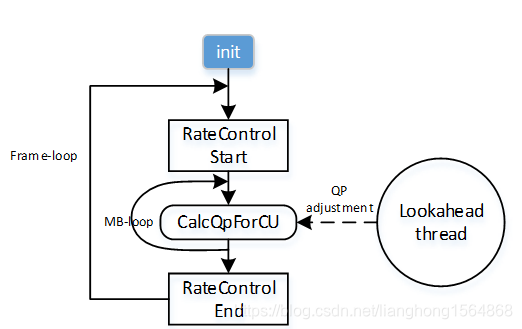

[原图](../videocodeciamges/x265.jpg)

# main ()函数——解析函数参数并进行编码准备工作：x265.cpp

（1）GetConsoleTitle(orgConsoleTitle, CONSOLE_TITLE_SIZE)：获取控制台窗口
（2）cliopt.parse()函数：解析参数，直接调用可打印输入视频的详细信息
（3）api->encoder_open()函数：打开编码器配置
（4）api->encoder_headers()函数：设置NAL相关信息
（5）api->encoder_encode()函数：进入编码函数
（6）api->encoder_close()函数：结束编码并进行总结


## 1.clioptions 结构体分析


~~~c++
/* 命令行接口 */
struct CLIOptions
{
    InputFile*  input;          // 输入文件，抽象类, 定义在 \input\input.h 中
    ReconFile*  recon;          // 重构文件，抽象类，定义在 \output\output.h 中
    OutputFile* output;         // 输出文件，抽象类，定义在 \output\output.h 中
    FILE*       qpfile;         // 量化因子文件指针
    FILE*       csvfpt;         // csv日志文件指针
    const char* csvfn;          // csv日志文件名
    const char* reconPlayCmd;   
    const x265_api* api;        // 
    x265_param* param;          // x265编码器参数集
    bool bProgress;             // 是否输出编码进度和其他一些编码状态数据
    bool bForceY4m;             // 如果输入文件是Y4M格式，需要强制指定输入格式
    bool bDither;
    int csvLogLevel;            // csv日志级别，log level定义在 x265.h中
    uint32_t seek;              // 输入视频起始需要跳过的帧数
    uint32_t framesToBeEncoded; // 待编码的帧数
    uint64_t totalbytes;        // 已编码的数据字节数
    int64_t startTime;          // 起始编码时间点
    int64_t prevUpdateTime;     // 上一次编码信息输出的时间点

```
/* in microseconds，相邻两次编码状态输出的最小时间间隔，单位微妙 */
static const int UPDATE_INTERVAL = 250000;
 
// 构造函数，初始化上述各成员变量
CLIOptions()
{
    … … … … 
}
 
void destroy();
void printStatus(uint32_t frameNum);        // 打印编码状态信息
bool parse(int argc, char **argv);          // 解释命令行参数
bool parseQPFile(x265_picture &pic_org);    // 解释量化因子QP文件
```

};

/* 打印编码状态信息 */
void CLIOptions::printStatus(uint32_t frameNum)
{
    char buf[200];
    int64_t time = x265_mdate();

```
    // 是否输出编码状态信息取决于：进度开关、当前编码帧数、上次信息输出和当前时间的间隔
    if (!bProgress || !frameNum || (prevUpdateTime && time - prevUpdateTime < UPDATE_INTERVAL))
        return;

    // 计算编码帧率和码率
    int64_t elapsed = time - startTime;
    double fps = elapsed > 0 ? frameNum * 1000000. / elapsed : 0;
    float bitrate = 0.008f * totalbytes * (param->fpsNum / param->fpsDenom) / ((float)frameNum);
    if (framesToBeEncoded)
    {
        int eta = (int)(elapsed * (framesToBeEncoded - frameNum) / ((int64_t)frameNum * 1000000));
        sprintf(buf, "x265 [%.1f%%] %d/%d frames, %.2f fps, %.2f kb/s, 
            eta %d:%02d:%02d", 100. * frameNum / framesToBeEncoded, frameNum, 
            framesToBeEncoded, fps, bitrate, eta / 3600, (eta / 60) % 60, eta % 60);
    }
    else
        sprintf(buf, "x265 %d frames: %.2f fps, %.2f kb/s", frameNum, fps, bitrate);

    fprintf(stderr, "%s  \r", buf + 5);
    SetConsoleTitle(buf);
    fflush(stderr);             // needed in windows
    prevUpdateTime = time;


}
~~~

## 2.cliopt.parse(argc, argv) 

cliopt.parse(argc, argv)的主要功能是分析參数，直接调用x265.cpp中的bool CLIOptions::parse(int argc, char **argv)函数，该函数会打印输入视频的分辨率、帧率、视频格式、所要编码的帧数目以及输出文件名等。


## 3.parseQPFile(x265_picture &pic_org); 

// 解析量化因子QP文件

## 4.main流程

~~~c++
/*=============================================================*/
/* CLI return codes:
 *

- 0 - encode successful

- 1 - unable to parse command line

- 2 - unable to open encoder

- 3 - unable to generate stream headers

- 4 - encoder abort

- 5 - unable to open csv file
  *
   */
  int main(int argc, char **argv)	//主函数入口
  {
  #if HAVE_VLD
  // This uses Microsoft's proprietary WCHAR type, but this only builds on Windows to start with
  VLDSetReportOptions(VLD_OPT_REPORT_TO_DEBUGGER | VLD_OPT_REPORT_TO_FILE, L"x265_leaks.txt");
  #endif
  PROFILE_INIT();
  THREAD_NAME("API", 0);

  GetConsoleTitle(orgConsoleTitle, CONSOLE_TITLE_SIZE);	//获取控制台窗体
  SetThreadExecutionState(ES_CONTINUOUS | ES_SYSTEM_REQUIRED | ES_AWAYMODE_REQUIRED);

  ReconPlay* reconPlay = NULL;
  CLIOptions cliopt;

  if (cliopt.parse(argc, argv))	//==========分析參数。对编码器的參数进行设定，打开文件
  {
      cliopt.destroy();
      if (cliopt.api)
          cliopt.api->param_free(cliopt.param);
      exit(1);
  }

  x265_param* param = cliopt.param;
  const x265_api* api = cliopt.api;

  /* This allows muxers to modify bitstream format */
  cliopt.output->setParam(param);

  if (cliopt.reconPlayCmd)
      reconPlay = new ReconPlay(cliopt.reconPlayCmd, *param);

  /* note: we could try to acquire a different libx265 API here based on

  - the profile found during option parsing, but it must be done before
  - opening an encoder */

  x265_encoder *encoder = api->encoder_open(param);	//==========encoder_open()函数，打印编码器配置
  if (!encoder)	//若打不开编码器配置。提示错误
  {
      x265_log(param, X265_LOG_ERROR, "failed to open encoder\n");
      cliopt.destroy();
      api->param_free(param);
      api->cleanup();
      exit(2);
  }

  /* get the encoder parameters post-initialization */
  api->encoder_parameters(encoder, param);

  if (cliopt.csvfn)
  {
      cliopt.csvfpt = x265_csvlog_open(*api, *param, cliopt.csvfn, cliopt.csvLogLevel);
      if (!cliopt.csvfpt)
      {
          x265_log(param, X265_LOG_ERROR, "Unable to open CSV log file <%s>, aborting\n", cliopt.csvfn);
          cliopt.destroy();
          if (cliopt.api)
              cliopt.api->param_free(cliopt.param);
          exit(5);
      }
  }

  /* Control-C handler */
  //当键入Ctrl-C的时候，当前运行程序调用指针函数sigint_handler 运行完后，再返回原来运行的地方接着往下走。

if (signal(SIGINT, sigint_handler) == SIG_ERR)
        x265_log(param, X265_LOG_ERROR, "Unable to register CTRL+C handler: %s\n", strerror(errno));

```
x265_picture pic_orig, pic_out;		//定义x265的输入pic_orig和输出pic_out
x265_picture *pic_in = &pic_orig;	//获取x265的输入pic_orig的地址
 
/* Allocate recon picture if analysisMode is enabled */
std::priority_queue<int64_t>* pts_queue = cliopt.output->needPTS() ? new std::priority_queue<int64_t>() : NULL;
x265_picture *pic_recon = (cliopt.recon || !!param->analysisMode || pts_queue || reconPlay || cliopt.csvLogLevel) ?
```

&pic_out : NULL;

```
uint32_t inFrameCount = 0;	//输入的帧数
uint32_t outFrameCount = 0;	//输出的帧数
 
x265_nal *p_nal;
x265_stats stats;
uint32_t nal;
int16_t *errorBuf = NULL;
int ret = 0;
 
if (!param->bRepeatHeaders)
{
    if (api->encoder_headers(encoder, &p_nal, &nal) < 0)	//==========encoder_headers函数
    {
        x265_log(param, X265_LOG_ERROR, "Failure generating stream headers\n");
        ret = 3;
        goto fail;
    }
    else
        cliopt.totalbytes += cliopt.output->writeHeaders(p_nal, nal);
}
 
api->picture_init(param, pic_in);
 
if (cliopt.bDither)
{
    errorBuf = X265_MALLOC(int16_t, param->sourceWidth + 1);
    if (errorBuf)
        memset(errorBuf, 0, (param->sourceWidth + 1) * sizeof(int16_t));
    else
        cliopt.bDither = false;
}
 
// main encoder loop（编码主循环）
while (pic_in && !b_ctrl_c)
{
    pic_orig.poc = inFrameCount;
    if (cliopt.qpfile)
    {
        if (!cliopt.parseQPFile(pic_orig))
        {
            x265_log(NULL, X265_LOG_ERROR, "can't parse qpfile for frame %d\n", pic_in->poc);
            fclose(cliopt.qpfile);
            cliopt.qpfile = NULL;
        }
    }
 
	//当输入帧将要所有编码且输入的帧数大于或等于将要编码的帧数
    if (cliopt.framesToBeEncoded && inFrameCount >= cliopt.framesToBeEncoded)
        pic_in = NULL;
    else if (cliopt.input->readPicture(pic_orig))	//每读入一帧
        inFrameCount++;	//输入的帧数自加1
    else
        pic_in = NULL;
 
    if (pic_in)
    {
        if (pic_in->bitDepth > param->internalBitDepth && cliopt.bDither)
        {
            x265_dither_image(*api, *pic_in, cliopt.input->getWidth(), cliopt.input->getHeight(), errorBuf, param->internalBitDepth);
            pic_in->bitDepth = param->internalBitDepth;
        }
        /* Overwrite PTS */
        pic_in->pts = pic_in->poc;
    }
	//进行编码的入口函数，读入24帧后才開始编码
    int numEncoded = api->encoder_encode(encoder, &p_nal, &nal, pic_in, pic_recon);	//==========encoder_encode()函数。numEncoded是将要编码的帧数
    if (numEncoded < 0)
    {
        b_ctrl_c = 1;
        ret = 4;
        break;
    }
 
    if (reconPlay && numEncoded)
        reconPlay->writePicture(*pic_recon);
 
    outFrameCount += numEncoded;
 
    if (numEncoded && pic_recon && cliopt.recon)
        cliopt.recon->writePicture(pic_out);
    if (nal)
    {
        cliopt.totalbytes += cliopt.output->writeFrame(p_nal, nal, pic_out);
        if (pts_queue)
        {
            pts_queue->push(-pic_out.pts);
            if (pts_queue->size() > 2)
                pts_queue->pop();
        }
    }
 
    cliopt.printStatus(outFrameCount); //打印编码帧的详细信息
    if (numEncoded && cliopt.csvLogLevel)
        x265_csvlog_frame(cliopt.csvfpt, *param, *pic_recon, cliopt.csvLogLevel);
}
 
/* Flush the encoder */
/*功能：前面读入24帧后才開始编码，此处事实上就是处理相应的倒数的24帧，将其存储*/
while (!b_ctrl_c)	//退出上一个大循环后且没有按下Ctrl+C，代码继续运行
{
    //==========encoder_encode()函数
	int numEncoded = api->encoder_encode(encoder, &p_nal, &nal, NULL, pic_recon);
    if (numEncoded < 0)
    {
        ret = 4;
        break;
    }
 
    if (reconPlay && numEncoded)
        reconPlay->writePicture(*pic_recon);
 
    outFrameCount += numEncoded;
    if (numEncoded && pic_recon && cliopt.recon)
        cliopt.recon->writePicture(pic_out);
    if (nal)
    {
        cliopt.totalbytes += cliopt.output->writeFrame(p_nal, nal, pic_out);
        if (pts_queue)
        {
            pts_queue->push(-pic_out.pts);
            if (pts_queue->size() > 2)
                pts_queue->pop();
        }
    }
 
    cliopt.printStatus(outFrameCount);
    if (numEncoded && cliopt.csvLogLevel)
        x265_csvlog_frame(cliopt.csvfpt, *param, *pic_recon, cliopt.csvLogLevel);
 
    if (!numEncoded)
        break;
}
 
/* clear progress report */
if (cliopt.bProgress)
    fprintf(stderr, "%*s\r", 80, " ");
```

fail:

```
delete reconPlay;
 
api->encoder_get_stats(encoder, &stats, sizeof(stats));
if (cliopt.csvfpt && !b_ctrl_c)
    x265_csvlog_encode(cliopt.csvfpt, *api, *param, stats, cliopt.csvLogLevel, argc, argv);
api->encoder_close(encoder);	//==========encoder_close()函数
 
int64_t second_largest_pts = 0;
int64_t largest_pts = 0;
if (pts_queue && pts_queue->size() >= 2)
{
    second_largest_pts = -pts_queue->top();
    pts_queue->pop();
    largest_pts = -pts_queue->top();
    pts_queue->pop();
    delete pts_queue;
    pts_queue = NULL;
}
cliopt.output->closeFile(largest_pts, second_largest_pts);
 
if (b_ctrl_c)	//按下Ctrl+C，直接退出
    general_log(param, NULL, X265_LOG_INFO, "aborted at input frame %d, output frame %d\n",
                cliopt.seek + inFrameCount, stats.encodedPictureCount);
 
api->cleanup(); /* Free library singletons */
 
cliopt.destroy();
 
api->param_free(param);
 
X265_FREE(errorBuf);
 
SetConsoleTitle(orgConsoleTitle);	//设置控制窗体标题
SetThreadExecutionState(ES_CONTINUOUS);
```

#if HAVE_VLD
    assert(VLDReportLeaks() == 0);
#endif

```
return ret;
```

}
~~~


## encoder.cpp注释

在x265中，main()函数中调用了encoder_encode()函数，而encoder_encode()函数调用了encode()函数，encode()函数的主要功能是输入一帧图像，得到一帧图像的输出。

        encode()函数主要包括大致三个部分：

（1）分析是否由于错误造成的代码终止，如g_checkFailures、m_aborted。

（2）判断是否有输入帧，若有，则判断该输入帧的像素深度、颜色空间是否支持，并判断List是否为空，若为空则创建；除此之外，还有一个比较重要的变量，即ret，此处初始化了ret为0，ret用于判断encode()函数的执行状况，0代表当前没有可供输出的重构帧，则返回encoder_encode()函数进行处理，1代表有输出，从encode()函数的最后一行代码return ret可以证实这一点。

（3）用一个do/while()判断是否有输出，若有则ret为1，并且调用了startCompressFrame()函数，startCompressFrame()函数的主要目的就是触发线程，为进一步的编码做准备。


```c++
/**

- Feed one new input frame into the encoder, get one frame out. If pic_in is
- NULL, a flush condition is implied and pic_in must be NULL for all subsequent
- calls for this encoder instance.
  *
- pic_in  input original YUV picture or NULL
- pic_out pointer to reconstructed picture struct
  *
- returns 0 if no frames are currently available for output
- 1 if frame was output, m_nalList contains access unit
- negative on malloc error or abort */

//（1）分析是否由于错误造成的代码终止，如g_checkFailures、m_aborted。
int Encoder::encode(const x265_picture* pic_in, x265_picture* pic_out)
{
#if CHECKED_BUILD || _DEBUG
    if (g_checkFailures)
    {
        x265_log(m_param, X265_LOG_ERROR, "encoder aborting because of internal error\n");
        return -1;
    }
#endif
    if (m_aborted)
        return -1;
//输出图片吗？？？？
    if (m_exportedPic)
    {
        ATOMIC_DEC(&m_exportedPic->m_countRefEncoders);
        m_exportedPic = NULL;
        m_dpb->recycleUnreferenced();
    }
 2   //若有图片输入时
    if (pic_in)
    {
    //判断输入帧的颜色空间是否支持（（取样格式 4:4:4 4:2:0）），若不支持，打印错误 Unsupported color space on input
        if (pic_in->colorSpace != m_param->internalCsp)
        {
            x265_log(m_param, X265_LOG_ERROR, "Unsupported color space (%d) on input\n",
                     pic_in->colorSpace);
            return -1;//异常退出
        }
        //输入的每一帧的深度必须处于8至16范围内（检错像素深度） 否则 打印错误
        if (pic_in->bitDepth < 8 || pic_in->bitDepth > 16)
        {
            x265_log(m_param, X265_LOG_ERROR, "Input bit depth (%d) must be between 8 and 16\n",
                     pic_in->bitDepth);
            return -1;
        }
```


```c++
    Frame *inFrame;//create空间 用于存储视频帧
    //若List为空，则创建
    if (m_dpb->m_freeList.empty())
    {
        inFrame = new Frame; //创建空间
        //语法 A？X：Y     "A"为判断条件，“A"为真时为X，”A”不成立时为”Y"。
        x265_param* p = m_reconfigured? m_latestParam : m_param;//判断是否是重新配置的 ，否则选择新的配置文件
        if (inFrame->create(p)) //申请frame空间
        { //第一个创建的PicYuv被要求生成CU和块单元偏移量。数组用于与所有后续的PicYuv（原始和重建）共享。
            /* the first PicYuv created is asked to generate the CU and block unit offset
             * arrays which are then shared with all subsequent PicYuv (orig and recon) 
             * allocated by this top level encoder */
 
            if (m_cuOffsetY)
            {//将encoder offset指针赋值到对应m_fencPic对象中
            //m_cuOffsetY;  申请空间为一帧LCU个数，按照行列对应亮度LCU的pixel地址（ 每个CTU中三个颜色分量的偏移地址 ）
            //m_cuOffsetC; 申请空间为一帧LCU个数，按照行列对应色度LCU的pixel地址 ??有区别吗
            //m_buOffsetY;  申请空间为一个LCU的part个数（默认256个4x4），为当前亮度位置与LCU首地址的偏移地址 （CTU中每个4x4分量的偏移地址）
            //m_buOffsetC;  申请空间为一个LCU的part个数（默认256个4x4），为当前色度位置与LCU首地址的偏移地址 （CTU中每个4x4分量的偏移地址）
 
                inFrame->m_fencPic->m_cuOffsetC = m_cuOffsetC;
                inFrame->m_fencPic->m_cuOffsetY = m_cuOffsetY;
                inFrame->m_fencPic->m_buOffsetC = m_buOffsetC;
                inFrame->m_fencPic->m_buOffsetY = m_buOffsetY;
            }
            else
            {//申请偏移计算空间  如果是0偏移空间？？
                if (!inFrame->m_fencPic->createOffsets(m_sps))
                {// m_aborted报错设置true
                    m_aborted = true;
                    x265_log(m_param, X265_LOG_ERROR, "memory allocation failure, aborting encode\n");
                    inFrame->destroy();
                    delete inFrame;
                    return -1;//退出
                }
                else //申请偏移计算空间正常  正常赋值
                {
                    m_cuOffsetC = inFrame->m_fencPic->m_cuOffsetC;
                    m_cuOffsetY = inFrame->m_fencPic->m_cuOffsetY;
                    m_buOffsetC = inFrame->m_fencPic->m_buOffsetC;
                    m_buOffsetY = inFrame->m_fencPic->m_buOffsetY;
                }
            }
        }
        else //
        {
            m_aborted = true;
            x265_log(m_param, X265_LOG_ERROR, "memory allocation failure, aborting encode\n");
            inFrame->destroy();
            delete inFrame;
            return -1;
        }
    }
    else //列表非空的情况 则popBack  前面执行if (m_dpb->m_freeList.empty())
    {
        inFrame = m_dpb->m_freeList.popBack();
        inFrame->m_lowresInit = false; //标示初始化失败
    }
 
    /* Copy input picture into a Frame and PicYuv, send to lookahead */
    inFrame->m_fencPic->copyFromPicture(*pic_in, m_sps.conformanceWindow.rightOffset, m_sps.conformanceWindow.bottomOffset);
 
    inFrame->m_poc       = ++m_pocLast;//累加读入帧数 m_pocLast：当前已经读入的视频帧数（从0开始计数，初始化为-1）time index (POC)
    inFrame->m_userData  = pic_in->userData;
    inFrame->m_pts       = pic_in->pts;//累加读入帧数
    inFrame->m_forceqp   = pic_in->forceqp; //m_qp = (int32_t)(curFrame->m_forceqp + 0.5) - 1; ？是步进值吗
    inFrame->m_param     = m_reconfigured ? m_latestParam : m_param;//参数重置
 
   // 第一帧，其值等于最先进入的pts号(一般等于0) pts:进程
    if (m_pocLast == 0)
        m_firstPts = inFrame->m_pts;
   //m_bframeDelay 延迟帧数：p->bframes ? (p->bBPyramid ? 2 : 1) : 0;  一般等于2
    if (m_bframeDelay && m_pocLast == m_bframeDelay)
        m_bframeDelayTime = inFrame->m_pts - m_firstPts;// 计算延迟的pts号个数
 
    /* Encoder holds a reference count until stats collection is finished */
    //编码器持有一个引用计数，直到统计资料收集完成。
    //atomic_inc(&v)对变量增加1 （所谓原子操作，就是该操作绝不会在执行完毕前被任何其他任务或事件打断）
    ATOMIC_INC(&inFrame->m_countRefEncoders);将当前的被参考次数设置为1 防止后面被释放 此处值为1
    //??
    if ((m_param->rc.aqMode || m_param->bEnableWeightedPred || m_param->bEnableWeightedBiPred) &&
        (m_param->rc.cuTree && m_param->rc.bStatRead))
    {
        if (!m_rateControl->cuTreeReadFor2Pass(inFrame))
        {
            m_aborted = 1;
            return -1;
        }
    }
 
    /* Use the frame types from the first pass, if available */
    // 1pass中，如果没有经过parseQPFile(解析QPF文件)，则slicetyoe 为X265_TYPE_AUTO
    int sliceType = (m_param->rc.bStatRead) ? m_rateControl->rateControlSliceType(inFrame->m_poc) : pic_in->sliceType;
 
    /* In analysisSave mode, x265_analysis_data is allocated in pic_in and inFrame points to this */
    /* Load analysis data before lookahead->addPicture, since sliceType has been decided */
    //在analysisSave模式中，x265_analysis_data被分配到pic_in中，inFrame指向此
    //在lookahead->addPicture之前加载分析数据，因为sliceType已经确定
    if (m_param->analysisMode == X265_ANALYSIS_LOAD)
    {
        x265_picture* inputPic = const_cast<x265_picture*>(pic_in);
        /* readAnalysisFile reads analysis data for the frame and allocates memory based on slicetype */
        //readAnalysisFile 读取框架的分析数据，并根据slicetype分配内存。
        readAnalysisFile(&inputPic->analysisData, inFrame->m_poc);
        inFrame->m_analysisData.poc = inFrame->m_poc;
        inFrame->m_analysisData.sliceType = inputPic->analysisData.sliceType;
        inFrame->m_analysisData.numCUsInFrame = inputPic->analysisData.numCUsInFrame;
        inFrame->m_analysisData.numPartitions = inputPic->analysisData.numPartitions;
        inFrame->m_analysisData.interData = inputPic->analysisData.interData;
        inFrame->m_analysisData.intraData = inputPic->analysisData.intraData;
        sliceType = inputPic->analysisData.sliceType;
    }
 
    m_lookahead->addPicture(*inFrame, sliceType);//向输入列表中添加原始帧准备帧类型决策，在buffer满时，触发帧类型决策
    m_numDelayedPic++;//当前列表中有多少帧未编码 每当读入一帧++，每当编码完毕一帧减--
}
else//没有图输入
    m_lookahead->flush();//当前已经读取原始帧完毕，往后不用再继续读取，告知lookahead已满
 
FrameEncoder *curEncoder = m_frameEncoder[m_curEncoder];// 获取当前frameEncoder
m_curEncoder = (m_curEncoder + 1) % m_param->frameNumThreads;// 记录下一个frameEncoder
int ret = 0;//ret，此处初始化了ret为0，ret用于判断encode()函数的执行状况，0代表当前没有可供输出的重构帧，则返回encoder_encode()函数进行处理，1代表有输出，从encode()函数的最后一行代码return ret可以证实这一点。
```

 

```c++
/* Normal operation is to wait for the current frame encoder to complete its current frame
 * and then to give it a new frame to work on.  In zero-latency mode, we must encode this
 * input picture before returning so the order must be reversed. This do/while() loop allows
 * us to alternate the order of the calls without ugly code replication */
 //不等待返回当前帧 直接对下一个编码
Frame* outFrame = NULL;
Frame* frameEnc = NULL;
int pass = 0;//零延迟情况：有两个取值（0,1） 0表示读帧类型决定完毕的帧准备编码 1表示编码完毕写数据
do//循环功能：零延迟情况：pass=0 编码 pass =1 编码完毕写数据 循环两次   其它情况：只做一次 多线程控制编码与写数据
{
    /* getEncodedPicture() should block until the FrameEncoder has completed
     * encoding the frame.  This is how back-pressure through the API is
     * accomplished when the encoder is full */
    if (!m_bZeroLatency || pass)//pass=1 编码完毕
        outFrame = curEncoder->getEncodedPicture(m_nalList);//获取已经编码完毕的帧
    if (outFrame)//如果已经编码过
    {
        Slice *slice = outFrame->m_encData->m_slice;
        x265_frame_stats* frameData = NULL;
 
        /* Free up pic_in->analysisData since it has already been used */
        //释放pic_in->analysisData，因为它已经被使用了
        if (m_param->analysisMode == X265_ANALYSIS_LOAD)
            freeAnalysis(&outFrame->m_analysisData);
 
        if (pic_out)//pic_out是输出重构图像 有输出
        {
            PicYuv *recpic = outFrame->m_reconPic;
            pic_out->poc = slice->m_poc;
            pic_out->bitDepth = X265_DEPTH;
            pic_out->userData = outFrame->m_userData;
            pic_out->colorSpace = m_param->internalCsp;
            frameData = &(pic_out->frameData);
 
            pic_out->pts = outFrame->m_pts;
            pic_out->dts = outFrame->m_dts;
            //判断该帧的类型--I/P/B
            switch (slice->m_sliceType)
            {
            case I_SLICE:
                pic_out->sliceType = outFrame->m_lowres.bKeyframe ? X265_TYPE_IDR : X265_TYPE_I;
                break;
            case P_SLICE:
                pic_out->sliceType = X265_TYPE_P;
                break;
            case B_SLICE:
                pic_out->sliceType = X265_TYPE_B;
                break;
            }
 
            pic_out->planes[0] = recpic->m_picOrg[0];
            pic_out->stride[0] = (int)(recpic->m_stride * sizeof(pixel));
            pic_out->planes[1] = recpic->m_picOrg[1];
            pic_out->stride[1] = (int)(recpic->m_strideC * sizeof(pixel));
            pic_out->planes[2] = recpic->m_picOrg[2];
            pic_out->stride[2] = (int)(recpic->m_strideC * sizeof(pixel));
 
            /* Dump analysis data from pic_out to file in save mode and free */
            //在保存模式下将分析数据从pic_out转储到文件中，并释放出来
            if (m_param->analysisMode == X265_ANALYSIS_SAVE)
            {
                pic_out->analysisData.poc = pic_out->poc;
                pic_out->analysisData.sliceType = pic_out->sliceType;
                pic_out->analysisData.numCUsInFrame = outFrame->m_analysisData.numCUsInFrame;
                pic_out->analysisData.numPartitions = outFrame->m_analysisData.numPartitions;
                pic_out->analysisData.interData = outFrame->m_analysisData.interData;
                pic_out->analysisData.intraData = outFrame->m_analysisData.intraData;
                writeAnalysisFile(&pic_out->analysisData);
                freeAnalysis(&pic_out->analysisData);
            }
        }
        if (slice->m_sliceType == P_SLICE)
        {
            if (slice->m_weightPredTable[0][0][0].bPresentFlag)
                m_numLumaWPFrames++;
            if (slice->m_weightPredTable[0][0][1].bPresentFlag ||
                slice->m_weightPredTable[0][0][2].bPresentFlag)
                m_numChromaWPFrames++;
        }
        else if (slice->m_sliceType == B_SLICE)
        {
            bool bLuma = false, bChroma = false;
            for (int l = 0; l < 2; l++)
            {
                if (slice->m_weightPredTable[l][0][0].bPresentFlag)
                    bLuma = true;
                if (slice->m_weightPredTable[l][0][1].bPresentFlag ||
                    slice->m_weightPredTable[l][0][2].bPresentFlag)
                    bChroma = true;
            }
 
            if (bLuma)
                m_numLumaWPBiFrames++;
            if (bChroma)
                m_numChromaWPBiFrames++;
        }
 
        if (m_aborted)
            return -1;
 
        finishFrameStats(outFrame, curEncoder, curEncoder->m_accessUnitBits, frameData);
 
        /* Write RateControl Frame level stats in multipass encodes */
        if (m_param->rc.bStatWrite)
            if (m_rateControl->writeRateControlFrameStats(outFrame, &curEncoder->m_rce))
                m_aborted = true;
 
        /* Allow this frame to be recycled if no frame encoders are using it for reference */
        //如果没有帧编码器使用该帧作为参考，允许该帧被回收。
        if (!pic_out) //没有输出图像
        {
            ATOMIC_DEC(&outFrame->m_countRefEncoders);
            m_dpb->recycleUnreferenced();
        }
        else
            m_exportedPic = outFrame;
 
        m_numDelayedPic--;
 
        ret = 1;//有输出，则ret为1
    }
 
    /* pop a single frame from decided list, then provide to frame encoder
     * curEncoder is guaranteed to be idle at this point */
    if (!pass) //pass=0 有可用帧的时候才会进入 开始编码
        frameEnc = m_lookahead->getDecidedPicture();//获取已经得到帧类型的原始帧
    if (frameEnc && !pass)//pass=0 有可用帧的时候才会进入 开始编码
    {
        /* give this frame a FrameData instance before encoding */
        if (m_dpb->m_picSymFreeList)
        {
            frameEnc->m_encData = m_dpb->m_picSymFreeList;
            m_dpb->m_picSymFreeList = m_dpb->m_picSymFreeList->m_freeListNext;
            frameEnc->reinit(m_sps);
        }
        else
        {
            frameEnc->allocEncodeData(m_param, m_sps);//申请重构帧内存并初始化为0，申请一帧CTU的存储空间，初始化CTU、初始化统计信息
            Slice* slice = frameEnc->m_encData->m_slice;//获取slice指针
            slice->m_sps = &m_sps;//获取sps指针
            slice->m_pps = &m_pps;
            slice->m_maxNumMergeCand = m_param->maxNumMergeCand;//获取配置的Merge选择的候选个数
            slice->m_endCUAddr = slice->realEndAddress(m_sps.numCUsInFrame * NUM_4x4_PARTITIONS);//一帧中最后实际像素在帧中的4x4块标号+1
            frameEnc->m_reconPic->m_cuOffsetC = m_cuOffsetC;//将encoder offset指针赋值到对应frameEnc->m_reconPic对象中
            frameEnc->m_reconPic->m_cuOffsetY = m_cuOffsetY;
            frameEnc->m_reconPic->m_buOffsetC = m_buOffsetC;
            frameEnc->m_reconPic->m_buOffsetY = m_buOffsetY;
        }
 
        curEncoder->m_rce.encodeOrder = m_encodedFrameNum++;//获取当前编码顺序（从0开始计数）
        //计算有无延迟的dts
        if (m_bframeDelay)//有延迟 （获取DTS display time stamp 显示时间戳）
        {
            int64_t *prevReorderedPts = m_prevReorderedPts;
            //dts在开始不多于延迟帧数的时候需要计算，其它直接从数组中获
            frameEnc->m_dts = m_encodedFrameNum > m_bframeDelay
                ? prevReorderedPts[(m_encodedFrameNum - m_bframeDelay) % m_bframeDelay]
                : frameEnc->m_reorderedPts - m_bframeDelayTime;
            prevReorderedPts[m_encodedFrameNum % m_bframeDelay] = frameEnc->m_reorderedPts;
        }
        else
            frameEnc->m_dts = frameEnc->m_reorderedPts;//零延迟：解码顺序等于编码顺序
 
        /* Allocate analysis data before encode in save mode. This is allocated in frameEnc */
        if (m_param->analysisMode == X265_ANALYSIS_SAVE)
        {
            x265_analysis_data* analysis = &frameEnc->m_analysisData;
            analysis->poc = frameEnc->m_poc;
            analysis->sliceType = frameEnc->m_lowres.sliceType;
            uint32_t widthInCU       = (m_param->sourceWidth  + g_maxCUSize - 1) >> g_maxLog2CUSize;
            uint32_t heightInCU      = (m_param->sourceHeight + g_maxCUSize - 1) >> g_maxLog2CUSize;
 
            uint32_t numCUsInFrame   = widthInCU * heightInCU;
            analysis->numCUsInFrame  = numCUsInFrame;
            analysis->numPartitions  = NUM_4x4_PARTITIONS;
            allocAnalysis(analysis);
        }
 
        /* determine references, setup RPS, etc */
        //设置NAL单元类型，将待编码帧加入dpb（解码图片缓存区，不用于参考的图像输出后会被移除出DPB）列表，获取slice参考帧列表等slice参量，将该帧的参考帧的被参考次数加一
        m_dpb->prepareEncode(frameEnc);//准备编码前的一些工作，如决定参考帧,设置RPS等等
        //三种码率控制模式 qp模式…bitrate模式..crf模式
        //使用qp选项时，表示P帧的量化值为qp。I帧和B帧的量化值则是从--ipratio和--pbratio中取得
        if (m_param->rc.rateControlMode != X265_RC_CQP)//如果当前不是固定QP模式
            m_lookahead->getEstimatedPictureCost(frameEnc);//获取当前帧每个CTU行对应下采样帧的每个8x8的块cost的累计值
 
        /* Allow FrameEncoder::compressFrame() to start in the frame encoder thread */
        if (!curEncoder->startCompressFrame(frameEnc)) //编码线程的开始，调用了startCompressFrame()函数，而startCompressFrame()调用了m_enable.trigger()以触发线程  
            m_aborted = true;//报错？
    }
    else if (m_encodedFrameNum)//？？？零延迟情况：只有在pass=0？？？  其它情况：一般不进入？？？
        m_rateControl->setFinalFrameCount(m_encodedFrameNum); 
}
while (m_bZeroLatency && ++pass < 2);//循环功能：零延迟情况：pass=0 编码 pass =1 编码完毕写数据 循环两次   其它情况：只做一次 多线程控制编码与写数据
 
return ret;
```
}


# sao流程


​    

```c++
/* 对|num / den|四舍五入，然后前面添加符号 */
inline int32_t roundIBDI(int32_t num, int32_t den)
{
    return num >= 0 ? ((num * 2 + den)/(den * 2)) : -((-num * 2 + den)/(den * 2));
}
 
/* 获取输入变量x的符号 */
inline int8_t signOf(int x)
{
    return (x >> 31) | ((int)((((uint32_t)-x)) >> 31));
}
 
/* a等于b返回0， a小于b就返回-1，a大于b就返回1 */
inline int signOf2(const int a, const int b)
{
    int r = 0;
    if (a < b)  r = -1;
    if (a > b)  r = 1;
    return r;
}
 
/**
 * @brief 计算D_post和 D_pre的差值，其中D_pre和D_post分别表示原始像素与重构像素（SAO补偿前、补偿后）之间的失真。
 * @param count  : 一个CTB内某个特定SAO类型样本的个数
 * @param offset : 一个CTB内某个特定SAO类型样本的补偿值
 * @param offsetOrg : 原始像素与重构像素（SAO补偿前）之间的差值之和
 */
inline int64_t estSaoDist(int32_t count, int32_t offset, int32_t offsetOrg)
{
    return (count * offset - offsetOrg * 2) * offset;
}
 
/**
 * @brief 边界补偿模式下像素的5种分类 ：
 *        第1类谷点和第2类凹拐点，需要加上一个正补偿值；
 *        第4类峰点和第3类凸拐点，需要加上一个负补偿值；
 *        第0类像素不进行补偿。
 */
const uint32_t SAO::s_eoTable[NUM_EDGETYPE] =
{
    1, // 0
    2, // 1
    0, // 2
    3, // 3
    4  // 4
};
 
/**
 * @brief 创建SAO的部分参数
 */
bool SAO::create(x265_param* param, int initCommon)
{
    m_param = param;                        // 编码器参数集
    m_chromaFormat = param->internalCsp;    // 内部图像颜色空间，此处只考虑 I420
 
    // 色度水平和垂直方向移动的位数，对于I420格式的图像，此处都是1
    m_hChromaShift = CHROMA_H_SHIFT(param->internalCsp);
    m_vChromaShift = CHROMA_V_SHIFT(param->internalCsp);
 
    // 计算水平和垂直方向CU（编码单元）的个数，长度不足 g_maxCUSize 也算一个；
    // maxCUSize 表示CU的最大尺寸，此处取值为 64.
    m_numCuInWidth =  (m_param->sourceWidth + g_maxCUSize - 1) / g_maxCUSize;
    m_numCuInHeight = (m_param->sourceHeight + g_maxCUSize - 1) / g_maxCUSize;
 
    // maxY表示亮度的最大值，对于8位深度的图像来说，该最大值为255；
    // rangeExt 扩展范围为最大值的一半，此处为127；
    // numCtu 表示一帧中 CU （编码单元）的个数.
    const pixel maxY = (1 << X265_DEPTH) - 1;
    const pixel rangeExt = maxY >> 1;
    int numCtu = m_numCuInWidth * m_numCuInHeight;
 
    // 为当前CU的左边和上面CU申请空间，备份左边和上面CU主要用于预测当前CU；
    for (int i = 0; i < (param->internalCsp != X265_CSP_I400 ? 3 : 1); i++)
    {
        CHECKED_MALLOC(m_tmpL1[i], pixel, g_maxCUSize + 1);
        CHECKED_MALLOC(m_tmpL2[i], pixel, g_maxCUSize + 1);
 
        // SAO asm code will read 1 pixel before and after, so pad by 2
        // NOTE: m_param->sourceWidth+2 enough, to avoid condition check in 
        // copySaoAboveRef(), I alloc more up to 63 bytes in here
        CHECKED_MALLOC(m_tmpU[i], pixel, m_numCuInWidth * g_maxCUSize + 2 + 32);
        m_tmpU[i] += 1;
    }
 
    if (initCommon)
    {
        // 选择SAO方法处理去方块边界像素，如果开启则处理所有边界像素，
        // 关闭则不处理右边和下面边界的像素；缺省是关闭。
        if (m_param->bSaoNonDeblocked)
        {
            CHECKED_MALLOC(m_countPreDblk, PerPlane, numCtu);
            CHECKED_MALLOC(m_offsetOrgPreDblk, PerPlane, numCtu);
        }
        CHECKED_MALLOC(m_depthSaoRate, double, 2 * SAO_DEPTHRATE_SIZE);
 
        m_depthSaoRate[0 * SAO_DEPTHRATE_SIZE + 0] = 0;
        m_depthSaoRate[0 * SAO_DEPTHRATE_SIZE + 1] = 0;
        m_depthSaoRate[0 * SAO_DEPTHRATE_SIZE + 2] = 0;
        m_depthSaoRate[0 * SAO_DEPTHRATE_SIZE + 3] = 0;
        m_depthSaoRate[1 * SAO_DEPTHRATE_SIZE + 0] = 0;
        m_depthSaoRate[1 * SAO_DEPTHRATE_SIZE + 1] = 0;
        m_depthSaoRate[1 * SAO_DEPTHRATE_SIZE + 2] = 0;
        m_depthSaoRate[1 * SAO_DEPTHRATE_SIZE + 3] = 0;
 
        CHECKED_MALLOC(m_clipTableBase,  pixel, maxY + 2 * rangeExt);
        m_clipTable = &(m_clipTableBase[rangeExt]);
 
        // 创建一个快速查找表m_clipTable（用于补偿，限制越界），即:
        // {0, 0, ..., 0 (127个); 0, 1, 2, ..., 255; 255, 255, ..., 255（127个）}
        for (int i = 0; i < rangeExt; i++)
            m_clipTableBase[i] = 0;
        for (int i = 0; i < maxY; i++)
            m_clipTable[i] = (pixel)i;
        for (int i = maxY; i < maxY + rangeExt; i++)
            m_clipTable[i] = maxY;
    }
    else
    {
        // must initialize these common pointer outside of function
        m_countPreDblk = NULL;
        m_offsetOrgPreDblk = NULL;
        m_clipTableBase = NULL;
        m_clipTable = NULL;
    }
    return true;
fail:
    return false;
}
 
/* 为当前CTU的SAO参数分配空间并初始化 */
void SAO::allocSaoParam(SAOParam* saoParam) const
{
    int planes = (m_param->internalCsp != X265_CSP_I400) ? 3 : 1;
    saoParam->numCuInWidth  = m_numCuInWidth;
 
    for (int i = 0; i < planes; i++)
        saoParam->ctuParam[i] = new SaoCtuParam[m_numCuInHeight * m_numCuInWidth];
}
 
/**
 * @brief  根据SAO补偿模式对重构像素值进行补偿.
 * @param addr : 从上到下、从左到右，当前CTU的序号
 * @param typeIdx : SAO补偿模式，取值SAO_EO_X 或 SAO_BO
 * @param plane : 颜色空间平面的序号，亮度平面为0，两个色度平面分别为1和2. 
 */
void SAO::applyPixelOffsets(int addr, int typeIdx, int plane)
{
    // reconPic为YUV重构图像，rec为当面颜色平面当前CTU的在重构图像中起始地址
    PicYuv* reconPic = m_frame->m_reconPic; 
    pixel* rec = reconPic->getPlaneAddr(plane, addr);
 
    // 获取重构图像颜色平面对应的跨度，亮度和色度的跨度不一样
    intptr_t stride = plane ? reconPic->m_strideC : reconPic->m_stride;
    uint32_t picWidth  = m_param->sourceWidth;      // 原始图像的宽
    uint32_t picHeight = m_param->sourceHeight;     // 原始图像的高
    const CUData* cu = m_frame->m_encData->getPicCTU(addr);
    int ctuWidth  = g_maxCUSize;        // 当前CU的宽度
    int ctuHeight = g_maxCUSize;        // 当前CU的高度
 
    // 当前CU最左边的横坐标和最上面的纵坐标
    uint32_t lpelx = cu->m_cuPelX;
    uint32_t tpely = cu->m_cuPelY;
 
    // 如果是色度平面，相应的宽度和高度都要减半，即左移一位
    if (plane)
    {
        picWidth  >>= m_hChromaShift;
        picHeight >>= m_vChromaShift;
        ctuWidth  >>= m_hChromaShift;
        ctuHeight >>= m_vChromaShift;
        lpelx     >>= m_hChromaShift;
        tpely     >>= m_vChromaShift;
    }
 
    // 获取当前CU最右边和最下面的边界值，不超出原始图像的最右边和最下面
    uint32_t rpelx = x265_min(lpelx + ctuWidth,  picWidth);
    uint32_t bpely = x265_min(tpely + ctuHeight, picHeight);
 
    // 当前CU实际的宽度和高度，除了最右边和最下面的CU外，其他都是64x64
    ctuWidth  = rpelx - lpelx;
    ctuHeight = bpely - tpely;
 
    int8_t _upBuff1[MAX_CU_SIZE + 2], *upBuff1 = _upBuff1 + 1, signLeft1[2];
    int8_t _upBufft[MAX_CU_SIZE + 2], *upBufft = _upBufft + 1;
 
    memset(_upBuff1 + MAX_CU_SIZE, 0, 2 * sizeof(int8_t)); 
 
    pixel* tmpL = m_tmpL1[plane];
    pixel* tmpU = &(m_tmpU[plane][lpelx]);
    int8_t* offsetEo = m_offsetEo[plane];
 
    // 根据边界或边带类型进行相应的SAO补偿
    switch (typeIdx)
    {
        case SAO_EO_0: // dir: -
            {... ...}
        case SAO_EO_1: // dir: |
            {... ...}
        case SAO_EO_2: // dir: 135
            {... ...}
        case SAO_EO_3: // dir: 45
            {... ...}
        case SAO_BO:   // 边带补偿
            {... ...}
        default: break;
    }
}
 
/* 生成亮度CTU的各种模式下的SAO补偿值并进行补偿 */
void SAO::generateLumaOffsets(SaoCtuParam* ctuParam, int idxY, int idxX)
{
    PicYuv* reconPic = m_frame->m_reconPic;
    intptr_t stride = reconPic->m_stride;
    int ctuWidth  = g_maxCUSize;
    int ctuHeight = g_maxCUSize;
 
    // 根据idxX和idxY得到CTU的序号，再根据序号获取CTU在重构图像缓冲区中起始位置
    int addr = idxY * m_numCuInWidth + idxX;
    pixel* rec = reconPic->getLumaAddr(addr);
 
    // 如果是水平方向第一个CTU，则用m_tmpL1[0]保存CTU左边一列（即左边CTU最右边的一列，
    // 不属于该CTU）的重构值
    if (idxX == 0)
    {
        for (int i = 0; i < ctuHeight + 1; i++)
        {
            m_tmpL1[0][i] = rec[0];
            rec += stride;
        }
    }
 
    // 判断当前CTU是否与左边CTU的SAO模式一样
    bool mergeLeftFlag = (ctuParam[addr].mergeMode == SAO_MERGE_LEFT);
    int typeIdx = ctuParam[addr].typeIdx;
 
    // 当前CTU不是水平方向的最后一个CTU，则用m_tmpL2[0]来保存当前CTU最右边的一列
    //（属于该CTU）重构值,后续跟m_tmpL1[0]交换可以用于下一个CTU的SAO模式计算
    if (idxX != (m_numCuInWidth - 1))
    {
        rec = reconPic->getLumaAddr(addr);
        for (int i = 0; i < ctuHeight + 1; i++)
        {
            m_tmpL2[0][i] = rec[ctuWidth - 1];
            rec += stride;
        }
    }
 
    // SAO补偿模式总共五种，取值0 – 4.
    if (typeIdx >= 0)
    {
        // 如果跟左边的CTU相同的SAO模式，则 m_offsetEo 直接采用左边CTU的值
        if (!mergeLeftFlag)
        {
            if (typeIdx == SAO_BO)
            {
                memset(m_offsetBo[0], 0, sizeof(m_offsetBo[0]));
 
                for (int i = 0; i < SAO_NUM_OFFSET; i++)
                    m_offsetBo[0][((ctuParam[addr].bandPos + i) & (MAX_NUM_SAO_CLASS - 1))] = 
                                            (int8_t)(ctuParam[addr].offset[i] << SAO_BIT_INC);
            }
            else // 边界补偿，即SAO_EO_X, X = 0,1,2,3
            {
                int offset[NUM_EDGETYPE];
                offset[0] = 0;
                for (int i = 0; i < SAO_NUM_OFFSET; i++)
                    offset[i + 1] = ctuParam[addr].offset[i] << SAO_BIT_INC;
 
                for (int edgeType = 0; edgeType < NUM_EDGETYPE; edgeType++)
                    m_offsetEo[0][edgeType] = (int8_t)offset[s_eoTable[edgeType]];
            }
        }
 
        // m_offsetEo[0]保存了亮度平面各种边界或边带需要补偿的值,将该值用到SAO补偿中
        applyPixelOffsets(addr, typeIdx, 0);
    }
 
    // 交换m_tmpL1[0]与m_tmpL2[0]，就得到下一个CTU左边一列的重构值，即：m_tmpL1[0]
    std::swap(m_tmpL1[0], m_tmpL2[0]);
}
 
/* 生成色度CTU的各种模式下的SAO补偿值并进行补偿*/
void SAO::generateChromaOffsets(SaoCtuParam* ctuParam[3], int idxY, int idxX);
 
/* 统计当前CTU在BO和EO各模式下的像素归类，包括重构像素与原始像素差值之和，以及对classIdx的计数 */
void SAO::calcSaoStatsCTU(int addr, int plane)
{
    const PicYuv* reconPic = m_frame->m_reconPic;
    const CUData* cu = m_frame->m_encData->getPicCTU(addr);
    const pixel* fenc0 = m_frame->m_fencPic->getPlaneAddr(plane, addr);
    const pixel* rec0  = reconPic->getPlaneAddr(plane, addr);
    const pixel* fenc;
    const pixel* rec;
 
    // 亮度和色度平面的跨度不一样，plane为0表示亮度，非0表示色度
    intptr_t stride = plane ? reconPic->m_strideC : reconPic->m_stride;
    uint32_t picWidth  = m_param->sourceWidth;
    uint32_t picHeight = m_param->sourceHeight;
    int ctuWidth  = g_maxCUSize;
    int ctuHeight = g_maxCUSize;
    uint32_t lpelx = cu->m_cuPelX;      // 当前CTU最左边像素的横坐标
    uint32_t tpely = cu->m_cuPelY;      // 当前CTU最上面像素的纵坐标
 
    // 色度平面，相应的值都要减半，即左移一位
    if (plane)
    {
        picWidth  >>= m_hChromaShift;
        picHeight >>= m_vChromaShift;
        ctuWidth  >>= m_hChromaShift;
        ctuHeight >>= m_vChromaShift;
        lpelx     >>= m_hChromaShift;
        tpely     >>= m_vChromaShift;
    }
 
    // 当前CTU最右边像素的横坐标、最下面像素的纵坐标
    uint32_t rpelx = x265_min(lpelx + ctuWidth,  picWidth);
    uint32_t bpely = x265_min(tpely + ctuHeight, picHeight);
 
    // 当前CTU实际的宽度和高度，除了最右边和最下面的CTU外，其他CTU一般都是64x64
    ctuWidth  = rpelx - lpelx;
    ctuHeight = bpely - tpely;
 
    int startX, startY, endX, endY;
    const int plane_offset = plane ? 2 : 0;
    int skipB = 4, skipR = 5;
 
    int8_t _upBuff[2 * (MAX_CU_SIZE + 16 + 16)], *upBuff1 = _upBuff + 16, 
            *upBufft = upBuff1 +(MAX_CU_SIZE + 16 + 16);
    ALIGN_VAR_32(int16_t, diff[MAX_CU_SIZE * MAX_CU_SIZE]);
 
    // 计算 (fenc - frec)，结果放入diff中，即原始像素与重构像素间的失真
    if ((lpelx + ctuWidth <  picWidth) & (tpely + ctuHeight < picHeight))
    {
        // WARNING: *) May read beyond bound on video than ctuWidth or 
        // ctuHeight is NOT multiple of cuSize
        X265_CHECK((ctuWidth == ctuHeight) || (m_chromaFormat != X265_CSP_I420), 
                    "video size check failure\n");
 
        // 对于square的CU可以采用SIMD流指令计算(fenc - frec),
        // 此处 MAX_CU_SIZE = 64 可以看作 diff的跨度，fenc0和rec0的跨度都是stride
        if (plane)
            primitives.chroma[m_chromaFormat].cu[g_maxLog2CUSize - 2].
                        sub_ps(diff, MAX_CU_SIZE, fenc0, rec0, stride, stride);
        else
           primitives.cu[g_maxLog2CUSize - 2].sub_ps(diff, MAX_CU_SIZE, fenc0, rec0, stride, stride);
    }
    else
    {
        // path for non-square area (most in edge)
        // 最右边或最下面的CTU可能不是square，另外单独计算 (fenc - frec)
        for(int y = 0; y < ctuHeight; y++)
        {
            for(int x = 0; x < ctuWidth; x++)
            {
                diff[y * MAX_CU_SIZE + x] = (fenc0[y * stride + x] – rec0[y * stride + x]);
            }
        }
    }
 
    // SAO_BO:
    {
        // 缺省是disable，表示右边和底部边界不做去方块滤波
        if (m_param->bSaoNonDeblocked)
        {
            skipB = 3;
            skipR = 4;
        }
 
        endX = (rpelx == picWidth) ? ctuWidth : ctuWidth - skipR + plane_offset;
        endY = (bpely == picHeight) ? ctuHeight : ctuHeight - skipB + plane_offset;
 
        // 当前CTU按照BO补偿模式对像素进行归类，
        // 包括每个条带像素个数、原始像素与重构像素差值之和
        primitives.saoCuStatsBO(diff, rec0, stride, endX, endY, 
                        m_offsetOrg[plane][SAO_BO], m_count[plane][SAO_BO]);
    }
 
    // SAO_EO_0: // dir: -
    {
        if (m_param->bSaoNonDeblocked)  // 缺省是disable, 忽略
        {
             skipB = 3;
             skipR = 5;
        }
 
        startX = !lpelx;
        endX   = (rpelx == picWidth) ? ctuWidth - 1 : ctuWidth - skipR + plane_offset;
 
        // 当前CTU按照 EO_0 模式对像素进行归类
        primitives.saoCuStatsE0(diff + startX, rec0 + startX, stride, endX - startX, ctuHeight - skipB + 
                                plane_offset, m_offsetOrg[plane][SAO_EO_0], m_count[plane][SAO_EO_0]);
    }
 
    // SAO_EO_1: // dir: |
    {
        if (m_param->bSaoNonDeblocked)      // 缺省是disable, 忽略
        {
             skipB = 4;
             skipR = 4;
        }
 
        rec  = rec0;
 
        // 如果tpely = 0，就表示当前CTU位于最上方，因此从CTU的第二行开始进行统计
        startY = !tpely;
        endX   = (rpelx == picWidth) ? ctuWidth : ctuWidth - skipR + plane_offset;
        endY   = (bpely == picHeight) ? ctuHeight - 1 : ctuHeight - skipB + plane_offset;
        if (!tpely)
            rec += stride;      // 当前CTU第二行起始地址，为下面的sign计算做准备
 
        // 计算当前CTU第二行与第一行的像素差值，保存在 upBuff1 中
        primitives.sign(upBuff1, rec, &rec[- stride], ctuWidth);
 
        // 当前CTU按照 EO_1 模式对像素进行归类
        primitives.saoCuStatsE1(diff + startY * MAX_CU_SIZE, rec0 + startY * stride, stride, upBuff1, 
                           endX, endY - startY, m_offsetOrg[plane][SAO_EO_1], m_count[plane][SAO_EO_1]);
    }
 
    // SAO_EO_2: // dir: 135
    {
        if (m_param->bSaoNonDeblocked)      // 缺省是disable, 忽略
        {
             skipB = 4;
             skipR = 5;
        }
 
        fenc = fenc0;
        rec  = rec0;
 
        // 要计算某个像素与左上方像素（即135度方向）的差值，要确保左上方像素存在，
        // 因此如果CTU位于图像的最左边或最上方，startX、startY需为1
        startX = !lpelx;
        endX   = (rpelx == picWidth) ? ctuWidth - 1 : ctuWidth - skipR + plane_offset;
        startY = !tpely;
        endY   = (bpely == picHeight) ? ctuHeight - 1 : ctuHeight - skipB + plane_offset;
        if (!tpely)
        {
           fenc += stride;  // 原始图像第二行起始地址 
           rec  += stride;  // 当前CTU第二行起始地址，为下面的sign计算做准备
        }
 
        // 计算当前CTU第二行与第一行的像素差值(即与左上方像素的差值)，保存在 upBuff1 中
        primitives.sign(upBuff1, &rec[startX], &rec[startX - stride - 1], (endX - startX));
 
        // 当前CTU按照 EO_2 模式对像素进行归类
        primitives.saoCuStatsE2(diff + startX + startY * MAX_CU_SIZE, rec0  + startX + startY * stride, 
                            stride, upBuff1, upBufft, endX - startX, endY - startY, 
                            m_offsetOrg[plane][SAO_EO_2], m_count[plane][SAO_EO_2]);
    }
 
    // SAO_EO_3: // dir: 45
    {
        if (m_param->bSaoNonDeblocked)  // 缺省是disable, 忽略
        {
           skipB = 4;
           skipR = 5;
        }
 
        fenc = fenc0;
        rec  = rec0;
 
        startX = !lpelx;
        endX   = (rpelx == picWidth) ? ctuWidth - 1 : ctuWidth - skipR + plane_offset;
        startY = !tpely;
        endY   = (bpely == picHeight) ? ctuHeight - 1 : ctuHeight - skipB + plane_offset;
 
        if (!tpely)
        {
           fenc += stride;      // 原始图像第二行起始地址
           rec  += stride;      // 当前CTU第二行起始地址，为下面的sign计算做准备
        }
 
        // 计算当前CTU第二行与第一行的像素差值(即与右上方像素的差值)，保存在 upBuff1 中
        primitives.sign(upBuff1, &rec[startX - 1], &rec[startX - 1 - stride + 1],(endX - startX + 1));
 
        // 当前CTU按照 EO_3 模式对像素进行归类
        primitives.saoCuStatsE3(diff + startX + startY * MAX_CU_SIZE, rec0  + startX + startY * stride, 
                            stride, upBuff1 + 1, endX - startX, endY - startY, 
                            m_offsetOrg[plane][SAO_EO_3], m_count[plane][SAO_EO_3]);
    }
}
 
/* 去方块滤波前对CTU的像素统计归类，只有当SAO和bSaoNonDeblocked都开启的情况下才使用，因此暂时忽略 */
void SAO::calcSaoStatsCu_BeforeDblk(Frame* frame, int idxX, int idxY);
 
/* 计算CTU在各种模式下的最优SAO代价，与直接采用左边或上面CTU的SAO参数作比较，找出最优的SAO代价，
   并将最优SAO模式下的各种参数保存在 saoParam->ctuParam[plane][add]中 */
void SAO::rdoSaoUnitCu(SAOParam* saoParam, int rowBaseAddr, int idxX, int addr)
{
    Slice* slice = m_frame->m_encData->m_slice;
    const CUData* cu = m_frame->m_encData->getPicCTU(addr);
    int qp = cu->m_qp[0];
    int64_t lambda[2] = { 0 };
    int qpCb = qp;
 
    // 色度量化因子qpCb
    if (m_param->internalCsp == X265_CSP_I420)
        qpCb = x265_clip3(QP_MIN, QP_MAX_MAX, (int)g_chromaScale[qp + slice->m_pps->chromaQpOffset[0]]);
    else
        qpCb = X265_MIN(qp + slice->m_pps->chromaQpOffset[0], QP_MAX_SPEC);
 
    // lambda[0]用于亮度SAO参数计算，lambda[1]用于色度SAO参数计算
    lambda[0] = (int64_t)floor(256.0 * x265_lambda2_tab[qp]);
    lambda[1] = (int64_t)floor(256.0 * x265_lambda2_tab[qpCb]); 
 
    // 左边和上面的CU是否存在
    const bool allowMerge[2] = {(idxX != 0), (rowBaseAddr != 0)}; 
 
    // 左边和上面的CU的编号
    const int addrMerge[2] = {(idxX ? addr - 1 : -1), (rowBaseAddr ? addr - m_numCuInWidth : -1)};
 
    // 是否存在色度平面 
    bool chroma = m_param->internalCsp != X265_CSP_I400 && 
                  m_frame->m_fencPic->m_picCsp != X265_CSP_I400;
 
    // 我们只考虑I420格式，因此存在色度平面，因此此处planes取值3
    int planes = chroma ? 3 : 1;    
 
    // 选择SAO方法处理去方块边界像素，如果开启则处理所有边界像素，
    // 关闭则不处理右边和下面边界的像素；缺省是关闭。
    if (m_param->bSaoNonDeblocked)
    {
        memcpy(m_count, m_countPreDblk[addr], sizeof(m_count));
        memcpy(m_offsetOrg, m_offsetOrgPreDblk[addr], sizeof(m_offsetOrg));
    }
    else
    {   // 初始化各模式各类型点的个数和失真值为0
        memset(m_count, 0, sizeof(m_count));
        memset(m_offsetOrg, 0, sizeof(m_offsetOrg));
    }
 
    for (int i = 0; i < planes; i++)
        saoParam->ctuParam[i][addr].reset();
 
    // 统计当前CTU的亮度块在BO和EO各模式下的像素归类，
    // 包括重构像素与原始像素差值之和，以及对classIdx的计数
    if (saoParam->bSaoFlag[0])
        calcSaoStatsCTU(addr, 0);
 
    // 统计当前CTU的色度块在BO和EO各模式下的像素归类
    if (saoParam->bSaoFlag[1])
    {
        calcSaoStatsCTU(addr, 1);
        calcSaoStatsCTU(addr, 2);
    }
 
    // 利用上一步的统计信息计算BO和EO初始补偿值
    saoStatsInitialOffset(planes);
 
    // SAO distortion calculation
    m_entropyCoder.load(m_rdContexts.cur);
    m_entropyCoder.resetBits();
    if (allowMerge[0])
        m_entropyCoder.codeSaoMerge(0);
    if (allowMerge[1])
        m_entropyCoder.codeSaoMerge(0);
    m_entropyCoder.store(m_rdContexts.temp);
 
    // Estimate distortion and cost of new SAO params
    int64_t bestCost = 0;
    int64_t rateDist = 0;
 
    // Estimate distortion and cost of new SAO params
    // 亮度和色度最优SAO模式的选择，得到最优率失真代价
    saoLumaComponentParamDist(saoParam, addr, rateDist, lambda, bestCost);
    if (chroma)
        saoChromaComponentParamDist(saoParam, addr, rateDist, lambda, bestCost);
 
    if (saoParam->bSaoFlag[0] || saoParam->bSaoFlag[1])
    {
        // Cost of merge left or Up， mergeIdx为0表示左边，为1表示上面
        // 计算直接采用左边和上面CTU的SAO参数的代价
        for (int mergeIdx = 0; mergeIdx < 2; ++mergeIdx)
        {
            // 如果左边或上面的CTU不存在，则跳过下面的计算，进入下一轮循环
            if (!allowMerge[mergeIdx])
                continue;
 
            int64_t mergeDist = 0; 
            for (int plane = 0; plane < planes; plane++)
            {
                // 初始失真值为0，获取左边或上面CTU的SAO参数
                int64_t estDist = 0;
                SaoCtuParam* mergeSrcParam = &(saoParam->ctuParam[plane][addrMerge[mergeIdx]]);
                int typeIdx = mergeSrcParam->typeIdx;
                if (typeIdx >= 0)
                {
                    // 如果是边带模式，获取第一个条带的编号；否则取值1
                    int bandPos = (typeIdx == SAO_BO) ? mergeSrcParam->bandPos : 1;
                    for (int classIdx = 0; classIdx < SAO_NUM_OFFSET; classIdx++)
                    {
                        // 根据4种类型的补偿值来计算失真差值
                        int mergeOffset = mergeSrcParam->offset[classIdx];
                        estDist += estSaoDist(m_count[plane][typeIdx][classIdx + bandPos], mergeOffset, 
                                                m_offsetOrg[plane][typeIdx][classIdx + bandPos]);
                    }
                }
                mergeDist += (estDist << 8) / lambda[!!plane];
            }
 
            m_entropyCoder.load(m_rdContexts.cur);
            m_entropyCoder.resetBits();
            if (allowMerge[0])
                m_entropyCoder.codeSaoMerge(1 - mergeIdx);
            if (allowMerge[1] && (mergeIdx == 1))
                m_entropyCoder.codeSaoMerge(1);
 
            uint32_t estRate = m_entropyCoder.getNumberOfWrittenBits();
            int64_t mergeCost = mergeDist + estRate;
            if (mergeCost < bestCost)
            {
                // merge的代价比SAO各模式代价更小，就采用merge模式
                SaoMergeMode mergeMode = mergeIdx ? SAO_MERGE_UP : SAO_MERGE_LEFT;
                bestCost = mergeCost;
                m_entropyCoder.store(m_rdContexts.temp);
                for (int plane = 0; plane < planes; plane++)
                {
                    // 更新SAO参数为merge模式下的参数
                    if (saoParam->bSaoFlag[plane > 0])
                    {
                        SaoCtuParam* dstCtuParam   = &saoParam->ctuParam[plane][addr];
                        SaoCtuParam* mergeSrcParam = &(saoParam->ctuParam[plane][addrMerge[mergeIdx]]);
                        dstCtuParam->mergeMode = mergeMode;
                        dstCtuParam->typeIdx   = mergeSrcParam->typeIdx;
                        dstCtuParam->bandPos   = mergeSrcParam->bandPos;
 
                        for (int i = 0; i < SAO_NUM_OFFSET; i++)
                            dstCtuParam->offset[i] = mergeSrcParam->offset[i];
                    }
                }
            }   // if (mergeCost < bestCost) 结束
        }   // mergeIdx循环结束
 
        if (saoParam->ctuParam[0][addr].typeIdx < 0)
            m_numNoSao[0]++;
        if (chroma && saoParam->ctuParam[1][addr].typeIdx < 0)
            m_numNoSao[1]++;
        m_entropyCoder.load(m_rdContexts.temp);
        m_entropyCoder.store(m_rdContexts.cur);
    }
}
 
/* 利用先前已经得到的统计信息（即m_count和m_offsetOrg）计算初始补偿值(即m_offset) */
void SAO::saoStatsInitialOffset(int planes)
{
    memset(m_offset, 0, sizeof(m_offset));
 
    // EO
    for (int plane = 0; plane < planes; plane++)
    {
        // typeIdx, 边界补偿的四种模式，即 SAO_EO_X
        for (int typeIdx = 0; typeIdx < MAX_NUM_SAO_TYPE - 1; typeIdx++)
        {
            // 任意一种模式下，边界点有四个种类
            for (int classIdx = 1; classIdx < SAO_NUM_OFFSET + 1; classIdx++)
            {
                int32_t&  count     = m_count[plane][typeIdx][classIdx];
                int32_t& offsetOrg = m_offsetOrg[plane][typeIdx][classIdx];
                int32_t& offsetOut = m_offset[plane][typeIdx][classIdx];
 
                if (count)
                {
                    // 计算平均失真（offsetOrg/count并四舍五入），将其限制在[-7,7]之内
                    offsetOut = roundIBDI(offsetOrg, count << SAO_BIT_INC);
                    offsetOut = x265_clip3(-OFFSET_THRESH + 1, OFFSET_THRESH - 1, offsetOut);
 
                    // 种类1、种类2的补偿值必须大于等于0；
                    // 种类3、种类4的补偿值必须小于等于0.
                    if (classIdx < 3) 
                        offsetOut = X265_MAX(offsetOut, 0);
                    else
                        offsetOut = X265_MIN(offsetOut, 0);
                }
            }
        }
    }
 
    // BO，为每个条带计算初始补偿值
    for (int plane = 0; plane < planes; plane++)
    {
        // 深度8位，256级分为32个边带，即[8k, 8k + 7]为第k个边带
        for (int classIdx = 0; classIdx < MAX_NUM_SAO_CLASS; classIdx++)
        {
            int32_t&  count     = m_count[plane][SAO_BO][classIdx];
            int32_t& offsetOrg = m_offsetOrg[plane][SAO_BO][classIdx];
            int32_t& offsetOut = m_offset[plane][SAO_BO][classIdx];
 
            if (count)
            {
                // 计算平均失真，并将其限制在[-7,7]之内
                offsetOut = roundIBDI(offsetOrg, count << SAO_BIT_INC);
                offsetOut = x265_clip3(-OFFSET_THRESH + 1, OFFSET_THRESH - 1, offsetOut);
            }
        }
    }
}
 
/* 计算率失真代价值，公式为：（失真 + lambda * 编码比特数）*/
inline int64_t SAO::calcSaoRdoCost(int64_t distortion, uint32_t bits, int64_t lambda)
{
    // lambda = 256.0 * x265_lambda2_tab[],所以需要右移8位，即除以256
    // 数组x265_lambda2_tab 定义在 common/constants.cpp 中
    return distortion + ((bits * lambda + 128) >> 8);
}
 
/**
 * @brief 找到最优率失真代价及对应的补偿值和失真值.
 * @param typeIdx : SAO模式，即 SAO_EO_X 和 SAO_BO
 * @param lambda  : 拉格朗日乘子，取值依赖QP，即 256.0 * x265_lambda2_tab[qp]
 * @param count   : typeIdx模式下，某classIdx的点的数目
 * @param offsetOrg : 原始像素与重构像素（SAO补偿前）之间的差值之和
 * @param offset[输出] : 最优率失真代价对应的补偿值
 * @param distClasses[输出] : 最优率失真代价对应的失真
 * @param costClasses[输出] : 最优率失真代价
 */
void SAO::estIterOffset(int typeIdx, int64_t lambda, int32_t count, int32_t offsetOrg, 
                        int32_t& offset, int32_t& distClasses, int64_t& costClasses)
{
    int bestOffset = 0;
    distClasses    = 0;
 
    // Assuming sending quantized value 0 results in zero offset 
    // and sending the value zero needs 1 bit.
    // entropy coder can be used to measure the exact rate here.
    int64_t bestCost = calcSaoRdoCost(0, 1, lambda);
    while (offset != 0)
    {
        // Calculate the bits required for signalling the offset
        uint32_t rate = (typeIdx == SAO_BO) ? (abs(offset) + 2) : (abs(offset) + 1);
        if (abs(offset) == OFFSET_THRESH - 1)
            rate--;
 
        // Do the dequntization before distorion calculation
        // 计算D_post和 D_pre的差值,即SAO补偿前后失真的差值
        int64_t dist = estSaoDist(count, offset << SAO_BIT_INC, offsetOrg);
 
        // 计算率失真代价
        int64_t cost  = calcSaoRdoCost(dist, rate, lambda);
        if (cost < bestCost)
        {
            bestCost = cost;
            bestOffset = offset;
            distClasses = (int)dist;
        }
        offset = (offset > 0) ? (offset - 1) : (offset + 1);
    }
 
    costClasses = bestCost;
    offset = bestOffset;
}
 
/* 寻找亮度最优SAO模式，得到最优率失真代价 */
void SAO::saoLumaComponentParamDist(SAOParam* saoParam, int32_t addr, int64_t& rateDist, 
                                    int64_t* lambda, int64_t &bestCost)
{
    int64_t bestDist = 0;
    int bestTypeIdx = -1;
    SaoCtuParam* lclCtuParam = &saoParam->ctuParam[0][addr];
 
    int32_t distClasses[MAX_NUM_SAO_CLASS];
    int64_t costClasses[MAX_NUM_SAO_CLASS];
 
    // RDO SAO_NA
    m_entropyCoder.load(m_rdContexts.temp);
    m_entropyCoder.resetBits();
    m_entropyCoder.codeSaoType(0);
 
    // 计算初始的率失真代价值
    int64_t costPartBest = calcSaoRdoCost(0, m_entropyCoder.getNumberOfWrittenBits(), lambda[0]);
 
    // EO distortion calculation
    // 外循环是EO的模式，即4种方向，内循环是点的种类
    for (int typeIdx = 0; typeIdx < MAX_NUM_SAO_TYPE - 1; typeIdx++)
    {
        int64_t estDist = 0;        // 用于保存某EO模式下各种类失真总和
        for (int classIdx = 1; classIdx < SAO_NUM_OFFSET + 1; classIdx++)
        {
            int32_t&  count     = m_count[0][typeIdx][classIdx];
            int32_t& offsetOrg = m_offsetOrg[0][typeIdx][classIdx];
            int32_t& offsetOut = m_offset[0][typeIdx][classIdx];
 
            // 计算率失真代价值最小的 offset
            estIterOffset(typeIdx, lambda[0], count, offsetOrg, offsetOut, 
                            distClasses[classIdx], costClasses[classIdx]);
 
            // Calculate distortion
            estDist += distClasses[classIdx];
        }
 
        m_entropyCoder.load(m_rdContexts.temp);
        m_entropyCoder.resetBits();
        m_entropyCoder.codeSaoOffsetEO(m_offset[0][typeIdx] + 1, typeIdx, 0);
 
        // 计算某EO模式下的率失真代价，
        // 如果比前面计算的更小，则更新最优率失真代和相应的EO模式值
        int64_t cost = calcSaoRdoCost(estDist, m_entropyCoder.getNumberOfWrittenBits(), lambda[0]);
        if (cost < costPartBest)
        {
            costPartBest = cost;
            bestDist = estDist;
            bestTypeIdx = typeIdx;
        }
    }
 
    // 找到了最优的EO模式，则将最优模式值和补偿值保存起来
    if (bestTypeIdx != -1)
    {
        lclCtuParam->mergeMode = SAO_MERGE_NONE;
        lclCtuParam->typeIdx = bestTypeIdx;
        lclCtuParam->bandPos = 0;
        for (int classIdx = 0; classIdx < SAO_NUM_OFFSET; classIdx++)
            lclCtuParam->offset[classIdx] = m_offset[0][bestTypeIdx][classIdx + 1];
    }
 
    // BO RDO，为每个条带计算最优率失真代价及对应的补偿值
    // costClasses 保存了每个条带的最优率失真代价
    int64_t estDist = 0;
    for (int classIdx = 0; classIdx < MAX_NUM_SAO_CLASS; classIdx++)
    {
        int32_t&  count    = m_count[0][SAO_BO][classIdx];
        int32_t& offsetOrg = m_offsetOrg[0][SAO_BO][classIdx];
        int32_t& offsetOut = m_offset[0][SAO_BO][classIdx];
 
        estIterOffset(SAO_BO, lambda[0], count, offsetOrg, offsetOut, 
                        distClasses[classIdx], costClasses[classIdx]);
    }
 
    // Estimate Best Position
    int64_t bestRDCostBO = MAX_INT64;
    int32_t bestClassBO  = 0;
 
    // 统计任意连续4个条带的最优率失真代价之和，找出值最小的连续4个条带
    for (int i = 0; i < MAX_NUM_SAO_CLASS - SAO_NUM_OFFSET + 1; i++)
    {
        int64_t currentRDCost = 0;
        for (int j = i; j < i + SAO_NUM_OFFSET; j++)
            currentRDCost += costClasses[j];
 
        if (currentRDCost < bestRDCostBO)
        {
            bestRDCostBO = currentRDCost;
            bestClassBO  = i;                   // 连续4个条带的起始条带编号
        }
    }
 
    // 计算最优的连续4个条带的失真之和
    estDist = 0;
    for (int classIdx = bestClassBO; classIdx < bestClassBO + SAO_NUM_OFFSET; classIdx++)
        estDist += distClasses[classIdx];
 
    m_entropyCoder.load(m_rdContexts.temp);
    m_entropyCoder.resetBits();
    m_entropyCoder.codeSaoOffsetBO(m_offset[0][SAO_BO] + bestClassBO, bestClassBO, 0);
 
    // 计算BO模式下的率失真代价
    int64_t cost = calcSaoRdoCost(estDist, m_entropyCoder.getNumberOfWrittenBits(), lambda[0]);
 
    // 如果BO模式下的率失真代价比上面EO模式下的率失真代价更小，则更新相应的SAO参数
    if (cost < costPartBest)
    {
        costPartBest = cost;
        bestDist = estDist;
 
        lclCtuParam->mergeMode = SAO_MERGE_NONE;
        lclCtuParam->typeIdx = SAO_BO;
        lclCtuParam->bandPos = bestClassBO;
        for (int classIdx = 0; classIdx < SAO_NUM_OFFSET; classIdx++)
            lclCtuParam->offset[classIdx] = m_offset[0][SAO_BO][classIdx + bestClassBO];
    }
 
    rateDist = (bestDist << 8) / lambda[0];
    m_entropyCoder.load(m_rdContexts.temp);
    m_entropyCoder.codeSaoOffset(*lclCtuParam, 0);
    m_entropyCoder.store(m_rdContexts.temp);
}
 
/* 寻找色度最优SAO模式，得到最优率失真代价 */
void SAO::saoChromaComponentParamDist(SAOParam* saoParam, int32_t addr, 
                int64_t& rateDist, int64_t* lambda, int64_t &bestCost);
 
/* 统计某个CU内条带点数目及失真之和，count和stats分别是条带点计数和失真之和 */
void saoCuStatsBO_c(const int16_t *diff, const pixel *rec, intptr_t stride, 
                    int endX, int endY, int32_t *stats, int32_t *count)
{
    const int boShift = X265_DEPTH - SAO_BO_BITS;
 
    for (int y = 0; y < endY; y++)
    {
        for (int x = 0; x < endX; x++)
        {
            int classIdx = rec[x] >> boShift;   // 条带编号
            stats[classIdx] += diff[x];         // 某条带失真累计
            count[classIdx]++;                  // 某条带点数目累计
        }
 
        diff += MAX_CU_SIZE;        // 下一行失真数据地址
        rec += stride;              // 当前CU的下一行重构图像地址
    }
}
 
/* 统计CU内的点在EO_0模式（水平方向）下的各种类点的数目及失真之和 */
void saoCuStatsE0_c(const int16_t *diff, const pixel *rec, intptr_t stride, 
                    int endX, int endY, int32_t *stats, int32_t *count)
{
    int32_t tmp_stats[SAO::NUM_EDGETYPE];
    int32_t tmp_count[SAO::NUM_EDGETYPE];
 
    memset(tmp_stats, 0, sizeof(tmp_stats));
    memset(tmp_count, 0, sizeof(tmp_count));
 
    for (int y = 0; y < endY; y++)
    {
        int signLeft = signOf(rec[0] - rec[-1]);        // 当前边界点的左符号
        for (int x = 0; x < endX; x++)
        {
            int signRight = signOf2(rec[x], rec[x + 1]);      // 当前边界点的右符号
            uint32_t edgeType = signRight + signLeft + 2;     // 边界点类型
            signLeft = -signRight;               // 当前点的右符号 = - 右边点的左符号
 
            // edgeType与真实的点种类转换关系就是数组 s_eoTable[]
            X265_CHECK(edgeType <= 4, "edgeType check failure\n");
            tmp_stats[edgeType] += diff[x];     // 该类型点的失真累计
            tmp_count[edgeType]++;              // 该类型点的数目累计
        }
 
        diff += MAX_CU_SIZE;
        rec += stride;
    }
 
    // 返回各类型点的失真之和和数目
    for (int x = 0; x < SAO::NUM_EDGETYPE; x++)
    {
        stats[SAO::s_eoTable[x]] += tmp_stats[x];
        count[SAO::s_eoTable[x]] += tmp_count[x];
    }
}
 
/* 统计CU内的点在EO_1模式（垂直方向）下的各种类点的数目及失真之和 */
void saoCuStatsE1_c(const int16_t *diff, const pixel *rec, intptr_t stride, 
    int8_t *upBuff1, int endX, int endY, int32_t *stats, int32_t *count);
 
/* 统计CU内的点在EO_2模式（135度方向）下的各种类点的数目及失真之和 */
void saoCuStatsE2_c(const int16_t *diff, const pixel *rec, intptr_t stride, int8_t 
    *upBuff1, int8_t *upBufft, int endX, int endY, int32_t *stats, int32_t *count);
/* 统计CU内的点在EO_3模式（45度方向）下的各种类点的数目及失真之和 */
void saoCuStatsE3_c(const int16_t *diff, const pixel *rec, intptr_t stride, 
    int8_t *upBuff1, int endX, int endY, int32_t *stats, int32_t *count);

```


# 帧级码率控制

作用：视频编码器里面的码率控制模块，从功能上来说，就是负责给编码器实际编码时(量化模块)，提供合适的量化参数QP值,对于某一帧甚至某个块，**到底是用高QP编码性能好，还是用低QP编码好，这个策略需要码率控制模块来做**

x265中码率控制算法与x264的码率控制算法基本相同，基本上是经验性的，与ITU-T/MPEG各类标准推荐的码率控制算法均不同。
x265的率控应该只是帧级率控，虽然有与CU相关的率控参数，但其实那是块级的率失真优化技术，并非块级率控。x265支持三种率控模式：

```c#
/* rate tolerance method */
typedef enum
{
    X265_RC_ABR, // average bit rate 对应学界的CBR算法，使用平均码率进行编码
    X265_RC_CQP, // constant QP      CQP对应HM不开率控时的配置，使用固定的量化参数进行编码
    X265_RC_CRF  // constant rate fator
                // X265_RC_CRF是“Quality-controlled VBR”学界叫做consistent quality的码率控制
        		//使用固定的"质量因子"进行编码
} X265_RC_METHODS;


```

上述三种模式为最基础的模式，其余的模式例如CBR、2pass等模式都是基于这几种模式演化而来的。与x264类似，x265当中的码率控制主要思想是基于一种假设

$$
bits * qscale ∝ complexity
$$
其中，bits表示编码比特，qscale表示量化参数，complexity表示纹理复杂度。这里表示的含义是：
（1）如果希望量化参数qscale恒定，视频越复杂（complexity越高），则使用的bits越多
（2）如果希望使用的bits恒定，视频越复杂，则量化参数应该越高，此时编码的质量就越低


## 总体流程


### 1、计算当前帧的模糊复杂度cplx_blur(i)

利用当前帧的SATD计算图像的模糊复杂度(Blurred Complexity), 设当前帧的SATD为SATD(i),累积复杂度为cplx_sum(i)


当前帧的模糊复杂度为cplx_blur(i)


（其中cplx_count表示累计加权帧数）


代码：

 /* 1pass ABR */

```c
        /* Calculate the quantizer which would have produced the desired
         * average bitrate if it had been applied to all frames so far.
         * Then modulate that quant based on the current frame's complexity
         * relative to the average complexity so far (using the 2pass RCEQ).
         * Then bias the quant up or down if total size so far was far from
         * the target.
         * Result: Depending on the value of rate_tolerance, there is a
         * tradeoff between quality and bitrate precision. But at large
         * tolerances, the bit distribution approaches that of 2pass. */
        //当前帧的模糊复杂度
        double overflow = 1;
        double lqmin = MIN_QPSCALE, lqmax = MAX_MAX_QPSCALE;
        m_shortTermCplxSum *= 0.5;
        m_shortTermCplxCount *= 0.5;
        m_shortTermCplxSum += m_currentSatd / (CLIP_DURATION(m_frameDuration) / BASE_FRAME_DURATION);
        m_shortTermCplxCount++;
        /* coeffBits to be used in 2-pass */
        rce->coeffBits = (int)m_currentSatd;
        //得到当前帧的模糊复杂度
        rce->blurredComplexity = m_shortTermCplxSum / m_shortTermCplxCount;
        rce->mvBits = 0;
        rce->sliceType = m_sliceType;

```
### 2.原始量化参数


其中qc为压制参数，用来调控qscale_raw的幅度

```c
else
    //原始量化参数为qscale_raw，pow函数：取n次方返回
        q = pow(rce->blurredComplexity, 1 - m_param->rc.qCompress);
```


### 3、qscale_raw需要两次修正（qscale_raw重新计算）

a:第一次修正利用rate_factor修正


其中

​	                                                                        


CRF和ABR调用getQScale时给的rateFactor的参数不同，CRF时是常数，ABR等于

​										
$$
m_wantedBitsWindow / m_cplxrSum
$$
使得计算得到的QScale与已编码视频的复杂度成正比，其中wanted_bits_window表示到当前编码帧为止所有目标比特累计值；cplxr_sum(i)为根据前一帧的量化等级参数求取情况估计出的当前帧复杂度，是一个迭代量，初始值为

​					
$$
m_cplxrSum = .01 * pow(7.0e5, m_qCompress) * pow(m_ncu, 0.5) * tuneCplxFactor;
$$
其中						

​						  tuneCplxFactor = (m_param->rc.cuTree && m_ncu > 3600) ? 2.5 :1;//720p以上参数为2.5 以下为1.0


复杂度情况计算：rate_factor修正后的复杂度情况，计算公式如下：


代码：

~~~c++
/* After encoding one frame, update rate control state */
int RateControl::rateControlEnd(Frame* curFrame, int64_t bits, RateControlEntry* rce)
{
    int orderValue = m_startEndOrder.get();
    int endOrdinal = (rce->encodeOrder + m_param->frameNumThreads) * 2 - 1;
    while (orderValue < endOrdinal && !m_bTerminated)
    {
        /* no more frames are being encoded, so fake the start event if we would
         * have blocked on it. Note that this does not enforce rateControlEnd()
         * ordering during flush, but this has no impact on the outputs */
        if (m_finalFrameCount && orderValue >= 2 * m_finalFrameCount)
            break;
        orderValue = m_startEndOrder.waitForChange(orderValue);
    }

```
FrameData& curEncData = *curFrame->m_encData;
int64_t actualBits = bits;
Slice *slice = curEncData.m_slice;
 
if (m_param->rc.aqMode || m_isVbv)
{
    if (m_isVbv)
    {
        /* determine avg QP decided by VBV rate control */
        for (uint32_t i = 0; i < slice->m_sps->numCuInHeight; i++)
            curEncData.m_avgQpRc += curEncData.m_rowStat[i].sumQpRc;
 
        curEncData.m_avgQpRc /= slice->m_sps->numCUsInFrame;
        rce->qpaRc = curEncData.m_avgQpRc;
    }
 
    if (m_param->rc.aqMode)
    {
        /* determine actual avg encoded QP, after AQ/cutree adjustments */
        for (uint32_t i = 0; i < slice->m_sps->numCuInHeight; i++)
            curEncData.m_avgQpAq += curEncData.m_rowStat[i].sumQpAq;
 
        curEncData.m_avgQpAq /= (slice->m_sps->numCUsInFrame * NUM_4x4_PARTITIONS);
    }
    else
        curEncData.m_avgQpAq = curEncData.m_avgQpRc;
}
 
if (m_isAbr)
{
    if (m_param->rc.rateControlMode == X265_RC_ABR && !m_param->rc.bStatRead)
        checkAndResetABR(rce, true);
 
    if (m_param->rc.rateControlMode == X265_RC_CRF)
    {
        if (int(curEncData.m_avgQpRc + 0.5) == slice->m_sliceQp)
            curEncData.m_rateFactor = m_rateFactorConstant;
        else
        {
            /* If vbv changed the frame QP recalculate the rate-factor */
            double baseCplx = m_ncu * (m_param->bframes ? 120 : 80);
            double mbtree_offset = m_param->rc.cuTree ? (1.0 - m_param->rc.qCompress) * 13.5 : 0;
            curEncData.m_rateFactor = pow(baseCplx, 1 - m_qCompress) /
                x265_qp2qScale(int(curEncData.m_avgQpRc + 0.5) + mbtree_offset);
        }
    }
}
 
if (m_isAbr && !m_isAbrReset)
{
    /* amortize part of each I slice over the next several frames, up to
     * keyint-max, to avoid over-compensating for the large I slice cost */
    if (!m_param->rc.bStatWrite && !m_param->rc.bStatRead)
    {
        if (rce->sliceType == I_SLICE)
        {
            /* previous I still had a residual; roll it into the new loan */
            if (m_residualFrames)
                bits += m_residualCost * m_residualFrames;
            m_residualFrames = X265_MIN((int)rce->amortizeFrames, m_param->keyframeMax);
            m_residualCost = (int)((bits * rce->amortizeFraction) / m_residualFrames);
            bits -= m_residualCost * m_residualFrames;
        }
        else if (m_residualFrames)
        {
            bits += m_residualCost;
            m_residualFrames--;
        }
    }
    if (rce->sliceType != B_SLICE)
    {
        /* The factor 1.5 is to tune up the actual bits, otherwise the cplxrSum is scaled too low
            * to improve short term compensation for next frame. */
        m_cplxrSum += (bits * x265_qp2qScale(rce->qpaRc) / rce->qRceq) - (rce->rowCplxrSum);
    }
    else
    {
        /* Depends on the fact that B-frame's QP is an offset from the following P-frame's.
            * Not perfectly accurate with B-refs, but good enough. */
        m_cplxrSum += (bits * x265_qp2qScale(rce->qpaRc) / (rce->qRceq * fabs(m_param->rc.pbFactor))) - (rce->rowCplxrSum);
    }
    m_wantedBitsWindow += m_frameDuration * m_bitrate;
    m_totalBits += bits - rce->rowTotalBits;
    m_encodedBits += actualBits;
    int pos = m_sliderPos - m_param->frameNumThreads;
    if (pos >= 0)
        m_encodedBitsWindow[pos % s_slidingWindowFrames] = actualBits;
}
 
if (m_2pass)
{
    m_expectedBitsSum += qScale2bits(rce, x265_qp2qScale(rce->newQp));
    m_totalBits += bits - rce->rowTotalBits;
}
 
if (m_isVbv)
{
    updateVbv(actualBits, rce);
 
    if (m_param->bEmitHRDSEI)
    {
        const VUI *vui = &curEncData.m_slice->m_sps->vuiParameters;
        const HRDInfo *hrd = &vui->hrdParameters;
        const TimingInfo *time = &vui->timingInfo;
        if (!curFrame->m_poc)
        {
            // first access unit initializes the HRD
            rce->hrdTiming->cpbInitialAT = 0;
            rce->hrdTiming->cpbRemovalTime = m_nominalRemovalTime = (double)m_bufPeriodSEI.m_initialCpbRemovalDelay / 90000;
        }
        else
        {
            rce->hrdTiming->cpbRemovalTime = m_nominalRemovalTime + (double)rce->picTimingSEI->m_auCpbRemovalDelay * time->numUnitsInTick / time->timeScale;
            double cpbEarliestAT = rce->hrdTiming->cpbRemovalTime - (double)m_bufPeriodSEI.m_initialCpbRemovalDelay / 90000;
            if (!curFrame->m_lowres.bKeyframe)
                cpbEarliestAT -= (double)m_bufPeriodSEI.m_initialCpbRemovalDelayOffset / 90000;
 
            rce->hrdTiming->cpbInitialAT = hrd->cbrFlag ? m_prevCpbFinalAT : X265_MAX(m_prevCpbFinalAT, cpbEarliestAT);
        }
 
        uint32_t cpbsizeUnscale = hrd->cpbSizeValue << (hrd->cpbSizeScale + CPB_SHIFT);
        rce->hrdTiming->cpbFinalAT = m_prevCpbFinalAT = rce->hrdTiming->cpbInitialAT + actualBits / cpbsizeUnscale;
        rce->hrdTiming->dpbOutputTime = (double)rce->picTimingSEI->m_picDpbOutputDelay * time->numUnitsInTick / time->timeScale + rce->hrdTiming->cpbRemovalTime;
    }
}
rce->isActive = false;
// Allow rateControlStart of next frame only when rateControlEnd of previous frame is over
m_startEndOrder.incr();
return 0;
```

}
~~~


### 4、 qscale_raw第二次修正

利用溢出判断因子overflow来修正,它可以表示出总目标比特和实际产生的总比特的之间的偏差,修正公式如下:


overflow限定在0.5到2之间。


其中，total_bits(i-1)为到前一帧为止编码所产生的实际比特数之和；wanted_bits(i-1)为到前一帧为止累计的目标比特数之和。abr_buffer(i)为平均比特率缓冲区，初始值是两倍的平均目标比特和瞬时码率容忍度（默认为1）的乘积，是根据当前帧数和编码帧率增长的。

对应代码（tuneAbrQScaleFromFeedback（））
//第二次修正,利用溢出判断因子overflow来修正,它可以表示出总目标比特和实际产生的总比特的之间的偏差

~~~c
double RateControl::tuneAbrQScaleFromFeedback(double qScale)
{
    double abrBuffer = 2 * m_rateTolerance * m_bitrate;
    if (m_currentSatd)
    {
        /* use framesDone instead of POC as poc count is not serial with bframes enabled */
        double overflow = 1.0;
        double timeDone = (double)(m_framesDone - m_param->frameNumThreads + 1) * m_frameDuration;
        double wantedBits = timeDone * m_bitrate;
        int64_t encodedBits = m_totalBits;
        if (m_param->totalFrames && m_param->totalFrames <= 2 * m_fps)
        {
            abrBuffer = m_param->totalFrames * (m_bitrate / m_fps);
            encodedBits = m_encodedBits;
        }

```
    if (wantedBits > 0 && encodedBits > 0 && (!m_partialResidualFrames || 
        m_param->rc.bStrictCbr))
    {
        abrBuffer *= X265_MAX(1, sqrt(timeDone));
        overflow = x265_clip3(.5, 2.0, 1.0 + (encodedBits - wantedBits) / abrBuffer);
        qScale *= overflow;
    }
}
return qScale;
```

}
~~~

###  5.用计算出的qscale_raw  计算qp

R-D模型[x264和x265编码器码率控制之基本模型 - 知乎](https://zhuanlan.zhihu.com/p/460233287)）

R表示目标码率(比特数)，X是当前的画面帧复杂度，α是码控参数。上式意味着，当前帧的复杂度越大时，qscale就越大（qscale就是拉格朗日乘子λ），帧级QP就相对越小（按x265里面的模型来说，SATD cost越大，帧级QP会越大。）


展开公式相当于，需要计算每一帧的SATD  cost


上式中下标n表示当前帧号，取值从0开始。当前帧的复杂度用SATD cost来表征，其值实际上不仅仅是当前帧的SATD，还包括先前已编码帧的SATD加权。comp是考虑人眼视觉特性对SATD的非线性映射，默认取0.6，CBR时取0。

上面计算QP式中分母部分，编码器配置参数目标码率和帧率用于计算期望每帧比特数，随着编码帧数增大不断累加。而分子部分的右边一项下标是i-1，表示它需要前一帧的编码信息，包括前一帧的实际bit数，实际qscale，实际rceq。

但对于编码的第一帧(而且是IDR帧)来说，因为它没有前一帧信息，所以，对于前面计算QP的公式，需要考虑其边界值，n=0的情况。也就是每个码率控制算法里面，都需要加以考虑的"首帧QP问题"。


```
/* The qscale - qp conversion is specified in the standards.

- Approx qscale increases by 12%  with every qp increment */
  double x265_qScale2qp(double qScale)
  {
   return 12.0 + 6.0 * (double)X265_LOG2(qScale / 0.85);
  }

double x265_qp2qScale(double qp)
{
    return 0.85 * pow(2.0, (qp - 12.0) / 6.0);
}


```


## cqp模式


CQP模式全称为Constant QP模式，在这个模式下使用固定的qp值进行编码，编码过程中qp值不会发生变化。在使用x265时，如果指定了qp，则将模式自动配置为CQP模式

```c
OPT("qp")
{
    p->rc.qp = atoi(value);
    p->rc.rateControlMode = X265_RC_CQP;
}
```


如果配置了CQP模式，则不会使用如AQ和cuTree等码控工具

```c
if (p->rc.rateControlMode == X265_RC_CQP)
{
    p->rc.aqMode = X265_AQ_NONE;
    p->rc.hevcAq = 0;
    p->rc.bitrate = 0;
    p->rc.cuTree = 0;
    p->rc.aqStrength = 0;
}
```


如果使用CQP模式，则将输入的qp进行赋值。如果是P帧，直接赋值；如果是I帧和B帧，需要根据对应的offset调整qp值

```c
if (m_param->rc.rateControlMode == X265_RC_CQP)
{
	// 不使用无损模式
    if (m_qp && !m_param->bLossless)
    {
    	// 直接赋值给P帧
        m_qpConstant[P_SLICE] = m_qp;
        /*
			对于I帧和B帧，需要调整qp值
			（1）I帧qp需要根据m_ipOffset进行调整
				（a）m_ipOffset = 6.0 * X265_LOG2(m_param->rc.ipFactor);
				（b）ipFactor默认为1.4
			（2）B帧qp需要根据m_pbOffset进行调整
				（a）m_pbOffset = 6.0 * X265_LOG2(m_param->rc.pbFactor);
				（b）pbFactor默认为1.3
		*/
        m_qpConstant[I_SLICE] = x265_clip3(QP_MIN, QP_MAX_MAX, (int)(m_qp - m_ipOffset + 0.5));
        m_qpConstant[B_SLICE] = x265_clip3(QP_MIN, QP_MAX_MAX, (int)(m_qp + m_pbOffset + 0.5));
    }
    else
    {
        m_qpConstant[P_SLICE] = m_qpConstant[I_SLICE] = m_qpConstant[B_SLICE] = m_qp;
    }
}
```

## crf模式

前面的CQP模式让编码器按照固定QP进行编码，这样的策略让编码器没有灵活性。CRF模式全称为Constant Rate Factor，表示固定质量因子，是一种期望让编码器按照固定质量进行编码的模式，也是x265编码器默认使用的模式。质量因子使用rfConstant描述，可以通过外部设置质量因子。rfConstant在x265当中默认为28，rfConstant增大则编码质量

OPT("crf")
{
    p->rc.rfConstant = atof(value);
    p->rc.rateControlMode = X265_RC_CRF;
}

### 1.质量因子的计算

如果使用CRF模式，在进行RateControl初始化时，会使用rfConstant去计算一个内部质量因子m_rateFactorConstant。下面代码实现的位置为RateControl::RateControl()，位于encoder\ratecontrol.cpp中。下面计算m_rateFactorConstant的公式为
*
$$
m\_rateFactorConstant= \frac{pow(baseCplx,1−m\_qCompress)}{x265\_qp2qscale(rfConstant+mbtree\_offset)} 

​
$$

-  (1）m_rateFactorConstant描述了一个调整qscale的比例，这个比例由基本复杂度（由图像尺寸决定），量化曲线压缩因子（qCompress），质量因子（rfConstant）和cuTree影响因子（mbtree_offset）共同决定

- （2）baseCplx越大，则m_rateFactorConstant越大。这表明为了满足更高分辨率的感知质量，需要以更大的力度调整qscale。m_qCompress用于调整复杂度的影响程度

- （3）rfConstant越大，则m_rateFactorConstant越小。由于rfConstant是用户可以配置的（x265中默认为28），所以这表明用户希望降低qscale调整的幅度

- （4）mbtree_offset如果不为0，即使用了cuTree技术，说明进行qscale调整时还需要考虑到其他帧的影响，应该适当降低qscale的调整幅度，因为cuTree（可能还包括aq）后续可能还会对qscale进行调整
- PS：m_rateFactorConstant在使用时，作为分母来调整qscale，即 qscale /= m_rateFactorConstant。如果m_rateFactorConstant越大，则qscale越小


### 2.代码：

​	encoder\ratecotrol.cpp:

```C
if (m_param->rc.rateControlMode == X265_RC_CRF)
{
    m_param->rc.qp = (int)m_param->rc.rfConstant;
    m_param->rc.bitrate = 0;
	// 如果输入为1280x720，m_ncu = lowresCuWidth * lowresCuHeight = 1280x720 / 16x16 = 3600
    double baseCplx = m_ncu * (m_param->bframes ? 120 : 80);
    /*
		（1）qCompress是量化曲线压缩因子，它根据残差的复杂度(通过lookahead计算)对帧量化器进行加权
		（2）如果使用cuTree，mbtree_offset = 5.4
		m_rateFactorConstant表示质量因子，即恒定的质量因子，后续是基于此来调整qscale
	*/
    double mbtree_offset = m_param->rc.cuTree ? (1.0 - m_param->rc.qCompress) * 13.5 : 0;
    m_rateFactorConstant = pow(baseCplx, 1 - m_qCompress) /
        x265_qp2qScale(m_param->rc.rfConstant + mbtree_offset);
    if (m_param->rc.rfConstantMax) // rfConstantMax默认为0
    {
        m_rateFactorMaxIncrement = m_param->rc.rfConstantMax - m_param->rc.rfConstant;
        if (m_rateFactorMaxIncrement <= 0)
        {
            x265_log(m_param, X265_LOG_WARNING, "CRF max must be greater than CRF\n");
            m_rateFactorMaxIncrement = 0;
        }
    }
    if (m_param->rc.rfConstantMin)	// rfConstantMin默认为0
        m_rateFactorMaxDecrement = m_param->rc.rfConstant - m_param->rc.rfConstantMin;
}
```

m_rateFactorConstant被使用的地方：rateEstimateQscale()，直接计算qp

```c++
if (m_param->rc.rateControlMode == X265_RC_CRF)
{
	// 根据质量因子计算QScale
    q = getQScale(rce, m_rateFactorConstant);
    x265_zone* zone = getZone();
    if (zone)
    {
        if (zone->bForceQp)
            q = x265_qp2qScale(zone->qp);
        else
            q /= zone->bitrateFactor;
    }
}
```

其中getQScale()的实现方式如下，首先根据是否使用cuTree和hevcAq来获取qscale初始值，然后根据rateFactor调整qscale。获取qscale初始值有两种情况：
（1）使用cuTree且不使用hevcAq，直接利用fps和qcompress获取qscale
（2）否则，利用blurredComplexity和qcompress获取qscale/* modify the bitrate curve from pass1 for one frame */

```c++
double RateControl::getQScale(RateControlEntry *rce, double rateFactor)
{
    double q;
    /*
		我理解使用这种计算方式的原因是，qscale的大小与当前图像的复杂度和fps有直接的关系
		（1）如果使用了cuTree且不使用hevcAq，说明存在别的帧会影响当前qscale的计算，这里先用fps计算qscale的初值，
			后续使用cuTree进行调整，因为cuTree当中就包括了复杂度的信息
		（2）否则，使用blurredComplexity复杂度直接计算qscale初值
	*/
    if (m_param->rc.cuTree && !m_param->rc.hevcAq)
    {	// 如果使用cuTree并且不启用hevcAq，使用时间尺度（fps）来调整qscale
        // Scale and units are obtained from rateNum and rateDenom for videos with fixed frame rates.
        double timescale = (double)m_param->fpsDenom / (2 * m_param->fpsNum);
        q = pow(BASE_FRAME_DURATION / CLIP_DURATION(2 * timescale), 1 - m_param->rc.qCompress);
    }
    else	// 否则使用复杂度来调整qscale
        q = pow(rce->blurredComplexity, 1 - m_param->rc.qCompress);

// avoid NaN's in the Rceq
if (rce->coeffBits + rce->mvBits == 0)
    q = m_lastQScaleFor[rce->sliceType];
else
{
    m_lastRceq = q;
    q /= rateFactor;	// 调整qscale
}

return q;

}
```

## ABR模式

```
OPT("bitrate")
{
    p->rc.bitrate = atoi(value);
    p->rc.rateControlMode = X265_RC_ABR;
}
```

### 实现

{
    /* 1pass ABR */

```c++
/* Calculate the quantizer which would have produced the desired
 * average bitrate if it had been applied to all frames so far.
 * Then modulate that quant based on the current frame's complexity
 * relative to the average complexity so far (using the 2pass RCEQ).
 * Then bias the quant up or down if total size so far was far from
 * the target.
 * Result: Depending on the value of rate_tolerance, there is a
 * trade-off between quality and bitrate precision. But at large
 * tolerances, the bit distribution approaches that of 2pass. */
/*
（1）计算qscale，它将产生所需的平均比特率
（2）根据当前帧的复杂度相对于到目前为止的平均复杂度(使用2pass RCEQ)来调制qscale
（3）如果到目前为止总bit与目标bit相差甚远，还需要调整qscale

结果:根据rate_tolerance的值，在质量和比特率精度之间存在权衡。
	但在较大的容差下，比特分配接近2pass
*/
double overflow = 1;
double lqmin = m_lmin[m_sliceType];
double lqmax = m_lmax[m_sliceType];
/*
	(1) m_shortTermCplxSum自乘0.5，表示前一个cplx的权重系数为0.5
	(2) m_shortTermCplxSum加上当前的SATD损失（增加了fps的考虑）
	(3) blurredComplexity表示cplx的平均值，即平均复杂度
*/
m_shortTermCplxSum *= 0.5;
m_shortTermCplxCount *= 0.5;
m_shortTermCplxSum += m_currentSatd / (CLIP_DURATION(m_frameDuration) / BASE_FRAME_DURATION);
m_shortTermCplxCount++;
/* coeffBits to be used in 2-pass */
rce->coeffBits = (int)m_currentSatd;
rce->blurredComplexity = m_shortTermCplxSum / m_shortTermCplxCount;
rce->mvBits = 0;
rce->sliceType = m_sliceType;

if (m_param->rc.rateControlMode == X265_RC_CRF)
{
    q = getQScale(rce, m_rateFactorConstant);
    x265_zone* zone = getZone();
    if (zone)
    {
        if (zone->bForceQp)
            q = x265_qp2qScale(zone->qp);
        else
            q /= zone->bitrateFactor;
    }
}
else
{	
    if (!m_param->rc.bStatRead)
        checkAndResetABR(rce, false);
	/*
		在ABR模式下，期望保持平均码率的恒定
		(1) m_wantedBitsWindow += m_bitrate * m_frameDuration; 
			表示目标编码比特（窗口时间内）
		(2) m_cplxrSum += (bits * x265_qp2qScale(rce->qpaRc) / rce->qRceq) - (rce->rowCplxrSum);
			表示sum of bits * qscale/rceq，其中rceq是一个码控调控因子，所以
			bits * qscale / rceq表示的是复杂度，这是基于一个假设，即 bits * qscale ∝ complexity
		(3) m_wantedBitsWindow / m_cplxrSum 可以理解为单位复杂度需要的比特数，作为一个调控因子
	*/
    double initialQScale = getQScale(rce, m_wantedBitsWindow / m_cplxrSum);
    x265_zone* zone = getZone();
    if (zone)
    {
        if (zone->bForceQp)
            initialQScale = x265_qp2qScale(zone->qp);
        else
            initialQScale /= zone->bitrateFactor;
    }
	// 根据feedback调整abr的qscale
    double tunedQScale = tuneAbrQScaleFromFeedback(initialQScale);
	// 计算溢出比例
    overflow = tunedQScale / initialQScale;
	/* 
	m_partialResidualFrames使得编码器可以将部分I帧的编码成本分摊到后续的帧中 ，
	这样可以避免在码率控制过程中过度补偿关键帧的高成本，实现更平滑的码率控制
	(1) m_partialResidualFrames = X265_MIN((int)rce->amortizeFrames, m_param->keyframeMax);
	默认取值
		(a) rce->amortizeFrames = 75;
		(b) m_param->keyframeMax = 250;
	(2) 如果使用m_partialResidualFrames，则使用修正之后的tunedQscale
	*/ 
    q = !m_partialResidualFrames? tunedQScale : initialQScale;
	// 检查是否完成编码帧数的75%，即编码的结尾
    bool isEncodeEnd = (m_param->totalFrames && 
        m_framesDone > 0.75 * m_param->totalFrames) ? 1 : 0;
	// 检查是否是编码的开始
    bool isEncodeBeg = m_framesDone < (int)(m_fps + 0.5);
    if (m_isGrainEnabled) // m_isGrainEnabled默认为0
    {
        if(m_sliceType!= I_SLICE && m_framesDone && !isEncodeEnd &&
            ((overflow < 1.05 && overflow > 0.95) || isEncodeBeg))
        {
            q = tuneQScaleForGrain(overflow);
        }
    }
}

```
### VBV

VBV全称为Video Buffer Verifier，即视频缓冲区校验，通常用于调控ABR模式的技术。因为ABR模式不能保证完全的平均码率，由于视频质量的突变或其他一些原因，ABR模式下的码率不一定能够保持平稳，所以添加了VBV这一技术，用于控制码率的平稳。如果当前使用ABR模式，并且使用了VBV技术，则当前的模式就是CBR（Const Bitrate）模式

VBV是一种控制机制，它创建了一个缓冲池，无论输入的水流有多大，总能够保持池中的水处于一个相对稳定状态。如果输入的水流很大，则加大流出的水量，如果输入的水流很小，则减小流出的水量。这样操作的结果是，池中的水在一定范围内进行波动，输出的水量也在一定范围内波动，最终实现稳定的码率控制

举例来说，如果视频场景出现了突变，导致编码码率突然增大，VBV此时会增大qscale值，降低编码码率；反过来，视频编码码率偏低时，VBV会减小qscale值，以高质量编码，增大编码码率

VBV的实现分为几个步骤：
（1）VBV初始化（init）
（2）VBV在Lookahead中的计算，获取预期的framecost和frametype（vbvLookahead）
（3）计算VBV输入速率（updateVbvPlan）
（4）添加Vbv限制（clipQscale）
（5）行级VBV控制（rowVbvRateControl）4.2.1 VBV初始化

#### 1.初始化：

VBV的初始化位于RateControl::init()函数中

```c++
bool RateControl::init(const SPS& sps)
{
    if (m_isVbv && !m_initVbv) // 使用vbv但没有初始化vbv信息
    {
        /* We don't support changing the ABR bitrate right now,

	- so if the stream starts as CBR, keep it CBR. */
  // VBV缓冲区大小不能小于单帧大小, vbvBufferSize为VBV整个缓冲区的大小
          if (m_param->rc.vbvBufferSize < (int)(m_param->rc.vbvMaxBitrate / m_fps))
          {
  m_param->rc.vbvBufferSize = (int)(m_param->rc.vbvMaxBitrate / m_fps);
  x265_log(m_param, X265_LOG_WARNING, "VBV buffer size cannot be smaller than one frame, using %d kbit\n",
           m_param->rc.vbvBufferSize);
          }
  	// 转换成kilo单位
          int vbvBufferSize = m_param->rc.vbvBufferSize * 1000;
          int vbvMaxBitrate = m_param->rc.vbvMaxBitrate * 1000;

   if (m_param->bEmitHRDSEI && !m_param->decoderVbvMaxRate) // bEmitHRDSEI默认为0
    {
        const HRDInfo* hrd = &sps.vuiParameters.hrdParameters;
        vbvBufferSize = hrd->cpbSizeValue << (hrd->cpbSizeScale + CPB_SHIFT);
        vbvMaxBitrate = hrd->bitRateValue << (hrd->bitRateScale + BR_SHIFT);
    }
	// 每帧后添加到buffer_fill的比特数
    m_bufferRate = vbvMaxBitrate / m_fps;	// 水池最大每帧输入水量 (处理每帧消耗的最大bit (bits/frame))
    m_vbvMaxRate = vbvMaxBitrate;			// 水池最大输入速率 (单位时间输入到VBV缓冲区的bit)
    m_bufferSize = vbvBufferSize;			// 水池最大容量 (bits)
	// 如果每帧消耗的比特数 * 1.1 大于VBV缓冲区大小，说明水池比较小，仅能容纳一帧
    m_singleFrameVbv = m_bufferRate * 1.1 > m_bufferSize; // 是否是单帧VBV
	
    if (m_param->rc.vbvBufferInit > 1.)	// vbvBufferInit表示VBV初始水量比例，默认为0.9
        m_param->rc.vbvBufferInit = x265_clip3(0.0, 1.0, m_param->rc.vbvBufferInit / m_param->rc.vbvBufferSize);
    if (m_param->vbvBufferEnd > 1.)		// vbvBufferEnd表示VBV结束水量比例，默认为0
        m_param->vbvBufferEnd = x265_clip3(0.0, 1.0, m_param->vbvBufferEnd / m_param->rc.vbvBufferSize);
    if (m_param->vbvEndFrameAdjust > 1.)	// vbvEndFrameAdjust表示允许编码器在编码最后一帧时，调整qp从而确保VBV缓冲区的水平符合预期, 默认为0
        m_param->vbvEndFrameAdjust = x265_clip3(0.0, 1.0, m_param->vbvEndFrameAdjust);
    m_param->rc.vbvBufferInit = x265_clip3(0.0, 1.0, X265_MAX(m_param->rc.vbvBufferInit, m_bufferRate / m_bufferSize));
    m_bufferFillFinal = m_bufferSize * m_param->rc.vbvBufferInit;	// 当前时刻剩余的水量
    m_bufferFillActual = m_bufferFillFinal;
    m_bufferExcess = 0;
    m_initVbv = true;	// 已初始化Vbv信息
}
// ...

}
```

#### 2.VBV在lookahead中的计算

在lookahead模块中，会计算低分辨率的用于VBV的帧级损失，用于后续码率控制模块的VBV调控，具体使用vbvFrameCost()来实现。
（1）跳过连续的B帧
（2）遍历lookahead中的帧，计算损失及预测类型（vbvFrameCost）
（3）下一帧的类型待定，即AUTO

代码会考虑到B帧的计算，在这里只简单考虑 I P P P … 这种结构

```c++
void Lookahead::vbvLookahead(Lowres **frames, int numFrames, int keyframe)
{
    int prevNonB = 0, curNonB = 1, idx = 0;
	// 1.找到第一个非B帧
    while (curNonB < numFrames && IS_X265_TYPE_B(frames[curNonB]->sliceType))
        curNonB++;
    int nextNonB = keyframe ? prevNonB : curNonB;
    int nextB = prevNonB + 1;
    int nextBRef = 0, curBRef = 0;
    if (m_param->bBPyramid && curNonB - prevNonB > 1)
        curBRef = (prevNonB + curNonB + 1) / 2;
    /*
		miniGopEnd表示一个小gop的结束
		(1) 如果是keyframe，说明gop结束的位置位于前一个节点，即prevNonB
		(2) 如果不是keyframe，则将当前节点作为gop结束的位置，即curNonB
		

	PS: 如果是 I P P P P ...结构，则miniGopEnd为0 (keyframe) 或1 (not keyframe)
*/
int miniGopEnd = keyframe ? prevNonB : curNonB;
// 2.遍历lookahead中的帧，计算损失及预测帧类型
while (curNonB <= numFrames)
{
    /* P/I cost: This shouldn't include the cost of nextNonB */
    if (nextNonB != curNonB)
    {
    	// 如果当前帧为I帧，则p0 = curNonB
        int p0 = IS_X265_TYPE_I(frames[curNonB]->sliceType) ? curNonB : prevNonB;
		// 预估SATD损失，如果p0 = curNonB，则计算I帧的损失
        frames[nextNonB]->plannedSatd[idx] = vbvFrameCost(frames, p0, curNonB, curNonB);
		// 预估帧类型
        frames[nextNonB]->plannedType[idx] = frames[curNonB]->sliceType;

        /* Save the nextNonB Cost in each B frame of the current miniGop */
        // 如果当前节点已经不再属于前一个gop，说明进入新的gop
        if (curNonB > miniGopEnd) 
        {
       	// nextB = 1, 如果是 IPPPPP 结构，miniGopEnd为0或1，不会进入分支
            for (int j = nextB; j < miniGopEnd; j++)
            {
                frames[j]->plannedSatd[frames[j]->indB] = frames[nextNonB]->plannedSatd[idx];
                frames[j]->plannedType[frames[j]->indB++] = frames[nextNonB]->plannedType[idx];
            }
        }
        idx++;
    }

    /* Handle the B-frames: coded order */
    if (m_param->bBPyramid && curNonB - prevNonB > 1)
        nextBRef = (prevNonB + curNonB + 1) / 2;
	// 按照编码顺序来处理B帧
    for (int i = prevNonB + 1; i < curNonB; i++, idx++)
    {
        int64_t satdCost = 0;
        int type = X265_TYPE_B;
        if (nextBRef)
        {
            if (i == nextBRef)
            {
                satdCost = vbvFrameCost(frames, prevNonB, curNonB, nextBRef);
                type = X265_TYPE_BREF;
            }
            else if (i < nextBRef)
                satdCost = vbvFrameCost(frames, prevNonB, nextBRef, i);
            else
                satdCost = vbvFrameCost(frames, nextBRef, curNonB, i);
        }
        else
            satdCost = vbvFrameCost(frames, prevNonB, curNonB, i);
        frames[nextNonB]->plannedSatd[idx] = satdCost;
        frames[nextNonB]->plannedType[idx] = type;
        /* Save the nextB Cost in each B frame of the current miniGop */

        for (int j = nextB; j < miniGopEnd; j++)
        {
            if (curBRef && curBRef == i)
                break;
            if (j >= i && j !=nextBRef)
                continue;
            frames[j]->plannedSatd[frames[j]->indB] = satdCost;
            frames[j]->plannedType[frames[j]->indB++] = type;
        }
    }
    prevNonB = curNonB;
    curNonB++;
    while (curNonB <= numFrames && IS_X265_TYPE_B(frames[curNonB]->sliceType))
        curNonB++;
}
// 3.下一帧的类型待定
frames[nextNonB]->plannedType[idx] = X265_TYPE_AUTO;

}
```

其中，vbvFrameCost()的实现方式如下，首先计算intra&inter损失，随后根据aq和cuTree的使用情况来重新计算损失，使用的函数是frameCostRecalculate()

```c++
/*
  (1) p0 : 前向参考帧
  (2) p1 : 后向参考帧
  (3) b  : 当前帧

  (1) 如果p0 = p1 = b，说明是Intra帧
  (2) 如果p1 = b，说明是前向参考的P帧
*/
int64_t Lookahead::vbvFrameCost(Lowres **frames, int p0, int p1, int b)
{
    CostEstimateGroup estGroup(*this, frames);
	// 计算单帧损失 (intra, inter cost)
    int64_t cost = estGroup.singleCost(p0, p1, b);


// 如果使用了aq或cuTree，需要重新计算损失
if (m_param->rc.aqMode || m_param->bAQMotion)
{
    if (m_param->rc.cuTree)
        return frameCostRecalculate(frames, p0, p1, b);
    else
        return frames[b]->costEstAq[b - p0][p1 - b];
}

return cost;


}
```

frameCostRecalculate()的实现如下所示，会根据前面计算的qp_adj来调整帧的损失值

 * ~~~c++
     /* If MB-tree changes the quantizers, we need to recalculate the frame cost without
     ~~~

  - re-running lookahead. */
    int64_t Lookahead::frameCostRecalculate(Lowres** frames, int p0, int p1, int b)
    {
     if (frames[b]->sliceType == X265_TYPE_B)
         return frames[b]->costEstAq[b - p0][p1 - b];
  
     int64_t score = 0;
     int *rowSatd = frames[b]->rowSatds[b - p0][p1 - b];
  
     x265_emms();
  
     if (m_param->rc.hevcAq) // 一般不使用hevcAq模式
     {
         // ...
     }
     else
     {
         double *qp_offset = frames[b]->qpCuTreeOffset;
  
    ```
     for (int cuy = m_8x8Height - 1; cuy >= 0; cuy--)
     {
         rowSatd[cuy] = 0;
         for (int cux = m_8x8Width - 1; cux >= 0; cux--)
         {
             int cuxy = cux + cuy * m_8x8Width;
             int cuCost = frames[b]->lowresCosts[b - p0][p1 - b][cuxy] & LOWRES_COST_MASK;
             double qp_adj;
             if (m_param->rc.qgSize == 8)
                 qp_adj = (qp_offset[cux * 2 + cuy * m_8x8Width * 4] +
                 qp_offset[cux * 2 + cuy * m_8x8Width * 4 + 1] +
                 qp_offset[cux * 2 + cuy * m_8x8Width * 4 + frames[b]->maxBlocksInRowFullRes] +
                 qp_offset[cux * 2 + cuy * m_8x8Width * 4 + frames[b]->maxBlocksInRowFullRes + 1]) / 4;
             else 
                 qp_adj = qp_offset[cuxy];
    		// 根据qp_adj来调整帧的损失
             cuCost = (cuCost * x265_exp2fix8(qp_adj) + 128) >> 8;
             rowSatd[cuy] += cuCost;
             if ((cuy > 0 && cuy < m_8x8Height - 1 &&
                 cux > 0 && cux < m_8x8Width - 1) ||
                 m_8x8Width <= 2 || m_8x8Height <= 2)
             {
                 score += cuCost;
             }
         }
     }
    ```
  
     }
  
     return score;
    }
  ~~~

#### 3.计算VBV输入速率（updateVbvPlan）

updateVBVPlan()根据目前正在进行的所有帧预测的比特数临时更新VBV，在码率控制开始的位置rateControlStart()中被调用

```c++
void RateControl::updateVbvPlan(Encoder* enc)
{
	/*  (1) m_bufferFill表示当前水位,
		(2) m_bufferFillFinal表示经过前面计算之后的最终水位
		将之前的最终水位作为新一轮Vbv的初始水位 */
    m_bufferFill = m_bufferFillFinal; 
    enc->updateVbvPlan(this);
}
```

enc->updateVbvPlan的实现如下，考虑了多线程问题

```c++
void Encoder::updateVbvPlan(RateControl* rc)
{
	/*  frameNumThreads表示含义为
		(1) 帧级并行线程数，通常为2-6之间
		(2) 使用不止1个线程，会影响运动搜索的下方搜索，但其他行为不影响
		(3) 使用CQP模式时，即便使用帧级并行，不影响输出码流
		(4) 线程数量增加，可能对RC产生负面影响，因为额外的并发性增加了比特率估计的不确定性
		(5) 帧并行性通常受限于cpu的行数 */
    for (int i = 0; i < m_param->frameNumThreads; i++)
    {
        FrameEncoder *encoder = m_frameEncoder[i];
		// 如果当前encoder的RC被激活，并且poc不等于当前slice的poc
        if (encoder->m_rce.isActive && encoder->m_rce.poc != rc->m_curSlice->m_poc)
        {
			/*
				(1) bEnableConstVbv默认为0
				(2) frameSizePlanned表示根据预估的qscale，获取的预估的frame消耗的比特
				(3) frameSizeEstimated表示根据CU级RC更新的比特
			*/
            int64_t bits = m_param->rc.bEnableConstVbv ? (int64_t)encoder->m_rce.frameSizePlanned : (int64_t)X265_MAX(encoder->m_rce.frameSizeEstimated, encoder->m_rce.frameSizePlanned);
            rc->m_bufferFill -= bits;	// m_bufferFill表示当前水位，bits表示出水
            // 检查出水之后，当前水位是否低于0
            rc->m_bufferFill = X265_MAX(rc->m_bufferFill, 0); 
            rc->m_bufferFill += encoder->m_rce.bufferRate;		// 入水
            // 检查入水之后，当前水位是否超出总容量
            rc->m_bufferFill = X265_MIN(rc->m_bufferFill, rc->m_bufferSize);
            if (rc->m_2pass)
                rc->m_predictedBits += bits;
        }
    }
}
```

#### 4.添加Vbv限制（clipQscale）

实际执行VBV限制的函数为clipQscale()，粗略来说，根据已编码的信息对VBV进行帧级调控
（1）如果使用Lookahead，会尝试将VBV中的水量控制在50%~80%之间，并以此为目标来调整qscale
（2）如果不使用Lookahead，会按照当前水位情况来粗略调整qscale

​~~~c++
double RateControl::clipQscale(Frame* curFrame, RateControlEntry* rce, double q)
{
    // B-frames are not directly subject to VBV,
    // since they are controlled by referenced P-frames' QPs.
	// b帧不直接受到VBV的影响，因为它们是由参考p帧的qp控制的
    double lmin = m_lmin[rce->sliceType];
    double lmax = m_lmax[rce->sliceType];
    double q0 = q;
	// 进行VBV处理
    if (m_isVbv && m_currentSatd > 0 && curFrame)
    {
        if (m_param->lookaheadDepth || m_param->rc.cuTree ||
            (m_param->scenecutThreshold || m_param->bHistBasedSceneCut) ||
            (m_param->bFrameAdaptive && m_param->bframes))
        {
           /* Lookahead VBV: If lookahead is done, raise the quantizer as necessary
            * such that no frames in the lookahead overflow and such that the buffer
            * is in a reasonable state by the end of the lookahead. */
			/*
				1.Lookahead VBV: 如果完成了lookahead，必要时提高量化器，
				这样在lookahead结束时，没有帧溢出，缓冲区处于合理的状态
			*/
            int loopTerminate = 0;
            /* Avoid an infinite loop. */
            /*  根据当前的qscale，计算应用Vbv之后的情况
				(1) 执行至多1000次的循环
				(2) 或者loopTerminate = 3 (水位满足要求)
					(a) 水位不低于50%
					(b) 水位不高于80% */
            for (int iterations = 0; iterations < 1000 && loopTerminate != 3; iterations++)
            {
                double frameQ[3];
                double curBits;
				// 根据当前的qscale和不同帧类型的预测器，来预测消耗比特数
                curBits = predictSize(&m_pred[m_predType], q, (double)m_currentSatd);
				// m_bufferFill表示当前的水位
                double bufferFillCur = m_bufferFill - curBits;  // 剩余水位 = 当前水位 - 输出水量
                double targetFill;
                double totalDuration = m_frameDuration;
				// 计算3种帧类型的qscale
                frameQ[P_SLICE] = m_sliceType == I_SLICE ? q * m_param->rc.ipFactor : (m_sliceType == B_SLICE ? q / m_param->rc.pbFactor : q);
                frameQ[B_SLICE] = frameQ[P_SLICE] * m_param->rc.pbFactor;
                frameQ[I_SLICE] = frameQ[P_SLICE] / m_param->rc.ipFactor;
                /* Loop over the planned future frames. */
				// 预估未来帧的消耗
                bool iter = true;
                for (int j = 0; bufferFillCur >= 0 && iter ; j++)
                {
                    int type = curFrame->m_lowres.plannedType[j];
                    if (type == X265_TYPE_AUTO || totalDuration >= 1.0)
                        break;
                    totalDuration += m_frameDuration;
                    double wantedFrameSize = m_vbvMaxRate * m_frameDuration; // wantedFrameSize表示要加的水量
                    if (bufferFillCur + wantedFrameSize <= m_bufferSize) // 检查是否可以加水
                        bufferFillCur += wantedFrameSize;
                    // plannedSatd在vbvLookahead当中计算获得
                    int64_t satd = curFrame->m_lowres.plannedSatd[j] >> (X265_DEPTH - 8);
                    type = IS_X265_TYPE_I(type) ? I_SLICE : IS_X265_TYPE_B(type) ? B_SLICE : P_SLICE;
                    // plannedType在vbvLookahead当中计算获得
                    int predType = getPredictorType(curFrame->m_lowres.plannedType[j], type);
                    curBits = predictSize(&m_pred[predType], frameQ[type], (double)satd); // 预估需要的比特数
                    bufferFillCur -= curBits; // 减去当前输入水量
                    if (!m_param->bResetZoneConfig && ((uint64_t)j == (m_param->reconfigWindowSize - 1)))
                        iter = false;
                }
				// 是否允许进行最后一帧的qp调整，vbvEndAdj默认为0
                if (rce->vbvEndAdj)
                {
                    bool loopBreak = false;
                    double bufferDiff = m_param->vbvBufferEnd - (m_bufferFill / m_bufferSize);
                    rce->targetFill = m_bufferFill + m_bufferSize * (bufferDiff / (m_param->totalFrames - rce->encodeOrder));
                    if (bufferFillCur < rce->targetFill)
                    {
                        q *= 1.01;
                        loopTerminate |= 1;
                        loopBreak = true;
                    }
                    if (bufferFillCur > m_param->vbvBufferEnd * m_bufferSize)
                    {
                        q /= 1.01;
                        loopTerminate |= 2;
                        loopBreak = true;
                    }
                    if (!loopBreak)
                        break;
                }
                else
                {
                    /* Try to get the buffer at least 50% filled, but don't set an impossible goal. */
					// 尽量保持不低于50%的水位
                    double finalDur = 1;
                    if (m_param->rc.bStrictCbr)
                    {
                        finalDur = x265_clip3(0.4, 1.0, totalDuration);
                    }
                    targetFill = X265_MIN(m_bufferFill + totalDuration * m_vbvMaxRate * 0.5, m_bufferSize * ((m_param->minVbvFullness / 100) * finalDur));
                    // 如果当前水位 < 目标水位，说明出水偏多，需要减少出水，则适当增加qscale
					if (bufferFillCur < targetFill)
                    {
                        q *= 1.01;	// qscale增大的量为经验性的1%
                        loopTerminate |= 1;	// 满足水位不低于50%的条件
                        continue;
                    }
                    /* Try to get the buffer not more than 80% filled, but don't set an impossible goal. */
					// 尽量保持不高于80%的水位
                    targetFill = x265_clip3(m_bufferSize * ((m_param->maxVbvFullness / 100) * finalDur), m_bufferSize, m_bufferFill - totalDuration * m_vbvMaxRate * 0.5);
                    // 如果是CBR模式，并且当前水位 > 目标水位，说明出水偏少，需要增加出水，则适当降低qscale
					if ((m_isCbr || m_2pass) && bufferFillCur > targetFill && !m_isSceneTransition)
                    {
                        q /= 1.01;
                        loopTerminate |= 2;	// 满足水位不高于80%的条件
                        continue;
                    }
                    break;
                }
            }
            q = X265_MAX(q0 / 2, q);
        }
        else // 不使用lookahead
        {
            /* Fallback to old purely-reactive algorithm: no lookahead. */
			// 如果是P或B帧，或连续的I帧
            if ((m_sliceType == P_SLICE || m_sliceType == B_SLICE ||
                    (m_sliceType == I_SLICE && m_lastNonBPictType == I_SLICE)) &&
                m_bufferFill / m_bufferSize < (m_param->minVbvFullness / 100))
            {
                q /= x265_clip3(0.5, 1.0, 2.0 * m_bufferFill / m_bufferSize);
            }
            // Now a hard threshold to make sure the frame fits in VBV.
            // This one is mostly for I-frames.
			// 使用一个强阈值来保证帧适应VBV，这个经常用于intra帧
            double bits = predictSize(&m_pred[m_predType], q, (double)m_currentSatd);

```
        // For small VBVs, allow the frame to use up the entire VBV.
		// 对于小VBV，允许帧使用整个VBV
        double maxFillFactor;
        maxFillFactor = m_bufferSize >= 5 * m_bufferRate ? 2 : 1;
        // For single-frame VBVs, request that the frame use up the entire VBV.
		// 对于单帧VBV，要求帧使用整个VBV
        double minFillFactor = m_singleFrameVbv ? 1 : 2;

        for (int iterations = 0; iterations < 10; iterations++)
        {
            double qf = 1.0;
			// 如果预测的比特 > 剩余可用的比特数，需要减小qscale
            if (bits > m_bufferFill / maxFillFactor)
                qf = x265_clip3(0.2, 1.0, m_bufferFill / (maxFillFactor * bits));
            q /= qf;
            bits *= qf;
			// 如果预测的比特 < 剩余可用的比特数，需要增大qscale
            if (bits < m_bufferRate / minFillFactor)
                q *= bits * minFillFactor / m_bufferRate;
            bits = predictSize(&m_pred[m_predType], q, (double)m_currentSatd);
        }

        q = X265_MAX(q0, q);
    }

    /* Apply MinCR restrictions */
	// MinCR : Minimum Compression Ratio
	// 根据前面预测的qscale，预测消耗的比特数
    double pbits = predictSize(&m_pred[m_predType], q, (double)m_currentSatd);
    if (pbits > rce->frameSizeMaximum)
        q *= pbits / rce->frameSizeMaximum;
    /* To detect frames that are more complex in SATD costs compared to prev window, yet 
     * lookahead vbv reduces its qscale by half its value. Be on safer side and avoid drastic 
     * qscale reductions for frames high in complexity */
	// 为了检测更复杂的帧，lookahead vbv将其qscale折半。对于复杂的帧，尽量不要大幅降低qscale
    bool mispredCheck = rce->movingAvgSum && m_currentSatd >= rce->movingAvgSum && q <= q0 / 2;
    if (!m_isCbr || ((m_isAbr || m_2pass) && mispredCheck))
        q = X265_MAX(q0, q);

    if (m_rateFactorMaxIncrement)
    {
        double qpNoVbv = x265_qScale2qp(q0);
        double qmax = X265_MIN(lmax,x265_qp2qScale(qpNoVbv + m_rateFactorMaxIncrement));
        return x265_clip3(lmin, qmax, q);
    }
}
if (!curFrame && m_2pass) // 2pass
{
    double min = log(lmin);
    double max = log(lmax);
    q = (log(q) - min) / (max - min) - 0.5;
    q = 1.0 / (1.0 + exp(-4 * q));
    q = q*(max - min) + min;
    return exp(q);
}
// 修正qscale
return x265_clip3(lmin, lmax, q);
```

}
  ~~~

在上面的实现过程中，使用了predictSize()来预测使用的比特数，其实现方式如下

```c++
double RateControl::predictSize(Predictor *p, double q, double var)
{
    return (p->coeff * var + p->offset) / (q * p->count);
}

```

公式来描述如下，即比特数与纹理复杂度、量化参数之间的关系。这种比较简易的关系使得qscale成为码率控制中的一个通用数据存储变量（或数据传递变量）

*
$$
r=c* \frac{complex}{qscale}
$$


#### 5.行级VBV控制（rowVbvRateControl）

前面进行了帧级别的VBV控制，在行级也存在VBV控制，实现函数为rowVbvRateControl()。每编码完一行后，会利用预测模型对当前帧大小进行预测，然后对QP进行微调

~~~c++
int RateControl::rowVbvRateControl(Frame* curFrame, uint32_t row, RateControlEntry* rce, double& qpVbv, uint32_t* m_sliceBaseRow, uint32_t sliceId)
{
    FrameData& curEncData = *curFrame->m_encData;
    double qScaleVbv = x265_qp2qScale(qpVbv);
    uint64_t rowSatdCost = curEncData.m_rowStat[row].rowSatd;	// 行级SATD损失
    double encodedBits = curEncData.m_rowStat[row].encodedBits; // 已编码的比特

```
rowSatdCost >>= X265_DEPTH - 8;
// 根据行级SATD损失和已编码比特来更新预测器
updatePredictor(rce->rowPred[0], qScaleVbv, (double)rowSatdCost, encodedBits);
// 当前帧不为Intra帧，并且不使用const vbv，还会使用参考帧信息来更新预测器
if (curEncData.m_slice->m_sliceType != I_SLICE && !m_param->rc.bEnableConstVbv)
{
    Frame* refFrame = curEncData.m_slice->m_refFrameList[0][0];
    if (qpVbv < refFrame->m_encData->m_rowStat[row].rowQp)
    {
        uint64_t intraRowSatdCost = curEncData.m_rowStat[row].rowIntraSatd;
        intraRowSatdCost >>= X265_DEPTH - 8;
        updatePredictor(rce->rowPred[1], qScaleVbv, (double)intraRowSatdCost, encodedBits);
    }
}

int canReencodeRow = 1;
/* tweak quality based on difference from predicted size */
double prevRowQp = qpVbv;
double qpAbsoluteMax = m_param->rc.qpMax;
double qpAbsoluteMin = m_param->rc.qpMin;
if (m_rateFactorMaxIncrement)
    qpAbsoluteMax = X265_MIN(qpAbsoluteMax, rce->qpNoVbv + m_rateFactorMaxIncrement);

if (m_rateFactorMaxDecrement)
    qpAbsoluteMin = X265_MAX(qpAbsoluteMin, rce->qpNoVbv - m_rateFactorMaxDecrement);
// qp clip
double qpMax = X265_MIN(prevRowQp + m_param->rc.qpStep, qpAbsoluteMax);
double qpMin = X265_MAX(prevRowQp - m_param->rc.qpStep, qpAbsoluteMin);
double stepSize = 0.5;
double bufferLeftPlanned = rce->bufferFill - rce->frameSizePlanned; // 当前水位 - 预计要消耗的水量 = 剩余水量

const SPS& sps = *curEncData.m_slice->m_sps;
double maxFrameError = X265_MAX(0.05, 1.0 / sps.numCuInHeight);
// 是否为最后一行
if (row < m_sliceBaseRow[sliceId + 1] - 1)
{
    /* More threads means we have to be more cautious in letting ratecontrol use up extra bits. */
	// 根据VBV剩余水量, 计算RC tolerance
    double rcTol = bufferLeftPlanned / m_param->frameNumThreads * m_rateTolerance;
    int32_t encodedBitsSoFar = 0;
	// 预测当前帧消耗比特(accFrameBits)，并且获取当前行及之前的行已经使用了多少比特(encodedBitsSoFar)
    double accFrameBits = predictRowsSizeSum(curFrame, rce, qpVbv, encodedBitsSoFar);
    double vbvEndBias = 0.95;

    /* * Don't increase the row QPs until a sufficent amount of the bits of
     * the frame have been processed, in case a flat area at the top of the
     * frame was measured inaccurately. */
    // 如果已编码比特不足预估比特的 5%，则将前一行的qp作为qp的最大值
    // 这表示后续的qp都会小于等于前一行的qp，即后续的行都会以更高质量进行编码
    if (encodedBitsSoFar < 0.05f * rce->frameSizePlanned)
        qpMax = qpAbsoluteMax = prevRowQp;
	// 如果当前帧不是I帧，将rc容忍度减半
    if (rce->sliceType != I_SLICE || (m_param->rc.bStrictCbr && rce->poc > 0))
        rcTol *= 0.5;

    if (!m_isCbr)
        qpMin = X265_MAX(qpMin, rce->qpNoVbv);
	// m_wantedBitsWindow表示窗口期内期望的比特数
    double totalBitsNeeded = m_wantedBitsWindow;
    // totalFrames表示需要编码的总帧数
    if (m_param->totalFrames)
        totalBitsNeeded = (m_param->totalFrames * m_bitrate) / m_fps;
    // ABR模式下超出预期比特数的比例 = (当前帧可能使用的总比特 + 所有已编码帧使用的比特 - 窗口期内期望的比特数 ) / 总共需要的比特数
    double abrOvershoot = (accFrameBits + m_totalBits - m_wantedBitsWindow) / totalBitsNeeded;
	/*
		当前qp小于最大qp，并且满足以下条件之一时，会增大qp
		(1) 当前帧可能使用的总比特 > 预估使用的比特 + 容忍误差
		(2) 当前帧可能使用的总比特 > 当前buffer水位 - buffer预估剩余水位 * 0.5
		(3) 当前帧可能使用的总比特 > 预估使用的比特 && qp < qpNoVbv
		(4) 允许vbvEndAdj && 当前帧可能使用的总比特 > 当前buffer水位 - 目标水位 * vbvEndBias 
		
		必须满足条件:
		使用bStrictCbr 或 abrOverShoot > 0.1
		PS: bStrictCbr表示使用严格Cbr，否则允许一定量的码率波动，默认为0
	*/
    while (qpVbv < qpMax
           && (((accFrameBits > rce->frameSizePlanned + rcTol) ||
               (rce->bufferFill - accFrameBits < bufferLeftPlanned * 0.5) || // accFrameBits > rce->bufferFill - bufferLeftPlanned * 0.5
               (accFrameBits > rce->frameSizePlanned && qpVbv < rce->qpNoVbv) ||
               (rce->vbvEndAdj && ((rce->bufferFill - accFrameBits) < (rce->targetFill * vbvEndBias)))) // accFrameBits > rce->bufferFill - rce->targetFill * vbvEndBias
               && (!m_param->rc.bStrictCbr ? 1 : abrOvershoot > 0.1)))
    {
    	// 增大qp，增加的单位为stepSize
        qpVbv += stepSize;
        // 根据新的qp
        accFrameBits = predictRowsSizeSum(curFrame, rce, qpVbv, encodedBitsSoFar);
        abrOvershoot = (accFrameBits + m_totalBits - m_wantedBitsWindow) / totalBitsNeeded;
    }
	/*
		当前qp > qpMin，并且满足以下所有条件，则减小qp
		(1) qp大于当前行qp 或 使用单帧VBV
		(2) 当前帧可能使用的总比特 < (当前水位 - 总水位 + 输入水量) * 1.1
			或 使用vbvEndAdj && 当前帧可能使用的总比特 < 当前水位 - 目标水位 * vbvEndBias
		
		必须满足条件:
		使用bStrictCbr 或 abrOverShoot < 0
	*/
    while (qpVbv > qpMin
           && (qpVbv > curEncData.m_rowStat[0].rowQp || m_singleFrameVbv)
           && (((accFrameBits < rce->frameSizePlanned * 0.8f && qpVbv <= prevRowQp)
               || accFrameBits < (rce->bufferFill - m_bufferSize + m_bufferRate) * 1.1
               // accFrameBits < rce->bufferFill - rce->targetFill * vbvEndBias
               || (rce->vbvEndAdj && ((rce->bufferFill - accFrameBits) > (rce->targetFill * vbvEndBias))))
               && (!m_param->rc.bStrictCbr ? 1 : abrOvershoot < 0)))
    {
    	// 降低qp
        qpVbv -= stepSize;
        // 根据新计算的qp来预测当前帧可能使用的比特数
        accFrameBits = predictRowsSizeSum(curFrame, rce, qpVbv, encodedBitsSoFar);
        abrOvershoot = (accFrameBits + m_totalBits - m_wantedBitsWindow) / totalBitsNeeded;
    }
	// 如果使用严格的CBR
    if (m_param->rc.bStrictCbr && m_param->totalFrames)
    {
        double timeDone = (double)(m_framesDone) / m_param->totalFrames;
        // timeDone > 0.75表示接近视频的末尾，abrOverShoot表示未来可能使用的比特略比预期多一些，此时适当增大qp
        while (qpVbv < qpMax && (qpVbv < rce->qpNoVbv + (m_param->rc.qpStep * timeDone)) &&
               (timeDone > 0.75 && abrOvershoot > 0))
        {
            qpVbv += stepSize;
            accFrameBits = predictRowsSizeSum(curFrame, rce, qpVbv, encodedBitsSoFar);
            abrOvershoot = (accFrameBits + m_totalBits - m_wantedBitsWindow) / totalBitsNeeded;
        }
        // 再适当减小一点qp
        if (qpVbv > curEncData.m_rowStat[0].rowQp &&
            abrOvershoot < -0.1 && timeDone > 0.5 && accFrameBits < rce->frameSizePlanned - rcTol)
        {
            qpVbv -= stepSize;
            accFrameBits = predictRowsSizeSum(curFrame, rce, qpVbv, encodedBitsSoFar);
        }
    }

    /* avoid VBV underflow or MinCr violation */
    // 避免VBV下溢
    while ((qpVbv < qpAbsoluteMax)
           && ((rce->bufferFill - accFrameBits < m_bufferRate * maxFrameError) ||
               (rce->frameSizeMaximum - accFrameBits < rce->frameSizeMaximum * maxFrameError)))
    {
        qpVbv += stepSize;
        accFrameBits = predictRowsSizeSum(curFrame, rce, qpVbv, encodedBitsSoFar);
    }

    rce->frameSizeEstimated = accFrameBits;
	
    /* If the current row was large enough to cause a large QP jump, try re-encoding it. */
    // 如果当前行的qp过大，可能会产生qp大幅跳变，尝试重新编码
    if (qpVbv > qpMax && prevRowQp < qpMax && canReencodeRow)
    {
        /* Bump QP to halfway in between... close enough. */
        qpVbv = x265_clip3(prevRowQp + 1.0f, qpMax, (prevRowQp + qpVbv) * 0.5);
        return -1;
    }

    if (m_param->rc.rfConstantMin)
    {
        if (qpVbv < qpMin && prevRowQp > qpMin && canReencodeRow)
        {
            qpVbv = x265_clip3(qpMin, prevRowQp, (prevRowQp + qpVbv) * 0.5);
            return -1;
        }
    }
}
else
{	// 如果当前行为最后一行
    int32_t encodedBitsSoFar = 0;
    rce->frameSizeEstimated = predictRowsSizeSum(curFrame, rce, qpVbv, encodedBitsSoFar);

    /* Last-ditch attempt: if the last row of the frame underflowed the VBV,
     * try again. */
    // 如果最后一行使得VBV下溢，再尝试一次编码
    if ((rce->frameSizeEstimated > (rce->bufferFill - m_bufferRate * maxFrameError) &&
         qpVbv < qpMax && canReencodeRow))
    {
        qpVbv = qpMax;
        return -1;
    }
}
return 0;
```

}
~~~


## 代码模块细节

### 1、编码线程与预处理线程

x265主要由两个线程组成：编码线程（coding thread）和预处理线程（lookahead thread）。在编码线程中，速率控制包括两级：MB-level（CTU-level）、frame-level




RateControl构造函数只在开始时调用一次。这个函数执行全局资源和参数初始化（包括指定CRF模式时的RateFactor、速率控制参数以及VBV的初始化等）。

### 2、RateControlStart模块

### 


#### （1）RateControlStart每帧调用一次，由三个功能块组成:

校验RC复位条件、FrameStartQp-计算启动QP（除非qpfile模式是开启的）、溢出校正

##### （a）RCReset：

如果检测到在当前和前一帧之间存在场景切换，RC被reset。Reset的条件：current frame average satdCost > 4 * moving average of satdCosts

##### （b）StartQP：

该模块被用来计算当前帧的初始QP，如果在从流开始或最后RC重置的时候应用，则它会得到所需的bitsize。 startQP = 12.0 + 6.0*log2(qscale/0.85)

##### （c）溢出校正：

```C
    timeDone = framesDone *m_frameDuration
    wantedBits = timeDone * bitrate
    if (wantedBits > 0 && m_totalBits > 0 && !m_partialResidualFrames)

    {
        abrBuffer *= MAX(1, sqrt(timeDone));
        overflow = Clip3(.5, 2.0, 1.0 +
        (m_totalBits - wantedBits) / abrBuffer);
        startFrameQp *= overflow;
    }
```

#### （2）RC模型参数更新

RC模型参数复杂度每帧更新一次，但不在帧开始时更新。在基于帧的并行情况下，不允许下一个帧进入rateControlStart，直到这个帧更新了它的中间帧模型参数。
m_refLagRows = 1 + (search_range + 63) / 64

### 3、VBV模块

用于控制接收端缓存不上溢不下溢，实质是对视频短时码率进行限制。

流程图如下：


#### 4、RateControlEnd模块 

在每一帧的末尾调用rateControlEnd函数。此函数执行以下操作:

更新统计数据
I-frame摊销

更新/计算的统计数字如下:

1）平均Qp (HVS Qp调整后)，存储在m_avgQpAq中

（2）更新m_wantedBitsWindowbybitrate*frameDuration

（3）更新累积复杂性m_cplxrSumbybits*avgQp

（4）更新m_totalBits

为防止I帧峰值对RC的影响，不向RC提供实际的I帧比特大小，而是提供比实际小的I帧比特数，剩下的比特被后面的I帧摊销。


# 块级码率控制工具

## 1. 自适应QP技术（Adaptive QP）

在x265当中定义了5种AQ模式，较之于x264而言，新增了AQ_EDGE这种模式

#define X265_AQ_NONE                 		   0	// 不使用AQ
#define X265_AQ_VARIANCE             		1	// 方差模式，仅考虑当前块
#define X265_AQ_AUTO_VARIANCE                 2	// 自方差模式，考虑整帧中的块
#define X265_AQ_AUTO_VARIANCE_BIASED  3  // 带偏置项的自方差模式，考虑整帧中的块，并且带一个可调控的偏置项
#define X265_AQ_EDGE                 		    4	// 边缘模式

AQ模式的计算位于encoder/slicetype.cpp中，由calcAdaptiveQuantFrame()实现，主要的步骤为：

1.如果使用hevcAq，则使用xPreanalyze()去分析当前帧
2.如果使用常规AQ
（1）如果使用X265_AQ_EDGE模式，则先进行滤波，检测边缘纹理（edgeFilter）
（2）如果使用X265_AQ_AUTO_VARIANCE、X265_AQ_ATUO_VARIANCE_BIASED或X265_AQ_EDGE模式中的一种，则根据全局范围的纹理情况来计算	qp_adj
 （a）如果是X265_AQ_EDGE模式，会计算边缘密度，依据边缘密度计算块级（默认为16x16）qp_adj
 （b）如果非X265_AQ_EDGE模式，根据AC energy计算块级qp_adj
 （c）将所有块的qp_adj平均计算，得到平均qp_adj
（3）如果是X265_AQ_VARIANCE，根据strength调整qp


4种模式对应的qp_adj方式为：

X265_AQ_VARIANCE
（1）strength = param->rc.aqStrength * 1.0397f
（2）qp_adj = strength * (X265_LOG2(X265_MAX(energy, 1)) - (modeOneConst + 2 * (X265_DEPTH - 8)))

X265_AQ_AUTO_VARIANCE
（1）qp_adj = pow(energy * bit_depth_correction + 1, 0.1)
（2）strength = param->rc.aqStrength * avg_adj;（avg_adj为qp_adj的均值）
（3）avg_adj = avg_adj - 0.5f * (avg_adj_pow2 - modeTwoConst) / avg_adj
（4）qp_adj = strength * (qp_adj - avg_adj)

X265_AQ_AUTO_VARIANCE_BIASED
（1）qp_adj = pow(energy * bit_depth_correction + 1, 0.1)
（2）strength = param->rc.aqStrength * avg_adj;（avg_adj为qp_adj的均值）
（3）avg_adj = avg_adj - 0.5f * (avg_adj_pow2 - modeTwoConst) / avg_adj
（4）bias_strength = param->rc.aqStrength;
（5）qp_adj = strength * (qp_adj - avg_adj) + bias_strength * (1.f - modeTwoConst / (qp_adj * qp_adj))

X265_AQ_EDGE
（1）计算qp_adj初始值
如果edgeDensity不为0：qp_adj = pow(edgeDensity * bit_depth_correction + 1, 0.1)
如果edgeDensity为0：qp_adj = pow(energy * bit_depth_correction + 1, 0.1)
（2）调整qp_adj的值
如果当前块为edge块，并且qp_adj - avg_adj > 0：qp_adj = ((strength + AQ_EDGE_BIAS) * (qp_adj - avg_adj))
其他情况：qp_adj = strength * (qp_adj - avg_adj)

总体上看，X265_AQ_VARIANCE模式为aq调整的基础，如果考虑了当前帧中其他的块，变为X265_AQ_AUTO_VARIANCE模式。如果想要更精确地调控，可以增加一些调控因子，演变为X265_AQ_AUTO_VARIANCE_BIASED。如果考虑不局限于AC energy，增加梯度的检测，演变为X265_AQ_EDGE


代码：

```c++
void LookaheadTLD::calcAdaptiveQuantFrame(Frame* curFrame, x265_param* param)
{
	/* Actual adaptive quantization */
	int maxCol = curFrame->m_fencPic->m_picWidth;
	int maxRow = curFrame->m_fencPic->m_picHeight;
	int blockCount, loopIncr;
	float modeOneConst, modeTwoConst;
	/*
		qgSize表示量化组大小（quantization group size）
		（1）qg将图像划分成为固定大小的正方形像素块（NxN），同一个qg内所有非零系数的CU使用同一个qp
			不同的qg使用不同的qp
		（2）通过调整qgSize，能够针对不同区域的图像内容，使用不同的qp，从而节省码率
		（3）qgSize默认的大小为32
	*/
	if (param->rc.qgSize == 8)
	{
		blockCount = curFrame->m_lowres.maxBlocksInRowFullRes * curFrame->m_lowres.maxBlocksInColFullRes;
		modeOneConst = 11.427f;
		modeTwoConst = 8.f;
		loopIncr = 8;
	}
	else
	{
		blockCount = widthInCU * heightInCU;
		modeOneConst = 14.427f;
		modeTwoConst = 11.f;
		loopIncr = 16;
	}
```

```c++
    float* quantOffsets = curFrame->m_quantOffsets;
    /*
        m_lowres表示低分辨率视频，在编码器中用于优化编码效率和质量
        （1）降低视频分辨率，能够减少编码过程中的计算量，通常降低分辨率为输入视频的1/4
        （2）提升编码质量，低分辨率下的Intra和Inter模式，能够良好的应用于场景检测、帧结构确定及CU Tree优化
        （3）优化帧类型选择，选择合适的帧类型（Intra、Inter、Bi-Inter）
    */
    for (int y = 0; y < 3; y++)
    {
        curFrame->m_lowres.wp_ssd[y] = 0;
        curFrame->m_lowres.wp_sum[y] = 0;
    }
    // bStatRead表示从文件中读取信息（multi-pass）
    if (!(param->rc.bStatRead && param->rc.cuTree && IS_REFERENCED(curFrame)))
    {
        /* Calculate Qp offset for each 16x16 or 8x8 block in the frame */
        // 为帧当中的16x16和8x8计算QP偏移量
        // 如果aq模式为NONE或aq强度为0
        if (param->rc.aqMode == X265_AQ_NONE || param->rc.aqStrength == 0) 
        {
            if (param->rc.aqMode && param->rc.aqStrength == 0)
            {
                if (quantOffsets)
                {
                    for (int cuxy = 0; cuxy < blockCount; cuxy++)
                    {
                        curFrame->m_lowres.qpCuTreeOffset[cuxy] = curFrame->m_lowres.qpAqOffset[cuxy] = quantOffsets[cuxy];
                        curFrame->m_lowres.invQscaleFactor[cuxy] = x265_exp2fix8(curFrame->m_lowres.qpCuTreeOffset[cuxy]);
                    }
                }
                else
                {
                    memset(curFrame->m_lowres.qpCuTreeOffset, 0, blockCount * sizeof(double));
                    memset(curFrame->m_lowres.qpAqOffset, 0, blockCount * sizeof(double));
                    for (int cuxy = 0; cuxy < blockCount; cuxy++)
                        curFrame->m_lowres.invQscaleFactor[cuxy] = 256; // 初始化为256
                }
            }

            /* Need variance data for weighted prediction and dynamic refinement*/
            if (param->bEnableWeightedPred || param->bEnableWeightedBiPred) // 是否使用加权预测
            {
                for (int blockY = 0; blockY < maxRow; blockY += loopIncr)
                    for (int blockX = 0; blockX < maxCol; blockX += loopIncr)
                        acEnergyCu(curFrame, blockX, blockY, param->internalCsp, param->rc.qgSize);
            }
        }
        else // 当前模式不为X265_AQ_NONE
        {
            // 1.是否使用hevcAq，这是一种新的面向hevc的AQ模式
            if (param->rc.hevcAq)
            {
                // New method for calculating variance and qp offset
                // 提取图像特征并计算图像内容的特性，辅助编码器进行更精确的AQ
                xPreanalyze(curFrame);
            }
            else
            {	// 2.使用常规的AQ
                int blockXY = 0, inclinedEdge = 0;
                double avg_adj_pow2 = 0, avg_adj = 0, qp_adj = 0;
                double bias_strength = 0.f;
                double strength = 0.f;
                // 3.如果使用X265_AQ_EDGE模式，则对帧进行高斯滤波和sobel滤波，检测图像的纹理边界
                if (param->rc.aqMode == X265_AQ_EDGE)
                    edgeFilter(curFrame, param);

                /*
                    aqMode 默认为 X265_AQ_AUTO_VARIANCE
                    bHistBasedSceneCut 默认为 0
                    recurisonSkipMode 默认为 1
                */
                if (param->rc.aqMode == X265_AQ_EDGE && !param->bHistBasedSceneCut && param->recursionSkipMode == EDGE_BASED_RSKIP)
                {
                    pixel* src = curFrame->m_edgePic + curFrame->m_fencPic->m_lumaMarginY * curFrame->m_fencPic->m_stride + curFrame->m_fencPic->m_lumaMarginX;
                    // 对各个plane进行位移操作
                    primitives.planecopy_pp_shr(src, curFrame->m_fencPic->m_stride, curFrame->m_edgeBitPic,
                        curFrame->m_fencPic->m_stride, curFrame->m_fencPic->m_picWidth, curFrame->m_fencPic->m_picHeight, SHIFT_TO_BITPLANE);
                }

                if (param->rc.aqMode == X265_AQ_AUTO_VARIANCE || param->rc.aqMode == X265_AQ_AUTO_VARIANCE_BIASED || param->rc.aqMode == X265_AQ_EDGE)
                {
                    double bit_depth_correction = 1.f / (1 << (2 * (X265_DEPTH - 8))); // bitdepth修正
                    // 4.计算AC energy（高频信息，也可以理解为图像复杂度），随后调整avg_adj和strength
                    for (int blockY = 0; blockY < maxRow; blockY += loopIncr)
                    {
                        for (int blockX = 0; blockX < maxCol; blockX += loopIncr)
                        {
                            uint32_t energy, edgeDensity, avgAngle;
                            // 计算AC energy
                            energy = acEnergyCu(curFrame, blockX, blockY, param->internalCsp, param->rc.qgSize);
                            if (param->rc.aqMode == X265_AQ_EDGE)
                            {
                                // Edge模式会计算CU的边缘密度，能够识别出图像中的高对比度区域，这些区域通常包括更多的视觉细节
                                edgeDensity = edgeDensityCu(curFrame, avgAngle, blockX, blockY, param->rc.qgSize); // avgAngle是当前块中像素的角度
                                if (edgeDensity)
                                {	// 依据边缘密度计算qp_adj
                                    qp_adj = pow(edgeDensity * bit_depth_correction + 1, 0.1);
                                    //Increasing the QP of a block if its edge orientation lies around the multiples of 45 degree
                                    // 正负45°或者是正负90°左右
                                    if ((avgAngle >= EDGE_INCLINATION - 15 && avgAngle <= EDGE_INCLINATION + 15) || (avgAngle >= EDGE_INCLINATION + 75 && avgAngle <= EDGE_INCLINATION + 105))
                                        curFrame->m_lowres.edgeInclined[blockXY] = 1; // edgeInclined表示倾向于是edge区域
                                    else
                                        curFrame->m_lowres.edgeInclined[blockXY] = 0;
                                }
                                else // 边缘密度为0，直接使用AC来计算qp_adj
                                {
                                    qp_adj = pow(energy * bit_depth_correction + 1, 0.1);
                                    curFrame->m_lowres.edgeInclined[blockXY] = 0;
                                }
                            }
                            else // 非edge模式
                                qp_adj = pow(energy * bit_depth_correction + 1, 0.1);
                            // 写入单个16x16块的qp调整量
                            curFrame->m_lowres.qpCuTreeOffset[blockXY] = qp_adj;
                            avg_adj += qp_adj;
                            avg_adj_pow2 += qp_adj * qp_adj;
                            blockXY++;
                        }
                    }
                    avg_adj /= blockCount;
                    avg_adj_pow2 /= blockCount;
                    // 根据avg_adj（一帧中平均qp调整量）调整strength，aqStrength默认为1.f
                    strength = param->rc.aqStrength * avg_adj;
                    // 调整avg_adj（modeTwoConst默认为11.f）
                    avg_adj = avg_adj - 0.5f * (avg_adj_pow2 - modeTwoConst) / avg_adj;
                    bias_strength = param->rc.aqStrength;
                }
                else // 如果是X265_AQ_VARIANCE模式，直接计算strength
                    strength = param->rc.aqStrength * 1.0397f;

                // 5.根据不同的AQ模式来调整qp
                blockXY = 0;
                for (int blockY = 0; blockY < maxRow; blockY += loopIncr)
                {
                    for (int blockX = 0; blockX < maxCol; blockX += loopIncr)
                    {
                        if (param->rc.aqMode == X265_AQ_AUTO_VARIANCE_BIASED) // 自方差并且携带偏置项
                        {
                            qp_adj = curFrame->m_lowres.qpCuTreeOffset[blockXY];
                            // modeTwoConst = 11.f
                            qp_adj = strength * (qp_adj - avg_adj) + bias_strength * (1.f - modeTwoConst / (qp_adj * qp_adj));
                        }
                        else if (param->rc.aqMode == X265_AQ_AUTO_VARIANCE) // 自方差模式
                        {
                            qp_adj = curFrame->m_lowres.qpCuTreeOffset[blockXY];
                            qp_adj = strength * (qp_adj - avg_adj);
                        }
                        else if (param->rc.aqMode == X265_AQ_EDGE) // 边缘模式
                        {
                            inclinedEdge = curFrame->m_lowres.edgeInclined[blockXY];
                            qp_adj = curFrame->m_lowres.qpCuTreeOffset[blockXY];
                            if (inclinedEdge && (qp_adj - avg_adj > 0)) 
                                // 期望调整的qp量大于平均值，则加上一个EDGE_BIAS进行调整
                                // AQ_EDGE_BIAS = 0.5
                                qp_adj = ((strength + AQ_EDGE_BIAS) * (qp_adj - avg_adj)); 
                            else
                                qp_adj = strength * (qp_adj - avg_adj);
                        }
                        else
                        {	// 如果是X265_AQ_VARIANCE模式
                            uint32_t energy = acEnergyCu(curFrame, blockX, blockY, param->internalCsp, param->rc.qgSize);
                            qp_adj = strength * (X265_LOG2(X265_MAX(energy, 1)) - (modeOneConst + 2 * (X265_DEPTH - 8)));
                        }

                        if (param->bHDR10Opt)
                        {
                            uint32_t sum = lumaSumCu(curFrame, blockX, blockY, param->rc.qgSize);
                            uint32_t lumaAvg = sum / (loopIncr * loopIncr);
                            if (lumaAvg < 301)
                                qp_adj += 3;
                            else if (lumaAvg >= 301 && lumaAvg < 367)
                                qp_adj += 2;
                            else if (lumaAvg >= 367 && lumaAvg < 434)
                                qp_adj += 1;
                            else if (lumaAvg >= 501 && lumaAvg < 567)
                                qp_adj -= 1;
                            else if (lumaAvg >= 567 && lumaAvg < 634)
                                qp_adj -= 2;
                            else if (lumaAvg >= 634 && lumaAvg < 701)
                                qp_adj -= 3;
                            else if (lumaAvg >= 701 && lumaAvg < 767)
                                qp_adj -= 4;
                            else if (lumaAvg >= 767 && lumaAvg < 834)
                                qp_adj -= 5;
                            else if (lumaAvg >= 834)
                                qp_adj -= 6;
                        }
                        if (quantOffsets != NULL)
                            qp_adj += quantOffsets[blockXY];
                        // 存储qp_adj
                        curFrame->m_lowres.qpAqOffset[blockXY] = qp_adj;
                        curFrame->m_lowres.qpCuTreeOffset[blockXY] = qp_adj;
                        curFrame->m_lowres.invQscaleFactor[blockXY] = x265_exp2fix8(qp_adj);
                        blockXY++;
                    }
                }
            }
        }

        if (param->rc.qgSize == 8)
        {
            for (int cuY = 0; cuY < heightInCU; cuY++)
            {
                for (int cuX = 0; cuX < widthInCU; cuX++)
                {
                    const int cuXY = cuX + cuY * widthInCU;
                    curFrame->m_lowres.invQscaleFactor8x8[cuXY] = (curFrame->m_lowres.invQscaleFactor[cuX * 2 + cuY * widthInCU * 4] +
                        curFrame->m_lowres.invQscaleFactor[cuX * 2 + cuY * widthInCU * 4 + 1] +
                        curFrame->m_lowres.invQscaleFactor[cuX * 2 + cuY * widthInCU * 4 + curFrame->m_lowres.maxBlocksInRowFullRes] +
                        curFrame->m_lowres.invQscaleFactor[cuX * 2 + cuY * widthInCU * 4 + curFrame->m_lowres.maxBlocksInRowFullRes + 1]) / 4;
                }
            }
        }
    }
    // 是否使用加权预测
    if (param->bEnableWeightedPred || param->bEnableWeightedBiPred)
    {
        if (param->rc.bStatRead && param->rc.cuTree && IS_REFERENCED(curFrame))
        {
            for (int blockY = 0; blockY < maxRow; blockY += loopIncr)
                for (int blockX = 0; blockX < maxCol; blockX += loopIncr)
                    acEnergyCu(curFrame, blockX, blockY, param->internalCsp, param->rc.qgSize);
        }

        int hShift = CHROMA_H_SHIFT(param->internalCsp);
        int vShift = CHROMA_V_SHIFT(param->internalCsp);
        maxCol = ((maxCol + 8) >> 4) << 4;
        maxRow = ((maxRow + 8) >> 4) << 4;
        int width[3] = { maxCol, maxCol >> hShift, maxCol >> hShift };
        int height[3] = { maxRow, maxRow >> vShift, maxRow >> vShift };

        for (int i = 0; i < 3; i++)
        {
            uint64_t sum, ssd;
            sum = curFrame->m_lowres.wp_sum[i];
            ssd = curFrame->m_lowres.wp_ssd[i];
            curFrame->m_lowres.wp_ssd[i] = ssd - (sum * sum + (width[i] * height[i]) / 2) / (width[i] * height[i]);
        }
    }
    // 是否使用动态优化或渐入
    if (param->bDynamicRefine || param->bEnableFades)
    {
        uint64_t blockXY = 0, rowVariance = 0;
        curFrame->m_lowres.frameVariance = 0;
        for (int blockY = 0; blockY < maxRow; blockY += loopIncr)
        {
            for (int blockX = 0; blockX < maxCol; blockX += loopIncr)
            {
                curFrame->m_lowres.blockVariance[blockXY] = acEnergyCu(curFrame, blockX, blockY, param->internalCsp, param->rc.qgSize);
                rowVariance += curFrame->m_lowres.blockVariance[blockXY];
                blockXY++;
            }
            curFrame->m_lowres.frameVariance += (rowVariance / maxCol);
        }
        curFrame->m_lowres.frameVariance /= maxRow;
    }
```
}

####  图像纹理的检测（edgeFilter）

主要功能是对当前帧进行图像纹理的检测，具体来说，会对输入图像进行高斯滤波，随后进行sobel滤波获得图像的边界纹理

~~~c++
void edgeFilter(Frame *curFrame, x265_param* param)
{
    int height = curFrame->m_fencPic->m_picHeight;
    int width = curFrame->m_fencPic->m_picWidth;
    intptr_t stride = curFrame->m_fencPic->m_stride;
    uint32_t numCuInHeight = (height + param->maxCUSize - 1) / param->maxCUSize;
    int maxHeight = numCuInHeight * param->maxCUSize;
	// 初始化
    memset(curFrame->m_edgePic, 0, stride * (maxHeight + (curFrame->m_fencPic->m_lumaMarginY * 2)) * sizeof(pixel));
    memset(curFrame->m_gaussianPic, 0, stride * (maxHeight + (curFrame->m_fencPic->m_lumaMarginY * 2)) * sizeof(pixel));
    memset(curFrame->m_thetaPic, 0, stride * (maxHeight + (curFrame->m_fencPic->m_lumaMarginY * 2)) * sizeof(pixel));

```
pixel *src = (pixel*)curFrame->m_fencPic->m_picOrg[0];
pixel *edgePic = curFrame->m_edgePic + curFrame->m_fencPic->m_lumaMarginY * stride + curFrame->m_fencPic->m_lumaMarginX;
pixel *refPic = curFrame->m_gaussianPic + curFrame->m_fencPic->m_lumaMarginY * stride + curFrame->m_fencPic->m_lumaMarginX;
pixel *edgeTheta = curFrame->m_thetaPic + curFrame->m_fencPic->m_lumaMarginY * stride + curFrame->m_fencPic->m_lumaMarginX;

for (int i = 0; i < height; i++)
{
    memcpy(edgePic, src, width * sizeof(pixel));
    memcpy(refPic, src, width * sizeof(pixel));
    src += stride;
    edgePic += stride;
    refPic += stride;
}

//Applying Gaussian filter on the picture
// 进行高斯滤波
src = (pixel*)curFrame->m_fencPic->m_picOrg[0];
refPic = curFrame->m_gaussianPic + curFrame->m_fencPic->m_lumaMarginY * stride + curFrame->m_fencPic->m_lumaMarginX;
edgePic = curFrame->m_edgePic + curFrame->m_fencPic->m_lumaMarginY * stride + curFrame->m_fencPic->m_lumaMarginX;
pixel pixelValue = 0;

for (int rowNum = 0; rowNum < height; rowNum++)
{
    for (int colNum = 0; colNum < width; colNum++)
    {
        if ((rowNum >= 2) && (colNum >= 2) && (rowNum != height - 2) && (colNum != width - 2)) //Ignoring the border pixels of the picture
        {
            /*  5x5 Gaussian filter 滤波器
                [2   4   5   4   2]
             1  [4   9   12  9   4]
            --- [5   12  15  12  5]
            159 [4   9   12  9   4]
                [2   4   5   4   2]*/

            const intptr_t rowOne = (rowNum - 2)*stride, colOne = colNum - 2;
            const intptr_t rowTwo = (rowNum - 1)*stride, colTwo = colNum - 1;
            const intptr_t rowThree = rowNum * stride, colThree = colNum;
            const intptr_t rowFour = (rowNum + 1)*stride, colFour = colNum + 1;
            const intptr_t rowFive = (rowNum + 2)*stride, colFive = colNum + 2;
            const intptr_t index = (rowNum*stride) + colNum;
			// 进行高斯滤波
            pixelValue = ((2 * src[rowOne + colOne] + 4 * src[rowOne + colTwo] + 5 * src[rowOne + colThree] + 4 * src[rowOne + colFour] + 2 * src[rowOne + colFive] +
                4 * src[rowTwo + colOne] + 9 * src[rowTwo + colTwo] + 12 * src[rowTwo + colThree] + 9 * src[rowTwo + colFour] + 4 * src[rowTwo + colFive] +
                5 * src[rowThree + colOne] + 12 * src[rowThree + colTwo] + 15 * src[rowThree + colThree] + 12 * src[rowThree + colFour] + 5 * src[rowThree + colFive] +
                4 * src[rowFour + colOne] + 9 * src[rowFour + colTwo] + 12 * src[rowFour + colThree] + 9 * src[rowFour + colFour] + 4 * src[rowFour + colFive] +
                2 * src[rowFive + colOne] + 4 * src[rowFive + colTwo] + 5 * src[rowFive + colThree] + 4 * src[rowFive + colFour] + 2 * src[rowFive + colFive]) / 159);
            refPic[index] = pixelValue;
        }
    }
}
// 对已经进行了高斯滤波的图像再进行sobel滤波
if(!computeEdge(edgePic, refPic, edgeTheta, stride, height, width, true))
    x265_log(NULL, X265_LOG_ERROR, "Failed edge computation!");
```

}
~~~

Q其中computeEdge函数

```c++
bool computeEdge(pixel* edgePic, pixel* refPic, pixel* edgeTheta, intptr_t stride, int height, int width, bool bcalcTheta, pixel whitePixel)
{
    intptr_t rowOne = 0, rowTwo = 0, rowThree = 0, colOne = 0, colTwo = 0, colThree = 0;
    intptr_t middle = 0, topLeft = 0, topRight = 0, bottomLeft = 0, bottomRight = 0;

const int startIndex = 1;

if (!edgePic || !refPic || (!edgeTheta && bcalcTheta))
{
    return false;
}
else
{
    float gradientH = 0, gradientV = 0, radians = 0, theta = 0;
    float gradientMagnitude = 0;
    pixel blackPixel = 0;

    //Applying Sobel filter expect for border pixels
	// 对于边界像素应用sobel滤波
    height = height - startIndex;
    width = width - startIndex;
    for (int rowNum = startIndex; rowNum < height; rowNum++)
    {
        rowTwo = rowNum * stride;
        rowOne = rowTwo - stride;
        rowThree = rowTwo + stride;

        for (int colNum = startIndex; colNum < width; colNum++)
        {
			/*
				标准的sobel滤波算子为，x265当中应该是进行了微调
				     [-1  0  1] 	   [-1  -2  -1]
				gH = [-2  0  2]   gV = [0    0   0]
					 [-1  0  1]		   [ 1   2   1]
			*/
             /*  Horizontal and vertical gradients
                 [ -3   0   3 ]        [-3   -10  -3 ]
             gH =[ -10  0   10]   gV = [ 0    0    0 ]
                 [ -3   0   3 ]        [ 3    10   3 ] */

            colTwo = colNum;
            colOne = colTwo - startIndex;
            colThree = colTwo + startIndex;
            middle = rowTwo + colTwo;
            topLeft = rowOne + colOne;
            topRight = rowOne + colThree;
            bottomLeft = rowThree + colOne;
            bottomRight = rowThree + colThree;
            // 计算水平方向梯度
            gradientH = (float)(-3 * refPic[topLeft] + 3 * refPic[topRight] - 10 * refPic[rowTwo + colOne] + 10 * refPic[rowTwo + colThree] - 3 * refPic[bottomLeft] + 3 * refPic[bottomRight]);
            // 计算垂直方向梯度
            gradientV = (float)(-3 * refPic[topLeft] - 10 * refPic[rowOne + colTwo] - 3 * refPic[topRight] + 3 * refPic[bottomLeft] + 10 * refPic[rowThree + colTwo] + 3 * refPic[bottomRight]);
            // 计算总共的梯度大小，描述该位置的复杂度
            gradientMagnitude = sqrtf(gradientH * gradientH + gradientV * gradientV);
            if(bcalcTheta) 
            {
                edgeTheta[middle] = 0;
                radians = atan2(gradientV, gradientH);
                theta = (float)((radians * 180) / PI);
                if (theta < 0)
                   theta = 180 + theta;
                edgeTheta[middle] = (pixel)theta;
            }
			// 如果梯度幅值超出了阈值，则赋值为whitePixel，whitePixel=1表示检测到了边界
            edgePic[middle] = (pixel)(gradientMagnitude >= EDGE_THRESHOLD ? whitePixel : blackPixel);
        }
    }
    return true;
}

}
```


#### 计算AC energy（acEnergyCu）

计算一帧图像的AC 分量

/* Find the total AC energy of each block in all planes */
uint32_t LookaheadTLD::acEnergyCu(Frame* curFrame, uint32_t blockX, uint32_t blockY, int csp, uint32_t qgSize)
{
    intptr_t stride = curFrame->m_fencPic->m_stride;
    intptr_t cStride = curFrame->m_fencPic->m_strideC;
    intptr_t blockOffsetLuma = blockX + (blockY * stride);
    int hShift = CHROMA_H_SHIFT(csp);
    int vShift = CHROMA_V_SHIFT(csp);
    intptr_t blockOffsetChroma = (blockX >> hShift) + ((blockY >> vShift) * cStride);

```c++
uint32_t var;
// 计算luma的AC分量
var  = acEnergyPlane(curFrame, curFrame->m_fencPic->m_picOrg[0] + blockOffsetLuma, stride, 0, csp, qgSize);
// 计算chroma的AC分量
if (csp != X265_CSP_I400 && curFrame->m_fencPic->m_picCsp != X265_CSP_I400)
{
    var += acEnergyPlane(curFrame, curFrame->m_fencPic->m_picOrg[1] + blockOffsetChroma, cStride, 1, csp, qgSize);
    var += acEnergyPlane(curFrame, curFrame->m_fencPic->m_picOrg[2] + blockOffsetChroma, cStride, 2, csp, qgSize);
}
x265_emms();
return var;
```
}

其中acEnergyPlane 计算单通道的AC energy

```

```

```c++
/* Find the energy of each block in Y/Cb/Cr plane */
inline uint32_t acEnergyPlane(Frame *curFrame, pixel* src, intptr_t srcStride, int plane, int colorFormat, uint32_t qgSize)
{
	// 计算chroma
    if ((colorFormat != X265_CSP_I444) && plane)
    {
        if (qgSize == 8) // 如果qgSize比较小，则使用4x4尺寸计算AC
        {
            ALIGN_VAR_4(pixel, pix[4 * 4]);
            primitives.cu[BLOCK_4x4].copy_pp(pix, 4, src, srcStride);
			// primitives.cu[BLOCK_4x4].var(pix, 4)表示计算图像的方差
            return acEnergyVar(curFrame, primitives.cu[BLOCK_4x4].var(pix, 4), 4, plane);
        }
        else
        {	// 使用8x8尺寸计算AC
            ALIGN_VAR_8(pixel, pix[8 * 8]);
            primitives.cu[BLOCK_8x8].copy_pp(pix, 8, src, srcStride);
            return acEnergyVar(curFrame, primitives.cu[BLOCK_8x8].var(pix, 8), 6, plane);
        }
    }
    else
    {	// 计算luma
        if (qgSize == 8)
            return acEnergyVar(curFrame, primitives.cu[BLOCK_8x8].var(src, srcStride), 6, plane);
        else
            return acEnergyVar(curFrame, primitives.cu[BLOCK_16x16].var(src, srcStride), 8, plane);
    }
}
```

acEnergyVar()的定义如下，获得每帧的AC energy

```c++
/* Compute variance to derive AC energy of each block */
inline uint32_t acEnergyVar(Frame *curFrame, uint64_t sum_ssd, int shift, int plane)
{
    uint32_t sum = (uint32_t)sum_ssd;
    uint32_t ssd = (uint32_t)(sum_ssd >> 32);

    curFrame->m_lowres.wp_sum[plane] += sum;
    curFrame->m_lowres.wp_ssd[plane] += ssd;
    return ssd - ((uint64_t)sum * sum >> shift);


}
```


#### 计算梯度密度（edgeDensityCu）

```c++
uint32_t LookaheadTLD::edgeDensityCu(Frame* curFrame, uint32_t &avgAngle, uint32_t blockX, uint32_t blockY, uint32_t qgSize)
{
    pixel *edgeImage = curFrame->m_edgePic + curFrame->m_fencPic->m_lumaMarginY * curFrame->m_fencPic->m_stride + curFrame->m_fencPic->m_lumaMarginX;
    pixel *edgeTheta = curFrame->m_thetaPic + curFrame->m_fencPic->m_lumaMarginY * curFrame->m_fencPic->m_stride + curFrame->m_fencPic->m_lumaMarginX;
    intptr_t srcStride = curFrame->m_fencPic->m_stride;
    intptr_t blockOffsetLuma = blockX + (blockY * srcStride);
    int plane = 0; // Sobel filter is applied only on Y component
    uint32_t var;

if (qgSize == 8)
{
    findAvgAngle(edgeTheta + blockOffsetLuma, srcStride, qgSize, avgAngle);
    var = acEnergyVar(curFrame, primitives.cu[BLOCK_8x8].var(edgeImage + blockOffsetLuma, srcStride), 6, plane);
}
else
{
	// 寻找块的平均角度，通过求取平均值实现，这里的edgeTheta在edgeFilter()当中计算得到
    findAvgAngle(edgeTheta + blockOffsetLuma, srcStride, 16, avgAngle);
    // 计算AC energy
    var = acEnergyVar(curFrame, primitives.cu[BLOCK_16x16].var(edgeImage + blockOffsetLuma, srcStride), 8, plane);
}
x265_emms();
return var;

}
```

findAvgAngle()的实现如下，通过求一个块中的平均像素角度来估算一个块的角度

```c++
//Find the angle of a block by averaging the pixel angles 
inline void findAvgAngle(const pixel* block, intptr_t stride, uint32_t size, uint32_t &angle)
{
    int sum = 0;
    for (uint32_t y = 0; y < size; y++)
    {
        for (uint32_t x = 0; x < size; x++)
        {
            sum += block[x];
        }
        block += stride;
    }
    angle = sum / (size*size);
}
```


## 2.cutree

在x264当中，有mbtree这一项工具，用于提升宏块级编码效率。在x265当中也有类似的技术，叫做cuTree，两者差不多。具体来说，cuTree位于lookahead模块中，通过将lookahead队列中的帧按照从后向前的顺序进行分析，来获得前序帧中CU相对于后序帧中CU的重要程度，这里的后序帧CU会将前序帧CU作为参考CU。在主线程编码流程中，如果前序帧中的CU重要程度比较高，说明应该为其使用较低的QP（即高质量编码），这样后序帧中的CU就能够获得更好的编码效果
例如，队列中有3个P帧，主线程编码顺序为Pn-1，Pn，Pn+1，如下
... Pn-1 -> Pn -> Pn+1 ...
cuTree分析时的顺序为Pn+1，Pn，Pn-1

cuTree的计算流程位于encoder\slicetype.cpp中，由cuTree()实现，主要工作流程为
（1）计算帧intra和inter cost（singleCost）
（2）计算CU的传播cost（estimateCUPropagate）
（3）根据前面计算的传播cost来评估qp调整量（cuTreeFinish）

void Lookahead::cuTree(Lowres **frames, int numframes, bool bIntra)
{
    int idx = !bIntra;
    int lastnonb, curnonb = 1;
    int bframes = 0;

```C++
x265_emms();
double totalDuration = 0.0;
for (int j = 0; j <= numframes; j++)
    totalDuration += (double)m_param->fpsDenom / m_param->fpsNum;
// 计算平均持续时间
double averageDuration = totalDuration / (numframes + 1);

int i = numframes;
// 从后向前，寻找到第一个非B帧
while (i > 0 && frames[i]->sliceType == X265_TYPE_B)
    i--;

lastnonb = i;

/* Lookaheadless MB-tree is not a theoretically distinct case; the same extrapolation could
 * be applied to the end of a lookahead buffer of any size.  However, it's most needed when
 * lookahead=0, so that's what's currently implemented. */
// 如果lookahead队列为空，将propagatecost和qpCuTreeOffset都初始化为0
if (!m_param->lookaheadDepth)
{
    if (bIntra)
    {
        memset(frames[0]->propagateCost, 0, m_cuCount * sizeof(uint16_t));
        if (m_param->rc.qgSize == 8)
            memcpy(frames[0]->qpCuTreeOffset, frames[0]->qpAqOffset, m_cuCount * 4 * sizeof(double));
        else
            memcpy(frames[0]->qpCuTreeOffset, frames[0]->qpAqOffset, m_cuCount * sizeof(double));
        return;
    }
    std::swap(frames[lastnonb]->propagateCost, frames[0]->propagateCost);
    memset(frames[0]->propagateCost, 0, m_cuCount * sizeof(uint16_t));
}
else
{
    if (lastnonb < idx)
        return;
    memset(frames[lastnonb]->propagateCost, 0, m_cuCount * sizeof(uint16_t));
}

CostEstimateGroup estGroup(*this, frames);
// 开始向前计算propagate cost
while (i-- > idx)
{
    curnonb = i;
	// 查找第一个非B帧，作为当前节点
    while (frames[curnonb]->sliceType == X265_TYPE_B && curnonb > 0)
        curnonb--;

    if (curnonb < idx)
        break;
	// 1.计算intra和inter cost
    estGroup.singleCost(curnonb, lastnonb, lastnonb);

    memset(frames[curnonb]->propagateCost, 0, m_cuCount * sizeof(uint16_t));
    bframes = lastnonb - curnonb - 1;
	// 是否使用金字塔模式
    if (m_param->bBPyramid && bframes > 1) 
    {
        int middle = (bframes + 1) / 2 + curnonb;
        estGroup.singleCost(curnonb, lastnonb, middle);
        memset(frames[middle]->propagateCost, 0, m_cuCount * sizeof(uint16_t));
        while (i > curnonb)
        {
            int p0 = i > middle ? middle : curnonb;
            int p1 = i < middle ? middle : lastnonb;
            if (i != middle)
            {
                estGroup.singleCost(p0, p1, i);
                estimateCUPropagate(frames, averageDuration, p0, p1, i, 0);
            }
            i--;
        }

        estimateCUPropagate(frames, averageDuration, curnonb, lastnonb, middle, 1);
    }
    else
    {
		// i为一个B帧
        while (i > curnonb)
        {
            estGroup.singleCost(curnonb, lastnonb, i);
            estimateCUPropagate(frames, averageDuration, curnonb, lastnonb, i, 0);
            i--;
        }
    }
	// 2.计算CU的传播cost
    estimateCUPropagate(frames, averageDuration, curnonb, lastnonb, lastnonb, 1);
    lastnonb = curnonb;
}

if (!m_param->lookaheadDepth)
{
    estGroup.singleCost(0, lastnonb, lastnonb);
    estimateCUPropagate(frames, averageDuration, 0, lastnonb, lastnonb, 1);
    std::swap(frames[lastnonb]->propagateCost, frames[0]->propagateCost);
}
// 3.根据前面计算的传播cost来评估qp调整量
cuTreeFinish(frames[lastnonb], averageDuration, lastnonb);
if (m_param->bBPyramid && bframes > 1 && !m_param->rc.vbvBufferSize)
    cuTreeFinish(frames[lastnonb + (bframes + 1) / 2], averageDuration, 0);
```
}

### 计算帧损失（singleCost）

其中singleconst 调用了estimateFrameCost()计算帧的cost

int64_t CostEstimateGroup::singleCost(int p0, int p1, int b, bool intraPenalty)
{
    LookaheadTLD& tld = m_lookahead.m_tld[m_lookahead.m_pool ? m_lookahead.m_pool->m_numWorkers : 0];
    return estimateFrameCost(tld, p0, p1, b, intraPenalty);
}

其中estimateFrameCost()：

~~~c++
/*
	计算一帧的cost，其中
	p0表示前向参考帧位置，p1表示后向参考帧位置，b为当前帧位置
	若p0 = p1 = b,则表示没有参考帧，即I帧
	若p1 = b，则表示只有前向参考帧，即P帧

```
作为I帧，所有宏块的cost = intra cost
作为P帧，所有宏块的cost = min( intra cost, inter cost)
作为B帧，所有宏块的cost = inter cost

其中每一个帧都带有开销矩阵costEst[b-p0][p1-b]
表示帧b以p0为前向参考，p1为后向参考时的帧cost
```

*/
int64_t CostEstimateGroup::estimateFrameCost(LookaheadTLD& tld, int p0, int p1, int b, bool bIntraPenalty)
{
    Lowres*     fenc  = m_frames[b];
    x265_param* param = m_lookahead.m_param;
    int64_t     score = 0;

```
// 是否已经存在cost
if (fenc->costEst[b - p0][p1 - b] >= 0 && fenc->rowSatds[b - p0][p1 - b][0] != -1)
    score = fenc->costEst[b - p0][p1 - b];
else
{
    bool bDoSearch[2];
    bDoSearch[0] = fenc->lowresMvs[0][b - p0][0].x == 0x7FFF;			// 是否进行前向搜索
    bDoSearch[1] = p1 > b && fenc->lowresMvs[1][p1 - b][0].x == 0x7FFF; // 是否进行后向搜索
```

#if CHECKED_BUILD
        X265_CHECK(!(p0 < b && fenc->lowresMvs[0][b - p0][0].x == 0x7FFE), "motion search batch duplication L0\n");
        X265_CHECK(!(p1 > b && fenc->lowresMvs[1][p1 - b][0].x == 0x7FFE), "motion search batch duplication L1\n");
        if (bDoSearch[0]) fenc->lowresMvs[0][b - p0][0].x = 0x7FFE;
        if (bDoSearch[1]) fenc->lowresMvs[1][p1 - b][0].x = 0x7FFE;
#endif

   fenc->weightedRef[b - p0].isWeighted = false;
	// 是否进行加权预测
    if (param->bEnableWeightedPred && bDoSearch[0])
        tld.weightsAnalyse(*m_frames[b], *m_frames[p0]);

    fenc->costEst[b - p0][p1 - b] = 0;
    fenc->costEstAq[b - p0][p1 - b] = 0;
	// m_batchMode表示批量处理模式（即并行模式，默认会使用），这里是帧级别的并行
    if (!m_batchMode && m_lookahead.m_numCoopSlices > 1 && ((p1 > b) || bDoSearch[0] || bDoSearch[1]))
    {
        /* Use cooperative mode if a thread pool is available and the cost estimate is

- going to need motion searches or bidir measurements */
  // 如果线程池可用，并且成本估计将需要运动搜索或边界测量，则使用合作模式
          memset(&m_slice, 0, sizeof(Slice) * m_lookahead.m_numCoopSlices);

       m_lock.acquire();
        X265_CHECK(!m_batchMode, "single CostEstimateGroup instance cannot mix batch modes\n");
        m_coop.p0 = p0;
        m_coop.p1 = p1;
        m_coop.b = b;
        m_coop.bDoSearch[0] = bDoSearch[0];
        m_coop.bDoSearch[1] = bDoSearch[1];
        m_jobTotal = m_lookahead.m_numCoopSlices;
        m_jobAcquired = 0;
        m_lock.release();

        tryBondPeers(*m_lookahead.m_pool, m_jobTotal);

        processTasks(-1);

        waitForExit();

        for (int i = 0; i < m_lookahead.m_numCoopSlices; i++)
        {
            fenc->costEst[b - p0][p1 - b] += m_slice[i].costEst;
            fenc->costEstAq[b - p0][p1 - b] += m_slice[i].costEstAq;
            if (p1 == b) // 没有后向参考，写入Intra cost
                fenc->intraMbs[b - p0] += m_slice[i].intraMbs;
        }
    }
    else
    {
        /* Calculate MVs for 1/16th resolution*/
        bool lastRow;
        if (param->bEnableHME)
        {
            lastRow = true;
            for (int cuY = m_lookahead.m_4x4Height - 1; cuY >= 0; cuY--)
            {
                for (int cuX = m_lookahead.m_4x4Width - 1; cuX >= 0; cuX--)
                    estimateCUCost(tld, cuX, cuY, p0, p1, b, bDoSearch, lastRow, -1, 1);
                lastRow = false;
            }
        }
		/*
			计算每个CU的cost
			（1）这里使用的是倒序的方式，从一帧的最右下角开始计算，在x264的slicetype_slice_cost函数中解释如下:
				MV在主编码过程中被用作预测器，通过倒序的方式能够有效提高MV预测的总体水平
			（2）我猜测这里可能有几方面的原因
				（a）视频特性
					一般情况下，视频具有向右、向下的一个趋势，人眼注意力也会倾向于关注偏右下角区域
				（b）信息参考
					先预测右下角，这使得左上角CU在进行预测时能够获取较多的信息参考，计算左上角CU的损失时更加准确，qp的调控也更加准确
					此时，在主编码流程中，如果左上角CU编码质量较高，整帧的编码质量都会较高
				（c）经验性
					可能按照这种配置，在大规模测试时，取得了不错的性能
		*/
        lastRow = true;
        for (int cuY = m_lookahead.m_8x8Height - 1; cuY >= 0; cuY--)
        {
            fenc->rowSatds[b - p0][p1 - b][cuY] = 0;

           for (int cuX = m_lookahead.m_8x8Width - 1; cuX >= 0; cuX--)
                estimateCUCost(tld, cuX, cuY, p0, p1, b, bDoSearch, lastRow, -1, 0);

            lastRow = false;
        }
    }

    score = fenc->costEst[b - p0][p1 - b];

    if (b != p1)
        score = score * 100 / (130 + param->bFrameBias);

    fenc->costEst[b - p0][p1 - b] = score;
}

if (bIntraPenalty)
    // arbitrary penalty for I-blocks after B-frames
    score += score * fenc->intraMbs[b - p0] / (tld.ncu * 8);

return score;

}
~~~

其中estimateCUCost()

```c++
void CostEstimateGroup::estimateCUCost(LookaheadTLD& tld, int cuX, int cuY, int p0, int p1, int b, bool bDoSearch[2], bool lastRow, int slice, bool hme)
{
    Lowres *fref0 = m_frames[p0];
    Lowres *fref1 = m_frames[p1];
    Lowres *fenc  = m_frames[b];

ReferencePlanes *wfref0 = fenc->weightedRef[b - p0].isWeighted && !hme ? &fenc->weightedRef[b - p0] : fref0;
// 如果是hme，块大小为4x4，否则为8x8
const int widthInCU = hme ? m_lookahead.m_4x4Width : m_lookahead.m_8x8Width;
const int heightInCU = hme ? m_lookahead.m_4x4Height : m_lookahead.m_8x8Height;
const int bBidir = (b < p1);
const int cuXY = cuX + cuY * widthInCU;
const int cuXY_4x4 = (cuX / 2) + (cuY / 2) * widthInCU / 2;
const int cuSize = X265_LOWRES_CU_SIZE;
const intptr_t pelOffset = cuSize * cuX + cuSize * cuY * (hme ? fenc->lumaStride/2 : fenc->lumaStride);

if ((bBidir || bDoSearch[0] || bDoSearch[1]) && hme)
    tld.me.setSourcePU(fenc->lowerResPlane[0], fenc->lumaStride / 2, pelOffset, cuSize, cuSize, X265_HEX_SEARCH, m_lookahead.m_param->hmeSearchMethod[0], m_lookahead.m_param->hmeSearchMethod[1], 1);
else if((bBidir || bDoSearch[0] || bDoSearch[1]) && !hme)
    tld.me.setSourcePU(fenc->lowresPlane[0], fenc->lumaStride, pelOffset, cuSize, cuSize, X265_HEX_SEARCH, m_lookahead.m_param->hmeSearchMethod[0], m_lookahead.m_param->hmeSearchMethod[1], 1);

/* A small, arbitrary bias to avoid VBV problems caused by zero-residual lookahead blocks. */
int lowresPenalty = 4;
int listDist[2] = { b - p0, p1 - b};

MV mvmin, mvmax;
int bcost = tld.me.COST_MAX;
int listused = 0;

// TODO: restrict to slices boundaries
// establish search bounds that don't cross extended frame boundaries
mvmin.x = (int32_t)(-cuX * cuSize - 8);
mvmin.y = (int32_t)(-cuY * cuSize - 8);
mvmax.x = (int32_t)((widthInCU - cuX - 1) * cuSize + 8);
mvmax.y = (int32_t)((heightInCU - cuY - 1) * cuSize + 8);

for (int i = 0; i < 1 + bBidir; i++)
{
    int& fencCost = hme ? fenc->lowerResMvCosts[i][listDist[i]][cuXY] : fenc->lowresMvCosts[i][listDist[i]][cuXY];
    int skipCost = INT_MAX;
	// 不进行搜索，直接对比cost
    if (!bDoSearch[i])
    {
        COPY2_IF_LT(bcost, fencCost, listused, i + 1);
        continue;
    }

​    int numc = 0;
​    MV mvc[5], mvp;
​	// 如果使用hme搜索，则使用resmvs，即残差mv
​    MV* fencMV = hme ? &fenc->lowerResMvs[i][listDist[i]][cuXY] : &fenc->lowresMvs[i][listDist[i]][cuXY];
​    ReferencePlanes* fref = i ? fref1 : wfref0;

​    /* Reverse-order MV prediction */

#define MVC(mv) mvc[numc++] = mv;
		// 将mv填充到mvc中
        if (cuX < widthInCU - 1)
            MVC(fencMV[1]);	// 填充右侧块的MV
        if (!lastRow)
        {
            MVC(fencMV[widthInCU]);	// 填充下方块的MV
            if (cuX > 0)
                MVC(fencMV[widthInCU - 1]);	// 填充左下方块的MV
            if (cuX < widthInCU - 1)
                MVC(fencMV[widthInCU + 1]);	// 填充右下方块的MV
        }
        if (fenc->lowerResMvs[0][0] && !hme && fenc->lowerResMvCosts[i][listDist[i]][cuXY_4x4] > 0)
        {
            MVC((fenc->lowerResMvs[i][listDist[i]][cuXY_4x4]) * 2);
        }
#undef MVC
		// 如果无可用mv，则mvp设置为0
        if (!numc)
            mvp = 0;
        else
        {
            ALIGN_VAR_32(pixel, subpelbuf[X265_LOWRES_CU_SIZE * X265_LOWRES_CU_SIZE]);
            int mvpcost = MotionEstimate::COST_MAX;

        /* measure SATD cost of each neighbor MV (estimating merge analysis)

- and use the lowest cost MV as MVP (estimating AMVP). Since all
  [] candidates are measured here, none are passed to motionEstimate */
  	// 对相邻mv评估SATD的损失，最佳的mv存储到mvp中
          for (int idx = 0; idx < numc; idx++)
          {
  intptr_t stride = X265_LOWRES_CU_SIZE;
  		// 低分辨率的运动补偿
  pixel *src = fref->lowresMC(pelOffset, mvc[idx], subpelbuf, stride, hme);
  		// 计算SATD
  int cost = tld.me.bufSATD(src, stride);
  COPY2_IF_LT(mvpcost, cost, mvp, mvc[idx]);
  /* Except for mv0 case, everyting else is likely to have enough residual to not trigger the skip. */
  if (!mvp.notZero() && bBidir)
      skipCost = cost;
          }
      }
  // 基于前面获取的最佳mv，进行运动估计
      int searchRange = m_lookahead.m_param->bEnableHME ? (hme ? m_lookahead.m_param->hmeRange[0] : m_lookahead.m_param->hmeRange[1]) : s_merange;
      /* ME will never return a cost larger than the cost @MVP, so we do not
  - have to check that ME cost is more than the estimated merge cost */
    f(!hme)
    fencCost = tld.me.motionEstimate(fref, mvmin, mvmax, mvp, 0, NULL, searchRange, *fencMV, m_lookahead.m_param->maxSlices);
        else
    fencCost = tld.me.motionEstimate(fref, mvmin, mvmax, mvp, 0, NULL, searchRange, *fencMV, m_lookahead.m_param->maxSlices, fref->lowerResPlane[0]);
        if (skipCost < 64 && skipCost < fencCost && bBidir)
        {
    fencCost = skipCost;
    *fencMV = 0;
        }
        COPY2_IF_LT(bcost, fencCost, listused, i + 1);
    }
    if (hme)
        return;

if (bBidir) /* B, also consider bidir */
{
    /* NOTE: the wfref0 (weightp) is not used for BIDIR */

    /* avg(l0-mv, l1-mv) candidate */
    ALIGN_VAR_32(pixel, subpelbuf0[X265_LOWRES_CU_SIZE * X265_LOWRES_CU_SIZE]);
    ALIGN_VAR_32(pixel, subpelbuf1[X265_LOWRES_CU_SIZE * X265_LOWRES_CU_SIZE]);
    intptr_t stride0 = X265_LOWRES_CU_SIZE, stride1 = X265_LOWRES_CU_SIZE;
    pixel *src0 = fref0->lowresMC(pelOffset, fenc->lowresMvs[0][listDist[0]][cuXY], subpelbuf0, stride0, 0);
   pixel *src1 = fref1->lowresMC(pelOffset, fenc->lowresMvs[1][listDist[1]][cuXY], subpelbuf1, stride1, 0);
    ALIGN_VAR_32(pixel, ref[X265_LOWRES_CU_SIZE * X265_LOWRES_CU_SIZE]);
    primitives.pu[LUMA_8x8].pixelavg_pp[NONALIGNED](ref, X265_LOWRES_CU_SIZE, src0, stride0, src1, stride1, 32);
    int bicost = tld.me.bufSATD(ref, X265_LOWRES_CU_SIZE);
    COPY2_IF_LT(bcost, bicost, listused, 3);
    /* coloc candidate */
    src0 = fref0->lowresPlane[0] + pelOffset;
    src1 = fref1->lowresPlane[0] + pelOffset;
    primitives.pu[LUMA_8x8].pixelavg_pp[NONALIGNED](ref, X265_LOWRES_CU_SIZE, src0, fref0->lumaStride, src1, fref1->lumaStride, 32);
    bicost = tld.me.bufSATD(ref, X265_LOWRES_CU_SIZE);
    COPY2_IF_LT(bcost, bicost, listused, 3);
    bcost += lowresPenalty;
}
else /* P, also consider intra */
{
    bcost += lowresPenalty;

    if (fenc->intraCost[cuXY] < bcost)
    {
        bcost = fenc->intraCost[cuXY];
        listused = 0;
    }
}

/* do not include edge blocks in the frame cost estimates, they are not very accurate */
// 不能将边界块纳入计算，因为不准确
const bool bFrameScoreCU = (cuX > 0 && cuX < widthInCU - 1 &&
                            cuY > 0 && cuY < heightInCU - 1) || widthInCU <= 2 || heightInCU <= 2;
int bcostAq;
if (m_lookahead.m_param->rc.qgSize == 8)
    bcostAq = (bFrameScoreCU && fenc->invQscaleFactor) ? ((bcost * fenc->invQscaleFactor8x8[cuXY] + 128) >> 8) : bcost;
else
    bcostAq = (bFrameScoreCU && fenc->invQscaleFactor) ? ((bcost * fenc->invQscaleFactor[cuXY] +128) >> 8) : bcost;

if (bFrameScoreCU)
{
    if (slice < 0)
    {
        fenc->costEst[b - p0][p1 - b] += bcost;
        fenc->costEstAq[b - p0][p1 - b] += bcostAq;
        if (!listused && !bBidir)
            fenc->intraMbs[b - p0]++;
    }
    else
    {
        m_slice[slice].costEst += bcost;
        m_slice[slice].costEstAq += bcostAq;
        if (!listused && !bBidir)
            m_slice[slice].intraMbs++;
    }
}

fenc->rowSatds[b - p0][p1 - b][cuY] += bcostAq;
fenc->lowresCosts[b - p0][p1 - b][cuXY] = (uint16_t)(X265_MIN(bcost, LOWRES_COST_MASK) | (listused << LOWRES_COST_SHIFT));

}
```


#### 

### 计算传播损失（estimateCUPropagate）

主要功能是根据前面获得的inter与intra cost来计算传播损失，传播损失计算的公式为
$$
cost=(propagateIn+intraCost∗invqscale∗fpsFactor>>8)∗(1 -  \frac{intraCost}{interCost})
$$
这个公式表示的意思是：
（1）当前CU的cost，与propagateIn呈正相关（或者说别的CU赋予当前CU的重要程度）。如果别的CU认为当前CU很重要，则当前CU应该被认为是重要的，应该以较高质量编码

（2）当前CU的cost，与intraCost呈正相关。如果intraCost比较大，说明纹理比较复杂，应该以较高质量编码。qscale表示一个与qp相关的因子，可以理解是一个调控因子

（3）当前CU的cost，与fps（或者说视频持续时长）呈正相关。如果fps较大，从人眼视觉来说，当前帧比较重要

（4）当前CU的cost，与interCost和intraCost之间的关系有关，只有当interCost小于intraCost时，传播损失才大于0，并且只有传播损失大于0时才会被使用。如果interCost远小于intraCost，说明视频前后的图像很相似，使用Inter模式带来的损失很小，如果将当前CU以高质量编码，后续CU编码损失会很小。在这种情况下，传播损失会比较大，即当前CU的重要程度很高

PS：如果interCost大于intraCost，说明当前CU直接使用Intra模式效果更好，而cuTree是面向Inter模式的一种技术，这种情况下的传播损失设置为0

代码：

// 根据前面获得的inter 和 intra cost，计算CU级的传播cost

```c++
void Lookahead::estimateCUPropagate(Lowres **frames, double averageDuration, int p0, int p1, int b, int referenced)
{
	// 在lookahead当中进行帧计算时，使用的是经过下采样的低分辨率图像Lowres
    uint16_t *refCosts[2] = { frames[p0]->propagateCost, frames[p1]->propagateCost };
	/*
		b表示当前帧
		p0表示b的前向参考帧
		p1表示b的后向参考帧
	*/
    int32_t distScaleFactor = (((b - p0) << 8) + ((p1 - p0) >> 1)) / (p1 - p0);
    int32_t bipredWeight = m_param->bEnableWeightedBiPred ? 64 - (distScaleFactor >> 2) : 32;
    int32_t bipredWeights[2] = { bipredWeight, 64 - bipredWeight };
    int listDist[2] = { b - p0, p1 - b };

memset(m_scratch, 0, m_8x8Width * sizeof(int));

uint16_t *propagateCost = frames[b]->propagateCost;

x265_emms();
double fpsFactor = CLIP_DURATION((double)m_param->fpsDenom / m_param->fpsNum) / CLIP_DURATION(averageDuration);

/* For non-referred frames the source costs are always zero, so just memset one row and re-use it. */
if (!referenced) // 如果当前帧没有被参考，则inter cost为0
    memset(frames[b]->propagateCost, 0, m_8x8Width * sizeof(uint16_t));

int32_t strideInCU = m_8x8Width;
for (uint16_t blocky = 0; blocky < m_8x8Height; blocky++)
{
    int cuIndex = blocky * strideInCU;
	/*
		逐行计算propagate cost，计算的结果存储在m_scratch中，这是一个并行操作，每次都会计算一行
		（1）propagateCost是其他帧传递给当前帧的cost，表示当前帧的重要程度
		（2）frames[b]->intraCost表示当前帧的intra cost
		（3）frames[b]->lowresCosts[b - p0][p1 - b]表示前一个参考帧传递给后一个参考帧的inter cost
		（4）frames[b]->invQscaleFactor表示invqscale，可以理解是与qp相关的影响因子
		（5）fpsFactor表示fps因子，如果当前帧持续时间长，说明当前帧比较重要
	*/
    if (m_param->rc.qgSize == 8)
        primitives.propagateCost(m_scratch, propagateCost,
                   frames[b]->intraCost + cuIndex, frames[b]->lowresCosts[b - p0][p1 - b] + cuIndex,
                   frames[b]->invQscaleFactor8x8 + cuIndex, &fpsFactor, m_8x8Width);
    else // 使用x265_mbtree_propagate_cost_avx2实现行级计算
        primitives.propagateCost(m_scratch, propagateCost,
                   frames[b]->intraCost + cuIndex, frames[b]->lowresCosts[b - p0][p1 - b] + cuIndex,
                   frames[b]->invQscaleFactor + cuIndex, &fpsFactor, m_8x8Width);

    if (referenced)
        propagateCost += m_8x8Width;

    for (uint16_t blockx = 0; blockx < m_8x8Width; blockx++, cuIndex++)
    {
        int32_t propagate_amount = m_scratch[blockx]; // 这里的propagate_amount就代表了cost
        /* Don't propagate for an intra block. */
        if (propagate_amount > 0) // intra block不传播
        {
            /* Access width-2 bitfield. */
            int32_t lists_used = frames[b]->lowresCosts[b - p0][p1 - b][cuIndex] >> LOWRES_COST_SHIFT;
            /* Follow the MVs to the previous frame(s). */
            for (uint16_t list = 0; list < 2; list++)
            {
                if ((lists_used >> list) & 1)
                {

#define CLIP_ADD(s, x) (s) = (uint16_t)X265_MIN((s) + (x), (1 << 16) - 1) // 两个数字相加并返回给s，并检查是否上溢
                        int32_t listamount = propagate_amount;
                        /* Apply bipred weighting. */
                        if (lists_used == 3)
                            listamount = (listamount * bipredWeights[list] + 32) >> 6;

                    MV *mvs = frames[b]->lowresMvs[list][listDist[list]];

                    /* Early termination for simple case of mv0. */
                    if (!mvs[cuIndex].word) // mv为零，直接将cost写入
                    {
                        CLIP_ADD(refCosts[list][cuIndex], listamount);
                        continue;
                    }
					/*
						如果mv不为0，说明当前块传递给别的块（传播块）时，对应的传播块不是一个完整块，此时需要划分成4个块来考虑

					- ---- + ---- +
  					|	0  |   1  |

 					 - ---- + ---- +
    				|   2  |   3  |

    				- ---- + ---- +

      			在内存中，mv的存储以1/4像素进行存储，要将mv中的x和y转换成为以8x8块为单位的坐标
      			（1）x >> 2 表示将1/4像素转换成整像素
      			（2）x >> 3 表示将整像素转换成为以8x8为单位的坐标
      		*/
              int32_t x = mvs[cuIndex].x;
              int32_t y = mvs[cuIndex].y;
              int32_t cux = (x >> 5) + blockx;		// 以8x8为单位块的横坐标
              int32_t cuy = (y >> 5) + blocky;		// 以8x8为单位块的纵坐标
              int32_t idx0 = cux + cuy * strideInCU;	// 0号块位置
              int32_t idx1 = idx0 + 1;				// 1号块位置
              int32_t idx2 = idx0 + strideInCU;		// 2号块位置
              int32_t idx3 = idx0 + strideInCU + 1;	// 3号块位置
              x &= 31;
              y &= 31;
              int32_t idx0weight = (32 - y) * (32 - x);	// 0号块权重
              int32_t idx1weight = (32 - y) * x;			// 1号块权重
              int32_t idx2weight = y * (32 - x);			// 2号块权重
              int32_t idx3weight = y * x;					// 3号块权重

                /* We could just clip the MVs, but pixels that lie outside the frame probably shouldn't

                 - be counted. */
            /*
    				检查对应的传播块是否超出边界
    				（1）如果没有超出边界，则直接计算cost并赋值
    				（2）如果有部分块超出了边界，则赋值可用的块
    			*/
          if (cux < m_8x8Width - 1 && cuy < m_8x8Height - 1 && cux >= 0 && cuy >= 0) // 所有块都没有超出边界
          {
            CLIP_ADD(refCosts[list][idx0], (listamount * idx0weight + 512) >> 10);
            CLIP_ADD(refCosts[list][idx1], (listamount * idx1weight + 512) >> 10);
            CLIP_ADD(refCosts[list][idx2], (listamount * idx2weight + 512) >> 10);
            CLIP_ADD(refCosts[list][idx3], (listamount * idx3weight + 512) >> 10);
          }
          else /* Check offsets individually */
          {
    				// 可能有部分块超出了边界
            if (cux < m_8x8Width && cuy < m_8x8Height && cux >= 0 && cuy >= 0)					// idx0可用
                CLIP_ADD(refCosts[list][idx0], (listamount * idx0weight + 512) >> 10);
            if (cux + 1 < m_8x8Width && cuy < m_8x8Height && cux + 1 >= 0 && cuy >= 0)			// idx1可用
                CLIP_ADD(refCosts[list][idx1], (listamount * idx1weight + 512) >> 10);
            if (cux < m_8x8Width && cuy + 1 < m_8x8Height && cux >= 0 && cuy + 1 >= 0)			// idx2可用
                CLIP_ADD(refCosts[list][idx2], (listamount * idx2weight + 512) >> 10);
            if (cux + 1 < m_8x8Width && cuy + 1 < m_8x8Height && cux + 1 >= 0 && cuy + 1 >= 0)	// idx3可用
                CLIP_ADD(refCosts[list][idx3], (listamount * idx3weight + 512) >> 10);	
          }
      }
    }
    }
        }
    }

if (m_param->rc.vbvBufferSize && m_param->lookaheadDepth && referenced)
    cuTreeFinish(frames[b], averageDuration, b == p1 ? b - p0 : 0);

}
```


### 计算qp调整量（cuTreeFinish）

主要功能是基于前面已经获取的传播损失，来计算当前CU的qp调整量

代码：

```C++
void Lookahead::cuTreeFinish(Lowres *frame, double averageDuration, int ref0Distance)
{
	// 是否使用hevcAq模式
    if (m_param->rc.hevcAq)
    {
        computeCUTreeQpOffset(frame, averageDuration, ref0Distance);
    }
    else
    {	// 不使用hevcAq模式
        int fpsFactor = (int)(CLIP_DURATION(averageDuration) / CLIP_DURATION((double)m_param->fpsDenom / m_param->fpsNum) * 256);
        double weightdelta = 0.0;
```


```c++
    if (ref0Distance && frame->weightedCostDelta[ref0Distance - 1] > 0)
        weightdelta = (1.0 - frame->weightedCostDelta[ref0Distance - 1]);

    if (m_param->rc.qgSize == 8)
    {
        for (int cuY = 0; cuY < m_8x8Height; cuY++)
        {
            for (int cuX = 0; cuX < m_8x8Width; cuX++)
            {
                const int cuXY = cuX + cuY * m_8x8Width;
                int intracost = ((frame->intraCost[cuXY]) / 4 * frame->invQscaleFactor8x8[cuXY] + 128) >> 8;
                if (intracost)
                {
                    int propagateCost = ((frame->propagateCost[cuXY]) / 4 * fpsFactor + 128) >> 8;
                    double log2_ratio = X265_LOG2(intracost + propagateCost) - X265_LOG2(intracost) + weightdelta;
                    frame->qpCuTreeOffset[cuX * 2 + cuY * m_8x8Width * 4] = frame->qpAqOffset[cuX * 2 + cuY * m_8x8Width * 4] - m_cuTreeStrength * (log2_ratio);
                    frame->qpCuTreeOffset[cuX * 2 + cuY * m_8x8Width * 4 + 1] = frame->qpAqOffset[cuX * 2 + cuY * m_8x8Width * 4 + 1] - m_cuTreeStrength * (log2_ratio);
                    frame->qpCuTreeOffset[cuX * 2 + cuY * m_8x8Width * 4 + frame->maxBlocksInRowFullRes] = frame->qpAqOffset[cuX * 2 + cuY * m_8x8Width * 4 + frame->maxBlocksInRowFullRes] - m_cuTreeStrength * (log2_ratio);
                    frame->qpCuTreeOffset[cuX * 2 + cuY * m_8x8Width * 4 + frame->maxBlocksInRowFullRes + 1] = frame->qpAqOffset[cuX * 2 + cuY * m_8x8Width * 4 + frame->maxBlocksInRowFullRes + 1] - m_cuTreeStrength * (log2_ratio);
                }
            }
        }
    }
    else
    {
        for (int cuIndex = 0; cuIndex < m_cuCount; cuIndex++)
        {
            int intracost = (frame->intraCost[cuIndex] * frame->invQscaleFactor[cuIndex] + 128) >> 8;
			// 当前CU纹理值得被参考时（intracost不为0），才计算传播cost
            if (intracost)
            {
				// 为每个cu块（以16x16为尺寸）赋值qpOffset
                int propagateCost = (frame->propagateCost[cuIndex] * fpsFactor + 128) >> 8;
                double log2_ratio = X265_LOG2(intracost + propagateCost) - X265_LOG2(intracost) + weightdelta;
                /*
                	（1）m_cuTreeStrength的计算取决于是否使用hevcAq以及qCompress
					m_cuTreeStrength = (m_param->rc.hevcAq ? 6.0 : 5.0) * (1.0 - m_param->rc.qCompress);
					（2）log2_ratio的计算取决于propagateCost和intraCost的比值，propagateCost相比于intraCost而言越大，
					log2_ratio的值越大，frame->qpCuTreeOffset[cuIndex]就越小，此时应该以高质量编码
					
					PS: qpAqOffset的值可以为负，log2_ratio的值越大，则负的越多；如果qpAqOffset为正，log2_ratio的值越大，
						则正的越少。不论哪种情况，结果都是实际编码qp会更低
				*/
                frame->qpCuTreeOffset[cuIndex] = frame->qpAqOffset[cuIndex] - m_cuTreeStrength * log2_ratio;
            }
        }
    }
}
```
}

## 3.qpOffset的使用

通过前面的AQ和cuTree获得了qpOffset等信息，在实际编码过程中会被使用到，粗略来说，可能有几种用法：
（1）直接使用qp进行CU级调整（例如calculateQpforCuSize）
（2）调整行级平均qp（与bOptCUDeltaQP相关）
（3）调整lowres的帧级cost，影响码控（与VBV相关，例如getEstimatedPictureCost）

在这几种使用中，简单记录一下calculateQpForCuSize()

```c++
int Analysis::calculateQpforCuSize(const CUData& ctu, const CUGeom& cuGeom, int32_t complexCheck, double baseQp)
{
    FrameData& curEncData = *m_frame->m_encData;
    double qp = baseQp >= 0 ? baseQp : curEncData.m_cuStat[ctu.m_cuAddr].baseQp;
    bool bCuTreeOffset = IS_REFERENCED(m_frame) && m_param->rc.cuTree && !complexCheck;
```


```c++
if ((m_param->analysisMultiPassDistortion && m_param->rc.bStatRead) || (m_param->ctuDistortionRefine && m_param->analysisLoad))
{
    x265_analysis_distortion_data* distortionData = m_frame->m_analysisData.distortionData;
    if ((distortionData->threshold[ctu.m_cuAddr] < 0.9 || distortionData->threshold[ctu.m_cuAddr] > 1.1)
        && distortionData->highDistortionCtuCount && distortionData->lowDistortionCtuCount)
        qp += distortionData->offset[ctu.m_cuAddr];
}
// analysisLoadReuseLevel默认为0
if (m_param->analysisLoadReuseLevel >= 2 && m_param->rc.cuTree)
{
    int cuIdx = (ctu.m_cuAddr * ctu.m_numPartitions) + cuGeom.absPartIdx;
    if (ctu.m_slice->m_sliceType == I_SLICE)
        return x265_clip3(m_param->rc.qpMin, m_param->rc.qpMax, (int32_t)(qp + 0.5 + ((x265_analysis_intra_data*)m_frame->m_analysisData.intraData)->cuQPOff[cuIdx]));
    else
        return x265_clip3(m_param->rc.qpMin, m_param->rc.qpMax, (int32_t)(qp + 0.5 + ((x265_analysis_inter_data*)m_frame->m_analysisData.interData)->cuQPOff[cuIdx]));
}
// 是否使用hevcAq
if (m_param->rc.hevcAq)
{
    /* Use cuTree offsets if cuTree enabled and frame is referenced, else use AQ offsets */
    double dQpOffset = 0;
    if (bCuTreeOffset)
    {
        dQpOffset = cuTreeQPOffset(ctu, cuGeom);
    }
    else
    {
        dQpOffset = aqQPOffset(ctu, cuGeom);
        if (complexCheck)
        {
            int32_t offset = (int32_t)(dQpOffset * 100 + .5);
            double threshold = (1 - ((x265_ADAPT_RD_STRENGTH - m_param->dynamicRd) * 0.5));
            int32_t max_threshold = (int32_t)(threshold * 100 + .5);
            return (offset < max_threshold);
        }
    }
    qp += dQpOffset;
}
else
{
    int loopIncr = (m_param->rc.qgSize == 8) ? 8 : 16;
    /* Use cuTree offsets if cuTree enabled and frame is referenced, else use AQ offsets */
    double *qpoffs = bCuTreeOffset ? m_frame->m_lowres.qpCuTreeOffset : m_frame->m_lowres.qpAqOffset;
    if (qpoffs)
    {
        uint32_t width = m_frame->m_fencPic->m_picWidth;
        uint32_t height = m_frame->m_fencPic->m_picHeight;
        uint32_t block_x = ctu.m_cuPelX + g_zscanToPelX[cuGeom.absPartIdx];
        uint32_t block_y = ctu.m_cuPelY + g_zscanToPelY[cuGeom.absPartIdx];
        uint32_t maxCols = (m_frame->m_fencPic->m_picWidth + (loopIncr - 1)) / loopIncr;
        uint32_t blockSize = m_param->maxCUSize >> cuGeom.depth;
        double dQpOffset = 0;
        uint32_t cnt = 0;
        // 遍历16x16小块，从中取出原先计算好的qpOffset
        for (uint32_t block_yy = block_y; block_yy < block_y + blockSize && block_yy < height; block_yy += loopIncr)
        {
            for (uint32_t block_xx = block_x; block_xx < block_x + blockSize && block_xx < width; block_xx += loopIncr)
            {
                uint32_t idx = ((block_yy / loopIncr) * (maxCols)) + (block_xx / loopIncr);
                dQpOffset += qpoffs[idx];
                cnt++;
            }
        }
        dQpOffset /= cnt;
        qp += dQpOffset; // 进行qp的调整
		// complexCheck默认为 -1
        if (complexCheck)	
        {
            int32_t offset = (int32_t)(dQpOffset * 100 + .5);
            double threshold = (1 - ((x265_ADAPT_RD_STRENGTH - m_param->dynamicRd) * 0.5));
            int32_t max_threshold = (int32_t)(threshold * 100 + .5);
            return (offset < max_threshold);
        }
    }
}
// 对qp进行clip，防止溢出
return x265_clip3(m_param->rc.qpMin, m_param->rc.qpMax, (int)(qp + 0.5));
```
}

## 4.AQ技术和cuTree技术之间的关联

AQ技术和cuTree技术都是CU级别的码率控制技术，其中AQ技术主要思想是基于帧内图像的空域相关性来调整qp，cuTree技术主要思想是基于帧间图像的时域相关性来调整qp。在实际编码过程中，通常是先计算AQ再计算cuTree，两者之间的影响关系如下所示，位于encoder\encoder.cpp中

```c++
/*
	Encoder::configure()，位于encoder.cpp中
	（1）如果不启用aq，但启用了cuTree，则会强制设置aqMode = X265_AQ_VARIANCE
	（2）如果aqStrength为0，同时不启用cuTree，则aqMode = X265_AQ_NONE
	（3）如果不启用aq和cuTree，则aqStrength = 0
*/
if (p->rc.aqMode == 0 && p->rc.cuTree)
{
    p->rc.aqMode = X265_AQ_VARIANCE;
    p->rc.aqStrength = 0.0;
}

if (p->rc.aqStrength == 0 && p->rc.cuTree == 0)
{
    p->rc.aqMode = X265_AQ_NONE;
    p->rc.hevcAq = 0;
}

if (p->rc.aqMode == X265_AQ_NONE && p->rc.cuTree == 0)
    p->rc.aqStrength = 0;
```


## 5.hevcAq模式

这个模式是后续提出来的，单独面向265标准的一种qp计算模式，默认不会启用。这种模式的主要思想是考虑一帧之内的纹理复杂度（用方差描述），利用单个块和整帧平均值来计算qpOffset。在这个模式下，复杂度的计算使用xPreanalyze()实现，qpOffset的计算使用computeCUTreeQpOffset()实现


### 5.1 复杂度的计算（xPreanalyze）

```c++
void LookaheadTLD::xPreanalyze(Frame* curFrame)
{
    const uint32_t width = curFrame->m_fencPic->m_picWidth;
    const uint32_t height = curFrame->m_fencPic->m_picHeight;
    const intptr_t stride = curFrame->m_fencPic->m_stride;
	// 1.按照不同的粒度，计算方差（或者说纹理复杂度）
    for (uint32_t d = 0; d < 4; d++)
    {
		// maxCUSize默认为64，ctuSizeIdx为0
        int ctuSizeIdx = 6 - g_log2Size[curFrame->m_param->maxCUSize];
		// qgSize默认为32，aqDepth为1
        int aqDepth = g_log2Size[curFrame->m_param->maxCUSize] - g_log2Size[curFrame->m_param->rc.qgSize];
		/*
			对于aqLayerDepth[ctuSizeIdx][aqDepth][d]的理解是：
			（1）aqLayerDepth的定义如下
			static const uint32_t aqLayerDepth[3][4][4] = 
			{
				{  // ctu size 64
					{ 1, 0, 1, 0 },	aqDepth = 0
					{ 1, 1, 1, 0 }, aqDepth = 1
					{ 1, 1, 1, 0 }, aqDepth = 2
					{ 1, 1, 1, 1 }	aqDepth = 3
				},
				{  // ctu size 32
					{ 1, 1, 0, 0 },
					{ 1, 1, 0, 0 },
					{ 1, 1, 1, 0 },
					{ 0, 0, 0, 0 },
				},
				{  // ctu size 16
					{ 1, 0, 0, 0 },
					{ 1, 1, 0, 0 },
					{ 0, 0, 0, 0 },
					{ 0, 0, 0, 0 }
				}
			};
			（2）假设aqLayerDepth[0][1][0]=1，表示
				（a）ctuSizeIdx = 0，表示maxCUSize为64
				（b）aqDepth = 1，表示qgSize为32
				（c）d = 0，表示当前执行第0个级别粒度的分析
```


```c++
			aqLayerDepth[0][1] = {1, 1, 1, 0}表示允许进行第0,1,2级别粒度的分析，每种粒度会对应不同
				分析块的尺寸
	*/
    if (!aqLayerDepth[ctuSizeIdx][aqDepth][d])
        continue;
	
    const pixel* src = curFrame->m_fencPic->m_picOrg[0];; // 0表示luma分量
    PicQPAdaptationLayer* pQPLayer = &curFrame->m_lowres.pAQLayer[d]; // 获取当前粒度下的layer
    const uint32_t aqPartWidth = pQPLayer->aqPartWidth;		// 3种粒度，分别是{64, 32, 16}
    const uint32_t aqPartHeight = pQPLayer->aqPartHeight;	// 3种粒度，分别是{64, 32, 16}
    double* pcAQU = pQPLayer->dActivity;

    double dSumAct = 0.0;
	// 按照不同的粒度，来遍历一帧当中所有的块
    for (uint32_t y = 0; y < height; y += aqPartHeight)
    {
        const uint32_t currAQPartHeight = X265_MIN(aqPartHeight, height - y);
        for (uint32_t x = 0; x < width; x += aqPartWidth, pcAQU++)
        {
            const uint32_t currAQPartWidth = X265_MIN(aqPartWidth, width - x);
            const pixel* pBlkY = &src[x];
            uint64_t sum[4] = { 0, 0, 0, 0 };
            uint64_t sumSq[4] = { 0, 0, 0, 0 };
            uint32_t by = 0;
			/*
				sum[4]中的4个索引分别表示4个子块
				+---+---+
				| 0 | 1 |
				+---+---+
				| 2 | 3 |
				+---+---+
			*/
            for (; by < currAQPartHeight >> 1; by++)
            {
                uint32_t bx = 0;
                for (; bx < currAQPartWidth >> 1; bx++)
                {
                    sum[0] += pBlkY[bx];
                    sumSq[0] += pBlkY[bx] * pBlkY[bx];
                }
                for (; bx < currAQPartWidth; bx++)
                {
                    sum[1] += pBlkY[bx];
                    sumSq[1] += pBlkY[bx] * pBlkY[bx];
                }
                pBlkY += stride;
            }
            for (; by < currAQPartHeight; by++)
            {
                uint32_t bx = 0;
                for (; bx < currAQPartWidth >> 1; bx++)
                {
                    sum[2] += pBlkY[bx];
                    sumSq[2] += pBlkY[bx] * pBlkY[bx];
                }
                for (; bx < currAQPartWidth; bx++)
                {
                    sum[3] += pBlkY[bx];
                    sumSq[3] += pBlkY[bx] * pBlkY[bx];
                }
                pBlkY += stride;
            }

            assert((currAQPartWidth & 1) == 0);
            assert((currAQPartHeight & 1) == 0);
            const uint32_t pixelWidthOfQuadrants = currAQPartWidth >> 1;
            const uint32_t pixelHeightOfQuadrants = currAQPartHeight >> 1;
			// 计算每个子块中像素的数量
            const uint32_t numPixInAQPart = pixelWidthOfQuadrants * pixelHeightOfQuadrants;

            double dMinVar = MAX_DOUBLE;
			// 求每个子块均值和方差
            if (numPixInAQPart != 0)
            {
                for (int i = 0; i < 4; i++)
                {
                    const double dAverage = double(sum[i]) / numPixInAQPart;
                    const double dVariance = double(sumSq[i]) / numPixInAQPart - dAverage * dAverage;
                    dMinVar = X265_MIN(dMinVar, dVariance);
                }
            }
            else
            {
                dMinVar = 0.0;
            }
            double dActivity = 1.0 + dMinVar;
			// 存储方差
            *pcAQU = dActivity;	// CU级方差
            dSumAct += dActivity;
        }
        src += stride * currAQPartHeight;
    }
	// 计算当前粒度下的均值方差
    const double dAvgAct = dSumAct / (pQPLayer->numAQPartInWidth * pQPLayer->numAQPartInHeight);
    pQPLayer->dAvgActivity = dAvgAct;
}
// 2.按照不同的粒度，去分析QP
xPreanalyzeQp(curFrame);
// 最小AQDepth（最细粒度）
int minAQDepth = curFrame->m_lowres.pAQLayer->minAQDepth;

PicQPAdaptationLayer* pQPLayer = &curFrame->m_lowres.pAQLayer[minAQDepth];
const uint32_t aqPartWidth = pQPLayer->aqPartWidth;
const uint32_t aqPartHeight = pQPLayer->aqPartHeight;
double* pcQP = pQPLayer->dQpOffset;

// Use new qp offset values for qpAqOffset, qpCuTreeOffset and invQscaleFactor buffer
// 使用从最细粒度获取的pcQP值，来计算invQscaleFactor
// 这里似乎没有计算qpAqOffset和qpCuTreeOffset?
int blockXY = 0;
for (uint32_t y = 0; y < height; y += aqPartHeight)
{
    for (uint32_t x = 0; x < width; x += aqPartWidth, pcQP++)
    {
        curFrame->m_lowres.invQscaleFactor[blockXY] = x265_exp2fix8(*pcQP);
        blockXY++;

        acEnergyCu(curFrame, x, y, curFrame->m_param->internalCsp, curFrame->m_param->rc.qgSize);
    }
}
```
}


其中

```C++
void LookaheadTLD::xPreanalyzeQp(Frame* curFrame)
{
    const uint32_t width = curFrame->m_fencPic->m_picWidth;
    const uint32_t height = curFrame->m_fencPic->m_picHeight;
```


```C++
for (uint32_t d = 0; d < 4; d++)
{
    int ctuSizeIdx = 6 - g_log2Size[curFrame->m_param->maxCUSize];
    int aqDepth = g_log2Size[curFrame->m_param->maxCUSize] - g_log2Size[curFrame->m_param->rc.qgSize];
    if (!aqLayerDepth[ctuSizeIdx][aqDepth][d])
        continue;

    PicQPAdaptationLayer* pcAQLayer = &curFrame->m_lowres.pAQLayer[d];
    const uint32_t aqPartWidth = pcAQLayer->aqPartWidth;
    const uint32_t aqPartHeight = pcAQLayer->aqPartHeight;
    double* pcAQU = pcAQLayer->dActivity;
    double* pcQP = pcAQLayer->dQpOffset;
    double* pcCuTree = pcAQLayer->dCuTreeOffset;
	// 分析每个粒度下的qpOffset
    for (uint32_t y = 0; y < height; y += aqPartHeight)
    {
        for (uint32_t x = 0; x < width; x += aqPartWidth, pcAQU++, pcQP++, pcCuTree++)
        {
			// param->rc.qpAdaptationRange = 1.0;
            double dMaxQScale = pow(2.0, curFrame->m_param->rc.qpAdaptationRange / 6.0);
			// CU级别的方差
            double dCUAct = *pcAQU;
			// 粒度级别的方差（或者说CU级别的平均方差）
            double dAvgAct = pcAQLayer->dAvgActivity;
			/*
				dNormtAct计算的公式的含义是
				（1）对比当前CU方差和平均方差的大小
					（a）如果当前CU方差大于平均方差，则dNormAct偏大，qpOffset偏大，即当前CU很重要，应该以低qp（高质量）编码
				（2）举例
					（a）已知 dMaxQScale = pow(2, 1/6) = 1.1224
					（b）假设dCUAct = 10，dAvgAct = 5，表明当前CU的方差比较大，此时
						dNormAct = (1.124 * 10 + 5) / (1.124 * 5 + 10) = 1.040
					（c）假设dCUAct = 5，dAvgAct = 10, 表明当前CU的方差比较小，此时
						dNormAct = (1.124 * 5 + 10) / (1.124 * 10 + 5) = 0.962
					
					dNormAct越大，qpOffset越大，所以当dCUAct越大，qpOffset越大
			*/
            double dNormAct = (dMaxQScale*dCUAct + dAvgAct) / (dCUAct + dMaxQScale*dAvgAct);
            double dQpOffset = (X265_LOG2(dNormAct) / X265_LOG2(2.0)) * 6.0;
			// 存储qpOffset
            *pcQP = dQpOffset;
            *pcCuTree = dQpOffset;
        }
    }
}
```
}

### 5.2 qpOffset的计算（computeCUTreeQpOffset）

computeCUTreeQpOffset()被cuTreeFinish()调用，实现了hevcAq模式下的qpOffset的计算，其定义如下

```c++
void Lookahead::computeCUTreeQpOffset(Lowres *frame, double averageDuration, int ref0Distance)
{
    int fpsFactor = (int)(CLIP_DURATION(averageDuration) / CLIP_DURATION((double)m_param->fpsDenom / m_param->fpsNum) * 256);
    uint32_t loopIncr = (m_param->rc.qgSize == 8) ? 8 : 16;
```


```C++
double weightdelta = 0.0;
if (ref0Distance && frame->weightedCostDelta[ref0Distance - 1] > 0)
    weightdelta = (1.0 - frame->weightedCostDelta[ref0Distance - 1]);

uint32_t widthFullRes = frame->widthFullRes;
uint32_t heightFullRes = frame->heightFullRes;

if (m_param->rc.qgSize == 8)
{
    // ... 
}
else
{	// 遍历每个粒度
    for (uint32_t d = 0; d < 4; d++)
    {
        int ctuSizeIdx = 6 - g_log2Size[m_param->maxCUSize];
        int aqDepth = g_log2Size[m_param->maxCUSize] - g_log2Size[m_param->rc.qgSize];
        if (!aqLayerDepth[ctuSizeIdx][aqDepth][d])
            continue;

        PicQPAdaptationLayer* pQPLayer = &frame->pAQLayer[d];
        const uint32_t aqPartWidth = pQPLayer->aqPartWidth;
        const uint32_t aqPartHeight = pQPLayer->aqPartHeight;

        const uint32_t numAQPartInWidth = pQPLayer->numAQPartInWidth;
        const uint32_t numAQPartInHeight = pQPLayer->numAQPartInHeight;

        double* pcQP = pQPLayer->dQpOffset;
        double* pcCuTree = pQPLayer->dCuTreeOffset;

        uint32_t maxCols = frame->maxBlocksInRow;

        for (uint32_t y = 0; y < numAQPartInHeight; y++)
        {
            for (uint32_t x = 0; x < numAQPartInWidth; x++, pcQP++, pcCuTree++)
            {
                uint32_t block_x = x * aqPartWidth;
                uint32_t block_y = y * aqPartHeight;

                uint32_t blockXY = 0;
                double log2_ratio = 0;
                for (uint32_t block_yy = block_y; block_yy < block_y + aqPartHeight && block_yy < heightFullRes; block_yy += loopIncr)
                {
                    for (uint32_t block_xx = block_x; block_xx < block_x + aqPartWidth && block_xx < widthFullRes; block_xx += loopIncr)
                    {
                        uint32_t idx = ((block_yy / loopIncr) * (maxCols)) + (block_xx / loopIncr);

                        int intraCost = (frame->intraCost[idx] * frame->invQscaleFactor[idx] + 128) >> 8;
                        int propagateCost = (frame->propagateCost[idx] * fpsFactor + 128) >> 8;

                        log2_ratio += (X265_LOG2(intraCost + propagateCost) - X265_LOG2(intraCost) + weightdelta);

                        blockXY++;
                    }
                }
				// 计算qpOffset
                double qp_offset = (m_cuTreeStrength * log2_ratio) / blockXY;

                *pcCuTree = *pcQP - qp_offset;

            }
        }
    }
}
```
}


# 帧内预测

帧内预测入口函数compressIntraCU()位于encoder/analysis.cpp中，实现了对一个CU进行帧内预测的功能，主要的执行步骤为：
（1）检查当前CU是否可能继续向下划分
（2）检查当前CU是否有确定的intra模式和depth（前两步具有early termination的思想）
（3）帧内预测执行入口（checkIntra）
（4）检查最佳模式（checkBestMode）
（5）根据情况划分成为子块进行预测编码（递归调用compressIntraCU）
（6）存储最佳数据

其中，核心编码函数为checkIntra()，执行具体的帧内预测流程，随后使用checkBestMode()将预测的最佳模式进行存储

```c++
uint64_t Analysis::compressIntraCU(const CUData& parentCTU, const CUGeom& cuGeom, int32_t qp)
{
    uint32_t depth = cuGeom.depth;
    ModeDepth& md = m_modeDepth[depth];
    md.bestMode = NULL;
```

​	/*
​		1. 检查当前CU是否有可能继续划分
​		（1）如果cuGeom是叶节点（leaf），则不能继续划分
​		（2）如果cuGeom位于编码帧框架内（没有超出图像右侧边界，因为实际编码时可能会在图像右侧进行padding），
​			则可能继续划分
​	*/
​        bool mightSplit = !(cuGeom.flags & CUGeom::LEAF);
​        bool mightNotSplit = !(cuGeom.flags & CUGeom::SPLIT_MANDATORY);

		1. 检查当前CU是否有可能继续划分
		（1）如果cuGeom是叶节点（leaf），则不能继续划分
		（2）如果cuGeom位于编码帧框架内（没有超出图像右侧边界，因为实际编码时可能会在图像右侧进行padding），
			则可能继续划分
	*/
	    bool mightSplit = !(cuGeom.flags & CUGeom::LEAF);
	    bool mightNotSplit = !(cuGeom.flags & CUGeom::SPLIT_MANDATORY);

```c++
/*
	2. 检查当前CU是否有确定的dir和depth
	（1）如果CU已有对应的intra dir，并且分析类型不为HEVC_INFO，表示已确定了intra dir
	（2）如果CU已有对应的depth，并且就是当前的depth，表示已确定了depth
	PS: intraRefine默认为0
*/
bool bAlreadyDecided = m_param->intraRefine != 4 && parentCTU.m_lumaIntraDir[cuGeom.absPartIdx] != (uint8_t)ALL_IDX && !(m_param->bAnalysisType == HEVC_INFO);
bool bDecidedDepth = m_param->intraRefine != 4 && parentCTU.m_cuDepth[cuGeom.absPartIdx] == depth;
int split = 0;

if (m_param->intraRefine && m_param->intraRefine != 4)
{
    split = m_param->scaleFactor && bDecidedDepth && (!mightNotSplit || 
        ((cuGeom.log2CUSize == (uint32_t)(g_log2Size[m_param->minCUSize] + 1))));
    if (cuGeom.log2CUSize == (uint32_t)(g_log2Size[m_param->minCUSize]) && !bDecidedDepth)
        bAlreadyDecided = false;
}

if (bAlreadyDecided)
{
    if (bDecidedDepth && mightNotSplit)
    {
        Mode& mode = md.pred[0];
        md.bestMode = &mode;
        mode.cu.initSubCU(parentCTU, cuGeom, qp);
        bool reuseModes = !((m_param->intraRefine == 3) ||
                            (m_param->intraRefine == 2 && parentCTU.m_lumaIntraDir[cuGeom.absPartIdx] > DC_IDX));
        if (reuseModes)
        {
            memcpy(mode.cu.m_lumaIntraDir, parentCTU.m_lumaIntraDir + cuGeom.absPartIdx, cuGeom.numPartitions);
            memcpy(mode.cu.m_chromaIntraDir, parentCTU.m_chromaIntraDir + cuGeom.absPartIdx, cuGeom.numPartitions);
        }
        checkIntra(mode, cuGeom, (PartSize)parentCTU.m_partSize[cuGeom.absPartIdx]);
		// 尝试无损
        if (m_bTryLossless)
            tryLossless(cuGeom);

        if (mightSplit)
            addSplitFlagCost(*md.bestMode, cuGeom.depth);
    }
}
else if (cuGeom.log2CUSize != MAX_LOG2_CU_SIZE && mightNotSplit)
{
    md.pred[PRED_INTRA].cu.initSubCU(parentCTU, cuGeom, qp);
    // 3. 帧内预测执行入口
    checkIntra(md.pred[PRED_INTRA], cuGeom, SIZE_2Nx2N);
    // 4. 检查最佳模式
    checkBestMode(md.pred[PRED_INTRA], depth);
	// 如果当前CU尺寸为8x8，PU可以拆分为4x4进行分析
    if (cuGeom.log2CUSize == 3 && m_slice->m_sps->quadtreeTULog2MinSize < 3)
    {
        md.pred[PRED_INTRA_NxN].cu.initSubCU(parentCTU, cuGeom, qp);
        checkIntra(md.pred[PRED_INTRA_NxN], cuGeom, SIZE_NxN); // 分析的partSize设置为SIZE_NxN
        checkBestMode(md.pred[PRED_INTRA_NxN], depth);
    }

    if (m_bTryLossless)
        tryLossless(cuGeom);

    if (mightSplit)
        addSplitFlagCost(*md.bestMode, cuGeom.depth);
}

// 检查当前的split depth是否已经达到之前决定的split depth（这里包含了early termination思想）
// stop recursion if we reach the depth of previous analysis decision
mightSplit &= !(bAlreadyDecided && bDecidedDepth) || split;
// 5. 根据情况划分成为子块进行预测编码
if (mightSplit)
{
    Mode* splitPred = &md.pred[PRED_SPLIT];
    splitPred->initCosts();
    CUData* splitCU = &splitPred->cu;
	// 初始化子块
    splitCU->initSubCU(parentCTU, cuGeom, qp);

    uint32_t nextDepth = depth + 1; // 子块depth + 1
    ModeDepth& nd = m_modeDepth[nextDepth];
    invalidateContexts(nextDepth); // 将nextDepth的上下文设置为invalid
    Entropy* nextContext = &m_rqt[depth].cur;
    int32_t nextQP = qp;
    uint64_t curCost = 0;
    int skipSplitCheck = 0;
	// 分成4个子块进行编码
    for (uint32_t subPartIdx = 0; subPartIdx < 4; subPartIdx++)
    {
		// 获取child的CU信息
        const CUGeom& childGeom = *(&cuGeom + cuGeom.childOffset + subPartIdx);
        if (childGeom.flags & CUGeom::PRESENT)
        {
			// 将sub-CU的yuv信息拷贝到nd.fencYuv，用于后续分析
            m_modeDepth[0].fencYuv.copyPartToYuv(nd.fencYuv, childGeom.absPartIdx);
            m_rqt[nextDepth].cur.load(*nextContext);

			// 检查是否需要为sub-CU调整QP
            if (m_slice->m_pps->bUseDQP && nextDepth <= m_slice->m_pps->maxCuDQPDepth)
                nextQP = setLambdaFromQP(parentCTU, calculateQpforCuSize(parentCTU, childGeom));

            if (m_param->bEnableSplitRdSkip)
            {
                curCost += compressIntraCU(parentCTU, childGeom, nextQP);
                if (m_modeDepth[depth].bestMode && curCost > m_modeDepth[depth].bestMode->rdCost)
                {
                    skipSplitCheck = 1;
                    break;
                }
            }
            else // 开始执行sub-CU的分析
                compressIntraCU(parentCTU, childGeom, nextQP);

            // Save best CU and pred data for this sub CU
            splitCU->copyPartFrom(nd.bestMode->cu, childGeom, subPartIdx);
            splitPred->addSubCosts(*nd.bestMode);
            nd.bestMode->reconYuv.copyToPartYuv(splitPred->reconYuv, childGeom.numPartitions * subPartIdx);
            nextContext = &nd.bestMode->contexts;
        }
        else
        {
            /* record the depth of this non-present sub-CU */
            splitCU->setEmptyPart(childGeom, subPartIdx);

            /* Set depth of non-present CU to 0 to ensure that correct CU is fetched as reference to code deltaQP */
            if (bAlreadyDecided)
                memset(parentCTU.m_cuDepth + childGeom.absPartIdx, 0, childGeom.numPartitions);
        }
    }
    if (!skipSplitCheck)
    {
        nextContext->store(splitPred->contexts);
        if (mightNotSplit)
            addSplitFlagCost(*splitPred, cuGeom.depth);
        else
            updateModeCost(*splitPred);

        checkDQPForSplitPred(*splitPred, cuGeom);
        checkBestMode(*splitPred, depth);
    }
}

if (m_param->bEnableRdRefine && depth <= m_slice->m_pps->maxCuDQPDepth)
{
    int cuIdx = (cuGeom.childOffset - 1) / 3;
    cacheCost[cuIdx] = md.bestMode->rdCost;
}

if ((m_limitTU & X265_TU_LIMIT_NEIGH) && cuGeom.log2CUSize >= 4)
{
    CUData* ctu = md.bestMode->cu.m_encData->getPicCTU(parentCTU.m_cuAddr);
    int8_t maxTUDepth = -1;
    for (uint32_t i = 0; i < cuGeom.numPartitions; i++)
        maxTUDepth = X265_MAX(maxTUDepth, md.bestMode->cu.m_tuDepth[i]);
    ctu->m_refTuDepth[cuGeom.geomRecurId] = maxTUDepth;
}
// 6. 存储最佳数据
/* Copy best data to encData CTU and recon */
md.bestMode->cu.copyToPic(depth);
if (md.bestMode != &md.pred[PRED_SPLIT])
    md.bestMode->reconYuv.copyToPicYuv(*m_frame->m_reconPic, parentCTU.m_cuAddr, cuGeom.absPartIdx);

return md.bestMode->rdCost;
```
}

###  帧内预测入口函数（checkIntra）

帧内预测入口函数checkIntra()的定义位于encoder/search.cpp中，完成了对一个CU进行帧内预测模式分析的功能，具体实现步骤为：
（1）一些信息的初始化（partSize、intra mode和costs）
（2）计算luma分量的帧内预测损失（estIntraPredQT）
（3）计算chroma分量的帧内预测损失（estIntraPredChromaQT）
（4）对一些信息进行编码（.codeXXX）
（5）计算psy的开销（没有研究）
（6）检查DQP

其中，estIntraPredQT()用于计算luma分量的帧内预测信息

```c++
void Search::checkIntra(Mode& intraMode, const CUGeom& cuGeom, PartSize partSize)
{
    CUData& cu = intraMode.cu;
	// 1. 一些信息的初始化
    cu.setPartSizeSubParts(partSize);
    cu.setPredModeSubParts(MODE_INTRA);
```


```c++
uint32_t tuDepthRange[2];
cu.getIntraTUQtDepthRange(tuDepthRange, 0);

intraMode.initCosts();
// 2. 计算luma分量的帧内预测损失
intraMode.lumaDistortion += estIntraPredQT(intraMode, cuGeom, tuDepthRange);
if (m_csp != X265_CSP_I400) // 如果不是400格式，即还有色度分量，计算度分量的帧内预测损失
{
	// 3. 计算chroma分量的帧内预测损失
    intraMode.chromaDistortion += estIntraPredChromaQT(intraMode, cuGeom);
	// 将luma和chroma分量的损失相加，得到总体的distortion
    intraMode.distortion += intraMode.lumaDistortion + intraMode.chromaDistortion;
}
else
    intraMode.distortion += intraMode.lumaDistortion;
// 4. 对一些信息进行编码
// 索引号为0表示当前树结构的最顶层CU损失
cu.m_distortion[0] = intraMode.distortion;
m_entropyCoder.resetBits();
// pps->bTransquantBypassEnabled = m_param->bCULossless || m_param->bLossless;
// bTransquantBypassEnabled由Lossless（无损）参数决定是否启用，默认不启用
if (m_slice->m_pps->bTransquantBypassEnabled)
    m_entropyCoder.codeCUTransquantBypassFlag(cu.m_tqBypass[0]);

int skipFlagBits = 0;
if (!m_slice->isIntra()) // 当前slice不是intra，因为有的非slice块当中可能有些CU进行intra编码
{
    m_entropyCoder.codeSkipFlag(cu, 0); // 编码skip flag
    skipFlagBits = m_entropyCoder.getNumberOfWrittenBits(); // 获取skip flag对应的bits
    m_entropyCoder.codePredMode(cu.m_predMode[0]);	// 编码预测模式
}
// 编码划分size
m_entropyCoder.codePartSize(cu, 0, cuGeom.depth); 
// 编码预测信息
m_entropyCoder.codePredInfo(cu, 0);
intraMode.mvBits = m_entropyCoder.getNumberOfWrittenBits() - skipFlagBits;

bool bCodeDQP = m_slice->m_pps->bUseDQP;
// 编码残差系数
m_entropyCoder.codeCoeff(cu, 0, bCodeDQP, tuDepthRange);
m_entropyCoder.store(intraMode.contexts);
// 计算总比特
intraMode.totalBits = m_entropyCoder.getNumberOfWrittenBits();
// 计算残差系数比特
intraMode.coeffBits = intraMode.totalBits - intraMode.mvBits - skipFlagBits;
const Yuv* fencYuv = intraMode.fencYuv;
// 4. 计算psy的开销
// 基于心理视觉的Rd优化
if (m_rdCost.m_psyRd)
    intraMode.psyEnergy = m_rdCost.psyCost(cuGeom.log2CUSize - 2, fencYuv->m_buf[0], fencYuv->m_size, intraMode.reconYuv.m_buf[0], intraMode.reconYuv.m_size);
else if(m_rdCost.m_ssimRd) // 基于心理视觉的ssimRd优化
    intraMode.ssimEnergy = m_quant.ssimDistortion(cu, fencYuv->m_buf[0], fencYuv->m_size, intraMode.reconYuv.m_buf[0], intraMode.reconYuv.m_size, cuGeom.log2CUSize, TEXT_LUMA, 0);
// 计算SSE，获得运动预测后的残差能量之和
intraMode.resEnergy = primitives.cu[cuGeom.log2CUSize - 2].sse_pp(intraMode.fencYuv->m_buf[0], intraMode.fencYuv->m_size, intraMode.predYuv.m_buf[0], intraMode.predYuv.m_size);
// 更新RdCost
updateModeCost(intraMode);
// 5. 检查DQP
checkDQP(intraMode, cuGeom);
```
}

#### 计算亮度分量的帧内预测损失（estIntraPredQT）

帧内预测损失计算函数estIntraPredQT()的定义位于encoder/search.cpp中，实现了帧内预测模式的开销计算，其中包括每个子CU的预测，其主要的步骤为：
（1）初始化intra的相邻CU（initIntraNeighbors）
（2）填充相邻像素并平滑滤波（initAdiPattern）
（3）获取mpm
（4）选择最佳的帧内预测模式
 （a）先进行基于SAD的模式粗选，用于筛选一些可能为最佳的模式（primitives.cu[sizeIdx].intra_pred）
 （b）随后再进行精确的模式选择（基于SSE），确定最佳模式（codeIntraLumaQT）sse_t Search::estIntraPredQT(Mode &intraMode, const CUGeom& 

```c++
cuGeom, const uint32_t depthRange[2])
{
    CUData& cu = intraMode.cu;
    Yuv* reconYuv = &intraMode.reconYuv;
    Yuv* predYuv = &intraMode.predYuv;
    const Yuv* fencYuv = intraMode.fencYuv;
```


```c++
uint32_t depth        = cuGeom.depth;
// 如果partSize为SIZE_2Nx2N，即PU尺寸与当前CU尺寸相同，所以PU数量numPU为1
uint32_t initTuDepth  = cu.m_partSize[0] != SIZE_2Nx2N;
uint32_t numPU        = 1 << (2 * initTuDepth);
uint32_t log2TrSize   = cuGeom.log2CUSize - initTuDepth;
uint32_t tuSize       = 1 << log2TrSize;
uint32_t qNumParts    = cuGeom.numPartitions >> 2;
uint32_t sizeIdx      = log2TrSize - 2;
uint32_t absPartIdx   = 0;
sse_t totalDistortion = 0;
// 是否跳过变换过程，只有无损模式下为true
int checkTransformSkip = m_slice->m_pps->bTransformSkipEnabled && !cu.m_tqBypass[0] && cu.m_partSize[0] != SIZE_2Nx2N;

// 开始进行PU级别的预测划分
// loop over partitions
for (uint32_t puIdx = 0; puIdx < numPU; puIdx++, absPartIdx += qNumParts)
{
    uint32_t bmode = 0;
	// 检查是否已经指定了帧内预测模式
    if (intraMode.cu.m_lumaIntraDir[puIdx] != (uint8_t)ALL_IDX)
        bmode = intraMode.cu.m_lumaIntraDir[puIdx];
    else
    {	// 如果没有指定intra dir，则检查最佳的帧内预测模式
        uint64_t candCostList[MAX_RD_INTRA_MODES];
        uint32_t rdModeList[MAX_RD_INTRA_MODES];
        uint64_t bcost;
		// rdLevel表示使用什么水平的RDO，默认为3
        int maxCandCount = 2 + m_param->rdLevel + ((depth + initTuDepth) >> 1);

        {
            ProfileCUScope(intraMode.cu, intraAnalysisElapsedTime, countIntraAnalysis);

            // Reference sample smoothing
            IntraNeighbors intraNeighbors;
			// 1. 初始化intra的相邻CU
            initIntraNeighbors(cu, absPartIdx, initTuDepth, true, &intraNeighbors);
			// 2. 填充相邻像素并平滑滤波
            initAdiPattern(cu, cuGeom, absPartIdx, intraNeighbors, ALL_IDX);

            // determine set of modes to be tested (using prediction signal only)
			// 获取fenc和stride
            const pixel* fenc = fencYuv->getLumaAddr(absPartIdx);
            uint32_t stride = predYuv->m_size;

            int scaleTuSize = tuSize;
            int scaleStride = stride;
            int costShift = 0;
			// 从先前编码的信息中加载亮度分量（Luma）的帧内预测方向（Intra direction mode）
            m_entropyCoder.loadIntraDirModeLuma(m_rqt[depth].cur);

            /* there are three cost tiers for intra modes:
            *  pred[0]          - mode probable, least cost
            *  pred[1], pred[2] - less probable, slightly more cost
            *  non-mpm modes    - all cost the same (rbits) */
			/*
				3. 获取mpm（most probable mode)
				（1）mpms：按照每一位来标记该模式是否位于mpm中
				例如 67,108,867，即 ‭0100 0000 0000 0000 0000 0000 0011‬
				其中，低2位分别表示DC（第1位）和Planar（第0位），最高的 0100 表示第26位，即角度编号为26的模式位于mpm中
				（2）mpmModes[3]：存储具体的mpm的模式
			*/ 
            uint64_t mpms;
            uint32_t mpmModes[3];
			// 获得mpms，如果没有得到mpm，会返回bits开销
            uint32_t rbits = getIntraRemModeBits(cu, absPartIdx, mpmModes, mpms);
			// 获得计算sad的函数指针
            pixelcmp_t sa8d = primitives.cu[sizeIdx].sa8d;
            uint64_t modeCosts[35];
			/*
				4. 选择最佳的帧内预测模式
				（a）先进行基于SAD的模式粗选，用于筛选一些可能为最佳的模式
				（b）随后再进行精确的模式选择（基于SSE），确定最佳模式
			*/
            // DC
			// 进行DC模式的预测
            primitives.cu[sizeIdx].intra_pred[DC_IDX](m_intraPred, scaleStride, intraNeighbourBuf[0], 0, (scaleTuSize <= 16));
			// 如果mpm中有DC模式，则获取DC模式对应的比特开销
            uint32_t bits = (mpms & ((uint64_t)1 << DC_IDX)) ? m_entropyCoder.bitsIntraModeMPM(mpmModes, DC_IDX) : rbits;
            uint32_t sad = sa8d(fenc, scaleStride, m_intraPred, scaleStride) << costShift;
			// 计算SAD Cost
            modeCosts[DC_IDX] = bcost = m_rdCost.calcRdSADCost(sad, bits);

            // PLANAR
			// intraNeighbourBuf[0] 表示未经过平滑的像素
            pixel* planar = intraNeighbourBuf[0];
            if (tuSize >= 8 && tuSize <= 32)
                planar = intraNeighbourBuf[1];	// intraNeighbourBuf[1] 表示经过平滑的像素
			// 进行Planar模式的预测
            primitives.cu[sizeIdx].intra_pred[PLANAR_IDX](m_intraPred, scaleStride, planar, 0, 0);
            bits = (mpms & ((uint64_t)1 << PLANAR_IDX)) ? m_entropyCoder.bitsIntraModeMPM(mpmModes, PLANAR_IDX) : rbits;
            sad = sa8d(fenc, scaleStride, m_intraPred, scaleStride) << costShift;
            modeCosts[PLANAR_IDX] = m_rdCost.calcRdSADCost(sad, bits);
            COPY1_IF_LT(bcost, modeCosts[PLANAR_IDX]);

            // angular predictions
			/*
				角度模式的预测，asm函数的初始化位于asm-primitives.cpp中，默认启用asm
				初始化函数为ALL_LUMA_TU(intra_pred_allangs, all_angs_pred, sse4);
			*/
            if (primitives.cu[sizeIdx].intra_pred_allangs)
            { 
				/*
					2-17的角度和19-33的角度是互相转置的，先将fenc转置
					初始化函数为ALL_LUMA_CU_S(transpose, transpose, avx2);
				*/
                primitives.cu[sizeIdx].transpose(m_fencTransposed, fenc, scaleStride);
				// 角度模式的预测
                primitives.cu[sizeIdx].intra_pred_allangs(m_intraPredAngs, intraNeighbourBuf[0], intraNeighbourBuf[1], (scaleTuSize <= 16));
                for (int mode = 2; mode < 35; mode++)
                {
                    bits = (mpms & ((uint64_t)1 << mode)) ? m_entropyCoder.bitsIntraModeMPM(mpmModes, mode) : rbits;
					// mode < 18，预测方向偏水平
                    if (mode < 18)
                        sad = sa8d(m_fencTransposed, scaleTuSize, &m_intraPredAngs[(mode - 2) * (scaleTuSize * scaleTuSize)], scaleTuSize) << costShift;
                    else // mode > 18，预测方向偏垂直
                        sad = sa8d(fenc, scaleStride, &m_intraPredAngs[(mode - 2) * (scaleTuSize * scaleTuSize)], scaleTuSize) << costShift;
                    // 计算Rdcost
					modeCosts[mode] = m_rdCost.calcRdSADCost(sad, bits);
                    COPY1_IF_LT(bcost, modeCosts[mode]);
                }
            }
            else
            {	// 单独进行每种模式的预测
                for (int mode = 2; mode < 35; mode++)
                {
                    bits = (mpms & ((uint64_t)1 << mode)) ? m_entropyCoder.bitsIntraModeMPM(mpmModes, mode) : rbits;
                    int filter = !!(g_intraFilterFlags[mode] & scaleTuSize);
                    primitives.cu[sizeIdx].intra_pred[mode](m_intraPred, scaleTuSize, intraNeighbourBuf[filter], mode, scaleTuSize <= 16);
                    sad = sa8d(fenc, scaleStride, m_intraPred, scaleTuSize) << costShift;
                    modeCosts[mode] = m_rdCost.calcRdSADCost(sad, bits);
                    COPY1_IF_LT(bcost, modeCosts[mode]);
                }
            }

            /* Find the top maxCandCount candidate modes with cost within 25% of best
            * or among the most probable modes. maxCandCount is derived from the
            * rdLevel and depth. In general we want to try more modes at slower RD
            * levels and at higher depths */
			/*
				下面执行筛选出后续用于精细模式选择的模式队列（candCostLists）
				（1）从前面已经计算的所有模式当中选取出数量为maxCandCount的模式
				（2）选出的模式对应的开销必须在最佳模式的25%以内
				（3）或者选出的模式必须在mpm中
				（4）maxCandCount由rdLevel和depth决定
				（5）如果rdLevel比较高或depth比较高，可能会去尝试更多的模式

				e.g. CUSize=32, rdLevel=3, maxCandCount=5
			*/
            for (int i = 0; i < maxCandCount; i++)
                candCostList[i] = MAX_INT64;

            uint64_t paddedBcost = bcost + (bcost >> 2); // 1.25%
            for (int mode = 0; mode < 35; mode++)
                if ((modeCosts[mode] < paddedBcost) || ((uint32_t)mode == mpmModes[0])) 
                    /* choose for R-D analysis only if this mode passes cost threshold or matches MPM[0] */
                    updateCandList(mode, modeCosts[mode], maxCandCount, rdModeList, candCostList);
        }

        /* measure best candidates using simple RDO (no TU splits) */
		// 进行RDO来选择最佳的候选模式
        bcost = MAX_INT64;
        for (int i = 0; i < maxCandCount; i++)
        {
            if (candCostList[i] == MAX_INT64)
                break;

            ProfileCUScope(intraMode.cu, intraRDOElapsedTime[cuGeom.depth], countIntraRDO[cuGeom.depth]);

            m_entropyCoder.load(m_rqt[depth].cur);
            cu.setLumaIntraDirSubParts(rdModeList[i], absPartIdx, depth + initTuDepth);

            Cost icosts;
			// 检查是否跳过transform
            if (checkTransformSkip)
                codeIntraLumaTSkip(intraMode, cuGeom, initTuDepth, absPartIdx, icosts);
            else // 不跳过，进行基于SSE的模式选择
                codeIntraLumaQT(intraMode, cuGeom, initTuDepth, absPartIdx, false, icosts, depthRange);
            COPY2_IF_LT(bcost, icosts.rdcost, bmode, rdModeList[i]);
        }
    }

    ProfileCUScope(intraMode.cu, intraRDOElapsedTime[cuGeom.depth], countIntraRDO[cuGeom.depth]);

    /* remeasure best mode, allowing TU splits */
	// 重新评估最佳模式，这时允许TU向下划分
	// 将最佳模式设置到各个子块中
    cu.setLumaIntraDirSubParts(bmode, absPartIdx, depth + initTuDepth);
    m_entropyCoder.load(m_rqt[depth].cur);

    Cost icosts;
    if (checkTransformSkip)
        codeIntraLumaTSkip(intraMode, cuGeom, initTuDepth, absPartIdx, icosts);
    else // TU split enable设置为true
        codeIntraLumaQT(intraMode, cuGeom, initTuDepth, absPartIdx, true, icosts, depthRange);
    totalDistortion += icosts.distortion;
	// 存储系数和重建帧
    extractIntraResultQT(cu, *reconYuv, initTuDepth, absPartIdx);
	
	// 存储重建帧，用于后续block进行帧内预测
    // set reconstruction for next intra prediction blocks
    if (puIdx != numPU - 1)
    {
        /* This has important implications for parallelism and RDO.  It is writing intermediate results into the
         * output recon picture, so it cannot proceed in parallel with anything else when doing INTRA_NXN. Also
         * it is not updating m_rdContexts[depth].cur for the later PUs which I suspect is slightly wrong. I think
         * that the contexts should be tracked through each PU */
        PicYuv*  reconPic = m_frame->m_reconPic;
        pixel*   dst       = reconPic->getLumaAddr(cu.m_cuAddr, cuGeom.absPartIdx + absPartIdx);
        uint32_t dststride = reconPic->m_stride;
        const pixel*   src = reconYuv->getLumaAddr(absPartIdx);
        uint32_t srcstride = reconYuv->m_size;
        primitives.cu[log2TrSize - 2].copy_pp(dst, dststride, src, srcstride);
    }
}

if (numPU > 1)
{
    uint32_t combCbfY = 0;
    for (uint32_t qIdx = 0, qPartIdx = 0; qIdx < 4; ++qIdx, qPartIdx += qNumParts)
        combCbfY |= cu.getCbf(qPartIdx, TEXT_LUMA, 1);

    cu.m_cbf[0][0] |= combCbfY;
}

// TODO: remove this
m_entropyCoder.load(m_rqt[depth].cur);

return totalDistortion;
```
}

##### 初始化相邻块（initNeighbors）

代码：

```c++
void Predict::initIntraNeighbors(const CUData& cu, uint32_t absPartIdx, uint32_t tuDepth, bool isLuma, IntraNeighbors *intraNeighbors)
{
    uint32_t log2TrSize = cu.m_log2CUSize[0] - tuDepth;
    int log2UnitWidth = LOG2_UNIT_SIZE;
    int log2UnitHeight = LOG2_UNIT_SIZE;
```


	// chroma分量
	if (!isLuma)
	{
	    log2TrSize -= cu.m_hChromaShift;
	    log2UnitWidth -= cu.m_hChromaShift;
	    log2UnitHeight -= cu.m_vChromaShift;
	}
	
	int numIntraNeighbor; // 可用neighbor数量
	// bNeighborFlags表示相邻块是否可用
	bool* bNeighborFlags = intraNeighbors->bNeighborFlags;
	
	uint32_t tuSize = 1 << log2TrSize;
	int  tuWidthInUnits = tuSize >> log2UnitWidth;
	int  tuHeightInUnits = tuSize >> log2UnitHeight;
	/*
		aboveUnits = 2 x tuWidthInUnits
		leftUnits = 2 x tuHeightInUnits
	
		上方包括了正上方和右上方；左侧包括了左侧和左下角
		（1）正上方 + 右上方 = 8 + 8 = 16
		（2）左侧 + 左下角 = 8 + 8 = 16
	*/
	int  aboveUnits = tuWidthInUnits << 1;
	int  leftUnits = tuHeightInUnits << 1;
	/*
		g_rasterToZscan表示将光栅顺序转换成为zig-zag顺序
		g_zscanToRaster表示将zig-zag顺序转换成为光栅顺序
	*/
	// left top
	uint32_t partIdxLT = cu.m_absIdxInCTU + absPartIdx;
	// right top
	// 先将zig-zag转换成raster，再将raster转换成zig-zag
	uint32_t partIdxRT = g_rasterToZscan[g_zscanToRaster[partIdxLT] + tuWidthInUnits - 1];
	// left bottom
	uint32_t partIdxLB = g_rasterToZscan[g_zscanToRaster[partIdxLT] + ((tuHeightInUnits - 1) << LOG2_RASTER_SIZE)];
	
	/*
		bConstrainedIntraPred表示对intra pred进行的限制
		（1）bConstrainedIntraPred = 1，表示只有相邻块也使用intra prediction时，才会被用于参考
		（2）bConstrainedIntraPred = 0，不添加限制
		
		如果bConstrainedIntraPred = 1，对应下面的函数中使用isAboveAvailable<false>，否则对应isAboveAvailable<true>
	*/
	if (cu.m_slice->isIntra() || !cu.m_slice->m_pps->bConstrainedIntraPred)
	{
		// 检查左上角块是否可用
	    bNeighborFlags[leftUnits] = isAboveLeftAvailable<false>(cu, partIdxLT);
	    numIntraNeighbor  = (int)(bNeighborFlags[leftUnits]);
		/*
			检查各方向角度是否可用
			（1）上方（isAboveAvailable）
			（2）右上（isAboveRightAvailable）
			（3）左侧（isLeftAvailable）
			（4）左下（isBelowLeftAvailable）


​			
```c++
		bNeighborFlags标记对应的相邻块（4x4尺寸）是否可用，长度为65
		假如当前PU为32x32，存储的顺序为
		（1）左下：8（8个4x4子块）
		（2）左侧：8
		（3）左上：1
		（4）上方：8
		（5）右上：8

		在检查上方是否可用时，bNeighborFlags的偏移量为
		leftUnits（16） + 1 = 左下块数量（8） + 左侧块数量（8） + 左上角块（1） = 17
	*/
    numIntraNeighbor += isAboveAvailable<false>(cu, partIdxLT, partIdxRT, bNeighborFlags + leftUnits + 1);
    numIntraNeighbor += isAboveRightAvailable<false>(cu, partIdxRT, bNeighborFlags + leftUnits + 1 + tuWidthInUnits, tuWidthInUnits);
    numIntraNeighbor += isLeftAvailable<false>(cu, partIdxLT, partIdxLB, bNeighborFlags + leftUnits - 1);
    numIntraNeighbor += isBelowLeftAvailable<false>(cu, partIdxLB, bNeighborFlags + tuHeightInUnits - 1, tuHeightInUnits);
}
else
{	// 相邻块必须为intra模式才能够用于参考
    bNeighborFlags[leftUnits] = isAboveLeftAvailable<true>(cu, partIdxLT);
    numIntraNeighbor  = (int)(bNeighborFlags[leftUnits]);
    numIntraNeighbor += isAboveAvailable<true>(cu, partIdxLT, partIdxRT, bNeighborFlags + leftUnits + 1);
    numIntraNeighbor += isAboveRightAvailable<true>(cu, partIdxRT, bNeighborFlags + leftUnits + 1 + tuWidthInUnits, tuWidthInUnits);
    numIntraNeighbor += isLeftAvailable<true>(cu, partIdxLT, partIdxLB, bNeighborFlags + leftUnits - 1);
    numIntraNeighbor += isBelowLeftAvailable<true>(cu, partIdxLB, bNeighborFlags + tuHeightInUnits - 1, tuHeightInUnits);
}

intraNeighbors->numIntraNeighbor = numIntraNeighbor;		// 可用相邻块总量
intraNeighbors->totalUnits = aboveUnits + leftUnits + 1;	// 总共unit数量（unit一定存在，但这个unit不一定可用）
intraNeighbors->aboveUnits = aboveUnits;					// 上方unit数量
intraNeighbors->leftUnits = leftUnits;						// 左侧unit数量
intraNeighbors->unitWidth = 1 << log2UnitWidth;				// unit宽度
intraNeighbors->unitHeight = 1 << log2UnitHeight;			// unit高度
intraNeighbors->log2TrSize = log2TrSize;					// 以log2为底的TU Size
```
}

###### 检查右上，上边，左边，左上，左下的块是否可用

以左侧为例：

template<bool cip>

```
int Predict::isLeftAvailable(const CUData& cu, uint32_t partIdxLT, uint32_t partIdxLB, bool* bValidFlags)
{
    const uint32_t rasterPartBegin = g_zscanToRaster[partIdxLT];
    const uint32_t rasterPartEnd = g_zscanToRaster[partIdxLB];
    const uint32_t idxStep = RASTER_SIZE; // idxStep = 16
    int numIntra = 0;
```

​	// 依次检查左侧块是否可用，这里flags的索引号是从左上角开始向左下角移动的

```
    for (uint32_t rasterPart = rasterPartBegin; rasterPart <= rasterPartEnd; rasterPart += idxStep, bValidFlags--) // opposite direction
    {
        uint32_t partLeft;
        const CUData* cuLeft = cu.getPULeft(partLeft, g_rasterToZscan[rasterPart]);
		// 找到左侧可用块，则置为true，否则false
        if (cuLeft && (!cip || cuLeft->isIntra(partLeft)))
        {
            numIntra++;
            *bValidFlags = true;
        }
        else
```

​            *bValidFlags = false;
​    }

​            *bValidFlags = false;
​    }

​	// 依次检查左侧块是否可用，这里flags的索引号是从左上角开始向左下角移动的
​    for (uint32_t rasterPart = rasterPartBegin; rasterPart <= rasterPartEnd; rasterPart += idxStep, bValidFlags--) // opposite direction
​    {
​        uint32_t partLeft;
​        const CUData* cuLeft = cu.getPULeft(partLeft, g_rasterToZscan[rasterPart]);
​		// 找到左侧可用块，则置为true，否则false
​        if (cuLeft && (!cip || cuLeft->isIntra(partLeft)))
​        {
​            numIntra++;
​            *bValidFlags = true;
​        }
​        else
​            *bValidFlags = false;
​    }

    return numIntra;

}


getPULeft()的实现方式为

```
const CUData* CUData::getPULeft(uint32_t& lPartUnitIdx, uint32_t curPartUnitIdx) const
{
    uint32_t absPartIdx = g_zscanToRaster[curPartUnitIdx];
```


	// 检查当前PU是否位于当前CU的第一列
	if (!isZeroCol(absPartIdx)) 
	{
		// 获取当前CU的位置（或者说当前CU的第一个PU地址）
	    uint32_t absZorderCUIdx   = g_zscanToRaster[m_absIdxInCTU];
		// 获取当前PU左侧的块的idx，并转换成zscan顺序
	    lPartUnitIdx = g_rasterToZscan[absPartIdx - 1];
		/*
			检查当前PU是否位于CU的第一列
			（1）如果是同一列，返回CTU
			（2）如果不是同一列，减去m_absIdxInCTU，计算的结果是当前CU中PU的位置（而不是整个CTU的位置），
				例如lPartUnitIdx为3，表示当前CU中编号为3的PU（一共4个，编号分别为={0, 1, 2, 3}）
		*/
	    if (isEqualCol(absPartIdx, absZorderCUIdx))
	        return m_encData->getPicCTU(m_cuAddr);
	    else
	    {
	        lPartUnitIdx -= m_absIdxInCTU;
	        return this;
	    }
	}
	// 返回左侧CTU的idx
	lPartUnitIdx = g_rasterToZscan[absPartIdx + s_numPartInCUSize - 1];
	return m_cuLeft;
}

###### 填充参考像素（fillReferenceSamples）

```c++
void Predict::fillReferenceSamples(const pixel* adiOrigin, intptr_t picStride, const IntraNeighbors& intraNeighbors, pixel dst[258])
{
    const pixel dcValue = (pixel)(1 << (X265_DEPTH - 1));
    int numIntraNeighbor = intraNeighbors.numIntraNeighbor;
    int totalUnits = intraNeighbors.totalUnits;
    uint32_t tuSize = 1 << intraNeighbors.log2TrSize;
    uint32_t refSize = tuSize * 2 + 1;
```


	/*
		检查是否有可用的相邻块
		（1）如果没有可用相邻块，进行DC预测
		（2）如果有可用的相邻块，将相邻块中的像素值copy到dst中
	
		dst存储的顺序为
		（1）top-left
		（2）top
		（3）left
	*/
	// Nothing is available, perform DC prediction.
	if (numIntraNeighbor == 0)
	{
	    // Fill top border with DC value
	    for (uint32_t i = 0; i < refSize; i++)
	        dst[i] = dcValue;
	
	    // Fill left border with DC value
	    for (uint32_t i = 0; i < refSize - 1; i++)
	        dst[i + refSize] = dcValue;
	}
	else if (numIntraNeighbor == totalUnits) // 所有块都可用，使用重建帧像素填充border
	{
	    // Fill top border with rec. samples
	    const pixel* adiTemp = adiOrigin - picStride - 1;
	    memcpy(dst, adiTemp, refSize * sizeof(pixel));
	
	    // Fill left border with rec. samples
	    adiTemp = adiOrigin - 1;
	    for (uint32_t i = 0; i < refSize - 1; i++)
	    {
	        dst[i + refSize] = adiTemp[0];
	        adiTemp += picStride;
	    }
	}
	else // reference samples are partially available
	{	
		// 部分块可用
	    const bool *bNeighborFlags = intraNeighbors.bNeighborFlags;
	    const bool *pNeighborFlags;
	    int aboveUnits = intraNeighbors.aboveUnits;
	    int leftUnits = intraNeighbors.leftUnits;
	    int unitWidth = intraNeighbors.unitWidth;
	    int unitHeight = intraNeighbors.unitHeight;
	    int totalSamples = (leftUnits * unitHeight) + ((aboveUnits + 1) * unitWidth);
	    pixel adiLineBuffer[5 * MAX_CU_SIZE]; // 5 * 64 = 320
	    pixel *adi;
	
	    // Initialize
	    for (int i = 0; i < totalSamples; i++)
	        adiLineBuffer[i] = dcValue; // 全部初始化为dcValue
	
	    // Fill top-left sample
		/*
			adiOrigin指向当前PU左上角像素，adiTemp为adiOrigin再向左上角偏移一个单位的位置
			+---------+----------+
			|adiOrigin|          | ...
			+---------+----------+ 
			|         |  adiTemp | ...
			+---------+----------+
			...
	
			adi指向adiLineBuffer数组的中间，记录topLeftVal
			+---+---+---+---+---+---+---+
			|leftUnits * unitHeight |adi| ...
			+---+---+---+---+---+---+---+
		*/
	    const pixel* adiTemp = adiOrigin - picStride - 1;
	    adi = adiLineBuffer + (leftUnits * unitHeight);
	    pNeighborFlags = bNeighborFlags + leftUnits;
	    if (*pNeighborFlags)
	    {
	        pixel topLeftVal = adiTemp[0];
	        for (int i = 0; i < unitWidth; i++)
	            adi[i] = topLeftVal; // 写入4个相同的值
	    }
	
	    // Fill left & below-left samples
		/*
			移动指针，adiTemp指向adiTemp左侧位置
			+---------+----------+
			|         |          | ...
			+---------+----------+
			|adiOrigin|  adiTemp | ...
			+---------+----------+
			...
			adi向左移动一个单位，准备填充left和below-left像素
			+---+---+---+---+---+---+---+
			|leftUnits * unitHeight |   | ...
			+---+---+---+---+---+---+---+
								 adi--
		*/
	    adiTemp += picStride;
	    adi--;
	    // NOTE: over copy here, but reduce condition operators
	    for (int j = 0; j < leftUnits * unitHeight; j++)
	    {
	        adi[-j] = adiTemp[j * picStride];
	    }
	
	    // Fill above & above-right samples
		/*
			移动指针，adiTemp指向adiTemp上方位置
			+---------+----------+
			|         |adiOrigin | ...
			+---------+----------+
			|		  |  adiTemp | ...
			+---------+----------+
			...
			adi指向aboveUnits存储的位置，准备填充above和above-right像素
			+---+---+---+---+---+---+---+---+---+---+---+---+---+
			|leftUnits * unitHeight |   |aboveUnits * unitWidth |
			+---+---+---+---+---+---+---+---+---+---+---+---+---+
										 adi--
		*/
	    adiTemp = adiOrigin - picStride;
	    adi = adiLineBuffer + (leftUnits * unitHeight) + unitWidth;
	    // NOTE: over copy here, but reduce condition operators
	    memcpy(adi, adiTemp, aboveUnits * unitWidth * sizeof(*adiTemp));
	
	    // Pad reference samples when necessary
		// 检查是否有必要填充参考像素
	    int curr = 0;
	    int next = 1;
	    adi = adiLineBuffer;
	    int pAdiLineTopRowOffset = leftUnits * (unitHeight - unitWidth);
		// 如果最左下角的块不可用，需要找到邻近块的像素值去进行填充
	    if (!bNeighborFlags[0]) 
	    {
	        // very bottom unit of bottom-left; at least one unit will be valid.
			// 检查至少到哪一个块开始是可用的
	        while (next < totalUnits && !bNeighborFlags[next])
	            next++;
			/*
				检查要开始填充的位置
				（1）next < leftUnits，说明需要填充的位置位于左侧（或左下）
				（2）next >= leftUnits，说明需要填充的位置位于上方（或右上）
			*/
	        pixel* pAdiLineNext = adiLineBuffer + ((next < leftUnits) ? (next * unitHeight) : (pAdiLineTopRowOffset + (next * unitWidth)));
	        const pixel refSample = *pAdiLineNext; // 将最邻近块的像素值作为填充值
	        // Pad unavailable samples with new value
	        int nextOrTop = X265_MIN(next, leftUnits); // 检查当前样本值位于左侧还是上方
	
	        // fill left column
#if HIGH_BIT_DEPTH
            while (curr < nextOrTop)
            {
                for (int i = 0; i < unitHeight; i++)
                    adi[i] = refSample;

                adi += unitHeight;
                curr++;
            }
    
            // fill top row
            while (curr < next)
            {
                for (int i = 0; i < unitWidth; i++)
                    adi[i] = refSample;
    
                adi += unitWidth;
                curr++;
            }
#else
            X265_CHECK(curr <= nextOrTop, "curr must be less than or equal to nextOrTop\n");

			// 填充左侧像素
	        if (curr < nextOrTop)
	        {
	            const int fillSize = unitHeight * (nextOrTop - curr);
	            memset(adi, refSample, fillSize * sizeof(pixel));
	            curr = nextOrTop;
	            adi += fillSize;
	        }
			// 填充上方像素
	        if (curr < next)
	        {
	            const int fillSize = unitWidth * (next - curr);
	            memset(adi, refSample, fillSize * sizeof(pixel));
	            curr = next;
	            adi += fillSize;
	        }
#endif
        }

```c++
    // pad all other reference samples.
	// 填充其他位置的像素值
    while (curr < totalUnits)
    {
        if (!bNeighborFlags[curr]) // samples not available
        {
            int numSamplesInCurrUnit = (curr >= leftUnits) ? unitWidth : unitHeight;
            const pixel refSample = *(adi - 1);
            for (int i = 0; i < numSamplesInCurrUnit; i++)
                adi[i] = refSample;

            adi += numSamplesInCurrUnit;
            curr++;
        }
        else
        {
            adi += (curr >= leftUnits) ? unitWidth : unitHeight;
            curr++;
        }
    }

    // Copy processed samples
    adi = adiLineBuffer + refSize + unitWidth - 2;
    memcpy(dst, adi, refSize * sizeof(pixel));

    adi = adiLineBuffer + refSize - 1;
    for (int i = 0; i < (int)refSize - 1; i++)
        dst[i + refSize] = adi[-(i + 1)];
}
```
}

##### 基于不同模式的帧内预测

   * ```c++
        void setupAssemblyPrimitives(EncoderPrimitives &p, int cpuMask) // Main
        {
        #if X86_64
            p.scanPosLast = PFX(scanPosLast_x64);
        #endif
        	// 检查当前CPU支持SSE2的汇编加速
            if (cpuMask & X265_CPU_SSE2) 
            {
                /* We do not differentiate CPUs which support MMX and not SSE2. We only check
        
        - for SSE2 and then use both MMX and SSE2 functions */
          sad函数的初始化
                  AVC_LUMA_PU(sad, mmx2);
                  AVC_LUMA_PU(sad_x3, mmx2);
                  AVC_LUMA_PU(sad_x4, mmx2);
        ```

        


        p.pu[LUMA_16x16].sad = PFX(pixel_sad_16x16_sse2);
        p.pu[LUMA_16x16].sad_x3 = PFX(pixel_sad_x3_16x16_sse2);
        p.pu[LUMA_16x16].sad_x4 = PFX(pixel_sad_x4_16x16_sse2);
        p.pu[LUMA_16x8].sad  = PFX(pixel_sad_16x8_sse2);
        p.pu[LUMA_16x8].sad_x3  = PFX(pixel_sad_x3_16x8_sse2);
        p.pu[LUMA_16x8].sad_x4  = PFX(pixel_sad_x4_16x8_sse2);
        HEVC_SAD(sse2);
```
   		// ...
   	}
	// ...
	// 检查CPU是否支持SSE4指令集
	if (cpuMask & X265_CPU_SSE4)
    {
		// ...
		/*
			定义Planar、DC和all_angs的基于SSE4实现的intra pred函数
			（1）实际使用时，一般会先使用Planar和DC模式进行预测
			（2）随后intra_pred_all_angs函数对所有角度模式进行统一预测
		*/
        ALL_LUMA_TU_S(intra_pred[PLANAR_IDX], intra_pred_planar, sse4);
        ALL_LUMA_TU_S(intra_pred[DC_IDX], intra_pred_dc, sse4);
        ALL_LUMA_TU(intra_pred_allangs, all_angs_pred, sse4);
        /*
        	下面是ALL_LUMA_TU宏的定义
			#define ALL_LUMA_TU_TYPED(prim, fncdef, fname, cpu) \
		    p.cu[BLOCK_4x4].prim   = fncdef PFX(fname ## _4x4_ ## cpu); \
		    p.cu[BLOCK_8x8].prim   = fncdef PFX(fname ## _8x8_ ## cpu); \
		    p.cu[BLOCK_16x16].prim = fncdef PFX(fname ## _16x16_ ## cpu); \
		    p.cu[BLOCK_32x32].prim = fncdef PFX(fname ## _32x32_ ## cpu)
```

​			

```C++
		#define PFX3(prefix, name) prefix ## _ ## name
		#define PFX2(prefix, name) PFX3(prefix, name)
		#define PFX(name)          PFX2(X265_NS, name)

		扩展的结果是
		p.cu[BLOCK_4x4].intra_pred_allangs = x265_all_angs_pred_4x4_sse4;
		p.cu[BLOCK_8x8].intra_pred_allangs = x265_all_angs_pred_8x8_sse4;
		p.cu[BLOCK_16x16].intra_pred_allangs = x265_all_angs_pred_16x16_sse4;
		p.cu[BLOCK_32x32].intra_pred_allangs = x265_all_angs_pred_32x32_sse4;
	*/
	// ...
}

```
#####  编码IntraLuma块（codeIntraLumaQT）

前面实现的是预测模式的粗选，使用基于SAD的方法从许多模式中选一些[性能](https://edu.csdn.net/cloud/pm_summit?utm_source=blogglc)还不错的模式，而codeIntraLumaQT()函数之中会使用SSE计算出开销，并且结合所消耗的比特确定最佳模式，其中

```C++
void Search::codeIntraLumaQT(Mode& mode, const CUGeom& cuGeom, uint32_t tuDepth, uint32_t absPartIdx, bool bAllowSplit, Cost& outCost, const uint32_t depthRange[2])
{
    CUData& cu = mode.cu;
    uint32_t fullDepth  = cuGeom.depth + tuDepth;
    uint32_t log2TrSize = cuGeom.log2CUSize - tuDepth;
    uint32_t qtLayer    = log2TrSize - 2;
    uint32_t sizeIdx    = log2TrSize - 2;
```

​	/*
​		检查当前CU是否还可以继续split
​		（1）如果TUSize <= depth上限，可以不继续划分
​		（2）如果TUSize > depth下限，并且参数允许划分，可以继续划分

```c++
	PS: 感觉正常的逻辑应该是，只要位于depth范围之内都有可能继续划分？
*/
bool mightNotSplit  = log2TrSize <= depthRange[1];
bool mightSplit     = (log2TrSize > depthRange[0]) && (bAllowSplit || !mightNotSplit);
bool bEnableRDOQ  = !!m_param->rdoqLevel;

/* If maximum RD penalty, force spits at TU size 32x32 if SPS allows TUs of 16x16 */
// 如果使用最大RD penalty，强制32x32的TU划分为16x16
if (m_param->rdPenalty == 2 && m_slice->m_sliceType != I_SLICE && log2TrSize == 5 && depthRange[0] <= 4)
{
    mightNotSplit = false;
    mightSplit = true;
}

Cost fullCost;
uint32_t bCBF = 0;

pixel*   reconQt = m_rqt[qtLayer].reconQtYuv.getLumaAddr(absPartIdx);
uint32_t reconQtStride = m_rqt[qtLayer].reconQtYuv.m_size;

if (mightNotSplit)
{
    if (mightSplit)
        m_entropyCoder.store(m_rqt[fullDepth].rqtRoot);

    const pixel* fenc = mode.fencYuv->getLumaAddr(absPartIdx);
    pixel*   pred     = mode.predYuv.getLumaAddr(absPartIdx);
    int16_t* residual = m_rqt[cuGeom.depth].tmpResiYuv.getLumaAddr(absPartIdx);
    uint32_t stride   = mode.fencYuv->m_size;

    // init availability pattern
    uint32_t lumaPredMode = cu.m_lumaIntraDir[absPartIdx];
    IntraNeighbors intraNeighbors;
    initIntraNeighbors(cu, absPartIdx, tuDepth, true, &intraNeighbors);
    initAdiPattern(cu, cuGeom, absPartIdx, intraNeighbors, lumaPredMode);

    // get prediction signal
	// 预测
    predIntraLumaAng(lumaPredMode, pred, stride, log2TrSize);

    cu.setTransformSkipSubParts(0, TEXT_LUMA, absPartIdx, fullDepth);
    cu.setTUDepthSubParts(tuDepth, absPartIdx, fullDepth);

    uint32_t coeffOffsetY = absPartIdx << (LOG2_UNIT_SIZE * 2);
    coeff_t* coeffY       = m_rqt[qtLayer].coeffRQT[0] + coeffOffsetY;

    // store original entropy coding status
    if (bEnableRDOQ)
        m_entropyCoder.estBit(m_entropyCoder.m_estBitsSbac, log2TrSize, true);
    // 计算残差
	primitives.cu[sizeIdx].calcresidual[stride % 64 == 0](fenc, pred, residual, stride);
	// 进行变换
    uint32_t numSig = m_quant.transformNxN(cu, fenc, stride, residual, stride, coeffY, log2TrSize, TEXT_LUMA, absPartIdx, false);
    if (numSig)
    {
        m_quant.invtransformNxN(cu, residual, stride, coeffY, log2TrSize, TEXT_LUMA, true, false, numSig);
        bool reconQtYuvAlign = m_rqt[qtLayer].reconQtYuv.getAddrOffset(absPartIdx, mode.predYuv.m_size) % 64 == 0;
        bool predAlign = mode.predYuv.getAddrOffset(absPartIdx, mode.predYuv.m_size) % 64 == 0;
        bool residualAlign = m_rqt[cuGeom.depth].tmpResiYuv.getAddrOffset(absPartIdx, mode.predYuv.m_size) % 64 == 0;
        bool bufferAlignCheck = (reconQtStride % 64 == 0) && (stride % 64 == 0) && reconQtYuvAlign && predAlign && residualAlign;
        primitives.cu[sizeIdx].add_ps[bufferAlignCheck](reconQt, reconQtStride, pred, residual, stride, stride);
    }
    else
        // no coded residual, recon = pred
        primitives.cu[sizeIdx].copy_pp(reconQt, reconQtStride, pred, stride);

    bCBF = !!numSig << tuDepth;
    cu.setCbfSubParts(bCBF, TEXT_LUMA, absPartIdx, fullDepth);
	// 计算sse损失
	/*
		p.cu[BLOCK_4x4].sse_pp = PFX(pixel_ssd_4x4_ssse3);
	*/
    fullCost.distortion = primitives.cu[sizeIdx].sse_pp(reconQt, reconQtStride, fenc, stride);

    m_entropyCoder.resetBits();
    if (!absPartIdx)
    {
        if (!cu.m_slice->isIntra())
        {
            if (cu.m_slice->m_pps->bTransquantBypassEnabled)
                m_entropyCoder.codeCUTransquantBypassFlag(cu.m_tqBypass[0]);
            m_entropyCoder.codeSkipFlag(cu, 0);
            m_entropyCoder.codePredMode(cu.m_predMode[0]);
        }
		// 编码partSize
        m_entropyCoder.codePartSize(cu, 0, cuGeom.depth);
    }
	// 编码luma的ang
    if (cu.m_partSize[0] == SIZE_2Nx2N)
    {
        if (!absPartIdx)
            m_entropyCoder.codeIntraDirLumaAng(cu, 0, false);
    }
    else
    {
        uint32_t qNumParts = cuGeom.numPartitions >> 2;
        if (!tuDepth)
        {
            for (uint32_t qIdx = 0; qIdx < 4; ++qIdx)
                m_entropyCoder.codeIntraDirLumaAng(cu, qIdx * qNumParts, false);
        }
        else if (!(absPartIdx & (qNumParts - 1)))
            m_entropyCoder.codeIntraDirLumaAng(cu, absPartIdx, false);
    }
    if (log2TrSize != depthRange[0])
        m_entropyCoder.codeTransformSubdivFlag(0, 5 - log2TrSize);
	// 编码cbf
    m_entropyCoder.codeQtCbfLuma(!!numSig, tuDepth);

	// 对NxN变换块的系数进行编码
    if (cu.getCbf(absPartIdx, TEXT_LUMA, tuDepth))
        m_entropyCoder.codeCoeffNxN(cu, coeffY, absPartIdx, log2TrSize, TEXT_LUMA);
	// 计算一共消耗的编码比特数
    fullCost.bits = m_entropyCoder.getNumberOfWrittenBits();
	
    if (m_param->rdPenalty && log2TrSize == 5 && m_slice->m_sliceType != I_SLICE)
        fullCost.bits *= 4;
	// 根据不同配置计算rdcost
    if (m_rdCost.m_psyRd)
    {
        fullCost.energy = m_rdCost.psyCost(sizeIdx, fenc, mode.fencYuv->m_size, reconQt, reconQtStride);
        fullCost.rdcost = m_rdCost.calcPsyRdCost(fullCost.distortion, fullCost.bits, fullCost.energy);
    }
    else if(m_rdCost.m_ssimRd)
    {
        fullCost.energy = m_quant.ssimDistortion(cu, fenc, stride, reconQt, reconQtStride, log2TrSize, TEXT_LUMA, absPartIdx);
        fullCost.rdcost = m_rdCost.calcSsimRdCost(fullCost.distortion, fullCost.bits, fullCost.energy);
    }
    else
        fullCost.rdcost = m_rdCost.calcRdCost(fullCost.distortion, fullCost.bits);
}
else
    fullCost.rdcost = MAX_INT64;
// 如果允许继续划分，会分成子块去进行编码
if (mightSplit)
{
    if (mightNotSplit)
    {
        m_entropyCoder.store(m_rqt[fullDepth].rqtTest);  // save state after full TU encode
        m_entropyCoder.load(m_rqt[fullDepth].rqtRoot);   // prep state of split encode
    }

    /* code split block */
    uint32_t qNumParts = 1 << (log2TrSize - 1 - LOG2_UNIT_SIZE) * 2;

    int checkTransformSkip = m_slice->m_pps->bTransformSkipEnabled && (log2TrSize - 1) <= MAX_LOG2_TS_SIZE && !cu.m_tqBypass[0];
    if (m_param->bEnableTSkipFast)
        checkTransformSkip &= cu.m_partSize[0] != SIZE_2Nx2N;

    Cost splitCost;
    uint32_t cbf = 0;
    for (uint32_t qIdx = 0, qPartIdx = absPartIdx; qIdx < 4; ++qIdx, qPartIdx += qNumParts)
    {
        if (checkTransformSkip)
            codeIntraLumaTSkip(mode, cuGeom, tuDepth + 1, qPartIdx, splitCost);
        else
            codeIntraLumaQT(mode, cuGeom, tuDepth + 1, qPartIdx, bAllowSplit, splitCost, depthRange);

        cbf |= cu.getCbf(qPartIdx, TEXT_LUMA, tuDepth + 1);
    }
    cu.m_cbf[0][absPartIdx] |= (cbf << tuDepth);

    if (mightNotSplit && log2TrSize != depthRange[0])
    {
        /* If we could have coded this TU depth, include cost of subdiv flag */
        m_entropyCoder.resetBits();
        m_entropyCoder.codeTransformSubdivFlag(1, 5 - log2TrSize);
        splitCost.bits += m_entropyCoder.getNumberOfWrittenBits();

        if (m_rdCost.m_psyRd)
            splitCost.rdcost = m_rdCost.calcPsyRdCost(splitCost.distortion, splitCost.bits, splitCost.energy);
        else if(m_rdCost.m_ssimRd)
            splitCost.rdcost = m_rdCost.calcSsimRdCost(splitCost.distortion, splitCost.bits, splitCost.energy);
        else
            splitCost.rdcost = m_rdCost.calcRdCost(splitCost.distortion, splitCost.bits);
    }

    if (splitCost.rdcost < fullCost.rdcost)
    {
        outCost.rdcost     += splitCost.rdcost;
        outCost.distortion += splitCost.distortion;
        outCost.bits       += splitCost.bits;
        outCost.energy     += splitCost.energy;
        return;
    }
    else
    {
        // recover entropy state of full-size TU encode
        m_entropyCoder.load(m_rqt[fullDepth].rqtTest);

        // recover transform index and Cbf values
        cu.setTUDepthSubParts(tuDepth, absPartIdx, fullDepth);
        cu.setCbfSubParts(bCBF, TEXT_LUMA, absPartIdx, fullDepth);
        cu.setTransformSkipSubParts(0, TEXT_LUMA, absPartIdx, fullDepth);
    }
}

// set reconstruction for next intra prediction blocks if full TU prediction won
// 存储重建帧信息，用于intra prediction
PicYuv*  reconPic = m_frame->m_reconPic;
pixel*   picReconY = reconPic->getLumaAddr(cu.m_cuAddr, cuGeom.absPartIdx + absPartIdx);
intptr_t picStride = reconPic->m_stride;
primitives.cu[sizeIdx].copy_pp(picReconY, picStride, reconQt, reconQtStride);
// 存储开销
outCost.rdcost     += fullCost.rdcost;
outCost.distortion += fullCost.distortion;
outCost.bits       += fullCost.bits;
outCost.energy     += fullCost.energy;
```
}

### 确认最佳模式（checkBestMode）

```c++
/* check whether current mode is the new best */
inline void checkBestMode(Mode& mode, uint32_t depth)
{
    ModeDepth& md = m_modeDepth[depth];
    if (md.bestMode)
    {
        if (mode.rdCost < md.bestMode->rdCost)
            md.bestMode = &mode;
    }
    else
        md.bestMode = &mode;
}
```


# 帧间预测

率失真优化公式：

​	J = D + lamda * R

在x265中使用的运动搜索（Motion Search，MS）分为几个步骤：

整像素搜索
(1) 菱形搜索（X265_DIA_SEARCH）
(1) 六边形搜索（X265_HEX_SEARCH）
这两种搜索方式和x264当中的类似，可以参考雷博的文章：x264源代码简单分析：宏块分析（Analysis）部分-帧间宏块（Inter）。不同之处在于，如果使用HEX搜索，在x265中还会多循环几次，使用半HEX快速搜索，扩大搜索范围，因为x265当中CU的尺寸要更大一些
1/2像素搜索
1/4像素搜索
PS：整像素搜索使用的是SAD来描述损失大小，1/2和1/4像素搜索使用的是SATD来描述损失大小。另外，不使用1/8像素搜索的原因是带来的性能增益不明显

## 函数入口

​	compressInterCU_rd0_4

在x265的帧间预测入口函数中，仅简单分析compressInterCU_rd0_4()，函数中的0和4表示如果rdLevel位于0~4之间则使用这个函数，因为默认的配置中rdLevel=3，所以默认会使用这个函数进行帧间预测

函数的定义位于encoder\analysis.cpp中，其主要的工作流程为
（1）评估使用merge和skip模式带来的损失（checkMerge2Nx2N_rd0_4）
（2）评估划分成为4个子块带来的损失（递归调用compressInterCU_rd0_4）
（3）评估当前深度各种划分模式和Intra模式带来的损失（checkInter_rd0_4，checkIntraInInter）

```c++
SplitData Analysis::compressInterCU_rd0_4(const CUData& parentCTU, const CUGeom& cuGeom, int32_t qp)
{
    if (parentCTU.m_vbvAffected && calculateQpforCuSize(parentCTU, cuGeom, 1))
        return compressInterCU_rd5_6(parentCTU, cuGeom, qp);
```


```c++
uint32_t depth = cuGeom.depth;
uint32_t cuAddr = parentCTU.m_cuAddr;
ModeDepth& md = m_modeDepth[depth];

// searchMethod默认为X265_HEX_SEARCH
if (m_param->searchMethod == X265_SEA)
{
    int numPredDir = m_slice->isInterP() ? 1 : 2;
    int offset = (int)(m_frame->m_reconPic->m_cuOffsetY[parentCTU.m_cuAddr] + m_frame->m_reconPic->m_buOffsetY[cuGeom.absPartIdx]);
    for (int list = 0; list < numPredDir; list++)
        for (int i = 0; i < m_frame->m_encData->m_slice->m_numRefIdx[list]; i++)
            for (int planes = 0; planes < INTEGRAL_PLANE_NUM; planes++)
                m_modeDepth[depth].fencYuv.m_integral[list][i][planes] = m_frame->m_encData->m_slice->m_refFrameList[list][i]->m_encData->m_meIntegral[planes] + offset;
}

PicYuv& reconPic = *m_frame->m_reconPic;
SplitData splitCUData;
// 是否进行hevc的分析（x265似乎对AVC做了兼容）
bool bHEVCBlockAnalysis = (m_param->bAnalysisType == AVC_INFO && cuGeom.numPartitions > 16);
// 是否进行avc分析的refine
bool bRefineAVCAnalysis = (m_param->analysisLoadReuseLevel == 7 && (m_modeFlag[0] || m_modeFlag[1]));
// no-off loading，如果为true，表示不会将CPU当中的任务移动到其他处理器（如GPU等）上面进行
bool bNooffloading = !(m_param->bAnalysisType == AVC_INFO);

if (bHEVCBlockAnalysis || bRefineAVCAnalysis || bNooffloading)
{
    md.bestMode = NULL;
    bool mightSplit = !(cuGeom.flags & CUGeom::LEAF);
    bool mightNotSplit = !(cuGeom.flags & CUGeom::SPLIT_MANDATORY);
    uint32_t minDepth = topSkipMinDepth(parentCTU, cuGeom);
    bool bDecidedDepth = parentCTU.m_cuDepth[cuGeom.absPartIdx] == depth;
    bool skipModes = false; /* Skip any remaining mode analyses at current depth */
    bool skipRecursion = false; /* Skip recursion */
    bool splitIntra = true;
    bool skipRectAmp = false;
    bool chooseMerge = false;
    bool bCtuInfoCheck = false;
    int sameContentRef = 0;

    if (m_evaluateInter)
    {
        if (m_refineLevel == 2)
        {
            if (parentCTU.m_predMode[cuGeom.absPartIdx] == MODE_SKIP)
                skipModes = true;
            if (parentCTU.m_partSize[cuGeom.absPartIdx] == SIZE_2Nx2N)
                skipRectAmp = true;
        }
        mightSplit &= false;
        minDepth = depth;
    }

    if ((m_limitTU & X265_TU_LIMIT_NEIGH) && cuGeom.log2CUSize >= 4)
        m_maxTUDepth = loadTUDepth(cuGeom, parentCTU);

    SplitData splitData[4];
    splitData[0].initSplitCUData();
    splitData[1].initSplitCUData();
    splitData[2].initSplitCUData();
    splitData[3].initSplitCUData();

    // avoid uninitialize value in below reference
    if (m_param->limitModes)
    {
        md.pred[PRED_2Nx2N].bestME[0][0].mvCost = 0; // L0
        md.pred[PRED_2Nx2N].bestME[0][1].mvCost = 0; // L1
        md.pred[PRED_2Nx2N].sa8dCost = 0;
    }

    if (m_param->bCTUInfo && depth <= parentCTU.m_cuDepth[cuGeom.absPartIdx])
    {
        if (bDecidedDepth && m_additionalCtuInfo[cuGeom.absPartIdx])
            sameContentRef = findSameContentRefCount(parentCTU, cuGeom);
        if (depth < parentCTU.m_cuDepth[cuGeom.absPartIdx])
        {
            mightNotSplit &= bDecidedDepth;
            bCtuInfoCheck = skipRecursion = false;
            skipModes = true;
        }
        else if (mightNotSplit && bDecidedDepth)
        {
            if (m_additionalCtuInfo[cuGeom.absPartIdx])
            {
                bCtuInfoCheck = skipRecursion = true;
                md.pred[PRED_MERGE].cu.initSubCU(parentCTU, cuGeom, qp);
                md.pred[PRED_SKIP].cu.initSubCU(parentCTU, cuGeom, qp);
                checkMerge2Nx2N_rd0_4(md.pred[PRED_SKIP], md.pred[PRED_MERGE], cuGeom);
                if (!sameContentRef)
                {
                    if ((m_param->bCTUInfo & 2) && (m_slice->m_pps->bUseDQP && depth <= m_slice->m_pps->maxCuDQPDepth))
                    {
                        qp -= int32_t(0.04 * qp);
                        setLambdaFromQP(parentCTU, qp);
                    }
                    if (m_param->bCTUInfo & 4)
                        skipModes = false;
                }
                if (sameContentRef || (!sameContentRef && !(m_param->bCTUInfo & 4)))
                {
                    if (m_param->rdLevel)
                        skipModes = m_param->bEnableEarlySkip && md.bestMode && md.bestMode->cu.isSkipped(0);
                    if ((m_param->bCTUInfo & 4) && sameContentRef)
                        skipModes = md.bestMode && true;
                }
            }
            else
            {
                md.pred[PRED_MERGE].cu.initSubCU(parentCTU, cuGeom, qp);
                md.pred[PRED_SKIP].cu.initSubCU(parentCTU, cuGeom, qp);
                checkMerge2Nx2N_rd0_4(md.pred[PRED_SKIP], md.pred[PRED_MERGE], cuGeom);
                if (m_param->rdLevel)
                    skipModes = m_param->bEnableEarlySkip && md.bestMode && md.bestMode->cu.isSkipped(0);
            }
            mightSplit &= !bDecidedDepth;
        }
    }
    if ((m_param->analysisLoadReuseLevel > 1 && m_param->analysisLoadReuseLevel != 10))
    {
        if (mightNotSplit && depth == m_reuseDepth[cuGeom.absPartIdx])
        {
            if (m_reuseModes[cuGeom.absPartIdx] == MODE_SKIP)
            {
                md.pred[PRED_MERGE].cu.initSubCU(parentCTU, cuGeom, qp);
                md.pred[PRED_SKIP].cu.initSubCU(parentCTU, cuGeom, qp);
                checkMerge2Nx2N_rd0_4(md.pred[PRED_SKIP], md.pred[PRED_MERGE], cuGeom);

                skipRecursion = !!m_param->recursionSkipMode && md.bestMode;
                if (m_param->rdLevel)
                    skipModes = m_param->bEnableEarlySkip && md.bestMode;
            }
            if (m_param->analysisLoadReuseLevel > 4 && m_reusePartSize[cuGeom.absPartIdx] == SIZE_2Nx2N)
            {
                if (m_reuseModes[cuGeom.absPartIdx] != MODE_INTRA  && m_reuseModes[cuGeom.absPartIdx] != 4)
                {
                    skipRectAmp = true && !!md.bestMode;
                    chooseMerge = !!m_reuseMergeFlag[cuGeom.absPartIdx] && !!md.bestMode;
                }
            }
        }
    }
    if (m_param->analysisMultiPassRefine && m_param->rc.bStatRead && m_reuseInterDataCTU) 
    {
        if (mightNotSplit && depth == m_reuseDepth[cuGeom.absPartIdx])
        {
            if (m_reuseModes[cuGeom.absPartIdx] == MODE_SKIP)
            {
                md.pred[PRED_MERGE].cu.initSubCU(parentCTU, cuGeom, qp);
                md.pred[PRED_SKIP].cu.initSubCU(parentCTU, cuGeom, qp);
                checkMerge2Nx2N_rd0_4(md.pred[PRED_SKIP], md.pred[PRED_MERGE], cuGeom);

                skipRecursion = !!m_param->recursionSkipMode && md.bestMode;
                if (m_param->rdLevel)
                    skipModes = m_param->bEnableEarlySkip && md.bestMode;
            }
        }
    }
    /* Step 1. Evaluate Merge/Skip candidates for likely early-outs, if skip mode was not set above */
	// 1. 对Merge、Skip候选模式进行评估以确定是否可以提前终止某些计算过程（如果skip模式在前面没有配置）
    if ((mightNotSplit && depth >= minDepth && !md.bestMode && !bCtuInfoCheck) || (m_param->bAnalysisType == AVC_INFO && m_param->analysisLoadReuseLevel == 7 && (m_modeFlag[0] || m_modeFlag[1])))
        /* TODO: Re-evaluate if analysis load/save still works */
    {
        /* Compute Merge Cost */
		// 初始化merge和skip模式的CU
        md.pred[PRED_MERGE].cu.initSubCU(parentCTU, cuGeom, qp);
        md.pred[PRED_SKIP].cu.initSubCU(parentCTU, cuGeom, qp);
		// 进行merge模式和skip模式的帧间预测
        checkMerge2Nx2N_rd0_4(md.pred[PRED_SKIP], md.pred[PRED_MERGE], cuGeom);
        if (m_param->rdLevel)
            skipModes = (m_param->bEnableEarlySkip || m_refineLevel == 2)
            && md.bestMode && md.bestMode->cu.isSkipped(0); // TODO: sa8d threshold per depth
    }
    if (md.bestMode && m_param->recursionSkipMode && !bCtuInfoCheck && !(m_param->bAnalysisType == AVC_INFO && m_param->analysisLoadReuseLevel == 7 && (m_modeFlag[0] || m_modeFlag[1])))
    {
        skipRecursion = md.bestMode->cu.isSkipped(0);
        if (mightSplit && !skipRecursion)
        {
            if (depth >= minDepth && m_param->recursionSkipMode == RDCOST_BASED_RSKIP)
            {
                if (depth)
                    skipRecursion = recursionDepthCheck(parentCTU, cuGeom, *md.bestMode);
                if (m_bHD && !skipRecursion && m_param->rdLevel == 2 && md.fencYuv.m_size != MAX_CU_SIZE)
                    skipRecursion = complexityCheckCU(*md.bestMode);
            }
            else if (cuGeom.log2CUSize >= MAX_LOG2_CU_SIZE - 1 && m_param->recursionSkipMode == EDGE_BASED_RSKIP)
            {
                skipRecursion = complexityCheckCU(*md.bestMode);
            }

        }
    }
	// 检查是否需要跳过递归划分
    if (m_param->bAnalysisType == AVC_INFO && md.bestMode && cuGeom.numPartitions <= 16 && m_param->analysisLoadReuseLevel == 7)
        skipRecursion = true;
    /* Step 2. Evaluate each of the 4 split sub-blocks in series */
	// 评估4个子块的Inter模式
    if (mightSplit && !skipRecursion)
    {
        if (bCtuInfoCheck && m_param->bCTUInfo & 2)
            qp = int((1 / 0.96) * qp + 0.5);
        Mode* splitPred = &md.pred[PRED_SPLIT];
        splitPred->initCosts();
        CUData* splitCU = &splitPred->cu;
        splitCU->initSubCU(parentCTU, cuGeom, qp);

        uint32_t nextDepth = depth + 1;
        ModeDepth& nd = m_modeDepth[nextDepth];
        invalidateContexts(nextDepth);
        Entropy* nextContext = &m_rqt[depth].cur;
        int nextQP = qp;
        splitIntra = false;

        for (uint32_t subPartIdx = 0; subPartIdx < 4; subPartIdx++)
        {
            const CUGeom& childGeom = *(&cuGeom + cuGeom.childOffset + subPartIdx);
            if (childGeom.flags & CUGeom::PRESENT)
            {
                m_modeDepth[0].fencYuv.copyPartToYuv(nd.fencYuv, childGeom.absPartIdx);
                m_rqt[nextDepth].cur.load(*nextContext);

                if (m_slice->m_pps->bUseDQP && nextDepth <= m_slice->m_pps->maxCuDQPDepth)
                    nextQP = setLambdaFromQP(parentCTU, calculateQpforCuSize(parentCTU, childGeom));
				// 进行4个子块的帧间预测
                splitData[subPartIdx] = compressInterCU_rd0_4(parentCTU, childGeom, nextQP);

                // Save best CU and pred data for this sub CU
                splitIntra |= nd.bestMode->cu.isIntra(0);
                splitCU->copyPartFrom(nd.bestMode->cu, childGeom, subPartIdx);
                splitPred->addSubCosts(*nd.bestMode);

                if (m_param->rdLevel)
                    nd.bestMode->reconYuv.copyToPartYuv(splitPred->reconYuv, childGeom.numPartitions * subPartIdx);
                else
                    nd.bestMode->predYuv.copyToPartYuv(splitPred->predYuv, childGeom.numPartitions * subPartIdx);
                if (m_param->rdLevel > 1)
                    nextContext = &nd.bestMode->contexts;
            }
            else
                splitCU->setEmptyPart(childGeom, subPartIdx);
        }
        nextContext->store(splitPred->contexts);

        if (mightNotSplit)
            addSplitFlagCost(*splitPred, cuGeom.depth);
        else if (m_param->rdLevel > 1)
            updateModeCost(*splitPred);
        else
            splitPred->sa8dCost = m_rdCost.calcRdSADCost((uint32_t)splitPred->distortion, splitPred->sa8dBits);
    }
    /* If analysis mode is simple do not Evaluate other modes */
    if (m_param->bAnalysisType == AVC_INFO && m_param->analysisLoadReuseLevel == 7)
    {
        if (m_slice->m_sliceType == P_SLICE)
        {
            if (m_checkMergeAndSkipOnly[0])
                skipModes = true;
        }
        else
        {
            if (m_checkMergeAndSkipOnly[0] && m_checkMergeAndSkipOnly[1])
                skipModes = true;
        }
    }
    /* Split CUs
     *   0  1
     *   2  3 */
    uint32_t allSplitRefs = splitData[0].splitRefs | splitData[1].splitRefs | splitData[2].splitRefs | splitData[3].splitRefs;
    /* Step 3. Evaluate ME (2Nx2N, rect, amp) and intra modes at current depth */
	// 评估当前深度的ME和intra模式
    if (mightNotSplit && (depth >= minDepth || (m_param->bCTUInfo && !md.bestMode)))
    {
        if (m_slice->m_pps->bUseDQP && depth <= m_slice->m_pps->maxCuDQPDepth && m_slice->m_pps->maxCuDQPDepth != 0)
            setLambdaFromQP(parentCTU, qp);
		// 
		/*
			检查是否是skip模式
			（1）如果是skip模式，跳过当前深度的inter prediction
			（2）如果不是skip模式，进入下面的inter prediction，会按照顺序去检查各种划分方式
				（a）2Nx2N
				（b）矩形划分
					（i）  2NxN, Nx2N
					（ii） 2NxnD, 2NxnU
					（iii）nRx2N, nLx2N
		*/
        if (!skipModes)
        {
            uint32_t refMasks[2];
            refMasks[0] = allSplitRefs;
            md.pred[PRED_2Nx2N].cu.initSubCU(parentCTU, cuGeom, qp);
			// 2Nx2N的帧间预测
            checkInter_rd0_4(md.pred[PRED_2Nx2N], cuGeom, SIZE_2Nx2N, refMasks);

            if (m_param->limitReferences & X265_REF_LIMIT_CU)
            {
                CUData& cu = md.pred[PRED_2Nx2N].cu;
                uint32_t refMask = cu.getBestRefIdx(0);
                allSplitRefs = splitData[0].splitRefs = splitData[1].splitRefs = splitData[2].splitRefs = splitData[3].splitRefs = refMask;
            }
			// B帧的2Nx2N帧间预测（没有研究）
            if (m_slice->m_sliceType == B_SLICE)
            {
                md.pred[PRED_BIDIR].cu.initSubCU(parentCTU, cuGeom, qp);
                checkBidir2Nx2N(md.pred[PRED_2Nx2N], md.pred[PRED_BIDIR], cuGeom);
            }

            Mode *bestInter = &md.pred[PRED_2Nx2N];
			// 检查是否进行rect模式预测，即矩形划分方式
            if (!skipRectAmp)
            {
				/*
						 2NxN划分		 Nx2N划分
						+---+---+		+---+---+
						|       |		|   |   |
						+---+---+		+   +   +
						|       |		|	|	|
						+---+---+		+---+---+
				*/
				// 检查是否允许进行矩形分割（非正方形）
                if (m_param->bEnableRectInter)
                {
					// 计算划分成为4个子块的总损失
                    uint64_t splitCost = splitData[0].sa8dCost + splitData[1].sa8dCost + splitData[2].sa8dCost + splitData[3].sa8dCost;
                    uint32_t threshold_2NxN, threshold_Nx2N;
					/*
						（1）如果是P帧，取出前向cost
						（2）如果是B帧，求前后向的平均cost
					*/
                    if (m_slice->m_sliceType == P_SLICE)
                    {
                        threshold_2NxN = splitData[0].mvCost[0] + splitData[1].mvCost[0];
                        threshold_Nx2N = splitData[0].mvCost[0] + splitData[2].mvCost[0];
                    }
                    else
                    {
                        threshold_2NxN = (splitData[0].mvCost[0] + splitData[1].mvCost[0]
                            + splitData[0].mvCost[1] + splitData[1].mvCost[1] + 1) >> 1;
                        threshold_Nx2N = (splitData[0].mvCost[0] + splitData[2].mvCost[0]
                            + splitData[0].mvCost[1] + splitData[2].mvCost[1] + 1) >> 1;
                    }
					/*
						下面代码的逻辑
						（1）如果try_2NxN_first = true，则按照检查顺序的1和2执行
						（2）如果try_Nx2N_first = true, 则按照检查顺序的2和3执行
					*/
                    int try_2NxN_first = threshold_2NxN < threshold_Nx2N;
					/*
						检查顺序1
						splitCost:划分成为4个子块的损失
						md.pred[PRED_2Nx2N].sa8dCost:按照2Nx2N模式进行预测的损失
						threshold_2NxN:划分成2NxN的阈值

						如果满足下面的不等式关系，表示使用2NxN有可能损失更小
					*/
                    if (try_2NxN_first && splitCost < md.pred[PRED_2Nx2N].sa8dCost + threshold_2NxN)
                    {
						// 上半部分
                        refMasks[0] = splitData[0].splitRefs | splitData[1].splitRefs; /* top */
						// 下半部分
                        refMasks[1] = splitData[2].splitRefs | splitData[3].splitRefs; /* bot */
                        md.pred[PRED_2NxN].cu.initSubCU(parentCTU, cuGeom, qp);
						// 检查2NxN帧间预测损失
                        checkInter_rd0_4(md.pred[PRED_2NxN], cuGeom, SIZE_2NxN, refMasks);
                        if (md.pred[PRED_2NxN].sa8dCost < bestInter->sa8dCost)
                            bestInter = &md.pred[PRED_2NxN];
                    }

					/*
						检查顺序2
						splitCost:划分成为4个子块的损失
						md.pred[PRED_2Nx2N].sa8dCost:按照2Nx2N模式进行预测的损失
						threshold_Nx2N:划分成Nx2N的阈值

						如果满足下面的不等式关系，表示使用Nx2N有可能损失更小
					*/
                    if (splitCost < md.pred[PRED_2Nx2N].sa8dCost + threshold_Nx2N)
                    {
                        refMasks[0] = splitData[0].splitRefs | splitData[2].splitRefs; /* left */
                        refMasks[1] = splitData[1].splitRefs | splitData[3].splitRefs; /* right */
                        md.pred[PRED_Nx2N].cu.initSubCU(parentCTU, cuGeom, qp);
                        checkInter_rd0_4(md.pred[PRED_Nx2N], cuGeom, SIZE_Nx2N, refMasks);
                        if (md.pred[PRED_Nx2N].sa8dCost < bestInter->sa8dCost)
                            bestInter = &md.pred[PRED_Nx2N];
                    }

					// 检查顺序3
                    if (!try_2NxN_first && splitCost < md.pred[PRED_2Nx2N].sa8dCost + threshold_2NxN)
                    {
                        refMasks[0] = splitData[0].splitRefs | splitData[1].splitRefs; /* top */
                        refMasks[1] = splitData[2].splitRefs | splitData[3].splitRefs; /* bot */
                        md.pred[PRED_2NxN].cu.initSubCU(parentCTU, cuGeom, qp);
                        checkInter_rd0_4(md.pred[PRED_2NxN], cuGeom, SIZE_2NxN, refMasks);
                        if (md.pred[PRED_2NxN].sa8dCost < bestInter->sa8dCost)
                            bestInter = &md.pred[PRED_2NxN];
                    }
                }
				// 检查(SIZE_2NxnU, SIZE_2NxnD, SIZE_nLx2N, SIZE_nRx2N)
                if (m_slice->m_sps->maxAMPDepth > depth)
                {
                    uint64_t splitCost = splitData[0].sa8dCost + splitData[1].sa8dCost + splitData[2].sa8dCost + splitData[3].sa8dCost;
                    uint32_t threshold_2NxnU, threshold_2NxnD, threshold_nLx2N, threshold_nRx2N;
					// 根据帧类型获取threshold
                    if (m_slice->m_sliceType == P_SLICE)
                    {
                        threshold_2NxnU = splitData[0].mvCost[0] + splitData[1].mvCost[0];
                        threshold_2NxnD = splitData[2].mvCost[0] + splitData[3].mvCost[0];

                        threshold_nLx2N = splitData[0].mvCost[0] + splitData[2].mvCost[0];
                        threshold_nRx2N = splitData[1].mvCost[0] + splitData[3].mvCost[0];
                    }
                    else
                    {
                        threshold_2NxnU = (splitData[0].mvCost[0] + splitData[1].mvCost[0]
                            + splitData[0].mvCost[1] + splitData[1].mvCost[1] + 1) >> 1;
                        threshold_2NxnD = (splitData[2].mvCost[0] + splitData[3].mvCost[0]
                            + splitData[2].mvCost[1] + splitData[3].mvCost[1] + 1) >> 1;

                        threshold_nLx2N = (splitData[0].mvCost[0] + splitData[2].mvCost[0]
                            + splitData[0].mvCost[1] + splitData[2].mvCost[1] + 1) >> 1;
                        threshold_nRx2N = (splitData[1].mvCost[0] + splitData[3].mvCost[0]
                            + splitData[1].mvCost[1] + splitData[3].mvCost[1] + 1) >> 1;
                    }
					/*
						检查是否进行水平或者垂直的划分
						（1）如果partSize = 2Nx2N，则进行水平划分尝试
						（2）如果partSize = Nx2N，则进行垂直划分尝试
						（3）如果partSize = 2Nx2N，并且四叉树根节点有非零系数，则同时采用水平和垂直划分尝试
					*/
                    bool bHor = false, bVer = false;
                    if (bestInter->cu.m_partSize[0] == SIZE_2NxN)
                        bHor = true;
                    else if (bestInter->cu.m_partSize[0] == SIZE_Nx2N)
                        bVer = true;
                    else if (bestInter->cu.m_partSize[0] == SIZE_2Nx2N &&
                        md.bestMode && md.bestMode->cu.getQtRootCbf(0))
                    {
                        bHor = true;
                        bVer = true;
                    }
					// 尝试水平划分
                    if (bHor)
                    {
						// 检查2NxnD是否优先，确定检查顺序
						/*
							2NxnD						2NxnU
							+--+--+--+--+				+--+--+--+--+
							|			|				|			|	25% top
							+			+				+--+--+--+--+
							|			|	75% top		|			|
							+			+				+			+
							|			|				|			|	75% bottom
							+--+--+--+--+				+			+
							|			|	25% bottom	|			|
							+--+--+--+--+				+--+--+--+--+
						*/
                        int try_2NxnD_first = threshold_2NxnD < threshold_2NxnU;
                        if (try_2NxnD_first && splitCost < md.pred[PRED_2Nx2N].sa8dCost + threshold_2NxnD)
                        {
                            refMasks[0] = allSplitRefs;                                    /* 75% top */
                            refMasks[1] = splitData[2].splitRefs | splitData[3].splitRefs; /* 25% bot */
                            md.pred[PRED_2NxnD].cu.initSubCU(parentCTU, cuGeom, qp);
							// 检查2NxnD
							checkInter_rd0_4(md.pred[PRED_2NxnD], cuGeom, SIZE_2NxnD, refMasks);
                            if (md.pred[PRED_2NxnD].sa8dCost < bestInter->sa8dCost)
                                bestInter = &md.pred[PRED_2NxnD];
                        }

                        if (splitCost < md.pred[PRED_2Nx2N].sa8dCost + threshold_2NxnU)
                        {
                            refMasks[0] = splitData[0].splitRefs | splitData[1].splitRefs; /* 25% top */
                            refMasks[1] = allSplitRefs;                                    /* 75% bot */
                            md.pred[PRED_2NxnU].cu.initSubCU(parentCTU, cuGeom, qp);
							// 检查2NxnU
                            checkInter_rd0_4(md.pred[PRED_2NxnU], cuGeom, SIZE_2NxnU, refMasks);
                            if (md.pred[PRED_2NxnU].sa8dCost < bestInter->sa8dCost)
                                bestInter = &md.pred[PRED_2NxnU];
                        }

                        if (!try_2NxnD_first && splitCost < md.pred[PRED_2Nx2N].sa8dCost + threshold_2NxnD)
                        {
                            refMasks[0] = allSplitRefs;                                    /* 75% top */
                            refMasks[1] = splitData[2].splitRefs | splitData[3].splitRefs; /* 25% bot */
                            md.pred[PRED_2NxnD].cu.initSubCU(parentCTU, cuGeom, qp);
                            checkInter_rd0_4(md.pred[PRED_2NxnD], cuGeom, SIZE_2NxnD, refMasks);
                            if (md.pred[PRED_2NxnD].sa8dCost < bestInter->sa8dCost)
                                bestInter = &md.pred[PRED_2NxnD];
                        }
                    }
					// 尝试垂直划分
                    if (bVer)
                    {	
						/*
							nRx2N
							 75% left       25% left
							+--+--+--+--+    +--+--+--+--+
							|		 |  |	 |  |        |
							+        +  +	 +  +        +
							|        |  |	 |  |        |
							+        +  +	 +  +        +
							|        |  |	 |  |        |
							+        +  +    +  +        +
							|        |  |    |  |        |
							+--+--+--+--+	 +--+--+--+--+
								   25% right     75% right
						*/
                        int try_nRx2N_first = threshold_nRx2N < threshold_nLx2N;
                        if (try_nRx2N_first && splitCost < md.pred[PRED_2Nx2N].sa8dCost + threshold_nRx2N)
                        {
                            refMasks[0] = allSplitRefs;                                    /* 75% left  */
                            refMasks[1] = splitData[1].splitRefs | splitData[3].splitRefs; /* 25% right */
                            md.pred[PRED_nRx2N].cu.initSubCU(parentCTU, cuGeom, qp);
                            checkInter_rd0_4(md.pred[PRED_nRx2N], cuGeom, SIZE_nRx2N, refMasks);
                            if (md.pred[PRED_nRx2N].sa8dCost < bestInter->sa8dCost)
                                bestInter = &md.pred[PRED_nRx2N];
                        }

                        if (splitCost < md.pred[PRED_2Nx2N].sa8dCost + threshold_nLx2N)
                        {
                            refMasks[0] = splitData[0].splitRefs | splitData[2].splitRefs; /* 25% left  */
                            refMasks[1] = allSplitRefs;                                    /* 75% right */
                            md.pred[PRED_nLx2N].cu.initSubCU(parentCTU, cuGeom, qp);
                            checkInter_rd0_4(md.pred[PRED_nLx2N], cuGeom, SIZE_nLx2N, refMasks);
                            if (md.pred[PRED_nLx2N].sa8dCost < bestInter->sa8dCost)
                                bestInter = &md.pred[PRED_nLx2N];
                        }

                        if (!try_nRx2N_first && splitCost < md.pred[PRED_2Nx2N].sa8dCost + threshold_nRx2N)
                        {
                            refMasks[0] = allSplitRefs;                                    /* 75% left  */
                            refMasks[1] = splitData[1].splitRefs | splitData[3].splitRefs; /* 25% right */
                            md.pred[PRED_nRx2N].cu.initSubCU(parentCTU, cuGeom, qp);
                            checkInter_rd0_4(md.pred[PRED_nRx2N], cuGeom, SIZE_nRx2N, refMasks);
                            if (md.pred[PRED_nRx2N].sa8dCost < bestInter->sa8dCost)
                                bestInter = &md.pred[PRED_nRx2N];
                        }
                    }
                }
            }
			/*
				检查是否需要进行intra模式的尝试，需要满足的条件为
				（1）sliceType不为B帧，或者允许B帧中使用intra模式
				（2）CUSize不能为64
				（3）bCTUInfo第三位不能为1（没研究过，但bCTUInfo默认为0）
				（4）bCtuInfoCheck表示是否启用基于CTU内容信息的编码策略调整
			*/
            bool bTryIntra = (m_slice->m_sliceType != B_SLICE || m_param->bIntraInBFrames) && cuGeom.log2CUSize != MAX_LOG2_CU_SIZE && !((m_param->bCTUInfo & 4) && bCtuInfoCheck);
            // rdLevel默认为3
			if (m_param->rdLevel >= 3)
            {
                /* Calculate RD cost of best inter option */
                if ((!m_bChromaSa8d && (m_csp != X265_CSP_I400)) || (m_frame->m_fencPic->m_picCsp == X265_CSP_I400 && m_csp != X265_CSP_I400)) /* When m_bChromaSa8d is enabled, chroma MC has already been done */
                {
                    uint32_t numPU = bestInter->cu.getNumPartInter(0);
                    for (uint32_t puIdx = 0; puIdx < numPU; puIdx++)
                    {
                        PredictionUnit pu(bestInter->cu, cuGeom, puIdx);
                        motionCompensation(bestInter->cu, pu, bestInter->predYuv, false, true);
                    }
                }
				// 不使用merge模式
                if (!chooseMerge)
                {
                	// 将前面确定的模式进行编码并计算RdCost
                    encodeResAndCalcRdInterCU(*bestInter, cuGeom);
                    checkBestMode(*bestInter, depth);

                    /* If BIDIR is available and within 17/16 of best inter option, choose by RDO */
					// 如果BIDIR的损失小于等于最佳模式的17/16倍（应该是经验性参数）
                    if (m_slice->m_sliceType == B_SLICE && md.pred[PRED_BIDIR].sa8dCost != MAX_INT64 &&
                        md.pred[PRED_BIDIR].sa8dCost * 16 <= bestInter->sa8dCost * 17)
                    {
                        uint32_t numPU = md.pred[PRED_BIDIR].cu.getNumPartInter(0);
                        if (m_frame->m_fencPic->m_picCsp == X265_CSP_I400 && m_csp != X265_CSP_I400)
                            for (uint32_t puIdx = 0; puIdx < numPU; puIdx++)
                            {
                                PredictionUnit pu(md.pred[PRED_BIDIR].cu, cuGeom, puIdx);
								// BIDIR模式的运动补偿
                                motionCompensation(md.pred[PRED_BIDIR].cu, pu, md.pred[PRED_BIDIR].predYuv, true, true);
                            }
						// 计算BIDIR模式的损失
                        encodeResAndCalcRdInterCU(md.pred[PRED_BIDIR], cuGeom);
                        checkBestMode(md.pred[PRED_BIDIR], depth);
                    }
                }
				// 尝试intra模式
                if ((bTryIntra && md.bestMode->cu.getQtRootCbf(0)) ||
                    md.bestMode->sa8dCost == MAX_INT64)
                {
                    if (!m_param->limitReferences || splitIntra)
                    {
                        ProfileCounter(parentCTU, totalIntraCU[cuGeom.depth]);
                        md.pred[PRED_INTRA].cu.initSubCU(parentCTU, cuGeom, qp);
                        checkIntraInInter(md.pred[PRED_INTRA], cuGeom);
                        encodeIntraInInter(md.pred[PRED_INTRA], cuGeom);
                        checkBestMode(md.pred[PRED_INTRA], depth);
                    }
                    else
                    {
                        ProfileCounter(parentCTU, skippedIntraCU[cuGeom.depth]);
                    }
                }
            }
            else
            {
                /* SA8D choice between merge/skip, inter, bidir, and intra */
                if (!md.bestMode || bestInter->sa8dCost < md.bestMode->sa8dCost)
                    md.bestMode = bestInter;

                if (m_slice->m_sliceType == B_SLICE &&
                    md.pred[PRED_BIDIR].sa8dCost < md.bestMode->sa8dCost)
                    md.bestMode = &md.pred[PRED_BIDIR];

                if (bTryIntra || md.bestMode->sa8dCost == MAX_INT64)
                {
                    if (!m_param->limitReferences || splitIntra)
                    {
                        ProfileCounter(parentCTU, totalIntraCU[cuGeom.depth]);
                        md.pred[PRED_INTRA].cu.initSubCU(parentCTU, cuGeom, qp);
                        checkIntraInInter(md.pred[PRED_INTRA], cuGeom);
                        if (md.pred[PRED_INTRA].sa8dCost < md.bestMode->sa8dCost)
                            md.bestMode = &md.pred[PRED_INTRA];
                    }
                    else
                    {
                        ProfileCounter(parentCTU, skippedIntraCU[cuGeom.depth]);
                    }
                }

                /* finally code the best mode selected by SA8D costs:
                 * RD level 2 - fully encode the best mode
                 * RD level 1 - generate recon pixels
                 * RD level 0 - generate chroma prediction */
                if (md.bestMode->cu.m_mergeFlag[0] && md.bestMode->cu.m_partSize[0] == SIZE_2Nx2N)
                {
                    /* prediction already generated for this CU, and if rd level
                     * is not 0, it is already fully encoded */
                }
                else if (md.bestMode->cu.isInter(0))
                {
                    uint32_t numPU = md.bestMode->cu.getNumPartInter(0);
                    if (m_csp != X265_CSP_I400)
                    {
                        for (uint32_t puIdx = 0; puIdx < numPU; puIdx++)
                        {
                            PredictionUnit pu(md.bestMode->cu, cuGeom, puIdx);
                            motionCompensation(md.bestMode->cu, pu, md.bestMode->predYuv, false, true);
                        }
                    }
                    if (m_param->rdLevel == 2)
                        encodeResAndCalcRdInterCU(*md.bestMode, cuGeom);
                    else if (m_param->rdLevel == 1)
                    {
                        /* generate recon pixels with no rate distortion considerations */
                        CUData& cu = md.bestMode->cu;

                        uint32_t tuDepthRange[2];
                        cu.getInterTUQtDepthRange(tuDepthRange, 0);
                        m_rqt[cuGeom.depth].tmpResiYuv.subtract(*md.bestMode->fencYuv, md.bestMode->predYuv, cuGeom.log2CUSize, m_frame->m_fencPic->m_picCsp);
                        residualTransformQuantInter(*md.bestMode, cuGeom, 0, 0, tuDepthRange);
                        if (cu.getQtRootCbf(0))
                            md.bestMode->reconYuv.addClip(md.bestMode->predYuv, m_rqt[cuGeom.depth].tmpResiYuv, cu.m_log2CUSize[0], m_frame->m_fencPic->m_picCsp);
                        else
                        {
                            md.bestMode->reconYuv.copyFromYuv(md.bestMode->predYuv);
                            if (cu.m_mergeFlag[0] && cu.m_partSize[0] == SIZE_2Nx2N)
                                cu.setPredModeSubParts(MODE_SKIP);
                        }
                    }
                }
                else
                {
                    if (m_param->rdLevel == 2)
                        encodeIntraInInter(*md.bestMode, cuGeom);
                    else if (m_param->rdLevel == 1)
                    {
                        /* generate recon pixels with no rate distortion considerations */
                        CUData& cu = md.bestMode->cu;

                        uint32_t tuDepthRange[2];
                        cu.getIntraTUQtDepthRange(tuDepthRange, 0);

                        residualTransformQuantIntra(*md.bestMode, cuGeom, 0, 0, tuDepthRange);
                        if (m_csp != X265_CSP_I400)
                        {
                            getBestIntraModeChroma(*md.bestMode, cuGeom);
                            residualQTIntraChroma(*md.bestMode, cuGeom, 0, 0);
                        }
                        md.bestMode->reconYuv.copyFromPicYuv(reconPic, cu.m_cuAddr, cuGeom.absPartIdx); // TODO:
                    }
                }
            }
        } // !earlyskip

        if (m_bTryLossless)
            tryLossless(cuGeom);

        if (mightSplit)
            addSplitFlagCost(*md.bestMode, cuGeom.depth);
    }

    if (mightSplit && !skipRecursion)
    {
        Mode* splitPred = &md.pred[PRED_SPLIT];
        if (!md.bestMode)
            md.bestMode = splitPred;
        else if (m_param->rdLevel > 1)
            checkBestMode(*splitPred, cuGeom.depth);
        else if (splitPred->sa8dCost < md.bestMode->sa8dCost)
            md.bestMode = splitPred;

        checkDQPForSplitPred(*md.bestMode, cuGeom);
    }

    /* determine which motion references the parent CU should search */
    splitCUData.initSplitCUData();

    if (m_param->limitReferences & X265_REF_LIMIT_DEPTH)
    {
        if (md.bestMode == &md.pred[PRED_SPLIT])
            splitCUData.splitRefs = allSplitRefs;
        else
        {
            /* use best merge/inter mode, in case of intra use 2Nx2N inter references */
            CUData& cu = md.bestMode->cu.isIntra(0) ? md.pred[PRED_2Nx2N].cu : md.bestMode->cu;
            uint32_t numPU = cu.getNumPartInter(0);
            for (uint32_t puIdx = 0, subPartIdx = 0; puIdx < numPU; puIdx++, subPartIdx += cu.getPUOffset(puIdx, 0))
                splitCUData.splitRefs |= cu.getBestRefIdx(subPartIdx);
        }
    }

    if (m_param->limitModes)
    {
        splitCUData.mvCost[0] = md.pred[PRED_2Nx2N].bestME[0][0].mvCost; // L0
        splitCUData.mvCost[1] = md.pred[PRED_2Nx2N].bestME[0][1].mvCost; // L1
        splitCUData.sa8dCost = md.pred[PRED_2Nx2N].sa8dCost;
    }
	// 最佳模式是skip模式，更新cu统计信息
    if (mightNotSplit && md.bestMode->cu.isSkipped(0))
    {
        FrameData& curEncData = *m_frame->m_encData;
        FrameData::RCStatCU& cuStat = curEncData.m_cuStat[parentCTU.m_cuAddr];
        uint64_t temp = cuStat.avgCost[depth] * cuStat.count[depth];
        cuStat.count[depth] += 1;
        cuStat.avgCost[depth] = (temp + md.bestMode->rdCost) / cuStat.count[depth];
    }

    /* Copy best data to encData CTU and recon */
	// 拷贝最新的data到recon缓冲区中
    md.bestMode->cu.copyToPic(depth);
    if (m_param->rdLevel)
        md.bestMode->reconYuv.copyToPicYuv(reconPic, cuAddr, cuGeom.absPartIdx);

    if ((m_limitTU & X265_TU_LIMIT_NEIGH) && cuGeom.log2CUSize >= 4)
    {
        if (mightNotSplit)
        {
            CUData* ctu = md.bestMode->cu.m_encData->getPicCTU(parentCTU.m_cuAddr);
            int8_t maxTUDepth = -1;
            for (uint32_t i = 0; i < cuGeom.numPartitions; i++)
                maxTUDepth = X265_MAX(maxTUDepth, md.bestMode->cu.m_tuDepth[i]);
            ctu->m_refTuDepth[cuGeom.geomRecurId] = maxTUDepth;
        }
    }
}
else
{
    // ...
}

return splitCUData;
```
}


###  检查Merge/Skip模式

checkMerge2Nx2N_rd0_4

函数的主要作用是检查merge模式和skip模式对应的损失，主要的工作流程为
（1）获取merge候选列表（getInterMergeCandidates）
（2）检查merge候选模式列表，确认最佳merge模式（使用了运动补偿motionCompensation，基于SAD）
（3）基于最佳merge模式，计算不编码残差的损失（encodeResAndCalcRdSkipCU，基于SSE）
（4）基于最佳merge模式，计算编码残差的损失（encodeResAndCalcRdInterCU，基于SSE）
PS：需要注意的是，这里说的Skip模式指的是基于最佳Merge模式，不对最佳Merge模式的残差进行编码的操作

```c++
/* sets md.bestMode if a valid merge candidate is found, else leaves it NULL */
void Analysis::checkMerge2Nx2N_rd0_4(Mode& skip, Mode& merge, const CUGeom& cuGeom)
{
    uint32_t depth = cuGeom.depth;
    ModeDepth& md = m_modeDepth[depth];
    Yuv *fencYuv = &md.fencYuv;
```


```c++
/* Note that these two Mode instances are named MERGE and SKIP but they may
 * hold the reverse when the function returns. We toggle between the two modes */
Mode* tempPred = &merge;
Mode* bestPred = &skip;

X265_CHECK(m_slice->m_sliceType != I_SLICE, "Evaluating merge in I slice\n");

tempPred->initCosts();
tempPred->cu.setPartSizeSubParts(SIZE_2Nx2N);
tempPred->cu.setPredModeSubParts(MODE_INTER);
tempPred->cu.m_mergeFlag[0] = true;

bestPred->initCosts();
bestPred->cu.setPartSizeSubParts(SIZE_2Nx2N);
bestPred->cu.setPredModeSubParts(MODE_INTER);
bestPred->cu.m_mergeFlag[0] = true;

MVField candMvField[MRG_MAX_NUM_CANDS][2]; // double length for mv of both lists，存储MV列表
uint8_t candDir[MRG_MAX_NUM_CANDS];	// 存储前后向
// 1. 获取merge候选列表，MRG_MAX_NUM_CANDS = 5，实际使用时可能为3，与参数配置有关系
uint32_t numMergeCand = tempPred->cu.getInterMergeCandidates(0, 0, candMvField, candDir);
PredictionUnit pu(merge.cu, cuGeom, 0);

bestPred->sa8dCost = MAX_INT64;
int bestSadCand = -1;
int sizeIdx = cuGeom.log2CUSize - 2;
int safeX, maxSafeMv;
if (m_param->bIntraRefresh && m_slice->m_sliceType == P_SLICE)
{
    safeX = m_slice->m_refFrameList[0][0]->m_encData->m_pir.pirEndCol * m_param->maxCUSize - 3;
    maxSafeMv = (safeX - tempPred->cu.m_cuPelX) * 4;
}
// 2. 检查merge候选模式
for (uint32_t i = 0; i < numMergeCand; ++i)
{
	// 是否启用帧级并行处理
    if (m_bFrameParallel)
    {
        // Parallel slices bound check
        if (m_param->maxSlices > 1)
        {
            // NOTE: First row in slice can't negative
            if (X265_MIN(candMvField[i][0].mv.y, candMvField[i][1].mv.y) < m_sliceMinY)
                continue;

            // Last row in slice can't reference beyond bound since it is another slice area
            // TODO: we may beyond bound in future since these area have a chance to finish because we use parallel slices. Necessary prepare research on load balance
            if (X265_MAX(candMvField[i][0].mv.y, candMvField[i][1].mv.y) > m_sliceMaxY)
                continue;
        }

        if (candMvField[i][0].mv.y >= (m_param->searchRange + 1) * 4 ||
            candMvField[i][1].mv.y >= (m_param->searchRange + 1) * 4)
            continue;
    }

    if (m_param->bIntraRefresh && m_slice->m_sliceType == P_SLICE &&
        tempPred->cu.m_cuPelX / m_param->maxCUSize < m_frame->m_encData->m_pir.pirEndCol &&
        candMvField[i][0].mv.x > maxSafeMv)
        // skip merge candidates which reference beyond safe reference area
        continue;
	// merge候选模式存储在L0中
    tempPred->cu.m_mvpIdx[0][0] = (uint8_t)i; // merge candidate ID is stored in L0 MVP idx
    X265_CHECK(m_slice->m_sliceType == B_SLICE || !(candDir[i] & 0x10), " invalid merge for P slice\n");
    tempPred->cu.m_interDir[0] = candDir[i]; // 候选列表信息
    tempPred->cu.m_mv[0][0] = candMvField[i][0].mv;	// 前向mv（第二个维度0表示前向，1表示后向）
    tempPred->cu.m_mv[1][0] = candMvField[i][1].mv;	// 后向mv
    tempPred->cu.m_refIdx[0][0] = (int8_t)candMvField[i][0].refIdx;	// 前向参考帧索引
    tempPred->cu.m_refIdx[1][0] = (int8_t)candMvField[i][1].refIdx;	// 后向参考帧索引
	// 运动补偿（根据MV来获取预测块）
    motionCompensation(tempPred->cu, pu, tempPred->predYuv, true, m_bChromaSa8d && (m_csp != X265_CSP_I400 && m_frame->m_fencPic->m_picCsp != X265_CSP_I400));

    tempPred->sa8dBits = getTUBits(i, numMergeCand);
	// 根据运动补偿MC获取的预测块，来计算sad
    tempPred->distortion = primitives.cu[sizeIdx].sa8d(fencYuv->m_buf[0], fencYuv->m_size, tempPred->predYuv.m_buf[0], tempPred->predYuv.m_size);
    if (m_bChromaSa8d && (m_csp != X265_CSP_I400 && m_frame->m_fencPic->m_picCsp != X265_CSP_I400))
    {
        tempPred->distortion += primitives.chroma[m_csp].cu[sizeIdx].sa8d(fencYuv->m_buf[1], fencYuv->m_csize, tempPred->predYuv.m_buf[1], tempPred->predYuv.m_csize);
        tempPred->distortion += primitives.chroma[m_csp].cu[sizeIdx].sa8d(fencYuv->m_buf[2], fencYuv->m_csize, tempPred->predYuv.m_buf[2], tempPred->predYuv.m_csize);
    }
	// 计算rdCost
    tempPred->sa8dCost = m_rdCost.calcRdSADCost((uint32_t)tempPred->distortion, tempPred->sa8dBits);
	// 检查当前模式的rdCost是否是最佳的
    if (tempPred->sa8dCost < bestPred->sa8dCost)
    {
        bestSadCand = i;
        std::swap(tempPred, bestPred);
    }
}

/* force mode decision to take inter or intra */
if (bestSadCand < 0)
    return;

/* calculate the motion compensation for chroma for the best mode selected */
// 检查chroma分量
if ((!m_bChromaSa8d && (m_csp != X265_CSP_I400)) || (m_frame->m_fencPic->m_picCsp == X265_CSP_I400 && m_csp != X265_CSP_I400)) /* Chroma MC was done above */
    motionCompensation(bestPred->cu, pu, bestPred->predYuv, false, true);

if (m_param->rdLevel)
{
    if (m_param->bLossless)
        bestPred->rdCost = MAX_INT64;
    else // 3. 基于最佳merge模式，计算直接skip的损失（基于SSE），skip模式不会实际编码残差
        encodeResAndCalcRdSkipCU(*bestPred);

    /* Encode with residual */
    tempPred->cu.m_mvpIdx[0][0] = (uint8_t)bestSadCand;
    tempPred->cu.setPUInterDir(candDir[bestSadCand], 0, 0);
    tempPred->cu.setPUMv(0, candMvField[bestSadCand][0].mv, 0, 0);
    tempPred->cu.setPUMv(1, candMvField[bestSadCand][1].mv, 0, 0);
    tempPred->cu.setPURefIdx(0, (int8_t)candMvField[bestSadCand][0].refIdx, 0, 0);
    tempPred->cu.setPURefIdx(1, (int8_t)candMvField[bestSadCand][1].refIdx, 0, 0);
    tempPred->sa8dCost = bestPred->sa8dCost;
    tempPred->sa8dBits = bestPred->sa8dBits;
    tempPred->predYuv.copyFromYuv(bestPred->predYuv);
	// 4. 将bestSadCand使用SSE再计算一遍，获取基于SSE的损失，会实际编码残差
    encodeResAndCalcRdInterCU(*tempPred, cuGeom);
	/*
		从两者中取出最佳的模式
		（1）bestPred指向的是skip模式
		（2）tempPred指向的是从merge候选列表中得到bestSadCand模式（基于SSE重新计算之后）
	*/
    md.bestMode = tempPred->rdCost < bestPred->rdCost ? tempPred : bestPred;
}
else
    md.bestMode = bestPred;

/* broadcast sets of MV field data */
// 存储最佳模式
md.bestMode->cu.setPUInterDir(candDir[bestSadCand], 0, 0);
md.bestMode->cu.setPUMv(0, candMvField[bestSadCand][0].mv, 0, 0);
md.bestMode->cu.setPUMv(1, candMvField[bestSadCand][1].mv, 0, 0);
md.bestMode->cu.setPURefIdx(0, (int8_t)candMvField[bestSadCand][0].refIdx, 0, 0);
md.bestMode->cu.setPURefIdx(1, (int8_t)candMvField[bestSadCand][1].refIdx, 0, 0);
checkDQP(*md.bestMode, cuGeom);
```
}

#### 获取Merge候选列表（getInterMergeCandidates）

```c++
/* Construct list of merging candidates, returns count */
uint32_t CUData::getInterMergeCandidates(uint32_t absPartIdx, uint32_t puIdx, MVField(*candMvField)[2], uint8_t* candDir) const
{
    uint32_t absPartAddr = m_absIdxInCTU + absPartIdx;
    const bool isInterB = m_slice->isInterB();
```


```c++
const uint32_t maxNumMergeCand = m_slice->m_maxNumMergeCand;

for (uint32_t i = 0; i < maxNumMergeCand; ++i)
{
    candMvField[i][0].mv = 0;
    candMvField[i][1].mv = 0;
    candMvField[i][0].refIdx = REF_NOT_VALID;
    candMvField[i][1].refIdx = REF_NOT_VALID;
}

/* calculate the location of upper-left corner pixel and size of the current PU */
int xP, yP, nPSW, nPSH;

int cuSize = 1 << m_log2CUSize[0];
int partMode = m_partSize[0];
/*
	// Partition table.
	总共有3个维度：
	（1）第1维表示划分的方式，例如SIZE_2Nx2N，长度为9
	（2）第2维表示划分之后的索引号，即第几个块，长度为4
	（3）第3维长度为2，其中第一个表示划分的尺寸，第二个表示划分偏移量

	举例如下
	（1）partTable[0][0][0] = 0x44，表示这是一个4x4的块，partTable[0][0][1] = 0x00，表示不存在偏移量
	（2）partTable[3][0][0] = 0x22，表示这是一个划分成为4个子块的情况，并且标识的是第一个2x2的块；partTable[3][1][1] = 0x20，
		表示第二个2x2块，水平偏移量为2，垂直偏移量为0
	
	const uint32_t partTable[8][4][2] =
	{
	    //        XY
	    { { 0x44, 0x00 }, { 0x00, 0x00 }, { 0x00, 0x00 }, { 0x00, 0x00 } }, // SIZE_2Nx2N.
	    { { 0x42, 0x00 }, { 0x42, 0x02 }, { 0x00, 0x00 }, { 0x00, 0x00 } }, // SIZE_2NxN.
	    { { 0x24, 0x00 }, { 0x24, 0x20 }, { 0x00, 0x00 }, { 0x00, 0x00 } }, // SIZE_Nx2N.
	    { { 0x22, 0x00 }, { 0x22, 0x20 }, { 0x22, 0x02 }, { 0x22, 0x22 } }, // SIZE_NxN.
	    { { 0x41, 0x00 }, { 0x43, 0x01 }, { 0x00, 0x00 }, { 0x00, 0x00 } }, // SIZE_2NxnU.
	    { { 0x43, 0x00 }, { 0x41, 0x03 }, { 0x00, 0x00 }, { 0x00, 0x00 } }, // SIZE_2NxnD.
	    { { 0x14, 0x00 }, { 0x34, 0x10 }, { 0x00, 0x00 }, { 0x00, 0x00 } }, // SIZE_nLx2N.
	    { { 0x34, 0x00 }, { 0x14, 0x30 }, { 0x00, 0x00 }, { 0x00, 0x00 } }  // SIZE_nRx2N.
	};
*/
int tmp = partTable[partMode][puIdx][0]; // 尺寸
nPSW = ((tmp >> 4) * cuSize) >> 2;  // 宽
nPSH = ((tmp & 0xF) * cuSize) >> 2; // 高

tmp = partTable[partMode][puIdx][1]; // 偏移量
xP = ((tmp >> 4) * cuSize) >> 2;	 // x偏移量（或者说相对位置）
yP = ((tmp & 0xF) * cuSize) >> 2;	 // y偏移量

uint32_t count = 0;
// 根据partSize计算left-bottom位置的idx
uint32_t partIdxLT, partIdxRT, partIdxLB = deriveLeftBottomIdx(puIdx);
PartSize curPS = (PartSize)m_partSize[absPartIdx];

/*
	Merge候选列表的建立（下图中PU尺寸不固定，只表明相对位置），merge列表最多5个
	（1）空域候选列表 = { A1, B1, B0, A0, B2 }，按照顺序至多选择4个
	+--+           +--+--+
	|B2|		   |B1|B0|
	+--+--+--+--+--+--+--+
	   |           |
	   +           +
	   |  Current  |
	   +    PU     +
	   |           |
	+--+           +
	|A1|           |
	+--+--+--+--+--+
	|A0|
	+--+

	需要特殊处理的情况，针对下面的PU 2
	情况1: 不能存在A1的运动信息				情况2: 不能存在B1的运动信息
	            +--+        +--+--+            +--+--+--+--+
	  		    |B2|        |B1|B0|		       |           |
	   +--+--+--+--+--+--+--+--+--+         +--+    PU 1   +--+
	   |           |           |            |B2|           |B0|
	   +           +           +			+--+--+--+--+--+--+
	   |           |           |               |           |
	   +    PU 1   +    PU 2   +			+--+    PU 2   +
	   |           |           |			|A1|           |
	   +           +           +			+--+--+--+--+--+
	   |           |           |            |A0|
	   +--+--+--+--+--+--+--+--+            +--+
	            |A0|
				+--+
	
	（2）时域候选列表 = { H or C3(if H not exist) }
	     Current PU
	+----+----+----+----+
	|         |         |
	+         +         +
	|         |         |
	+----+----+----+----+
	|         | C3 |    |
	+         +----+    +
	|         |         |
	+----+----+----+----+----+
					    |  H |
						+----+
*/
// left
uint32_t leftPartIdx = 0;
const CUData* cuLeft = getPULeft(leftPartIdx, partIdxLB);
// 检查A1是否存在
bool isAvailableA1 = cuLeft &&
    /* 
    	isDiffMER()用于检查当前PU和空域需要参考的PU是否位于同一merge区域
		（1）相邻块x = xP - 1，相邻块y = yP + nPSH - 1
		（2）当前块x = xP，当前块y = yP
		我理解这里相邻块x = xP - 1不是表示相邻块左上角的x，而是相邻区域（不然似乎对应不上）
	*/
    cuLeft->isDiffMER(xP - 1, yP + nPSH - 1, xP, yP) && 
    // 检查是否为情况1，如果是情况1，则不存在A1信息
    !(puIdx == 1 && (curPS == SIZE_Nx2N || curPS == SIZE_nLx2N || curPS == SIZE_nRx2N)) &&
    cuLeft->isInter(leftPartIdx);
// 如果A1块存在，则取出dir和mv
if (isAvailableA1)
{
    // get Inter Dir
    candDir[count] = cuLeft->m_interDir[leftPartIdx];
    // get Mv from Left
    cuLeft->getMvField(cuLeft, leftPartIdx, 0, candMvField[count][0]);
    if (isInterB)
        cuLeft->getMvField(cuLeft, leftPartIdx, 1, candMvField[count][1]);

    if (++count == maxNumMergeCand)
        return maxNumMergeCand;
}
// 更新partIdxLT和partIdxRT
deriveLeftRightTopIdx(puIdx, partIdxLT, partIdxRT);

// above
uint32_t abovePartIdx = 0;
const CUData* cuAbove = getPUAbove(abovePartIdx, partIdxRT);
// 检查B1是否存在
bool isAvailableB1 = cuAbove &&
	/* 
    	检查当前PU和空域需要参考的PU是否位于同一merge区域
		（1）相邻块x = xP + nPSW - 1，相邻块y = yP - 1
		（2）当前块x = xP，当前块y = yP
	*/ 
    cuAbove->isDiffMER(xP + nPSW - 1, yP - 1, xP, yP) &&
    !(puIdx == 1 && (curPS == SIZE_2NxN || curPS == SIZE_2NxnU || curPS == SIZE_2NxnD)) &&
    cuAbove->isInter(abovePartIdx);
if (isAvailableB1 && (!isAvailableA1 || !cuLeft->hasEqualMotion(leftPartIdx, *cuAbove, abovePartIdx)))
{
    // get Inter Dir
    candDir[count] = cuAbove->m_interDir[abovePartIdx];
    // get Mv from Left
    cuAbove->getMvField(cuAbove, abovePartIdx, 0, candMvField[count][0]);
    if (isInterB)
        cuAbove->getMvField(cuAbove, abovePartIdx, 1, candMvField[count][1]);

    if (++count == maxNumMergeCand)
        return maxNumMergeCand;
}

// above right
uint32_t aboveRightPartIdx = 0;
const CUData* cuAboveRight = getPUAboveRight(aboveRightPartIdx, partIdxRT);
// 检查B0是否存在
bool isAvailableB0 = cuAboveRight &&
	/* 
    	检查当前PU和空域需要参考的PU是否位于同一merge区域
		（1）相邻块x = xP + nPSW，相邻块y = yP - 1
		（2）当前块x = xP，当前块y = yP
	*/ 
    cuAboveRight->isDiffMER(xP + nPSW, yP - 1, xP, yP) &&
    cuAboveRight->isInter(aboveRightPartIdx);
if (isAvailableB0 && (!isAvailableB1 || !cuAbove->hasEqualMotion(abovePartIdx, *cuAboveRight, aboveRightPartIdx)))
{
    // get Inter Dir
    candDir[count] = cuAboveRight->m_interDir[aboveRightPartIdx];
    // get Mv from Left
    cuAboveRight->getMvField(cuAboveRight, aboveRightPartIdx, 0, candMvField[count][0]);
    if (isInterB)
        cuAboveRight->getMvField(cuAboveRight, aboveRightPartIdx, 1, candMvField[count][1]);

    if (++count == maxNumMergeCand)
        return maxNumMergeCand;
}

// left bottom
uint32_t leftBottomPartIdx = 0;
const CUData* cuLeftBottom = this->getPUBelowLeft(leftBottomPartIdx, partIdxLB);
// 检查A0是否存在
bool isAvailableA0 = cuLeftBottom &&
	/* 
    	检查当前PU和空域需要参考的PU是否位于同一merge区域
		（1）相邻块x = xP - 1，相邻块y = yP + nPSH
		（2）当前块x = xP，当前块y = yP
	*/ 
    cuLeftBottom->isDiffMER(xP - 1, yP + nPSH, xP, yP) &&
    cuLeftBottom->isInter(leftBottomPartIdx);
if (isAvailableA0 && (!isAvailableA1 || !cuLeft->hasEqualMotion(leftPartIdx, *cuLeftBottom, leftBottomPartIdx)))
{
    // get Inter Dir
    candDir[count] = cuLeftBottom->m_interDir[leftBottomPartIdx];
    // get Mv from Left
    cuLeftBottom->getMvField(cuLeftBottom, leftBottomPartIdx, 0, candMvField[count][0]);
    if (isInterB)
        cuLeftBottom->getMvField(cuLeftBottom, leftBottomPartIdx, 1, candMvField[count][1]);

    if (++count == maxNumMergeCand)
        return maxNumMergeCand;
}

// above left
// 如果前面获取的merge cand小于4个，还会检查左上角的块，即B2
if (count < 4)
{
    uint32_t aboveLeftPartIdx = 0;
    const CUData* cuAboveLeft = getPUAboveLeft(aboveLeftPartIdx, absPartAddr);
	// 检查B2是否可用
    bool isAvailableB2 = cuAboveLeft &&
        cuAboveLeft->isDiffMER(xP - 1, yP - 1, xP, yP) &&
        cuAboveLeft->isInter(aboveLeftPartIdx);
    if (isAvailableB2 && (!isAvailableA1 || !cuLeft->hasEqualMotion(leftPartIdx, *cuAboveLeft, aboveLeftPartIdx))
        && (!isAvailableB1 || !cuAbove->hasEqualMotion(abovePartIdx, *cuAboveLeft, aboveLeftPartIdx)))
    {
        // get Inter Dir
        candDir[count] = cuAboveLeft->m_interDir[aboveLeftPartIdx];
        // get Mv from Left
        cuAboveLeft->getMvField(cuAboveLeft, aboveLeftPartIdx, 0, candMvField[count][0]);
        if (isInterB)
            cuAboveLeft->getMvField(cuAboveLeft, aboveLeftPartIdx, 1, candMvField[count][1]);

        if (++count == maxNumMergeCand)
            return maxNumMergeCand;
    }
}
/*
	检查TemporalMVP是否可用，如果可用则去获取时域上的参考列表
*/
if (m_slice->m_sps->bTemporalMVPEnabled)
{
	// 获取右下角pu idx
    uint32_t partIdxRB = deriveRightBottomIdx(puIdx);
    MV colmv;
    int ctuIdx = -1;

    // image boundary check
    if (m_encData->getPicCTU(m_cuAddr)->m_cuPelX + g_zscanToPelX[partIdxRB] + UNIT_SIZE < m_slice->m_sps->picWidthInLumaSamples &&
        m_encData->getPicCTU(m_cuAddr)->m_cuPelY + g_zscanToPelY[partIdxRB] + UNIT_SIZE < m_slice->m_sps->picHeightInLumaSamples)
    {
        uint32_t absPartIdxRB = g_zscanToRaster[partIdxRB];
        uint32_t numUnits = s_numPartInCUSize;
		// 检查absPartIdxRB是否是最后一列或者最后一行
        bool bNotLastCol = lessThanCol(absPartIdxRB, numUnits - 1); // is not at the last column of CTU
        bool bNotLastRow = lessThanRow(absPartIdxRB, numUnits - 1); // is not at the last row    of CTU
		// 确定时域候选列表同位PU的位置
        if (bNotLastCol && bNotLastRow)
        {
            absPartAddr = g_rasterToZscan[absPartIdxRB + RASTER_SIZE + 1];
            ctuIdx = m_cuAddr;
        }
        else if (bNotLastCol)
            absPartAddr = g_rasterToZscan[(absPartIdxRB + 1) & (numUnits - 1)];
        else if (bNotLastRow)
        {
            absPartAddr = g_rasterToZscan[absPartIdxRB + RASTER_SIZE - numUnits + 1];
            ctuIdx = m_cuAddr + 1;
        }
        else // is the right bottom corner of CTU
            absPartAddr = 0;
    }
	// B帧具有两个时域候选模式，P帧只有一个
    int maxList = isInterB ? 2 : 1;
    int dir = 0, refIdx = 0;
    for (int list = 0; list < maxList; list++)
    {
		// 获取colocated-mv
        bool bExistMV = ctuIdx >= 0 && getColMVP(colmv, refIdx, list, ctuIdx, absPartAddr);
        if (!bExistMV)
        {
			// 如果右下角的PU没有可用MV，则从C3位置获取mv，作为可用的mv
            uint32_t partIdxCenter = deriveCenterIdx(puIdx);
            bExistMV = getColMVP(colmv, refIdx, list, m_cuAddr, partIdxCenter);
        }
		// 如果找到可用MV，则加入到队列中
        if (bExistMV)
        {
            dir |= (1 << list);
            candMvField[count][list].mv = colmv;
            candMvField[count][list].refIdx = refIdx;
        }
    }

    if (dir != 0)
    {
        candDir[count] = (uint8_t)dir;

        if (++count == maxNumMergeCand)
            return maxNumMergeCand;
    }
}
// B帧处理组合列表（没研究过）
if (isInterB)
{
    const uint32_t cutoff = count * (count - 1);
    uint32_t priorityList0 = 0xEDC984; // { 0, 1, 0, 2, 1, 2, 0, 3, 1, 3, 2, 3 }
    uint32_t priorityList1 = 0xB73621; // { 1, 0, 2, 0, 2, 1, 3, 0, 3, 1, 3, 2 }

    for (uint32_t idx = 0; idx < cutoff; idx++, priorityList0 >>= 2, priorityList1 >>= 2)
    {
        int i = priorityList0 & 3;
        int j = priorityList1 & 3;

        if ((candDir[i] & 0x1) && (candDir[j] & 0x2))
        {
            // get Mv from cand[i] and cand[j]
            int refIdxL0 = candMvField[i][0].refIdx;
            int refIdxL1 = candMvField[j][1].refIdx;
            int refPOCL0 = m_slice->m_refPOCList[0][refIdxL0];
            int refPOCL1 = m_slice->m_refPOCList[1][refIdxL1];
            if (!(refPOCL0 == refPOCL1 && candMvField[i][0].mv == candMvField[j][1].mv))
            {
                candMvField[count][0].mv = candMvField[i][0].mv;
                candMvField[count][0].refIdx = refIdxL0;
                candMvField[count][1].mv = candMvField[j][1].mv;
                candMvField[count][1].refIdx = refIdxL1;
                candDir[count] = 3;

                if (++count == maxNumMergeCand)
                    return maxNumMergeCand;
            }
        }
    }
}
int numRefIdx = (isInterB) ? X265_MIN(m_slice->m_numRefIdx[0], m_slice->m_numRefIdx[1]) : m_slice->m_numRefIdx[0];
int r = 0;
int refcnt = 0;
// 如果当前MV候选列表长度不足5个，需要填充(0,0)
while (count < maxNumMergeCand)
{
    candDir[count] = 1;
    candMvField[count][0].mv.word = 0;
    candMvField[count][0].refIdx = r;

    if (isInterB)
    {
        candDir[count] = 3;
        candMvField[count][1].mv.word = 0;
        candMvField[count][1].refIdx = r;
    }

    count++;

    if (refcnt == numRefIdx - 1)
        r = 0;
    else
    {
        ++r;
        ++refcnt;
    }
}

return count;
```
}

#### 运动补偿（motionCompensation）

运动补偿会根据前面提取到的MV，进行预测，获取到参考帧中的参考块。在x265中，主要调用了predInterLumaPixel()进行帧间的运动补偿

```C++
void Predict::motionCompensation(const CUData& cu, const PredictionUnit& pu, Yuv& predYuv, bool bLuma, bool bChroma)
{
    int refIdx0 = cu.m_refIdx[0][pu.puAbsPartIdx];
    int refIdx1 = cu.m_refIdx[1][pu.puAbsPartIdx];
	// 是否是P帧

```

​    if (cu.m_slice->isInterP())
​    {
​        /* P Slice */
​        WeightValues wv0[3];

```c++
    X265_CHECK(refIdx0 >= 0, "invalid P refidx\n");
    X265_CHECK(refIdx0 < cu.m_slice->m_numRefIdx[0], "P refidx out of range\n");
    const WeightParam *wp0 = cu.m_slice->m_weightPredTable[0][refIdx0]; // 加权预测相关，没有研究过

    MV mv0 = cu.m_mv[0][pu.puAbsPartIdx];
    cu.clipMv(mv0);

    if (cu.m_slice->m_pps->bUseWeightPred && wp0->wtPresent)
    {
        for (int plane = 0; plane < (bChroma ? 3 : 1); plane++)
        {
            wv0[plane].w      = wp0[plane].inputWeight;
            wv0[plane].offset = wp0[plane].inputOffset * (1 << (X265_DEPTH - 8));
            wv0[plane].shift  = wp0[plane].log2WeightDenom;
            wv0[plane].round  = wp0[plane].log2WeightDenom >= 1 ? 1 << (wp0[plane].log2WeightDenom - 1) : 0;
        }

        ShortYuv& shortYuv = m_predShortYuv[0];

        if (bLuma)
            predInterLumaShort(pu, shortYuv, *cu.m_slice->m_refReconPicList[0][refIdx0], mv0);
        if (bChroma)
            predInterChromaShort(pu, shortYuv, *cu.m_slice->m_refReconPicList[0][refIdx0], mv0);

        addWeightUni(pu, predYuv, shortYuv, wv0, bLuma, bChroma);
    }
    else
    {	
		// 亮度模式运动补偿
        if (bLuma)
            predInterLumaPixel(pu, predYuv, *cu.m_slice->m_refReconPicList[0][refIdx0], mv0);
        // 色度模式运动补偿
		if (bChroma)
            predInterChromaPixel(pu, predYuv, *cu.m_slice->m_refReconPicList[0][refIdx0], mv0);
    }
}
else // B帧（没有研究）
{	
    // ...
}
```
}

其中predInterLumaPixel 用于 从参考帧中获取对应的参考块

```c++
void Predict::predInterLumaPixel(const PredictionUnit& pu, Yuv& dstYuv, const PicYuv& refPic, const MV& mv) const
{
    pixel* dst = dstYuv.getLumaAddr(pu.puAbsPartIdx);
    intptr_t dstStride = dstYuv.m_size;
```


```c++
intptr_t srcStride = refPic.m_stride;
intptr_t srcOffset = (mv.x >> 2) + (mv.y >> 2) * srcStride;
int partEnum = partitionFromSizes(pu.width, pu.height);
const pixel* src = refPic.getLumaAddr(pu.ctuAddr, pu.cuAbsPartIdx + pu.puAbsPartIdx) + srcOffset;

int xFrac = mv.x & 3; // 水平方向偏移量
int yFrac = mv.y & 3; // 垂直方向偏移量
/*
	下面根据mv的值确定偏移量
	（1）如果x和y的偏移量都为0，直接copy，使用copy_pp()
		如果有偏移量，还会进行像素插值，用于后续的亚像素搜索，下面的8tap表示8抽头
	（2）如果有x方向的偏移量，使用luma_hpp()进行水平方向的亚像素插值
	（3）如果有y方向的偏移量，使用luma_vpp()进行垂直方向的亚像素插值
	（4）如果x和y方向的偏移量都不为0，使用luma_hvpp()进行两个方向的亚像素插值
*/
if (!(yFrac | xFrac))
	/*
		调试过程中发现会使用到的copy函数（非正方形也有对应的处理函数，例如blockcopy_pp_32x16_avx）
		p.pu[LUMA_64x64].copy_pp  = PFX(blockcopy_pp_64x64_avx);
		p.pu[LUMA_32x32].copy_pp  = PFX(blockcopy_pp_32x32_avx);
		p.pu[LUMA_16x16].copy_pp  = x265_blockcopy_pp_16x16_sse2; 
		p.pu[LUMA_8x8].copy_pp  = x265_blockcopy_pp_8x8_sse2;
	*/
    primitives.pu[partEnum].copy_pp(dst, dstStride, src, srcStride);
else if (!yFrac)
	/*
		调试过程中发现会使用到的hpp函数
		p.pu[LUMA_8x8].luma_hpp = PFX(interp_8tap_horiz_pp_8x8_avx2);
		p.pu[LUMA_16x16].luma_hpp = PFX(interp_8tap_horiz_pp_16x16_avx2);
		p.pu[LUMA_32x32].luma_hpp = PFX(interp_8tap_horiz_pp_32x32_avx2); 
	*/
    primitives.pu[partEnum].luma_hpp(src, srcStride, dst, dstStride, xFrac);
else if (!xFrac)
	/*
		调试过程中发现会使用到的vpp函数
		p.pu[LUMA_8x8].luma_vpp = PFX(interp_8tap_vert_pp_8x8_avx2);
		p.pu[LUMA_16x16].luma_vpp = PFX(interp_8tap_vert_pp_16x16_avx2);
		p.pu[LUMA_32x32].luma_vpp = PFX(interp_8tap_vert_pp_32x32_avx2); 
	*/
    primitives.pu[partEnum].luma_vpp(src, srcStride, dst, dstStride, yFrac);
else
	/*
		调试过程中发现可以使用的vpp函数
		ALL_LUMA_PU_T(luma_hvpp, interp_8tap_hv_pp_cpu);
		interp_8tap_hv_pp_cpu<size>是一个模板函数，模板变量为size
		当size = 1时，表示对8x8块进行处理
		当size = 2时，表示对16x16块进行处理
		当size = 3时，表示对32x32块进行处理
	*/
    primitives.pu[partEnum].luma_hvpp(src, srcStride, dst, dstStride, xFrac, yFrac);
```
}

#### 计算不编码残差的损失（encodeResAndCalcRdSkipCU）

前面已经获取了基于SAD的最佳merge模式，这里计算如果不对残差进行编码，直接进行skip带来的损失，检查是否可以直接使用skip。这里计算distortion使用的是SSE而不是SAD

/* Note: this function overwrites the RD cost variables of interMode, but leaves the sa8d cost unharmed */
// 该函数会覆盖interMode中的RDCost，但不会改动sa8d开销

```c++
void Search::encodeResAndCalcRdSkipCU(Mode& interMode)
{
    CUData& cu = interMode.cu;
    Yuv* reconYuv = &interMode.reconYuv;
    const Yuv* fencYuv = interMode.fencYuv;
    Yuv* predYuv = &interMode.predYuv;
    X265_CHECK(!cu.isIntra(0), "intra CU not expected\n");
    uint32_t depth  = cu.m_cuDepth[0];
```


```c++
// No residual coding : SKIP mode
// skip模式不去编码残差
cu.setPredModeSubParts(MODE_SKIP);
cu.clearCbf();
cu.setTUDepthSubParts(0, 0, depth);

reconYuv->copyFromYuv(interMode.predYuv);

// 计算基于SSE的Rdcost
// Luma
int part = partitionFromLog2Size(cu.m_log2CUSize[0]);
// 计算sse损失，需要注意的是计算的双方是orig block和recon block
interMode.lumaDistortion = primitives.cu[part].sse_pp(fencYuv->m_buf[0], fencYuv->m_size, reconYuv->m_buf[0], reconYuv->m_size);
interMode.distortion = interMode.lumaDistortion;
// Chroma
if (m_csp != X265_CSP_I400 && m_frame->m_fencPic->m_picCsp != X265_CSP_I400)
{
    interMode.chromaDistortion = m_rdCost.scaleChromaDist(1, primitives.chroma[m_csp].cu[part].sse_pp(fencYuv->m_buf[1], fencYuv->m_csize, reconYuv->m_buf[1], reconYuv->m_csize));
    interMode.chromaDistortion += m_rdCost.scaleChromaDist(2, primitives.chroma[m_csp].cu[part].sse_pp(fencYuv->m_buf[2], fencYuv->m_csize, reconYuv->m_buf[2], reconYuv->m_csize));
    interMode.distortion += interMode.chromaDistortion;
}
cu.m_distortion[0] = interMode.distortion;
m_entropyCoder.load(m_rqt[depth].cur); // 将当前CU的信息输入到熵编码器中，为后续的编码做准备
m_entropyCoder.resetBits(); // 重置比特缓冲区
if (m_slice->m_pps->bTransquantBypassEnabled)
    m_entropyCoder.codeCUTransquantBypassFlag(cu.m_tqBypass[0]);
m_entropyCoder.codeSkipFlag(cu, 0); // 编码skip flag
int skipFlagBits = m_entropyCoder.getNumberOfWrittenBits();
m_entropyCoder.codeMergeIndex(cu, 0); // 编码merge idx
interMode.mvBits = m_entropyCoder.getNumberOfWrittenBits() - skipFlagBits;
interMode.coeffBits = 0;
interMode.totalBits = interMode.mvBits + skipFlagBits;
if (m_rdCost.m_psyRd)
    interMode.psyEnergy = m_rdCost.psyCost(part, fencYuv->m_buf[0], fencYuv->m_size, reconYuv->m_buf[0], reconYuv->m_size);
else if(m_rdCost.m_ssimRd)
    interMode.ssimEnergy = m_quant.ssimDistortion(cu, fencYuv->m_buf[0], fencYuv->m_size, reconYuv->m_buf[0], reconYuv->m_size, cu.m_log2CUSize[0], TEXT_LUMA, 0);

interMode.resEnergy = primitives.cu[part].sse_pp(fencYuv->m_buf[0], fencYuv->m_size, predYuv->m_buf[0], predYuv->m_size);
// 更新该模式的损失
updateModeCost(interMode);
// 存储已编码信息
m_entropyCoder.store(interMode.contexts);
```
}

#### 计算编码残差的损失（encodeResAndCalcRdInterCU）

沿用前面的最佳merge模式，依据这个模式，在本函数中进行SSE的distortion的计算，使用estimateResidualQT()计算损失。此外，还考虑了cbf为0的情况，即不编码和不传输残差的方式，评估是否有可能使用这种编码方式

 * ```c++
  
  
  /* encode residual and calculate rate-distortion for a CU block.
  
  - Note: this function overwrites the RD cost variables of interMode, but leaves the sa8d cost unharmed */
    void Search::encodeResAndCalcRdInterCU(Mode& interMode, const CUGeom& cuGeom)
    {
     ProfileCUScope(interMode.cu, interRDOElapsedTime[cuGeom.depth], countInterRDO[cuGeom.depth]);
  
     CUData& cu = interMode.cu;
     Yuv* reconYuv = &interMode.reconYuv;
     Yuv* predYuv = &interMode.predYuv;
     uint32_t depth = cuGeom.depth;
     ShortYuv* resiYuv = &m_rqt[depth].tmpResiYuv;
     const Yuv* fencYuv = interMode.fencYuv;
  
     X265_CHECK(!cu.isIntra(0), "intra CU not expected\n");
  
     uint32_t log2CUSize = cuGeom.log2CUSize;
     int sizeIdx = log2CUSize - 2;
    // 将预测块pred和编码块enc做差值，获得残差
     resiYuv->subtract(*fencYuv, *predYuv, log2CUSize, m_frame->m_fencPic->m_picCsp);
  
     uint32_t tuDepthRange[2];
     cu.getInterTUQtDepthRange(tuDepthRange, 0);
  
     m_entropyCoder.load(m_rqt[depth].cur);
  
     if ((m_limitTU & X265_TU_LIMIT_DFS) && !(m_limitTU & X265_TU_LIMIT_NEIGH))
         m_maxTUDepth = -1;
     else if (m_limitTU & X265_TU_LIMIT_BFS)
         memset(&m_cacheTU, 0, sizeof(TUInfoCache));
  
     Cost costs;
     if (m_limitTU & X265_TU_LIMIT_NEIGH)
     {
         /* Save and reload maxTUDepth to avoid changing of maxTUDepth between modes */
         int32_t tempDepth = m_maxTUDepth;
         if (m_maxTUDepth != -1)
         {
             uint32_t splitFlag = interMode.cu.m_partSize[0] != SIZE_2Nx2N;
             uint32_t minSize = tuDepthRange[0];
             uint32_t maxSize = tuDepthRange[1];
             maxSize = X265_MIN(maxSize, cuGeom.log2CUSize - splitFlag);
             m_maxTUDepth = x265_clip3(cuGeom.log2CUSize - maxSize, cuGeom.log2CUSize - minSize, (uint32_t)m_maxTUDepth);
         }
         estimateResidualQT(interMode, cuGeom, 0, 0, *resiYuv, costs, tuDepthRange);
         m_maxTUDepth = tempDepth;
     }
     else // 估计编码残差，并计算对应的rdcost
         estimateResidualQT(interMode, cuGeom, 0, 0, *resiYuv, costs, tuDepthRange);
    /*
    	检查是否使用bypass（旁路）模式进行编码
    	（1）对于那些概率接近均匀分布的符号，使用bypass编码可以减少编码开销
    	（2）这些符号的概率大致相同，不适合使用普通的上下文自适应二进制算术编码
    */
     uint32_t tqBypass = cu.m_tqBypass[0];
     if (!tqBypass)
     {
    	// 计算Cbf为0情况下的损失，随后与当前模式的costs进行对比，Cbf为0表示不编码残差，也不传输残差
         sse_t cbf0Dist = primitives.cu[sizeIdx].sse_pp(fencYuv->m_buf[0], fencYuv->m_size, predYuv->m_buf[0], predYuv->m_size);
         if (m_csp != X265_CSP_I400 && m_frame->m_fencPic->m_picCsp != X265_CSP_I400)
         {
             cbf0Dist += m_rdCost.scaleChromaDist(1, primitives.chroma[m_csp].cu[sizeIdx].sse_pp(fencYuv->m_buf[1], predYuv->m_csize, predYuv->m_buf[1], predYuv->m_csize));
             cbf0Dist += m_rdCost.scaleChromaDist(2, primitives.chroma[m_csp].cu[sizeIdx].sse_pp(fencYuv->m_buf[2], predYuv->m_csize, predYuv->m_buf[2], predYuv->m_csize));
         }
  ```

  

       /* Consider the RD cost of not signaling any residual */
       m_entropyCoder.load(m_rqt[depth].cur);
       m_entropyCoder.resetBits();
       m_entropyCoder.codeQtRootCbfZero();
       uint32_t cbf0Bits = m_entropyCoder.getNumberOfWrittenBits();
      
       uint32_t cbf0Energy; uint64_t cbf0Cost;
       if (m_rdCost.m_psyRd)
       {
           cbf0Energy = m_rdCost.psyCost(log2CUSize - 2, fencYuv->m_buf[0], fencYuv->m_size, predYuv->m_buf[0], predYuv->m_size);
           cbf0Cost = m_rdCost.calcPsyRdCost(cbf0Dist, cbf0Bits, cbf0Energy);
       }
       else if(m_rdCost.m_ssimRd)
       {
           cbf0Energy = m_quant.ssimDistortion(cu, fencYuv->m_buf[0], fencYuv->m_size, predYuv->m_buf[0], predYuv->m_size, log2CUSize, TEXT_LUMA, 0);
           cbf0Cost = m_rdCost.calcSsimRdCost(cbf0Dist, cbf0Bits, cbf0Energy);
       }
       else
           cbf0Cost = m_rdCost.calcRdCost(cbf0Dist, cbf0Bits);
      // 对比cbf为0的cost和当前模式的cost
       if (cbf0Cost < costs.rdcost) // 
       {
           cu.clearCbf();
           cu.setTUDepthSubParts(0, 0, depth);
       }
   }

  ```c++
   if (cu.getQtRootCbf(0))
       saveResidualQTData(cu, *resiYuv, 0, 0);
  
   /* calculate signal bits for inter/merge/skip coded CU */
   m_entropyCoder.load(m_rqt[depth].cur);
  
   m_entropyCoder.resetBits();
   if (m_slice->m_pps->bTransquantBypassEnabled)
       m_entropyCoder.codeCUTransquantBypassFlag(tqBypass);
  
   uint32_t coeffBits, bits, mvBits;
  // 启用merge && size = 2Nx2N && 根节点Cbf为0
   if (cu.m_mergeFlag[0] && cu.m_partSize[0] == SIZE_2Nx2N && !cu.getQtRootCbf(0))
   {
  	// 根节点的Cbf为0，说明子块不再需要继续预测，直接skip
       cu.setPredModeSubParts(MODE_SKIP);
  ```

  

  ```c++
   /* Merge/Skip */
   coeffBits = mvBits = 0;
   m_entropyCoder.codeSkipFlag(cu, 0); // 编码skip Flag
   int skipFlagBits = m_entropyCoder.getNumberOfWrittenBits();
   m_entropyCoder.codeMergeIndex(cu, 0); // 编码merge idx
   mvBits = m_entropyCoder.getNumberOfWrittenBits() - skipFlagBits;
   bits = mvBits + skipFlagBits;
  ```
   }

  ```c++
   else
   {
       m_entropyCoder.codeSkipFlag(cu, 0);
       int skipFlagBits = m_entropyCoder.getNumberOfWrittenBits();
       m_entropyCoder.codePredMode(cu.m_predMode[0]);
       m_entropyCoder.codePartSize(cu, 0, cuGeom.depth);
       m_entropyCoder.codePredInfo(cu, 0);
       mvBits = m_entropyCoder.getNumberOfWrittenBits() - skipFlagBits;
  ```

  

  ```c++
   bool bCodeDQP = m_slice->m_pps->bUseDQP;
   m_entropyCoder.codeCoeff(cu, 0, bCodeDQP, tuDepthRange);
   bits = m_entropyCoder.getNumberOfWrittenBits();
  
   coeffBits = bits - mvBits - skipFlagBits;
  ```
  ```c++
   }
  
   m_entropyCoder.store(interMode.contexts);
  
   if (cu.getQtRootCbf(0))
       reconYuv->addClip(*predYuv, *resiYuv, log2CUSize, m_frame->m_fencPic->m_picCsp);
   else
       reconYuv->copyFromYuv(*predYuv);
  
   // update with clipped distortion and cost (qp estimation loop uses unclipped values)
  // 计算最佳的SSE
   sse_t bestLumaDist = primitives.cu[sizeIdx].sse_pp(fencYuv->m_buf[0], fencYuv->m_size, reconYuv->m_buf[0], reconYuv->m_size);
   interMode.distortion = bestLumaDist;
  // 计算chroma分量
   if (m_csp != X265_CSP_I400 && m_frame->m_fencPic->m_picCsp != X265_CSP_I400)
   {
       sse_t bestChromaDist = m_rdCost.scaleChromaDist(1, primitives.chroma[m_csp].cu[sizeIdx].sse_pp(fencYuv->m_buf[1], fencYuv->m_csize, reconYuv->m_buf[1], reconYuv->m_csize));
       bestChromaDist += m_rdCost.scaleChromaDist(2, primitives.chroma[m_csp].cu[sizeIdx].sse_pp(fencYuv->m_buf[2], fencYuv->m_csize, reconYuv->m_buf[2], reconYuv->m_csize));
       interMode.chromaDistortion = bestChromaDist;
       interMode.distortion += bestChromaDist;
   }
   if (m_rdCost.m_psyRd) // 计算心理视觉的rdcost
       interMode.psyEnergy = m_rdCost.psyCost(sizeIdx, fencYuv->m_buf[0], fencYuv->m_size, reconYuv->m_buf[0], reconYuv->m_size);
   else if(m_rdCost.m_ssimRd)
       interMode.ssimEnergy = m_quant.ssimDistortion(cu, fencYuv->m_buf[0], fencYuv->m_size, reconYuv->m_buf[0], reconYuv->m_size, cu.m_log2CUSize[0], TEXT_LUMA, 0);
  
   interMode.resEnergy = primitives.cu[sizeIdx].sse_pp(fencYuv->m_buf[0], fencYuv->m_size, predYuv->m_buf[0], predYuv->m_size);
   interMode.totalBits = bits;
   interMode.lumaDistortion = bestLumaDist;
   interMode.coeffBits = coeffBits;
   interMode.mvBits = mvBits;
   cu.m_distortion[0] = interMode.distortion;
  // 更新cost
   updateModeCost(interMode);
   checkDQP(interMode, cuGeom);
  }
  ```

  

### 常规帧间预测（checkInter_rd0_4）

该函数的作用为进行常规的帧间预测，其中主要调用了predInterSearch()进行帧间搜索，并使用SAD来衡量模式的损失

```c++
void Analysis::checkInter_rd0_4(Mode& interMode, const CUGeom& cuGeom, PartSize partSize, uint32_t refMask[2])
{
    interMode.initCosts();
    interMode.cu.setPartSizeSubParts(partSize);
    interMode.cu.setPredModeSubParts(MODE_INTER);
    int numPredDir = m_slice->isInterP() ? 1 : 2;
	// 是否使用编码分析重用
    if (m_param->analysisLoadReuseLevel > 1 && m_param->analysisLoadReuseLevel != 10 && m_reuseInterDataCTU)
    {
        int refOffset = cuGeom.geomRecurId * 16 * numPredDir + partSize * numPredDir * 2;
        int index = 0;
```


```C++
    uint32_t numPU = interMode.cu.getNumPartInter(0);
    for (uint32_t part = 0; part < numPU; part++)
    {
        MotionData* bestME = interMode.bestME[part];
        for (int32_t i = 0; i < numPredDir; i++)
            bestME[i].ref = m_reuseRef[refOffset + index++];
    }
}
// multi-pass优化
if (m_param->analysisMultiPassRefine && m_param->rc.bStatRead && m_reuseInterDataCTU)
{
    uint32_t numPU = interMode.cu.getNumPartInter(0);
    for (uint32_t part = 0; part < numPU; part++)
    {
        MotionData* bestME = interMode.bestME[part];
        for (int32_t i = 0; i < numPredDir; i++)
        {
            int* ref = &m_reuseRef[i * m_frame->m_analysisData.numPartitions * m_frame->m_analysisData.numCUsInFrame];
            bestME[i].ref = ref[cuGeom.absPartIdx];
            bestME[i].mv = m_reuseMv[i][cuGeom.absPartIdx].word;
            bestME[i].mvpIdx = m_reuseMvpIdx[i][cuGeom.absPartIdx];
        }
    }
}
// 进行帧间搜索
predInterSearch(interMode, cuGeom, m_bChromaSa8d && (m_csp != X265_CSP_I400 && m_frame->m_fencPic->m_picCsp != X265_CSP_I400), refMask);

/* predInterSearch sets interMode.sa8dBits */
// 帧间搜索使用SAD来衡量最佳模式
const Yuv& fencYuv = *interMode.fencYuv;
Yuv& predYuv = interMode.predYuv;
int part = partitionFromLog2Size(cuGeom.log2CUSize);
// 计算SAD
interMode.distortion = primitives.cu[part].sa8d(fencYuv.m_buf[0], fencYuv.m_size, predYuv.m_buf[0], predYuv.m_size);
if (m_bChromaSa8d && (m_csp != X265_CSP_I400 && m_frame->m_fencPic->m_picCsp != X265_CSP_I400))
{
    interMode.distortion += primitives.chroma[m_csp].cu[part].sa8d(fencYuv.m_buf[1], fencYuv.m_csize, predYuv.m_buf[1], predYuv.m_csize);
    interMode.distortion += primitives.chroma[m_csp].cu[part].sa8d(fencYuv.m_buf[2], fencYuv.m_csize, predYuv.m_buf[2], predYuv.m_csize);
}
interMode.sa8dCost = m_rdCost.calcRdSADCost((uint32_t)interMode.distortion, interMode.sa8dBits);

if (m_param->analysisSaveReuseLevel > 1 && m_reuseInterDataCTU)
{
    int refOffset = cuGeom.geomRecurId * 16 * numPredDir + partSize * numPredDir * 2;
    int index = 0;

    uint32_t numPU = interMode.cu.getNumPartInter(0);
    for (uint32_t puIdx = 0; puIdx < numPU; puIdx++)
    {
        MotionData* bestME = interMode.bestME[puIdx];
        for (int32_t i = 0; i < numPredDir; i++)
            m_reuseRef[refOffset + index++] = bestME[i].ref;
    }
}
```
}

#### 帧间预测搜索（predInterSearch）

该函数的作用是为当前PU寻找到最佳的Inter模式，在执行运动搜索之前，需要先确定可参考的MV
（1）如果当前PU是子CU（即partSize不等于2Nx2N），会评估merge模式（mergeEstimation）
（2）构建AMVP列表并从中选出最佳候选模式（getPMV，selectPMV）
（3）进行运动估计（motionEstimate）

/* find the best inter prediction for each PU of specified mode */
void Search::predInterSearch(Mode& interMode, const CUGeom& cuGeom, bool bChromaMC, uint32_t refMasks[2])
{
    ProfileCUScope(interMode.cu, motionEstimationElapsedTime, countMotionEstimate);

```c++
CUData& cu = interMode.cu;
Yuv* predYuv = &interMode.predYuv;

// 12 mv candidates including lowresMV
MV mvc[(MD_ABOVE_LEFT + 1) * 2 + 2]; // motion vector candidates

const Slice *slice = m_slice;
int numPart     = cu.getNumPartInter(0);
int numPredDir  = slice->isInterP() ? 1 : 2;
const int* numRefIdx = slice->m_numRefIdx;
uint32_t lastMode = 0;
int      totalmebits = 0;
MV       mvzero(0, 0);
Yuv&     tmpPredYuv = m_rqt[cuGeom.depth].tmpPredYuv;
MergeData merge;
memset(&merge, 0, sizeof(merge));
bool useAsMVP = false;
// 分成不同子块进行帧间预测
for (int puIdx = 0; puIdx < numPart; puIdx++)
{
    MotionData* bestME = interMode.bestME[puIdx];
    PredictionUnit pu(cu, cuGeom, puIdx);
	// 配置一些原子计算函数和变量
    m_me.setSourcePU(*interMode.fencYuv, pu.ctuAddr, pu.cuAbsPartIdx, pu.puAbsPartIdx, pu.width, pu.height, m_param->searchMethod, m_param->subpelRefine, bChromaMC);
    useAsMVP = false;
    x265_analysis_inter_data* interDataCTU = NULL;
    int cuIdx;
    cuIdx = (interMode.cu.m_cuAddr * m_param->num4x4Partitions) + cuGeom.absPartIdx;
    if (m_param->analysisLoadReuseLevel == 10 && m_param->interRefine > 1)
    {
        interDataCTU = m_frame->m_analysisData.interData;
        if ((cu.m_predMode[pu.puAbsPartIdx] == interDataCTU->modes[cuIdx + pu.puAbsPartIdx])
            && (cu.m_partSize[pu.puAbsPartIdx] == interDataCTU->partSize[cuIdx + pu.puAbsPartIdx])
            && !(interDataCTU->mergeFlag[cuIdx + puIdx])
            && (cu.m_cuDepth[0] == interDataCTU->depth[cuIdx]))
            useAsMVP = true;
    }
    /* find best cost merge candidate. note: 2Nx2N merge and bidir are handled as separate modes */
	// 1. 尽管在checkMerge_2Nx2N_rd0_4当中检查了2Nx2N块的merge模式，这里会对非2Nx2N的块去检查merge模式
    uint32_t mrgCost = numPart == 1 ? MAX_UINT : mergeEstimation(cu, cuGeom, pu, puIdx, merge);
    bestME[0].cost = MAX_UINT;
    bestME[1].cost = MAX_UINT;
	// 根据块信息来计算当前块使用的比特数（固定开销）
    getBlkBits((PartSize)cu.m_partSize[0], slice->isInterP(), puIdx, lastMode, m_listSelBits);
    bool bDoUnidir = true;
	// 获取相邻块的MV，为后续构建AMVP做准备
    cu.getNeighbourMV(puIdx, pu.puAbsPartIdx, interMode.interNeighbours);
    /* Uni-directional prediction */
    if ((m_param->analysisLoadReuseLevel > 1 && m_param->analysisLoadReuseLevel != 10)
        || (m_param->analysisMultiPassRefine && m_param->rc.bStatRead) || (m_param->bAnalysisType == AVC_INFO) || (useAsMVP))
    {
        // 双向预测没有研究      
        // ...        
    }
    else if (m_param->bDistributeMotionEstimation) // 分布式运动估计，与多线程相关（没研究过）
    {
        // ...
    }
    if (bDoUnidir) // 如果是单向预测
    {
        interMode.bestME[puIdx][0].ref = interMode.bestME[puIdx][1].ref = -1;
        uint32_t refMask = refMasks[puIdx] ? refMasks[puIdx] : (uint32_t)-1;

        for (int list = 0; list < numPredDir; list++)
        {
            for (int ref = 0; ref < numRefIdx[list]; ref++)
            {
                ProfileCounter(interMode.cu, totalMotionReferences[cuGeom.depth]);

                if (!(refMask & (1 << ref)))
                {
                    ProfileCounter(interMode.cu, skippedMotionReferences[cuGeom.depth]);
                    continue;
                }

                uint32_t bits = m_listSelBits[list] + MVP_IDX_BITS;
                bits += getTUBits(ref, numRefIdx[list]);
				// 3. 基于interNeighbours，构建AMVP列表，列表长度为2
                int numMvc = cu.getPMV(interMode.interNeighbours, list, ref, interMode.amvpCand[list][ref], mvc);
				
                const MV* amvp = interMode.amvpCand[list][ref];
				// 从AMVP列表中选择最佳的MV（2选1）
                int mvpIdx = selectMVP(cu, pu, amvp, list, ref);
                MV mvmin, mvmax, outmv, mvp = amvp[mvpIdx], mvp_lowres;
                bool bLowresMVP = false;

                if (!m_param->analysisSave && !m_param->analysisLoad) /* Prevents load/save outputs from diverging when lowresMV is not available */
                {
					// 获取低分辨率帧的MV
                    MV lmv = getLowresMV(cu, pu, list, ref);
                    if (lmv.notZero())
                        mvc[numMvc++] = lmv;
                    if (m_param->bEnableHME)
                        mvp_lowres = lmv;
                }
                if (m_param->searchMethod == X265_SEA)
                {
                    int puX = puIdx & 1;
                    int puY = puIdx >> 1;
                    for (int planes = 0; planes < INTEGRAL_PLANE_NUM; planes++)
                        m_me.integral[planes] = interMode.fencYuv->m_integral[list][ref][planes] + puX * pu.width + puY * pu.height * m_slice->m_refFrameList[list][ref]->m_reconPic->m_stride;
                }
				// 设置搜索范围（searchRange默认为57）
                setSearchRange(cu, mvp, m_param->searchRange, mvmin, mvmax);
				// 3. 进行运动估计
                int satdCost = m_me.motionEstimate(&slice->m_mref[list][ref], mvmin, mvmax, mvp, numMvc, mvc, m_param->searchRange, outmv, m_param->maxSlices, 
                  m_param->bSourceReferenceEstimation ? m_slice->m_refFrameList[list][ref]->m_fencPic->getLumaAddr(0) : 0);
				// 默认不使用HME
                if (m_param->bEnableHME && mvp_lowres.notZero() && mvp_lowres != mvp)
                {
                    MV outmv_lowres;
                    setSearchRange(cu, mvp_lowres, m_param->searchRange, mvmin, mvmax);
                    int lowresMvCost = m_me.motionEstimate(&slice->m_mref[list][ref], mvmin, mvmax, mvp_lowres, numMvc, mvc, m_param->searchRange, outmv_lowres, m_param->maxSlices,
                        m_param->bSourceReferenceEstimation ? m_slice->m_refFrameList[list][ref]->m_fencPic->getLumaAddr(0) : 0);
                    if (lowresMvCost < satdCost)
                    {
                        outmv = outmv_lowres;
                        satdCost = lowresMvCost;
                        bLowresMVP = true;
                    }
                }

                /* Get total cost of partition, but only include MV bit cost once */
				// 计算对应MV的损失值
                bits += m_me.bitcost(outmv);
                uint32_t mvCost = m_me.mvcost(outmv);
                uint32_t cost = (satdCost - mvCost) + m_rdCost.getCost(bits);
                /* Update LowresMVP to best AMVP cand*/
                if (bLowresMVP)
                    updateMVP(amvp[mvpIdx], outmv, bits, cost, mvp_lowres);

                /* Refine MVP selection, updates: mvpIdx, bits, cost */
                mvp = checkBestMVP(amvp, outmv, mvpIdx, bits, cost);
				// 更新损失值
                if (cost < bestME[list].cost)
                {
                    bestME[list].mv      = outmv;
                    bestME[list].mvp     = mvp;
                    bestME[list].mvpIdx  = mvpIdx;
                    bestME[list].ref     = ref;
                    bestME[list].cost    = cost;
                    bestME[list].bits    = bits;
                    bestME[list].mvCost  = mvCost;
                }
            }
            /* the second list ref bits start at bit 16 */
            refMask >>= 16;
        }
    }

    /* Bi-directional prediction */
    MotionData bidir[2];
    uint32_t bidirCost = MAX_UINT;
    int bidirBits = 0;

    if (slice->isInterB() && !cu.isBipredRestriction() &&  /* biprediction is possible for this PU */
        cu.m_partSize[pu.puAbsPartIdx] != SIZE_2Nx2N &&    /* 2Nx2N biprediction is handled elsewhere */
        bestME[0].cost != MAX_UINT && bestME[1].cost != MAX_UINT)
    {
  		// B帧双向预测（没研究过）
        // ...
    }

    /* select best option and store into CU */
	// 检查最佳的模式
    if (mrgCost < bidirCost && mrgCost < bestME[0].cost && mrgCost < bestME[1].cost)
    {
        cu.m_mergeFlag[pu.puAbsPartIdx] = true;
        cu.m_mvpIdx[0][pu.puAbsPartIdx] = merge.index; /* merge candidate ID is stored in L0 MVP idx */
        cu.setPUInterDir(merge.dir, pu.puAbsPartIdx, puIdx);
        cu.setPUMv(0, merge.mvField[0].mv, pu.puAbsPartIdx, puIdx);
        cu.setPURefIdx(0, merge.mvField[0].refIdx, pu.puAbsPartIdx, puIdx);
        cu.setPUMv(1, merge.mvField[1].mv, pu.puAbsPartIdx, puIdx);
        cu.setPURefIdx(1, merge.mvField[1].refIdx, pu.puAbsPartIdx, puIdx);

        totalmebits += merge.bits;
    }
    else if (bidirCost < bestME[0].cost && bidirCost < bestME[1].cost)
    {
        lastMode = 2;

        cu.m_mergeFlag[pu.puAbsPartIdx] = false;
        cu.setPUInterDir(3, pu.puAbsPartIdx, puIdx);
        cu.setPUMv(0, bidir[0].mv, pu.puAbsPartIdx, puIdx);
        cu.setPURefIdx(0, bestME[0].ref, pu.puAbsPartIdx, puIdx);
        cu.m_mvd[0][pu.puAbsPartIdx] = bidir[0].mv - bidir[0].mvp;
        cu.m_mvpIdx[0][pu.puAbsPartIdx] = bidir[0].mvpIdx;

        cu.setPUMv(1, bidir[1].mv, pu.puAbsPartIdx, puIdx);
        cu.setPURefIdx(1, bestME[1].ref, pu.puAbsPartIdx, puIdx);
        cu.m_mvd[1][pu.puAbsPartIdx] = bidir[1].mv - bidir[1].mvp;
        cu.m_mvpIdx[1][pu.puAbsPartIdx] = bidir[1].mvpIdx;

        totalmebits += bidirBits;
    }
    else if (bestME[0].cost <= bestME[1].cost)
    {
        lastMode = 0;

        cu.m_mergeFlag[pu.puAbsPartIdx] = false;
        cu.setPUInterDir(1, pu.puAbsPartIdx, puIdx);
        cu.setPUMv(0, bestME[0].mv, pu.puAbsPartIdx, puIdx);
        cu.setPURefIdx(0, bestME[0].ref, pu.puAbsPartIdx, puIdx);
        cu.m_mvd[0][pu.puAbsPartIdx] = bestME[0].mv - bestME[0].mvp;
        cu.m_mvpIdx[0][pu.puAbsPartIdx] = bestME[0].mvpIdx;

        cu.setPURefIdx(1, REF_NOT_VALID, pu.puAbsPartIdx, puIdx);
        cu.setPUMv(1, mvzero, pu.puAbsPartIdx, puIdx);

        totalmebits += bestME[0].bits;
    }
    else
    {	// 存储最佳模式信息
        lastMode = 1;

        cu.m_mergeFlag[pu.puAbsPartIdx] = false;
        cu.setPUInterDir(2, pu.puAbsPartIdx, puIdx);
        cu.setPUMv(1, bestME[1].mv, pu.puAbsPartIdx, puIdx);
        cu.setPURefIdx(1, bestME[1].ref, pu.puAbsPartIdx, puIdx);
        cu.m_mvd[1][pu.puAbsPartIdx] = bestME[1].mv - bestME[1].mvp;
        cu.m_mvpIdx[1][pu.puAbsPartIdx] = bestME[1].mvpIdx;

        cu.setPURefIdx(0, REF_NOT_VALID, pu.puAbsPartIdx, puIdx);
        cu.setPUMv(0, mvzero, pu.puAbsPartIdx, puIdx);

        totalmebits += bestME[1].bits;
    }
	// 进行最佳模式的运动补偿，这样可以获得重建帧，用于后续的帧间预测
    motionCompensation(cu, pu, *predYuv, true, bChromaMC);
}
interMode.sa8dBits += totalmebits;
```
}

##### 对子PU评估merge模式（mergeEstimation）

没有太多需要注释的地方，这里主要的一个区别是计算损失时使用的是SATD

```c++
/* estimation of best merge coding of an inter PU (2Nx2N merge PUs are evaluated as their own mode) */
uint32_t Search::mergeEstimation(CUData& cu, const CUGeom& cuGeom, const PredictionUnit& pu, int puIdx, MergeData& m)
{
	// 2Nx2N的块不会使用当前这个函数
    X265_CHECK(cu.m_partSize[0] != SIZE_2Nx2N, "mergeEstimation() called for 2Nx2N\n");
```


    MVField  candMvField[MRG_MAX_NUM_CANDS][2];
    uint8_t  candDir[MRG_MAX_NUM_CANDS];
    uint32_t numMergeCand = cu.getInterMergeCandidates(pu.puAbsPartIdx, puIdx, candMvField, candDir);
    
    if (cu.isBipredRestriction())
    {
        /* do not allow bidir merge candidates if PU is smaller than 8x8, drop L1 reference */
        for (uint32_t mergeCand = 0; mergeCand < numMergeCand; ++mergeCand)
        {
            if (candDir[mergeCand] == 3)
            {
                candDir[mergeCand] = 1;
                candMvField[mergeCand][1].refIdx = REF_NOT_VALID;
            }
        }
    }
    
    Yuv& tempYuv = m_rqt[cuGeom.depth].tmpPredYuv;
    
    uint32_t outCost = MAX_UINT;
    // 遍历merge候选列表，从中寻找到一个最佳的模式
    for (uint32_t mergeCand = 0; mergeCand < numMergeCand; ++mergeCand)
    {
        /* Prevent TMVP candidates from using unavailable reference pixels */
        if (m_bFrameParallel) // 是否允许帧级并行
        {
            // Parallel slices bound check
            if (m_param->maxSlices > 1)
            {
                if (cu.m_bFirstRowInSlice &
                    ((candMvField[mergeCand][0].mv.y < (2 * 4)) | (candMvField[mergeCand][1].mv.y < (2 * 4))))
                    continue;
    
                // Last row in slice can't reference beyond bound since it is another slice area
                // TODO: we may beyond bound in future since these area have a chance to finish because we use parallel slices. Necessary prepare research on load balance
                if (cu.m_bLastRowInSlice &&
                    ((candMvField[mergeCand][0].mv.y > -3 * 4) | (candMvField[mergeCand][1].mv.y > -3 * 4)))
                    continue;
            }
    
            if (candMvField[mergeCand][0].mv.y >= (m_param->searchRange + 1) * 4 ||
                candMvField[mergeCand][1].mv.y >= (m_param->searchRange + 1) * 4)
                continue;
        }
    
        cu.m_mv[0][pu.puAbsPartIdx] = candMvField[mergeCand][0].mv;
        cu.m_refIdx[0][pu.puAbsPartIdx] = (int8_t)candMvField[mergeCand][0].refIdx;
        cu.m_mv[1][pu.puAbsPartIdx] = candMvField[mergeCand][1].mv;
        cu.m_refIdx[1][pu.puAbsPartIdx] = (int8_t)candMvField[mergeCand][1].refIdx;
    	// 运动补偿，获得预测块
        motionCompensation(cu, pu, tempYuv, true, m_me.bChromaSATD);
    	// 计算的是SATD
        uint32_t costCand = m_me.bufSATD(tempYuv.getLumaAddr(pu.puAbsPartIdx), tempYuv.m_size);
        if (m_me.bChromaSATD)
            costCand += m_me.bufChromaSATD(tempYuv, pu.puAbsPartIdx);
    
        uint32_t bitsCand = getTUBits(mergeCand, numMergeCand);
        costCand = costCand + m_rdCost.getCost(bitsCand);
        if (costCand < outCost)
        {
            outCost = costCand;
            m.bits = bitsCand;
            m.index = mergeCand;
        }
    }
    
    m.mvField[0] = candMvField[m.index][0];
    m.mvField[1] = candMvField[m.index][1];
    m.dir = candDir[m.index];
    
    return outCost;
}

##### AMPV的实现

与Merge模式类似，AVMP也是从可用的空域相邻参考块和时域参考块中提取MV，其步骤大致为
（1）获取相邻可用MV（getNeighbourMV）
（2）构建AMVP列表（getPMV）
（3）从AMVP列表中选择最佳候选模式（selectPMV）

```c++
/* Constructs a list of candidates for AMVP, and a larger list of motion candidates */
void CUData::getNeighbourMV(uint32_t puIdx, uint32_t absPartIdx, InterNeighbourMV* neighbours) const
{
    // Set the temporal neighbour to unavailable by default.
    neighbours[MD_COLLOCATED].unifiedRef = -1;
```


```c++
uint32_t partIdxLT, partIdxRT, partIdxLB = deriveLeftBottomIdx(puIdx);
deriveLeftRightTopIdx(puIdx, partIdxLT, partIdxRT);

// Load the spatial MVs.
// 读取空域上可用块的MV
getInterNeighbourMV(neighbours + MD_BELOW_LEFT, partIdxLB, MD_BELOW_LEFT);
getInterNeighbourMV(neighbours + MD_LEFT,       partIdxLB, MD_LEFT);
getInterNeighbourMV(neighbours + MD_ABOVE_RIGHT,partIdxRT, MD_ABOVE_RIGHT);
getInterNeighbourMV(neighbours + MD_ABOVE,      partIdxRT, MD_ABOVE);
getInterNeighbourMV(neighbours + MD_ABOVE_LEFT, partIdxLT, MD_ABOVE_LEFT);
// 寻找时间域上可用块的MV
if (m_slice->m_sps->bTemporalMVPEnabled)
{
    uint32_t absPartAddr = m_absIdxInCTU + absPartIdx;
    uint32_t partIdxRB = deriveRightBottomIdx(puIdx);

    // co-located RightBottom temporal predictor (H)
    int ctuIdx = -1;

    // image boundary check
    if (m_encData->getPicCTU(m_cuAddr)->m_cuPelX + g_zscanToPelX[partIdxRB] + UNIT_SIZE < m_slice->m_sps->picWidthInLumaSamples &&
        m_encData->getPicCTU(m_cuAddr)->m_cuPelY + g_zscanToPelY[partIdxRB] + UNIT_SIZE < m_slice->m_sps->picHeightInLumaSamples)
    {
        uint32_t absPartIdxRB = g_zscanToRaster[partIdxRB];
        uint32_t numUnits = s_numPartInCUSize;
        bool bNotLastCol = lessThanCol(absPartIdxRB, numUnits - 1); // is not at the last column of CTU
        bool bNotLastRow = lessThanRow(absPartIdxRB, numUnits - 1); // is not at the last row    of CTU

        if (bNotLastCol && bNotLastRow)
        {
            absPartAddr = g_rasterToZscan[absPartIdxRB + RASTER_SIZE + 1];
            ctuIdx = m_cuAddr;
        }
        else if (bNotLastCol)
            absPartAddr = g_rasterToZscan[(absPartIdxRB + 1) & (numUnits - 1)];
        else if (bNotLastRow)
        {
            absPartAddr = g_rasterToZscan[absPartIdxRB + RASTER_SIZE - numUnits + 1];
            ctuIdx = m_cuAddr + 1;
        }
        else // is the right bottom corner of CTU
            absPartAddr = 0;
    }

    if (!(ctuIdx >= 0 && getCollocatedMV(ctuIdx, absPartAddr, neighbours + MD_COLLOCATED)))
    {
        uint32_t partIdxCenter =  deriveCenterIdx(puIdx);
        uint32_t curCTUIdx = m_cuAddr;
		// 获取参考块的MV
        getCollocatedMV(curCTUIdx, partIdxCenter, neighbours + MD_COLLOCATED);
    }
}
```
}

构建AMVP列表的方式如下，简单来说，首先填充空域上的候选列表，其次填充时域上的后续选列表，最后如果列表长度不足2个，则填充0

```C++
// Create the PMV list. Called for each reference index.
int CUData::getPMV(InterNeighbourMV *neighbours, uint32_t picList, uint32_t refIdx, MV* amvpCand, MV* pmv) const
{
	// Direct MVP表示直接从相邻块的运动矢量信息中获取候选运动矢量
    MV directMV[MD_ABOVE_LEFT + 1];			
    // Indirect MVP表示scaled的运动矢量，这是因为相邻MV和当前PU指向的参考帧不是同一个参考帧，需要进行scale
    MV indirectMV[MD_ABOVE_LEFT + 1];		
    bool validDirect[MD_ABOVE_LEFT + 1];
    bool validIndirect[MD_ABOVE_LEFT + 1];
```


```C++
// Left candidate.
validDirect[MD_BELOW_LEFT]  = getDirectPMV(directMV[MD_BELOW_LEFT], neighbours + MD_BELOW_LEFT, picList, refIdx);
validDirect[MD_LEFT]        = getDirectPMV(directMV[MD_LEFT], neighbours + MD_LEFT, picList, refIdx);
// Top candidate.
validDirect[MD_ABOVE_RIGHT] = getDirectPMV(directMV[MD_ABOVE_RIGHT], neighbours + MD_ABOVE_RIGHT, picList, refIdx);
validDirect[MD_ABOVE]       = getDirectPMV(directMV[MD_ABOVE], neighbours + MD_ABOVE, picList, refIdx);
validDirect[MD_ABOVE_LEFT]  = getDirectPMV(directMV[MD_ABOVE_LEFT], neighbours + MD_ABOVE_LEFT, picList, refIdx);

// Left candidate.
validIndirect[MD_BELOW_LEFT]  = getIndirectPMV(indirectMV[MD_BELOW_LEFT], neighbours + MD_BELOW_LEFT, picList, refIdx);
validIndirect[MD_LEFT]        = getIndirectPMV(indirectMV[MD_LEFT], neighbours + MD_LEFT, picList, refIdx);
// Top candidate.
validIndirect[MD_ABOVE_RIGHT] = getIndirectPMV(indirectMV[MD_ABOVE_RIGHT], neighbours + MD_ABOVE_RIGHT, picList, refIdx);
validIndirect[MD_ABOVE]       = getIndirectPMV(indirectMV[MD_ABOVE], neighbours + MD_ABOVE, picList, refIdx);
validIndirect[MD_ABOVE_LEFT]  = getIndirectPMV(indirectMV[MD_ABOVE_LEFT], neighbours + MD_ABOVE_LEFT, picList, refIdx);

/*
	1.填充空域可用相邻块的MV，读取的顺序为 A0 -> A1 -> B0 -> B1 -> B2
	+--+           +--+--+
	|B2|		   |B1|B0|
	+--+--+--+--+--+--+--+
	   |           |
	   +           +
	   |  Current  |
	   +    PU     +
	   |           |
	+--+           +
	|A1|           |
	+--+--+--+--+--+
	|A0|
	+--+
*/

int num = 0;
// Left predictor search
if (validDirect[MD_BELOW_LEFT])
    amvpCand[num++] = directMV[MD_BELOW_LEFT];
else if (validDirect[MD_LEFT])
    amvpCand[num++] = directMV[MD_LEFT];
else if (validIndirect[MD_BELOW_LEFT])
    amvpCand[num++] = indirectMV[MD_BELOW_LEFT];
else if (validIndirect[MD_LEFT])
    amvpCand[num++] = indirectMV[MD_LEFT];

bool bAddedSmvp = num > 0;

// Above predictor search
if (validDirect[MD_ABOVE_RIGHT])
    amvpCand[num++] = directMV[MD_ABOVE_RIGHT];
else if (validDirect[MD_ABOVE])
    amvpCand[num++] = directMV[MD_ABOVE];
else if (validDirect[MD_ABOVE_LEFT])
    amvpCand[num++] = directMV[MD_ABOVE_LEFT];

if (!bAddedSmvp)
{
    if (validIndirect[MD_ABOVE_RIGHT])
        amvpCand[num++] = indirectMV[MD_ABOVE_RIGHT];
    else if (validIndirect[MD_ABOVE])
        amvpCand[num++] = indirectMV[MD_ABOVE];
    else if (validIndirect[MD_ABOVE_LEFT])
        amvpCand[num++] = indirectMV[MD_ABOVE_LEFT];
}

int numMvc = 0;
for (int dir = MD_LEFT; dir <= MD_ABOVE_LEFT; dir++)
{
    if (validDirect[dir] && directMV[dir].notZero())
        pmv[numMvc++] = directMV[dir];

    if (validIndirect[dir] && indirectMV[dir].notZero())
        pmv[numMvc++] = indirectMV[dir];
}

if (num == 2)
    num -= amvpCand[0] == amvpCand[1];

// Get the collocated candidate. At this step, either the first candidate
// was found or its value is 0.
// 2.填充时域上可用块的MV
if (m_slice->m_sps->bTemporalMVPEnabled && num < 2)
{
    int tempRefIdx = neighbours[MD_COLLOCATED].refIdx[picList];
    if (tempRefIdx != -1)
    {
        uint32_t cuAddr = neighbours[MD_COLLOCATED].cuAddr[picList];
        const Frame* colPic = m_slice->m_refFrameList[m_slice->isInterB() && !m_slice->m_colFromL0Flag][m_slice->m_colRefIdx];
        const CUData* colCU = colPic->m_encData->getPicCTU(cuAddr);

        // Scale the vector
        int colRefPOC = colCU->m_slice->m_refPOCList[tempRefIdx >> 4][tempRefIdx & 0xf];
        int colPOC = colCU->m_slice->m_poc;

        int curRefPOC = m_slice->m_refPOCList[picList][refIdx];
        int curPOC = m_slice->m_poc;
        pmv[numMvc++] = amvpCand[num++] = scaleMvByPOCDist(neighbours[MD_COLLOCATED].mv[picList], curPOC, curRefPOC, colPOC, colRefPOC);
    }
}
// 3.如果不满2个，则填充0
while (num < AMVP_NUM_CANDS)
    amvpCand[num++] = 0;

return numMvc;
```
}

从前面已经获取的AMVP列表中选择一个最佳的候选模式，即2选1，使用predInterLumaPixel进行运动补偿，并计算MV带来的损失

/* Pick between the two AMVP candidates which is the best one to use as
 * ```c++
  MVP for the motion search, based on SAD cost */
  int Search::selectMVP(const CUData& cu, const PredictionUnit& pu, const MV amvp[AMVP_NUM_CANDS], int list, int ref)
  {
   if (amvp[0] == amvp[1])
       return 0;
  
   Yuv& tmpPredYuv = m_rqt[cu.m_cuDepth[0]].tmpPredYuv;
   uint32_t costs[AMVP_NUM_CANDS];
  
   for (int i = 0; i < AMVP_NUM_CANDS; i++)
   {
       MV mvCand = amvp[i];
  ```

  

  ```c++
   // NOTE: skip mvCand if Y is > merange and -FN>1
   if (m_bFrameParallel)
   {
       costs[i] = m_me.COST_MAX;
  
       if (mvCand.y >= (m_param->searchRange + 1) * 4)
           continue;
  
       if ((m_param->maxSlices > 1) &
           ((mvCand.y < m_sliceMinY)
         |  (mvCand.y > m_sliceMaxY)))
           continue;
   }
   cu.clipMv(mvCand);
  // 执行帧间搜索，并计算对应MV带来的损失
   predInterLumaPixel(pu, tmpPredYuv, *m_slice->m_refReconPicList[list][ref], mvCand);
   costs[i] = m_me.bufSAD(tmpPredYuv.getLumaAddr(pu.puAbsPartIdx), tmpPredYuv.m_size);
  ```
   }

   return (costs[0] <= costs[1]) ? 0 : 1;
  }

##### 进行运动估计（motionEstimate）

运动估计（下面简称ME）是帧间预测的核心部分，主要完成了确认最佳MV和最佳损失的功能，其主要的步骤为
（1）依据前面获取的相邻可用MV，计算每个MV对应的损失，计算的是亚像素级别的SAD损失（subpelCompare）
（2）进行ME
  ME主要使用的是菱形搜索和六边形搜索，在获取了full pixel的best mv之后，会与neighbour mv进行对比。如果ME获取的best mv损失更小，则继续进行亚像素ME；否则，直接使用neighbour mv
（3）进行亚像素ME
  亚像素ME使用的是SATD，先进行1/2像素ME，随后进行1/4像素的ME

PS：需要注意的是，在进行整像素ME，计算的图像数据由fenc给出；在进行亚像素ME时，使用的是插值之后的ref图像数据


int MotionEstimate::motionEstimate(ReferencePlanes *ref,
                                   const MV &       mvmin,
                                   const MV &       mvmax,
                                   const MV &       qmvp,
                                   int              numCandidates,
                                   const MV *       mvc,
                                   int              merange,
                                   MV &             outQMv,
                                   uint32_t         maxSlices,
                                   pixel *          srcReferencePlane)
{
    ALIGN_VAR_16(int, costs[16]);
    bool hme = srcReferencePlane && srcReferencePlane == ref->fpelLowerResPlane[0];
    if (ctuAddr >= 0)
        blockOffset = ref->reconPic->getLumaAddr(ctuAddr, absPartIdx) - ref->reconPic->getLumaAddr(0);
    intptr_t stride = hme ? ref->lumaStride / 2 : ref->lumaStride;
    pixel* fenc = fencPUYuv.m_buf[0];
    pixel* fref = srcReferencePlane == 0 ? ref->fpelPlane[0] + blockOffset : srcReferencePlane + blockOffset;
	// qmvp表示前面AMVP当中最佳候选模式，这里设置为初始mv，也就是运动搜索的起点
    setMVP(qmvp);

    MV qmvmin = mvmin.toQPel(); // 转换成1/4像素
    MV qmvmax = mvmax.toQPel();
    
    /* The term cost used here means satd/sad values for that particular search.
     * The costs used in ME integer search only includes the SAD cost of motion
     * residual and sqrtLambda times MVD bits.  The subpel refine steps use SATD
     * cost of residual and sqrtLambda * MVD bits.  Mode decision will be based
     * on video distortion cost (SSE/PSNR) plus lambda times all signaling bits
     * (mode + MVD bits). */
    
    // measure SAD cost at clipped QPEL MVP
    // 根据min和max值进行clip
    MV pmv = qmvp.clipped(qmvmin, qmvmax);
    MV bestpre = pmv;
    int bprecost;
    
    if (ref->isLowres)
        bprecost = ref->lowresQPelCost(fenc, blockOffset, pmv, sad, hme);
    else // 对于cliped的AVMP最佳候选模式，进行亚像素级别的运动估计，获得初始损失值
        bprecost = subpelCompare(ref, pmv, sad);
    
    /* re-measure full pel rounded MVP with SAD as search start point */
    MV bmv = pmv.roundToFPel();
    int bcost = bprecost;
    if (pmv.isSubpel())
        bcost = sad(fenc, FENC_STRIDE, fref + bmv.x + bmv.y * stride, stride) + mvcost(bmv << 2);
    
    // measure SAD cost at MV(0) if MVP is not zero
    if (pmv.notZero()) 
    {
    	// 如果MVP不为0，则计算零矢量的损失，与当前pmv的损失进行对比
        int cost = sad(fenc, FENC_STRIDE, fref, stride) + mvcost(MV(0, 0));
        if (cost < bcost)
        {
            bcost = cost;
            bmv = 0;
            bmv.y = X265_MAX(X265_MIN(0, mvmax.y), mvmin.y);
        }
    }
    
    X265_CHECK(!(ref->isLowres && numCandidates), "lowres motion candidates not allowed\n")
    // measure SAD cost at each QPEL motion vector candidate
    // 1.遍历MV候选列表（mvc），随后计算每个MV对应的损失
    for (int i = 0; i < numCandidates; i++)
    {
        MV m = mvc[i].clipped(qmvmin, qmvmax);
        if (m.notZero() & (m != pmv ? 1 : 0) & (m != bestpre ? 1 : 0)) // check already measured
        {
    		// mvcost返回的是MVD消耗的比特数，已经乘以lambda
            int cost = subpelCompare(ref, m, sad) + mvcost(m);
            if (cost < bprecost)
            {
                bprecost = cost;
                bestpre = m;
            }
        }
    }
    
    pmv = pmv.roundToFPel();
    MV omv = bmv;  // current search origin or starting point
    // 2.进行运动搜索
    int search = ref->isHMELowres ? (hme ? searchMethodL0 : searchMethodL1) : searchMethod;
    switch (search)
    {
    case X265_DIA_SEARCH:
    {
        /* diamond search, radius 1 */
    	/*
    		使用钻石（菱形）搜索，半径为1，搜索的顺序如下，其中0为起始点
    		  1
    		3 0 4
    		  2
    	*/
        bcost <<= 4;
        int i = merange;
        do
        {
    		/*
    			COST_MV_X4_DIR的定义为
    			#define COST_MV_X4_DIR(m0x, m0y, m1x, m1y, m2x, m2y, m3x, m3y, costs) \
    			{ \
    				pixel *pix_base = fref + bmv.x + bmv.y * stride; \
    				sad_x4(fenc, \
    					   pix_base + (m0x) + (m0y) * stride, \
    					   pix_base + (m1x) + (m1y) * stride, \
    					   pix_base + (m2x) + (m2y) * stride, \
    					   pix_base + (m3x) + (m3y) * stride, \
    					   stride, costs); \
    				(costs)[0] += mvcost((bmv + MV(m0x, m0y)) << 2); \	// 上，MV(0, -1), lambda * R0
    				(costs)[1] += mvcost((bmv + MV(m1x, m1y)) << 2); \  // 下，MV(0,  1), lambda * R1
    				(costs)[2] += mvcost((bmv + MV(m2x, m2y)) << 2); \  // 左，MV(-1, 0), lambda * R2
    				(costs)[3] += mvcost((bmv + MV(m3x, m3y)) << 2); \  // 右，MV(1,  0), lambda * R3
    			}
    
    			上面的计算方式为: SAD + lambda * R，其中mvcost返回的是当前mvd消耗的比特数，已经乘以了lambda
    		*/
            COST_MV_X4_DIR(0, -1, 0, 1, -1, 0, 1, 0, costs);
    		/*
    			#define COPY1_IF_LT(x, y) {if ((y) < (x)) (x) = (y);}
    			
    			下面的代码用于存储最佳的cost和对应的位置
    			（1）先将cost左移4位，空出来低4位，用于存储最佳搜索点位置
    			（2）由于bcost前面已经左移4位，所以直接比较就能获取最佳cost
    			（3）获取最佳cost之后，计算对应的mv
    
    			COPY1_IF_LT(bcost, (costs[0] << 4) + 1);	//  1 -> 0001，表示上方
    			COPY1_IF_LT(bcost, (costs[1] << 4) + 3);	//  3 -> 0011，表示下方
    			COPY1_IF_LT(bcost, (costs[2] << 4) + 4);	//  4 -> 0100，表示左侧
    			COPY1_IF_LT(bcost, (costs[3] << 4) + 12);	// 12 -> 1100，表示右侧
    		*/
            if ((bmv.y - 1 >= mvmin.y) & (bmv.y - 1 <= mvmax.y))	// 检查是否超出上边界
                COPY1_IF_LT(bcost, (costs[0] << 4) + 1);
            if ((bmv.y + 1 >= mvmin.y) & (bmv.y + 1 <= mvmax.y))	// 检查是否超出下边界
                COPY1_IF_LT(bcost, (costs[1] << 4) + 3);
            COPY1_IF_LT(bcost, (costs[2] << 4) + 4);
            COPY1_IF_LT(bcost, (costs[3] << 4) + 12);
    		// 检查后4位是否为0，如果为0，说明基于原点(0,0)的搜索带来的损失最小，就不用继续搜索了
            if (!(bcost & 15))
                break;
    		/*
    			举例如下，如果当前已经确认最好的块为右侧块，即MV(1, 0)，则低4位为1100
    			(bcost << 28) >> 30 = 11，bmv.x -= -1，水平方向，向右移动一个单位（这里二进制的11表示-1）
    			(bcost << 30) >> 30 = 00，bmv.y -= 00，垂直方向，不移动
    		*/
            bmv.x -= (bcost << 28) >> 30; // bcost是int类型，一共32位，先左移28位，保留了最低4位，随后右移30位，取出了x坐标
            bmv.y -= (bcost << 30) >> 30; // 先左移30位，保留低2位，再右移30位，取出了y坐标
    		// 将后4位置0，取出最佳cost（如果要取出原始的cost，还需要向右移动4位）
            bcost &= ~15;
        }
        while (--i && bmv.checkRange(mvmin, mvmax)); // 检查是否超出了运动搜索范围或者超出了mv的范围
        bcost >>= 4; // 向右移动4位，此时是真实的最佳的cost
        break;
    }
    
    case X265_HEX_SEARCH: // 六边形搜索，半径为2
    {
me_hex2:
        /* hexagon search, radius 2 */
		/*
			六边形搜索的顺序如下，其中0为初始位置
			   2   3
			1    0    4
			   5   6
		*/
#if 0
        for (int i = 0; i < merange / 2; i++)
        {
            omv = bmv;
            COST_MV(omv.x - 2, omv.y);
            COST_MV(omv.x - 1, omv.y + 2);
            COST_MV(omv.x + 1, omv.y + 2);
            COST_MV(omv.x + 2, omv.y);
            COST_MV(omv.x + 1, omv.y - 2);
            COST_MV(omv.x - 1, omv.y - 2);
            if (omv == bmv)
                break;
            if (!bmv.checkRange(mvmin, mvmax))
                break;
        }

#else // if 0
        /* equivalent to the above, but eliminates duplicate candidates */
		/*
			COST_MV_X3_DIR的定义如下，与前面很类似，只不过这里是一次性计算3个点
			#define COST_MV_X3_DIR(m0x, m0y, m1x, m1y, m2x, m2y, costs) \
			{ \
				pixel *pix_base = fref + bmv.x + bmv.y * stride; \
				sad_x3(fenc, \
					   pix_base + (m0x) + (m0y) * stride, \
					   pix_base + (m1x) + (m1y) * stride, \
					   pix_base + (m2x) + (m2y) * stride, \
					   stride, costs); \
				(costs)[0] += mvcost((bmv + MV(m0x, m0y)) << 2); \
				(costs)[1] += mvcost((bmv + MV(m1x, m1y)) << 2); \
				(costs)[2] += mvcost((bmv + MV(m2x, m2y)) << 2); \
			}
		*/
        COST_MV_X3_DIR(-2, 0, -1, 2,  1, 2, costs);
        bcost <<= 3;
        if ((bmv.y >= mvmin.y) & (bmv.y <= mvmax.y))
            COPY1_IF_LT(bcost, (costs[0] << 3) + 2);	// 1号位置
        if ((bmv.y + 2 >= mvmin.y) & (bmv.y + 2 <= mvmax.y))
        {
            COPY1_IF_LT(bcost, (costs[1] << 3) + 3);	// 2号位置
            COPY1_IF_LT(bcost, (costs[2] << 3) + 4);	// 3号位置
        }

        COST_MV_X3_DIR(2, 0,  1, -2, -1, -2, costs);	
        if ((bmv.y >= mvmin.y) & (bmv.y <= mvmax.y))	
            COPY1_IF_LT(bcost, (costs[0] << 3) + 5);	// 4号位置
        if ((bmv.y - 2 >= mvmin.y) & (bmv.y - 2 <= mvmax.y))
        {
            COPY1_IF_LT(bcost, (costs[1] << 3) + 6);	// 5号位置
            COPY1_IF_LT(bcost, (costs[2] << 3) + 7);	// 6号位置
        }
    	// 最佳损失对应的位置是否位于上述6个位置
        if (bcost & 7)
        {
            int dir = (bcost & 7) - 2; // 记录最佳位置
    		// const MV hex2[8] = { MV(-1, -2), MV(-2, 0), MV(-1, 2), MV(1, 2), MV(2, 0), MV(1, -2), MV(-1, -2), MV(-2, 0) };
    
            if ((bmv.y + hex2[dir + 1].y >= mvmin.y) & (bmv.y + hex2[dir + 1].y <= mvmax.y))
            {
                bmv += hex2[dir + 1]; // 更新bmv位置
    
                /* half hexagon, not overlapping the previous iteration */
    			// 基于前面搜索的最佳损失位置dir，再进行一次半六边形搜索
                for (int i = (merange >> 1) - 1; i > 0 && bmv.checkRange(mvmin, mvmax); i--)
                {
    				/*
    					假设前面记录的最佳位置为1号位置，即dir = 0，那么
    					（1）dir + 0 => 5号位置
    					（2）dir + 1 => 1号位置
    					（3）dir + 2 => 2号位置
    				*/
                    COST_MV_X3_DIR(hex2[dir + 0].x, hex2[dir + 0].y,
                        hex2[dir + 1].x, hex2[dir + 1].y,
                        hex2[dir + 2].x, hex2[dir + 2].y,
                        costs);
                    bcost &= ~7;
    
                    if ((bmv.y + hex2[dir + 0].y >= mvmin.y) & (bmv.y + hex2[dir + 0].y <= mvmax.y))
                        COPY1_IF_LT(bcost, (costs[0] << 3) + 1);
    
                    if ((bmv.y + hex2[dir + 1].y >= mvmin.y) & (bmv.y + hex2[dir + 1].y <= mvmax.y))
                        COPY1_IF_LT(bcost, (costs[1] << 3) + 2);
    
                    if ((bmv.y + hex2[dir + 2].y >= mvmin.y) & (bmv.y + hex2[dir + 2].y <= mvmax.y))
                        COPY1_IF_LT(bcost, (costs[2] << 3) + 3);
    
                    if (!(bcost & 7))
                        break;
    
                    dir += (bcost & 7) - 2;
                    dir = mod6m1[dir + 1];
                    bmv += hex2[dir + 1];
                }
            } // if ((bmv.y + hex2[dir + 1].y >= mvmin.y) & (bmv.y + hex2[dir + 1].y <= mvmax.y))
        }
        bcost >>= 3; // 获取真实的最佳损失
#endif // if 0

```c++
    /* square refine */
	// 进行正方形搜索，获取更加精细的MV
	/*
		正方形搜索的顺序为
		6 2 7 
		3 0 4
		5 1 8
	*/
    int dir = 0;
    COST_MV_X4_DIR(0, -1,  0, 1, -1, 0, 1, 0, costs);
    if ((bmv.y - 1 >= mvmin.y) & (bmv.y - 1 <= mvmax.y))
        COPY2_IF_LT(bcost, costs[0], dir, 1);
    if ((bmv.y + 1 >= mvmin.y) & (bmv.y + 1 <= mvmax.y))
        COPY2_IF_LT(bcost, costs[1], dir, 2);
    COPY2_IF_LT(bcost, costs[2], dir, 3);
    COPY2_IF_LT(bcost, costs[3], dir, 4);
    COST_MV_X4_DIR(-1, -1, -1, 1, 1, -1, 1, 1, costs);
    if ((bmv.y - 1 >= mvmin.y) & (bmv.y - 1 <= mvmax.y))
        COPY2_IF_LT(bcost, costs[0], dir, 5);
    if ((bmv.y + 1 >= mvmin.y) & (bmv.y + 1 <= mvmax.y))
        COPY2_IF_LT(bcost, costs[1], dir, 6);
    if ((bmv.y - 1 >= mvmin.y) & (bmv.y - 1 <= mvmax.y))
        COPY2_IF_LT(bcost, costs[2], dir, 7);
    if ((bmv.y + 1 >= mvmin.y) & (bmv.y + 1 <= mvmax.y))
        COPY2_IF_LT(bcost, costs[3], dir, 8);
	// const MV square1[9] = { MV(0, 0), MV(0, -1), MV(0, 1), MV(-1, 0), MV(1, 0), MV(-1, -1), MV(-1, 1), MV(1, -1), MV(1, 1) };
    bmv += square1[dir];
    break;
}

case X265_UMH_SEARCH: // 非对称十字多边形搜索（比较复杂，没研究过）
{
    // ...
}
	
case X265_STAR_SEARCH: // Adapted from HM ME
{	// 星型搜索（slow及更慢的档位会使用，没有研究）
    // ...
}

case X265_SEA: // Successive Elimination Algorithm
{
   // ...
}

case X265_FULL_SEARCH: // 全搜索
{
    // ...
}

default:
    X265_CHECK(0, "invalid motion estimate mode\n");
    break;
}
/*
	3.进行亚像素搜索
	检查相邻块MV的最佳cost与运动搜索出来的最佳cost关系
	（1）如果相邻块MV的性能更好，即bprecost < bcost，则抛弃当前搜索出来的mv，使用相邻块的mv
	（2）否则，使用当前搜索出来的mv进行后续的亚像素搜索
*/
if (bprecost < bcost)
{
    bmv = bestpre;
    bcost = bprecost;
}
else
    bmv = bmv.toQPel(); // promote search bmv to qpel

const SubpelWorkload& wl = workload[this->subpelRefine];

// check mv range for slice bound
// 检查mv是否超出了slice边界，一般配置下一个slice就是一帧，这种情况出现的概率应该比较低
if ((maxSlices > 1) & ((bmv.y < qmvmin.y) | (bmv.y > qmvmax.y)))
{
    bmv.y = x265_min(x265_max(bmv.y, qmvmin.y), qmvmax.y);
    bcost = subpelCompare(ref, bmv, satd) + mvcost(bmv);
}

if (!bcost) // 没有损失，直接跳过子像素搜索，此时返回的cost只包括比特开销
{
    /* if there was zero residual at the clipped MVP, we can skip subpel
     * refine, but we do need to include the mvcost in the returned cost */
    bcost = mvcost(bmv);
}
else if (ref->isLowres) // 低分辨率图像
{
    // ..
}
else
{	
    pixelcmp_t hpelcomp;
	// 检查使用satd还是使用sad衡量损失（默认应该是satd）
    if (wl.hpel_satd)
    {
        bcost = subpelCompare(ref, bmv, satd) + mvcost(bmv);
        hpelcomp = satd;
    }
    else
        hpelcomp = sad;
	// 进行1/2像素运动搜索
    for (int iter = 0; iter < wl.hpel_iters; iter++)
    {
        int bdir = 0;
        for (int i = 1; i <= wl.hpel_dirs; i++)
        {
			// 按照正方形方式进行搜索
            MV qmv = bmv + square1[i] * 2;

            // check mv range for slice bound
            if ((qmv.y < qmvmin.y) | (qmv.y > qmvmax.y))
                continue;
			// 计算损失并确认最佳的MV
            int cost = subpelCompare(ref, qmv, hpelcomp) + mvcost(qmv);
            COPY2_IF_LT(bcost, cost, bdir, i);
        }

        if (bdir)
            bmv += square1[bdir] * 2;
        else
            break;
    }

    /* if HPEL search used SAD, remeasure with SATD before QPEL */
	// 如果半像素搜索使用了SAD，那么需要在进行评估1/4像素之前重新使用SATD计算一边，因为1/4像素搜索使用的是SATD
    if (!wl.hpel_satd)
        bcost = subpelCompare(ref, bmv, satd) + mvcost(bmv);
	// 进行1/4像素运动搜索
    for (int iter = 0; iter < wl.qpel_iters; iter++)
    {
        int bdir = 0;
        for (int i = 1; i <= wl.qpel_dirs; i++)
        {
            MV qmv = bmv + square1[i];

            // check mv range for slice bound
            if ((qmv.y < qmvmin.y) | (qmv.y > qmvmax.y))
                continue;

            int cost = subpelCompare(ref, qmv, satd) + mvcost(qmv);
            COPY2_IF_LT(bcost, cost, bdir, i);
        }

        if (bdir)
            bmv += square1[bdir];
        else
            break;
    }
}

// check mv range for slice bound
X265_CHECK(((bmv.y >= qmvmin.y) & (bmv.y <= qmvmax.y)), "mv beyond range!");

x265_emms();
outQMv = bmv;
return bcost;
```
}

### P帧当中的Intra模式（checkIntraInInter）

如果Inter模式带来的损失值比较大，P帧当中的一些块也有可能会使用Intra模式，整体的流程基本和帧内预测一致

/* Note that this function does not save the best intra prediction, it must
 * ```c++
  be generated later. It records the best mode in the cu */
  void Search::checkIntraInInter(Mode& intraMode, const CUGeom& cuGeom)
  {
   ProfileCUScope(intraMode.cu, intraAnalysisElapsedTime, countIntraAnalysis);
  
   CUData& cu = intraMode.cu;
   uint32_t depth = cuGeom.depth;
  
   cu.setPartSizeSubParts(SIZE_2Nx2N);
   cu.setPredModeSubParts(MODE_INTRA);
  
   const uint32_t initTuDepth = 0;
   uint32_t log2TrSize = cuGeom.log2CUSize - initTuDepth;
   uint32_t tuSize = 1 << log2TrSize;
   const uint32_t absPartIdx = 0;
  
   // Reference sample smoothing
   IntraNeighbors intraNeighbors;
   initIntraNeighbors(cu, absPartIdx, initTuDepth, true, &intraNeighbors);
   initAdiPattern(cu, cuGeom, absPartIdx, intraNeighbors, ALL_IDX);
  
   const pixel* fenc = intraMode.fencYuv->m_buf[0];
   uint32_t stride = intraMode.fencYuv->m_size;
  
   int sad, bsad;
   uint32_t bits, bbits, mode, bmode;
   uint64_t cost, bcost;
  
   // 33 Angle modes once
   int scaleTuSize = tuSize;
   int scaleStride = stride;
   int costShift = 0;
   int sizeIdx = log2TrSize - 2;
  
   if (tuSize > 32) // CU尺寸是否为64
   {
       // CU is 64x64, we scale to 32x32 and adjust required parameters
       primitives.scale2D_64to32(m_fencScaled, fenc, stride);
       fenc = m_fencScaled;
  ```

  

  ```c++
   pixel nScale[129];
   intraNeighbourBuf[1][0] = intraNeighbourBuf[0][0];
   primitives.scale1D_128to64[NONALIGNED](nScale + 1, intraNeighbourBuf[0] + 1);
  
   // we do not estimate filtering for downscaled samples
   memcpy(&intraNeighbourBuf[0][1], &nScale[1], 2 * 64 * sizeof(pixel));   // Top & Left pixels
   memcpy(&intraNeighbourBuf[1][1], &nScale[1], 2 * 64 * sizeof(pixel));
  
   scaleTuSize = 32;
   scaleStride = 32;
   costShift = 2;
   sizeIdx = 5 - 2; // log2(scaleTuSize) - 2
  ```
   }

  ```c++
  
  
   pixelcmp_t sa8d = primitives.cu[sizeIdx].sa8d;
   int predsize = scaleTuSize * scaleTuSize;
  
   m_entropyCoder.loadIntraDirModeLuma(m_rqt[depth].cur);
  
   /* there are three cost tiers for intra modes:
  
  - pred[0]          - mode probable, least cost
  - pred[1], pred[2] - less probable, slightly more cost
  - non-mpm modes    - all cost the same (rbits) */
    // 初始化MPM
     uint64_t mpms;
     uint32_t mpmModes[3];
     uint32_t rbits = getIntraRemModeBits(cu, absPartIdx, mpmModes, mpms);
  
   // DC
   // 进行DC模式的预测
   primitives.cu[sizeIdx].intra_pred[DC_IDX](m_intraPredAngs, scaleStride, intraNeighbourBuf[0], 0, (scaleTuSize <= 16));
   bsad = sa8d(fenc, scaleStride, m_intraPredAngs, scaleStride) << costShift;
   bmode = mode = DC_IDX;
   bbits = (mpms & ((uint64_t)1 << mode)) ? m_entropyCoder.bitsIntraModeMPM(mpmModes, mode) : rbits;
   bcost = m_rdCost.calcRdSADCost(bsad, bbits);
  
   // PLANAR
   // 进行Planar模式的预测
   pixel* planar = intraNeighbourBuf[0];
   if (tuSize & (8 | 16 | 32))
       planar = intraNeighbourBuf[1];
  
   primitives.cu[sizeIdx].intra_pred[PLANAR_IDX](m_intraPredAngs, scaleStride, planar, 0, 0);
   sad = sa8d(fenc, scaleStride, m_intraPredAngs, scaleStride) << costShift;
   mode = PLANAR_IDX;
   bits = (mpms & ((uint64_t)1 << mode)) ? m_entropyCoder.bitsIntraModeMPM(mpmModes, mode) : rbits;
   cost = m_rdCost.calcRdSADCost(sad, bits);
   COPY4_IF_LT(bcost, cost, bmode, mode, bsad, sad, bbits, bits);
  
   bool allangs = true;
   if (primitives.cu[sizeIdx].intra_pred_allangs)
   {
       primitives.cu[sizeIdx].transpose(m_fencTransposed, fenc, scaleStride);
       primitives.cu[sizeIdx].intra_pred_allangs(m_intraPredAngs, intraNeighbourBuf[0], intraNeighbourBuf[1], (scaleTuSize <= 16)); 
   }
   else
       allangs = false;
  // 定义角度模式的实现方式
  #define TRY_ANGLE(angle) \
   if (allangs) { \
       if (angle < 18) \
           sad = sa8d(m_fencTransposed, scaleTuSize, &m_intraPredAngs[(angle - 2) * predsize], scaleTuSize) << costShift; \
       else \
           sad = sa8d(fenc, scaleStride, &m_intraPredAngs[(angle - 2) * predsize], scaleTuSize) << costShift; \
       bits = (mpms & ((uint64_t)1 << angle)) ? m_entropyCoder.bitsIntraModeMPM(mpmModes, angle) : rbits; \
       cost = m_rdCost.calcRdSADCost(sad, bits); \
   } else { \
       int filter = !!(g_intraFilterFlags[angle] & scaleTuSize); \
       primitives.cu[sizeIdx].intra_pred[angle](m_intraPredAngs, scaleTuSize, intraNeighbourBuf[filter], angle, scaleTuSize <= 16); \
       sad = sa8d(fenc, scaleStride, m_intraPredAngs, scaleTuSize) << costShift; \
       bits = (mpms & ((uint64_t)1 << angle)) ? m_entropyCoder.bitsIntraModeMPM(mpmModes, angle) : rbits; \
       cost = m_rdCost.calcRdSADCost(sad, bits); \
   }
  // 是否允许快速帧内预测
   if (m_param->bEnableFastIntra)
   {
       int asad = 0;
       uint32_t lowmode, highmode, amode = 5, abits = 0;
       uint64_t acost = MAX_INT64;
  ```

  

  ```c++
  
  
   /* pick the best angle, sampling at distance of 5 */
   for (mode = 5; mode < 35; mode += 5)
   {
       TRY_ANGLE(mode);
       COPY4_IF_LT(acost, cost, amode, mode, asad, sad, abits, bits);
   }
  
   /* refine best angle at distance 2, then distance 1 */
   for (uint32_t dist = 2; dist >= 1; dist--)
   {
       lowmode = amode - dist;
       highmode = amode + dist;
  
       X265_CHECK(lowmode >= 2 && lowmode <= 34, "low intra mode out of range\n");
       TRY_ANGLE(lowmode);
       COPY4_IF_LT(acost, cost, amode, lowmode, asad, sad, abits, bits);
  
       X265_CHECK(highmode >= 2 && highmode <= 34, "high intra mode out of range\n");
       TRY_ANGLE(highmode);
       COPY4_IF_LT(acost, cost, amode, highmode, asad, sad, abits, bits);
   }
  
   if (amode == 33)
   {
       TRY_ANGLE(34);
       COPY4_IF_LT(acost, cost, amode, 34, asad, sad, abits, bits);
   }
  
   COPY4_IF_LT(bcost, acost, bmode, amode, bsad, asad, bbits, abits);
  
  
   }
   else // calculate and search all intra prediction angles for lowest cost
   {
  	// 遍历35种模式
       for (mode = 2; mode < 35; mode++)
       {
           TRY_ANGLE(mode);
           COPY4_IF_LT(bcost, cost, bmode, mode, bsad, sad, bbits, bits);
       }
   }
  
   cu.setLumaIntraDirSubParts((uint8_t)bmode, absPartIdx, depth + initTuDepth);
   intraMode.initCosts();
   intraMode.totalBits = bbits;
   intraMode.distortion = bsad;
   intraMode.sa8dCost = bcost;
   intraMode.sa8dBits = bbits;
  }
  ```

  