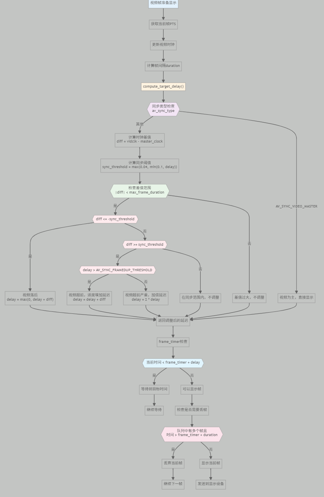
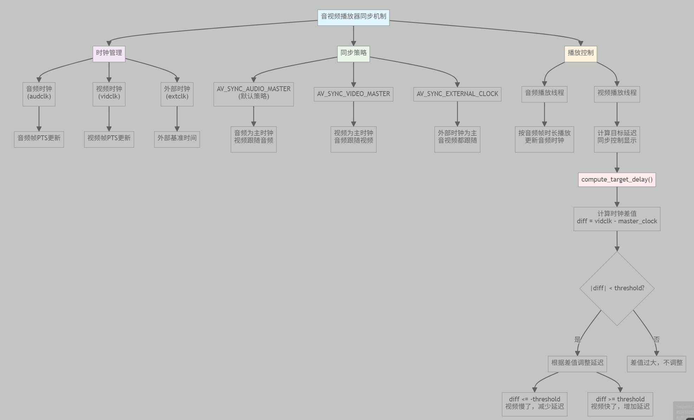
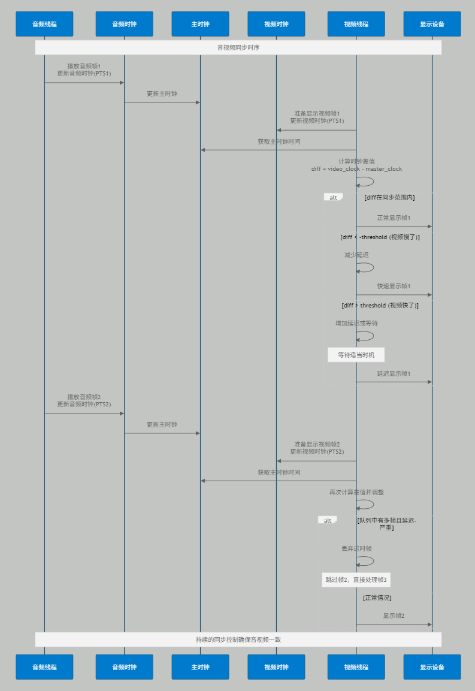

av_dict_set 函数设置参数对播放实时流的1一些效果影响：
av_dict_set(&options, "fflags", "nobuffer", 0); 这个能降低延迟，但是如果最开始出现花屏，只显示残差，就是这个设置导致的，手动配置流参数，跳过avformat_find_stream_info 则不会有这个问题

av_dict_set(&options, "buffer_size", "20480", 0);
`buffer_size` 是 ​**解封装层（Demuxer）或封装层（Muxer）​**​ 的数据缓冲池大小，用于临时存储未处理的音视频数据，如果网络良好，但是老花屏，就可以考虑是不是这个设置小了

以下是网上别人发的，实测并不是这样，但是还是留在这里：

外，如果是网络URL，在使用avformat_open_input打开输入流之后，那么此时就建立了连接，记录此时刻为A，那么当av_read_frame读取数据时，第一帧读到的数据是A时刻的数据。因此在两个函数之间应尽量减少执行的程序，实测如果中间有10s的程序要执行，那么视频延时在10s以上  ？？
跳过`avformat_find_stream_info`需**预先知道流参数**​（如分辨率、帧率），否则可能无法正确解码

这段代码降低延迟很有效

                // Drop frames if the queue is getting too full, indicating a slow UI

                while (mPlayer->decoder->video_frame_q->getFilledCount() > 4) {

                    qWarning() << "Video frame queue is full. Dropping frame to prevent deadlock.";

                    AVFrame* drop_frame = mPlayer->decoder->video_frame_q->getFilledFrame();

                    mPlayer->decoder->video_frame_q->releaseFrame(drop_frame);

                    QThread::msleep(1); // Give decoder a chance to run

                }

av_frame_alloc

分配avframe内存

av_frame_unref

使用av_buffer_unref释放掉avframe内的buf的内存(即指向音视频数据的buffer)
然后再替换为一个默认默认空帧

av_frame_free

```
释放avframe内存。源码
void av_frame_free(AVFrame **frame)

{

    if (!frame || !*frame)

        return;

    av_frame_unref(*frame);

    av_freep(frame);

}
```

实际上是先使用av_frame_unref释放avframe中buf的内存，然后再释放掉本身结构的内存

av_frame_move_ref(AVFrame *dst, AVFrame *src)：

```
源码：
void av_frame_move_ref(AVFrame *dst, AVFrame *src)

{

    av_assert1(dst->width == 0 && dst->height == 0);

    av_assert1(dst->ch_layout.nb_channels == 0 &&

               dst->ch_layout.order == AV_CHANNEL_ORDER_UNSPEC);

    *dst = *src;

    if (src->extended_data == src->data)

        dst->extended_data = dst->data;

    get_frame_defaults(src);

}
```


直接把src拷贝到dst，然后把src替换为一个默认空帧

windows下打印真的对时序有巨大影响


# 同步机制：



SVG代码：

    graph TD
     A["音视频播放器同步机制"] --> B["时钟管理"]
     A --> C["同步策略"]
     A --> D["播放控制"]
    B --> B1["音频时钟<br/>(audclk)"]
    B --> B2["视频时钟<br/>(vidclk)"]
    B --> B3["外部时钟<br/>(extclk)"]
    
    B1 --> B1a["音频帧PTS更新"]
    B2 --> B2a["视频帧PTS更新"]
    B3 --> B3a["外部基准时间"]
    
    C --> C1["AV_SYNC_AUDIO_MASTER<br/>(默认策略)"]
    C --> C2["AV_SYNC_VIDEO_MASTER"]
    C --> C3["AV_SYNC_EXTERNAL_CLOCK"]
    
    C1 --> C1a["音频为主时钟<br/>视频跟随音频"]
    C2 --> C2a["视频为主时钟<br/>音频跟随视频"]
    C3 --> C3a["外部时钟为主<br/>音视频都跟随"]
    
    D --> D1["音频播放线程"]
    D --> D2["视频播放线程"]
    
    D1 --> D1a["按音频帧时长播放<br/>更新音频时钟"]
    D2 --> D2a["计算目标延迟<br/>同步控制显示"]
    
    D2a --> E["compute_target_delay()"]
    E --> E1["计算时钟差值<br/>diff = vidclk - master_clock"]
    E1 --> E2{"|diff| < threshold?"}
    E2 -->|"是"| E3["根据差值调整延迟"]
    E2 -->|"否"| E4["差值过大，不调整"]
    
    E3 --> E3a["diff <= -threshold<br/>视频慢了，减少延迟"]
    E3 --> E3b["diff >= threshold<br/>视频快了，增加延迟"]
    
    style A fill:#e1f5fe
    style B fill:#f3e5f5
    style C fill:#e8f5e8
    style D fill:#fff3e0
    style E fill:#ffebee

---------------------------------------------------------------------------



    flowchart TD
    A["视频帧准备显示"] --> B["获取当前帧PTS"]
    B --> C["更新视频时钟"]
    C --> D["计算帧间隔duration"]
    D --> E["compute_target_delay()"]
    E --> F{{"同步类型检查<br/>av_sync_type"}}
    F -->|"AV_SYNC_VIDEO_MASTER"| G["视频为主，直接显示"]
    F -->|"其他"| H["计算时钟差值<br/>diff = vidclk - master_clock"]
    
    H --> I["计算同步阈值<br/>sync_threshold = max(0.04, min(0.1, delay))"]
    I --> J{{"检查差值范围<br/>|diff| < max_frame_duration"}}
    
    J -->|"否"| K["差值过大，不调整"]
    J -->|"是"| L{{"diff <= -sync_threshold"}}
    
    L -->|"是"| M["视频落后<br/>delay = max(0, delay + diff)"]
    L -->|"否"| N{{"diff >= sync_threshold"}}
    
    N -->|"否"| O["在同步范围内，不调整"]
    N -->|"是"| P{{"delay > AV_SYNC_FRAMEDUP_THRESHOLD"}}
    
    P -->|"是"| Q["视频超前，适度增加延迟<br/>delay = delay + diff"]
    P -->|"否"| R["视频超前严重，加倍延迟<br/>delay = 2 * delay"]
    
    M --> S["返回调整后的延迟"]
    Q --> S
    R --> S
    O --> S
    K --> S
    G --> S
    
    S --> T["frame_timer检查"]
    T --> U{{"当前时间 < frame_timer + delay"}}
    U -->|"是"| V["等待到目标时间"]
    U -->|"否"| W["可以显示帧"]
    
    V --> X["继续等待"]
    W --> Y["检查是否需要丢帧"]
    Y --> Z{{"队列中有多个帧且<br/>时间 > frame_timer + duration"}}
    Z -->|"是"| AA["丢弃当前帧"]
    Z -->|"否"| BB["显示当前帧"]
    
    AA --> CC["继续下一帧"]
    BB --> DD["发送到显示设备"]
    
    style A fill:#e3f2fd
    style E fill:#fff3e0
    style F fill:#f3e5f5
    style J fill:#e8f5e8
    style L fill:#ffebee
    style N fill:#ffebee
    style P fill:#ffebee
    style U fill:#e1f5fe
    style Z fill:#fce4ec

-------------------------------



    sequenceDiagram
     participant AT as 音频线程
     participant AC as 音频时钟
     participant MC as 主时钟
     participant VC as 视频时钟
     participant VT as 视频线程
     participant Display as 显示设备
    Note over AT,Display: 音视频同步时序
    
    AT->>AC: 播放音频帧1<br/>更新音频时钟(PTS1)
    AC->>MC: 更新主时钟
    
    VT->>VC: 准备显示视频帧1<br/>更新视频时钟(PTS1)
    VT->>MC: 获取主时钟时间
    VT->>VT: 计算时钟差值<br/>diff = video_clock - master_clock
    
    alt diff在同步范围内
        VT->>Display: 正常显示帧1
    else diff < -threshold (视频慢了)
        VT->>VT: 减少延迟
        VT->>Display: 快速显示帧1
    else diff > threshold (视频快了)
        VT->>VT: 增加延迟或等待
        Note over VT: 等待适当时机
        VT->>Display: 延迟显示帧1
    end
    
    AT->>AC: 播放音频帧2<br/>更新音频时钟(PTS2)
    AC->>MC: 更新主时钟
    
    VT->>VC: 准备显示视频帧2<br/>更新视频时钟(PTS2)
    VT->>MC: 获取主时钟时间
    VT->>VT: 再次计算差值并调整
    
    alt 队列中有多帧且延迟严重
        VT->>VT: 丢弃过时帧
        Note over VT: 跳过帧2，直接处理帧3
    else 正常情况
        VT->>Display: 显示帧2
    end
    
    Note over AT,Display: 持续的同步控制确保音视频一致
