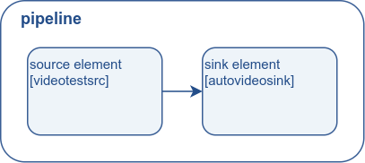

# Basic tutorial 2: GStreamer concepts

## 目标

上一篇教程展示了如何自动地都剑一条pipeline。现在我们将手动构建一条pipeline：初始化每一个element并将它们连接起来。在本教程中，将学习：

- 什么是GStreamer element以及如何创建它。
- 如何连击两个elements。
- 如何自定义一个element的行为(属性)。
- 如何舰艇bus的错误情形并且从GStreamer messages中提取信息。

## Manual Hello World

### basic-tutorial-2.c

```c
#include <gst/gst.h>

int
main (int argc, char *argv[])
{
  GstElement *pipeline, *source, *sink;
  GstBus *bus;
  GstMessage *msg;
  GstStateChangeReturn ret;

  /* Initialize GStreamer */
  gst_init (&argc, &argv);

  /* Create the elements */
  source = gst_element_factory_make ("videotestsrc", "source");
  sink = gst_element_factory_make ("autovideosink", "sink");

  /* Create the empty pipeline */
  pipeline = gst_pipeline_new ("test-pipeline");

  if (!pipeline || !source || !sink) {
    g_printerr ("Not all elements could be created.\n");
    return -1;
  }

  /* Build the pipeline */
  gst_bin_add_many (GST_BIN (pipeline), source, sink, NULL);
  if (gst_element_link (source, sink) != TRUE) {
    g_printerr ("Elements could not be linked.\n");
    gst_object_unref (pipeline);
    return -1;
  }

  /* Modify the source's properties */
  g_object_set (source, "pattern", 0, NULL);

  /* Start playing */
  ret = gst_element_set_state (pipeline, GST_STATE_PLAYING);
  if (ret == GST_STATE_CHANGE_FAILURE) {
    g_printerr ("Unable to set the pipeline to the playing state.\n");
    gst_object_unref (pipeline);
    return -1;
  }

  /* Wait until error or EOS */
  bus = gst_element_get_bus (pipeline);
  msg =
      gst_bus_timed_pop_filtered (bus, GST_CLOCK_TIME_NONE,
      GST_MESSAGE_ERROR | GST_MESSAGE_EOS);

  /* Parse message */
  if (msg != NULL) {
    GError *err;
    gchar *debug_info;

    switch (GST_MESSAGE_TYPE (msg)) {
      case GST_MESSAGE_ERROR:
        gst_message_parse_error (msg, &err, &debug_info);
        g_printerr ("Error received from element %s: %s\n",
            GST_OBJECT_NAME (msg->src), err->message);
        g_printerr ("Debugging information: %s\n",
            debug_info ? debug_info : "none");
        g_clear_error (&err);
        g_free (debug_info);
        break;
      case GST_MESSAGE_EOS:
        g_print ("End-Of-Stream reached.\n");
        break;
      default:
        /* We should not reach here because we only asked for ERRORs and EOS */
        g_printerr ("Unexpected message received.\n");
        break;
    }
    gst_message_unref (msg);
  }

  /* Free resources */
  gst_object_unref (bus);
  gst_element_set_state (pipeline, GST_STATE_NULL);
  gst_object_unref (pipeline);
  return 0;
}
```

注：编译和运行在上一篇教程已经展示过了，后续不在赘述。

## 工作流

element是GStreamer的基本构成单位，它们处理从source element(数据生产者)通过filter element流向sink element(数据消费者)的数据。


### 创建element

```c
  /* Create the elements */
  source = gst_element_factory_make ("videotestsrc", "source");
  sink = gst_element_factory_make ("autovideosink", "sink");
```

上述代码展示了如何使用`gst_element_factory_make()`新建一个element，函数的第一个参数是要创建的element名，即插件名。第二个参数是给这个特殊实例起的名称，在同一条pipeline中，必须是唯一的名称。这个名称可以用于后续检索它，假如你传递`NULL`作为实例名，GStreamer也会自动为它初始化一个唯一的名称。

### 创建pipeline

在这篇教程中，我们创建了两个元素：`videotestsrc`和`autovideosink`，中间没有filter element，所以整个pipeline看起来就如下图：



`videotestsrc`是一个按照制定`pattern`生成测试视频source element(它将生产数据)，这个插件在测试和教程中很好用，但通常并不会出现在真实的应用中。

`autovideosink`是一个在窗口中播放它接收到的图像的sink element(它将消费数据)，GStreamer包含有很多视频sink element，具体取决于操作系统，它们能够处理不同的图像格式，`autovideosink`将自动选择其中一个并实例话化，所以用户不需要担心平台兼容性问题。

```c
  /* Create the empty pipeline */
  pipeline = gst_pipeline_new ("test-pipeline");

  /* Build the pipeline */
  gst_bin_add_many (GST_BIN (pipeline), source, sink, NULL);
  if (gst_element_link (source, sink) != TRUE) {
    g_printerr ("Elements could not be linked.\n");
    gst_object_unref (pipeline);
    return -1;
  }
```

`gst_pipeline_new()`可以创建一个pipeline，GStreamer中的所有元素在使用之前通常必须包含在一条pipeline 中，pipeline将负责一些时钟和消息功能。

一条pipeline也是一个特殊的bin，被用来包含其他elements，因此GstBin的所有方法也能用于GstPipeline。在上述代码中，我们调用`gst_bin_add_many()`来将elements添加到pipeline中(注意对pipeline的`GST_BIN()`映射)，这个函数接受一个要被添加到pipeline中的element列表，因为不确定列表长度所以需要以`NULL`结尾。添加单个element可以使用`get_bin_add()`。

虽然elements已经被加入到一条pipeline中，但这时候这些elements仍然处于一个无须的状态，在运行之前，我们需要使用`gst_element_link()`将它们彼此之间**按顺序连接起来**。`gst_element_link()`的第一个参数必须是source elemnt，第二个参数必须是sink element，并且由于只能连接同一条pipeline中的elements，必须在连接之前将所有的elements加入pipeline。

### 设置element properties

GStreamer的实现依赖于GObject，所有的GStreamer elements都是特殊的GObject，用于提供`property`特性。

大多数GStreamer elements都具有被称作**属性**的定制性质，使用`g_obeject_set()`修改`writable propeties`的属性值可以改变element的行为，使用`g_obejct_get()`请求`readable properties`的属性值可以获得element的内部状态。

`g_object_set()`可以接受一个以`NULL`结束的属性名-属性值键值对列表，所以可以一次性设置多个属性。

```c
  /* Modify the source's properties */
  g_object_set (source, "pattern", 0, NULL);
```

在本教程中我们将`videotestsrc`的`pattern`属性设置为`0`，`pattern`属性控制者`videotestsec`的输出视频类型，用户可以尝试设置为不同的值并查看效果。

**属性名和可能的属性值可以查看element的说明文档或者使用`gst-inspect-1.0`工具查看。**

### Error监听

```c
  /* Start playing */
  ret = gst_element_set_state (pipeline, GST_STATE_PLAYING);
  if (ret == GST_STATE_CHANGE_FAILURE) {
    g_printerr ("Unable to set the pipeline to the playing state.\n");
    gst_object_unref (pipeline);
    return -1;
  }
```

向上篇教程一样，这时已经成功构建和设置完pipeline了，调用`gst_element_set_state()`改变pipeline的状态，但是这次将检查状态改变的返回值，假如状态修改失败，将返回一个error值并进行相关退出处理。

```c
  /* Wait until error or EOS */
  bus = gst_element_get_bus (pipeline);
  msg =
      gst_bus_timed_pop_filtered (bus, GST_CLOCK_TIME_NONE,
      GST_MESSAGE_ERROR | GST_MESSAGE_EOS);

  /* Parse message */
  if (msg != NULL) {
    GError *err;
    gchar *debug_info;

    switch (GST_MESSAGE_TYPE (msg)) {
      case GST_MESSAGE_ERROR:
        gst_message_parse_error (msg, &err, &debug_info);
        g_printerr ("Error received from element %s: %s\n",
            GST_OBJECT_NAME (msg->src), err->message);
        g_printerr ("Debugging information: %s\n",
            debug_info ? debug_info : "none");
        g_clear_error (&err);
        g_free (debug_info);
        break;
      case GST_MESSAGE_EOS:
        g_print ("End-Of-Stream reached.\n");
        break;
      default:
        /* We should not reach here because we only asked for ERRORs and EOS */
        g_printerr ("Unexpected message received.\n");
        break;
    }
    gst_message_unref (msg);
  }
```

在上一篇教程中，我们没有对`gst_bus_timed_pop_filtered()`返回的GstMessage进行处理，在本篇教程中，我们监听pipeline的erroe和EOS信号，并在发生时进行了打印了相应的信息，便于debug。

 GstMessage是一个非常通用的结构，它可以传递几乎任何类型的信息。同时，GStreamer为每种消息提供了一系列解析函数。

在本教程里面，我们一旦知道message里面包含一个错误（通过使用GST_MESSAGE_TYPE宏），我们可以使用`gst_message_parse_error()`方法来解析message，这个方法会返回一个GLib的[GError](https://developer.gnome.org/glib/unstable/glib-Error-Reporting.html#GError)结构。

### GStreamer bus

GStreamer bus它是负责将element生成的GstMessages按顺序交付给应用程序和**应用程序线程**(这点很重要，因此GStreamer实际是在其他的线程中处理媒体流)的对象。

messgaes可以使用`get_bus_timed_pop_filtered()`同步提取或者使用信号回调的方式异步提取。应用程序应该始终关注总线，以得到错误和其他回放相关问题的通知。

剩余代码和第一篇教程中的资源回收一样，不再赘述。

## 练习

尝试在这条example pipeline的source和sink之间添加视频filter element，例如`vertigotv`，你需要创建它，将它加入pipeline，并将它和pipeline中的其他元素连接起来。

取决于你的开发平台和使用的插件，你可能会遇到一个“negotiation”错误，这是因为sink element无法理解视频filter element生产的数据格式，有关 negotiation的更多信息请阅读[Basic tutorial 6: Media formats and Pad Capabilities]()。在这种情况下你需要在filter element之后添加`videoconvert`，有关`videoconvert`的更多信息可以阅读[Basic tutorial 14: Handy elements]()。

**注：**关于手动创建GStreamer Pipeline推荐阅读[Build Pipeline](https://ricardolu.gitbook.io/gstreamer/application-development/build-pipeline#gst_element_factory_make)以获得更详细的介绍。

## 总结

这篇教程展示了：

- 如何使用`gst_element_factory_make()`创建element。
- 如何使用`gst_pipeline_new()`创建一个空的pipeline。
- 如何使用`gst_bin_add_many()`向pipeline中添加element。
- 如何使用`gst_element_link_many()`连接element。

总计有两篇教程介绍GStreamer的基本概念，这是第一篇，下一篇是第二篇。

原文地址：https://gstreamer.freedesktop.org/documentation/tutorials/basic/concepts.html?gi-language=c