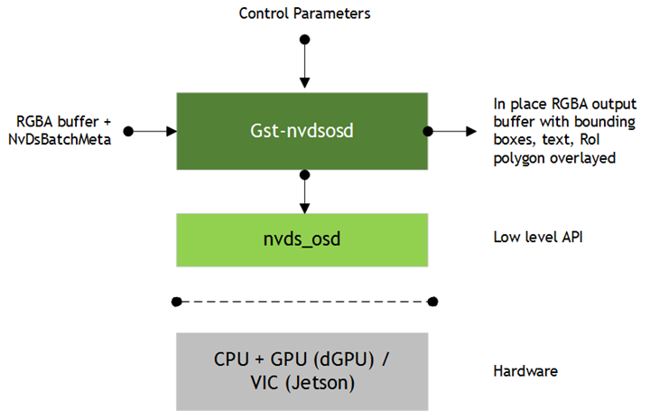

# nvdsosd

## Overview

Nvidia的[nvdsosd](https://docs.nvidia.com/metropolis/deepstream/dev-guide/text/DS_plugin_gst-nvdsosd.html)插件可以绘制边界框、文本和感兴趣区域(RoI)多边形(多边形以一组线的形式呈现)。该插件接受一个带有来自上游组件的元数据的RGBA缓冲区。它绘制边界框，根据给定边界框的配置(例如宽度、颜色和不透明度)着色。它还可以在框架的指定位置绘制文本和RoI多边形。文本和多边形参数可以通过元数据进行配置。



- 从上图中可以看出nvdsosd插件的输入是RGBA格式的图像，鉴于通常nvv4l2decoder解码出的图像格式为NV12，所以为了确保pipeline的插件能够正确连接协商，添加一个nvvideoconvert插件在两者之间。

- 绘制内容的配置来自于上游件的metadata，在DeepStream中设计实现了一个[NvDsBatchMeta](https://docs.nvidia.com/metropolis/deepstream/dev-guide/text/DS_plugin_metadata.html)结构体用于封装一系列metadata。
- 在nvdsosd插件的底层有一系列nvds_osd相关的API，这些API可以参考[Nvidia DeepStream SDK API Reference](https://docs.nvidia.com/metropolis/deepstream/4.0/dev-guide/DeepStream_Development_Guide/baggage/structNvDsDisplayMeta.html#acbb24f32b66904ce66273e1bd8f8e9d9)，但文档目前更新版本为DeepStream 4.0 Release，5.0之后的新特性并未添加进来，新版的数据结构可以参考[NvOsd module API](https://docs.nvidia.com/metropolis/deepstream/sdk-api/OSD/OSD.html)。

## NvDsBatchMeta

GstBuffer是GStreamer Pipeline中流动的最基本的数据单元，每个GstBuffer都有与之关联的metadata，DeepStreamer实现了一套拓展的标准metadata数据结构，NvDsBatchMeta是其中最基础的一个。

顾名思义，NvDsBatchMeta是从batch这个概念衍生出来的结构体，它支持批处理metadata，这是基于[nvstreammux插件](https://docs.nvidia.com/metropolis/deepstream/dev-guide/text/DS_plugin_gst-nvstreammux.html)实现的——NvDsBatchMeta由nvstreammux插件生成，携带有多路数据源的metadata。

NvDsBatchMeta内含了一系例metadata数据，包括帧，物体，分类和标签结果，DeepStream通过访问NvDsBatchMeta来访问这些metadata。`gst_buffer_get_nvds_batch_meta()`可以从GstBuffer中提取出NvDsBatchMeta。

DeepStream整个metadata的结构如下图：


### NvDsDisplayMeta

```c
typedef struct NvDsDisplayMeta {
    NvDsBaseMeta base_meta;
    guint num_rects;
    guint num_labels;
    guint num_lines;
    guint num_arrows;
    guint num_circles;
    NvOSD_RectParams rect_params[MAX_ELEMENTS_IN_DISPLAY_META];
    NvOSD_TextParams text_params[MAX_ELEMENTS_IN_DISPLAY_META];
    NvOSD_LineParams line_params[MAX_ELEMENTS_IN_DISPLAY_META];
    NvOSD_ArrowParams arrow_params[MAX_ELEMENTS_IN_DISPLAY_META];
    NvOSD_CircleParams circle_params[MAX_ELEMENTS_IN_DISPLAY_META];
    gint64 misc_osd_data[MAX_USER_FIELDS];
    gint64 reserved[MAX_RESERVED_FIELDS];
} NvDsDisplayMeta;
```

在DeepStream 5.0之后增加了绘制arrow和circle两种形状的支持，因此相对于4.0增加了对应的两个数据结构。从上述声明中可以看出，一帧图像支持绘制的object的个数是有上限的，查看头文件可以知道`MAX_ELEMENTS_IN_DISPLAY_META=16`。

每种绘制的object都会内含一个`NvOSD_ColorParams`成员，用于设置绘制的颜色信息，需要注意的是`NvOSD_Params`是RGBA格式，并且所有成员都是double类型，设置范围限制在0.0-1.0之间，和通常的0-255的8bits表示法不一样。

## Develop Guide

```c++
/* 
 * file-source -> h264parser -> nvv4l2decoder ->nvstreammux
 * nvinfer -> nvvideoconvert -> nvdsosd -> nveglglessink
 */
```

以这样一条pipeline为例，nvinfer将完成推理任务，在nvvideoconvert阶段将获得所有需要OSD的objectmetadata信息，这时候将你所想要额外fontparams添加到NvDisplayMeta中即可。

```c++
// Build pipeline时为nvvideoconvert添加GstPadProbe
{
  nvvidconv_sink_pad = gst_element_get_static_pad (nvvidconv, "sink");
  if (!nvvidconv_sink_pad)
    g_print ("Unable to get sink pad\n");
  else
    gst_pad_add_probe (nvvidconv_sink_pad, GST_PAD_PROBE_TYPE_BUFFER,
        nvvidconv_sink_pad_buffer_probe, NULL, NULL);
}

// 
static GstPadProbeReturn
nvvidconv_sink_pad_buffer_probe (GstPad * pad, GstPadProbeInfo * info,
    gpointer u_data)
{
    GstBuffer *buf = (GstBuffer *) info->data;
    NvDsObjectMeta *obj_meta = NULL;
    guint vehicle_count = 0;
    guint person_count = 0;
    guint face_count = 0;
    guint lp_count = 0;
    NvDsMetaList * l_frame = NULL;
    NvDsMetaList * l_obj = NULL;
    NvDsDisplayMeta *display_meta = NULL;

	// 遍历GstBuffer取出NvDsBatchMeta
    NvDsBatchMeta *batch_meta = gst_buffer_get_nvds_batch_meta (buf);

	// 遍历batch中的所有帧
    // 假如只有一路流(nvstreammux的batch-size=1)，那么frame_meta_list长度为1
    for (l_frame = batch_meta->frame_meta_list; l_frame != NULL;
      l_frame = l_frame->next) {
        NvDsFrameMeta *frame_meta = (NvDsFrameMeta *) (l_frame->data);
        int offset = 0;
        // 遍历object_list，对于常规第三方算法手段可以省略，直接设置NvDsDisplayMeta即可
        for (l_obj = frame_meta->obj_meta_list; l_obj != NULL;
                l_obj = l_obj->next) {
            obj_meta = (NvDsObjectMeta *) (l_obj->data);

            /* Check that the object has been detected by the primary detector
             * and that the class id is that of vehicles/persons. */
            if (obj_meta->unique_component_id == PRIMARY_DETECTOR_UID) {
              if (obj_meta->class_id == PGIE_CLASS_ID_VEHICLE)
                vehicle_count++;
              if (obj_meta->class_id == PGIE_CLASS_ID_PERSON)
                person_count++;
            }

            if (obj_meta->unique_component_id == SECONDARY_DETECTOR_UID) {
              if (obj_meta->class_id == SGIE_CLASS_ID_FACE) {
                face_count++;
                /* Print this info only when operating in secondary model. */
                if (SECOND_DETECTOR_IS_SECONDARY)
                  g_print ("Face found for parent object %p (type=%s)\n",
                      obj_meta->parent, pgie_classes_str[obj_meta->parent->class_id]);
              }
              if (obj_meta->class_id == SGIE_CLASS_ID_LP) {
                lp_count++;
                /* Print this info only when operating in secondary model. */
                if (SECOND_DETECTOR_IS_SECONDARY)
                  g_print ("License plate found for parent object %p (type=%s)\n",
                      obj_meta->parent, pgie_classes_str[obj_meta->parent->class_id]);
              }
            }
        }
        
        // 添加自定义的OSD信息，具体有哪些设置参数可以参考官方API文档
        display_meta = nvds_acquire_display_meta_from_pool(batch_meta);
        NvOSD_TextParams *txt_params  = &display_meta->text_params[0];
        display_meta->num_labels = 1;
        txt_params->display_text = g_malloc0 (MAX_DISPLAY_LEN);
        offset = snprintf(txt_params->display_text, MAX_DISPLAY_LEN, "Person = %d ", person_count);
        offset += snprintf(txt_params->display_text + offset , MAX_DISPLAY_LEN, "Vehicle = %d ", vehicle_count);
        offset += snprintf(txt_params->display_text + offset , MAX_DISPLAY_LEN, "Face = %d ", face_count);
        offset += snprintf(txt_params->display_text + offset , MAX_DISPLAY_LEN, "License Plate = %d ", lp_count);

        /* Now set the offsets where the string should appear */
        txt_params->x_offset = 10;
        txt_params->y_offset = 12;

        /* Font , font-color and font-size */
        txt_params->font_params.font_name = "Serif";
        txt_params->font_params.font_size = 10;
        txt_params->font_params.font_color.red = 1.0;
        txt_params->font_params.font_color.green = 1.0;
        txt_params->font_params.font_color.blue = 1.0;
        txt_params->font_params.font_color.alpha = 1.0;

        /* Text background color */
        txt_params->set_bg_clr = 1;
        txt_params->text_bg_clr.red = 0.0;
        txt_params->text_bg_clr.green = 0.0;
        txt_params->text_bg_clr.blue = 0.0;
        txt_params->text_bg_clr.alpha = 1.0;

        nvds_add_display_meta_to_frame(frame_meta, display_meta);
    }


    g_print ("Frame Number = %d Vehicle Count = %d Person Count = %d"
            " Face Count = %d License Plate Count = %d\n",
            frame_number, vehicle_count, person_count,
            face_count, lp_count);
    frame_number++;
    return GST_PAD_PROBE_OK;
}
```

## FAQ

上述示例Pipeline在显示上使用了nveglglessink插件，这取决于开发平台是否支持显示，例如在Tesla这类计算卡平台上使用docker container环境开发时默认无法显示，具体可以参考https://forums.developer.nvidia.com/t/cugraphicsglregisterbuffer-failed-with-error-219-gst-eglglessink-cuda-init-texture-1/121833这个issue，据CE的回复需要安装Nvidia的Display Driver之后配置Virtual Display，由于我所用的T4服务器是公司资产，无法确定这么做的风险，所以没有尝试，而Jetson平台几乎都支持GPU Display，因此没有这种问题。

