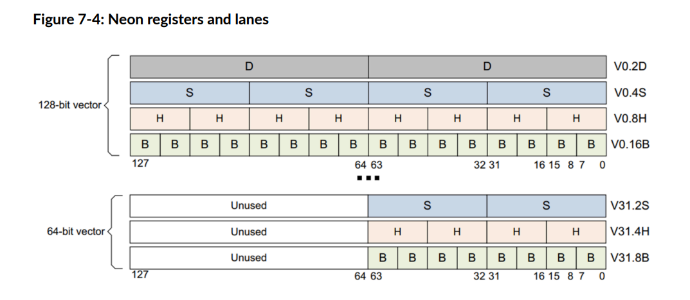
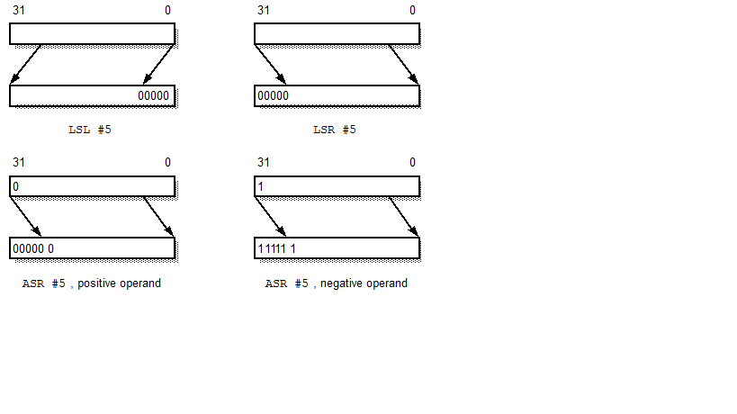

arm64  SIMD 汇编学习笔记
指令 XX XX2 这样两个一组的指令，不带2的操作低位，带2的操作高位，这里的高位 低位针对的是 source寄存器

arm 寄存器
X/W寄存器：用于一般计算和整数运算。
X是64位，W是对应的低32位。
V寄存器：用于向量和浮点运算，128位宽。
Q寄存器：也是用于向量运算，别名表示128位的V寄存器。
D寄存器：用于64位的向量运算和浮点运算，表示V寄存器的低64位。

也就说一般写的就是 

X 和 V
如果用到w ，则用作通用寄存器，传递参数等常规用途

ld1 指令格式
ld1 {Vt.<T>}[index], [Xn|SP], Xm
.<T>
举例
.b - 8位无符号整数（Unsigned byte）
.h - 16位无符号整数（Unsigned halfword）
.s - 32位单精度浮点数（Single precision float） - 已经提及
.d - 64位双精度浮点数（Double precision float）
.8 或 .8b - 8位有符号/无符号整数，具体取决于上下文，通常用于表示8位整数向量
.16 或 .16b - 16位有符号/无符号整数向量

.4s - 4个32位单精度浮点数组成的向量
.2d - 2个64位双精度浮点数组成的向量
依次类推

ARM32（AArch32）：指令通常以“V”开头，如VADD, VMUL等。
ARM64（AArch64）：指令通常以“ADD”, “MUL”等标准操作符开头，并且有更一致的命名规则，例如ADD, MLA, SADDL等。

指令后面多个l ，也就是多个long，表示 扩宽，即src寄存器比dst寄存器窄

如果掩码对应位为 1，则从第二个源寄存器中复制该位。


saturate VALUE 把一个变量饱和的意思就是限制某个变量在一定的范围内(clip3),这个范围有最大值，有最小值

rounding value 把一个变量rounding  意思就是四舍五入？

官方的语法描述中，像下面这样的 extend，表示 位移操作等比如 lsl,lsr,asr等

LDRH Wt, [Xn|SP, (Wm|Xm){, extend {amount}}]

-------------------------------------------------------------------------ARM 64 基础 指令 （非SIMD）

WSP 32位 栈指针
SP  64位 栈指针
WZR 32位零寄存器
XZR 64位零寄存器

● ADC：带进位加法。 PSTATE.C(进位标志)
● ADCS：带进位加法，设置标志位。 同时还要设置PSTATE.N(借位标志)
● ADD (extended register)：扩展寄存器加法。
● ADD (immediate)：立即数加法。
● ADD (shifted register)：移位寄存器加法。
● ADDG：带标签加法。
● ADDS (extended register)：扩展寄存器加法，设置标志位。
● ADDS (immediate)：立即数加法，设置标志位。
● ADDS (shifted register)：移位寄存器加法，设置标志位。
● ADR：形成程序计数器（pc）相对地址。

​	adr x0, my_test_data

● ADRP：形成程序计数器（pc）相对地址到4KB页。

		adrp x1, my_test_data
​	add x1, x1, #:lo12:my_test_data
​	ldr x3, [x1]

​	adrp指令将label的值传递给xd寄存器。label的值为pc所在页基值 + (立即数 * 4096) ，立即数就相当于是页索引

​	使用adrp获取标签的相对pc的4K页基值，然后再搭配一个ldr register [register #offset] 即可得到标签实际地址，此处的offset是页内的偏移

​	为什么默认页面基地址是相对于pc寄存器的，pc寄存器除了程序计数还有什么特点？

● AND (immediate)：立即数位与操作。
● AND (shifted register)：移位寄存器位与操作。
● ANDS (immediate)：立即数位与操作，设置标志位。
● ANDS (shifted register)：移位寄存器位与操作，设置标志位。
● ASR (immediate)：*Arithmetic Shift* 立即数算术右移：SBFM的别名。ASR 是算术右移，会保留符号，例如某个数字最高位为1(表示其为负数)，在数字右移后

会在高位补1，否则会补0，lsl，lsr则只是补0



● ASR (register)：寄存器算术右移：ASRV的别名。
● ASRV：算术右移变量。
● AT：地址转换：SYS的别名。
● AUTDA, AUTDZA：使用密钥A验证数据地址。
● AUTDB, AUTDZB：使用密钥B验证数据地址。
● AUTIA, AUTIA1716, AUTIASP, AUTIAZ, AUTIZA：使用密钥A验证指令地址。AUTIB, AUTIB1716, AUTIBSP, AUTIBZ, AUTIZB：使用密钥B验证指令地址。
● AXFLAG：将浮点条件标志从ARM格式转换为外部格式。
● B：跳转。
● B.cond：条件分支。
● BC.cond：条件分支一致性。
● BFC：位字段清除：BFM的别名。
● BFI：位字段插入：BFM的别名。
● BFM：位字段移动。
● BFXIL：低位端位字段提取和插入：BFM的别名。
● BIC (shifted register)：移位寄存器位清除。
● BICS (shifted register)：移位寄存器位清除，设置标志位。
● BL：跳转并会把当前地址保存到LR(在aarch64中是X30)。Branch with Link branches to a PC-relative offset, setting the register X30 to PC+4. It provides a
												hint that this is a subroutine call.

​	可以理解为BL就是调用子函数

● BLR：参考BL，不过地址为一个寄存器所指向的地址
● BLRAA, BLRAAZ, BLRAB, BLRABZ：带有指针认证的寄存器链接分支。
● BR：跳转到寄存器所指向的地址，通常寄存器在这之前已经使用adr 赋上了一个函数地址
● BRAA, BRAAZ, BRAB, BRABZ：带有指针认证的寄存器跳转。
● BRB：分支记录缓冲区：SYS的别名。
● BRK：断点指令。
● BTI：分支目标识别。
● CAS, CASA, CASAL, CASL：在内存中比较并交换字或双字。
● CASB, CASAB, CASALB, CASLB：在内存中比较并交换字节。
● CASH, CASAH, CASALH, CASLH：在内存中比较并交换半字。
● CASP, CASPA, CASPAL, CASPL：在内存中比较并交换字对或双字对。
● CBNZ：非零比较并分支。  如果该寄存器的值不为零，则跳转到指定的标签或地址
● CBZ：零比较并分支。 如果该寄存器的值为零，则跳转到指定的标签或地址
● CCMN (immediate)：立即数条件比较负数。
● CCMN (register)：寄存器条件比较负数。
● CCMP (immediate)：立即数条件比较。
● CCMP (register)：寄存器条件比较。
● CFINV：反转进位标志。
● CFP：上下文控制流预测限制：SYS的别名。
● CINC：条件递增：CSINC的别名。
● CINV：条件反转：CSINV的别名。
● CLREX：清除独占。
● CLS：计数前导符号位。
● CLZ：计数前导零。 计算前导的零的数量
● CMN (extended register)：扩展寄存器比较负数：ADDS (extended register)的别名。
● CMN (immediate)：立即数比较负数：ADDS (immediate)的别名。
● CMN (shifted register)：移位寄存器比较负数：ADDS (shifted register)的别名。
● CMP (extended register)：扩展寄存器比较：SUBS (extended register)的别名。
● CMP (immediate)：立即数比较：SUBS (immediate)的别名。
● CMP (shifted register)：移位寄存器比较：SUBS (shifted register)的别名。
● CMPP：带标签比较：SUBPS的别名。
● CNEG：条件取反：CSNEG的别名。
● CPP：上下文缓存预取预测限制：SYS的别名。
● CPYFP, CPYFM, CPYFE：仅向前内存复制。
● CPYFPN, CPYFMN, CPYFEN：仅向前内存复制，读写非临时性。
● CPYFPRN, CPYFMRN, CPYFERN：仅向前内存复制，读取非临时性。
● CPYFPRT, CPYFMRT, CPYFERT：仅向前内存复制，非特权读取。
● CPYFPRTN, CPYFMRTN, CPYFERTN：仅向前内存复制，非特权读取，读写非临时性。
● CPYFPRTRN, CPYFMRTRN, CPYFERTRN：仅向前内存复制，非特权读取且非临时性。
● CPYFPRTWN, CPYFMRTWN, CPYFERTWN：仅向前内存复制，非特权读取，写入非临时性。
● CPYFPT, CPYFMT, CPYFET：仅向前内存复制，读写非特权。
● CPYFPTN, CPYFMTN, CPYFETN：仅向前内存复制，读写非特权且非临时性。
● CPYFPTRN, CPYFMTRN, CPYFETRN：仅向前内存复制，读写非特权，读取非临时性。
● CPYFPTWN, CPYFMTWN, CPYFETWN：仅向前内存复制，读写非特权，写入非临时性。
● CPYFPWN, CPYFMWN, CPYFEWN：仅向前内存复制，写入非临时性。
● CPYFPWT, CPYFMWT, CPYFEWT：仅向前内存复制，写入非特权。
● CPYFPWTN, CPYFMWTN, CPYFEWTN：仅向前内存复制，写入非特权，读写非临时性。
● CPYFPWTRN, CPYFMWTRN, CPYFEWTRN：仅向前内存复制，写入非特权，读取非临时性。
● CPYFPWTWN, CPYFMWTWN, CPYFEWTWN：仅向前内存复制，写入非特权且非临时性。
● CPYP, CPYM, CPYE：内存复制。
● CPYPN, CPYMN, CPYEN：内存复制，读写非临时性。
● CPYPRN, CPYMRN, CPYERN：内存复制，读取非临时性。
● CPYPRT, CPYMRT, CPYERT：内存复制，非特权读取。
● CPYPRTN, CPYMRTN, CPYERTN：内存复制，非特权读取，读写非临时性。
● CPYPRTRN, CPYMRTRN, CPYERTRN：内存复制，非特权读取且非临时性。
● CPYPRTWN, CPYMRTWN, CPYERTWN：内存复制，非特权读取，写入非临时性。
● CPYPT, CPYMT, CPYET：内存复制，读写非特权。
● CPYPTN, CPYMTN, CPYETN：内存复制，读写非特权且非临时性。
● CPYPTRN, CPYMTRN, CPYETRN：内存复制，读写非特权，读取非临时性。
● CPYPTWN, CPYMTWN, CPYETWN：内存复制，读写非特权，写入非临时性。
● CPYPWN, CPYMWN, CPYEWN：内存复制，写入非临时性。
● CPYPWT, CPYMWT, CPYEWT：内存复制，写入非特权。
● CPYPWTN, CPYMWTN, CPYEWTN：内存复制，写入非特权，读写非临时性。
● CPYPWTRN, CPYMWTRN, CPYEWTRN：内存复制，写入非特权，读取非临时性。
● CPYPWTWN, CPYMWTWN, CPYEWTWN：内存复制，写入非特权且非临时性。
● CRC32B, CRC32H, CRC32W, CRC32X：CRC32校验和。
● CRC32CB, CRC32CH, CRC32CW, CRC32CX：CRC32C校验和。
● CSDB：推测数据消费屏障。
● CSEL：条件选择。

​	csel            x5,  x5,  x12, lt    第一个小于第二个 则第一个的值放入dst，否则第二个放入dst

​	csel            x12, x12, x5,  ge 第一个大于第二个 则第一个的值放入dst，否则第二个放入dst

● CSET：条件设置：CSINC的别名。
● CSETM：条件设置掩码：CSINV的别名。
● CSINC：条件选择递增。
● CSINV：条件选择反转。
● CSNEG：条件选择取反。
● DC：数据缓存操作：SYS的别名。
● DCPS1：调试改变处理元素状态至EL1。
● DCPS2：调试改变处理元素状态至EL2。
● DCPS3：调试改变处理元素状态至EL3。
● DGH：数据收集提示。
● DMB：数据内存屏障。
● DRPS：调试恢复进程状态。
● DSB：数据同步屏障。
● DVP：上下文数据值预测限制：SYS的别名。
● EON (shifted register)：移位寄存器位异或非。
● EOR (immediate)：立即数位异或。
● EOR (shifted register)：移位寄存器位异或。
● ERET：异常返回。
● ERETAB, ERETAA：带有指针认证的异常返回。
● ESB：错误同步屏障。
● EXTR：提取寄存器。
● GMI：标签掩码插入。
● HINT：提示指令。
● HLT：停机指令。
● HVC：超级访问调用。
● IC：指令缓存操作：SYS的别名。
● IRG：插入随机标签。
● ISB：指令同步屏障。
● LD64B：单拷贝原子64字节加载。
● LDADD, LDADDA, LDADDAL, LDADDL：内存中字或双字的原子加法。
● LDADDB, LDADDAB, LDADDALB, LDADDLB：内存中字节的原子加法。
● LDADDH, LDADDAH, LDADDALH, LDADDLH：内存中半字的原子加法。
● LDAPR：加载-获取RCpc寄存器。
● LDAPRB：加载-获取RCpc寄存器字节。
● LDAPRH：加载-获取RCpc寄存器半字。
● LDAPUR：加载-获取RCpc寄存器（未缩放）。
● LDAPURB：加载-获取RCpc寄存器字节（未缩放）。
● LDAPURH：加载-获取RCpc寄存器半字（未缩放）。
● LDAPURSB：加载-获取RCpc寄存器有符号字节（未缩放）。
● LDAPURSH：加载-获取RCpc寄存器有符号半字（未缩放）。
● LDAPURSW：加载-获取RCpc寄存器有符号字（未缩放）。
● LDAR：加载-获取寄存器。
● LDARB：加载-获取寄存器字节。
● LDARH：加载-获取寄存器半字。
● LDAXP：加载-获取排他寄存器对。
● LDAXR：加载-获取排他寄存器。
● LDAXRB：加载-获取排他寄存器字节。
● LDAXRH：加载-获取排他寄存器半字。
● LDCLR, LDCLRA, LDCLRAL, LDCLRL：内存中字或双字的原子位清除。
● LDCLRB, LDCLRAB, LDCLRALB, LDCLRLB：内存中字节的原子位清除。
● LDCLRH, LDCLRAH, LDCLRALH, LDCLRLH：内存中半字的原子位清除。
● LDEOR, LDEORA, LDEORAL, LDEORL：内存中字或双字的原子异或。
● LDEORB, LDEORAB, LDEORALB, LDEORLB：内存中字节的原子异或。
● LDEORH, LDEORAH, LDEORALH, LDEORLH：内存中半字的原子异或。
● LDG：加载分配标签。
● LDGM：加载多个标签。
● LDLAR：加载LOAcquire寄存器。
● LDLARB：加载LOAcquire寄存器字节。
● LDLARH：加载LOAcquire寄存器半字。
● LDNP：加载寄存器对，带有非临时性提示。
● LDP：加载寄存器对。 将内中的值加载到提供的一堆寄存器中
● LDPSW：加载寄存器对有符号字。
● LDR (immediate)：立即数加载寄存器。
● LDR (literal)：字面量加载寄存器。
● LDR (register)：寄存器加载寄存器。
● LDRAA, LDRAB：带有指针认证的加载寄存器。
● LDRB (immediate)：立即数加载寄存器字节。

● LDRB (register)：寄存器加载寄存器字节。

​	加载一个字节，后面的立即数是加载之后的位移

​	ldrb            w9,  [x5] 

​	ldrb            w8,  [x3], #1

​	ldrb            w11, [x9, #10] 

● LDRH (immediate)：立即数加载寄存器半字。

​	LDRH  w12, [x13, #4]

● LDRH (register)：寄存器加载寄存器半字。dst 必须是 W 寄存器

​     LDRH  w9,  [x10,  x9,  lsl #1]

​    表示从X10的地址加载16位(h半字)数据，但是需要位移X9的值左移一位的偏移量

● LDRSB (immediate)：立即数加载寄存器有符号字节。
● LDRSB (register)：寄存器加载寄存器有符号字节。
● LDRSH (immediate)：立即数加载寄存器有符号半字。
● LDRSH (register)：寄存器加载寄存器有符号半字。
● LDRSW (immediate)：立即数加载寄存器有符号字。
● LDRSW (literal)：字面量加载寄存器有符号字。
● LDRSW (register)：寄存器加载寄存器有符号字。
● LDSET, LDSETA, LDSETAL, LDSETL：内存中字或双字的原子位设置。
● LDSETB, LDSETAB, LDSETALB, LDSETLB：内存中字节的原子位设置。
● LDSETH, LDSETAH, LDSETALH, LDSETLH：内存中半字的原子位设置。
● LDSMAX, LDSMAXA, LDSMAXAL, LDSMAXL：内存中字或双字的原子有符号最大值。
● LDSMAXB, LDSMAXAB, LDSMAXALB, LDSMAXLB：内存中字节的原子有符号最大值。
● LDSMAXH, LDSMAXAH, LDSMAXALH, LDSMAXLH：内存中半字的原子有符号最大值。
● LDSMIN, LDSMINA, LDSMINAL, LDSMINL：内存中字或双字的原子有符号最小值。
● LDSMINB, LDSMINAB, LDSMINALB, LDSMINLB：内存中字节的原子有符号最小值。
● LDSMINH, LDSMINAH, LDSMINALH, LDSMINLH：内存中半字的原子有符号最小值。
● LDTR：非特权加载寄存器。
● LDTRB：非特权加载寄存器字节。
● LDTRH：非特权加载寄存器半字。
● LDTRSB：非特权加载寄存器有符号字节。
● LDTRSH：非特权加载寄存器有符号半字。
● LDTRSW：非特权加载寄存器有符号字。
● LDUMAX, LDUMAXA, LDUMAXAL, LDUMAXL：内存中字或双字的原子无符号最大值。
● LDUMAXB, LDUMAXAB, LDUMAXALB, LDUMAXLB：内存中字节的原子无符号最大值。
● LDUMAXH, LDUMAXAH, LDUMAXALH, LDUMAXLH：内存中半字的原子无符号最大值。
● LDUMIN, LDUMINA, LDUMINAL, LDUMINL：内存中字或双字的原子无符号最小值。
● LDUMINB, LDUMINAB, LDUMINALB, LDUMINLB：内存中字节的原子无符号最小值。
● LDUMINH, LDUMINAH, LDUMINALH, LDUMINLH：内存中半字的原子无符号最小值。
● LDUR：未缩放加载寄存器。参考stur
● LDURB：未缩放加载寄存器字节。
● LDURH：未缩放加载寄存器半字。
● LDURSB：未缩放加载寄存器有符号字节。
● LDURSH：未缩放加载寄存器有符号半字。
● LDURSW：未缩放加载寄存器有符号字。
● LDXP：加载排他寄存器对。
● LDXR：加载排他寄存器。
● LDXRB：加载排他寄存器字节。
● LDXRH：加载排他寄存器半字。
● LSL (immediate)：立即数逻辑左移：UBFM的别名。
● LSL (register)：寄存器逻辑左移：LSLV的别名。
● LSLV：逻辑左移变量。
● LSR (immediate)：立即数逻辑右移：UBFM的别名。
● LSR (register)：寄存器逻辑右移：LSRV的别名。
● LSRV：逻辑右移变量。
● MADD：乘加。

​	madd            x8,  x12, x9,  x8

​	                   Xd, Xn, Xm, Xa 

​			   Xd = Xa + Xn * Xm,

● MNEG：乘取反：MSUB的别名。
● MOV (bitmask immediate)：位掩码立即数移动：ORR (immediate)的别名。
● MOV (inverted wide immediate)：取反宽立即数移动：MOVN的别名。
● MOV (register)：寄存器移动：ORR (shifted register)的别名。
● MOV (to/from SP)：寄存器与堆栈指针之间移动：ADD (immediate)的别名。
● MOV (wide immediate)：宽立即数移动：MOVZ的别名。
● MOVK：保持宽移动。
● MOVN：取反宽移动。
● MOVZ：零宽移动。
● MRS： 将程序状态寄存器的内容传送到通用寄存器中
● MSR (immediate)：将立即值移动到特殊寄存器。

MSR{条件}   程序状态寄存器（CPSR或SPSR）_<域>，操作数
MSR指令用亍将操作数的内容传送到程序状态寄存器的特定域中。其中，操作数可以为通用寄存器或立即数。<域>用于设置程序状态寄存器中需要操作的位，32位的程序状态寄存器可分为4个域：
位[31：24]为条件标志位域，用f表示；
位[23：16]为状态位域，用s表示；
位[15：8]为扩展位域，用x表示；
位[7：0]为控制位域，用c表示；

● MSR (register)：将通用寄存器移动到系统寄存器。
● MSUB：乘减。

​	 msub            x6,  x7,  x10,  x6 

​			     Xd, Xn, Xm, Xa

​			     Xd= Xa- Xn* Xm

● MUL：乘法：MADD的别名。
● MVN：位非：ORN (shifted register)的别名。
● NEG (shifted register)：移位寄存器取反：SUB (shifted register)的别名。
● NEGS：取反并设置标志位：SUBS (shifted register)的别名。
● NGC：带进位取反：SBC的别名。
● NGCS：带进位取反并设置标志位：SBCS的别名。
● NOP：无操作。
● ORN (shifted register)：移位寄存器位或非。
● ORR (immediate)：立即数位或。
● ORR (shifted register)：移位寄存器位或。
● PACDA, PACDZA：使用密钥A的数据地址指针认证代码。
● PACDB, PACDZB：使用密钥B的数据地址指针认证代码。
● PACGA：使用通用密钥的指针认证代码。
● PACIA, PACIA1716, PACIASP, PACIAZ, PACIZA：使用密钥A的指令地址指针认证代码。
● PACIB, PACIB1716, PACIBSP, PACIBZ, PACIZB：使用密钥B的指令地址指针认证代码。
● PRFM (immediate)：立即数预取内存。
● PRFM (literal)：字面量预取内存。
● PRFM (register)：寄存器预取内存。
● PRFUM：未缩放偏移预取内存。
● PSB CSYNC：性能分析同步屏障。
● PSSBB：物理推测存储绕过屏障：DSB的别名。
● RBIT：位反转。

rbit            w7,  w7 

● RET：从子程序返回。
● RETAA, RETAB：带有指针认证的从子程序返回。

● REV：字节反转。
● REV16：在16位半字中反转字节。


● REV32：在32位字中反转字节。
● REV64：字节反转：REV的别名。


● RMIF：旋转，掩码插入标志。
● ROR (immediate)：立即数右旋转：EXTR的别名。
● ROR (register)：寄存器右旋转：RORV的别名。
● RORV：变量右旋转。
● SB：推测屏障。
● SBC：带进位减法。
● SBCS：带进位减法，设置标志位。
● SBFIZ：零中插入有符号位字段：SBFM的别名。
● SBFM：有符号位字段移动。
● SBFX：有符号位字段提取：SBFM的别名。
● SDIV：有符号除法。
● SETF8, SETF16：评估8位或16位标志值。
● SETGP, SETGM, SETGE：设置带有标签的内存。
● SETGPN, SETGMN, SETGEN：设置带有标签的内存，非临时性。
● SETGPT, SETGMT, SETGET：非特权设置带有标签的内存。
● SETGPTN, SETGMTN, SETGETN：非特权且非临时性设置带有标签的内存。
● SETP, SETM, SETE：设置内存。
● SETPN, SETMN, SETEN：设置内存，非临时性。
● SETPT, SETMT, SETET：非特权设置内存。
● SETPTN, SETMTN, SETETN：非特权且非临时性设置内存。
● SEV：发送事件。
● SEVL：发送本地事件。
● SMADDL：有符号乘加长。
● SMC：安全监控调用。
● SMNEGL：有符号乘取反长：SMSUBL的别名。
● SMSTART：启用对Streaming SVE模式和SME架构状态的访问：MSR (immediate)的别名。
● SMSTOP：禁用对Streaming SVE模式和SME架构状态的访问：MSR (immediate)的别名。
● SMSUBL：有符号乘减长。
● SMULH：有符号乘高位。
● SMULL：有符号乘长：SMADDL的别名。
● SSBB：推测存储绕过屏障：DSB的别名。
● ST2G：存储分配标签。
● ST64B：单拷贝原子64字节存储无返回。
● ST64BV：单拷贝原子64字节存储有返回。
● ST64BV0：单拷贝原子64字节EL0存储有返回。
● STADD, STADDL：内存中字或双字的原子加法，无返回：LDADD, LDADDA, LDADDAL, LDADDL的别名。
● STADDB, STADDLB：内存中字节的原子加法，无返回：LDADDB, LDADDAB, LDADDALB, LDADDLB的别名。
● STADDH, STADDLH：内存中半字的原子加法，无返回：LDADDH, LDADDAH, LDADDALH, LDADDLH的别名。
● STCLR, STCLRL：内存中字或双字的原子位清除，无返回：LDCLR, LDCLRA, LDCLRAL, LDCLRL的别名。
● STCLRB, STCLRLB：内存中字节的原子位清除，无返回：LDCLRB, LDCLRAB, LDCLRALB, LDCLRLB的别名。
● STCLRH, STCLRLH：内存中半字的原子位清除，无返回：LDCLRH, LDCLRAH, LDCLRALH, LDCLRLH的别名。
● STEOR, STEORL：内存中字或双字的原子异或，无返回：LDEOR, LDEORA, LDEORAL, LDEORL的别名。
● STEORB, STEORLB：内存中字节的原子异或，无返回：LDEORB, LDEORAB, LDEORALB, LDEORLB的别名。
● STEORH, STEORLH：内存中半字的原子异或，无返回：LDEORH, LDEORAH, LDEORALH, LDEORLH的别名。
● STG：存储分配标签。
● STGM：存储多个标签。
● STGP：存储分配标签和寄存器对。
● STLLR：存储释放寄存器。
● STLLRB：存储释放寄存器字节。
● STLLRH：存储释放寄存器半字。
● STLR：存储释放寄存器。
● STLRB：存储释放寄存器字节。
● STLRH：存储释放寄存器半字。
● STLUR：未缩放存储释放寄存器。
● STLURB：未缩放存储释放寄存器字节。
● STLURH：未缩放存储释放寄存器半字。
● STLXP：存储释放排他寄存器对。
● STLXR：存储释放排他寄存器。
● STLXRB：存储释放排他寄存器字节。
● STLXRH：存储释放排他寄存器半字。
● STNP：带有非临时性提示的存储寄存器对。
● STP：存储寄存器对。将提供的一对寄存器中的值存储到内存中

​	stp             x29, x30, [sp, #-16]!

​	stp             x29, x30, X8, #16

​        stp             q1,  q1,  [x0, #32]

​	

● STR (immediate)：立即数存储寄存器。
● STR (register)：寄存器存储寄存器。
● STRB (immediate)：立即数存储寄存器字节。
● STRB (register)：寄存器存储寄存器字节。
● STRH (immediate)：立即数存储寄存器半字。
● STRH (register)：寄存器存储寄存器半字。
● STSET, STSETL：内存中字或双字的原子位设置，无返回：LDSET, LDSETA, LDSETAL, LDSETL的别名。
● STSETB, STSETLB：内存中字节的原子位设置，无返回：LDSETB, LDSETAB, LDSETALB, LDSETLB的别名。
● STSETH, STSETLH：内存中半字的原子位设置，无返回：LDSETH, LDSETAH, LDSETALH, LDSETLH的别名。
● STSMAX, STSMAXL：内存中字或双字的原子有符号最大值，无返回：LDSMAX, LDSMAXA, LDSMAXAL, LDSMAXL的别名。
● STSMAXB, STSMAXLB：内存中字节的原子有符号最大值，无返回：LDSMAXB, LDSMAXAB, LDSMAXALB, LDSMAXLB的别名。
● STSMAXH, STSMAXLH：内存中半字的原子有符号最大值，无返回：LDSMAXH, LDSMAXAH, LDSMAXALH, LDSMAXLH的别名。
● STSMIN, STSMINL：内存中字或双字的原子有符号最小值，无返回：LDSMIN, LDSMINA, LDSMINAL, LDSMINL的别名。
● STSMINB, STSMINLB：内存中字节的原子有符号最小值，无返回：LDSMINB, LDSMINAB, LDSMINALB, LDSMINLB的别名。
● STSMINH, STSMINLH：内存中半字的原子有符号最小值，无返回：LDSMINH, LDSMINAH, LDSMINALH, LDSMINLH的别名。
● STTR：非特权存储寄存器。
● STTRB：非特权存储寄存器字节。
● STTRH：非特权存储寄存器半字。
● STUMAX, STUMAXL：内存中字或双字的原子无符号最大值，无返回：LDUMAX, LDUMAXA, LDUMAXAL, LDUMAXL的别名。
● STUMAXB, STUMAXLB：内存中字节的原子无符号最大值，无返回：LDUMAXB, LDUMAXAB, LDUMAXALB, LDUMAXLB的别名。
● STUMAXH, STUMAXLH：内存中半字的原子无符号最大值，无返回：LDUMAXH, LDUMAXAH, LDUMAXALH, LDUMAXLH的别名。
● STUMIN, STUMINL：内存中字或双字的原子无符号最小值，无返回：LDUMIN, LDUMINA, LDUMINAL, LDUMINL的别名。
● STUMINB, STUMINLB：内存中字节的原子无符号最小值，无返回：LDUMINB, LDUMINAB, LDUMINALB, LDUMINLB的别名。
● STUMINH, STUMINLH：内存中半字的原子无符号最小值，无返回：LDUMINH, LDUMINAH, LDUMINALH, LDUMINLH的别名。
● STUR：未缩放存储寄存器。 offset 不需要对齐，str则需要对齐，例如在当前arm64的case中，str的offset需要8字节对齐？（arm32是4字节对齐），也就是这个offset必须		是8的倍数(不是8的倍数会不会编译不过？ 这个可以验证一下)	

​		如果移位的立即数 imm 						% 8 = 0，即为8的整数倍，那么，stur和str没有区别

		    simm：也就是stur 使用的，不论平台 -256 ~ 255
​                pimm 也就是str使用的
​                32-bit : 0 ~ 16380
​                    but is must mutilple of 4, that is: pimm % 4 == 0
​       	64-bit : 0 ~ 32760
​          		 but is must mutilple of 8, that is: pimm % 8 == 0

​		例：stur            q2, [x3, #(8*5-16)]

● STURB：未缩放存储寄存器字节。
● STURH：未缩放存储寄存器半字。
● STXP：存储排他寄存器对。
● STXR：存储排他寄存器。
● STXRB：存储排他寄存器字节。
● STXRH：存储排他寄存器半字。
● STZ2G：存储分配标签，清零。
● STZG：存储分配标签，清零。
● STZGM：存储标签并清零多个。
● SUB (extended register)：扩展寄存器减法。
● SUB (immediate)：立即数减法。
● SUB (shifted register)：移位寄存器减法。
● SUBG：带标签减法。
● SUBP：减指针。
● SUBPS：减指针，设置标志。
● SUBS (extended register)：扩展寄存器减法，设置标志。

​	SUBS Xd, Xn|SP, Rm, {extend #{amount}} ; 

​	Rd = Rn - LSL(extend(Rm),


​	会更新C标志

● SUBS (immediate)：立即数减法，设置标志。

​	Rd = Rn - shift(imm)

​	subs            w4,  w4,  #2

	  	会更新C标志

● SUBS (shifted register)：移位寄存器减法，设置标志。

​	SUBS Xd, Xn, Xm, {shift #amount} 

​	Rd = Rn - shift(Rm, amount)

​		例如  : SUBS V1 ,V2 ,V3 ,lsr #3

​                 结果是V1等于 V2减去V3右移3位

​      会更新C标志

● SVC：超级调用。
● SWP, SWPA, SWPAL, SWPL：内存中交换字或双字。
● SWPB, SWPAB, SWPALB, SWPLB：内存中交换字节。
● SWPH, SWPAH, SWPALH, SWPLH：内存中交换半字。
● SXTB：有符号扩展字节：SBFM的别名。
● SXTH：有符号扩展半字：SBFM的别名。
● SXTW：有符号扩展字：SBFM的别名。

● SXTX

SXTX/SXTW/SXTH/SXTB：(64)/ Sign-extend single-word（32） / half-word（16） / byte（8）

表示扩展，通常用于“修饰”,即作为其他指令的辅助

例：add             x11, x2,  w11, sxtw #1


如果带立即数 表示左移

● SYS：系统指令。
● SYSL：带结果的系统指令。
● TBNZ：测试位并如果非零则分支。如果第一个寄存器相应(由立即数指定)的位置的值不为0，则跳转
● TBZ：测试位并如果为零则分支。 如果第一个寄存器相应(由立即数指定)的位置的值为0，则跳转
● TCANCEL：取消当前事务。
● TCOMMIT：提交当前事务。
● TLBI：TLB使无效操作：SYS的别名。
● TSB CSYNC：跟踪同步屏障。
● TST (immediate)：测试位（立即数）：ANDS (immediate)的别名。按位与，根据结果设置标志位

​	tst             w6,  #0x0f

● TST (shifted register)：测试（移位寄存器）：ANDS (shifted register)的别名。
● TSTART：开始事务。
● TTEST：测试事务状态。
● UBFIZ：零中插入无符号位字段：UBFM的别名。
● UBFM：无符号位字段移动。
● UBFX：无符号位字段提取：UBFM的别名。
● UDF：永久未定义。
● UDIV：无符号除法。
● UMADDL：无符号乘加长。
● UMNEGL：无符号乘取反长：UMSUBL的别名。
● UMSUBL：无符号乘减长。
● UMULH：无符号乘高位。
● UMULL：无符号乘长：UMADDL的别名。
● UXTB：无符号扩展字节：UBFM的别名。
● UXTH：无符号扩展半字：UBFM的别名。

● UXTW：

UXTW/UXTH/UXTB：Zero-[extend](https://so.csdn.net/so/search?q=extend&spm=1001.2101.3001.7020) single-word（32） half-word（16） / byte（8）

表示扩展，通常用于“修饰”,即作为其他指令的辅助

如果带立即数 表示左移

add             x10, x2,  w6,  uxtw #1


● WFE：等待事件。
● WFET：带超时的等待事件。
● WFI：等待中断。
● WFIT：带超时的等待中断。
● XAFLAG：将浮点条件标志从外部格式转换为Arm格式。
● XPACD, XPACI, XPACLRI：去除指针认证代码。
● YIELD：让出（CPU时间）。

------------------------------------------------------------------------(SIMD)

- **ABS (scalar) (A64 SIMD)** Absolute value (vector).
- **ADD (scalar) (A64 SIMD)** Add (vector).
- **ADDP (scalar) (A64 SIMD)** Add Pair of elements (scalar).
- **CMEQ (scalar, register) (A64 SIMD)** Compare bitwise Equal (vector).
- **CMEQ (scalar, zero) (A64 SIMD)** Compare bitwise Equal to zero (vector).
- **CMGE (scalar, register) (A64 SIMD)** Compare signed Greater than or Equal (vector).
- **CMGE (scalar, zero) (A64 SIMD)** Compare signed Greater than or Equal to zero (vector).
- **CMGT (scalar, register) (A64 SIMD)** Compare signed Greater than (vector).
- **CMGT (scalar, zero) (A64 SIMD)** Compare signed Greater than zero (vector).
- **CMHI (scalar, register) (A64 SIMD)** Compare unsigned Higher (vector).
- **CMHS (scalar, register) (A64 SIMD)** Compare unsigned Higher or Same (vector).
- **CMLE (scalar, zero) (A64 SIMD)** Compare signed Less than or Equal to zero (vector).
- **CMLT (scalar, zero) (A64 SIMD)** Compare signed Less than zero (vector).
- **CMTST (scalar) (A64 SIMD)** Compare bitwise Test bits nonzero (vector).
- **DUP (scalar, element) (A64 SIMD)** Duplicate vector element to scalar.
- **FABD (scalar) (A64 SIMD)** Floating-point Absolute Difference (vector).
- **FACGE (scalar) (A64 SIMD)** Floating-point Absolute Compare Greater than or Equal (vector).
- **FACGT (scalar) (A64 SIMD)** Floating-point Absolute Compare Greater than (vector).
- **FADDP (scalar) (A64 SIMD)** Floating-point Add Pair of elements (scalar).
- **FCMEQ (scalar, register) (A64 SIMD)** Floating-point Compare Equal (vector).
- **FCMEQ (scalar, zero) (A64 SIMD)** Floating-point Compare Equal to zero (vector).
- **FCMGE (scalar, register) (A64 SIMD)** Floating-point Compare Greater than or Equal (vector).
- **FCMGE (scalar, zero) (A64 SIMD)** Floating-point Compare Greater than or Equal to zero (vector).
- **FCMGT (scalar, register) (A64 SIMD)** Floating-point Compare Greater than (vector).
- **FCMGT (scalar, zero) (A64 SIMD)** Floating-point Compare Greater than zero (vector).
- **FCMLA (scalar, by element) (A64 SIMD)** Floating-point Complex Multiply Accumulate (by element).
- **FCMLE (scalar, zero) (A64 SIMD)** Floating-point Compare Less than or Equal to zero (vector).
- **FCMLT (scalar, zero) (A64 SIMD)** Floating-point Compare Less than zero (vector).
- **FCVTAS (scalar) (A64 SIMD)** Floating-point Convert to Signed integer, rounding to nearest with ties to Away (vector).
- **FCVTAU (scalar) (A64 SIMD)** Floating-point Convert to Unsigned integer, rounding to nearest with ties to Away (vector).
- **FCVTMS (scalar) (A64 SIMD)** Floating-point Convert to Signed integer, rounding toward Minus infinity (vector).
- **FCVTMU (scalar) (A64 SIMD)** Floating-point Convert to Unsigned integer, rounding toward Minus infinity (vector).
- **FCVTNS (scalar) (A64 SIMD)** Floating-point Convert to Signed integer, rounding to nearest with ties to even (vector).
- **FCVTNU (scalar) (A64 SIMD)** Floating-point Convert to Unsigned integer, rounding to nearest with ties to even (vector).
- **FCVTPS (scalar) (A64 SIMD)** Floating-point Convert to Signed integer, rounding toward Plus infinity (vector).
- **FCVTPU (scalar) (A64 SIMD)** Floating-point Convert to Unsigned integer, rounding toward Plus infinity (vector).
- **FCVTXN (scalar) (A64 SIMD)** Floating-point Convert to lower precision Narrow, rounding to odd (vector).
- **FCVTZS (scalar, fixed-point) (A64 SIMD)** Floating-point Convert to Signed fixed-point, rounding toward Zero (vector).
- **FCVTZS (scalar, integer) (A64 SIMD)** Floating-point Convert to Signed integer, rounding toward Zero (vector).
- **FCVTZU (scalar, fixed-point) (A64 SIMD)** Floating-point Convert to Unsigned fixed-point, rounding toward Zero (vector).
- **FCVTZU (scalar, integer) (A64 SIMD)** Floating-point Convert to Unsigned integer, rounding toward Zero (vector).
- **FMAXNMP (scalar) (A64 SIMD)** Floating-point Maximum Number of Pair of elements (scalar).
- **FMAXP (scalar) (A64 SIMD)** Floating-point Maximum of Pair of elements (scalar).
- **FMINNMP (scalar) (A64 SIMD)** Floating-point Minimum Number of Pair of elements (scalar).
- **FMINP (scalar) (A64 SIMD)** Floating-point Minimum of Pair of elements (scalar).
- **FMLA (scalar, by element) (A64 SIMD)** Floating-point fused Multiply-Add to accumulator (by element).
- **FMLS (scalar, by element) (A64 SIMD)** Floating-point fused Multiply-Subtract from accumulator (by element).
- **FMUL (scalar, by element) (A64 SIMD)** Floating-point Multiply (by element).
- **FMULX (scalar, by element) (A64 SIMD)** Floating-point Multiply extended (by element).
- **FMULX (scalar) (A64 SIMD)** Floating-point Multiply extended.
- **FRECPE (scalar) (A64 SIMD)** Floating-point Reciprocal Estimate.
- **FRECPS (scalar) (A64 SIMD)** Floating-point Reciprocal Step.
- **FRSQRTE (scalar) (A64 SIMD)** Floating-point Reciprocal Square Root Estimate.
- **FRSQRTS (scalar) (A64 SIMD)** Floating-point Reciprocal Square Root Step.
- **MOV (scalar) (A64 SIMD)** Move vector element to scalar.
- **NEG (scalar) (A64 SIMD)** Negate (vector).
- **SCVTF (scalar, fixed-point) (A64 SIMD)** Signed fixed-point Convert to Floating-point (vector).
- **SCVTF (scalar, integer) (A64 SIMD)** Signed integer Convert to Floating-point (vector).
- **SHL (scalar) (A64 SIMD)** Shift Left (immediate).
- **SLI (scalar) (A64 SIMD)** Shift Left and Insert (immediate).
- **SQABS (scalar) (A64 SIMD)** Signed saturating Absolute value.
- **SQADD (scalar) (A64 SIMD)** Signed saturating Add.
- **SQDMLAL (scalar, by element) (A64 SIMD)** Signed saturating Doubling Multiply-Add Long (by element).
- **SQDMLAL (scalar) (A64 SIMD)** Signed saturating Doubling Multiply-Add Long.
- **SQDMLSL (scalar, by element) (A64 SIMD)** Signed saturating Doubling Multiply-Subtract Long (by element).
- **SQDMLSL (scalar) (A64 SIMD)** Signed saturating Doubling Multiply-Subtract Long.
- **SQDMULH (scalar, by element) (A64 SIMD)** Signed saturating Doubling Multiply returning High half (by element).
- **SQDMULH (scalar) (A64 SIMD)** Signed saturating Doubling Multiply returning High half.
- **SQDMULL (scalar, by element) (A64 SIMD)** Signed saturating Doubling Multiply Long (by element).
- **SQDMULL (scalar) (A64 SIMD)** Signed saturating Doubling Multiply Long.
- **SQNEG (scalar) (A64 SIMD)** Signed saturating Negate.
- **SQRDMLAH (scalar, by element) (A64 SIMD)** Signed Saturating Rounding Doubling Multiply Accumulate returning High Half (by element).
- **SQRDMLAH (scalar) (A64 SIMD)** Signed Saturating Rounding Doubling Multiply Accumulate returning High Half (vector).
- **SQRDMLSH (scalar, by element) (A64 SIMD)** Signed Saturating Rounding Doubling Multiply Subtract returning High Half (by element).
- **SQRDMLSH (scalar) (A64 SIMD)** Signed Saturating Rounding Doubling Multiply Subtract returning High Half (vector).
- **SQRDMULH (scalar, by element) (A64 SIMD)** Signed saturating Rounding Doubling Multiply returning High half (by element).
- **SQRDMULH (scalar) (A64 SIMD)** Signed saturating Rounding Doubling Multiply returning High half.
- **SQRSHL (scalar) (A64 SIMD)** Signed saturating Rounding Shift Left (register).
- **SQRSHRN (scalar) (A64 SIMD)** Signed saturating Rounded Shift Right Narrow (immediate).
- **SQRSHRUN (scalar) (A64 SIMD)** Signed saturating Rounded Shift Right Unsigned Narrow (immediate).
- **SQSHL (scalar, immediate) (A64 SIMD)** Signed saturating Shift Left (immediate).
- **SQSHL (scalar, register) (A64 SIMD)** Signed saturating Shift Left (register).
- **SQSHLU (scalar) (A64 SIMD)** Signed saturating Shift Left Unsigned (immediate).
- **SQSHRN (scalar) (A64 SIMD)** Signed saturating Shift Right Narrow (immediate).
- **SQSHRUN (scalar) (A64 SIMD)** Signed saturating Shift Right Unsigned Narrow (immediate).
- **SQSUB (scalar) (A64 SIMD)** Signed saturating Subtract.
- **SQXTN (scalar) (A64 SIMD)** Signed saturating extract Narrow.
- **SQXTUN (scalar) (A64 SIMD)** Signed saturating extract Unsigned Narrow.
- **SRI (scalar) (A64 SIMD)** Shift Right and Insert (immediate).
- **SRSHL (scalar) (A64 SIMD)** Signed Rounding Shift Left (register).
- **SRSHR (scalar) (A64 SIMD)** Signed Rounding Shift Right (immediate).
- **SRSRA (scalar) (A64 SIMD)** Signed Rounding Shift Right and Accumulate (immediate).
- **SSHL (scalar) (A64 SIMD)** Signed Shift Left (register).
- **SSHR (scalar) (A64 SIMD)** Signed Shift Right (immediate).
- **SSRA (scalar) (A64 SIMD)** Signed Shift Right and Accumulate (immediate).
- **SUB (scalar) (A64 SIMD)** Subtract (vector).
- **SUQADD (scalar) (A64 SIMD)** Signed saturating Accumulate of Unsigned value.
- **UCVTF (scalar, fixed-point) (A64 SIMD)** Unsigned fixed-point Convert to Floating-point (vector).
- **UCVTF (scalar, integer) (A64 SIMD)** Unsigned integer Convert to Floating-point (vector).
- **UQADD (scalar) (A64 SIMD)** Unsigned saturating Add.
- **UQRSHL (scalar) (A64 SIMD)** Unsigned saturating Rounding Shift Left (register).
- **UQRSHRN (scalar) (A64 SIMD)** Unsigned saturating Rounded Shift Right Narrow (immediate).
- **UQSHL (scalar, immediate) (A64 SIMD)** Unsigned saturating Shift Left (immediate).
- **UQSHL (scalar, register) (A64 SIMD)** Unsigned saturating Shift Left (register).
- **UQSHRN (scalar) (A64 SIMD)** Unsigned saturating Shift Right Narrow (immediate).
- **UQSUB (scalar) (A64 SIMD)** Unsigned saturating Subtract.
- **UQXTN (scalar) (A64 SIMD)** Unsigned saturating extract Narrow.
- **URSHL (scalar) (A64 SIMD)** Unsigned Rounding Shift Left (register).
- **URSHR (scalar) (A64 SIMD)** Unsigned Rounding Shift Right (immediate).
- **URSRA (scalar) (A64 SIMD)** Unsigned Rounding Shift Right and Accumulate (immediate).
- **USHL (scalar) (A64 SIMD)** Unsigned Shift Left (register).
- **USHR (scalar) (A64 SIMD)** Unsigned Shift Right (immediate).
- **USQADD (scalar) (A64 SIMD)** Unsigned saturating Accumulate of Signed value.
- **USRA (scalar) (A64 SIMD)** Unsigned Shift Right and Accumulate (immediate).

 


SIMD scalar和 vector 有一部分重复的


- **A64 SIMD Vector instructions in alphabetical order** A summary of the A64 SIMD Vector instructions that are supported.

- **ABS (vector) (A64)** Absolute value (vector).

- **ADD (vector) (A64)** Add (vector).

- **ADDHN, ADDHN2 (vector) (A64)** Add returning High Narrow.

- **ADDP (vector) (A64)** Add Pairwise (vector).

  ```
  	addp        v0.8h,  v1.8h,  v2.8h
  	意思是像下面这样的操作
  	v0.h[0] = v1.h[0] + v1.h[1]
      v0.h[1] = v1.h[2] + v1.h[3]
      v0.h[2] = v1.h[4] + v1.h[5]
      v0.h[3] = v1.h[6] + v1.h[7]
      v0.h[4] = v2.h[0] + v2.h[1]
      v0.h[5] = v2.h[2] + v2.h[3]
      v0.h[6] = v2.h[4] + v2.h[5]
      v0.h[7] = v2.h[6] + v2.h[7]
  ```

- **ADDV (vector) (A64)** Add across Vector.

- **AND (vector) (A64)** Bitwise AND (vector).

- **BIC (vector, immediate) (A64)** Bitwise bit Clear (vector, immediate).  

  bic             x9,  x9,  #7   根据operand(最后一个立即数)哪个位为1，清除Rn对应的位，然后将结果存入Rd

  bic	    r0, r0, #0x00002000    // clear bit[13]   0010 0000 0000 0000
  bic	    r0, r0, #0x00000007    // clear bit[2:0]  0000 0000 0000 0111

  

  bic             x13, x13, x13, asr #63  X13本身为64位 asr右移63位，只剩下最高位，由于asr特性，会把前面的63位补满最高位的值(1或者0)

  ​						也就是最高位为1就全部清掉，最高位为0就不变 ，也就是如果是负数 就变成0，如果是整数就不变

  ​						就是一个 max(X,0)的操作？

- **BIC (vector, register) (A64)** Bitwise bit Clear (vector, register).

  bic             v1.16b,  v1.16b,  v14.16b

- **BIF (vector) (A64)** Bitwise Insert if False.  指令用于根据第三个操作数（掩码）的值选择数据，具体为：
  如果掩码对应位为 0，则从第二个的源寄存器中复制该位到dst，否则dst不变 

  bif             v3.16b,  v21.16b, v15.16b

  ​		dst          src           mask	

- **BIT (vector) (A64)** Bitwise Insert if True. 与BIF相反，如果掩码为1则复制，否则不变

- **BSL (vector) (A64)** Bitwise Select.

- **CLS (vector) (A64)** Count Leading Sign bits (vector).

- **CLZ (vector) (A64)** Count Leading Zero bits (vector). 统计前置0

  clz             w8,  w5

- **CMEQ (vector, register) (A64)** Compare bitwise Equal (vector).比较元素(注意不是按位)，如果第一个等于第二个则dst的该元素每一位都设为1(即整个元素的值为-1)，否则为每一位都设置为0. 

- **CMEQ (vector, zero) (A64)** Compare bitwise Equal to zero (vector).


- **CMGE (vector, register) (A64)** Compare signed Greater than or Equal (vector).比较元素(注意不是按位)，如果第一个大于等于第二个则dst的该元素每一位都设为1(即整个元素的值为-1)，否则为每一位都设置为0. 

- **CMGE (vector, zero) (A64)** Compare signed Greater than or Equal to zero (vector).比较元素(注意不是按位)和0，如果大于等于0则dst的该元素每一位都设为1(即整个元素的值为-1)，否则为每一位都设置为0. 

  

- **CMGT (vector, register) (A64)** Compare signed Greater than (vector). 跟 CMHI 一样，区别是CMGT 是有符号的，CMHI 是无符号的

- **CMGT (vector, zero) (A64)** Compare signed Greater than zero (vector).比较元素(注意不是按位)和0，如果大于0则dst的该元素每一位都设为1(即整个元素的值为-1)，否则为每一位都设置为0. 

  

- **CMHI (vector, register) (A64)** Compare unsigned Higher (vector). 第一个大于第二个则设置dst元素的每一位都为1，否则每一位都为0

  ​	 CMHI          v1.8h,   v11.8h,  v0.8h 

- **CMHS (vector, register) (A64)** Compare unsigned Higher or Same (vector).   第一个大于或等于第二个则设置dst元素的每一位都为1，否则每一位都为0

  ​	 cmhs            v1.8h,   v11.8h,  v0.8h 

- **CMLE (vector, zero) (A64)** Compare signed Less than or Equal to zero (vector).比较元素(注意不是按位)和0，如果小于等于0则dst的该元素每一位都设为1(即整个元素的值为-1)，否则为每一位都设置为0. 

  CMLE  v4.8h,   v2.8h,   #0  后面这个#0 是spec写法，不能改

  

- **CMLT (vector, zero) (A64)** Compare signed Less than zero (vector). 比较元素(注意不是按位)和0，如果小于0则dst的该元素每一位都设为1(即整个元素的值为-1)，否则为每一位都设置为0. 

  cmlt            v4.8h,   v2.8h,   #0  后面这个#0 是spec写法，不能改

---------------------------


- **CMTST (vector) (A64)** Compare bitwise Test bits nonzero (vector).相应位置的元素按位与(AND)，如果结果不为0，则把DST对应的元素每一位都设置为1(即整个元素的值为-1)，否则为每一位都设置为0. 

  cmtst           v13.4s,  v13.4s,  v16.4s

  

- **CNT (vector) (A64)** Population Count per byte.

- **DUP (vector, element) (A64)** vector.

- **DUP (vector, general) (A64)** Duplicate general-purpose register to vector.

- **EOR (vector) (A64)** Bitwise Exclusive OR (vector).

- **EXT (vector) (A64)** Extract vector from pair of vectors.

  此指令从第二个源SIMD和FP寄存器中提取最低位的向量元素，从第一个源SIMD和FP寄存器中提取最高位的向量元素，然后将这些结果连接成一个新的向量，并将其写入目标SIMD和FP寄存器中。index值指定了从第一个源寄存器中开始提取的最低位向量元素，随后连续的元素依次从第一个源寄存器和第二个源寄存器中提取，直到填满目标向量。
  ext             v7.16b,  v7.16b,  v7.16b,  #8
  这就相当于把自己的内容进行了一个循环


- **FABD (vector) (A64)** Floating-point Absolute Difference (vector).
- **FABS (vector) (A64)** Floating-point Absolute value (vector).
- **FACGE (vector) (A64)** Floating-point Absolute Compare Greater than or Equal (vector).
- **FACGT (vector) (A64)** Floating-point Absolute Compare Greater than (vector).
- **FADD (vector) (A64)** Floating-point Add (vector).
- **FADDP (vector) (A64)** Floating-point Add Pairwise (vector).
- **FCADD (vector) (A64)** Floating-point Complex Add.
- **FCMEQ (vector, register) (A64)** Floating-point Compare Equal (vector).
- **FCMEQ (vector, zero) (A64)** Floating-point Compare Equal to zero (vector).
- **FCMGE (vector, register) (A64)** Floating-point Compare Greater than or Equal (vector).
- **FCMGE (vector, zero) (A64)** Floating-point Compare Greater than or Equal to zero (vector).
- **FCMGT (vector, register) (A64)** Floating-point Compare Greater than (vector).
- **FCMGT (vector, zero) (A64)** Floating-point Compare Greater than zero (vector).
- **FCMLA (vector) (A64)** Floating-point Complex Multiply Accumulate.
- **FCMLE (vector, zero) (A64)** Floating-point Compare Less than or Equal to zero (vector).
- **FCMLT (vector, zero) (A64)** Floating-point Compare Less than zero (vector).
- **FCVTAS (vector) (A64)** Floating-point Convert to Signed integer, rounding to nearest with ties to Away (vector).
- **FCVTAU (vector) (A64)** Floating-point Convert to Unsigned integer, rounding to nearest with ties to Away (vector).
- **FCVTL, FCVTL2 (vector) (A64)** Floating-point Convert to higher precision Long (vector).
- **FCVTMS (vector) (A64)** Floating-point Convert to Signed integer, rounding toward Minus infinity (vector).
- **FCVTMU (vector) (A64)** Floating-point Convert to Unsigned integer, rounding toward Minus infinity (vector).
- **FCVTN, FCVTN2 (vector) (A64)** Floating-point Convert to lower precision Narrow (vector).
- **FCVTNS (vector) (A64)** Floating-point Convert to Signed integer, rounding to nearest with ties to even (vector).
- **FCVTNU (vector) (A64)** Floating-point Convert to Unsigned integer, rounding to nearest with ties to even (vector).
- **FCVTPS (vector) (A64)** Floating-point Convert to Signed integer, rounding toward Plus infinity (vector).
- **FCVTPU (vector) (A64)** Floating-point Convert to Unsigned integer, rounding toward Plus infinity (vector).
- **FCVTXN, FCVTXN2 (vector) (A64)** Floating-point Convert to lower precision Narrow, rounding to odd (vector).
- **FCVTZS (vector, fixed-point) (A64)** Floating-point Convert to Signed fixed-point, rounding toward Zero (vector).
- **FCVTZS (vector, integer) (A64)** Floating-point Convert to Signed integer, rounding toward Zero (vector).
- **FCVTZU (vector, fixed-point) (A64)** Floating-point Convert to Unsigned fixed-point, rounding toward Zero (vector).
- **FCVTZU (vector, integer) (A64)** Floating-point Convert to Unsigned integer, rounding toward Zero (vector).
- **FDIV (vector) (A64)** Floating-point Divide (vector).
- **FMAX (vector) (A64)** Floating-point Maximum (vector).
- **FMAXNM (vector) (A64)** Floating-point Maximum Number (vector).
- **FMAXNMP (vector) (A64)** Floating-point Maximum Number Pairwise (vector).
- **FMAXNMV (vector) (A64)** Floating-point Maximum Number across Vector.
- **FMAXP (vector) (A64)** Floating-point Maximum Pairwise (vector).
- **FMAXV (vector) (A64)** Floating-point Maximum across Vector.
- **FMIN (vector) (A64)** Floating-point minimum (vector).
- **FMINNM (vector) (A64)** Floating-point Minimum Number (vector).
- **FMINNMP (vector) (A64)** Floating-point Minimum Number Pairwise (vector).
- **FMINNMV (vector) (A64)** Floating-point Minimum Number across Vector.
- **FMINP (vector) (A64)** Floating-point Minimum Pairwise (vector).
- **FMINV (vector) (A64)** Floating-point Minimum across Vector.
- **FMLA (vector, by element) (A64)** Floating-point fused Multiply-Add to accumulator (by element).
- **FMLA (vector) (A64)** Floating-point fused Multiply-Add to accumulator (vector).
- **FMLS (vector, by element) (A64)** Floating-point fused Multiply-Subtract from accumulator (by element).
- **FMLS (vector) (A64)** Floating-point fused Multiply-Subtract from accumulator (vector).
- **FMOV (vector, immediate) (A64)** Floating-point move immediate (vector).
- **FMUL (vector, by element) (A64)** Floating-point Multiply (by element).
- **FMUL (vector) (A64)** Floating-point Multiply (vector).
- **FMULX (vector, by element) (A64)** Floating-point Multiply extended (by element).
- **FMULX (vector) (A64)** Floating-point Multiply extended.
- **FNEG (vector) (A64)** Floating-point Negate (vector).
- **FRECPE (vector) (A64)** Floating-point Reciprocal Estimate.
- **FRECPS (vector) (A64)** Floating-point Reciprocal Step.
- **FRECPX (vector) (A64)** Floating-point Reciprocal exponent (scalar).
- **FRINTA (vector) (A64)** Floating-point Round to Integral, to nearest with ties to Away (vector).
- **FRINTI (vector) (A64)** Floating-point Round to Integral, using current rounding mode (vector).
- **FRINTM (vector) (A64)** Floating-point Round to Integral, toward Minus infinity (vector).
- **FRINTN (vector) (A64)** Floating-point Round to Integral, to nearest with ties to even (vector).
- **FRINTP (vector) (A64)** Floating-point Round to Integral, toward Plus infinity (vector).
- **FRINTX (vector) (A64)** Floating-point Round to Integral exact, using current rounding mode (vector).
- **FRINTZ (vector) (A64)** Floating-point Round to Integral, toward Zero (vector).
- **FRSQRTE (vector) (A64)** Floating-point Reciprocal Square Root Estimate.
- **FRSQRTS (vector) (A64)** Floating-point Reciprocal Square Root Step.
- **FSQRT (vector) (A64)** Floating-point Square Root (vector).
- **FSUB (vector) (A64)** Floating-point Subtract (vector).
- **INS (vector, element) (A64)** Insert vector element from another vector element.
- **INS (vector, general) (A64)** Insert vector element from general-purpose register.


- **LD1 (vector, multiple structures) (A64)** Load multiple single-element structures to one, two, three, or four registers.

- **LD1 (vector, single structure) (A64)** Load one single-element structure to one lane of one register.

- **LD1R (vector) (A64)** Load one single-element structure and Replicate to all lanes (of one register).

- **LD2 (vector, multiple structures) (A64)** Load multiple 2-element structures to two registers.

- **LD2 (vector, single structure) (A64)** Load single 2-element structure to one lane of two registers.

- **LD2R (vector) (A64)** Load single 2-element structure and Replicate to all lanes of two registers.

- **LD3 (vector, multiple structures) (A64)** Load multiple 3-element structures to three registers.

- **LD3 (vector, single structure) (A64)** Load single 3-element structure to one lane of three registers).

- **LD3R (vector) (A64)** Load single 3-element structure and Replicate to all lanes of three registers.

- **LD4 (vector, multiple structures) (A64)** Load multiple 4-element structures to four registers.

- **LD4 (vector, single structure) (A64)** Load single 4-element structure to one lane of four registers.

- **LD4R (vector) (A64)** Load single 4-element structure and Replicate to all lanes of four registers.

  ​    LD1是最简单的形式，从内存加载一到四个数据寄存器。LD1指令没有解交织（deinterleaving）功能，可以用LD1处理非交错数据数组

  

  ​    LD2加载两个或四个数据寄存器，可以将偶数和奇数元素解交织加载到寄存器中，可以用LD2处理分成左/右声道的立体声音频数据

  ​    LD3加载三个寄存器并解交织。可以使用LD3将RGB像素数据拆分为独立的颜色通道

  

  ​    LD4加载四个寄存器并解交织，可以使用LD4处理ARGB图像数据


​	交换颜色顺序，将RGB转换为BGR，用LD3和ST3指令就很容易完成：先将RGB数据分别加载到V0-V2寄存器，然后交换V0和V2寄存器的数 据（V1保持不变），再用	ST3指令把V0-V2寄存器中的数据写回到内存。这里解释一下，之所以要用三条MOV指令交换V0和V2的数据，是因为 LD3/ST3指令要求三个Vn寄存器的编号必须是连	续递增的


- **MLA (vector, by element) (A64)** Multiply-Add to accumulator (vector, by element).

- **MLA (vector) (A64)** Multiply-Add to accumulator (vector).

  ​	MLA  v20.8h,  v1.8h,   v6.8h

- **MLS (vector, by element) (A64)** Multiply-Subtract from accumulator (vector, by element).

- **MLS (vector) (A64)** Multiply-Subtract from accumulator (vector).

- **MOV (vector, element) (A64)** Move vector element to another vector element.

- **MOV (vector, from general) (A64)** Move general-purpose register to a vector element.

- **MOV (vector) (A64)** Move vector.

- **MOV (vector, to general) (A64)** Move vector element to general-purpose register.

- **MOVI (vector) (A64)** Move Immediate (vector).

- **MUL (vector, by element) (A64)** Multiply (vector, by element).

- **MUL (vector) (A64)** Multiply (vector).

- **MVN (vector) (A64)** Bitwise NOT (vector).

- **MVNI (vector) (A64)** Move inverted Immediate (vector).

- **NEG (vector) (A64)** Negate (vector).

- **NOT (vector) (A64)** Bitwise NOT (vector).

- **ORN (vector) (A64)** Bitwise inclusive OR NOT (vector).

- **ORR (vector, immediate) (A64)** Bitwise inclusive OR (vector, immediate).

- **ORR (vector, register) (A64)** Bitwise inclusive OR (vector, register).

- **PMUL (vector) (A64)** Polynomial Multiply.

- **PMULL, PMULL2 (vector) (A64)** Polynomial Multiply Long.

- **RADDHN, RADDHN2 (vector) (A64)** Rounding Add returning High Narrow.

- **RBIT (vector) (A64)** Reverse Bit order (vector).

- **REV16 (vector) (A64)** Reverse elements in 16-bit halfwords (vector).

- **REV32 (vector) (A64)** Reverse elements in 32-bit words (vector).

- **REV64 (vector) (A64)** Reverse elements in 64-bit doublewords (vector).

- **RSHRN, RSHRN2 (vector) (A64)** Rounding Shift Right Narrow (immediate).

  rshrn             v16.8b,  v16.8h,  #6

  rshrn2          v20.16b, v21.8h,  #8

  

- **RSUBHN, RSUBHN2 (vector) (A64)** Rounding Subtract returning High Narrow.

- **SABA (vector) (A64)** Signed Absolute difference and Accumulate.

- **SABAL, SABAL2 (vector) (A64)** Signed Absolute difference and Accumulate Long.

- **SABD (vector) (A64)** Signed Absolute Difference.

- **SABDL, SABDL2 (vector) (A64)** Signed Absolute Difference Long.

- **SADALP (vector) (A64)** Signed Add and Accumulate Long Pairwise.

- **SADDL, SADDL2 (vector) (A64)** Signed Add Long (vector).

- **SADDLP (vector) (A64)** Signed Add Long Pairwise.

- **SADDLV (vector) (A64)** Signed Add Long across Vector.

- **SADDW, SADDW2 (vector) (A64)** Signed Add Wide.

- **SCVTF (vector, fixed-point) (A64)** Signed fixed-point Convert to Floating-point (vector).

- **SCVTF (vector, integer) (A64)** Signed integer Convert to Floating-point (vector).

- **SHADD (vector) (A64)** Signed Halving Add.

- **SHL (vector) (A64)** Shift Left (immediate).

- **SHLL, SHLL2 (vector) (A64)** Shift Left Long (by element size).

  SHLL          v22.8h,  v4.8b,   #8 

  SHLL2       v1.8h,   v1.16b,  #3

- **SHRN, SHRN2 (vector) (A64)** Shift Right Narrow (immediate).

- **SHSUB (vector) (A64)** Signed Halving Subtract.

- **SLI (vector) (A64)** Shift Left and Insert (immediate).

- **SMAX (vector) (A64)** Signed Maximum (vector).

- **SMAXP (vector) (A64)** Signed Maximum Pairwise.

- **SMAXV (vector) (A64)** Signed Maximum across Vector.

- **SMIN (vector) (A64)** Signed Minimum (vector).

- **SMINP (vector) (A64)** Signed Minimum Pairwise.

- **SMINV (vector) (A64)** Signed Minimum across Vector.

- **SMLAL, SMLAL2 (vector, by element) (A64)** Signed Multiply-Add Long (vector, by element).

- **SMLAL, SMLAL2 (vector) (A64)** Signed Multiply-Add Long (vector).

- **SMLSL, SMLSL2 (vector, by element) (A64)** Signed Multiply-Subtract Long (vector, by element).

- **SMLSL, SMLSL2 (vector) (A64)** Signed Multiply-Subtract Long (vector).

- **SMOV (vector) (A64)** Signed Move vector element to general-purpose register.

- **SMULL, SMULL2 (vector, by element) (A64)** Signed Multiply Long (vector, by element).

- **SMULL, SMULL2 (vector) (A64)** Signed Multiply Long (vector).

- **SQABS (vector) (A64)** Signed saturating Absolute value.

- **SQADD (vector) (A64)** Signed saturating Add.

- **SQDMLAL, SQDMLAL2 (vector, by element) (A64)** Signed saturating Doubling Multiply-Add Long (by element).

- **SQDMLAL, SQDMLAL2 (vector) (A64)** Signed saturating Doubling Multiply-Add Long.

- **SQDMLSL, SQDMLSL2 (vector, by element) (A64)** Signed saturating Doubling Multiply-Subtract Long (by element).

- **SQDMLSL, SQDMLSL2 (vector) (A64)** Signed saturating Doubling Multiply-Subtract Long.

- **SQDMULH (vector, by element) (A64)** Signed saturating Doubling Multiply returning High half (by element).

- **SQDMULH (vector) (A64)** Signed saturating Doubling Multiply returning High half.

    sqdmulh         v0.4h,   v0.4h,   v16.4h

    

- **SQDMULL, SQDMULL2 (vector, by element) (A64)** Signed saturating Doubling Multiply Long (by element).

- **SQDMULL, SQDMULL2 (vector) (A64)** Signed saturating Doubling Multiply Long.

- **SQNEG (vector) (A64)** Signed saturating Negate.

- **SQRDMLAH (vector, by element) (A64)** Signed Saturating Rounding Doubling Multiply Accumulate returning High Half (by element).

- **SQRDMLAH (vector) (A64)** Signed Saturating Rounding Doubling Multiply Accumulate returning High Half (vector).

- **SQRDMLSH (vector, by element) (A64)** Signed Saturating Rounding Doubling Multiply Subtract returning High Half (by element).

- **SQRDMLSH (vector) (A64)** Signed Saturating Rounding Doubling Multiply Subtract returning High Half (vector).

- **SQRDMULH (vector, by element) (A64)** Signed saturating Rounding Doubling Multiply returning High half (by element).

- **SQRDMULH (vector) (A64)** Signed saturating Rounding Doubling Multiply returning High half.

- **SQRSHL (vector) (A64)** Signed saturating Rounding Shift Left (register).

- **SQRSHRN, SQRSHRN2 (vector) (A64)** Signed saturating Rounded Shift Right Narrow (immediate). 右移并饱和在src寄存器宽度一半(就是dst寄存器的宽度)的范围内，最后放入dst寄存器

  ​        sqrshrn         v18.4h,  v18.4s, #12

  ​        sqrshrn2        v18.8h,  v19.4s, #12

- **SQRSHRUN, SQRSHRUN2 (vector) (A64)** Signed saturating Rounded Shift Right Unsigned Narrow (immediate).

  参考上面两个，区别是，这两个右移后直接饱和成为无符号的

  ​        SQRSHRUN   v18.4h,  v18.4s, #12

  ​        SQRSHRUN2   v18.8h,  v19.4s, #12

- **SQSHL (vector, immediate) (A64)** Signed saturating Shift Left (immediate).

- **SQSHL (vector, register) (A64)** Signed saturating Shift Left (register).

- **SQSHLU (vector) (A64)** Signed saturating Shift Left Unsigned (immediate).

- **SQSHRN, SQSHRN2 (vector) (A64)** Signed saturating Shift Right Narrow (immediate).

- **SQSHRUN, SQSHRUN2 (vector) (A64)** Signed saturating Shift Right Unsigned Narrow (immediate).

- **SQSUB (vector) (A64)** Signed saturating Subtract.

- **SQXTN, SQXTN2 (vector) (A64)** Signed saturating extract Narrow.

- **SQXTUN, SQXTUN2 (vector) (A64)** Signed saturating extract Unsigned Narrow.

- **SRHADD (vector) (A64)** Signed Rounding Halving Add.

- **SRI (vector) (A64)** Shift Right and Insert (immediate).

- **SRSHL (vector) (A64)** Signed Rounding Shift Left (register).

- **SRSHR (vector) (A64)** Signed Rounding Shift Right (immediate).

- **SRSRA (vector) (A64)** Signed Rounding Shift Right and Accumulate (immediate).

- **SSHL (vector) (A64)** Signed Shift Left (register).

- **SSHLL, SSHLL2 (vector) (A64)** Signed Shift Left Long (immediate).

  SSHLL          v22.8h,  v4.8b,   #8 

  SSHLL2      v1.8h,   v1.16b,  #3

- **SSHR (vector) (A64)** Signed Shift Right (immediate).

- **SSRA (vector) (A64)** Signed Shift Right and Accumulate (immediate).

- **SSUBL, SSUBL2 (vector) (A64)** Signed Subtract Long.

- **SSUBW, SSUBW2 (vector) (A64)** Signed Subtract Wide.

- **ST1 (vector, multiple structures) (A64)** Store multiple single-element structures from one, two, three, or four registers.

- **ST1 (vector, single structure) (A64)** Store a single-element structure from one lane of one register.

- **ST2 (vector, multiple structures) (A64)** Store multiple 2-element structures from two registers.

- **ST2 (vector, single structure) (A64)** Store single 2-element structure from one lane of two registers.

- **ST3 (vector, multiple structures) (A64)** Store multiple 3-element structures from three registers.

- **ST3 (vector, single structure) (A64)** Store single 3-element structure from one lane of three registers.

- **ST4 (vector, multiple structures) (A64)** Store multiple 4-element structures from four registers.

- **ST4 (vector, single structure) (A64)** Store single 4-element structure from one lane of four registers.

  ST*系列可以参考LD*系列

  

- **SUB (vector) (A64)** Subtract (vector).

- **SUBHN, SUBHN2 (vector) (A64)** Subtract returning High Narrow.

- **SUQADD (vector) (A64)** Signed saturating Accumulate of Unsigned value.

- **SXTL, SXTL2 (vector) (A64)** Signed extend Long.  有符号/无符号 扩展较窄寄存器中的值到更宽的寄存器中

    sxtl            v16.8h,  v16.8b

    sxtl2           v17.8h,  v17.16b

- **TBL (vector) (A64)** Table vector Lookup.使用最后一个中的值作为index，在第二个中查值，把查到的放入dst，第二个可能有1-4个，按顺序递增地址

  ​									如果index超过第二个的范围了，则设定查找值为0									

  tbl             v4.8b, {v0.16b, v1.16b}, v26.8b 

- **TBX (vector) (A64)** Table vector lookup extension. 参考tbl ，区别是 ，如果index超过第二个的范围了，则不会修改dst的相应值

  tbx             v4.8b, {v0.16b, v1.16b}, v26.8b 

- **TRN1 (vector) (A64)** Transpose vectors (primary).

  

  TRN1:转置向量 Transpose vector(primary), 该指令从零开始读取两个源寄存器 的向量元素（TRN1读取奇数下标（1为第一个），trn2读取偶数下标（0为第一个）），并将每个结果放到向量的连续元素，并将向量写到目的寄存器中。第一个源寄存器中的向量元素被放到目的寄存器的偶数元素位置，第二个源寄存器中的向量元素放到目的寄存器的奇数元素位置。


- **TRN2 (vector) (A64)** Transpose vectors (secondary).


​         转置向量 Transpose vectors(secondary)。该指令读取两个源寄存器 SIMD&FP 的相应奇数向量元素，并将每个结果放到向量的连续元素，并将向量写到目的寄存器         中。第一个源寄存器中的向量元素被放到目的寄存器的偶数元素位置，第二个源寄存器中的向量元素放到目的寄存器的奇数元素位置


- **UABA (vector) (A64)** Unsigned Absolute difference and Accumulate.

- **UABAL, UABAL2 (vector) (A64)** Unsigned Absolute difference and Accumulate Long.

- **UABD (vector) (A64)** Unsigned Absolute Difference (vector).

- **UABDL, UABDL2 (vector) (A64)** Unsigned Absolute Difference Long.

- **UADALP (vector) (A64)** Unsigned Add and Accumulate Long Pairwise.

- **UADDL, UADDL2 (vector) (A64)** Unsigned Add Long (vector).无符号，相加并放入更宽寄存器

  UADDL v16.8h,  v4.8b,   v5.8b 

  UADDL2 v17.8h,  v4.16b,  v5.16b

- **UADDLP (vector) (A64)** Unsigned Add Long Pairwise. 相邻的两个加一起，最后把结果放入更宽的寄存器

  uaddlp          v1.4h,   v1.8b

- **UADDLV (vector) (A64)** Unsigned sum Long across Vector.

- **UADDW, UADDW2 (vector) (A64)** Unsigned Add Wide.

- **UCVTF (vector, fixed-point) (A64)** Unsigned fixed-point Convert to Floating-point (vector).

- **UCVTF (vector, integer) (A64)** Unsigned integer Convert to Floating-point (vector).

- **UHADD (vector) (A64)** Unsigned Halving Add.

  ​    uhsub           v20.8b,  v3.8b,   v20.8b

  ​    两个source  向量加起来 然后右移一位 放入dst，可用于求平均？

- **UHSUB (vector) (A64)** Unsigned Halving Subtract.

  uhsub           v20.8b,  v3.8b,   v20.8b

  ​     无符号减半减法。
  ​     该指令从第一个源SIMD FP寄存器中的相应向量元素中减去第二个源SIMD和FP寄存器中的向量元素，将每个结果右移一位，将每个结果放入向量中，并将向量写      

  ​     入目标SIMD和FP寄存器。

- **UMAX (vector) (A64)** Unsigned Maximum (vector).

- **UMAXP (vector) (A64)** Unsigned Maximum Pairwise.

- **UMAXV (vector) (A64)** Unsigned Maximum across Vector.

- **UMIN (vector) (A64)** Unsigned Minimum (vector).

- **UMINP (vector) (A64)** Unsigned Minimum Pairwise.

- **UMINV (vector) (A64)** Unsigned Minimum across Vector.

- **UMLAL, UMLAL2 (vector, by element) (A64)** Unsigned Multiply-Add Long (vector, by element).

- **UMLAL, UMLAL2 (vector) (A64)** Unsigned Multiply-Add Long (vector).

- **UMLSL, UMLSL2 (vector, by element) (A64)** Unsigned Multiply-Subtract Long (vector, by element).

- **UMLSL, UMLSL2 (vector) (A64)** Unsigned Multiply-Subtract Long (vector).

- **UMOV (vector) (A64)** Unsigned Move vector element to general-purpose register.

     ​      移动向量寄存器中的值到普通寄存器中

     ​	umov            w16, v1.h[0] 

- **UMULL, UMULL2 (vector, by element) (A64)** Unsigned Multiply Long (vector, by element).

- **UMULL, UMULL2 (vector) (A64)** Unsigned Multiply long (vector).

- **UQADD (vector) (A64)** Unsigned saturating Add.

- **UQRSHL (vector) (A64)** Unsigned saturating Rounding Shift Left (register).

- **UQRSHRN, UQRSHRN2 (vector) (A64)** Unsigned saturating Rounded Shift Right Narrow (immediate).

- **UQSHL (vector, immediate) (A64)** Unsigned saturating Shift Left (immediate).

- **UQSHL (vector, register) (A64)** Unsigned saturating Shift Left (register).

- **UQSHRN, UQSHRN2 (vector) (A64)** Unsigned saturating Shift Right Narrow (immediate).

- **UQSUB (vector) (A64)** Unsigned saturating Subtract.

- **UQXTN, UQXTN2 (vector) (A64)** Unsigned saturating extract Narrow.

- **URECPE (vector) (A64)** Unsigned Reciprocal Estimate.

- **URHADD (vector) (A64)** Unsigned Rounding Halving Add.

- **URSHL (vector) (A64)** Unsigned Rounding Shift Left (register). 

- **URSHR (vector) (A64)** Unsigned Rounding Shift Right (immediate).

- **URSQRTE (vector) (A64)** Unsigned Reciprocal Square Root Estimate.

- **URSRA (vector) (A64)** Unsigned Rounding Shift Right and Accumulate (immediate).

- **USHL (vector) (A64)** Unsigned Shift Left (register).

- **USHLL, USHLL2 (vector) (A64)** Unsigned Shift Left Long (immediate).无符号右移并放入更宽的寄存器

     USHLL  v22.8h,  v4.8b,   #8 

     USHLL2  v1.8h,   v1.16b,  #3

- **USHR (vector) (A64)** Unsigned Shift Right (immediate).

- **USQADD (vector) (A64)** Unsigned saturating Accumulate of Signed value.

- **USRA (vector) (A64)** Unsigned Shift Right and Accumulate (immediate).

- **USUBL, USUBL2 (vector) (A64)** Unsigned Subtract Long.

- **USUBW, USUBW2 (vector) (A64)** Unsigned Subtract Wide.

- **UXTL, UXTL2 (vector) (A64)** Unsigned extend Long. 扩展较窄寄存器中的值到更宽的寄存器中

  uxtl            v7.8h,   v7.8b

  uxtl2           v7.8h,   v7.16b

- **UZP1 (vector) (A64)** Unzip vectors (primary).  

- **UZP2 (vector) (A64)** Unzip vectors (secondary).


- **XTN, XTN2 (vector) (A64)** Extract Narrow. 和 uzp1,uzp2 相同？
- **ZIP1 (vector) (A64)** Zip vectors (primary).
- **ZIP2 (vector) (A64)** Zip vectors (secondary).
- 


zip1            v29.16b, v29.16b, v29.16b  也可以这样 把自己的低半部分和高半部分交叉存储


mov             v19.16b, v23.16b  arch 64中 ，mov复制向量，必须是以 .b 也就是8位为单位


.irp i x x x 

.endr 
相当于汇编中的for 循环

srshr 指令在 ARM64 架构中用于无符号右移并舍弃溢出的位

sqrdmulh        v0.4h,  v0.4h,  #2896*8
把后面两个相乘结果再乘以2，只保留高半部分存入第一个

uabd： Unsigned Absolute Difference Long 绝对值差


