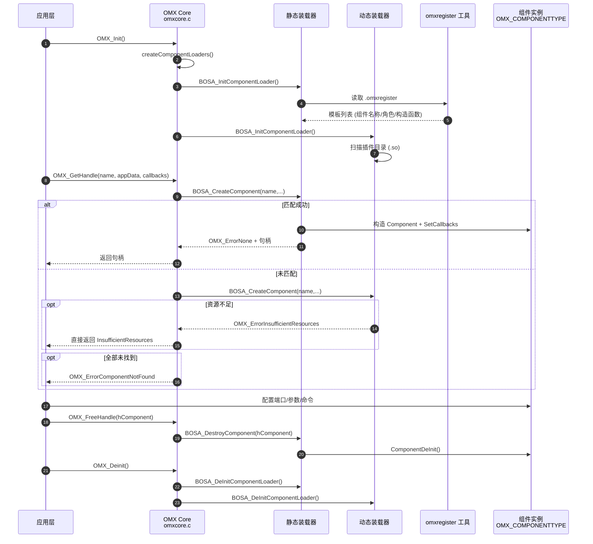
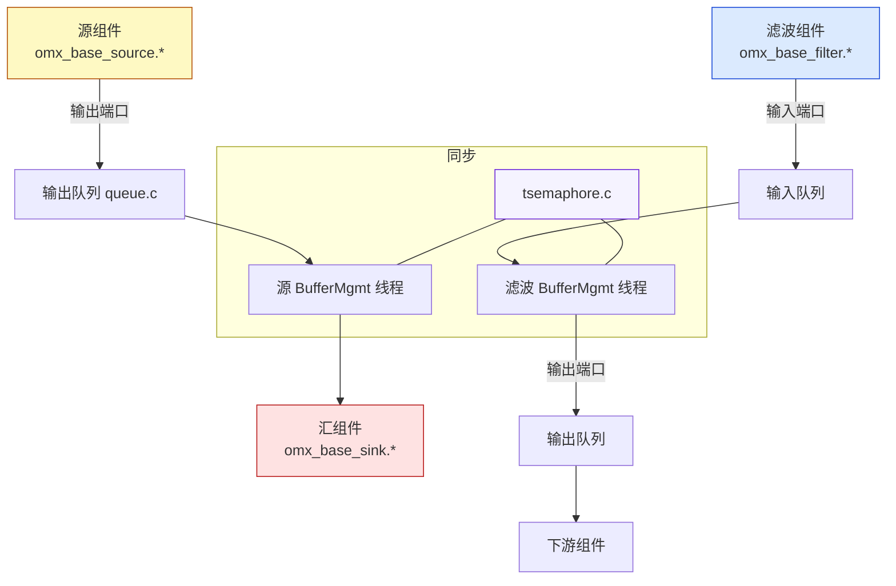
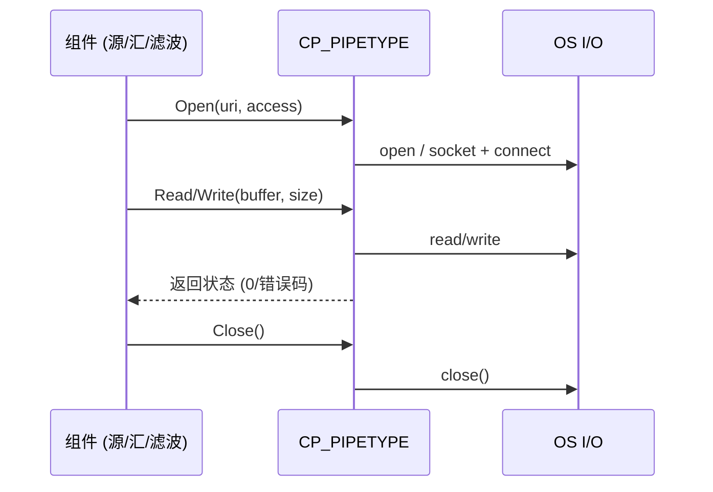

# Bellagio OpenMAX IL 代码架构图（详细）

> 版本：libomxil-bellagio 0.9.3  
> 位置：`libomxil-bellagio-0.9.3/`

本文件使用 Mermaid 绘制多视角架构图：分层、生命周期、装载器发现、组件创建、数据流与资源管理。可在支持 Mermaid 的渲染器中查看。

## 分层总览

```mermaid
graph TD
  A[应用层/IL Client] --> B[OpenMAX IL Core<br/>src/omxcore.c]
  B --> C{Loaders 列表<br/>BOSA_COMPONENTLOADER**}
  C --> C1[静态装载器<br/>src/st_static_component_loader.c]
  C --> C2[动态装载器<br/>src/dynamic_loader/ste_dynamic_component_loader.c]

  C1 --> R[组件注册表 .omxregister<br/>src/omxregister.c + src/common.c]
  C2 --> PLUG[插件目录 (OMX_COMPONENT_PATH)<br/>lib/plugindir]

  C1 --> TPL1[模板列表<br/>stLoaderComponentType**]
  C2 --> TPL2[模板列表<br/>steLoaderComponentType**]

  B --> BASE[基础组件层 (Base)<br/>src/base/*]
  BASE --> PORTS[端口模块<br/>audio/video/image/clock]
  BASE --> THREADS[Buffer 管理线程<br/>compMessageHandler/BufferMgmtFunction]

  B --> CP[内容管道 (Content Pipe)<br/>file/inet]
  CP --> CPF[file:// 管道<br/>content_pipe_file.*]
  CP --> CPI[inet:// 管道<br/>content_pipe_inet.*]

  B --> RM[参考资源管理器<br/>src/omx_reference_resource_manager.*]
  B --> EXT[Core 扩展<br/>src/core_extensions/*]
  B --> INC[OpenMAX 头文件<br/>include/OMX_*.h]

  style A fill:#f6f8fa,stroke:#666
  style B fill:#d0e6ff,stroke:#2b6cb0
  style C fill:#fff,stroke:#2b6cb0,stroke-dasharray: 5 5
  style C1 fill:#e2f0d9,stroke:#2f855a
  style C2 fill:#e2f0d9,stroke:#2f855a
  style BASE fill:#ffe4b5,stroke:#b7791f
  style CP fill:#fce7f3,stroke:#b83280
  style RM fill:#e9d8fd,stroke:#6b46c1
```

## 生命周期与典型调用序列



## 装载器发现流程（Linux）

```mermaid
flowchart TD
  S[Core 调用 createComponentLoaders()] --> C{检查
  XDG/HOME 下 .omxloaders
  与 $(libdir)/omxloaders/}
  C -->|均不存在| DEF[只添加静态装载器]
  C -->|存在 .omxloaders| LOADFILE[逐行读取库路径]
  LOADFILE --> DLOPEN1[dlopen 库]
  DLOPEN1 --> SETUP1[dlsym setup_component_loader]
  SETUP1 --> ADD1[BOSA_AddComponentLoader]
  C -->|存在目录| LOADDR[遍历目录 .so]
  LOADDR --> DLOPEN2[dlopen]
  DLOPEN2 --> SETUP2[dlsym setup_component_loader]
  SETUP2 --> ADD2[BOSA_AddComponentLoader]
  DEF --> ADDDEF[静态装载器 setup + Add]
```

## 静态装载器组件创建流程

```mermaid
flowchart LR
  R[打开 .omxregister] --> READ[按行读取库路径]
  READ --> DL[dlopen 组件库]
  DL --> SETUP[dlsym omx_component_library_Setup]
  SETUP --> TPL[填充模板列表 (stLoaderComponentType**)]
  TPL --> MATCH{匹配 name 或 name_specific}
  MATCH -->|成功| CTOR[调用组件构造函数]
  CTOR --> BASE[装配 Base 能力/端口]
  BASE --> CB[赋予 SetCallbacks]
  CB --> RET[返回 OMX_COMPONENTTYPE + OMX_ErrorNone]
  MATCH -->|失败| NEXT[继续遍历或返回未找到]
```

## Buffer 管理与数据流（Base 层）



## 内容管道交互（file/inet）



## 资源管理器交互（参考实现）

```mermaid
flowchart TD
  INIT[RM_Init()] --> RUN
  RUN --> GET[RM_getResource(openmaxStandComp)]
  GET -->|可用| USE[运行]
  GET -->|不可用| WAIT[RM_waitForResource(...)]
  USE --> REL[RM_releaseResource(...)]
  WAIT --> REL
  REL --> DEINIT[RM_Deinit() 清理列表/队列]
```

## 关键模块与文件映射

- 核心入口：`src/omxcore.c`（`OMX_Init/Deinit/GetHandle` 与装载器列表管理）
- 装载器发现：`src/omx_create_loaders_linux.c`（`.omxloaders` 与 `$(libdir)/omxloaders/`）
- 静态装载器：`src/st_static_component_loader.c`（读取 `.omxregister`、模板匹配与构造）
- 动态装载器：`src/dynamic_loader/ste_dynamic_component_loader.c`（扫描插件目录）
- 基础层：`src/base/*`（端口、线程、通用生命周期/命令）
- 内容管道：`src/content_pipe_file.*`、`src/content_pipe_inet.*`
- 资源管理：`src/omx_reference_resource_manager.*`
- 注册工具：`src/omxregister.c`；公共函数：`src/common.c`
- OpenMAX 头：`include/OMX_*.h`

---

如需导出为图片（PNG/SVG）或将图并入 `README`，告诉我你的偏好，我可以转换并链接。