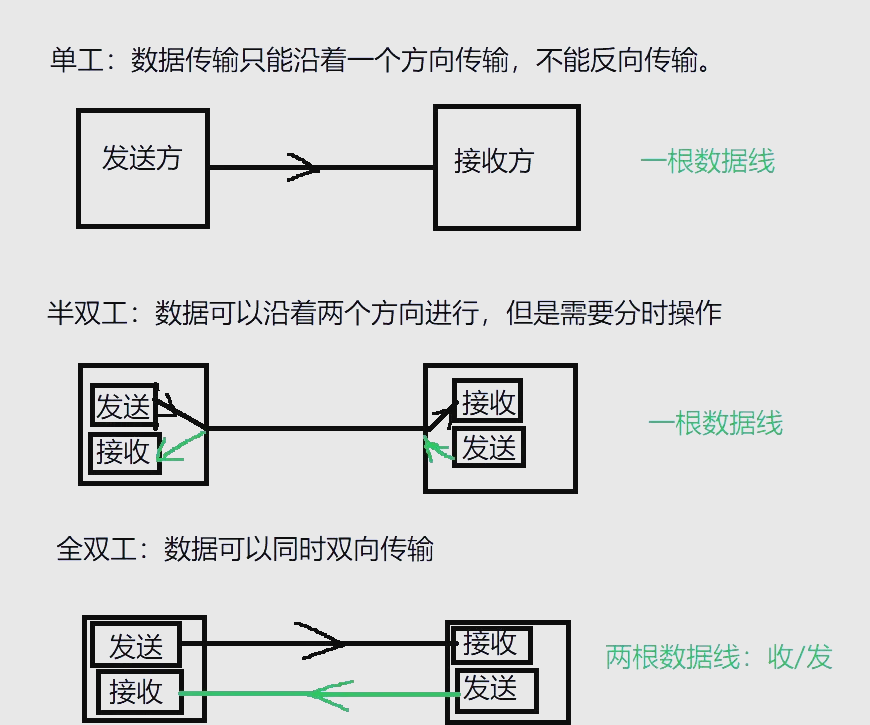
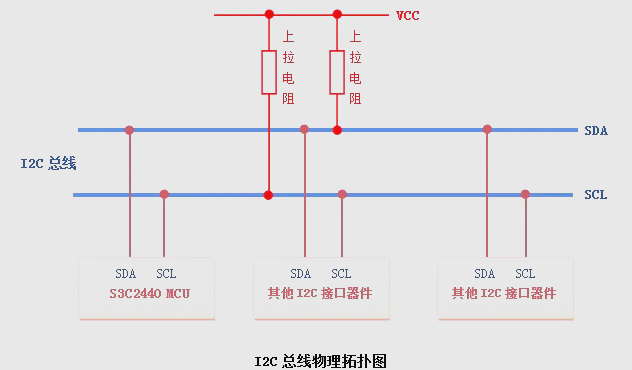
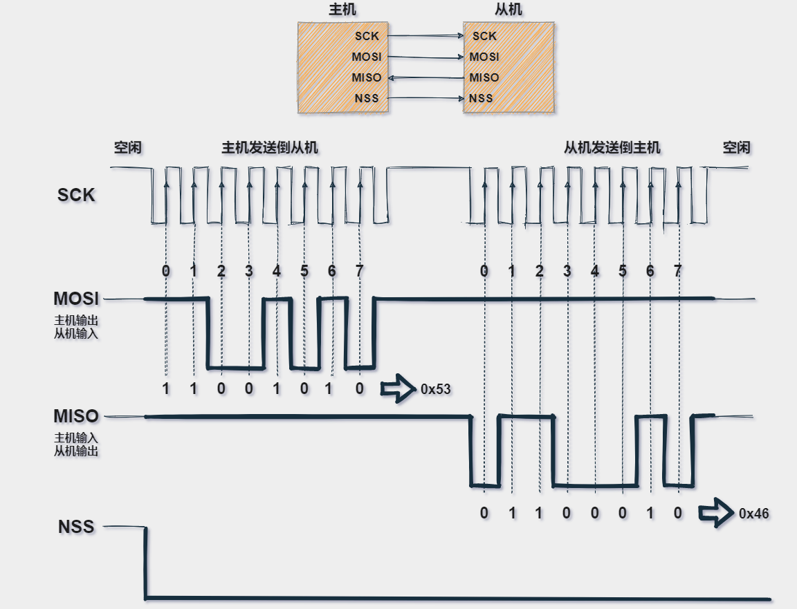
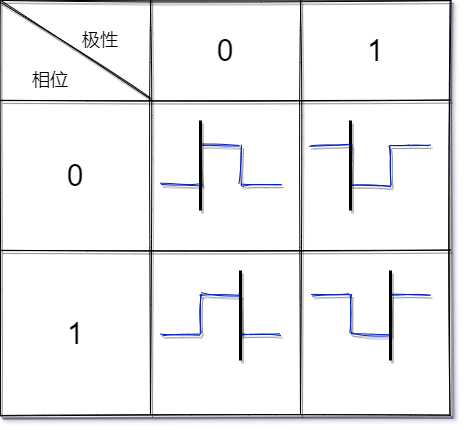
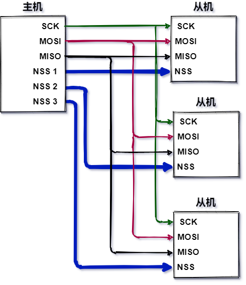
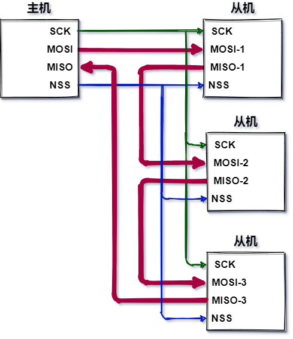
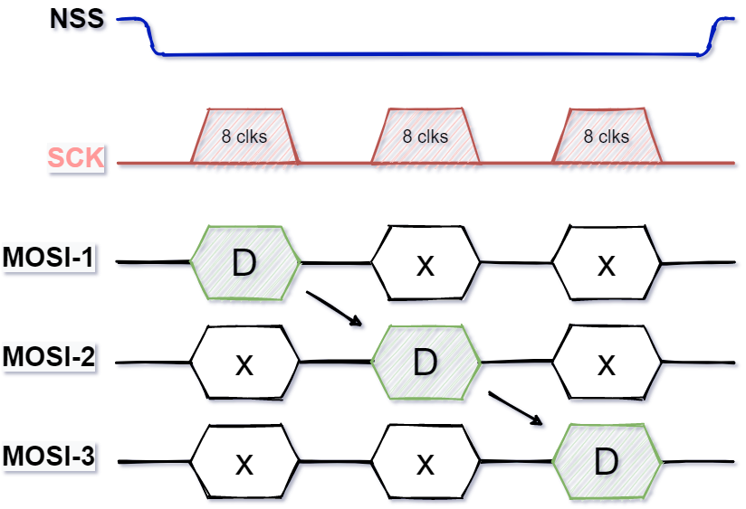

# 半双工与同步通讯、异步通讯的概念辨析

1 半双工的定义

在数据通信领域，数据传输方式可分为单工通信、半双工通信和全双工通信。半双工通信方式允许数据在两个方向上传输，但同一时间只能在一个方向上进行。这意味着它需要频繁切换传输方向，因此效率相对较低，但优点在于节省了传输线路资源。  


 同步通讯与异步通讯的概念  
同步通信，简而言之，就是在数据传输过程中，发送端会提供一个时钟信号，并遵循特定的约定（例如在时钟信号的上升沿发送数据）。接收端则根据这个时钟信号和共同约定来接收数据。这种通信方式常见于I2C、SPI等具有时钟信号的协议。

而异步通信则不同，接收方对数据的到达时间一无所知，收发双方各自拥有自己的时钟。发送方发送数据的时间间隔可能不均，而接收方则依赖数据的起始位和停止位来实现信息同步。这种传输方式通常以较小的数据分组进行，例如以一个字符为一组，并配备起始位和结束位。因此，异步通信的效率相对较低，但它在低速传输中较为常用。

接下来，我们进一步探讨同步通信与异步通信的区别：

（1）同步通信要求接收端和发送端的时钟频率保持一致，以确保连续的比特流传输；而异步通信则无需这种同步，发送端在发送完一个字节后，可以经过任意长的时间间隔再发送下一个字节。  
（2）在效率方面，同步通信通常高于异步通信。  
（3）从复杂性角度看，同步通信相对复杂，对双方时钟的误差要求较为严格；而异步通信则较为简单，允许双方时钟存在一定的误差。  
（4）此外，同步通信适用于点对多点的场景，而异步通信则主要适用于点对点的连接

# i2C

I2C协议是一种用于连接多个“从机”芯片和一个或多个“主机”芯片的通信协议。其设计类似于串行外设接口（SPI），同样适用于短距离通信场景。同时，它又与异步串行接口（如RS232或UART）相似，只需两根信号线即可实现信息交换。

在实现I2C通信时，两根信号线发挥着关键作用：SCL作为时钟信号线，而SDA则负责数据输入/输出。这种设计使得I2C通信既高效又便捷，且属于同步通信范畴，尽管其通信方向为半双工。总的来说，I2C协议以其短距离通信能力、一主多从的通信模式、半双工的通信方向以及仅需两根信号线的同步通信特点，成为了许多设备间通信的理想选择。



## I2C的高阻态

在I2C通信中，高阻态是一个关键概念。漏极开路（Open Drain）技术被用于实现这种状态，它允许设备独立地输出低电平和高阻态。若要产生高电平，则需要借助外部上拉电阻。

高阻状态是三态门电路的一种表现。除了高低电平，逻辑门的输出还可能处于高阻态，此时电路可被视为开路。在I2C系统中，所有设备都连接在同一条总线上。当某些设备进行通信时，其他空闲设备可能会受到总线干扰或干扰总线。为了维持总线的稳定，I2C规定空闲状态时必须由外部上拉电阻来控制，这将空闲设备置于高阻态，相当于断路状态。这样，只有开启的设备才会正常通信，从而确保不会干扰到其他设备。

## 数据传输协议

主设备和从设备之间进行数据传输时，必须遵循特定的协议格式。数据通过一条SDA数据线以串行方式传输0和1。串行数据的结构包括起始条件、数据传输、应答信号和停止条件等几个部分。  
1 开始位  
当主设备准备好启动通信时，它必须发送一个开始信号，并执行一系列操作来确保数据传输的顺利进行：

首先，将SDA数据线从高电平状态切换至低电平状态；  
随后，将SCL时钟线也从高电平切换至低电平状态。

一旦主设备发出这一开始条件信号，所有从设备，即便它们处于低功耗的睡眠模式，也会被唤醒并进入活动状态，准备接收地址信息。  
  
2 地址位  
地址位在I2C通信中占据重要地位，它支持7bit和10bit两种格式。当主设备需要与从设备进行数据交换时，首先会发送该从设备的地址。随后，系统会核对总线上的从设备地址，以确保准确无误地识别不同设备。地址位由主设备发送，而从设备则负责接收并识别这一地址，以确认是否为自己的地址。

3 读写位  
由于I2C通信采用半双工模式，因此需要明确数据传输的方向。为此，协议中引入了读写位的概念。当主设备意图向从设备发送数据时，该位被设置为0；而当主设备需要从从设备接收数据时，则将其设置为1。读写位同样由主设备发送，以通知从设备相应的操作类型。

4 应答位  
I2C协议中还设计了一个独特的应答机制。在每个字节传输结束后，即第9个SCL时钟周期内，主机会释放SDA总线，将控制权交给从机。由于上拉电阻的作用，此时总线处于高电平状态。如果从机成功接收到主机发送的数据，它会通过将SDA拉低的方式来发出应答信号，表示已收到并准备进行下一步操作。  
5 非应答信号  
在I2C通信中，如果从设备在第9个SCL时钟周期时未能成功接收到主设备发送的数据，或者由于某种原因无法响应，那么它会选择不发出应答信号。这种情况下，SDA线将保持高电平状态，即SDA保持为1，从而表示一个非应答信号。这种设计使得主设备能够感知到从设备的响应状态，并据此采取相应的措施。  
  
非应答信号的产生并非仅限于从机，主机在某些情况下也可能发出非应答信号。具体来说，产生非应答信号的情境包括：

I2C总线上不存在与主机所指定地址相匹配的从机设备；  
从机当前正忙于执行其他任务，尚未准备好与主机进行通信；  
主机发送的控制命令不被从机所支持；  
在主机接收从机数据的过程中，若数据已传输完毕，主机会发出非应答信号以通知从机停止发送数据。

此外，当SCL处于高电平状态时，SDA数据线上的数据必须保持稳定，以确保I2C数据总线的正常传输。因此，SDA上的数据变化只应在SCL为低电平时进行。  
在I2C通信中，每次传输的数据量为8位，这8位数据由发送方负责设置并传输给接收方。数据传输完毕后，会紧接着发送一个ACK（确认）或NACK（否认）信号。如果接收器成功接收到数据，那么从机会返回ACK信号；若接收失败，则从机会返回NACK信号。这一过程可以重复多次，直到接收到停止信号为止。

关于停止位的发送，当主设备决定结束通讯时，它需要执行以下操作：首先，将SDA数据线从低电压电平切换到高电压电平；紧接着，将SCL时钟线从高电平拉低至低电平。这样，就成功地发送了停止信号，标志着一次I2C通讯的结束。  
  
7 总结  
写寄存器的标准流程如下：  
Master首先发起START信号。  
接着，Master发送I2C地址（7位）和写操作位0（1位），并等待Slave的ACK信号。  
一旦收到Slave的ACK，Master继续发送寄存器地址（8位），并再次等待ACK。  
Slave再次发送ACK后，Master可以发送8位的数据到寄存器中，并等待最后的ACK信号。  
Slave确认无误后发送ACK，此时，第6步和第7步可以重复进行，以顺序写入多个寄存器。  
最后，Master发起STOP信号来结束写入过程。

读寄存器的流程则略有不同：  
Master同样发送I2C地址和写操作位0，但后续步骤有所不同。在Slave确认地址后，Master会先发起START信号，然后发送相同的I2C地址，但这次要带上读操作位1。Slave随后会发送8位的数据，即寄存器中的值。Master再发送ACK信号以确认接收。  
同样地，第8步和第9步也可以重复进行，以顺序读取多个寄存器的值。

## 仲裁机制

在多主设备的通信系统中，总线上可能存在多个节点，它们都拥有自己的寻址地址，并能作为从节点或主节点进行数据交换。然而，当两个或多个节点同时发送启动信号并开始数据传输时，就会产生冲突。为了解决这种冲突，I2C总线引入了仲裁机制。

I2C总线上的仲裁主要分为两部分：SCL线的同步和SDA线的仲裁。SCL线的同步依赖于总线的“与”逻辑功能，即当多个节点同时发送低电平时，总线表现为低电平；而只有当所有节点都发送高电平时，总线才表现为高电平。这种机制确保了当多个节点同时发送时钟信号时，总线上呈现的是统一的时钟信号，从而实现了SCL线的同步。  
  
2 SDA线的仲裁

总线仲裁的目的是为了解决多设备在I2C总线上同时竞争控制权的问题。这一机制通过特定的逻辑判断，决定哪个设备能够获得总线的控制权。

SDA线的仲裁同样基于总线的“与”逻辑功能。在I2C通信过程中，每个节点在发送完1位数据后，会检查总线上呈现的数据是否与自己发送的一致。如果一致，则继续发送数据；如果不一致，则退出竞争。这种机制确保了I2C总线在多个主节点同时尝试控制时，仍能保持通信的稳定和数据的不丢失。通过仲裁，总线系统只允许一个主节点持续占据总线，从而保证了通信的有序进行。  
  
  
上图过程详解：  
在首个周期，所有设备均发送1，经过与运算后，结果仍为1，这与它们各自发送的数据相吻合，因此继续发送。

到了第二个周期，情况依旧，所有设备均发送1，与运算结果依旧为1，继续发送。

然而，在第三个周期，情况发生了变化。所有设备这次都发送了0，与运算后的结果自然也为0。由于这个结果与AB设备发送的数据不符，而与C设备发送的数据相吻合，因此AB设备选择退出竞争，节点C获得了胜利。

值得注意的是，SDA仲裁与SCL时钟同步处理是并行进行的，两者并无先后之分。

## I2C死锁现象

在实际应用中，I2C总线有时会遭遇死锁问题。死锁现象在I2C中具体表现为：SCL信号保持高电平，而SDA信号却一直处于低电平状态。

当I2C主设备开始读写操作时，它会控制SCL产生8个时钟脉冲，随后将SCL拉低。在此过程中，从设备应答并将SDA拉低。然而，若主设备在此刻异常复位，SCL将释放为高电平。若从设备未同步复位，则会继续保持I2C应答状态，使SDA持续处于低电平。

对于I2C主设备而言，复位后检测到SDA仍为低电平，会误认为总线仍被占用，并因此持续等待SCL和SDA变为高电平。这样，主设备和从设备便相互等待，I2C总线陷入死锁状态。

同样地，在进行I2C读操作时，若从设备应答后输出数据位为0，而在此刻主设备异常复位，也会导致I2C总线进入死锁状态。

## i2c linux驱动

在 Linux 内核中 I2C 的体系结构分为 3 个部分：

### I2C 核心：

I2C 核心提供了 I2C 总线驱动和设备驱动的注册、注销方法等。

### I2C 总线驱动：

I2C 总线驱动是对 I2C 硬件体系结构中适配器端的实现，适配器可由CPU控制，甚至可以直接集成在 CPU 内部。

一般是soc商家写好

I2C 总线驱动的本质也是一个标准的 platform 驱动框架，所以说I2C总线驱动是基于 platform 框架实现的，相当于又封装了一层

### I2C 设备驱动：

I2C 设备驱动是对 I2C 硬件体系结构中设备端的实现，设备一般挂接在受CPU控制的 I2C 适配器上，通过 I2C 适配器与 CPU 交换数据。

用户需要些的

# mipi

13850 3588驱动移植

https://download.csdn.net/blog/column/12021233/127621511

[RK3568驱动OV13850摄像头模组调试过程-CSDN博客](https://blog.csdn.net/fhqlongteng/article/details/129366781)

[关于RK3399平台OV13850摄像头调试的问题_rk平台pclk没有输出波形-CSDN博客](https://blog.csdn.net/weixin_58535525/article/details/119797772)

[瑞芯微RK3588 camera驱动总结三调试_瑞芯微驱动-CSDN博客](https://blog.csdn.net/huntenganwei/article/details/141787550)

[基于瑞芯微RV1109 Linux触摸屏GT911驱动调试心得_专栏_易百纳技术社区](https://www.ebaina.com/articles/140000016840)

[rk3568 | 瑞芯微平台GPIO引脚驱动编写 - 阿风小子 - 博客园](https://www.cnblogs.com/kn-zheng/p/17150775.html)

https://mp.weixin.qq.com/s?__biz=MzA3MjMzNTc4NA==&mid=2649006423&idx=1&sn=e91d75f1aa9939036315d858584400fc&chksm=8664e4418698172d54178d41666cdbff208c2c7b76b3b8b8c205935137d7880d4fb35b6bbf71#rd

DPHY:使用单独的时钟同步通道 

CPHY：没有时钟，带宽比DPHY更高

这两个都是mipi的物理层协议，

3588中cam1和cam2中csi和phy同时出现可能是考虑 ​

 Cam1（CSI+D-PHY）而cam2是单独D-PHY

csi ：输入

dsi  ：输出

## 硬件篇

**一、什么是mipi总线**  

MIPI（Moblie Industry Processor Interface 移动产业处理器接口）：是由**MIPI联盟制定的一套通****信接口标准**，将移动设备的显示器、摄像头、基带等外部模块的通信接口标准化。

**二、mipi总线框架**

MIPI总线框架，按照应用层、协议层、物理层三个部分划分。  

**应用层：**功能模块使用MIPI总线进行数据传输，MIPI总线作为通信的功能模块如：摄像头、显示屏、触摸屏、存储、音频等。每个模块都会对在应用层**对数据进行编码和解析**。比如成熟的接口应用，MIPI-DSI（display serial interface）用于显示屏，MIPI-CSI（camera serial interface）用于摄像头。  

**协议层：**主要进行**数据组包、按照规范增加包头/包尾、传输通道管理**。  

**物理层：**由**PHY硬件模块组成**，直接涉及到物理PIN连线。


**三、物理PHY**

物理层的PHY类型D-PHY，C-PHY，M-PHY，**最成熟应用最多的是D-PHY，D-PHY支持DSI和CSI**。

**D-PHY**：**DDR源同步时钟双采样**（上升沿和下降沿同时采样）、**1组时钟lane、1~4组数据lane**，1.0版本lane最大传输速度1Gbps。叉分信号每组lane有2pin组成。

**C-PHY**：**内部时钟源**、**1~3组lane**，lane最大传输速度5.7Gbps，每组lane有3pin组成。

**M-PHY**：**受限外围器件的发展速度**，应用使用的比较少，最大传输速度11.6Gbps。  

**四、D-PHY的lane接口**

D-PHY模块由多组数据lane+1组时钟lane组成，每组lane是叉分信号，**对外为两个PIN，内部进行模式切换**，可支持模式**LP-TX**（low power发送）、**LP-RX**（low power接收）、**HS-TX**（high speed发送）、**HS-RX**（high speed接收）、**LP-CD**（low power contention detector）    


**五、MIPI总线特点（已移动设备使用的D-PHY说明）**

**1、抗干扰能力强**

MIPI总线D-PHY每组lane由2根PIN的**叉分信号**（**dp为高时dn为低，dp为低时dn为高**）  

**2、硬件设计简单**

MIPI总线最大支持1组时钟lane+4组数据lane，**最大10个pin脚**，相对较少，PCBA更容易走线。  

**3、功耗低**

MIPI总线高速模式下，**信号摆幅在200mv**，比USB、LVDS等高速传输接口的信号摆幅都要低。（**相同传输速度，信号摆幅越低，功耗越低**）  

**4、传输速度快**

MIPI的D-PHY随着版本的提升，传输速度也是越来越快，我们已单根lane的最大传输速度来看。即使是**V1.0版本单根lane速度也达到了1Gbps**，最大4lane，**吞吐量也是4Gbps**（**每秒可以传输40亿bit的数据**），在显示器、摄像头等需要大量数据传输的应用，mipi总线是很好的选择。

D-PHY V1.0：单根lane最大传输速度1Gbps  
D-PHY V1.1：单根lane最大传输速度1.5Gbps  
D-PHY V1.2：单根lane最大传输速度2.5Gbps  
D-PHY V2.0：单根lane最大传输速度4.0Gbps  
D-PHY V2.1：单根lane最大传输速度4.5Gbps

**下一期预告，将和大家分享MIPI协议层内容。**喜欢科技探索员的朋友，希望来个关注，我将持续和大家一起学习和分享。

## 物理层D-PHY

**一、D-PHY工作模式**  

无论MIPI-DSI协议还是MIPI-CSI协议，物理层均为D-PHY，D-PHY有低功耗模式(LP：low power模式)和高速传输模式（HS：high speed模式）两种模式。  

**LP模式**：最高数据速率10Mbps，**1.2V幅值（0~1.2v）**，在escape模式下**传输控制信号**。

**HS模****式**：根据DPHY版本不同，最高数据速率不同，V1.0版本单lane最大1Gbps，**200mv幅值（100mv~300mv）**，**高速传输图像和视频**。

**注意：**由于HS和LP模式的电平幅值差距比较大，测量信号的时候探头阻抗存在较大差异，测量信号的时候**不要空载测试**，连接上接收到设备。

**二、D-PHY模式切换**  

HS和LP两种模式动态切换，比如：在LP模式下发送完控制型号后，会切换到HS模式进行视频流的传输，视频流传输完成后，又会切换到LP模式。  

**D-PHY有控制字符，进行D-PHY的HS模式和LP模式的切换。**

**控制字符列表**（单根Lane上D+和D-的电平控制）：  


**模式切换字符序列**  
LP模式->HS模式：LP11，LP01，LP00  
HS模式->LP模式：LP11，LP10，LP00


**三、D-PHY的Lane**

D-PHY最多由1组时钟Lane，4组数据Lane组成。**需要****主控设备和从设备同时支持**。


**D-PHY的LP控制信号（escape模式），只在D-PHY的Lane0上，其它Lane线上只是数据传输。**  
因此在LP模式控制信号测量时，进行Lane0即可。数据信号测量，则需要同时进行1组时钟+4组Lane的测试。

在DSI和CSI协议中，会有专门的lane通道管理，会根据通道选通情况，将数据合理的分配到每根Lane线上。

**下一期预告，将和大家分享MIPI-CSI2协议解析。**喜欢科技探索员的朋友，希望来个关注，我将持续和大家一起学习和分享。

## MIPI-CSI（camera serial interface）：

处理器与摄像头之前的高速串行接口。MIPI联盟基于camera制定的CSI接口标准，即传输协议

**一、MIPI-CSI简介**

MIPI-CSI（camera serial interface）：处理器与摄像头之前的高速串行接口。MIPI联盟基于camera制定的CSI接口标准，即传输协议。

MPI CSI-2的协议划分为5个层级：**应用层、组包/解包层、底层协议层、通道管理层、物理层。**


如上图是CSI-2的分层方式，左边是发送方，右边是接收方。发送方从**应用层****产生图像数据**（YUV、RGB、RAW等格式），应用层通过控制信号，**控制数据流传输**（帧头、帧同步标志，行同步标志等）。然后数据传输到**像素打包层****，将像素按照顺序打包为byte为单位的数据包格式**。然后**底层协议层****会将byte数据添加上包头、包尾**、根据控制信号增加控制短包，然后**通道管理层****将数据按照支持的通道进行分割并行传输**。最后物理层将分割好的数据，在每根lane上串行传输。

**二、CSI应用层**

应用层主要**产生图像数据以及控制信号**，如下图为标准的图像数据流。  


**通过帧同步和行同步信号控制一帧图像的传输**（帧同步控制一帧图像的传输    ，行同步控制一行数据的传输），MIPI传输包含帧头标志、行开始标志、行结束标志等，以及图像数据包的数据字节数。（以及传输1行数据为480个像素点，数据格式为RGB888，因此一行数据包的数据字节数为480*3个字节）。  

像素数据格式有**YUV、RAW、RGB格式**，描述**数据格式有专门的Data Type来记录**。

**RGB格式ID**:  


YUV格式ID：  


**RAW格式ID**:


**三、CSI组包/解包层**  

CSI组包/解包层主要是**将像素数据转换为byte数据包格式**，针对不同的数据类型，转换为byte数据包格式存在差异，下面以RAW10像素格式例举，像素到byte数据包的转换。


如上图，RAW10每个像素是10位数据，一行数据首先是包头，然后依次传输P1-P4的像素点的高8位，然后将P1-P4像素的低2位拼接为1个byte。


每个**byte数据以LSB的方式存储**（最低有效位，低位影响数据的精度），如上图可以看到每个byte传输先传输的是最低位。

**四、CSI底层协议层**  

CSI底层协议层，主要是**将图像数据打包添加包头和包尾**，分为长包和短包。  


**短包主要传输控制功能的包**，短包结构如下：


短包中的**Data ID由虚拟通道和data type两部分组成**  


**虚拟通道2位，控制4个通道的开关，便于数据包如何拆分数据，分配到可用通道，进行并行的数据传输。**  


**Data Type 低6位描述数据类型**，类型如下：  


**短包支持的Data Type**如下：


短包中的**word count，记录包体要传输的byte数量**。**ECC则是进行包头数据校验**（即Data id和WC的数据进行异或校验）。  

长包主要用于数据的传输，长包结构如下：


长包中的Data ID、WC、ECC与短包拥有一样的包头。数据按照组包层给到的byte数据放入。

# uart

因为UART没有时钟信号，无法控制何时发送数据，也无法保证双发按照完全相同的速度接收数据。因此，双方以不同的速度进行数据接收和发送，就会出现问题。

如果要解决这个问题，UART为每个字节添加额外的**起始位**和**停止位**，以帮助接收器在数据到达时进行同步；

双方还必须事先就**传输速度达成共识**（设置相同的波特率，例如每秒9600位）。

传输速率如果有微小差异不是问题，因为接收器会在每个字节的开头重新同步。相应的协议如下图所示

这就是所谓的异步串行

**目录**

[1、UART简介](https://cloud.tencent.com/developer?from_column=20421&from=20421)

[2、UART特性](https://cloud.tencent.com/developer?from_column=20421&from=20421)

[3、UART协议帧](https://cloud.tencent.com/developer?from_column=20421&from=20421)

[3.1、起始位](https://cloud.tencent.com/developer?from_column=20421&from=20421)

[3.2、数据位](https://cloud.tencent.com/developer?from_column=20421&from=20421)

[3.3、奇偶校验位](https://cloud.tencent.com/developer?from_column=20421&from=20421)

[3.4、停止位](https://cloud.tencent.com/developer?from_column=20421&from=20421)

[4、UART通信步骤](https://cloud.tencent.com/developer?from_column=20421&from=20421)

---

## 1、UART简介

UART（Universal Asynchronous Receiver/Transmitter，通用异步收发器）是一种双向、串行、异步的通信总线，仅用一根数据接收线和一根数据发送线就能实现全双工通信。典型的串口通信使用3根线完成，分别是：发送线（TX）、接收线（RX）和地线（GND），通信时必须将双方的TX和RX交叉连接并且GND相连才可正常通信，如下图所示：


## 2、UART特性

UART 接口不使用时钟信号来同步发送器和接收器设备，而是以异步方式传输数据。发送器根据其时钟信号生成的位流取代了时钟信号，接收器使用其内部时钟信号对输入数据进行采样。

同步点是通过两个设备的相同波特率（UART和大多数串行通信一样，发送和接收设备需要将波特率（波特率是指信息传输到信道的速率）设置为相同的值。对于串行端口，设定的波特率将用作每秒传输的最大位数）来管理的。

如果波特率不同，发送和接收数据的时序可能会受影响，导致数据处理过程出现不一致。允许的波特率差异最大值为10%，超过此值，位的时序就会脱节。


下总结了关于UART必须了解的几点：

| 导线数量   | 3根（TX、RX和GND）                                 |
| ------ | --------------------------------------------- |
| 速度     | 1200、2400、4800、9600、19200、38400、57600、115200等 |
| 传输方式   | 全双工异步                                         |
| 最大主机数量 | 1                                             |
| 最大从机数量 | 1                                             |

## 3、UART协议帧

在 UART中，传输模式为数据包形式。数据包由起始位、数据帧、奇偶校验位和停止位组成。


### 3.1、起始位

当不传输数据时， UART 数据传输线通常保持高电压电平。若要开始数据传输，发送UART 会将传输线从高电平拉到低电平并保持1 个时钟周期。

当接收 UART 检测到高到低电压跃迁时，便开始以波特率对应的频率读取数据帧中的位。


### 3.2、数据位

数据帧包含所传输的实际数据。如果使用奇偶校验位，数据帧长度可以是5 位到 8 位。如果不使用奇偶校验位，数据帧长度可以是9 位。

在大多数情况下，数据以最低有效位优先方式发送。


### 3.3、奇偶校验位

奇偶性描述数字是偶数还是奇数。通过奇偶校验位，接收 UART判断传输期间是否有数据发生改变。电磁辐射、不一致的波特率或长距离数据传输都可能改变数据位。

校验位可以配置成 1 位偶校验或 1 位奇校验或无校验位。

接收UART 读取**数据帧**后，将统计数值为 1 的位，检查总数是偶数还是奇数。如果奇偶校验位为0 （偶数奇偶校验），则数据帧中的1或逻辑高位总计应为偶数。如果奇偶校验位为 1 （奇数奇偶校验），则数据帧中的1 或逻辑高位总计应为奇数。

当奇偶校验位与数据匹配时，UART 认为传输未出错。但是，如果奇偶校验位为0 ，而总和为奇数，或者奇偶校验位为 1 ，而总和为偶数，则UART 认为数据帧中的位已改变。


### 3.4、停止位

为了表示数据包结束，发送 UART 将数据传输线从低电压驱动到高电压并保持1 到 2 位时间。


## 4、UART通信步骤

第1步：数据从数据总线到发送器。


第2步：发送 UART 将起始位、奇偶校验位和停止位添加到数据帧。


第3步：从起始位到结束位，整个数据包以串行方式从发送器送至接收 器 。

接收 UART 以预配置的波特率对数据线进行采样。


第4步：接收 器 丢弃数据帧中的起始位、奇偶校验位和停止位。


第5步：接收 器 将串行数据转换回并行数据，并将其传输到接收端的数据总线。


# spi

spi是同步全双工协议

是一个同步的数据总线，也就是说它是用**单独的数据线**和**一个单独的时钟信号**来保证**发送端和接收端的完美同步**。

**时钟是一个振荡信号，它告诉接收端在确切的时机对数据线上的信号进行采样。**

产生时钟的一侧称为**主机**，另一侧称为**从机**。总是**只有一个主机**（一般来说可以是**微控制器/MCU**），但是可以有多个**从机

SPI总线包括4条逻辑线，定义如下：

- **MISO**：`Master input slave output` 主机输入，从机输出（数据来自从机）；

- **MOSI**：`Master output slave input` 主机输出，从机输入（数据来自主机）；

- **SCLK** ： `Serial Clock` 串行时钟信号，由主机产生发送给从机；

- **SS**：`Slave Select` 片选信号，由主机发送，以控制与哪个从机通信，通常是低电平有效信号。

整体的传输大概可以分为以下几个过程：

- 主机先将`NSS`信号拉低，这样保证开始接收数据；

- 当**接收端**检测到时钟的边沿信号时，它将立即读取**数据线**上的信号，这样就得到了一位数据（1`bit`）;
  
  > 由于时钟是随数据一起发送的，因此指定**数据的传输速度并不重要**，尽管设备将具有可以运行的最高速度（稍后我们将讨论选择合适的时钟边沿和速度）。

- **主机**发送到**从机**时：主机产生相应的时钟信号，然后数据**一位一位**地将从`MOSI`信号线上进行发送到从机；

- **主机**接收**从机**数据：如果从机需要将数据发送回主机，则主机将继续生成预定数量的时钟信号，并且从机会将数据通过`MISO`信号线发送；



#注意，SPI是“全双工”（具有单独的发送和接收线路），因此可以在同一时间发送和接收数据，另外SPI的接收硬件可以是一个简单的移位寄存器。这比异步串行通信所需的完整UART要简单得多，并且更加便宜；

### 时钟频率

SPI总线上的主机必须在通信开始时候配置并生成相应的时钟信号。在每个SPI时钟周期内，都会发生**全双工数据传输**。

主机在`MOSI`线上发送一位数据，从机读取它，而从机在`MISO`线上发送一位数据，主机读取它。

就算只进行单向的数据传输，也要保持这样的顺序。这就意味着无论接收任何数据，必须实际发送一些东西！在这种情况下，我们称其为虚拟数据；

从理论上讲，只要实际可行，时钟速率就可以是您想要的任何速率，当然这个速率受限于每个系统能提供多大的系统时钟频率，以及最大的SPI传输速率。

### 时钟极性 CKP/Clock Polarity

除了配置串行时钟速率（频率）外，SPI主设备还需要配置**时钟极性**。

根据硬件制造商的命名规则不同，时钟极性通常写为**CKP**或**CPOL**。时钟极性和相位共同决定读取数据的方式，比如信号上升沿读取数据还是信号下降沿读取数据；

**CKP**可以配置为1或0。这意味着您可以根据需要将时钟的默认状态（IDLE）设置为高或低。极性反转可以通过简单的逻辑逆变器实现。您必须参考设备的数据手册才能正确设置CKP和CKE。

- `CKP = 0`：时钟空闲`IDLE`为低电平 `0`；
- `CKP = 1`：时钟空闲`IDLE`为高电平`1`；

### 时钟相位 CKE /Clock Phase (Edge)

除配置串行时钟速率和极性外，SPI主设备还应配置时钟相位（或边沿）。根据硬件制造商的不同，时钟相位通常写为**CKE**或**CPHA**；

顾名思义，时钟相位/边沿，也就是采集数据时是在时钟信号的具体相位或者边沿；

- `CKE = 0`：在时钟信号`SCK`的第一个跳变沿采样；
- `CKE = 1`：在时钟信号`SCK`的第二个跳变沿采样；
- 

综上几种情况，下图总结了所有时钟配置组合，并突出显示了实际采样数据的时刻；

> 其中黑色线为采样数据的时刻；
> 
> 蓝色线为SCK时钟信号；

# 

## 模式编号

SPI的时钟极性和相位的配置通常称为 **SPI模式**，所有可能的模式都遵循以下约定；具体如下表所示；

| **SPI Mode** | **CPOL** | **CPHA** |
| ------------ | -------- | -------- |
| 0 [00]       | 0        | 0        |
| 1 [01]       | 0        | 1        |
| 2 [10]       | 1        | 0        |
| 3 [11]       | 1        | 1        |

## 多从机模式

前面说到SPI总线必须有一个主机，可以有多个从机，那么具体连接到SPI总线的方法有以下两种：

### 第一种方法：多NSS

1. 通常，每个从机都需要一条单独的SS线。
2. 如果要和特定的从机进行通讯，可以将相应的`NSS`信号线拉低，并保持其他`NSS`信号线的状态为高电平；如果同时将两个`NSS`信号线拉低，则可能会出现乱码，因为从机可能都试图在同一条`MISO`线上传输数据，最终导致接收数据乱码。

具体连接方式如下图所示；



### 第二种：菊花链

在数字通信世界中，在设备信号（总线信号或中断信号）以串行的方式从一 个设备依次传到下一个设备，不断循环直到数据到达目标设备的方式被称为**菊花链**。

1. 菊花链的最大缺点是因为是信号串行传输，所以一旦数据链路中的某设备发生故障的时候，它下面优先级较低的设备就不可能得到服务了；
2. 另一方面，距离主机越远的从机，获得服务的优先级越低，所以需要安排好从机的优先级，并且设置总线检测器，如果某个从机超时，则对该从机进行短路，防止单个从机损坏造成整个链路崩溃的情况；

具体的连接如下图所示；



其中红线加粗为数据的流向；

所以最终的数据流向图可以表示为：



SCK为时钟信号，8clks表示8个边沿信号；

其中D为数据，X为无效数据；

所以不难发现，菊花链模式充分使用了SPI其移位寄存器的功能，整个链充当通信移位寄存器，每个从机在下一个时钟周期将输入数据复制到输出。

## 优缺点

### SPI通讯的优势

使SPI作为串行通信接口脱颖而出的原因很多；

- 全双工串行通信；
- 高速数据传输速率。
- 简单的软件配置；
- 极其灵活的数据传输，不限于8位，它可以是任意大小的字；
- 非常简单的硬件结构。从站不需要唯一地址（与I2C不同）。从机使用主机时钟，不需要精密时钟振荡器/晶振（与UART不同）。不需要收发器（与CAN不同）。

### SPI的缺点

- 没有硬件从机应答信号（主机可能在不知情的情况下无处发送）；
- 通常仅支持一个主设备；
- 需要更多的引脚（与I2C不同）；
- 没有定义硬件级别的错误检查协议；
- 与RS-232和CAN总线相比，只能支持非常短的距离；

## 波形示例：

而下图中的波形，展示了8位数据通过SPI总线传输的过程，逻辑与上述芯片描述一致，我们对照图片来做简单解读。

1、CS由高电平变为低电平后，从设备被使能，可以与主机通信；通信结束后，主机将CS拉高，从设备无法继续参与通信。

2、主机配置工作模式为Mode0，CLK为0表示空闲状态，可以看到下图中，数据线（MISO/MOSI）总是在CLK为高电平时保持，在CLK为低电平时改变。

3、MOSI在奇数个边沿采样，即主机在上升沿时发送数据，MISO则在下降沿时接收数据。


## spi驱动例程

设备树：

```
&ecspi3 {
    status = "okay";
    pinctrl-names = "default";
    pinctrl-0 = <&pinctrl_ecspi3>;
    spidev@0 {
        compatible = "my-spi-device";
        spi-max-frequency = <1000000>;
        reg = <0>;
    };
};
```

#### 三、关键实现细节说明

1. ​**​模式配置​**​  
   通过`spi->mode`设置CPOL/CPHA，需与设备规格一致（如`SPI_MODE_0`表示CPOL=0, CPHA=0）

2. ​**​时钟控制​**​  
   `spi-max-frequency`定义设备树中的最大时钟频率，实际频率由控制器能力决定

3. ​**​数据传输​**​  
   使用`spi_message`和`spi_transfer`结构封装传输请求，支持多段数据传输

4. ​**​错误处理​**​
   
   - 检查`spi_sync()`返回值
   - 实现`remove()`函数释放资源
   - 使用`copy_to_user()`验证用户空间指针

```
#include <linux/module.h>
#include <linux/spi/spi.h>
#include <linux/fs.h>

#define DEVICE_NAME "spi_demo"

static struct spi_device *spi_dev;
static int major;
static struct class *spi_class;

// SPI传输函数示例
static int spi_transfer_data(u8 *tx_buf, u8 *rx_buf, int len) {
    struct spi_transfer tr = {
        .tx_buf = tx_buf,
        .rx_buf = rx_buf,
        .len = len,
    };
    struct spi_message msg;

spi_message_init(&msg);
spi_message_add_tail(&tr, &msg);
return spi_sync(spi_dev, &msg); // 同步传输[7,8](@ref)

}

// 字符设备操作函数
static ssize_t spi_read(struct file *filp, char __user *buf, size_t count, loff_t *pos) {
    u8 tx[3] = {0x01, 0x80, 0x00}; // 示例读命令
    u8 rx[3];
    int ret = spi_transfer_data(tx, rx, sizeof(tx));
    if (copy_to_user(buf, rx, sizeof(rx))) return -EFAULT;
    return sizeof(rx);
}

static struct file_operations fops = {
    .owner = THIS_MODULE,
    .read = spi_read,
};

// SPI设备探测函数
static int spi_probe(struct spi_device *spi) {
    spi_dev = spi;
    spi->mode = SPI_MODE_0; // 设置SPI模式[4,9](@ref)
    spi->bits_per_word = 8;
    return spi_setup(spi);
}

static const struct spi_device_id spi_id[] = {
    { "my-spi-device", 0 },
    {}
};

static struct spi_driver spi_demo_driver = {
    .driver = {
        .name = DEVICE_NAME,
        .owner = THIS_MODULE,
    },
    .probe = spi_probe,
    .id_table = spi_id,
};

// 模块初始化
static int __init spi_init(void) {
    major = register_chrdev(0, DEVICE_NAME, &fops);
    spi_class = class_create(THIS_MODULE, DEVICE_NAME);
    device_create(spi_class, NULL, MKDEV(major, 0), NULL, DEVICE_NAME);
    return spi_register_driver(&spi_demo_driver); // 注册SPI驱动[6,8](@ref)
}

module_init(spi_init);
module_exit(spi_demo_exit);
MODULE_LICENSE("GPL");
```

# lvds

它是硬件接口。类似于USB

# pwm

（Pulse Width Modulation，脉冲宽度调制）

PWM（脉宽调制）通过调节占空比来控制功率开关器件的导通时间，最终实现输出电压的稳定，其核心原理是 **通过快速开关的周期性通断，控制能量的平均输出**。

1.     PWM的基本原理
    占空比（Duty Cycle：指一个周期内开关导通时间（高电平时间）与整个周期时间的比值。  
     公式：  
     占空比 = （导通时间\周期时间）*100% 
     开关频率：PWM信号的周期倒数（10Hz=表示每秒开关10次）。  
     频率越高，输出纹波越小，但开关损耗可能增加。
   
   2. 功率开关器件的导通控制
      功率开关器件（如MOSFET、IGBT）在导通时允许电流流过，截止时阻断电流。  
      通过PWM控制导通时间：  
      占空比大 → 导通时间长 → 平均输出电压高。  
      占空比小 → 导通时间短 → 平均输出电压低。  
      例如：  
      若输入电压为12V，占空比为50%，则平均输出电压约为6V。  
      占空比为75%时，平均输出电压约为9V。
   
   3. 如何实现“输出电压稳定”
      关键在于 闭环反馈控制，典型应用场景是开关电源（如BUCK、BOOST电路）：  
      步骤1：采样输出电压
      通过电阻分压或传感器实时监测输出电压Vout。  
      步骤2：与参考电压比较
      将采样电压与目标参考电压（Vref，如5V）输入误差放大器，生成误差信号。  
      步骤3：动态调整占空比
      若 Vout< Vref→ 增大占空比 → 导通时间延长 → 提升输出电压。  
      若 Vout > Vref→ 减小占空比 → 导通时间缩短 → 降低输出电压。  
      步骤4：周期性调节
      PWM控制器根据误差信号实时调整占空比，直到输出电压稳定在目标值。
   
   4. 举例说明（BUCK降压电路）
      输入电压Vin：24V  
      目标输出电压Vout：12V  
      理论占空比：  
      D = Vout/Vin = 12/24= 50% 
      实际运行：  
      当负载突然增大 → Vout下降 → 控制器检测到误差 → 占空比增大至55% → 输出恢复12V。  
      当输入电压波动（如24V→22V）→ 占空比自动调整至更高值（如55%）以补偿输入降低的影响

            应用：

1. ​**​电机控制​**​
   
   - ​**​调速原理​**​：改变PWM占空比可调节电机平均电压，占空比越大转速越高
     
     ​**​闭环控制​**​：结合速度反馈（如编码器）和PID算法，实现精准调速
   
   - 

2. ​**​LED调光​**​
   
   - 通过高频PWM（>80Hz）调节占空比，改变LED亮度，人眼感知为连续变化

3. ​**​电源转换​**​
   
   - ​**​DC-DC转换器​**​：通过调整占空比实现升压或降压，效率可达90%以上

4. ​**​音频与通信​**​
   
   - ​**​D类功放​**​：将音频信号编码为PWM波，经滤波还原为模拟信号
     
     ​**​信号传输​**​：PWM抗噪性强，适合远距离数字通信
     
     

# 差分信号


# usb

## vbus

VBUS通常指USB接口的供电电压（标准为5V）
